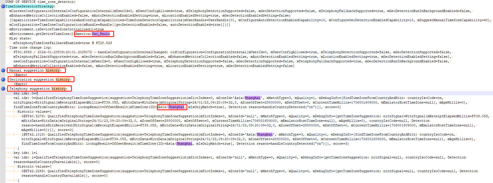
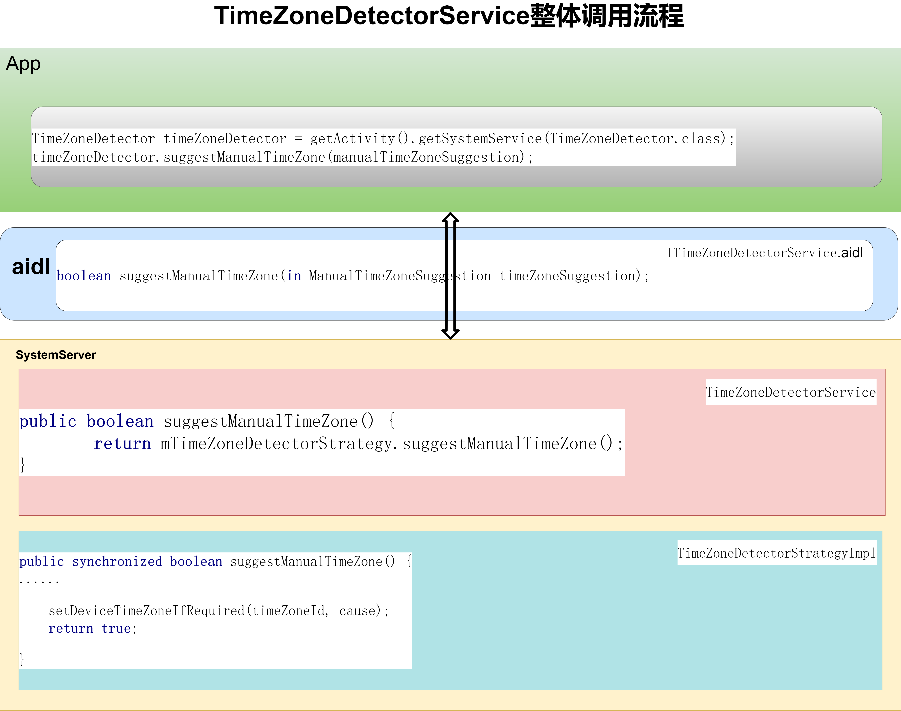
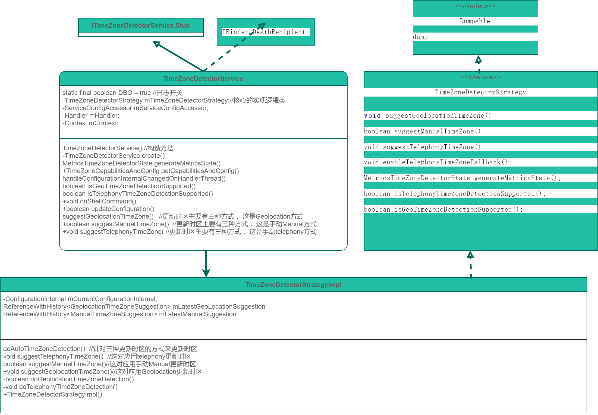

# P10: 系统开发之浅谈TimeZoneDetectorService


---

# 问题描述：
客户有一个关闭通话功能的需求，根据MTK的配置方法关闭了大概8个宏开关后，实现通话功能，但是导致插好sim卡开机后，时间和时区不能更新的问题。

---

# 问题分析：
(1).MTK的日志分析，可以确认为时间已经更新，但是时区确实是没有更新

//收到NITZ
```java
AT      : [0] AT< +CTZEU: "+32",0,"2024/01/23,01:52:53" (RIL_URC_READER, tid:518565289216)
SST     : NITZ: 24/01/23,01:52:53+32,0,39429, ageMs=0 start=41502 delay=2073
```

//更新时间

```java
NitzStateMachineImpl: doTimeZoneDetection: countryIsoCode=null, nitzSignal=NitzSignal{mReceiptElapsedMillis=PT39.429S, mNitzData=NitzData{mOriginalString=24/01/23,01:52:53+32,0, mZoneOffset=28800000, mDstOffset=0, mCurrentTimeMillis=1705974773000, mEmulatorHostTimeZone=null}, mAgeMillis=0}, suggestion=TelephonyTimeZoneSuggestion{mSlotIndex=0, mZoneId='null', mMatchType=0, mQuality=0, mDebugInfo=[getTimeZoneSuggestion: nitzSignal=NitzSignal{mReceiptElapsedMillis=PT39.429S, mNitzData=NitzData{mOriginalString=24/01/23,01:52:53+32,0, mZoneOffset=28800000, mDstOffset=0, mCurrentTimeMillis=1705974773000, mEmulatorHostTimeZone=null}, mAgeMillis=0}, countryIsoCode=null, Detection reason=handleNitzReceived(NitzSignal{mReceiptElapsedMillis=PT39.429S, mNitzData=NitzData{mOriginalString=24/01/23,01:52:53+32,0, mZoneOffset=28800000, mDstOffset=0, mCurrentTimeMillis=1705974773000, mEmulatorHostTimeZone=null}, mAgeMillis=0})]}, reason=handleNitzReceived(NitzSignal{mReceiptElapsedMillis=PT39.429S, mNitzData=NitzData{mOriginalString=24/01/23,01:52:53+32,0, mZoneOffset=28800000, mDstOffset=0, mCurrentTimeMillis=1705974773000, mEmulatorHostTimeZone=null}, mAgeMillis=0})
AlarmManagerService: Setting time of day to sec=1705974775
```

//detect timezone， 但是没有更新时区
```java
NitzStateMachineImpl: doTimeZoneDetection: countryIsoCode=cn, nitzSignal=NitzSignal{mReceiptElapsedMillis=PT39.429S, mNitzData=NitzData{mOriginalString=24/01/23,01:52:53+32,0, mZoneOffset=28800000, mDstOffset=0, mCurrentTimeMillis=1705974773000, mEmulatorHostTimeZone=null}, mAgeMillis=0}, suggestion=TelephonyTimeZoneSuggestion{mSlotIndex=0, mZoneId='Asia/Shanghai', mMatchType=3, mQuality=1, mDebugInfo=[findTimeZoneFromCountryAndNitz: countryIsoCode=cn, nitzSignal=NitzSignal{mReceiptElapsedMillis=PT39.429S, mNitzData=NitzData{mOriginalString=24/01/23,01:52:53+32,0, mZoneOffset=28800000, mDstOffset=0, mCurrentTimeMillis=1705974773000, mEmulatorHostTimeZone=null}, mAgeMillis=0}, findTimeZoneFromCountryAndNitz: lookupResult=OffsetResult{mTimeZone(ID)=Asia/Shanghai, mIsOnlyMatch=true}, Detection reason=handleCountryDetected("cn")]}, reason=handleCountryDetected("cn")
```


(2).分析bugreport日志：

可以确定时区识别策略已经通过Telephony suggestion history成功的识别到了Asia/Shanghai，但是为什么没有更新时区，原因未知。



其实上面的数据，我们也可以看出时区的更新和三个有关：

(一)：Manual

(二)：Geolocation

(三)：Telephony


(3).添加日志分析

我在TimeZoneDetectorStrategyImpl.doAutoTimeZoneDetection添加相关的日志，

```java
Slog.d(LOG_TAG, "doAutoTimeZoneDetection currentUserConfig.getDetectionMode()=" + currentUserConfig.getDetectionMode());
```

发现其返回的识别模式为DETECTION_MODE_MANUAL：

```java
time_zone_detector: doAutoTimeZoneDetection currentUserConfig.getDetectionMode()=1
```

而DETECTION_MODE_MANUAL时，实现代码为空，什么都没有做，所以才会出现更新时区无效的情况：

```java
private void doAutoTimeZoneDetection(
        @NonNull ConfigurationInternal currentUserConfig, @NonNull String detectionReason) {
    // Use the correct algorithm based on the user's current configuration. If it changes, then
    // detection will be re-run.
    Slog.d(LOG_TAG, "doAutoTimeZoneDetection currentUserConfig.getDetectionMode()=" + currentUserConfig.getDetectionMode());
    switch (currentUserConfig.getDetectionMode()) {
        case ConfigurationInternal.DETECTION_MODE_MANUAL:
            // No work to do.
            break;
```


那为什么明明是Telephony,返回是Manual呢？

进一步追踪代码，发现ConfigurationInternal.getDetectionMode()：

应该是mTelephonyDetectionSupported为false，返回值为false，导致最后返回类型为manual，确实是我们关闭通话导致的。


```java
public @DetectionMode int getDetectionMode() {
    if (!getAutoDetectionEnabledBehavior()) {
        return DETECTION_MODE_MANUAL;//返回为manual
    } else if (isGeoDetectionSupported() && getLocationEnabledSetting()
            && getGeoDetectionEnabledSetting()) {
        return DETECTION_MODE_GEO;
    } else {
        return DETECTION_MODE_TELEPHONY;
    }
}

public boolean getAutoDetectionEnabledBehavior() {
    return isAutoDetectionSupported() && mAutoDetectionEnabledSetting;
}

public boolean isAutoDetectionSupported() {
    return mTelephonyDetectionSupported || mGeoDetectionSupported;
    //应该是mTelephonyDetectionSupported为false，返回值为false，导致最后返回类型为manual
    //确实是我们关闭通话导致的。
}
```

---

# 问题解决

原因定位到了，那解决方案就好定了。

我们针对关闭通话的情况，进行适配处理一下，强行更新时区或强行修改返回类型都可以。

---

# TimeZoneDetectorService 的作用：

TimeZoneDetectorService类主要是用来更新时区的。

---

# 获取TimeZoneDetectorService的方式：

```java
方式1
TimeZoneDetector timeZoneDetector = getActivity().getSystemService(TimeZoneDetector.class);


方式2
ITimeZoneDetectorService mITimeZoneDetectorService;
mITimeZoneDetectorService = ITimeZoneDetectorService.Stub.asInterface(ServiceManager.getServiceOrThrow(Context.TIME_ZONE_DETECTOR_SERVICE));

```

---

# TimeZoneDetectorService整体调用流程



以suggestManualTimeZone为例：

(1)在app中调用suggestManualTimeZone：

```java
TimeZoneDetector timeZoneDetector = getActivity().getSystemService(TimeZoneDetector.class);
timeZoneDetector.suggestManualTimeZone(manualTimeZoneSuggestion);
```


(2)在ITimeZoneDetectorService.aidl中定义suggestManualTimeZone：

```java
interface ITimeZoneDetectorService {
  TimeZoneCapabilitiesAndConfig getCapabilitiesAndConfig();
  void addListener(ITimeZoneDetectorListener listener);
  void removeListener(ITimeZoneDetectorListener listener);

  boolean updateConfiguration(in TimeZoneConfiguration configuration);

  boolean suggestManualTimeZone(in ManualTimeZoneSuggestion timeZoneSuggestion);
  void suggestTelephonyTimeZone(in TelephonyTimeZoneSuggestion timeZoneSuggestion);
}
```

(3)在TimeZoneDetectorService实现suggestManualTimeZone

```java
public boolean suggestManualTimeZone(@NonNull ManualTimeZoneSuggestion timeZoneSuggestion) {
    enforceSuggestManualTimeZonePermission();
    Objects.requireNonNull(timeZoneSuggestion);

    int userId = mCallerIdentityInjector.getCallingUserId();
    final long token = mCallerIdentityInjector.clearCallingIdentity();
    try {
        return mTimeZoneDetectorStrategy.suggestManualTimeZone(userId, timeZoneSuggestion);
    } finally {
        mCallerIdentityInjector.restoreCallingIdentity(token);
    }
}
```

(4)具体在TimeZoneDetectorStrategyImpl.java中实现suggestManualTimeZone

```java
public synchronized boolean suggestManualTimeZone(
        @UserIdInt int userId, @NonNull ManualTimeZoneSuggestion suggestion) {

    ConfigurationInternal currentUserConfig = mCurrentConfigurationInternal;
    if (currentUserConfig.getUserId() != userId) {
        Slog.w(LOG_TAG, "Manual suggestion received but user != current user, userId=" + userId
                + " suggestion=" + suggestion);

        // Only listen to changes from the current user.
        return false;
    }

    Objects.requireNonNull(suggestion);

    String timeZoneId = suggestion.getZoneId();
    String cause = "Manual time suggestion received: suggestion=" + suggestion;

    TimeZoneCapabilitiesAndConfig capabilitiesAndConfig =
            currentUserConfig.createCapabilitiesAndConfig();
    TimeZoneCapabilities capabilities = capabilitiesAndConfig.getCapabilities();
    if (capabilities.getSuggestManualTimeZoneCapability() != CAPABILITY_POSSESSED) {
        Slog.i(LOG_TAG, "User does not have the capability needed to set the time zone manually"
                + ", capabilities=" + capabilities
                + ", timeZoneId=" + timeZoneId
                + ", cause=" + cause);
        return false;
    }

    // Record the manual suggestion for debugging / metrics (but only if manual detection is
    // currently enabled).
    // Note: This is not used to set the device back to a previous manual suggestion if the user
    // later disables automatic time zone detection.
    mLatestManualSuggestion.set(suggestion);

    setDeviceTimeZoneIfRequired(timeZoneId, cause);
    return true;
}
```

---

# TimeZoneDetectorService类图



可以看出TimeZoneDetectorService类，其具体实现是由TimeZoneDetectorStrategy类完成的。

在TimeZoneDetectorService类中，三种更新时区的接口分别为：


```java
suggestGeolocationTimeZone()   //更新时区主要有三种方式 ，这是Geolocation方式
+boolean suggestManualTimeZone()  //更新时区主要有三种方式 ，这是手动Manual方式
+void suggestTelephonyTimeZone( //更新时区主要有三种方式 ，这是手动telephony方式
```

而在TimeZoneDetectorStrategy中，三种更新时区的接口分别为：

```java
void suggestTelephonyTimeZone(）//这对应用telephony更新时区
boolean suggestManualTimeZone()//这对应用手动Manual更新时区
+void suggestGeolocationTimeZone()//这对应用Geolocation更新时区
```

其我们上面提到的doAutoTimeZoneDetection接口，更是关注的重点：

```java
doAutoTimeZoneDetection(）//针对三种更新时区的方式来更新时区
```


```java
private void doAutoTimeZoneDetection(
        @NonNull ConfigurationInternal currentUserConfig, @NonNull String detectionReason) {
    // Use the correct algorithm based on the user's current configuration. If it changes, then
    // detection will be re-run.
    switch (currentUserConfig.getDetectionMode()) {
        case ConfigurationInternal.DETECTION_MODE_MANUAL:
            // No work to do.
            break;
        case ConfigurationInternal.DETECTION_MODE_GEO: {
            boolean isGeoDetectionCertain = doGeolocationTimeZoneDetection(detectionReason);
            // When geolocation detection is uncertain of the time zone, telephony detection
            // can be used if telephony fallback is enabled and supported.
            if (!isGeoDetectionCertain
                    && mTelephonyTimeZoneFallbackEnabled.getValue()
                    && currentUserConfig.isTelephonyFallbackSupported()) {
                doTelephonyTimeZoneDetection(detectionReason + ", telephony fallback mode");
            }
            break;
        }
        case ConfigurationInternal.DETECTION_MODE_TELEPHONY:
            doTelephonyTimeZoneDetection(detectionReason);
            break;
        default:
            Slog.wtf(LOG_TAG, "Unknown detection mode: "
                    + currentUserConfig.getDetectionMode());
    }
}
```

完美闭环！


---

# 启动 TimeZoneDetectorService 服务：

SystemServer.java

```java
private static final String TIME_ZONE_DETECTOR_SERVICE_CLASS =
        "com.android.server.timezonedetector.TimeZoneDetectorService$Lifecycle";

t.traceBegin("StartTimeZoneDetectorService");
try {
    mSystemServiceManager.startService(TIME_ZONE_DETECTOR_SERVICE_CLASS);
} catch (Throwable e) {
    reportWtf("starting StartTimeZoneDetectorService service", e);
}
t.traceEnd();
```

---

# publishBinderService--Lifecycle

```java
/**
 * Handles the lifecycle for {@link TimeZoneDetectorService}.
 */
public static class Lifecycle extends SystemService {

    public Lifecycle(@NonNull Context context) {
        super(context);
    }

    @Override
    public void onStart() {
        TimeZoneDetectorService service = TimeZoneDetectorService.create(getContext());

        // Publish the binder service so it can be accessed from other (appropriately
        // permissioned) processes.
        publishBinderService(Context.TIME_ZONE_DETECTOR_SERVICE, service);
    }
}

private static TimeZoneDetectorService create(@NonNull Context context) {
    final TimeZoneDetectorStrategy timeZoneDetectorStrategy =
            TimeZoneDetectorStrategyImpl.create(context);

    TimeZoneDetectorService service =
            new TimeZoneDetectorService(context, handler, timeZoneDetectorStrategy);
    //字段AUTO_TIME_ZONE内容观察模式
    ContentResolver contentResolver = context.getContentResolver();
    contentResolver.registerContentObserver(
            Settings.Global.getUriFor(Settings.Global.AUTO_TIME_ZONE), true,
            new ContentObserver(handler) {
                public void onChange(boolean selfChange) {
                    service.handleAutoTimeZoneDetectionChanged();
                }
            });
    return service;
}
```


---

# 注册 TimeZoneDetectorService 服务：

SystemServiceRegistry.java

```java
registerService(Context.TIME_ZONE_DETECTOR_SERVICE, TimeZoneDetector.class,
        new CachedServiceFetcher<TimeZoneDetector>() {
            @Override
            public TimeZoneDetector createService(ContextImpl ctx)
                    throws ServiceNotFoundException {
                return new TimeZoneDetectorImpl();
            }});
```


---

# 参考资料

1.[Android系统开发之TimeZoneDetectorService浅析--上](https://blog.csdn.net/hfreeman2008/article/details/135871074)

https://blog.csdn.net/hfreeman2008/article/details/135871074

2.[Android系统开发之TimeZoneDetectorService浅析--下](https://blog.csdn.net/hfreeman2008/article/details/135895224)

https://blog.csdn.net/hfreeman2008/article/details/135895224

---

# 结束语

