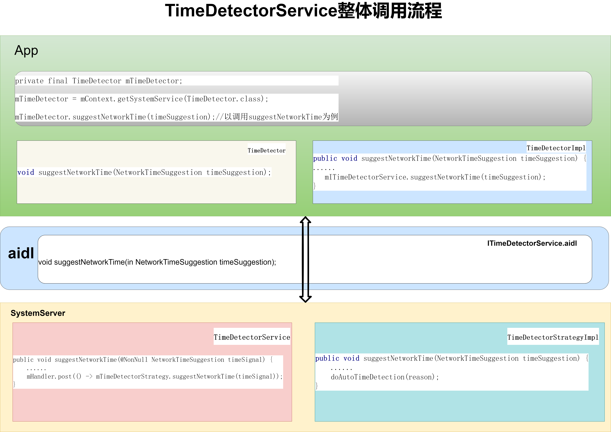
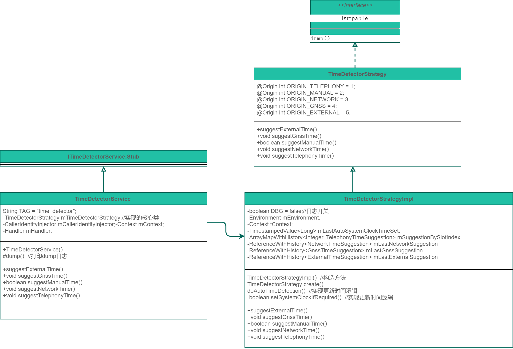

# P11: 系统开发之浅谈TimeDetectorService


---

# TimeDetectorService 时间识别服务是做什么的

简单来说，TimeDetectorService 时间识别服务是用来更新设备时间的。

其具体的说明文档为：

```java
/**
 * The implementation of ITimeDetectorService.aidl.
 *
 * <p>This service is implemented as a wrapper around {@link TimeDetectorStrategy}. It handles
 * interaction with Android framework classes, enforcing caller permissions, capturing user identity
 * and making calls async, leaving the (consequently more testable) {@link TimeDetectorStrategy}
 * implementation to deal with the logic around time detection.
 */
```
---

# 获取 TimeDetectorService 的方式：

```java
方式1
TimeDetector mTimeDetector = mContext.getSystemService(TimeDetector.class);

方式2
ITimeDetectorService mITimeDetectorService = ITimeDetectorService.Stub.asInterface(
        ServiceManager.getServiceOrThrow(Context.TIME_DETECTOR_SERVICE));
```

---

# TimeDetectorService整体调用流程

以调用TimeDetectorService的suggestNetworkTime接口为例：




- 在app应用中调用TimeDetectorService的suggestNetworkTime接口：

```java
private final TimeDetector mTimeDetector;
mTimeDetector = mContext.getSystemService(TimeDetector.class);
mTimeDetector.suggestNetworkTime(timeSuggestion);//以调用suggestNetworkTime为例
```

- suggestNetworkTime基接口定义在：

frameworks/base/core/java/android/app/timedetector/TimeDetector.java

```java
void suggestNetworkTime(NetworkTimeSuggestion timeSuggestion);
```


- 在TimeDetectorImpl文件中将其和TimeDetectorService关联：

frameworks/base/core/java/android/app/timedetector/TimeDetectorImpl.java

```java
private final ITimeDetectorService mITimeDetectorService;

public TimeDetectorImpl() throws ServiceNotFoundException {
    mITimeDetectorService = ITimeDetectorService.Stub.asInterface(
            ServiceManager.getServiceOrThrow(Context.TIME_DETECTOR_SERVICE));
}

public void suggestNetworkTime(NetworkTimeSuggestion timeSuggestion) {
    if (DEBUG) {
        Log.d(TAG, "suggestNetworkTime called: " + timeSuggestion);
    }
    try {
        mITimeDetectorService.suggestNetworkTime(timeSuggestion);
    } catch (RemoteException e) {
        throw e.rethrowFromSystemServer();
    }
}

```

- systemserver启动TimeDetectorService服务：

frameworks/base/services/java/com/android/server/SystemServer.java

```java
t.traceBegin("StartTimeDetectorService");
try {
    mSystemServiceManager.startService(TIME_DETECTOR_SERVICE_CLASS);
} catch (Throwable e) {
    reportWtf("starting TimeDetectorService service", e);
}
t.traceEnd();
```


- 同时注册和关联对应的TimeDetectorService相关类：

frameworks/base/core/java/android/app/SystemServiceRegistry.java

```java
registerService(Context.TIME_DETECTOR_SERVICE, TimeDetector.class,
        new CachedServiceFetcher<TimeDetector>() {
            @Override
            public TimeDetector createService(ContextImpl ctx)
                    throws ServiceNotFoundException {
                return new TimeDetectorImpl();
            }});
```


- aidl定义ITimeDetectorService：

frameworks/base/core/java/android/app/timedetector/ITimeDetectorService.aidl

```java
interface ITimeDetectorService {
  TimeCapabilitiesAndConfig getCapabilitiesAndConfig();
  boolean updateConfiguration(in TimeConfiguration timeConfiguration);

  void suggestExternalTime( in ExternalTimeSuggestion timeSuggestion);
  void suggestGnssTime(in GnssTimeSuggestion timeSuggestion);
  boolean suggestManualTime(in ManualTimeSuggestion timeSuggestion);
  void suggestNetworkTime(in NetworkTimeSuggestion timeSuggestion);
  void suggestTelephonyTime(in TelephonyTimeSuggestion timeSuggestion);
}
```


- TimeDetectorService的类的定义：

在接口suggestNetworkTime，可以看到具体的实现是调用mTimeDetectorStrategy类对应的接口。

frameworks/base/services/core/java/com/android/server/timedetector/TimeDetectorService.java

```java
public void suggestNetworkTime(@NonNull NetworkTimeSuggestion timeSignal) {
    enforceSuggestNetworkTimePermission();
    Objects.requireNonNull(timeSignal);
    //可以看到具体的实现是调用mTimeDetectorStrategy类对应的接口
    mHandler.post(() -> mTimeDetectorStrategy.suggestNetworkTime(timeSignal));
}
```
---

# TimeDetectorService类图




可以看出，更新设备的时间，主要有5种方式：

- telephony
- manual
- network
- gnss
- external

```java
@Origin int ORIGIN_TELEPHONY = 1;
@Origin int ORIGIN_MANUAL = 2;
@Origin int ORIGIN_NETWORK = 3;
@Origin int ORIGIN_GNSS = 4;
@Origin int ORIGIN_EXTERNAL = 5;
```

---

# Dump信息：

dump信息可以看出，更新时间的方式主要有：

```java
Telephony suggestion history:
Network suggestion history:
Gnss suggestion history:
External suggestion history:
```

对应上面的除manual的四种方式。

```java
DUMP OF SERVICE time_detector:
TimeDetectorStrategy:
  mLastAutoSystemClockTimeSet=null
  mEnvironment.isAutoTimeDetectionEnabled()=true
  mEnvironment.elapsedRealtimeMillis()=PT5M5.465S (305465)
  mEnvironment.systemClockMillis()=2024-01-23T09:24:35.683Z (1706001875683)
  mEnvironment.systemClockUpdateThresholdMillis()=2000
  mEnvironment.autoTimeLowerBound()=2024-01-22T13:29:05Z (1705930145000)
  mEnvironment.autoOriginPriorities()=[network,telephony]
  Time change log:
  Telephony suggestion history:
    key idx: 0=0
    val idx: 0=TelephonyTimeSuggestion{mSlotIndex='0', mUnixEpochTime=TimestampedValue{mReferenceTimeMillis=39050, mValue=1706001609000}, mDebugInfo=[Sending new time suggestion nitzSignal=NitzSignal{mReceiptElapsedMillis=PT39.05S, mNitzData=NitzData{mOriginalString=24/01/23,09:20:09+32,0, mZoneOffset=28800000, mDstOffset=0, mCurrentTimeMillis=1706001609000, mEmulatorHostTimeZone=null}, mAgeMillis=0}, reason=handleNitzReceived(NitzSignal{mReceiptElapsedMillis=PT39.05S, mNitzData=NitzData{mOriginalString=24/01/23,09:20:09+32,0, mZoneOffset=28800000, mDstOffset=0, mCurrentTimeMillis=1706001609000, mEmulatorHostTimeZone=null}, mAgeMillis=0})]}
      Historic values=[
        0@PT40.534S: TelephonyTimeSuggestion{mSlotIndex='0', mUnixEpochTime=TimestampedValue{mReferenceTimeMillis=39050, mValue=1706001609000}, mDebugInfo=[Sending new time suggestion nitzSignal=NitzSignal{mReceiptElapsedMillis=PT39.05S, mNitzData=NitzData{mOriginalString=24/01/23,09:20:09+32,0, mZoneOffset=28800000, mDstOffset=0, mCurrentTimeMillis=1706001609000, mEmulatorHostTimeZone=null}, mAgeMillis=0}, reason=handleNitzReceived(NitzSignal{mReceiptElapsedMillis=PT39.05S, mNitzData=NitzData{mOriginalString=24/01/23,09:20:09+32,0, mZoneOffset=28800000, mDstOffset=0, mCurrentTimeMillis=1706001609000, mEmulatorHostTimeZone=null}, mAgeMillis=0})]}
      ]
  Network suggestion history:
    0@PT52.15S: NetworkTimeSuggestion{mUnixEpochTime=TimestampedValue{mReferenceTimeMillis=52136, mValue=1706001622844}, mDebugInfo=[Origin: NetworkTimeUpdateService. event=3]}
  Gnss suggestion history:
    {Empty}
  External suggestion history:
    {Empty}
```

---


# 启动 TimeDetectorService 服务：

SystemServer.java

```java
private static final String TIME_DETECTOR_SERVICE_CLASS =
        "com.android.server.timedetector.TimeDetectorService$Lifecycle";

t.traceBegin("StartTimeDetectorService");
try {
    mSystemServiceManager.startService(TIME_DETECTOR_SERVICE_CLASS);
} catch (Throwable e) {
    reportWtf("starting StartTimeDetectorService service", e);
}
t.traceEnd();
```

---

# publishBinderService--Lifecycle

```java
public static class Lifecycle extends SystemService {

    public Lifecycle(@NonNull Context context) {
        super(context);
    }

    @Override
    public void onStart() {
        TimeDetectorService service = TimeDetectorService.create(getContext());

        // Publish the binder service so it can be accessed from other (appropriately
        // permissioned) processes.
        publishBinderService(Context.TIME_DETECTOR_SERVICE, service);
    }
}


private static TimeDetectorService create(@NonNull Context context) {
    TimeDetectorStrategy timeDetectorStrategy = new TimeDetectorStrategyImpl();

    TimeDetectorService timeDetectorService =
            new TimeDetectorService(context, handler, timeDetectorStrategy);
    
    //字段AUTO_TIME_ZONE内容观察模式
    // Wire up event listening.
    ContentResolver contentResolver = context.getContentResolver();
    contentResolver.registerContentObserver(
            Settings.Global.getUriFor(Settings.Global.AUTO_TIME), true,
            new ContentObserver(handler) {
                public void onChange(boolean selfChange) {
                    timeDetectorService.handleAutoTimeDetectionChanged();
                }
            });

    return timeDetectorService;
}
```

---

# 注册 TimeDetectorService 服务：

SystemServiceRegistry.java

```java
registerService(Context.TIME_DETECTOR_SERVICE, TimeDetector.class,
        new CachedServiceFetcher<TimeDetector>() {
            @Override
            public TimeDetector createService(ContextImpl ctx)
                    throws ServiceNotFoundException {
                return new TimeDetectorImpl();
            }});
```


---

# 结束语

