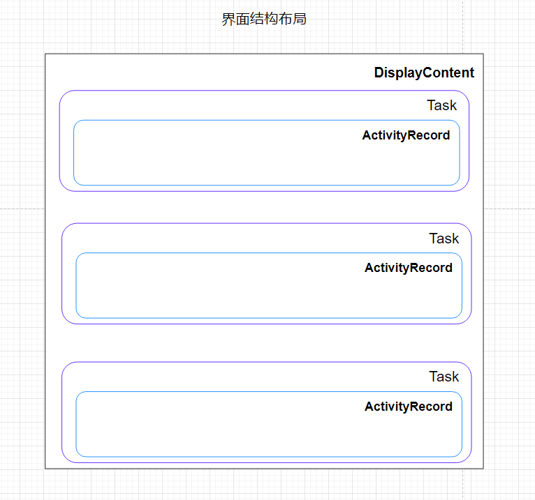
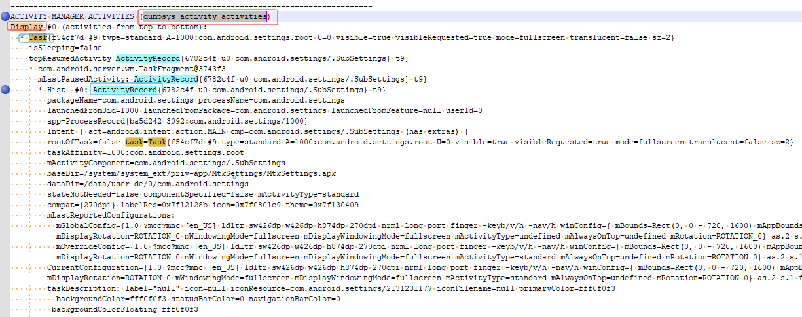
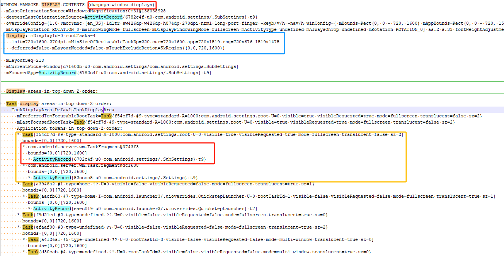

# P12_系统开发之浅谈WindowManagerService


---

# WindowManagerService 类的作用：

wms是窗口的管理者，负责窗口的启动，添加，删除和更新，窗口动画，窗口的大小和层级，还有壁纸，水印，输入系统的中转站，Surface管理等各个方面的一个综合管理体。

---

# 获取wms的方式：

```java
方式1
WindowManager mWindowManager;
mWindowManager = (WindowManager) context.getSystemService(Context.WINDOW_SERVICE);


方式2
WindowManager mWindowManager;
mWindowManager = mContext.getSystemService(WindowManager.class);


方式3
IWindowManager sWindowManagerService;
sWindowManagerService = IWindowManager.Stub.asInterface(ServiceManager.getService("window"));


方式4 (system server进程使用)
WindowManagerInternal mWindowManagerService;
mWindowManagerService = WindowManagerGlobal.getWindowManagerService();

方式5 (system server进程使用)
WindowManagerInternal mWindowManagerService;
mWindowManagerService = LocalServices.getService(WindowManagerInternal.class);
```
---

# WindowManagerService调用流程


以isKeyguardLocked为例，查看WindowManagerService调用流程：

(1)app应用中调用isKeyguardLocked:

```java
WindowManagerGlobal.getWindowManagerService().isKeyguardLocked()
```

(2)获取IWindowManager服务

 WindowManagerGlobal.getWindowManagerService()

```java
public static IWindowManager getWindowManagerService() {
    synchronized (WindowManagerGlobal.class) {
        if (sWindowManagerService == null) {
            sWindowManagerService = IWindowManager.Stub.asInterface(
                    ServiceManager.getService("window"));
            try {
                if (sWindowManagerService != null) {
                    ValueAnimator.setDurationScale(
                            sWindowManagerService.getCurrentAnimatorScale());
                    sUseBLASTAdapter = sWindowManagerService.useBLAST();
                }
            } catch (RemoteException e) {
                throw e.rethrowFromSystemServer();
            }
        }
        return sWindowManagerService;
    }
}
```

(3)IWindowManager.aidl定义isKeyguardLocked

```java
@UnsupportedAppUsage
boolean isKeyguardLocked();
```

(4)WindowManagerService.isKeyguardLocked

```java
public boolean isKeyguardLocked() {
    return mPolicy.isKeyguardLocked();
}
```

(5)WindowManagerPolicy.isKeyguardLocked

```java
public boolean isKeyguardLocked();
```

(6)在SystemServer启动WindowManagerService服务：
```java
t.traceBegin("StartWindowManagerService");
// WMS needs sensor service ready
ConcurrentUtils.waitForFutureNoInterrupt(mSensorServiceStart, START_SENSOR_SERVICE);
mSensorServiceStart = null;
wm = WindowManagerService.main(context, inputManager, !mFirstBoot, mOnlyCore,
        new PhoneWindowManager(), mActivityManagerService.mActivityTaskManager);
ServiceManager.addService(Context.WINDOW_SERVICE, wm, /* allowIsolated= */ false,
        DUMP_FLAG_PRIORITY_CRITICAL | DUMP_FLAG_PROTO);
ServiceManager.addService(Context.INPUT_SERVICE, inputManager,
        /* allowIsolated= */ false, DUMP_FLAG_PRIORITY_CRITICAL);
t.traceEnd();
```

(7)注册WindowManagerService服务：

SystemServiceRegistry.java

```java
registerService(Context.WINDOW_SERVICE, WindowManager.class,
        new CachedServiceFetcher<WindowManager>() {
    @Override
    public WindowManager createService(ContextImpl ctx) {
        return new WindowManagerImpl(ctx);
    }});
```

---

# WindowManagerService添加view的详细分析

参考：

[android开发浅谈之Window和WindowManager](https://blog.csdn.net/hfreeman2008/article/details/111882109)

https://blog.csdn.net/hfreeman2008/article/details/111882109


[android开发浅谈之DecorView与ViewRootImpl](https://blog.csdn.net/hfreeman2008/article/details/111913489)

https://blog.csdn.net/hfreeman2008/article/details/111913489


[android开发浅谈之View测量流程(Measure)](https://blog.csdn.net/hfreeman2008/article/details/111996784)

https://blog.csdn.net/hfreeman2008/article/details/111996784


---

# 以addView()接口为例，看一下其调用流程

图二 增加删除更新View的类图

(1)在app应用中调用WindowManager.addView()接口：

```java
WindowManager mWm = context.getSystemService(WindowManager.class);
mWm.addView(mContentContainer, params);
mWm.updateViewLayout(mContentContainer, params);
mWm.removeView(mContentContainer);
```

(2)其对应WindowManager.addView：

frameworks/base/core/java/android/view/WindowManagerImpl.java

```java
@Override
public void addView(@NonNull View view, @NonNull ViewGroup.LayoutParams params) {
    applyTokens(params);
    mGlobal.addView(view, params, mContext.getDisplayNoVerify(), mParentWindow,
            mContext.getUserId());
}

@Override
public void updateViewLayout(@NonNull View view, @NonNull ViewGroup.LayoutParams params) {
    applyTokens(params);
    mGlobal.updateViewLayout(view, params);
}

@Override
public void removeView(View view) {
    mGlobal.removeView(view, false);
}
```

(3)其对应WindowManagerGlobal.java中定义接口：

frameworks/base/core/java/android/view/WindowManagerGlobal.java

```java
public void addView(View view, ViewGroup.LayoutParams params,
        Display display, Window parentWindow, int userId) {
    ......
    ViewRootImpl root;
    View panelParentView = null;
        ......
        if (windowlessSession == null) {
            root = new ViewRootImpl(view.getContext(), display);
        } else {
            root = new ViewRootImpl(view.getContext(), display,
                    windowlessSession);
        }
        view.setLayoutParams(wparams);
        mViews.add(view);//add view
        mRoots.add(root);
        mParams.add(wparams);
        //添加view的实现逻辑
        root.setView(view, wparams, panelParentView, userId);
    ......
}

public void updateViewLayout(View view, ViewGroup.LayoutParams params) {
     ......
    final WindowManager.LayoutParams wparams = (WindowManager.LayoutParams)params;
    view.setLayoutParams(wparams);
    synchronized (mLock) {
        int index = findViewLocked(view, true);
        ViewRootImpl root = mRoots.get(index);
        mParams.remove(index);
        mParams.add(index, wparams);
        root.setLayoutParams(wparams, false);
    }
}

public void removeView(View view, boolean immediate) {
    ......
    synchronized (mLock) {
        int index = findViewLocked(view, true);
        View curView = mRoots.get(index).getView();
        removeViewLocked(index, immediate);
        if (curView == view) {
            return;
        }
    ......
}
```

(3)Session.addToDisplayAsUser调用wms的addWindow方法

```java
 WindowManagerService mService;
 
public int addToDisplayAsUser(IWindow window, WindowManager.LayoutParams attrs,
        int viewVisibility, int displayId, int userId, InsetsVisibilities requestedVisibilities,
        InputChannel outInputChannel, InsetsState outInsetsState,
        InsetsSourceControl[] outActiveControls) {
            //调用wms的addWindow方法
    return mService.addWindow(this, window, attrs, viewVisibility, displayId, userId,
            requestedVisibilities, outInputChannel, outInsetsState, outActiveControls);
}

```

(4)WindowManagerService.addWindow

```java
public int addWindow(
......一个特别长的方法
}
```
---

# WindowManagerService类图


图三 WindowManagerService类图

图三，我们可以看到WindowManagerService就是窗口的管理者，负责窗口的启动，添加，删除和更新，窗口动画，窗口的大小和层级，还有壁纸，水印，输入系统的中转站，Surface管理等各个方面的一个综合管理体。

---

# activity和各个contain的关系


这部分参考：

[android开发浅谈之ActivityDisplay/ActivityStack/TaskRecord/ActivityRecord](https://blog.csdn.net/hfreeman2008/article/details/113309272)

https://blog.csdn.net/hfreeman2008/article/details/113309272

[android开发浅谈之WindowToken,AppWindowToken,Task,TaskStack和DisplayContent](https://blog.csdn.net/hfreeman2008/article/details/113589077)

https://blog.csdn.net/hfreeman2008/article/details/113589077


此部分是以前的关系图，android最新的版本是已经调整了，后面需要同步更新此部分数据。

---

# android 13 ams和wms的关系

## 1. 界面结构布局




---

## 2.dump信息

```java
dumpsys activity activities
```



```java
dumpsys window displays
```


---

## 3.ams和wms关联的类图


---

# handler消息

有一个handler:

```java
class H extends android.os.Handler 
```


消息列表为：

```java
public static final int WINDOW_FREEZE_TIMEOUT = 11;//窗口freeze超时
public static final int PERSIST_ANIMATION_SCALE = 14;
public static final int FORCE_GC = 15;//force gc
public static final int ENABLE_SCREEN = 16;//亮屏
public static final int APP_FREEZE_TIMEOUT = 17;//app freeze超时
public static final int REPORT_WINDOWS_CHANGE = 19;
public static final int REPORT_HARD_KEYBOARD_STATUS_CHANGE = 22;
public static final int BOOT_TIMEOUT = 23;//启动超时
public static final int WAITING_FOR_DRAWN_TIMEOUT = 24;//等待drawn超时
public static final int SHOW_STRICT_MODE_VIOLATION = 25;
public static final int CLIENT_FREEZE_TIMEOUT = 30;
public static final int NOTIFY_ACTIVITY_DRAWN = 32;//通知activity drawn
public static final int ALL_WINDOWS_DRAWN = 33;//所有window drawn
public static final int NEW_ANIMATOR_SCALE = 34;
public static final int SHOW_EMULATOR_DISPLAY_OVERLAY = 36;
public static final int CHECK_IF_BOOT_ANIMATION_FINISHED = 37;
public static final int RESET_ANR_MESSAGE = 38;//重置anr
public static final int WALLPAPER_DRAW_PENDING_TIMEOUT = 39;、//壁纸绘画超时
public static final int UPDATE_MULTI_WINDOW_STACKS = 41;//更新多窗口stacks
public static final int WINDOW_REPLACEMENT_TIMEOUT = 46;
public static final int UPDATE_ANIMATION_SCALE = 51;//更新动画比例
public static final int WINDOW_HIDE_TIMEOUT = 52;//窗口隐藏超时
public static final int RESTORE_POINTER_ICON = 55;
public static final int SET_HAS_OVERLAY_UI = 58;
public static final int ANIMATION_FAILSAFE = 60;
public static final int RECOMPUTE_FOCUS = 61;
public static final int ON_POINTER_DOWN_OUTSIDE_FOCUS = 62;
public static final int LAYOUT_AND_ASSIGN_WINDOW_LAYERS_IF_NEEDED = 63;
public static final int WINDOW_STATE_BLAST_SYNC_TIMEOUT = 64;
public static final int REPARENT_TASK_TO_DEFAULT_DISPLAY = 65;
public static final int INSETS_CHANGED = 66;
```

WindowManagerService类为什么这么复杂，多达8千多行代码，handler消息多是一个重要原因。

---

# dump信息

```java
dumpPolicyLocked---------------dumpsys window policy
dumpAnimatorLocked-------------dumpsys window animator
dumpTokensLocked---------------dumpsys window tokens
dumpHighRefreshRateBlacklist---dumpsys window refresh
dumpTraceStatus----------------dumpsys window trace
dumpSessionsLocked-------------dumpsys window sessions
dumpWindowsLocked--------------dumpsys window windows
dumpLastANRLocked--------------dumpsys window lastanr
```
---

# 日志开关：

对于系统服务，仅依靠dumpsys日志有时还是不够，这时我们需要将日志开关打开，还可以自己添加对应的日志来定位分析问题。

frameworks/base/services/core/java/com/android/server/wm/WindowManagerDebugConfig.java

```java
static boolean DEBUG = false;
static boolean DEBUG_LAYOUT = false;
static boolean DEBUG_LAYERS = false;
public static boolean DEBUG_ORIENTATION = false;
public static boolean SHOW_TRANSACTIONS = false;
public static boolean DEBUG_INPUT = false;
public static boolean DEBUG_KEYGUARD = false;
public static boolean DEBUG_SPLASH_SCREEN = false;
public static boolean DEBUG_WAKEUP = false;
static boolean DEBUG_INPUT_METHOD = false;
static boolean DEBUG_VISIBILITY = false;
static boolean DEBUG_CONFIGURATION = false;
static boolean DEBUG_STARTING_WINDOW_VERBOSE = false;
static boolean DEBUG_WALLPAPER = false;
static boolean DEBUG_DRAG = true;
static boolean DEBUG_SCREENSHOT = false;
static boolean DEBUG_LAYOUT_REPEATS = false;
static boolean DEBUG_WINDOW_TRACE = false;
static boolean DEBUG_TASK_MOVEMENT = false;
static boolean DEBUG_TASK_POSITIONING = false;
static boolean DEBUG_ROOT_TASK = false;
static boolean DEBUG_DISPLAY = false;
static boolean DEBUG_POWER = false;
static boolean SHOW_VERBOSE_TRANSACTIONS = false;
static boolean SHOW_LIGHT_TRANSACTIONS = SHOW_TRANSACTIONS;
static boolean SHOW_STACK_CRAWLS = false;
static boolean DEBUG_WINDOW_CROP = false;
static boolean DEBUG_UNKNOWN_APP_VISIBILITY = false;
```
---
# 创建水印 createWatermark

```java
void createWatermark() {
    File file = new File("/system/etc/setup.conf");
    FileInputStream in = null;
    DataInputStream ind = null;
    try {
        in = new FileInputStream(file);
        ind = new DataInputStream(in);
        String line = ind.readLine();
        if (line != null) {
            String[] toks = line.split("%");
            if (toks != null && toks.length > 0) {
                // TODO(multi-display): Show watermarks on secondary displays.
                final DisplayContent displayContent = getDefaultDisplayContentLocked();
                mWatermark = new Watermark(displayContent, displayContent.mRealDisplayMetrics,
                        toks, mTransaction);
                mTransaction.apply();
  ......
}
```

---

# 界面转换的日志

```java
WindowManager:
 Set focused app to: AppWindowToken{d70dff0 token=Token{c015033 ActivityRecord{c761ba2 u0 com.xyauto.threescreenlauncher/.ExampleActivity t1207}}} 
old focus=AppWindowToken{3734ac4 token=Token{e3a11d7 ActivityRecord{e200d56 u0 com.zjinnova.zlink/.main.view.SplashActivity t1210}}} 
moveFocusNow=true
```

代码对应：

```java
public void setFocusedApp(IBinder token, boolean moveFocusNow) {
    ......
    if (DEBUG_FOCUS_LIGHT) Slog.v(TAG_WM, "Set focused app to: " + newFocus
                        + " old focus=" + mFocusedApp + " moveFocusNow=" + moveFocusNow);
```

定位当面界面：

```java
private boolean isCloseAnimationDurationScale = false;
private String pkgNameCloseAnimationDurationScale = "com.google.android.youtube";
    
//add hexiaoming  youtube app close animation ANIMATOR_DURATION_SCALE 20220901 start
if(newFocus != null && newFocus.toString() != null){
    if(newFocus.toString().contains(pkgNameCloseAnimationDurationScale)){
        Log.i(TAG,"close animation duration scale");
        isCloseAnimationDurationScale = true;
    }else{
        isCloseAnimationDurationScale = false;
    }
}
//add hexiaoming  youtube app close animation ANIMATOR_DURATION_SCALE 20220901 end
```
---

# 监测切换应用

```java
final class H extends android.os.Handler {
..............
        public void handleMessage(Message msg) {
            if (DEBUG_WINDOW_TRACE) {
                Slog.v(TAG_WM, "handleMessage: entry what=" + msg.what);
            }
            switch (msg.what) {
                case REPORT_FOCUS_CHANGE: {
                    WindowState lastFocus;  //切换前的界面
                    WindowState newFocus;   //切换后的界面
..............
        // First notify the accessibility manager for the change so it has
        // the windows before the newly focused one starts firing eventgs.
        if (accessibilityController != null) {
            accessibilityController.onWindowFocusChangedNotLocked();
        }

        //System.out.println("Changing focus from " + lastFocus
        //                   + " to " + newFocus);
        if (newFocus != null) {
            if (DEBUG_FOCUS) Slog.i(TAG_WM, "Gaining focus: " + newFocus);
            newFocus.reportFocusChangedSerialized(true, mInTouchMode);
            notifyFocusChanged();
+            //musicservicecommand pause when in camera hexiaoming 20191115 begin
+            if (DEBUG_FOCUS_LIGHT) Slog.i(TAG_WM, "Focus moving from packageName ="  + newFocus.getOwningPackage());
+            if(newFocus.getOwningPackage().equals("com.freeme.camera")){
                ......
+            }
+            //musicservicecommand pause when in camera hexiaoming 20191115 end
        }

        if (lastFocus != null) {
            if (DEBUG_FOCUS) Slog.i(TAG_WM, "Losing focus: " + lastFocus);
            lastFocus.reportFocusChangedSerialized(false, mInTouchMode);
        }
    } break;

    case REPORT_LOSING_FOCUS: {
        ArrayList<WindowState> losers;
```

---


# LocalService--WindowManagerInternal

```java

LocalServices.addService(WindowManagerInternal.class, new LocalService());

private final class LocalService extends WindowManagerInternal {
    ......
}
```

system server进程读取WindowManagerInternal

```java
WindowManagerInternal mWindowManagerInternal = LocalServices.getService(WindowManagerInternal.class);
```

---


```java

```


---


# 结束语

对于android第一个核心系统服务 WindowManagerService ，至此你是不是已经有了一个比较整体的了解呢？

那为什么我先介绍wms,而不是ams,pms？

原因比较简单，因为wms比ams,pms简单的多。

毕竟8000+行代码比20000+代码看起来是要轻松的多了。


