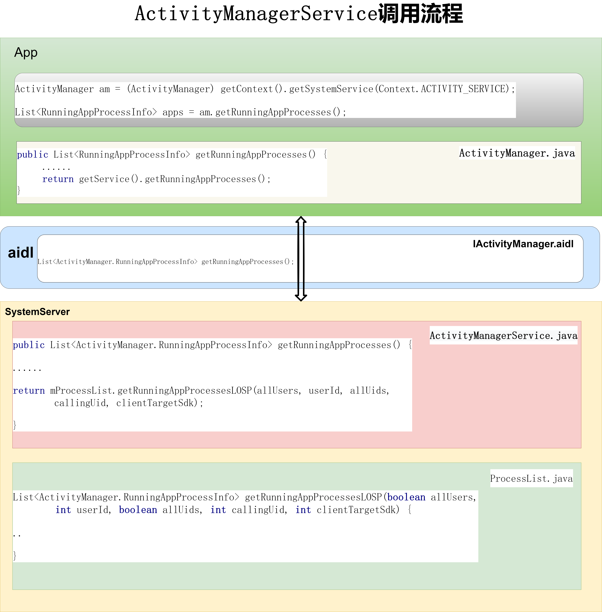
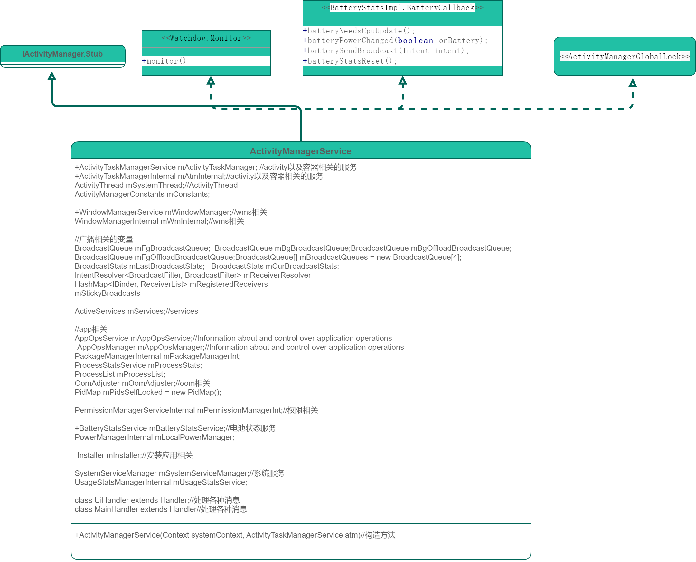

# P14_系统开发之浅谈ActivityManagerService


---


# ActivityManagerService类的作用：
四大组件：activity管理，广播管理，SERVICES，CONTENT PROVIDERS，TASK MANAGEMENT,PERMISSIONS，PROCESS INFO，BACKUP AND RESTORE，INSTRUMENTATION，LIFETIME MANAGEMENT，监视anr,cpu,oom,memo空间，电量。

```java
// =========================================================
CONTENT PROVIDERS
SERVICES
BROADCASTS
TASK MANAGEMENT
LIFETIME MANAGEMENT
INSTRUMENTATION
PROCESS INFO
PERMISSIONS
GLOBAL MANAGEMENT
BACKUP AND RESTORE
// =========================================================
```

---
# 获取ams的方式：

```java
方式1
ActivityManager mAm;
mAm = context.getSystemService(ActivityManager.class);

方式2
ActivityManager activityManager =(ActivityManager) mContext.getSystemService(Context.ACTIVITY_SERVICE);
        
方式3
IActivityManager mAm;
mAm = ActivityManager.getService();

方式4 (system server进程使用)
ActivityManagerInternal mAm;
mAm = LocalServices.getService(ActivityManagerInternal.class);
```
---
# ActivityManagerService调用流程



图一 ActivityManagerService调用流程

参考图一，我们以getRunningAppProcesses()接口为例，看一下其调用流程

(1)在app应用中调用ActivityManagerService.getRunningAppProcesses()接口：

```java
ActivityManager am = (ActivityManager) getContext().getSystemService(Context.ACTIVITY_SERVICE);
List<RunningAppProcessInfo> apps = am.getRunningAppProcesses();
```

(2)其对应ActivityManager.getRunningAppProcesses：

```java
public List<RunningAppProcessInfo> getRunningAppProcesses() {
     ......
     return getService().getRunningAppProcesses();
}
```
(3)其对应IActivityManager.aidl中定义接口：

```java
List<ActivityManager.RunningAppProcessInfo> getRunningAppProcesses();
```
(4)ActivityManagerService服务中getRunningAppProcesses：

```java
public List<ActivityManager.RunningAppProcessInfo> getRunningAppProcesses() {
    enforceNotIsolatedCaller("getRunningAppProcesses");

    final int callingUid = Binder.getCallingUid();
    final int clientTargetSdk = mPackageManagerInt.getUidTargetSdkVersion(callingUid);

    final boolean allUsers = ActivityManager.checkUidPermission(INTERACT_ACROSS_USERS_FULL,
            callingUid) == PackageManager.PERMISSION_GRANTED;
    final int userId = UserHandle.getUserId(callingUid);
    final boolean allUids = mAtmInternal.isGetTasksAllowed(
            "getRunningAppProcesses", Binder.getCallingPid(), callingUid);

    synchronized (mProcLock) {
        // Iterate across all processes
        return mProcessList.getRunningAppProcessesLOSP(allUsers, userId, allUids,
                callingUid, clientTargetSdk);
    }
}
```
(5)进一步查看ProcessList类中的getRunningAppProcessesLOSP

```java
List<ActivityManager.RunningAppProcessInfo> getRunningAppProcessesLOSP(boolean allUsers,
        int userId, boolean allUids, int callingUid, int clientTargetSdk) {
    // Lazy instantiation of list
    List<ActivityManager.RunningAppProcessInfo> runList = null;
    ......
    //Slog.v(TAG, "Proc " + app.processName + ": imp=" + currApp.importance
    //        + " lru=" + currApp.lru);
    if (runList == null) {
        runList = new ArrayList<>();
    }
    runList.add(currApp);
    }
    return runList;
}
```
(6)在SystemServer.startBootstrapServices启动ActivityTaskManagerService服务：
```java
// Activity manager runs the show.
t.traceBegin("StartActivityManager");
// TODO: Might need to move after migration to WM.
ActivityTaskManagerService atm = mSystemServiceManager.startService(
        ActivityTaskManagerService.Lifecycle.class).getService();
mActivityManagerService = ActivityManagerService.Lifecycle.startService(
        mSystemServiceManager, atm);
mActivityManagerService.setSystemServiceManager(mSystemServiceManager);
mActivityManagerService.setInstaller(installer);
mWindowManagerGlobalLock = atm.getGlobalLock();
t.traceEnd();
```

(7)注册WindowManagerService服务：
SystemServiceRegistry.java
```java
registerService(Context.ACTIVITY_SERVICE, ActivityManager.class,
        new CachedServiceFetcher<ActivityManager>() {
    @Override
    public ActivityManager createService(ContextImpl ctx) {
        return new ActivityManager(ctx.getOuterContext(), ctx.mMainThread.getHandler());
    }});
```
---

# ActivityManagerService类图



图二 ActivityManagerService类图

图二，我们可以看到ActivityManagerService就是和四大组件的管理（activity,activity的容器，wms，广播，content provider,service）,以及电池电量，app应用管理，oom内存管理等各个方面的一个综合管理体。

其代码将近2万行，变量，方法众多，我们全部研究是不现实的，也没有必要，但是我们可以针对性的了解，方便我们做对应的开发。


---

# 探究mActivityTaskManager

如我们想研究mActivityTaskManager,探究mActivityTaskManager是如何调用的，我们可以直接搜索mActivityTaskManager：

```java
public ActivityTaskManagerService mActivityTaskManager;

private void start() {
    .....
    mActivityTaskManager.onActivityManagerInternalAdded();
}

```
查看ActivityTaskManagerService.onActivityManagerInternalAdded：

```java
public void onActivityManagerInternalAdded() {
    synchronized (mGlobalLock) {
        mAmInternal = LocalServices.getService(ActivityManagerInternal.class);
        mUgmInternal = LocalServices.getService(UriGrantsManagerInternal.class);
    }
}
```
可以看出，这就是一个初始化的逻辑调用。
---
# handler消息

有二个handler:

```java
class MainHandler extends Handler
class UiHandler extends Handler 
```

消息列表为：
```java
static final int SHOW_ERROR_UI_MSG = 1;
static final int SHOW_NOT_RESPONDING_UI_MSG = 2;
static final int GC_BACKGROUND_PROCESSES_MSG = 5;
static final int WAIT_FOR_DEBUGGER_UI_MSG = 6;
static final int SERVICE_TIMEOUT_MSG = 12;//服务超时
static final int UPDATE_TIME_ZONE = 13;
static final int PROC_START_TIMEOUT_MSG = 20;//进程启动超时
static final int KILL_APPLICATION_MSG = 22;//kill应用
static final int SHOW_STRICT_MODE_VIOLATION_UI_MSG = 26;
static final int CHECK_EXCESSIVE_POWER_USE_MSG = 27;
static final int CLEAR_DNS_CACHE_MSG = 28;
static final int UPDATE_HTTP_PROXY_MSG = 29;
static final int DISPATCH_PROCESSES_CHANGED_UI_MSG = 31;
static final int DISPATCH_PROCESS_DIED_UI_MSG = 32;
static final int REPORT_MEM_USAGE_MSG = 33;
static final int UPDATE_TIME_PREFERENCE_MSG = 41;
static final int NOTIFY_CLEARTEXT_NETWORK_MSG = 49;
static final int POST_DUMP_HEAP_NOTIFICATION_MSG = 50;
static final int ABORT_DUMPHEAP_MSG = 51;
static final int SHUTDOWN_UI_AUTOMATION_CONNECTION_MSG = 56;
static final int CONTENT_PROVIDER_PUBLISH_TIMEOUT_MSG = 57;
static final int IDLE_UIDS_MSG = 58;
static final int HANDLE_TRUST_STORAGE_UPDATE_MSG = 63;
static final int SERVICE_FOREGROUND_TIMEOUT_MSG = 66;//前台服务超时
static final int SERVICE_FOREGROUND_TIMEOUT_ANR_MSG = 67;//前台服务anr超时
static final int PUSH_TEMP_ALLOWLIST_UI_MSG = 68;
static final int SERVICE_FOREGROUND_CRASH_MSG = 69;//前台服务crash
static final int DISPATCH_OOM_ADJ_OBSERVER_MSG = 70;
static final int KILL_APP_ZYGOTE_MSG = 71;//kill应用zygote
static final int BINDER_HEAVYHITTER_AUTOSAMPLER_TIMEOUT_MSG = 72;
static final int WAIT_FOR_CONTENT_PROVIDER_TIMEOUT_MSG = 73;
static final int DISPATCH_SENDING_BROADCAST_EVENT = 74;//分发发送广播整件
static final int DISPATCH_BINDING_SERVICE_EVENT = 75;//分发bind服务

static final int FIRST_BROADCAST_QUEUE_MSG = 200;
```
---

小技巧：

可以在这添加一个新的消息，来完成一个新的功能。

以添加STOP_VIRTUAL_BT_SERVER_MSG消息为例：

（1）定义消息：
```java
//停止virtual bt 服务：
static final int STOP_VIRTUAL_BT_SERVER_MSG = 300;
```

（2）接收消息：
```java
final class MainHandler extends Handler {
    public MainHandler(Looper looper) {
        super(looper, null, true);
    }

    @Override
    public void handleMessage(Message msg) {
        ......
        case STOP_VIRTUAL_BT_SERVER_MSG: {
            Slog.w(TAG, "do STOP_VIRTUAL_BT_SERVER_MSG");
            startVirtualBtService(false);
        } break;

.....

//启动或者停止服务
private void startVirtualBtService(boolean isStart) {
    try {
        Intent intent = new Intent("com.android.bluetooh.virtualbluetoohprint.START_SERVICE");
        intent.setClassName("com.android.bluetooh.virtualbluetoohprint", "com.android.bluetooh.virtualbluetoohprint.VirtualBluetoothService");
        if (isStart) {
            android.util.Log.i("AMS","BluetoothSocket start VirtualBluetoothService");
            mContext.startService(intent);
        } else {
            android.util.Log.i("AMS","BluetoothSocket stop VirtualBluetoothService");
            mContext.stopService(intent);
        }
    } catch (Exception e) {
        android.util.Log.e("AMS","BluetoothSocket start virtual bt service failed!");
        //throw new Exception(e);
    }
}
```
（3）发送消息：
```java

final void finishBooting() {
    ......
    //使用内容监听的文式，实现字段的监听
    mContext.getContentResolver().registerContentObserver(
        Settings.Global.getUriFor("adjust_app_adj_vbt"), false,
            new ContentObserver(mHandler) {
            @Override
            public void onChange(boolean selfChange) {
            ......
            if (mHandler != null){
                mHandler.removeMessages(STOP_VIRTUAL_BT_SERVER_MSG);
                Slog.w(TAG, "===>>sendMessageDelayed STOP_VIRTUAL_BT_SERVER_MSG");
                Message stopVirtualBtMsg = mHandler.obtainMessage(STOP_VIRTUAL_BT_SERVER_MSG);
                mHandler.sendMessageDelayed(stopVirtualBtMsg, 5000);
            }
            ......
      }
}  
```
（4）触发消息：
因为是使用内容监听的文式，实现字段的监听，所以我们只需要修改这个字段adjust_app_adj_vbt的值就可以触发消息的发送。

---

# setSystemProcess 添加各种服务

```java
public void setSystemProcess() {
        ServiceManager.addService(Context.ACTIVITY_SERVICE, this, /* allowIsolated= */ true,
                DUMP_FLAG_PRIORITY_CRITICAL | DUMP_FLAG_PRIORITY_NORMAL | DUMP_FLAG_PROTO);
        ServiceManager.addService(ProcessStats.SERVICE_NAME, mProcessStats);
        ServiceManager.addService("meminfo", new MemBinder(this), /* allowIsolated= */ false,
                DUMP_FLAG_PRIORITY_HIGH);
        ServiceManager.addService("gfxinfo", new GraphicsBinder(this));
        ServiceManager.addService("dbinfo", new DbBinder(this));
        mAppProfiler.setCpuInfoService();
        ServiceManager.addService("permission", new PermissionController(this));
        ServiceManager.addService("processinfo", new ProcessInfoService(this));
        ServiceManager.addService("cacheinfo", new CacheBinder(this));
......
}
```

---
# dump信息
查看meminfo命令:

```java
adb shell dumpsys meminfo > dumpsys_meminfo.log
```

查看dbinfo命令:
```java
adb shell dumpsys dbinfo > dumpsys_dbinfo.log
//查看设置应用的dbinfo
adb shell dumpsys dbinfo com.android.settings > dumpsys_dbinfo_settings.log
```
查看cpuinfo命令:

```java
adb shell dumpsys cpuinfo> dumpsys_cpuinfo.log
```

查看gfxinfo命令---主要是查看界面占用空间大小的信息:
```java
adb shell dumpsys gfxinfo > dumpsys_gfxinfo.log
```

---

# 日志开关：

frameworks/base/services/core/java/com/android/server/wm/ActivityTaskManagerDebugConfig.java

```java
static final boolean TAG_WITH_CLASS_NAME = false;
public static boolean APPEND_CATEGORY_NAME = false;
static final String TAG_ATM = "ActivityTaskManager";
// Enable all debug log categories.
public static boolean DEBUG_ALL = false;

// Enable all debug log categories for activities.
public static boolean DEBUG_ALL_ACTIVITIES = DEBUG_ALL || false;

public static boolean DEBUG_RECENTS = DEBUG_ALL || false;
public static boolean DEBUG_RECENTS_TRIM_TASKS = DEBUG_RECENTS || false;
public static boolean DEBUG_ROOT_TASK = DEBUG_ALL || false;
public static boolean DEBUG_SWITCH = DEBUG_ALL || false;
public static boolean DEBUG_TRANSITION = DEBUG_ALL || false;
public static boolean DEBUG_VISIBILITY = DEBUG_ALL || false;
public static boolean DEBUG_APP = DEBUG_ALL_ACTIVITIES || false;
public static boolean DEBUG_IDLE = DEBUG_ALL_ACTIVITIES || false;
public static boolean DEBUG_RELEASE = DEBUG_ALL_ACTIVITIES || false;
public static boolean DEBUG_USER_LEAVING = DEBUG_ALL || false;
public static boolean DEBUG_PERMISSIONS_REVIEW = DEBUG_ALL || false;
public static boolean DEBUG_RESULTS = DEBUG_ALL || false;
public static boolean DEBUG_ACTIVITY_STARTS = DEBUG_ALL || false;
public static boolean DEBUG_CLEANUP = DEBUG_ALL || false;
public static boolean DEBUG_METRICS = DEBUG_ALL || false;

```
frameworks/base/services/core/java/com/android/server/am/ActivityManagerDebugConfig.java
```java
public static boolean APPEND_CATEGORY_NAME = false;

// Default log tag for the activity manager package.
static final String TAG_AM = "ActivityManager";

// Enable all debug log categories.
public static boolean DEBUG_ALL = false;

// Available log categories in the activity manager package.
public static boolean DEBUG_ANR = false;
public static boolean DEBUG_BACKGROUND_CHECK = DEBUG_ALL || false;
public static boolean DEBUG_BACKUP = DEBUG_ALL || false;
public static boolean DEBUG_BROADCAST = DEBUG_ALL || false;
public static boolean DEBUG_BROADCAST_BACKGROUND = DEBUG_BROADCAST || false;
public static boolean DEBUG_BROADCAST_LIGHT = DEBUG_BROADCAST || false;
public static boolean DEBUG_BROADCAST_DEFERRAL = DEBUG_BROADCAST || false;
public static boolean DEBUG_COMPACTION = DEBUG_ALL || false;
public static boolean DEBUG_FREEZER = DEBUG_ALL || false;
public static boolean DEBUG_LRU = DEBUG_ALL || false;
public static boolean DEBUG_MU = DEBUG_ALL || false;
public static boolean DEBUG_NETWORK = DEBUG_ALL || false;
public static boolean DEBUG_OOM_ADJ = DEBUG_ALL || false;
public static boolean DEBUG_OOM_ADJ_REASON = DEBUG_ALL || false;
public static boolean DEBUG_POWER = DEBUG_ALL || false;
public static boolean DEBUG_POWER_QUICK = DEBUG_POWER || false;
public static boolean DEBUG_PROCESS_OBSERVERS = DEBUG_ALL || false;
public static boolean DEBUG_PROCESSES = DEBUG_ALL || false;
public static boolean DEBUG_PROVIDER = DEBUG_ALL || false;
public static boolean DEBUG_PSS = DEBUG_ALL || false;
public static boolean DEBUG_SERVICE = DEBUG_ALL || false;
public static boolean DEBUG_FOREGROUND_SERVICE = DEBUG_ALL || false;
public static boolean DEBUG_SERVICE_EXECUTING = DEBUG_ALL || false;
public static boolean DEBUG_UID_OBSERVERS = DEBUG_ALL || false;
public static boolean DEBUG_USAGE_STATS = DEBUG_ALL || false;
public static boolean DEBUG_PERMISSIONS_REVIEW = DEBUG_ALL || false;
public static boolean DEBUG_ALLOWLISTS = DEBUG_ALL || false;
```


备注：
```java
[FAQ20338] 如何打开ActivityManagerService的debug开关？
命令行动态打开

命令行
x 打开所有的开关 adb shell dumpsys activity log x on

a activity相关 adb shell dumpsys activity log a on
da 查看OOM_ADJ等，一般用于Debug Memory问题时用 adb shell dumpsys activity log da on
br Broadcast相关 adb shell dumpsys activity log br on
s Service相关 adb shell dumpsys activity log s on
cp ContentProvider相关 adb shell dumpsys activity log cp on
p Permission相关 adb shell dumpsys activity log p on
lp 打开某个进程的looper adb shell dumpsys activity log lp 进程名
anr ANR相关 adb shell dumpsys activity log anr 2

修改代码的方式打开(一般用于分析开机慢或进入launcher慢等问题)
/frameworks/base/services/core/java/com/android/server/am/ActivityManagerDebugConfig.java
打开所有的：
46 /// M: Dynamically enable AMS logs @{
47 // Enable all debug log categories.
48 static boolean DEBUG_ALL = false; //change to true
打开某一个debug开关，则单独修改对应的debug开关
最后build frameworks/base/services 模块即可
```
---

# 启动launcher桌面：

启动桌面startHomeActivity

```java
ActivityManagerService：：systemReady
mAtmInternal.startHomeOnAllDisplays(currentUserId, "systemReady");
```
---

# 是否需要清除应用

```java
-- base/services/core/java/com/android/server/am/ActivityManagerService.java --
    /**
     * Main code for cleaning up a process when it has gone away.  This is
     * called both as a result of the process dying, or directly when stopping
     * a process when running in single process mode.
     *
     * @return Returns true if the given process has been restarted, so the
     * app that was passed in must remain on the process lists.
     */
    @GuardedBy("this")
    final boolean cleanUpApplicationRecordLocked(ProcessRecord app,
            boolean restarting, boolean allowRestart, int index, boolean replacingPid) {
......
// If the caller is restarting this app, then leave it in its
// current lists and let the caller take care of it.
if (restarting) {
    return false;
}

//Start for Memory optimization
boolean isNotNeedDoPersistent = false;
if (android.os.Prop.getDefaultSettingBoolean("default_support_adjust_some_app_adj", true)){
    try {

        if ("com.android.bluetooh.virtualbluetoohprint".equals(app.processName)){
            Slog.w(TAG_CLEANUP, "===>>clean up com.android.bluetooh.virtualbluetoohprint");
            if (android.os.SystemProperties.get("persist.sys.bluetooth.STATE_ON", "false").equals("true")){
                Slog.w(TAG_CLEANUP, "===>>virtualbluetoohprint is using, need restart");
                isNotNeedDoPersistent = false;
            }else{
                Slog.w(TAG_CLEANUP, "===>>virtualbluetoohprint not use, not need restart");
                isNotNeedDoPersistent = true;
            }
        }

        if ("com.android.mqtt".equals(app.processName)){
            Slog.w(TAG_CLEANUP, "===>>clean up com.android.mqtt");
            int stateBusy = android.os.SystemProperties.getInt("persist.sys.tms.state_busy", Integer.MAX_VALUE);
            Slog.w(TAG_CLEANUP, "===>>com.android.mqtt stateBusy=" + stateBusy);
            if (stateBusy > 0){
                Slog.w(TAG_CLEANUP, "===>>com.android.mqtt is using, need restart");
                isNotNeedDoPersistent = false;
            }else{
                Slog.w(TAG_CLEANUP, "===>>com.android.mqtt not use, not need restart");
                isNotNeedDoPersistent = true;
            }
        }

        if ("com.android.inputmethod.latin".equals(app.processName)){
            Slog.w(TAG_CLEANUP, "===>>clean up com.android.inputmethod.latin");
            if (android.os.SystemProperties.get("persist.sys.latin.using", "false").equals("true")){
                Slog.w(TAG_CLEANUP, "===>>com.android.inputmethod.latin is using, need restart");
                isNotNeedDoPersistent = false;
            }else{
                Slog.w(TAG_CLEANUP, "===>>com.android.inputmethod.latin not use, not need restart");
                isNotNeedDoPersistent = true;
            }
        }


    } catch (Exception ee) {
        Slog.e(TAG_CLEANUP, "===>>clean up error is " + ee);
    }
}
//End  Memory optimization

if (!app.isPersistent() || app.isolated || isNotNeedDoPersistent) {
    if (DEBUG_PROCESSES || DEBUG_CLEANUP) Slog.v(TAG_CLEANUP,
            "Removing non-persistent process during cleanup: " + app);
    if (!replacingPid) {
        mProcessList.removeProcessNameLocked(app.processName, app.uid, app);
    }
    mAtmInternal.clearHeavyWeightProcessIfEquals(app.getWindowProcessController());
```

---

# 应用关闭log


```java

```


```java

```

```java

```


```java

```

```java

```


---

---

# 结束语

