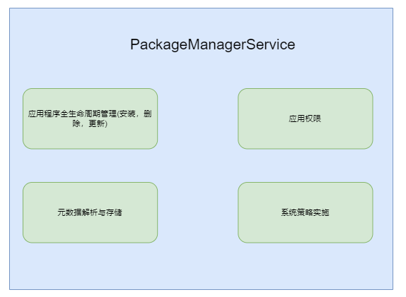
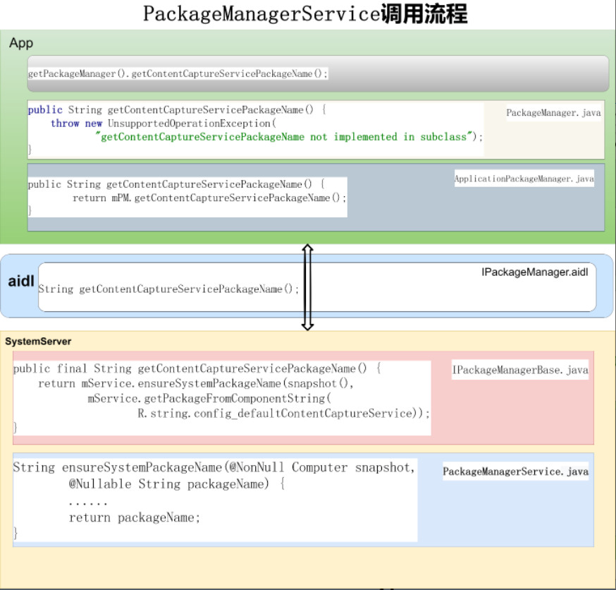
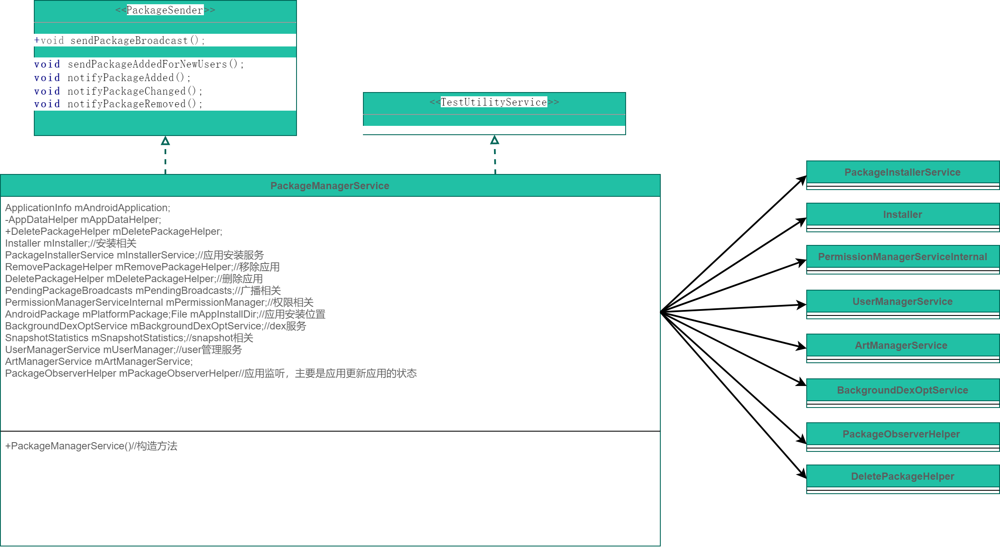
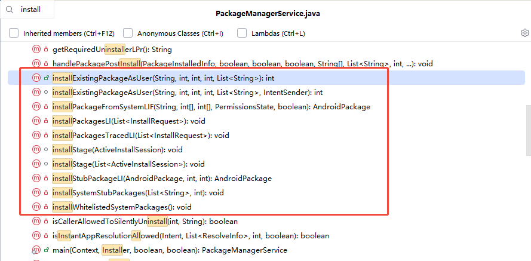
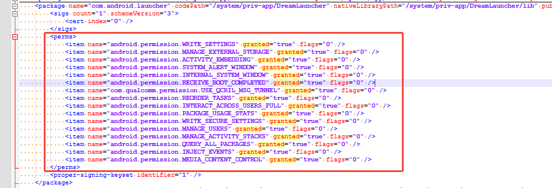

# P15_系统开发之浅谈PackageManagerService


---

[跳转到readme](https://github.com/hfreeman2008/android_core_framework/blob/main/README-CN.md)

---

[<font face='黑体' color=#ff0000 size=40 >跳转到文章结尾</font>](#结束语)

---

[上一篇文章 P14_系统开发之浅谈ActivityManagerService](https://github.com/hfreeman2008/android_core_framework/blob/main/P14_%E7%B3%BB%E7%BB%9F%E5%BC%80%E5%8F%91%E4%B9%8B%E6%B5%85%E8%B0%88ActivityManagerService/%E7%B3%BB%E7%BB%9F%E5%BC%80%E5%8F%91%E4%B9%8B%E6%B5%85%E8%B0%88ActivityManagerService.md)


[下一篇文章 P16_系统开发之浅谈PowerManagerService](https://github.com/hfreeman2008/android_core_framework/blob/main/P16_%E7%B3%BB%E7%BB%9F%E5%BC%80%E5%8F%91%E4%B9%8B%E6%B5%85%E8%B0%88PowerManagerService/%E7%B3%BB%E7%BB%9F%E5%BC%80%E5%8F%91%E4%B9%8B%E6%B5%85%E8%B0%88PowerManagerService.md)

---


# PackageManagerService 类的作用：

PackageManagerService类的作用就是:

1.‌应用程序全生命周期管理‌
- ‌安装‌：解析 APK 文件（签名验证、完整性检查），将应用文件部署至 /data/app/ 目录，并提取元数据（包名、版本号等）持久化存储‌。
- ‌卸载‌：删除应用文件、用户数据及元数据（如 /data/system/packages.xml），并通知关联服务（如 ActivityManagerService）清理进程和缓存‌。
- ‌更新‌：替换旧版本 APK，处理数据迁移和权限变更，确保应用升级后兼容性‌。

2.‌元数据解析与存储‌
- 解析 APK 的 AndroidManifest.xml，提取四大组件（Activity、Service 等）、权限声明、共享库依赖等信息，存储至内存数据结构（如 Package 类）‌。
- 维护全局包信息数据库（packages.xml 和 packages.list），记录应用安装位置、用户 ID、权限授予状态等‌。

3.‌权限管理协作‌
- 在安装阶段审核应用声明的权限，并与PermissionManagerService‌ 协同处理权限授予逻辑（如危险权限默认拒绝）。
- 提供权限状态查询接口，供系统服务（如 ActivityManagerService）验证应用操作合法性‌。

4.‌系统策略实施‌
- 管理预装系统应用（/system/app/ 和 /system/priv-app/），确保核心服务优先加载‌。
- 实现多用户场景下的应用隔离，为每个用户分配独立的数据目录和权限配置‌。





```java
frameworks\base\core\java\android\content\pm\PackageManager.java
frameworks\base\core\java\android\app\ApplicationPackageManager.java

frameworks\base\core\java\android\content\pm\IPackageManager.aidl

frameworks\base\services\core\java\com\android\server\pm\PackageManagerService.java
```


---

# 获取pkms的方式：

```java
方式1
PackageManager pm = mContext.getPackageManager();

方式2
PackageManager mPm;
mPm = (PackageManager)getSystemService("package");

方式3
IPackageManager mPm;
mPm = IPackageManager.Stub.asInterface(ServiceManager.getService("package"));

方式4
IPackageManager mPM;
mPM = AppGlobals.getPackageManager();

方式5
IPackageManager mPM = ActivityThread.getPackageManager();

方式6 (system server进程使用)
PackageManagerInternal pm = LocalServices.getService(PackageManagerInternal.class);
```

---

# PackageManagerService调用流程





图一 PackageManagerService调用流程

以getContentCaptureServicePackageName为例，查看PackageManagerService调用流程：

(1)app应用中调用getContentCaptureServicePackageName:

```java
getPackageManager().getContentCaptureServicePackageName();
```

(2)PackageManager.java定义getContentCaptureServicePackageName

```java
/**
 * @return the system defined content capture package name, or null if there's none.
 *
 * @hide
 */
@TestApi
@Nullable
public String getContentCaptureServicePackageName() {
    throw new UnsupportedOperationException(
            "getContentCaptureServicePackageName not implemented in subclass");
}
```

(3)PackageManager的子类ApplicationPackageManager实现getContentCaptureServicePackageName

```java
@Override
public String getContentCaptureServicePackageName() {
    try {
        return mPM.getContentCaptureServicePackageName();
    } catch (RemoteException e) {
        throw e.rethrowAsRuntimeException();
    }
}
```

(4)IPackageManager.aidl定义getContentCaptureServicePackageName

```java
String getContentCaptureServicePackageName();
```

(5)IPackageManagerBase实现getContentCaptureServicePackageName逻辑

```java
@Override
@Deprecated
public final String getContentCaptureServicePackageName() {
    return mService.ensureSystemPackageName(snapshot(),
            mService.getPackageFromComponentString(
                    R.string.config_defaultContentCaptureService));
}
```

(6)PackageManagerService调用ensureSystemPackageName逻辑

```java
@Nullable
String ensureSystemPackageName(@NonNull Computer snapshot,
        @Nullable String packageName) {
    if (packageName == null) {
        return null;
    }
    final long token = Binder.clearCallingIdentity();
    try {
        if (snapshot.getPackageInfo(packageName, MATCH_FACTORY_ONLY,
                UserHandle.USER_SYSTEM) == null) {
            PackageInfo packageInfo =
                    snapshot.getPackageInfo(packageName, 0, UserHandle.USER_SYSTEM);
            if (packageInfo != null) {
                EventLog.writeEvent(0x534e4554, "145981139", packageInfo.applicationInfo.uid,
                        "");
            }
            Log.w(TAG, "Missing required system package: " + packageName + (packageInfo != null
                    ? ", but found with extended search." : "."));
            return null;
        }
    } finally {
        Binder.restoreCallingIdentity(token);
    }
    return packageName;
}
```

(7)在SystemServer.startBootstrapServices启动PackageManagerService服务：

```java
t.traceBegin("StartPackageManagerService");
try {
    Watchdog.getInstance().pauseWatchingCurrentThread("packagemanagermain");
    mPackageManagerService = PackageManagerService.main(mSystemContext, installer,
            mFactoryTestMode != FactoryTest.FACTORY_TEST_OFF, mOnlyCore);
} finally {
    Watchdog.getInstance().resumeWatchingCurrentThread("packagemanagermain");
}

// Now that the package manager has started, register the dex load reporter to capture any
// dex files loaded by system server.
// These dex files will be optimized by the BackgroundDexOptService.
SystemServerDexLoadReporter.configureSystemServerDexReporter(mPackageManagerService);

mPackageManager = mSystemContext.getPackageManager();
t.traceEnd();
```


(8)在PackageManagerService.main方法中注册package:
```java
ServiceManager.addService("package", m);
final PackageManagerNative pmn = m.new PackageManagerNative();
ServiceManager.addService("package_native", pmn);
```


---


# PackageManagerService类图



图三 PackageManagerService类图

图三，我们可以看到PackageManagerService就是管理应用，包括应用安装，删除，更新，应用的位置，应用的权限管理，截图，dex等各个方面的一个综合管理体。

---

# PackageManager关键接口


## 1. 应用信息查询方法

```java
ApplicationInfo getApplicationInfo(@NonNull String packageName,@ApplicationInfoFlags int flags)
```
- 功能：获取指定包名应用的详细信息，如应用的图标、标签、数据目录等。
- 参数：
- packageName：要查询的应用的包名。
- flags：指定要获取的额外信息，例如 PackageManager.GET_META_DATA 可以获取应用的元数据。
- 返回值：ApplicationInfo 对象，包含应用的详细信息。

```java
PackageInfo getPackageInfo(String packageName, int flags)
```
- 功能：获取指定包名应用的综合信息，包括版本号、签名信息、声明的权限等。
- 参数：
- packageName：要查询的应用的包名。
- flags：指定要获取的额外信息，例如 PackageManager.GET_PERMISSIONS 可以获取应用声明的权限列表。
- 返回值：PackageInfo 对象，包含应用的综合信息。

```java
List<ApplicationInfo> getInstalledApplications(int flags)
```
- 功能：获取系统中所有已安装应用的信息列表。
- 参数：flags 用于指定获取信息的方式，如 PackageManager.GET_UNINSTALLED_PACKAGES 可以包含已卸载但残留数据的应用。
- 返回值：List<ApplicationInfo> 列表，包含所有已安装应用的信息。


## 2. 权限管理相关方法
```java
int checkPermission(String permName, String pkgName, int uid)
```
- 功能：检查某个应用是否具有指定的权限。
- 参数：
- permName：要检查的权限名称，如 android.permission.CAMERA。
- pkgName：要检查的应用的包名。
- uid：应用的用户 ID。
- 返回值：如果应用被授予该权限，返回 PackageManager.PERMISSION_GRANTED；否则返回 PackageManager.PERMISSION_DENIED。

```java
int[] getPackageGids(String packageName)
```

- 功能：获取指定包名应用的组 ID 列表。组 ID 与应用的权限和资源访问相关。
- 参数：packageName 为要查询的应用的包名。
- 返回值：包含应用组 ID 的整数数组。

```java
grantRuntimePermission(String packageName, String permissionName, UserHandle user)：
```
- 在运行时授予指定包名的应用程序指定的权限。这通常用于需要动态权限的应用。


## 3. 意图解析方法
```java
List<ResolveInfo>  queryIntentActivities(Intent intent, int flags)
```

- 功能：根据指定的意图查询系统中能够处理该意图的活动列表。
- 参数：
- intent：要查询的意图对象。
- flags：查询的标志，如 PackageManager.MATCH_DEFAULT_ONLY 只匹配设置了默认标志的活动。
- 返回值：List<ResolveInfo> 列表，每个 ResolveInfo 对象包含一个能够处理该意图的活动的信息。

```java
List<ResolveInfo> queryIntentServices(Intent intent, int flags)
```
- 功能：根据指定的意图查询系统中能够处理该意图的服务列表。
- 参数：与 queryIntentActivities 类似。
- 返回值：List<ResolveInfo> 列表，包含能够处理该意图的服务的信息。


## 4.应用程序生命周期管理
```java
deletePackage(String packageName, IPackageDeleteObserver observer, int flags)：
```
- 卸载指定包名的应用程序。observer参数用于接收卸载过程中的回调通知，flags参数可以指定卸载选项。


## 5. 其他方法
```java
Intent getLaunchIntentForPackage(String packageName)
```
- 功能：获取用于启动指定包名应用的主活动的意图。
- 参数：packageName 为要启动的应用的包名。
- 返回值：如果找到合适的启动意图，返回 Intent 对象；否则返回 null。


---

# PackageManagerService关键接口

## install相关方法
```java
frameworks\base\core\java\android\content\pm\PackageInstaller.java
frameworks\base\services\core\java\com\android\server\pm\PackageInstallerService.java
```




## 匹配activity
chooseBestActivity

## checkPermission--检查权限


---


# handler消息

有一个handler:

```java
Handler mHandler;
```

消息列表为：

```java
static final int SEND_PENDING_BROADCAST = 1;
static final int INIT_COPY = 5;//复制
static final int POST_INSTALL = 9;//安装前
static final int WRITE_SETTINGS = 13;//写settings
static final int WRITE_PACKAGE_RESTRICTIONS = 14;
static final int PACKAGE_VERIFIED = 15;//应用较验
static final int CHECK_PENDING_VERIFICATION = 16;
// public static final int UNUSED = 17;
// public static final int UNUSED = 18;
static final int WRITE_PACKAGE_LIST = 19;//写应用列表
static final int INSTANT_APP_RESOLUTION_PHASE_TWO = 20;
static final int ENABLE_ROLLBACK_STATUS = 21;
static final int ENABLE_ROLLBACK_TIMEOUT = 22;
static final int DEFERRED_NO_KILL_POST_DELETE = 23;
static final int DEFERRED_NO_KILL_INSTALL_OBSERVER = 24;
static final int INTEGRITY_VERIFICATION_COMPLETE = 25;//完整性较验结束
static final int CHECK_PENDING_INTEGRITY_VERIFICATION = 26;
static final int DOMAIN_VERIFICATION = 27;
static final int PRUNE_UNUSED_STATIC_SHARED_LIBRARIES = 28;
static final int DEFERRED_PENDING_KILL_INSTALL_OBSERVER = 29;
static final int DEFERRED_NO_KILL_POST_DELETE_DELAY_MS = 3 * 1000;
private static final int DEFERRED_NO_KILL_INSTALL_OBSERVER_DELAY_MS = 500;
private static final int DEFERRED_PENDING_KILL_INSTALL_OBSERVER_DELAY_MS = 1000;
```


---

# dump信息

```java
adb shell dumpsys package
adb shell dumpsys package -h
```

## dump添加功能开关

```java
public  static boolean sAllowUnInstall = false;//功能开关，默认关闭

protected void dump(FileDescriptor fd, PrintWriter pw, String[] args) {
    if (!DumpUtils.checkDumpAndUsageStatsPermission(mContext, TAG, pw)) return;

    DumpState dumpState = new DumpState();
    boolean fullPreferred = false;
    boolean checkin = false;

    String packageName = null;
    ArraySet<String> permissionNames = null;

    int opti = 0;
    while (opti < args.length) {
        String opt = args[opti];
        if (opt == null || opt.length() <= 0 || opt.charAt(0) != '-') {
            break;
        }
        opti++;

        if ("-a".equals(opt)) {
            // Right now we only know how to print all.
        } else if ("-h".equals(opt)) {
            pw.println("Package manager dump options:");
            pw.println("  [-h] [-f] [--checkin] [--all-components] [cmd] ...");
            pw.println("    --checkin: dump for a checkin");
            ......
            pw.println("    <package.name>: info about given package");
            return;
        } else if ("--checkin".equals(opt)) {
            checkin = true;
        } else if ("--all-components".equals(opt)) {
            dumpState.setOptionEnabled(DumpState.OPTION_DUMP_ALL_COMPONENTS);
        } else if ("-f".equals(opt)) {
            dumpState.setOptionEnabled(DumpState.OPTION_SHOW_FILTERS);
        } else if ("--proto".equals(opt)) {
            dumpProto(fd);
            return;
        } else if("--install".equals(opt)){
            sAllowInstall = true;
            return;
        } else if("--uninstall".equals(opt)){
            sAllowInstall = false;
            return;
        }else if("--allow-uninstall".equals(opt)){//功能开关，打开此开关
            sAllowUnInstall= true;
            pw.println("sAllowUnInstall:" + sAllowUnInstall);
            return;
        }else{
            pw.println("Unknown argument: " + opt + "; use -h for help");
        }
    }
```

执行以下命令，将此功能开关打开

```java
adb shell dumpsys package --allow-uninstall
sAllowUnInstall:true
```

---

# 日志开关

```java
public static boolean DEBUG_SETTINGS = false;
public static boolean DEBUG_PREFERRED = false;
public static boolean DEBUG_UPGRADE = false;
public static boolean DEBUG_DOMAIN_VERIFICATION = false;
public static boolean DEBUG_BACKUP = false;
public static boolean DEBUG_INSTALL = false;
public static boolean DEBUG_REMOVE = false;
public static boolean DEBUG_BROADCASTS = false;
public static boolean DEBUG_PACKAGE_INFO = false;
public static boolean DEBUG_INTENT_MATCHING = false;
public static boolean DEBUG_PACKAGE_SCANNING = false;
public static boolean DEBUG_VERIFY = false;
public static boolean DEBUG_PERMISSIONS = false;
public static boolean DEBUG_SHARED_LIBRARIES = false;
public static final boolean DEBUG_COMPRESSION = Build.IS_DEBUGGABLE;
public static final boolean TRACE_SNAPSHOTS = false;
private static final boolean DEBUG_PER_UID_READ_TIMEOUTS = false;
//Not report ART metrics to statsd after first flash boot
public static boolean DEBUG_ART_STATSLOG = SystemProperties.getBoolean(
        "persist.sys.pm.art.statslog", false);
// Debug output for dexopting. This is shared between PackageManagerService, OtaDexoptService
// and PackageDexOptimizer. All these classes have their own flag to allow switching a single
// user, but by default initialize to this.
public static boolean DEBUG_DEXOPT = false;
public static boolean DEBUG_ABI_SELECTION = false;
public static boolean DEBUG_INSTANT = Build.IS_DEBUGGABLE;
public static boolean DEBUG_APP_DATA = false;
```


---

# android开发浅谈之PackageManagerService(pkms)

[android开发浅谈之PackageManagerService(pkms)](https://blog.csdn.net/hfreeman2008/article/details/118160530)

https://blog.csdn.net/hfreeman2008/article/details/118160530

---


# LocalService--PackageManagerInternal

```java
private final PackageManagerInternal mPmInternal;


// Expose private service for system components to use.
mPmInternal = new PackageManagerInternalImpl();
LocalServices.addService(PackageManagerInternal.class, mPmInternal);
```

system server进程引用：

```java
private PackageManagerInternal mPackageManagerInternal;
mPackageManagerInternal = LocalServices.getService(PackageManagerInternal.class);
mPmInternal.getSetupWizardPackageName()
```

---

# 注册package服务

在PackageManagerService.main方法中注册package:

```java
ServiceManager.addService("package", m);
final PackageManagerNative pmn = m.new PackageManagerNative();
ServiceManager.addService("package_native", pmn);
```

---


# adb 命令相关
frameworks\base\services\core\java\com\android\server\pm\PackageManagerShellCommand.java

```java
public int onCommand(String cmd) {
    try {
        switch (cmd) {
            case "path":
                return runPath();
            case "validate":
                return runValidate();
            case "dump":
                return runDump();
            case "list":
                return runList();
            case "resolve-activity":
                return runResolveActivity();
            case "query-activities":
                return runQueryIntentActivities();
            case "query-services":
                return runQueryIntentServices();
            case "query-receivers":
                return runQueryIntentReceivers();
            case "install":
                return runInstall();//安装
            case "install-streaming":
                return runStreamingInstall();
            case "install-incremental":
                return runIncrementalInstall();
            case "install-abandon":
            case "install-destroy":
                return runInstallAbandon();
            case "install-commit":
                return runInstallCommit();
            case "install-create":
                return runInstallCreate();
            case "install-remove":
                return runInstallRemove();
            case "install-write":
                return runInstallWrite();
            case "install-existing":
                return runInstallExisting();
            case "set-install-location":
                return runSetInstallLocation();
            case "get-install-location":
                return runGetInstallLocation();
            case "install-add-session":
                return runInstallAddSession();
            case "move-package":
                return runMovePackage();
            case "move-primary-storage":
                return runMovePrimaryStorage();
            case "compile":
                return runCompile();
            case "reconcile-secondary-dex-files":
                return runreconcileSecondaryDexFiles();
            case "force-dex-opt":
                return runForceDexOpt();
            case "bg-dexopt-job":
                return runDexoptJob();
            case "dump-profiles":
                return runDumpProfiles();
            case "snapshot-profile":
                return runSnapshotProfile();
            case "uninstall":
                return runUninstall();//卸载
            case "clear":
                return runClear();
            case "enable":
                return runSetEnabledSetting(PackageManager.COMPONENT_ENABLED_STATE_ENABLED);
            case "disable":
                return runSetEnabledSetting(PackageManager.COMPONENT_ENABLED_STATE_DISABLED);
            case "disable-user":
                return runSetEnabledSetting(
                        PackageManager.COMPONENT_ENABLED_STATE_DISABLED_USER);
            case "disable-until-used":
                return runSetEnabledSetting(
                        PackageManager.COMPONENT_ENABLED_STATE_DISABLED_UNTIL_USED);
            case "default-state":
                return runSetEnabledSetting(PackageManager.COMPONENT_ENABLED_STATE_DEFAULT);
            case "hide":
                return runSetHiddenSetting(true);
            case "unhide":
                return runSetHiddenSetting(false);
            case "suspend":
                return runSuspend(true);
            case "unsuspend":
                return runSuspend(false);
            case "grant":
                return runGrantRevokePermission(true);
            case "revoke":
                return runGrantRevokePermission(false);
            case "reset-permissions":
                return runResetPermissions();
            case "set-permission-enforced":
                return runSetPermissionEnforced();
            case "get-privapp-permissions":
                return runGetPrivappPermissions();
            case "get-privapp-deny-permissions":
                return runGetPrivappDenyPermissions();
            case "get-oem-permissions":
                return runGetOemPermissions();
            case "set-app-link":
                return runSetAppLink();
            case "get-app-link":
                return runGetAppLink();
            case "trim-caches":
                return runTrimCaches();
            case "create-user":
                return runCreateUser();
            case "remove-user":
                return runRemoveUser();
            case "set-user-restriction":
                return runSetUserRestriction();
            case "get-max-users":
                return runGetMaxUsers();
            case "get-max-running-users":
                return runGetMaxRunningUsers();
            case "set-home-activity":
                return runSetHomeActivity();
            case "set-installer":
                return runSetInstaller();
            case "get-instantapp-resolver":
                return runGetInstantAppResolver();
            case "has-feature":
                return runHasFeature();
            case "set-harmful-app-warning":
                return runSetHarmfulAppWarning();
            case "get-harmful-app-warning":
                return runGetHarmfulAppWarning();
            case "get-stagedsessions":
                return runListStagedSessions();
            case "uninstall-system-updates":
                String packageName = getNextArg();
                return uninstallSystemUpdates(packageName);
            case "rollback-app":
                return runRollbackApp();
            case "get-moduleinfo":
                return runGetModuleInfo();
            case "log-visibility":
                return runLogVisibility();
            case "bypass-staged-installer-check":
                return runBypassStagedInstallerCheck();
}

```


## install
```java
PackageManagerShellCommand#onCommand()
PackageManagerShellCommand#runInstall()

PackageInstallerService#uninstall()

PackageManagerService#handleStartCopy()
PackageManagerService#installPackageFromSystemLIF()
PackageManagerService#installStage()
日志开关：
PackageManagerService#DEBUG_INSTALL
PackageManagerService#DEBUG_REMOVE

frameworks\base\core\java\android\content\pm\PackageInstaller.java
frameworks\base\services\core\java\com\android\server\pm\PackageInstallerService.java
```

## uninstall

```java
PackageManagerShellCommand#onCommand()
PackageManagerShellCommand#runUninstall()

PackageInstallerService#uninstall()
日志开关：
PackageManagerService#DEBUG_INSTALL
PackageManagerService#DEBUG_REMOVE
```


# 定义不可删除应用和指定可删除应用

```java
//定义不可以删除应用
private final String[] APP_CANNOT_BE_REMOVED = new String[]{
    "com.android.settings",
};

 //定义可删除其他的应用名
private final String[] APP_CAN_UNINSTALL_OTHER_APPS = new String[]{
    "com.android.usbaccessory",
};

//检查是否pkms可以卸载应用
//true:可以卸载
//false:不能卸载
private boolean checkRemoveAble(int callingUid,VersionedPackage versionedPackage){

    //APP_CANNOT_BE_REMOVED 里面的apk不允许卸载
    String removePackageName = versionedPackage.getPackageName();
    for(String name : APP_CANNOT_BE_REMOVED){
        if(name.equals(removePackageName)){
            Slog.w(TAG,"Can,t remove "+name);
            return false;
        }
    }

    //只有MDM,MWC manager 可以卸载应用
    final String[] callingPackages = getPackagesForUid(callingUid);
    if (callingPackages != null) {
        for(String callingPac : callingPackages){
            for(String prePac : APP_CAN_UNINSTALL_OTHER_APPS){
                if(callingPac.equals(prePac)){
                    return true;
                }
            }
        }
    }

    return false;
}


private void deletePackageVersionedInternal(VersionedPackage versionedPackage,
        final IPackageDeleteObserver2 observer, final int userId, final int deleteFlags,
        final boolean allowSilentUninstall) {
    final int callingUid = Binder.getCallingUid();
    mContext.enforceCallingOrSelfPermission(
            android.Manifest.permission.DELETE_PACKAGES, null);

    //检查应用，只允许那啥卸载应用
    boolean ret = checkRemoveAble(callingUid,versionedPackage);
    if(!ret){
        Slog.w(TAG,"deletePackageVersionedInternal -> checkRemoveAble failed!");
        return;
    }
    ......
}

    /**
     * <em>IMPORTANT:</em> Not all packages returned by this method may be known
     * to the system. There are two conditions in which this may occur:
     * <ol>
     *   <li>The package is on adoptable storage and the device has been removed</li>
     *   <li>The package is being removed and the internal structures are partially updated</li>
     * </ol>
     * The second is an artifact of the current data structures and should be fixed. See
     * b/111075456 for one such instance.
     */
    @Override
    public String[] getPackagesForUid(int uid) {
        return getPackagesForUidInternal(uid, Binder.getCallingUid());
    }
    
```


## 安装三方桌面应用，设置默认桌面后，开机重启仍然弹框让选择默认桌面

```xml
安装三方桌面应用，设置默认桌面后，开机重启仍然弹框让选择默认桌面

Solution:发生原因：开机加载的package-restrictions.xml中的默认桌面是包含main,home和default三属性，但诸多调用的intent却只包含main和home两属性，导致下面通过intent过滤后的结果多出DockableAppsActivity与package-restrictions.xml匹配数目异常直接跳
出，返回ResolverActivity。解决方法：如果是默认桌面选择，过滤掉DockableAppsActivity。
```


```java
private void requestInstantAppResolutionPhaseTwo(AuxiliaryResolveInfo responseObj,
Intent origIntent, String resolvedType, String callingPackage,
Bundle verificationBundle, int userId) {
final Message msg = mHandler.obtainMessage(INSTANT_APP_RESOLUTION_PHASE_TWO,
new InstantAppRequest(responseObj, origIntent, resolvedType,
callingPackage, userId, verificationBundle, false /*resolveForStart*/));
mHandler.sendMessage(msg);
}

/* add begin
bug#11320, ResolverActivity is still poping up, while settting default launcher and reboot*/
void removeDockActivityFromDefaultHome(Intent intent, List<ResolveInfo> query){
if(Intent.ACTION_MAIN.equals(intent.getAction()) && intent.hasCategory(Intent.CATEGORY_HOME) 
&& !intent.hasCategory(Intent.CATEGORY_DEFAULT)){
for (int j = 0; j< query.size(); j++) {
final ResolveInfo ri = query.get(j);
if(ri.activityInfo.packageName.equals("com.android.launcher3")
&& ri.activityInfo.name.equals("com.android.launcher3.dockableapps.DockableAppsActivity")){
query.remove(j);
}
}
}
}
/*Royole add end*/

private ResolveInfo chooseBestActivity(Intent intent, String resolvedType,
int flags, List<ResolveInfo> query, int userId) {
/*Royole add begin
bug#11320, ResolverActivity is still poping up, while settting default launcher and reboot*/
removeDockActivityFromDefaultHome(intent,query);
/*Royole add end*/
if (query != null) {
final int N = query.size();
if (N == 1) {
return query.get(0);
} else if (N > 1) {
final boolean debug = ((intent.getFlags() & Intent.FLAG_DEBUG_LOG_RESOLUTION) != 0);
// If there is more than one activity with the same priority,
// then let the user decide between them.
ResolveInfo r0 = query.get(0);
ResolveInfo r1 = query.get(1);
```

---

# 权限管理

## 权限四种类型：

```java
/** Permission grant: not grant the permission. */
private static final int GRANT_DENIED = 1;
/** Permission grant: grant the permission as an install permission. */
private static final int GRANT_INSTALL = 2;
/** Permission grant: grant the permission as a runtime one. */
private static final int GRANT_RUNTIME = 3;
/** Permission grant: grant as runtime a permission that was granted as an install time one. */
private static final int GRANT_UPGRADE = 4;
```


## 危险权限:

```java
/** All dangerous permission names in the same order as the events in MetricsEvent */
private static final List<String> ALL_DANGEROUS_PERMISSIONS = Arrays.asList(
        Manifest.permission.READ_CALENDAR,
        Manifest.permission.WRITE_CALENDAR,
        Manifest.permission.CAMERA,
        Manifest.permission.READ_CONTACTS,
        Manifest.permission.WRITE_CONTACTS,
        Manifest.permission.GET_ACCOUNTS,
        Manifest.permission.ACCESS_FINE_LOCATION,
        Manifest.permission.ACCESS_COARSE_LOCATION,
        Manifest.permission.RECORD_AUDIO,
        Manifest.permission.READ_PHONE_STATE,
        Manifest.permission.CALL_PHONE,
        Manifest.permission.READ_CALL_LOG,
        Manifest.permission.WRITE_CALL_LOG,
        Manifest.permission.ADD_VOICEMAIL,
        Manifest.permission.USE_SIP,
        Manifest.permission.PROCESS_OUTGOING_CALLS,
        Manifest.permission.READ_CELL_BROADCASTS,
        Manifest.permission.BODY_SENSORS,
        Manifest.permission.SEND_SMS,
        Manifest.permission.RECEIVE_SMS,
        Manifest.permission.READ_SMS,
        Manifest.permission.RECEIVE_WAP_PUSH,
        Manifest.permission.RECEIVE_MMS,
        Manifest.permission.READ_EXTERNAL_STORAGE,
        Manifest.permission.WRITE_EXTERNAL_STORAGE,
        Manifest.permission.READ_PHONE_NUMBERS,
        Manifest.permission.ANSWER_PHONE_CALLS);
```

```java
grantPermissionsLPw-----权限处理

updatePermissionsLPw
```

# 核心文件

| 文件                                  | 功能          |
|-------------------------------------|-------------|
| /data/data/                         | App数据目录     |
| /data/user/                         | App数据目录     |
| /data/app/                          | App安装目录/    |
| data/system/packages.xml            | 所有安装app信息   |
| /data/system/packages-stopped.xml   | 所有强制停止app信息 |
| /data/system/packages.list          | 所有安装app信息   |


## /data/system/packages.list

```xml
com.dream.nfc 10028 0 /data/user/0/com.dream.nfc platform:targetSdkVersion=30 none 0 5
com.android.launcher 10020 0 /data/user/0/com.android.launcher platform:privapp:targetSdkVersion=30 1077 0 30
```

## /data/system/packages.xml

Settings 类‌：管理持久化数据（如 /data/system/packages.xml），维护包名到 UID 的映射关系及权限配置‌




## 存放app目录

| 目录 | App类别                |
|------------|--------------|
| /vendor/overlay  | 系统App   |
| /system/framework | 系统App |
| /system/priv-app  |系统App  |
| /system/app  |系统App       |
| /vendor/priv-app  |系统App  |
| /vendor/app  |系统App       |
| /oem/app  |系统App          |
| /data/app  |普通App         |
| /data/app-private  |普通App |


---

# cta认证 user版本禁止adb安装卸载

```java

Subject: [PATCH] [bug NO][all][PL/APP/PS] 【问题描述】cta认证：user版本禁止adb安装卸载

diff --git a/base/services/core/java/com/android/server/pm/PackageManagerService.java b/base/services/core/java/com/android/server/pm/PackageManagerService.java
index 4898924..e88efe4 100755
--- a/base/services/core/java/com/android/server/pm/PackageManagerService.java
+++ b/base/services/core/java/com/android/server/pm/PackageManagerService.java
@@ -13342,7 +13342,11 @@
public void handleStartCopy() throws RemoteException {
    .......
                         }
                 }
                 ///
-                
+
+                String isUserVersion = SystemProperties.get("ro.build.type");
+                if ("user".equals(isUserVersion) && ((installFlags & PackageManager.INSTALL_FROM_ADB) != 0)) {
+                    ret = PackageManager.INSTALL_FAILED_USER_RESTRICTED;
+                }
 
                 /*
                  * If we have too little free space, try to free cache
@@ -15937,6 +15941,17 @@


    public void deletePackage(final String packageName,
            final IPackageDeleteObserver2 observer, final int userId, final int deleteFlags) {
        mContext.enforceCallingOrSelfPermission(
                android.Manifest.permission.DELETE_PACKAGES, null);
             return;
         }
 
+        String isUserVersion = SystemProperties.get("ro.build.type");
+        if ("user".equals(isUserVersion)) {
+            if (uid == Process.SHELL_UID || uid == Process.ROOT_UID) {
+                try {
+                    observer.onPackageDeleted(packageName,PackageManager.DELETE_FAILED_USER_RESTRICTED, null);
+                    Log.i(TAG,"delete error ");
+                } catch (RemoteException re) {
+                }
+                return;
+            }
+        }
         // for google packageinstaller apk
         boolean isInstallForSilent = (deleteFlags & PackageManager.DELETE_HYTERA_ALL_USERS) != 0;        
         Log.i("jason","delete packageName = " + getNameForUid(uid));        

```


---

[<font face='黑体' color=#ff0000 size=40 >跳转到文章开始</font>](#android开发浅谈之packagemanagerservicepkms)

---

[上一篇文章 P14_系统开发之浅谈ActivityManagerService](https://github.com/hfreeman2008/android_core_framework/blob/main/P14_%E7%B3%BB%E7%BB%9F%E5%BC%80%E5%8F%91%E4%B9%8B%E6%B5%85%E8%B0%88ActivityManagerService/%E7%B3%BB%E7%BB%9F%E5%BC%80%E5%8F%91%E4%B9%8B%E6%B5%85%E8%B0%88ActivityManagerService.md)


[下一篇文章 P16_系统开发之浅谈PowerManagerService](https://github.com/hfreeman2008/android_core_framework/blob/main/P16_%E7%B3%BB%E7%BB%9F%E5%BC%80%E5%8F%91%E4%B9%8B%E6%B5%85%E8%B0%88PowerManagerService/%E7%B3%BB%E7%BB%9F%E5%BC%80%E5%8F%91%E4%B9%8B%E6%B5%85%E8%B0%88PowerManagerService.md)

---


# 结束语


