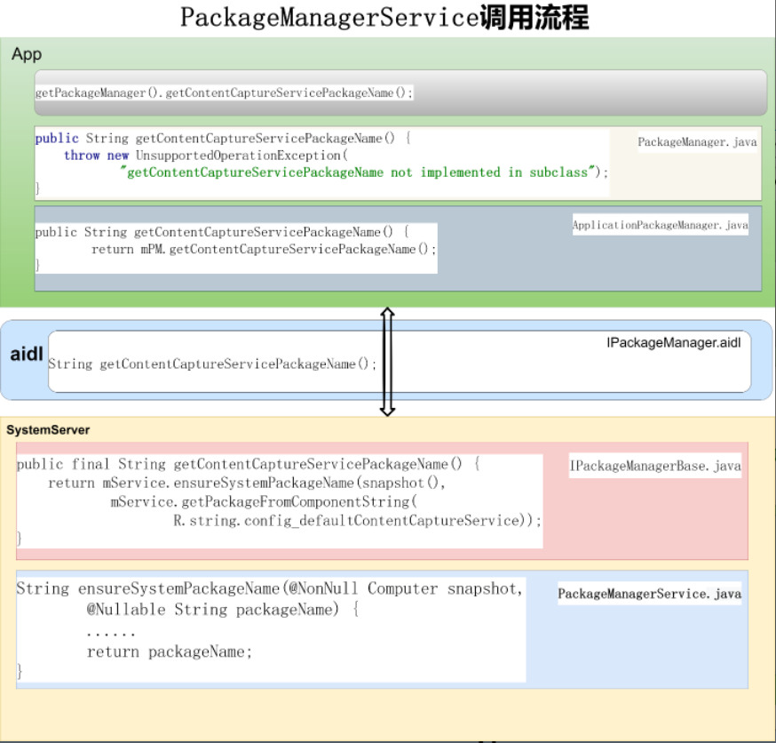
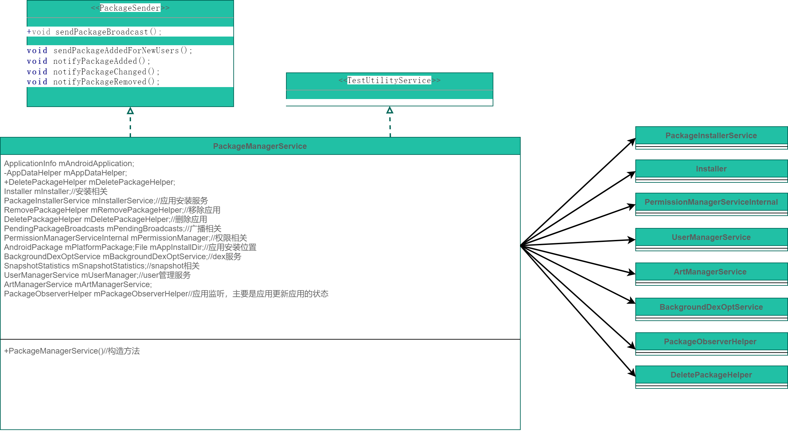

# P15_系统开发之浅谈PackageManagerService


---

# PackageManagerService 类的作用：

管理应用，包括应用安装，删除，更新，应用的位置，应用的权限管理，截图，dex等。

追踪所有的apks，有三个重要的锁：mLock，mInstallLock，mSnapshotLock

```java
* Keep track of all those APKs everywhere.
* Internally there are three important locks:mLock，mInstallLock，mSnapshotLock

如果有修改，请跑一下cts验证修改是否会影响cts：
* $ runtest -c android.content.pm.PackageManagerTests frameworks-core
* $ cts-tradefed run commandAndExit cts -m CtsAppSecurityHostTestCases
```

---

# 获取pkms的方式：

```java
方式1
PackageManager pm = mContext.getPackageManager();

方式2
PackageManager mPm;
mPm = (PackageManager)getSystemService("package");

方式3
IPackageManager mPm;
mPm = IPackageManager.Stub.asInterface(ServiceManager.getService("package"));

方式4
IPackageManager mPM;
mPM = AppGlobals.getPackageManager();

方式5
IPackageManager mPM = ActivityThread.getPackageManager();

方式6 (system server进程使用)
PackageManagerInternal pm = LocalServices.getService(PackageManagerInternal.class);
```

---

# PackageManagerService调用流程





图一 PackageManagerService调用流程

以getContentCaptureServicePackageName为例，查看PackageManagerService调用流程：

(1)app应用中调用getContentCaptureServicePackageName:

```java
getPackageManager().getContentCaptureServicePackageName();
```

(2)PackageManager.java定义getContentCaptureServicePackageName

```java
/**
 * @return the system defined content capture package name, or null if there's none.
 *
 * @hide
 */
@TestApi
@Nullable
public String getContentCaptureServicePackageName() {
    throw new UnsupportedOperationException(
            "getContentCaptureServicePackageName not implemented in subclass");
}
```

(3)PackageManager的子类ApplicationPackageManager实现getContentCaptureServicePackageName

```java
@Override
public String getContentCaptureServicePackageName() {
    try {
        return mPM.getContentCaptureServicePackageName();
    } catch (RemoteException e) {
        throw e.rethrowAsRuntimeException();
    }
}
```

(4)IPackageManager.aidl定义getContentCaptureServicePackageName

```java
String getContentCaptureServicePackageName();
```

(5)IPackageManagerBase实现getContentCaptureServicePackageName逻辑

```java
@Override
@Deprecated
public final String getContentCaptureServicePackageName() {
    return mService.ensureSystemPackageName(snapshot(),
            mService.getPackageFromComponentString(
                    R.string.config_defaultContentCaptureService));
}
```

(6)PackageManagerService调用ensureSystemPackageName逻辑

```java
@Nullable
String ensureSystemPackageName(@NonNull Computer snapshot,
        @Nullable String packageName) {
    if (packageName == null) {
        return null;
    }
    final long token = Binder.clearCallingIdentity();
    try {
        if (snapshot.getPackageInfo(packageName, MATCH_FACTORY_ONLY,
                UserHandle.USER_SYSTEM) == null) {
            PackageInfo packageInfo =
                    snapshot.getPackageInfo(packageName, 0, UserHandle.USER_SYSTEM);
            if (packageInfo != null) {
                EventLog.writeEvent(0x534e4554, "145981139", packageInfo.applicationInfo.uid,
                        "");
            }
            Log.w(TAG, "Missing required system package: " + packageName + (packageInfo != null
                    ? ", but found with extended search." : "."));
            return null;
        }
    } finally {
        Binder.restoreCallingIdentity(token);
    }
    return packageName;
}
```

(7)在SystemServer.startBootstrapServices启动PackageManagerService服务：

```java
t.traceBegin("StartPackageManagerService");
try {
    Watchdog.getInstance().pauseWatchingCurrentThread("packagemanagermain");
    mPackageManagerService = PackageManagerService.main(mSystemContext, installer,
            mFactoryTestMode != FactoryTest.FACTORY_TEST_OFF, mOnlyCore);
} finally {
    Watchdog.getInstance().resumeWatchingCurrentThread("packagemanagermain");
}

// Now that the package manager has started, register the dex load reporter to capture any
// dex files loaded by system server.
// These dex files will be optimized by the BackgroundDexOptService.
SystemServerDexLoadReporter.configureSystemServerDexReporter(mPackageManagerService);

mPackageManager = mSystemContext.getPackageManager();
t.traceEnd();
```

---


# PackageManagerService类图



图三 PackageManagerService类图

图三，我们可以看到PackageManagerService就是管理应用，包括应用安装，删除，更新，应用的位置，应用的权限管理，截图，dex等各个方面的一个综合管理体。

---

# handler消息

有一个handler:

```java
Handler mHandler;
```

消息列表为：

```java
static final int SEND_PENDING_BROADCAST = 1;
static final int INIT_COPY = 5;//复制
static final int POST_INSTALL = 9;//安装前
static final int WRITE_SETTINGS = 13;//写settings
static final int WRITE_PACKAGE_RESTRICTIONS = 14;
static final int PACKAGE_VERIFIED = 15;//应用较验
static final int CHECK_PENDING_VERIFICATION = 16;
// public static final int UNUSED = 17;
// public static final int UNUSED = 18;
static final int WRITE_PACKAGE_LIST = 19;//写应用列表
static final int INSTANT_APP_RESOLUTION_PHASE_TWO = 20;
static final int ENABLE_ROLLBACK_STATUS = 21;
static final int ENABLE_ROLLBACK_TIMEOUT = 22;
static final int DEFERRED_NO_KILL_POST_DELETE = 23;
static final int DEFERRED_NO_KILL_INSTALL_OBSERVER = 24;
static final int INTEGRITY_VERIFICATION_COMPLETE = 25;//完整性较验结束
static final int CHECK_PENDING_INTEGRITY_VERIFICATION = 26;
static final int DOMAIN_VERIFICATION = 27;
static final int PRUNE_UNUSED_STATIC_SHARED_LIBRARIES = 28;
static final int DEFERRED_PENDING_KILL_INSTALL_OBSERVER = 29;
static final int DEFERRED_NO_KILL_POST_DELETE_DELAY_MS = 3 * 1000;
private static final int DEFERRED_NO_KILL_INSTALL_OBSERVER_DELAY_MS = 500;
private static final int DEFERRED_PENDING_KILL_INSTALL_OBSERVER_DELAY_MS = 1000;
```


---

# dump信息

```java
adb shell dumpsys package
```

---

# 日志开关

```java
public static boolean DEBUG_SETTINGS = false;
public static boolean DEBUG_PREFERRED = false;
public static boolean DEBUG_UPGRADE = false;
public static boolean DEBUG_DOMAIN_VERIFICATION = false;
public static boolean DEBUG_BACKUP = false;
public static boolean DEBUG_INSTALL = false;
public static boolean DEBUG_REMOVE = false;
public static boolean DEBUG_BROADCASTS = false;
public static boolean DEBUG_PACKAGE_INFO = false;
public static boolean DEBUG_INTENT_MATCHING = false;
public static boolean DEBUG_PACKAGE_SCANNING = false;
public static boolean DEBUG_VERIFY = false;
public static boolean DEBUG_PERMISSIONS = false;
public static boolean DEBUG_SHARED_LIBRARIES = false;
public static final boolean DEBUG_COMPRESSION = Build.IS_DEBUGGABLE;
public static final boolean TRACE_SNAPSHOTS = false;
private static final boolean DEBUG_PER_UID_READ_TIMEOUTS = false;
//Not report ART metrics to statsd after first flash boot
public static boolean DEBUG_ART_STATSLOG = SystemProperties.getBoolean(
        "persist.sys.pm.art.statslog", false);
// Debug output for dexopting. This is shared between PackageManagerService, OtaDexoptService
// and PackageDexOptimizer. All these classes have their own flag to allow switching a single
// user, but by default initialize to this.
public static boolean DEBUG_DEXOPT = false;
public static boolean DEBUG_ABI_SELECTION = false;
public static boolean DEBUG_INSTANT = Build.IS_DEBUGGABLE;
public static boolean DEBUG_APP_DATA = false;
```


---

# android开发浅谈之PackageManagerService(pkms)

[android开发浅谈之PackageManagerService(pkms)](https://blog.csdn.net/hfreeman2008/article/details/118160530)

https://blog.csdn.net/hfreeman2008/article/details/118160530

---


# 结束语


