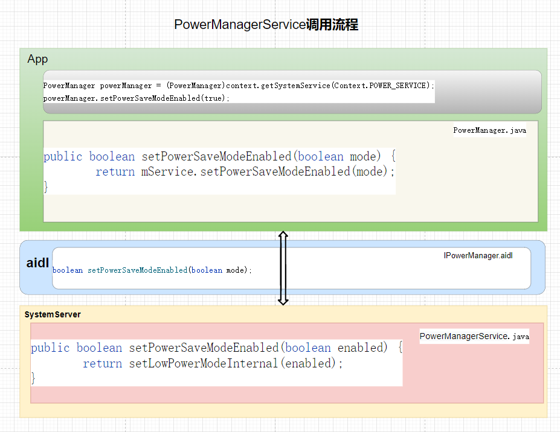
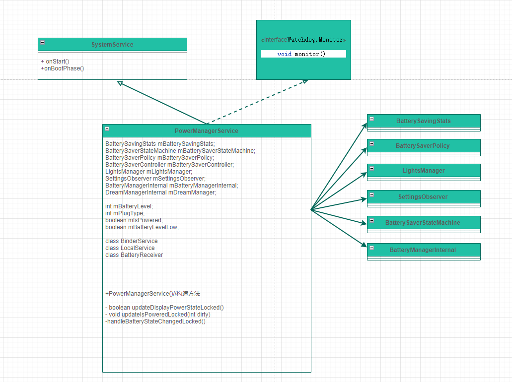

# P16_系统开发之浅谈PowerManagerService


---

# PowerManagerService 类的作用：

主要是处理与电源有关的逻辑,包括手机亮度管理,手机锁屏,节能锁屏,手机低电量模式,手机睡眠,手机双击亮屏.

---


# 获取PowerManagerService的方式：

```java
方式1
PowerManager powerManager = (PowerManager)context.getSystemService(Context.POWER_SERVICE);

方式2
IPowerManager pm = IPowerManager.Stub.asInterface(
        ServiceManager.getService(Context.POWER_SERVICE));

方式3 (system server进程使用)
PowerManagerInternal mLocalPowerManager = getLocalService(PowerManagerInternal.class);
```


# PowerManagerService 调用流程

---



图一 PowerManagerService调用流程

PowerManagerService调用流程和其他的服务完全是一样的，这部分具体讲解就不说了。

---

# 启动PowerManagerService服务：


SystemServer.java

```java
t.traceBegin("StartPowerManager");
mPowerManagerService = mSystemServiceManager.startService(PowerManagerService.class);
t.traceEnd();

......

t.traceBegin("MakePowerManagerServiceReady");
try {
    // TODO: use boot phase
    mPowerManagerService.systemReady(mActivityManagerService.getAppOpsService());
} catch (Throwable e) {
    reportWtf("making Power Manager Service ready", e);
}
t.traceEnd();
```

---


# 注册 PowerManagerService 服务：

SystemServiceRegistry.java
```java
registerService(Context.POWER_SERVICE, PowerManager.class,
        new CachedServiceFetcher<PowerManager>() {
    @Override
    public PowerManager createService(ContextImpl ctx) throws ServiceNotFoundException {
        IBinder powerBinder = ServiceManager.getServiceOrThrow(Context.POWER_SERVICE);
        IPowerManager powerService = IPowerManager.Stub.asInterface(powerBinder);
        IBinder thermalBinder = ServiceManager.getServiceOrThrow(Context.THERMAL_SERVICE);
        IThermalService thermalService = IThermalService.Stub.asInterface(thermalBinder);
        return new PowerManager(ctx.getOuterContext(), powerService, thermalService,
                ctx.mMainThread.getHandler());
    }});
```

---

# PowerManagerService 类图


图三 PowerManagerService类图


---


```java

```


```java

```


```java

```


```java

```


```java

```


```java

```

---


# 结束语


