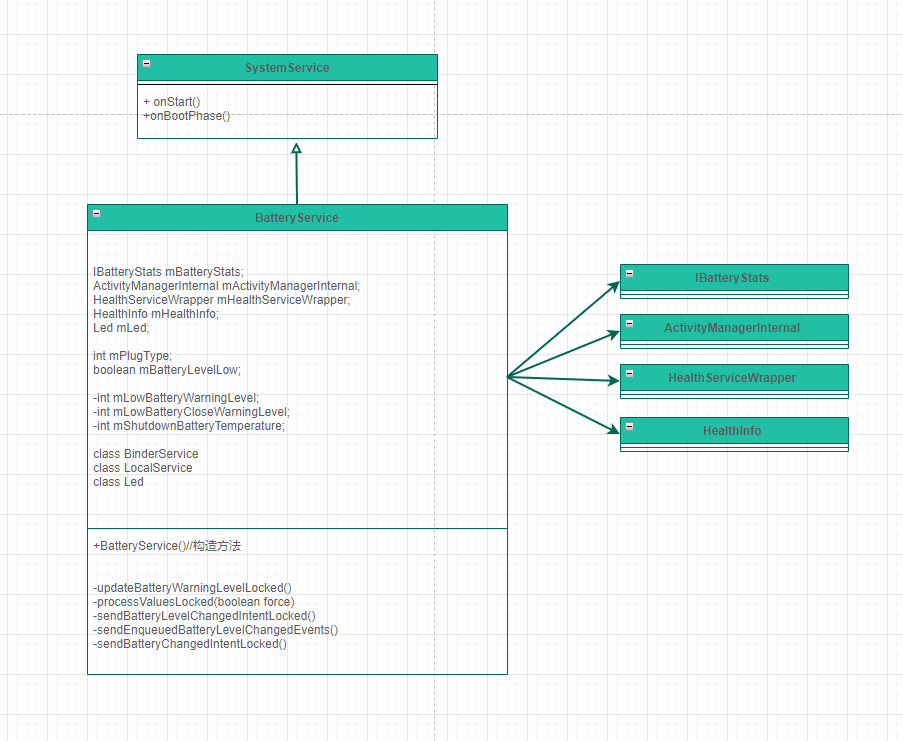
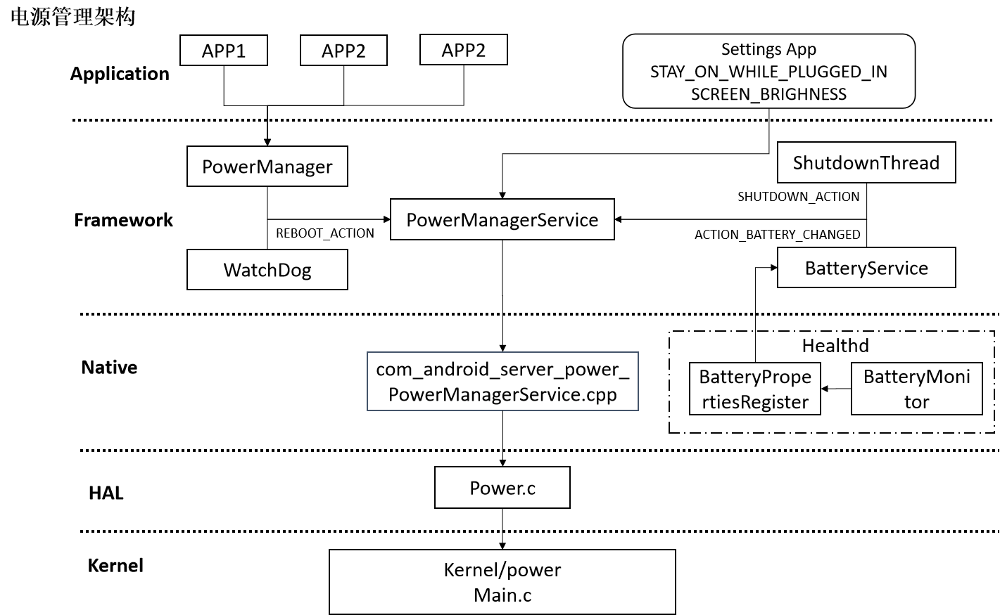

# P17_系统开发之浅谈BatteryService


---

# BatteryService 类的作用：

该服务继承SystemService，主要用于管理 电池的充电状态，充电百分比，监视当前电量的状态,并根据当前的电量状态进行相应的逻辑操作.

如:处理电源的led灯,是否是低电量模式,电池的温度过高时关机,电池的电量为0时关机,把电池的状态同步发送广播通知给系统, 

---

# 获取BatteryService的方式：

```java
方式1
BatteryManager batteryManager =(BatteryManager) context.getSystemService(Context.BATTERY_SERVICE);

方式2
BatteryManager mBatteryManager = mContext.getSystemService(BatteryManager.class);

方式3
IBatteryStats mBatteryStats = IBatteryStats.Stub.asInterface(ServiceManager.getService(BatteryStats.SERVICE_NAME));

方式4 (system server进程使用)
BatteryManagerInternal batteryManagerInternal = LocalServices.getService(BatteryManagerInternal.class);
```

---

# BatteryService 调用流程


图一 BatteryManager调用流程

PowerManagerService调用流程和其他的服务完全是一样的，这部分具体讲解就不说了。

---

# 启动BatteryService服务：
SystemServer.java


```java
t.traceBegin("StartBatteryService");
// Tracks the battery level.  Requires LightService.
mSystemServiceManager.startService(BatteryService.class);
t.traceEnd();
```

---

# 注册BatteryService服务：
SystemServiceRegistry.java

```java
registerService(Context.BATTERY_SERVICE, BatteryManager.class,
        new CachedServiceFetcher<BatteryManager>() {
    @Override
    public BatteryManager createService(ContextImpl ctx) throws ServiceNotFoundException {
        IBatteryStats stats = IBatteryStats.Stub.asInterface(
                ServiceManager.getServiceOrThrow(BatteryStats.SERVICE_NAME));
        IBatteryPropertiesRegistrar registrar = IBatteryPropertiesRegistrar.Stub
                .asInterface(ServiceManager.getServiceOrThrow("batteryproperties"));
        return new BatteryManager(ctx, stats, registrar);
    }});
```

---

# BatteryService 类图


图三 BatteryService类图

---

# handler消息

有一个handler:
```java
private final Handler mHandler;
```

---

# dump信息

查看电池信息

```java
adb shell dumpsys battery
adb shell dumpsys batterystats
```

```java
Current Battery Service state:
  AC powered: false
  USB powered: true
  Wireless powered: false
  Max charging current: 200000
  Max charging voltage: 5000000
  Charge counter: 2963700
  status: 2
  health: 2
  present: true
  level: 90
  scale: 100
  voltage: 4167
  temperature: 354
  technology: Li-ion
```


---

# 日志开关：


```java
private static final boolean DEBUG = false;
```

---

# publishBinderService--battery


```java
private final class BinderService extends Binder

public void onStart() {
    mBinderService = new BinderService();
    publishBinderService("battery", mBinderService);
}

BinderService mBinderService;
```

读取服务的方法：

```java
BatteryManager batteryManager =(BatteryManager) context.getSystemService(Context.BATTERY_SERVICE);
```

---

# publishBinderService--batteryproperties

```java
BatteryPropertiesRegistrar mBatteryPropertiesRegistrar;

private final class BatteryPropertiesRegistrar extends IBatteryPropertiesRegistrar.Stub {
......    
}

public void onStart() {
    mBatteryPropertiesRegistrar = new BatteryPropertiesRegistrar();
    publishBinderService("batteryproperties", mBatteryPropertiesRegistrar);
}
```

读取服务的方法：

```java
IBatteryPropertiesRegistrar registrar = IBatteryPropertiesRegistrar.Stub.asInterface(
        ServiceManager.getService("batteryproperties"));
```

---

# LocalService--BatteryManagerInternal


```java
private final class LocalService extends BatteryManagerInternal {
}

public void onStart() {
    publishLocalService(BatteryManagerInternal.class, new LocalService());
}
```

system_server读取服务：
```java
BatteryManagerInternal batteryManagerInternal = LocalServices.getService(BatteryManagerInternal.class);
```

---

# 电源连接类型
```java
private int mPlugType;

mPlugType = BatteryManager.BATTERY_PLUGGED_AC;
mPlugType = BatteryManager.BATTERY_PLUGGED_USB;
mPlugType = BatteryManager.BATTERY_PLUGGED_WIRELESS;
mPlugType = BATTERY_PLUGGED_NONE;
```

---

# processValuesLocked日志

```java
BatteryService: Processing new values: info={.chargerAcOnline = false, .chargerUsbOnline = true, .chargerWirelessOnline = false, .maxChargingCurrent = 500000, .maxChargingVoltage = 5000000, .batteryStatus = CHARGING, .batteryHealth = GOOD, .batteryPresent = true, .batteryLevel = 100, .batteryVoltage = 4399, .batteryTemperature = 280, .batteryCurrent = 138, .batteryCycleCount = 6, .batteryFullCharge = 3666000, .batteryChargeCounter = 3482700, .batteryTechnology = Li-ion}, mBatteryLevelCritical=false, mPlugType=2, mOemChargerType=-1, mChargingCurrent=125122, mBoardTemperature=348, mUsbChargingVoltage =0
```

```java
processValuesLocked方法
if (DEBUG) {
    Slog.d(TAG, "Processing new values: "
    + "info=" + mHealthInfo
    + ", mBatteryLevelCritical=" + mBatteryLevelCritical
    + ", mPlugType=" + mPlugType);
}
```

---

# 是否是低电量模式

```java
private boolean mBatteryLevelLow;

if (!mBatteryLevelLow) {
    // Should we now switch in to low battery mode?
    //如果没有连接电池,并且当前的电量少于低电量值(20)
    if (mPlugType == BATTERY_PLUGGED_NONE
            && mBatteryProps.batteryLevel <= mLowBatteryWarningLevel) {
        mBatteryLevelLow = true;
    }
```

低电量提醒：
```java
mLowBatteryWarningLevel = mContext.getResources().getInteger(
        com.android.internal.R.integer.config_lowBatteryWarningLevel);
        
mLowBatteryWarningLevel = Settings.Global.getInt(resolver,
        Settings.Global.LOW_POWER_MODE_TRIGGER_LEVEL, defWarnLevel);
```

frameworks\base\core\res\res\values\config.xml
```xml
<!-- Display low battery warning when battery level dips to this value -->
<integer name="config_lowBatteryWarningLevel">20</integer>
```


```java
adb shell settings get global low_power_mode_trigger_level
```

---

# 关闭低电量提醒


```java
private int mLowBatteryCloseWarningLevel;

mLowBatteryCloseWarningLevel = mLowBatteryWarningLevel + mContext.getResources().getInteger(
        com.android.internal.R.integer.config_lowBatteryCloseWarningBump);
```

```java
<!-- Close low battery warning when battery level reaches the lowBatteryWarningLevel
     plus this -->
<integer name="config_lowBatteryCloseWarningBump">5</integer>
```

---

# 关机电池温度


```java
private int mShutdownBatteryTemperature;

mShutdownBatteryTemperature = mContext.getResources().getInteger(
    com.android.internal.R.integer.config_shutdownBatteryTemperature);
```

```xml
<!-- Shutdown if the battery temperature exceeds (this value * 0.1) Celsius. -->
<integer name="config_shutdownBatteryTemperature">680</integer>
```

shutdownIfOverTempLocked-----电池超高温度时关机

```java
private final Handler mHandler;
mHandler = new Handler(true /*async*/);

private void shutdownIfOverTempLocked() {
    // shut down gracefully if temperature is too high (> 68.0C by default)
    // wait until the system has booted before attempting to display the
    // shutdown dialog.
    if (mBatteryProps.batteryTemperature > mShutdownBatteryTemperature) {
        mHandler.post(new Runnable() {
            @Override
            public void run() {
                if (mActivityManagerInternal.isSystemReady()) {
                    Intent intent = new Intent(Intent.ACTION_REQUEST_SHUTDOWN);
                    intent.putExtra(Intent.EXTRA_KEY_CONFIRM, false);
                    intent.setFlags(Intent.FLAG_ACTIVITY_NEW_TASK);
                    mContext.startActivityAsUser(intent, UserHandle.CURRENT);
                }
            }
        });
    }
}
```

---

# 当没有电量时关机

当电量为0时,关机广播  shutdownIfNoPowerLocked()
```java
private void shutdownIfNoPowerLocked() {
    // shut down gracefully if our battery is critically low and we are not powered.
    // wait until the system has booted before attempting to display the shutdown dialog.
    if (shouldShutdownLocked()) {
        mHandler.post(new Runnable() {
            @Override
            public void run() {
                if (mActivityManagerInternal.isSystemReady()) {
                    Intent intent = new Intent(Intent.ACTION_REQUEST_SHUTDOWN);
                    intent.putExtra(Intent.EXTRA_KEY_CONFIRM, false);
                    intent.putExtra(Intent.EXTRA_REASON,
                            PowerManager.SHUTDOWN_LOW_BATTERY);
                    intent.setFlags(Intent.FLAG_ACTIVITY_NEW_TASK);
                    mContext.startActivityAsUser(intent, UserHandle.CURRENT);
                }
            }
        });
    }
}
```

---

# Led ----电池的LED类

```java
private final class Led {
    private final Light mBatteryLight;

    private final int mBatteryLowARGB;
    private final int mBatteryMediumARGB;
    private final int mBatteryFullARGB;
    private final int mBatteryLedOn;
    private final int mBatteryLedOff;

    public Led(Context context, LightsManager lights) {
        mBatteryLight = lights.getLight(LightsManager.LIGHT_ID_BATTERY);

        mBatteryLowARGB = context.getResources().getInteger(
                com.android.internal.R.integer.config_notificationsBatteryLowARGB);
        mBatteryMediumARGB = context.getResources().getInteger(
                com.android.internal.R.integer.config_notificationsBatteryMediumARGB);
        mBatteryFullARGB = context.getResources().getInteger(
                com.android.internal.R.integer.config_notificationsBatteryFullARGB);
        mBatteryLedOn = context.getResources().getInteger(
                com.android.internal.R.integer.config_notificationsBatteryLedOn);
        mBatteryLedOff = context.getResources().getInteger(
                com.android.internal.R.integer.config_notificationsBatteryLedOff);
    }

    /**
     * Synchronize on BatteryService.
     */
    public void updateLightsLocked() {
        final int level = mBatteryProps.batteryLevel;
        final int status = mBatteryProps.batteryStatus;
        // start add for bug 647 by zhengkf
        final boolean  online = mBatteryProps.chargerAcOnline || mBatteryProps.chargerUsbOnline;
        if (level < mLowBatteryWarningLevel) {
            if (status == BatteryManager.BATTERY_STATUS_CHARGING) {
                // Solid red when battery is charging
                if(online) {// add for bug 647 by zhengkf
                  mBatteryLight.setColor(mBatteryLowARGB);
                }
            } else {
                // Flash red when battery is low and not charging
                mBatteryLight.setFlashing(mBatteryLowARGB, Light.LIGHT_FLASH_TIMED,
                        mBatteryLedOn, mBatteryLedOff);
            }
        } else if ((status == BatteryManager.BATTERY_STATUS_CHARGING
                || status == BatteryManager.BATTERY_STATUS_FULL)&& online) { // add for bug 647 by zhengkf
            if (status == BatteryManager.BATTERY_STATUS_FULL || level >= 90) {
                // Solid green when full or charging and nearly full
                mBatteryLight.setColor(mBatteryFullARGB);
            } else {
                // Solid orange when charging and halfway full
                 /* START<fix><demand 188 ><><zhengkf><201901016>> */
                mBatteryLight.setColor(mBatteryLowARGB);
                 /* END<fix><demand 188 ><><zhengkf><201901016>> */
            }
        } else {
           // add for bug 643 by zhengkf
           // add for bug 1002 by chenhb : add notification unread condition for no lights turnoff 
          if(online || getProperty(VALUE_IS_UNREAD).equals("true")) return;
            // No lights if not charging and not low
            mBatteryLight.turnOff();
        }
    }
}
```


```xml
<!-- Default value for led color when battery is low on charge -->
<integer name="config_notificationsBatteryLowARGB">0xFFFF0000</integer>

<!-- Default value for led color when battery is medium charged -->
<integer name="config_notificationsBatteryMediumARGB">0xFFFFFF00</integer>

<!-- Default value for led color when battery is fully charged -->
<integer name="config_notificationsBatteryFullARGB">0xFF00FF00</integer>

<!-- Default value for LED on time when the battery is low on charge in miliseconds -->
<integer name="config_notificationsBatteryLedOn">125</integer>

<!-- Default value for LED off time when the battery is low on charge in miliseconds -->
<integer name="config_notificationsBatteryLedOff">2875</integer>
```

更新电池LED灯:

```java
// Update the battery LED
mLed.updateLightsLocked();
```


---

# 发送电池改变的广播ACTION_BATTERY_CHANGED

主要是把电池的状态信息发送出去


```java
final Intent intent = new Intent(Intent.ACTION_BATTERY_CHANGED);

private void sendBatteryChangedIntentLocked() {
    //  Pack up the values and broadcast them to everyone
    final Intent intent = new Intent(Intent.ACTION_BATTERY_CHANGED);
    intent.addFlags(Intent.FLAG_RECEIVER_REGISTERED_ONLY
            | Intent.FLAG_RECEIVER_REPLACE_PENDING);
    
    int icon = getIconLocked(mHealthInfo.batteryLevel);
    intent.putExtra(BatteryManager.EXTRA_SEQUENCE, mSequence);
    intent.putExtra(BatteryManager.EXTRA_STATUS, mHealthInfo.batteryStatus);
    intent.putExtra(BatteryManager.EXTRA_HEALTH, mHealthInfo.batteryHealth);
    intent.putExtra(BatteryManager.EXTRA_PRESENT, mHealthInfo.batteryPresent);
    intent.putExtra(BatteryManager.EXTRA_LEVEL, mHealthInfo.batteryLevel);
    intent.putExtra(BatteryManager.EXTRA_BATTERY_LOW, mSentLowBatteryBroadcast);
    intent.putExtra(BatteryManager.EXTRA_SCALE, BATTERY_SCALE);
    intent.putExtra(BatteryManager.EXTRA_ICON_SMALL, icon);
    intent.putExtra(BatteryManager.EXTRA_PLUGGED, mPlugType);
    intent.putExtra(BatteryManager.EXTRA_VOLTAGE, mHealthInfo.batteryVoltage);
    intent.putExtra(BatteryManager.EXTRA_TEMPERATURE, mHealthInfo.batteryTemperature);
    intent.putExtra(BatteryManager.EXTRA_TECHNOLOGY, mHealthInfo.batteryTechnology);
    intent.putExtra(BatteryManager.EXTRA_INVALID_CHARGER, mInvalidCharger);
    intent.putExtra(BatteryManager.EXTRA_MAX_CHARGING_CURRENT, mHealthInfo.maxChargingCurrent);
    intent.putExtra(BatteryManager.EXTRA_MAX_CHARGING_VOLTAGE, mHealthInfo.maxChargingVoltage);
    intent.putExtra(BatteryManager.EXTRA_CHARGE_COUNTER, mHealthInfo.batteryChargeCounter);
    if(mCount > 5){
       intent.putExtra("present_mode","1");
    }else{
       intent.putExtra("present_mode","0");
    }
    Slog.d(TAG, "Sending ACTION_BATTERY_CHANGED. scale:" + mCount);
    if (DEBUG) {
        Slog.d(TAG, "Sending ACTION_BATTERY_CHANGED. scale:" + BATTERY_SCALE
                + ", info:" + mHealthInfo.toString());
    }
    if (isBootCompleted) {
        Settings.System.putInt(mContext.getContentResolver(),"battery_level_temp",mHealthInfo.batteryLevel);
    }
    mHandler.post(() -> ActivityManager.broadcastStickyIntent(intent, UserHandle.USER_ALL));    
}
```


```java
private void processValuesLocked(boolean force) {
    ......
    // We are doing this after sending the above broadcasts, so anything processing
    // them will get the new sequence number at that point.  (See for example how testing
    // of JobScheduler's BatteryController works.)
    sendBatteryChangedIntentLocked();

}
```


---
# processValuesLocked实时处理电量

```java
private final class HealthHalCallback extends IHealthInfoCallback.Stub
        implements HealthServiceWrapper.Callback {
    @Override public void healthInfoChanged(android.hardware.health.V2_0.HealthInfo props) {
        android.hardware.health.V2_1.HealthInfo propsLatest =
                new android.hardware.health.V2_1.HealthInfo();
        propsLatest.legacy = props;

        propsLatest.batteryCapacityLevel = BatteryCapacityLevel.UNSUPPORTED;
        propsLatest.batteryChargeTimeToFullNowSeconds =
            Constants.BATTERY_CHARGE_TIME_TO_FULL_NOW_SECONDS_UNSUPPORTED;

        BatteryService.this.update(propsLatest);
    }

    @Override public void healthInfoChanged_2_1(android.hardware.health.V2_1.HealthInfo props) {
        BatteryService.this.update(props);
    }
    
update(android.hardware.health.V2_1.HealthInfo info)
```

```java
private void processValuesLocked(boolean force) {
    // Let the battery stats keep track of the current level.
    try {
        mBatteryStats.setBatteryState(mHealthInfo.batteryStatus, mHealthInfo.batteryHealth,
                mPlugType, mHealthInfo.batteryLevel, mHealthInfo.batteryTemperature,
                mHealthInfo.batteryVoltage, mHealthInfo.batteryChargeCounter,
                mHealthInfo.batteryFullCharge,
                mHealthInfo2p1.batteryChargeTimeToFullNowSeconds);
    } catch (RemoteException e) {
        // Should never happen.
    }
    
    shutdownIfNoPowerLocked();
    shutdownIfOverTempLocked();
    ......    
    // Update the battery LED
    mLed.updateLightsLocked();
}
```

---


```java

```

```java

```

---

# 电源架构




---


# 参考

[Android电池管理系统](https://www.jianshu.com/p/2efd7fc669e5)

https://www.jianshu.com/p/2efd7fc669e5


[Android 电池管理(BatteryService) 详解](https://blog.csdn.net/weixin_42754390/article/details/124268534)

https://blog.csdn.net/weixin_42754390/article/details/124268534


# 结束语

