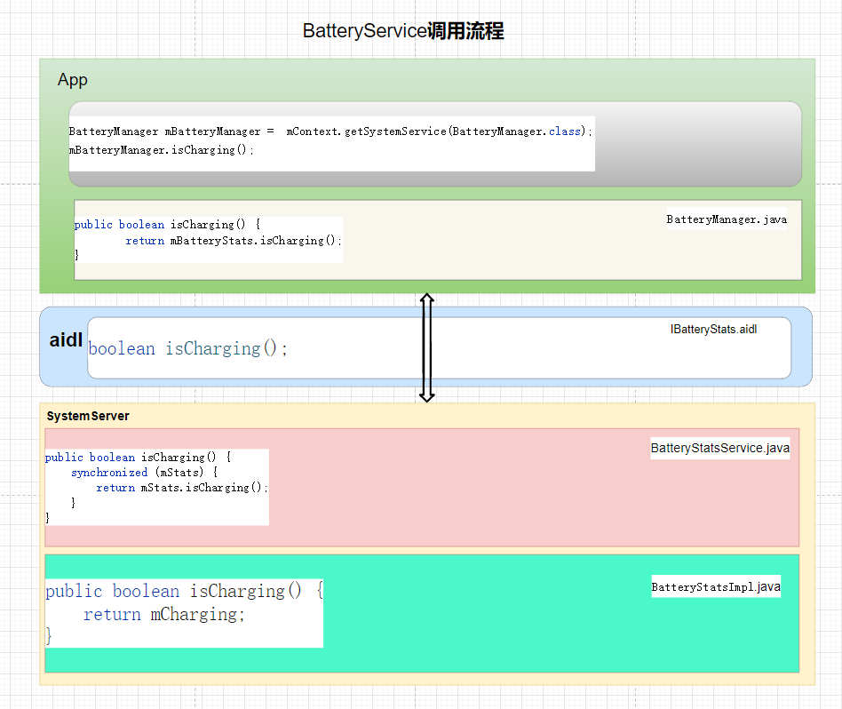

# P17_系统开发之浅谈BatteryService


---

# BatteryService 类的作用：

该服务继承SystemService，主要用于管理 电池的充电状态，充电百分比，监视当前电量的状态,并根据当前的电量状态进行相应的逻辑操作.

如:处理电源的led灯,是否是低电量模式,电池的温度过高时关机,电池的电量为0时关机,把电池的状态同步发送广播通知给系统, 

---

# 获取BatteryService的方式：

```java
方式1
BatteryManager mBatteryManager = mContext.getSystemService(BatteryManager.class);

方式2
IBatteryStats mBatteryStats = IBatteryStats.Stub.asInterface(ServiceManager.getService(BatteryStats.SERVICE_NAME));

方式3 (system server进程使用)
BatteryManagerInternal batteryManagerInternal = LocalServices.getService(BatteryManagerInternal.class);
```

---

# BatteryService 调用流程


图一 BatteryManager调用流程

PowerManagerService调用流程和其他的服务完全是一样的，这部分具体讲解就不说了。

---


```java

```

---

```java

```

```java

```


# 电源架构


---


# 结束语

