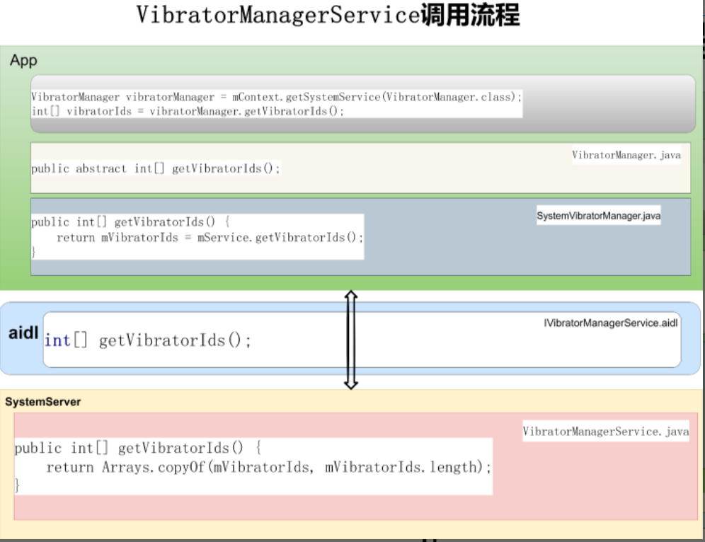

# P18_系统开发之浅谈VibratorManagerService


---

# VibratorManagerService 类的作用：

vibrator管理震动，这个服务比较简单，我们可以参考这个服务来自己做一个服务

---

# 获取 VibratorManagerService 的方式

```java
方式1
VibratorManager vibratorManager = mContext.getSystemService(VibratorManager.class);

方式2
Vibrator mVibrator = (Vibrator) context.getSystemService(Context.VIBRATOR_SERVICE);

方式3
IVibratorManagerService mService = IVibratorManagerService.Stub.asInterface(
        ServiceManager.getService(Context.VIBRATOR_MANAGER_SERVICE));
```

---

# VibratorManagerService 调用流程




图一 VibratorManagerService调用流程

以getVibratorIds()为例，查看VibratorManagerService调用流程：

(1)app应用中调用getVibratorIds:
```java
VibratorManager vibratorManager = mContext.getSystemService(VibratorManager.class);
int[] vibratorIds = vibratorManager.getVibratorIds();
```


(2)VibratorManager.java定义getVibratorIds

```java
/**
 * List all available vibrator ids, returning a possible empty list.
 *
 * @return An array containing the ids of the vibrators available on the device.
 */
@NonNull
public abstract int[] getVibratorIds();
```


(3)VibratorManager的子类SystemVibratorManager实现getVibratorIds
```java
public int[] getVibratorIds() {
    synchronized (mLock) {
        if (mVibratorIds != null) {
            return mVibratorIds;
        }
        try {
            if (mService == null) {
                Log.w(TAG, "Failed to retrieve vibrator ids; no vibrator manager service.");
            } else {
                return mVibratorIds = mService.getVibratorIds();
            }
        } catch (RemoteException e) {
            e.rethrowFromSystemServer();
        }
        return new int[0];
    }
}
```

(4)IVibratorManagerService.aidl定义getVibratorIds
```java
int[] getVibratorIds();
VibratorInfo getVibratorInfo(int vibratorId);
boolean isVibrating(int vibratorId);
boolean registerVibratorStateListener(int vibratorId, in IVibratorStateListener listener);
boolean unregisterVibratorStateListener(int vibratorId, in IVibratorStateListener listener);
boolean setAlwaysOnEffect(int uid, String opPkg, int alwaysOnId,
        in CombinedVibration vibration, in VibrationAttributes attributes);
void vibrate(int uid, String opPkg, in CombinedVibration vibration,
        in VibrationAttributes attributes, String reason, IBinder token);
void cancelVibrate(int usageFilter, IBinder token);
```

(5)VibratorManagerService调用getVibratorIds
```java
@Override // Binder call
public int[] getVibratorIds() {
    return Arrays.copyOf(mVibratorIds, mVibratorIds.length);
}
```

---


# 启动 VibratorManagerService 服务：

SystemServer.java
```java
t.traceBegin("StartVibratorManagerService");
mSystemServiceManager.startService(VibratorManagerService.Lifecycle.class);
t.traceEnd();
```


---

# VibratorManagerService 类图


图三 VibratorManagerService类图

---

# handler消息

有一个handler:
```java
private final Handler mHandler;
```

---

# dump信息
```java

Dumping vibrator manager service to proto...
Dumping vibrator manager service to text...
```

---

# 日志开关

```java
private static final boolean DEBUG = false;
```

---

# 相机界面屏蔽所有震动提醒

在doVibratorOn方法中添加一个白名单，以避免震动


```java
// add begin
// Module Vibrator
//add black activity list for vibrator
import android.app.Activity;
import android.content.ComponentName;
//  add end


// add begin
// Module Vibrator
// add black activity list for vibrator
private String getTopActivityName() {
String topActivityName = "";
//get top activity name
ActivityManager am = (ActivityManager) mContext.getSystemService(Activity.ACTIVITY_SERVICE);
if(am != null
&& am.getRunningTasks(1) != null
&& am.getRunningTasks(1).size() > 0
&& am.getRunningTasks(1).get(0) != null) {
ComponentName comp = am.getRunningTasks(1).get(0).topActivity;
if(comp != null) {
    topActivityName = comp.getClassName();
}
}
return topActivityName;
}

private String getTopActivityPkgName() {
    String topPkgName = "";
    //get top activity package name
    ActivityManager am = (ActivityManager) mContext.getSystemService(Activity.ACTIVITY_SERVICE);
    if(am != null
    && am.getRunningTasks(1) != null
    && am.getRunningTasks(1).size() > 0
    && am.getRunningTasks(1).get(0) != null) {
        ComponentName comp = am.getRunningTasks(1).get(0).topActivity;
    if(comp != null) {
        topPkgName = comp.getPackageName();
    }
    }
    return topPkgName;
}

private String topActivityPkgNameTemp = "";
private String topActivityNameTemp = "";

private boolean isVibratorBlackActivity() {
    boolean result = false;
    topActivityPkgNameTemp = getTopActivityPkgName();
    topActivityNameTemp = getTopActivityName();
    if (DEBUG) {
        Slog.d(TAG, "topActivityPkgNameTemp:" + topActivityPkgNameTemp);
        Slog.d(TAG, "topActivityNameTemp:" + topActivityNameTemp);
    }
    if("com.android.camera".equals(topActivityPkgNameTemp)
    && "com.android.camera.CameraActivity".equals(topActivityNameTemp)){
        Slog.d(TAG, "Turning off vibrator when current activity in black list");
        result = true;
    }
    return result;
}
//  add end


private void doVibratorOn(long millis, int amplitude, int uid, AudioAttributes attrs) {
Trace.traceBegin(Trace.TRACE_TAG_VIBRATOR, "doVibratorOn");
try {
synchronized (mInputDeviceVibrators) {
if (amplitude == VibrationEffect.DEFAULT_AMPLITUDE) {
amplitude = mDefaultVibrationAmplitude;
}

//  add begin
// Module Vibrator
// add black activity list for vibrator
if(isVibratorBlackActivity()){
    return;
}
//  add end

if (DEBUG) {
Slog.d(TAG, "Turning vibrator on for " + millis + " ms" +
" with amplitude " + amplitude + ".");
}
```

---

# 参考资料

[Android Vibrator](https://www.jianshu.com/p/6114071d8879)

https://www.jianshu.com/p/6114071d8879

---


```java

```

```java

```


---


# 结束语


