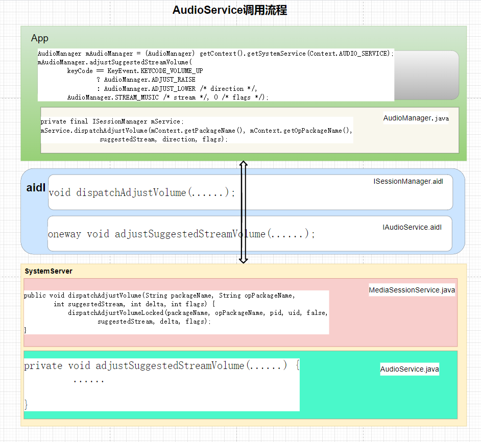
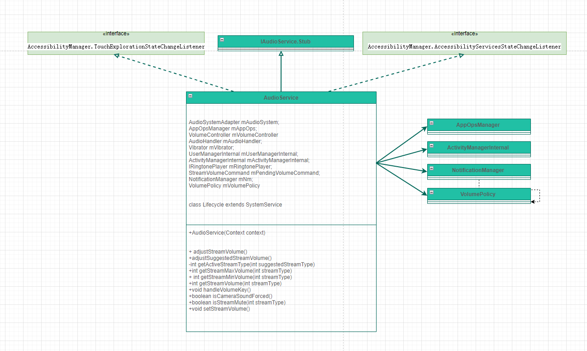

# P19_系统开发之浅谈AudioService


---

# AudioService 类的作用

AudioService 主要用于管理 负责管理应用程序和系统的音频资源。在操作系统中分配、控制和处理音频资源，以提供高质量、可靠和灵活的音频服务。

还负责管理系统音频路由、音频格式转换、音量控制、音频设备的连接和断开、通知应用程序和服务启动/停止的音频事件等。

---

# 获取 AudioService 的方式：

```java
方式1
AudioManager manager = (AudioManager) mContext.getSystemService(Context.AUDIO_SERVICE);

方式2
private static IAudioService sService;
IBinder b = ServiceManager.getService(Context.AUDIO_SERVICE);
sService = IAudioService.Stub.asInterface(b);

方式3 (system server进程使用)
AudioManagerInternal audioManager =LocalServices.getService(AudioManagerInternal.class);
```

---

# AudioService 调用流程



图一 AudioService调用流程

以接口adjustSuggestedStreamVolume为例：

(1)app:
frameworks\base\packages\SystemUI\src\com\android\keyguard\KeyguardHostView.java

```java
if (mAudioManager == null) {
    mAudioManager = (AudioManager) getContext().getSystemService(
            Context.AUDIO_SERVICE);
}

// Volume buttons should only function for music (local or remote).
// TODO: Actually handle MUTE.
mAudioManager.adjustSuggestedStreamVolume(
        keyCode == KeyEvent.KEYCODE_VOLUME_UP
                ? AudioManager.ADJUST_RAISE
                : AudioManager.ADJUST_LOWER /* direction */,
        AudioManager.STREAM_MUSIC /* stream */, 0 /* flags */);
```


(2)frameworks\base\media\java\android\media\AudioManager.java

```java
public void adjustSuggestedStreamVolume(int direction, int suggestedStreamType, int flags) {
    MediaSessionLegacyHelper helper = MediaSessionLegacyHelper.getHelper(getContext());
    helper.sendAdjustVolumeBy(suggestedStreamType, direction, flags);
}
```

(3)frameworks\base\media\java\android\media\session\MediaSessionLegacyHelper.java

```java
public void sendAdjustVolumeBy(int suggestedStream, int delta, int flags) {
    mSessionManager.dispatchAdjustVolume(suggestedStream, delta, flags);
    if (DEBUG) {
        Log.d(TAG, "dispatched volume adjustment");
    }
}
```

(4)frameworks\base\media\java\android\media\session\MediaSessionManager.java

```java
private final ISessionManager mService;

public void dispatchAdjustVolume(int suggestedStream, int direction, int flags) {
    try {
        mService.dispatchAdjustVolume(mContext.getPackageName(), mContext.getOpPackageName(),
                suggestedStream, direction, flags);
    } catch (RemoteException e) {
        Log.e(TAG, "Failed to send adjust volume.", e);
    }
}

```

(5)frameworks\base\media\java\android\media\session\ISessionManager.aidl

```java
void dispatchAdjustVolume(String packageName, String opPackageName, int suggestedStream,
        int delta, int flags);
```

(6)frameworks\base\services\core\java\com\android\server\media\MediaSessionService.java

```java
public void dispatchAdjustVolume(String packageName, String opPackageName,
        int suggestedStream, int delta, int flags) {
    final int pid = Binder.getCallingPid();
    final int uid = Binder.getCallingUid();
    final long token = Binder.clearCallingIdentity();
    try {
        synchronized (mLock) {
            dispatchAdjustVolumeLocked(packageName, opPackageName, pid, uid, false,
                    suggestedStream, delta, flags);
        }
    } finally {
        Binder.restoreCallingIdentity(token);
    }
}

```

(7)frameworks\base\services\core\java\com\android\server\media\MediaSessionService.java

```java
private void dispatchAdjustVolumeLocked(String packageName, String opPackageName, int pid,
        int uid, boolean asSystemService, int suggestedStream, int direction, int flags) {
......
if (session == null || preferSuggestedStream) {
......
    try {
        mAudioManagerInternal.adjustSuggestedStreamVolumeForUid(suggestedStream,
                direction, flags, callingOpPackageName, callingUid, callingPid);
    }
} else {
    ......
    session.adjustVolume(packageName, opPackageName, pid, uid, asSystemService,
            direction, flags, true);
}

```

(8)frameworks\base\services\core\java\com\android\server\audio\AudioService.java

```java
public void adjustSuggestedStreamVolumeForUid(int streamType, int direction, int flags,
        String callingPackage, int uid, int pid) {
    // direction and stream type swap here because the public
    // adjustSuggested has a different order than the other methods.
    adjustSuggestedStreamVolume(direction, streamType, flags, callingPackage,
            callingPackage, uid, hasModifyAudioSettings, VOL_ADJUST_NORMAL);
}

private void adjustSuggestedStreamVolume(int direction, int suggestedStreamType, int flags,
        String callingPackage, String caller, int uid, boolean hasModifyAudioSettings,
        int keyEventMode) {
         ......

}

```

(9)aidl:
frameworks\base\media\java\android\media\IAudioService.aidl

```java
oneway void adjustSuggestedStreamVolume(int direction, int suggestedStreamType, int flags,
        String callingPackage, String caller);

```

---

# 通过音量键是如何调整音量

在按下音量键的时候，会先经过PhoneWindowManager的处理是否拦截：
```java
public long interceptKeyBeforeDispatching(IBinder focusedToken, KeyEvent event,
        int policyFlags) {
            ......
else if (keyCode == KeyEvent.KEYCODE_VOLUME_UP
        || keyCode == KeyEvent.KEYCODE_VOLUME_DOWN
        || keyCode == KeyEvent.KEYCODE_VOLUME_MUTE) {
    if (mUseTvRouting || mHandleVolumeKeysInWM) {
        // On TVs or when the configuration is enabled, volume keys never
        // go to the foreground app.
        dispatchDirectAudioEvent(event);
        return -1;
    }

}
private void dispatchDirectAudioEvent(KeyEvent event) {
    try {
        getAudioService().handleVolumeKey(event, mUseTvRouting,
                mContext.getOpPackageName(), TAG);
    } catch (Exception e) {
        Log.e(TAG, "Error dispatching volume key in handleVolumeKey for event:"
                + event, e);
    }
}

```

frameworks\base\services\core\java\com\android\server\audio\AudioService.java

```java
public void handleVolumeKey(@NonNull KeyEvent event, boolean isOnTv,
        @NonNull String callingPackage, @NonNull String caller) {
   .......
    switch (event.getKeyCode()) {
        case KeyEvent.KEYCODE_VOLUME_UP:
                adjustSuggestedStreamVolume(AudioManager.ADJUST_RAISE,
                        AudioManager.USE_DEFAULT_STREAM_TYPE, flags, callingPackage, caller,
                        Binder.getCallingUid(), true, keyEventMode);
            break;
        case KeyEvent.KEYCODE_VOLUME_DOWN:
                adjustSuggestedStreamVolume(AudioManager.ADJUST_LOWER,
                        AudioManager.USE_DEFAULT_STREAM_TYPE, flags, callingPackage, caller,
                        Binder.getCallingUid(), true, keyEventMode);
            break;
        case KeyEvent.KEYCODE_VOLUME_MUTE:
            if (event.getAction() == KeyEvent.ACTION_DOWN && event.getRepeatCount() == 0) {
                adjustSuggestedStreamVolume(AudioManager.ADJUST_TOGGLE_MUTE,
                        AudioManager.USE_DEFAULT_STREAM_TYPE, flags, callingPackage, caller,
                        Binder.getCallingUid(), true, VOL_ADJUST_NORMAL);
            }
            break;
        default:
            Log.e(TAG, "Invalid key code " + event.getKeyCode() + " sent by " + callingPackage);
            return; // not needed but added if code gets added below this switch statement
    }
}

/** @see AudioManager#adjustVolume(int, int) */
public void adjustSuggestedStreamVolume(int direction, int suggestedStreamType, int flags,
        String callingPackage, String caller) {
    boolean hasModifyAudioSettings =
            mContext.checkCallingPermission(Manifest.permission.MODIFY_AUDIO_SETTINGS)
            == PackageManager.PERMISSION_GRANTED;
    adjustSuggestedStreamVolume(direction, suggestedStreamType, flags, callingPackage,
            caller, Binder.getCallingUid(), hasModifyAudioSettings, VOL_ADJUST_NORMAL);
}

private void adjustSuggestedStreamVolume(int direction, int suggestedStreamType, int flags,
        String callingPackage, String caller, int uid, boolean hasModifyAudioSettings,
        int keyEventMode) {
......
    adjustStreamVolume(streamType, direction, flags, callingPackage, caller, uid,
            hasModifyAudioSettings, keyEventMode);
}

```


# 启动AudioService 服务：

SystemServer.java

```java
t.traceBegin("StartAudioService");
if (!isArc) {
    mSystemServiceManager.startService(AudioService.Lifecycle.class);
} else {
    String className = context.getResources()
            .getString(R.string.config_deviceSpecificAudioService);
    try {
        mSystemServiceManager.startService(className + "$Lifecycle");
    } catch (Throwable e) {
        reportWtf("starting " + className, e);
    }
}
t.traceEnd();
```

---

# 注册Audio

SystemServiceRegistry.java

```java
registerService(Context.AUDIO_SERVICE, AudioManager.class,
        new CachedServiceFetcher<AudioManager>() {
    @Override
    public AudioManager createService(ContextImpl ctx) {
        return new AudioManager(ctx);
    }});
```

---

# AudioService 类图



图三 AudioService类图

---

# handler消息

有一个handler:


```java
private class AudioHandler extends Handler
```

消息列表：

```java
// AudioHandler messages
private static final int MSG_SET_DEVICE_VOLUME = 0;
private static final int MSG_PERSIST_VOLUME = 1;
private static final int MSG_PERSIST_VOLUME_GROUP = 2;
private static final int MSG_PERSIST_RINGER_MODE = 3;
private static final int MSG_AUDIO_SERVER_DIED = 4;
private static final int MSG_PLAY_SOUND_EFFECT = 5;
private static final int MSG_LOAD_SOUND_EFFECTS = 7;
private static final int MSG_SET_FORCE_USE = 8;
private static final int MSG_BT_HEADSET_CNCT_FAILED = 9;
private static final int MSG_SET_ALL_VOLUMES = 10;
private static final int MSG_CHECK_MUSIC_ACTIVE = 11;
private static final int MSG_CONFIGURE_SAFE_MEDIA_VOLUME = 12;
private static final int MSG_CONFIGURE_SAFE_MEDIA_VOLUME_FORCED = 13;
private static final int MSG_PERSIST_SAFE_VOLUME_STATE = 14;
private static final int MSG_UNLOAD_SOUND_EFFECTS = 15;
private static final int MSG_SYSTEM_READY = 16;
private static final int MSG_PERSIST_MUSIC_ACTIVE_MS = 17;
private static final int MSG_UNMUTE_STREAM = 18;
private static final int MSG_DYN_POLICY_MIX_STATE_UPDATE = 19;
private static final int MSG_INDICATE_SYSTEM_READY = 20;
private static final int MSG_ACCESSORY_PLUG_MEDIA_UNMUTE = 21;
private static final int MSG_NOTIFY_VOL_EVENT = 22;
private static final int MSG_DISPATCH_AUDIO_SERVER_STATE = 23;
private static final int MSG_ENABLE_SURROUND_FORMATS = 24;
private static final int MSG_UPDATE_RINGER_MODE = 25;
private static final int MSG_SET_DEVICE_STREAM_VOLUME = 26;
private static final int MSG_OBSERVE_DEVICES_FOR_ALL_STREAMS = 27;
private static final int MSG_HDMI_VOLUME_CHECK = 28;
private static final int MSG_PLAYBACK_CONFIG_CHANGE = 29;
private static final int MSG_BROADCAST_MICROPHONE_MUTE = 30;
private static final int MSG_CHECK_MODE_FOR_UID = 31;
private static final int MSG_REINIT_VOLUMES = 32;
```

---

# dump信息

命令：
```java
adb shell dumpsys audio
```


```java
Audio event log: audio services lifecycle
06-04 20:03:29:785 AudioService()

Message handler (watch for unhandled messages):
  Handler (com.android.server.audio.AudioService$AudioHandler) {6dfb37a} @ 51717218
    Looper (AudioService, tid 104) {4ac72b}
      (Total messages: 0, polling=true, quitting=false)

MediaFocusControl dump time: 上午10:25:13

Audio Focus stack entries (last is top of stack):

No external focus policy

 Notify on duck:  true

 In ring or call: false

Audio event log: focus commands as seen by MediaFocusControl
Multi Audio Focus enabled :false

Stream volumes (device: index)
- STREAM_VOICE_CALL:
   Muted: false
   Muted Internally: false
   Min: 1
   Max: 5
   streamVolume:3
   Current: 40000000 (default): 3
   Devices: earpiece
- STREAM_SYSTEM:
   Muted: false
   Muted Internally: false
   Min: 0
   Max: 7
   streamVolume:5
   Current: 40000000 (default): 5
   Devices: speaker
```

---

# 日志开关

```java
/** Debug audio mode */
protected static final boolean DEBUG_MODE = false;

/** Debug audio policy feature */
protected static final boolean DEBUG_AP = false;

/** Debug volumes */
protected static final boolean DEBUG_VOL = true;//false;

/** debug calls to devices APIs */
protected static final boolean DEBUG_DEVICES = false;

/** debug SCO modes */
protected static final boolean DEBUG_SCO = true;
```

---

# Lifecycle--publishBinderService


```java
public static final class Lifecycle extends SystemService {
    private AudioService mService;

    public Lifecycle(Context context) {
        super(context);
        mService = new AudioService(context);
    }

    @Override
    public void onStart() {
        publishBinderService(Context.AUDIO_SERVICE, mService);
    }

    @Override
    public void onBootPhase(int phase) {
        if (phase == SystemService.PHASE_ACTIVITY_MANAGER_READY) {
            mService.systemReady();
        }
    }
}
```

其他进程读取服务的方法：

```java
AudioManager manager = (AudioManager) mContext.getSystemService(Context.AUDIO_SERVICE);
```

---

# LocalServices--AudioServiceInternal

```java
LocalServices.addService(AudioManagerInternal.class, new AudioServiceInternal());
```

system server进程使用:
```java
AudioManagerInternal audioManager =LocalServices.getService(AudioManagerInternal.class);
```

---

# 各种类型音量的最大值和最小值
```java
   /** Maximum volume index values for audio streams */
    private static int[] MAX_STREAM_VOLUME = new int[] {
        5,  // STREAM_VOICE_CALL
        7,  // STREAM_SYSTEM
        7,  // STREAM_RING
        15, // STREAM_MUSIC
        7,  // STREAM_ALARM
        7,  // STREAM_NOTIFICATION
        15, // STREAM_BLUETOOTH_SCO
        7,  // STREAM_SYSTEM_ENFORCED
        15, // STREAM_DTMF
        15, // STREAM_TTS
        15  // STREAM_ACCESSIBILITY
    };

    /** Minimum volume index values for audio streams */
    private static int[] MIN_STREAM_VOLUME = new int[] {
        1,  // STREAM_VOICE_CALL  所以我们可以看到打电话时，声音的最小值为1，怎么也不能调整到0
        0,  // STREAM_SYSTEM
        0,  // STREAM_RING
        0,  // STREAM_MUSIC
        0,  // STREAM_ALARM
        0,  // STREAM_NOTIFICATION
        0,  // STREAM_BLUETOOTH_SCO
        0,  // STREAM_SYSTEM_ENFORCED
        0,  // STREAM_DTMF
        0,  // STREAM_TTS
        0   // STREAM_ACCESSIBILITY
    };
```


---

# 读取默认声音值：

```java
readSettings()
 int defaultIndex = (device == AudioSystem.DEVICE_OUT_DEFAULT) ?getDefaultMaximumVolume() : -1;


//Set default volume
private int getDefaultMaximumVolume(){
    String volume = android.os.SystemProperties.get("ro.pt.default_volume_set","false");
    Slog.d(TAG, "getDefaultMaximumVolume: volume = "+volume);
    if(!"false".equals(volume)){
        String[] volumeIndex = volume.split(",");
        Slog.d(TAG, "getDefaultMaximumVolume: volumeIndex = "+volumeIndex[mStreamType]);
        return Integer.valueOf(volumeIndex[mStreamType]);
    }
    return AudioSystem.DEFAULT_STREAM_VOLUME[mStreamType];
}
// END.
```

我们默认设置系统属性ro.pt.default_volume_set就可以。

```java
/** Maximum volume index values for audio streams */
private static int[] MAX_STREAM_VOLUME = new int[] {
    5,  // STREAM_VOICE_CALL
    7,  // STREAM_SYSTEM
    7,  // STREAM_RING
    15, // STREAM_MUSIC
    7,  // STREAM_ALARM
    7,  // STREAM_NOTIFICATION
    15, // STREAM_BLUETOOTH_SCO
    7,  // STREAM_SYSTEM_ENFORCED
    15, // STREAM_DTMF
    15, // STREAM_TTS
    15  // STREAM_ACCESSIBILITY
};
```

---

# 调整声音的方法

adjustStreamVolume

```java
private void adjustStreamVolume(int streamType, int direction, int flags,
        String callingPackage, String caller, int uid) {
```

有几个着急的参数：
streamType----声音类型
direction--------音量是增加还是减少

这是调节音量时，弹出音量达大的确认提示框

```java
else if ((direction == AudioManager.ADJUST_RAISE) &&
                    !checkSafeMediaVolume(streamTypeAlias, aliasIndex + step, device)) {
                Log.e(TAG, "adjustStreamVolume() safe volume index = " + oldIndex);
                mVolumeController.postDisplaySafeVolumeWarning(flags);
```

setStreamVolume---设置音量
setStreamVolumeInt

```java
sendMsg(mAudioHandler,
        MSG_SET_DEVICE_VOLUME,
        SENDMSG_QUEUE,
        device,
        0,
        streamState,
        0);
```


---

# 一个正常的音量加的调用流程：

```java
WindowManager: interceptKeyBeforeQueueing keycode=24 interactive=true keyguardActive=false policyFlags=22000000scanKeyCode=115 mDeviceMode=0 isLockScreenShow=false
WindowManager: interceptKeyBeforeQueueing keycode=24scanKeyCode=115
WindowManager: interceptHytKeyDown keycode=115
WindowManager: interceptKeyTi keyCode=24 down=true repeatCount=0 keyguardOn=false canceled=false
MediaSessionService: dispatchVolumeKeyEvent, pkg=com.android.settings, opPkg=com.android.settings, pid=2902, uid=1000, asSystem=true, event=KeyEvent { action=ACTION_DOWN, keyCode=KEYCODE_VOLUME_UP, scanCode=115, metaState=0, flags=0x8, repeatCount=0, eventTime=55696364, downTime=55696364, deviceId=3, source=0x101, displayId=-1 }, stream=-2147483648, musicOnly=false
MediaSessionService: Adjusting suggestedStream=-2147483648 by 1. flags=4113, preferSuggestedStream=false, session=null
AS.AudioService: adjustSuggestedStreamVolume() stream=-2147483648, flags=4113, caller=android, volControlStream=-1, userSelect=false
AS.AudioService: adjustSuggestedStreamVolume() stream=-2147483648, flags=4113, caller=android, volControlStream=-1, userSelect=false
AS.AudioService: getActiveStreamType: Forcing DEFAULT_VOL_STREAM_NO_PLAYBACK(3) b/c default
AS.AudioService: Volume controller suppressed adjustment
AS.AudioService: adjustStreamVolume() stream=3, dir=0, flags=4097, caller=android
vol.Events: writeEvent active_stream_changed STREAM_MUSIC
AS.AudioService: forceVolumeControlStream(3)
vol.Events: writeEvent key STREAM_MUSIC 10
vol.Events: writeEvent show_dialog volume_changed keyguard=false
AS.AudioService: Volume controller visible: true
```

AudioService相关的调用：

```java
adjustSuggestedStreamVolume----adjustStreamVolume--forceVolumeControlStream--notifyVolumeControllerVisible
```

AS.AudioService: Volume controller visible: true   日志对应：

```java
public void notifyVolumeControllerVisible(final IVolumeController controller, boolean visible) {
    enforceVolumeController("notify about volume controller visibility");
    mVolumeController.setVisible(visible);
    if (DEBUG_VOL) Log.d(TAG, "Volume controller visible: " + visible);
}
```

---

# 常用与声音的方法：

```java
getStreamVolume
getStreamMaxVolume
getStreamMinVolume
getLastAudibleStreamVolume
getUiSoundsStreamType

setStreamVolume()
setStreamVolumeInt()
    
public void adjustSuggestedStreamVolume()
public void adjustStreamVolume()
```

---

# 确定增加声音时，是否要弹出声音提示框的标志位

```java
mSafeMediaVolumeState = new Integer(Settings.Global.getInt(mContentResolver,Settings.Global.AUDIO_SAFE_VOLUME_STATE,SAFE_MEDIA_VOLUME_NOT_CONFIGURED));
```

```java
adb shell "settings get global audio_safe_volume_state"
3
```

不显示提示框

```java
private static final int SAFE_MEDIA_VOLUME_NOT_CONFIGURED = 0;
private static final int SAFE_MEDIA_VOLUME_DISABLED = 1;
private static final int SAFE_MEDIA_VOLUME_INACTIVE = 2;  // confirmed
private static final int SAFE_MEDIA_VOLUME_ACTIVE = 3;  // unconfirmed
```

对此上面这个值的改变处理逻辑：

```java
private static final int MSG_PERSIST_SAFE_VOLUME_STATE = 18;
case MSG_PERSIST_SAFE_VOLUME_STATE:
```

连续按增加声音键，会发送消息：

```java
MSG_CONFIGURE_SAFE_MEDIA_VOLUME
```

checkSafeMediaVolume
确定增加声音时，是否要弹出声音提示框

onConfigureSafeVolume

```java
boolean safeMediaVolumeEnabled =
        SystemProperties.getBoolean("audio.safemedia.force", false)
        || mContext.getResources().getBoolean(
                com.android.internal.R.bool.config_safe_media_volume_enabled);
```

配置增加音量时的提示框，是否显示：
```java
<!-- Whether safe headphone volume is enabled or not (country specific). -->
<bool name="config_safe_media_volume_enabled">true</bool>
```


```java
safeMediaVolumeIndex
setSafeMediaVolumeEnabled
enforceSafeMediaVolume
disableSafeMediaVolume
```

---

# 调节声音时，是否弹出音量过大的提示框的音量阈值：

```java
// mSafeMediaVolumeIndex is the cached value of config_safe_media_volume_index property
private int mSafeMediaVolumeIndex;

......

mSafeMediaVolumeIndex = mContext.getResources().getInteger(
        com.android.internal.R.integer.config_safe_media_volume_index) * 10;

......

private int safeMediaVolumeIndex(int device) {
    if ((device & mSafeMediaVolumeDevices) == 0) {
        return MAX_STREAM_VOLUME[AudioSystem.STREAM_MUSIC];
    }
    if (device == AudioSystem.DEVICE_OUT_USB_HEADSET) {
        return mSafeUsbMediaVolumeIndex;
    } else {
        return mSafeMediaVolumeIndex;
    }
}
```

如果是(device & mSafeMediaVolumeDevices) == 0，则由MAX_STREAM_VOLUME[AudioSystem.STREAM_MUSIC]决定：

```java
/** Maximum volume index values for audio streams */
private static int[] MAX_STREAM_VOLUME = new int[] {
    15, // STREAM_MUSIC
```

安全多媒体音量设备：

```java
// mSafeMediaVolumeDevices lists the devices for which safe media volume is enforced,
private final int mSafeMediaVolumeDevices = AudioSystem.DEVICE_OUT_WIRED_HEADSET |
                                            AudioSystem.DEVICE_OUT_WIRED_HEADPHONE |
                                            AudioSystem.DEVICE_OUT_USB_HEADSET;
```

如果是AudioSystem.DEVICE_OUT_USB_HEADSET，则由getSafeUsbMediaVolumeIndex决定：

```java
private int getSafeUsbMediaVolumeIndex()
{
    // determine UI volume index corresponding to the wanted safe gain in dBFS
    int min = MIN_STREAM_VOLUME[AudioSystem.STREAM_MUSIC];
    int max = MAX_STREAM_VOLUME[AudioSystem.STREAM_MUSIC];

    while (Math.abs(max-min) > 1) {
        int index = (max + min) / 2;
        float gainDB = AudioSystem.getStreamVolumeDB(
                AudioSystem.STREAM_MUSIC, index, AudioSystem.DEVICE_OUT_USB_HEADSET);
        if (Float.isNaN(gainDB)) {
            //keep last min in case of read error
            break;
        } else if (gainDB == SAFE_VOLUME_GAIN_DBFS) {
            min = index;
            break;
        } else if (gainDB < SAFE_VOLUME_GAIN_DBFS) {
            min = index;
        } else {
            max = index;
        }
    }
    return min * 10;
}
```

一般是由配置文件确定：
```xml
<!-- Safe headphone volume index. When music stream volume is below this index
the SPL on headphone output is compliant to EN 60950 requirements for portable music
players. -->
<integer name="config_safe_media_volume_index">10</integer>
```

---

# 声音提示框类

frameworks\base\packages\SystemUI\src\com\android\systemui\volume\SafetyWarningDialog.java

三个响应操作的接口
```java
onKeyUp
onKeyDown
onClick
```


```java
public void onClick(DialogInterface dialog, int which) {
    mAudioManager.disableSafeMediaVolume();
}
```

---

# 配置是否固定声音，不让声音改变音量：

```java
private final boolean mUseFixedVolume;

mUseFixedVolume = mContext.getResources().getBoolean(
                com.android.internal.R.bool.config_useFixedVolume);
```


```xml
<!-- Flag indicating that the media framework should not allow changes or mute on any
        stream or master volumes. -->
<bool name="config_useFixedVolume">false</bool>
```

---

# 配置是否有拍照声音

```java
private boolean readCameraSoundForced() {
    return SystemProperties.getBoolean("audio.camerasound.force", false) ||
            mContext.getResources().getBoolean(
                    com.android.internal.R.bool.config_camera_sound_forced);
}
```


```xml
<!-- Whether camera shutter sound is forced or not  (country specific). -->
<bool name="config_camera_sound_forced">false</bool>
```

---

# 音效文件的路径：

frameworks\base\services\core\java\com\android\server\audio\SoundEffectsHelper.java
```java
/* Sound effect file names  */
private static final String SOUND_EFFECTS_PATH = "/media/audio/ui/";
```

frameworks\base\media\java\android\media\MediaActionSound.java

```java
private static final String[] SOUND_DIRS = {
    "/product/media/audio/ui/",
    "/system/media/audio/ui/",
};
```

---

# 加载触摸声音资源

frameworks\base\services\core\java\com\android\server\audio\SoundEffectsHelper.java
```java
loadTouchSoundAssets()
```

音效资源配置文件：
frameworks/base/core/res/res/xml/audio_assets.xml
```xml
<audio_assets version="1.0">
    <group name="touch_sounds">
        <asset id="FX_KEY_CLICK" file="Effect_Tick.ogg"/>
        <asset id="FX_FOCUS_NAVIGATION_UP" file="Effect_Tick.ogg"/>
        <asset id="FX_FOCUS_NAVIGATION_DOWN" file="Effect_Tick.ogg"/>
        <asset id="FX_FOCUS_NAVIGATION_LEFT" file="Effect_Tick.ogg"/>
        <asset id="FX_FOCUS_NAVIGATION_RIGHT" file="Effect_Tick.ogg"/>
        <asset id="FX_KEYPRESS_STANDARD" file="KeypressStandard.ogg"/>
        <asset id="FX_KEYPRESS_SPACEBAR" file="KeypressSpacebar.ogg"/>
        <asset id="FX_KEYPRESS_DELETE" file="KeypressDelete.ogg"/>
        <asset id="FX_KEYPRESS_RETURN" file="KeypressReturn.ogg"/>
        <asset id="FX_KEYPRESS_INVALID" file="KeypressInvalid.ogg"/>
    </group>
</audio_assets>
```

---

# 与声音有关的系统属性：

```java
int maxCallVolume = SystemProperties.getInt("ro.config.vc_call_vol_steps", -1);
int defaultCallVolume = SystemProperties.getInt("ro.config.vc_call_vol_default", -1);
int maxMusicVolume = SystemProperties.getInt("ro.config.media_vol_steps", -1);
int defaultMusicVolume = SystemProperties.getInt("ro.config.media_vol_default", -1);
int maxAlarmVolume = SystemProperties.getInt("ro.config.alarm_vol_steps", -1);
int defaultAlarmVolume = SystemProperties.getInt("ro.config.alarm_vol_default", -1);
int maxSystemVolume = SystemProperties.getInt("ro.config.system_vol_steps", -1);
int defaultSystemVolume = SystemProperties.getInt("ro.config.system_vol_default", -1);
mMonitorRotation = SystemProperties.getBoolean("ro.audio.monitorRotation", false);
SystemProperties.getBoolean("audio.safemedia.bypass", false)
SystemProperties.getBoolean("audio.safemedia.force", false)
SystemProperties.getBoolean("audio.safemedia.bypass", false)
SystemProperties.getBoolean("audio.camerasound.force", false) 
```

---

# SettingsObserver--内容监听类：

```java
private class SettingsObserver extends ContentObserver {

    SettingsObserver() {
        super(new Handler());
        mContentResolver.registerContentObserver(Settings.Global.getUriFor(
                Settings.Global.ZEN_MODE), false, this);
        mContentResolver.registerContentObserver(Settings.Global.getUriFor(
                Settings.Global.ZEN_MODE_CONFIG_ETAG), false, this);
        mContentResolver.registerContentObserver(Settings.System.getUriFor(
            Settings.System.MODE_RINGER_STREAMS_AFFECTED), false, this);
        mContentResolver.registerContentObserver(Settings.Global.getUriFor(
            Settings.Global.DOCK_AUDIO_MEDIA_ENABLED), false, this);
        mContentResolver.registerContentObserver(Settings.System.getUriFor(
                Settings.System.MASTER_MONO), false, this);
        mContentResolver.registerContentObserver(Settings.System.getUriFor(
                Settings.System.MASTER_BALANCE), false, this);

        mEncodedSurroundMode = Settings.Global.getInt(
                mContentResolver, Settings.Global.ENCODED_SURROUND_OUTPUT,
                Settings.Global.ENCODED_SURROUND_OUTPUT_AUTO);
        mContentResolver.registerContentObserver(Settings.Global.getUriFor(
                Settings.Global.ENCODED_SURROUND_OUTPUT), false, this);

        mEnabledSurroundFormats = Settings.Global.getString(
                mContentResolver, Settings.Global.ENCODED_SURROUND_OUTPUT_ENABLED_FORMATS);
        mContentResolver.registerContentObserver(Settings.Global.getUriFor(
                Settings.Global.ENCODED_SURROUND_OUTPUT_ENABLED_FORMATS), false, this);

        mContentResolver.registerContentObserver(Settings.Secure.getUriFor(
                Settings.Secure.VOICE_INTERACTION_SERVICE), false, this);
        mContentResolver.registerContentObserver(mUriSilentStatus, false, this);
    }
```

---

# 监听广播

```java
class AudioServiceBroadcastReceiver extends BroadcastReceiver;

// Register for device connection intent broadcasts.
IntentFilter intentFilter =
        new IntentFilter(BluetoothHeadset.ACTION_AUDIO_STATE_CHANGED);
intentFilter.addAction(BluetoothHeadset.ACTION_ACTIVE_DEVICE_CHANGED);
intentFilter.addAction(Intent.ACTION_DOCK_EVENT);
intentFilter.addAction(Intent.ACTION_SCREEN_ON);
intentFilter.addAction(Intent.ACTION_SCREEN_OFF);
intentFilter.addAction(Intent.ACTION_USER_SWITCHED);
intentFilter.addAction(Intent.ACTION_USER_BACKGROUND);
intentFilter.addAction(Intent.ACTION_USER_FOREGROUND);
intentFilter.addAction(UsbManager.ACTION_USB_DEVICE_ATTACHED);
intentFilter.addAction(BluetoothAdapter.ACTION_STATE_CHANGED);
intentFilter.addAction(Intent.ACTION_PACKAGES_SUSPENDED);

intentFilter.addAction(Intent.ACTION_CONFIGURATION_CHANGED);
mMonitorRotation = SystemProperties.getBoolean("ro.audio.monitorRotation", false);
if (mMonitorRotation) {
    RotationHelper.init(mContext, mAudioHandler);
}

intentFilter.addAction(AudioEffect.ACTION_OPEN_AUDIO_EFFECT_CONTROL_SESSION);
intentFilter.addAction(AudioEffect.ACTION_CLOSE_AUDIO_EFFECT_CONTROL_SESSION);

context.registerReceiverAsUser(mReceiver, UserHandle.ALL, intentFilter, null, null);
```

---

# 相关文件

```java
frameworks\base\packages\SystemUI\src\com\android\systemui\volume\VolumeDialogControllerImpl.java
frameworks\base\packages\SystemUI\src\com\android\systemui\volume\VolumeDialogImpl.java
frameworks\base\media\java\android\media\IAudioService.aidl
frameworks\base\media\java\android\media\IAudioService.aidl
frameworks\base\media\java\android\media\AudioManager.java
frameworks\base\services\core\java\com\android\server\audio\SoundEffectsHelper.java
frameworks\base\packages\SystemUI\src\com\android\systemui\volume\SafetyWarningDialog.java
```

---

```java

```

```java

```

```java

```

---


# 结束语

