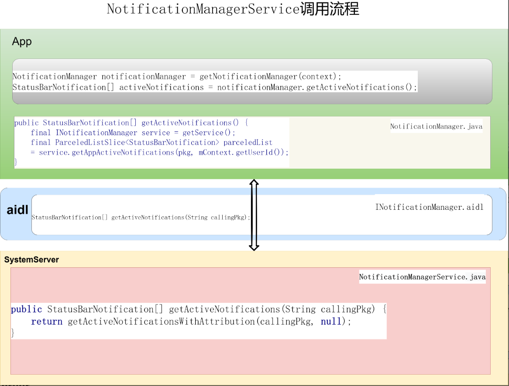
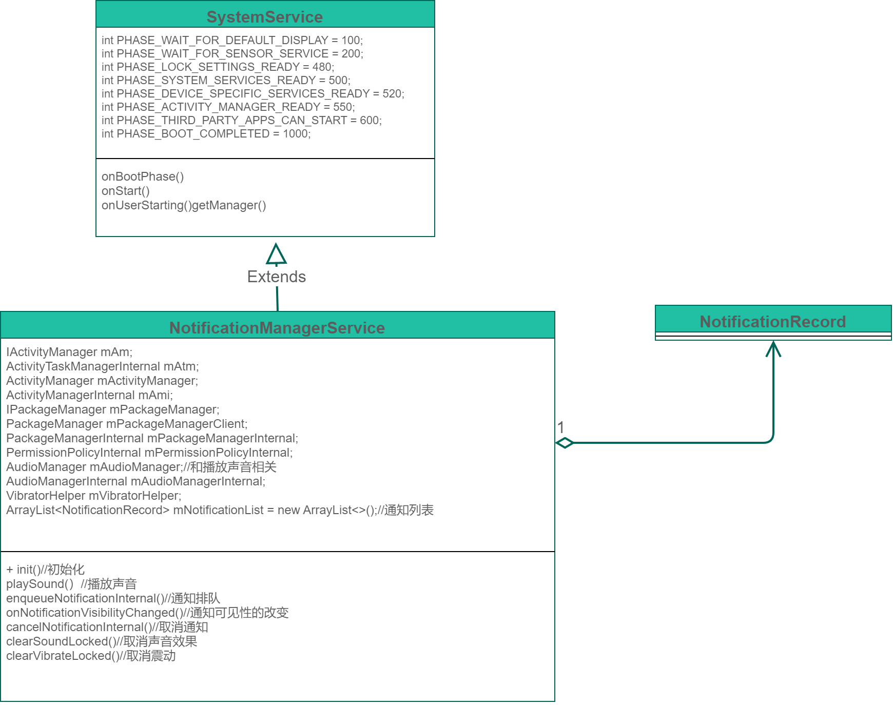

# P20: 系统开发之浅谈NotificationManagerService


---

[跳转到readme](https://github.com/hfreeman2008/android_core_framework/blob/main/README-CN.md)

---

[<font face='黑体' color=#ff0000 size=40 >跳转到文章结尾</font>](#结束语)

---

[上一篇文章 P19_系统开发之浅谈AudioService](https://github.com/hfreeman2008/android_core_framework/blob/main/P19_%E7%B3%BB%E7%BB%9F%E5%BC%80%E5%8F%91%E4%B9%8B%E6%B5%85%E8%B0%88AudioService/%E7%B3%BB%E7%BB%9F%E5%BC%80%E5%8F%91%E4%B9%8B%E6%B5%85%E8%B0%88AudioService.md)


[下一篇文章 P21_系统开发之浅谈InputMethodManagerService](https://github.com/hfreeman2008/android_core_framework/blob/main/P21_%E7%B3%BB%E7%BB%9F%E5%BC%80%E5%8F%91%E4%B9%8B%E6%B5%85%E8%B0%88InputMethodManagerService/%E7%B3%BB%E7%BB%9F%E5%BC%80%E5%8F%91%E4%B9%8B%E6%B5%85%E8%B0%88InputMethodManagerService.md)

---


# NotificationManagerService 作用

主要是管理通知(notification)，包含通知的增加，删除，更新，播放通知声音，创建一些白名单应用的通知栏，消息等级管理，震动，led灯的管理，通知的策略管理。

---

# 获取 NotificationManagerService 

```java
方式1
NotificationManager notificationManager = (NotificationManager) context.getSystemService(Context.NOTIFICATION_SERVICE);

方式2
NotificationManager nm = context.getSystemService(NotificationManager.class);

方式3
INotificationManager iNotificationManager = NotificationManager.getService();

方式4
IBinder b = ServiceManager.getService("notification");
INotificationManager sService = INotificationManager.Stub.asInterface(b);

方式5 (system server进程使用)
NotificationManagerInternal nm = LocalServices.getService(NotificationManagerInternal.class);
```

---

# 常用发送通知方式

```java
NotificationManager notificationManager = (NotificationManager) getSystemService(Context.NOTIFICATION_SERVICE);
NotificationCompat.Builder builder = new NotificationCompat.Builder(this, CHANNEL_ID)
.setSmallIcon(R.drawable.ic_notification)
.setContentTitle("通知标题")
.setContentText("通知内容")
.setPriority(NotificationCompat.PRIORITY_DEFAULT);
notificationManager.notify(NOTIFICATION_ID, builder.build());
```

frameworks\base\core\java\android\app\Notification.java
创建一个notification,Notification.Builder就是我们常用的方式：

```java
Notification noti = new Notification.Builder(mContext)
         .setContentTitle(&quot;New mail from &quot; + sender.toString())
         .setContentText(subject)
         .setSmallIcon(R.drawable.new_mail)
        .setLargeIcon(aBitmap)
        .build();
```

---

# NotificationManagerService 调用流程




以getActiveNotifications为例：
(1)app中调用getActiveNotifications：
```java
NotificationManager notificationManager = getNotificationManager(context);
StatusBarNotification[] activeNotifications = notificationManager.getActiveNotifications();
```

(2)NotificationManager.java中调用getActiveNotifications：

```java
public StatusBarNotification[] getActiveNotifications() {
    final INotificationManager service = getService();
    final String pkg = mContext.getPackageName();
    try {
        final ParceledListSlice<StatusBarNotification> parceledList
                = service.getAppActiveNotifications(pkg, mContext.getUserId());
        if (parceledList != null) {
            final List<StatusBarNotification> list = parceledList.getList();
            return list.toArray(new StatusBarNotification[list.size()]);
        }
    } catch (RemoteException e) {
        throw e.rethrowFromSystemServer();
    }
    return new StatusBarNotification[0];
}
```

(3)INotificationManager.aidl中定义getActiveNotifications：
```java
StatusBarNotification[] getActiveNotifications(String callingPkg);
```

(4)NotificationManagerService.java中实现getActiveNotifications：
```java
/**
 * @deprecated Use {@link #getActiveNotificationsWithAttribution(String, String)} instead.
 */
@Deprecated
@Override
public StatusBarNotification[] getActiveNotifications(String callingPkg) {
    return getActiveNotificationsWithAttribution(callingPkg, null);
}

/**
 * System-only API for getting a list of current (i.e. not cleared) notifications.
 *
 * Requires ACCESS_NOTIFICATIONS which is signature|system.
 * @returns A list of all the notifications, in natural order.
 */
@Override
public StatusBarNotification[] getActiveNotificationsWithAttribution(String callingPkg,
        String callingAttributionTag) {
    // enforce() will ensure the calling uid has the correct permission
    getContext().enforceCallingOrSelfPermission(
            android.Manifest.permission.ACCESS_NOTIFICATIONS,
            "NotificationManagerService.getActiveNotifications");

    ArrayList<StatusBarNotification> tmp = new ArrayList<>();
    int uid = Binder.getCallingUid();

    ArrayList<Integer> currentUsers = new ArrayList<>();
    currentUsers.add(UserHandle.USER_ALL);
    Binder.withCleanCallingIdentity(() -> {
        for (int user : mUm.getProfileIds(ActivityManager.getCurrentUser(), false)) {
            currentUsers.add(user);
        }
    });

    // noteOp will check to make sure the callingPkg matches the uid
    if (mAppOps.noteOpNoThrow(AppOpsManager.OP_ACCESS_NOTIFICATIONS, uid, callingPkg,
            callingAttributionTag, null)
            == MODE_ALLOWED) {
        synchronized (mNotificationLock) {
            final int N = mNotificationList.size();
            for (int i = 0; i < N; i++) {
                final StatusBarNotification sbn = mNotificationList.get(i).getSbn();
                if (currentUsers.contains(sbn.getUserId())) {
                    tmp.add(sbn);
                }
            }
        }
    }
    return tmp.toArray(new StatusBarNotification[tmp.size()]);
}
```

(5)启动通知管理服务：
SystemServer.startOtherServices
```java
t.traceBegin("StartNotificationManager");
mSystemServiceManager.startService(NotificationManagerService.class);
SystemNotificationChannels.removeDeprecated(context);
SystemNotificationChannels.createAll(context);
notification = INotificationManager.Stub.asInterface(
        ServiceManager.getService(Context.NOTIFICATION_SERVICE));
t.traceEnd();
```

---

# NotificationManagerService 类图




---

# 日志开关
```java
NotificationManagerService.java
public static final boolean DBG = true;//Log.isLoggable(TAG, Log.DEBUG);

NotificationRecord.java
static final boolean DBG = true;//Log.isLoggable(TAG, Log.DEBUG);
```

---

# dump信息
adb shell dumpsys notification

```java
DUMP OF SERVICE notification:
Current Notification Manager state:
  Notification List:
    NotificationRecord(0x0dfbaffe: pkg=android user=UserHandle{-1} id=26 tag=null importance=4 key=-1|android|26|null|1000: Notification(channel=DEVELOPER_IMPORTANT shortcut=null contentView=null vibrate=null sound=null tick defaults=0x0 flags=0x2 color=0x00000000 vis=PUBLIC))
      uid=1000 userId=-1
      opPkg=android
      icon=Icon(typ=RESOURCE pkg=android id=0x0108081f)
      flags=0x2
      originalFlags=0x2
      pri=0
      key=-1|android|26|null|1000
      seen=true
      groupKey=-1|android|26|null|1000
      notification=
            fullscreenIntent=null
            contentIntent=PendingIntent{3d835f: PendingIntentRecord{970f496 android startActivity}}
            deleteIntent=null
            number=0
            groupAlertBehavior=0
            when=0
            tickerText=...
            contentView=null
            bigContentView=null
            headsUpContentView=null
            color=0x00000000
            timeout=unknown
            extras={
                android.title=String [length=11]
                android.reduced.images=Boolean (true)
                android.text=String [length=13]
                android.appInfo=ApplicationInfo (ApplicationInfo{2b211ac android})
                android.tv.EXTENSIONS=Bundle (Bundle[{channel_id=usbdevicemanager.adb.tv, suppressShowOverApps=false, flags=1}])
            }
      publicNotification=
            None
      stats=SingleNotificationStats{posttimeElapsedMs=59501689, posttimeToFirstClickMs=-1, posttimeToDismissMs=-1, airtimeCount=1, airtimeMs=5639, currentAirtimeStartElapsedMs=-1, airtimeExpandedMs=5636, posttimeToFirstVisibleExpansionMs=818, currentAirtimeExpandedStartElapsedMs=-1, requestedImportance=3, naturalImportance=4, isNoisy=true}
      mContactAffinity=0.0
      mRecentlyIntrusive=false
      mPackagePriority=0
      mPackageVisibility=-1000
      mSystemImportance=UNSPECIFIED
      mAsstImportance=UNSPECIFIED
      mImportance=HIGH
      mImportanceExplanation=app
      mIsAppImportanceLocked=false
      mIntercept=false
      mHidden==false
      mGlobalSortKey=crtcl=0x0002:intrsv=1:grnk=0x0000:gsmry=1:nsk:rnk=0x0000
      mRankingTimeMs=1706767655811
      mCreationTimeMs=1706767655811
      mVisibleSinceMs=1706767656832
      mUpdateTimeMs=1706767655811
      mInterruptionTimeMs=1706767656833
      mSuppressedVisualEffects= 0
      mSound= content://settings/system/notification_sound
      mVibration= null
      mAttributes= AudioAttributes: usage=USAGE_NOTIFICATION content=CONTENT_TYPE_SONIFICATION flags=0x800 tags= bundle=null
      mLight= null
      mShowBadge=false
      mColorized=false
      mAllowBubble=false
      isBubble=false
      mIsInterruptive=true
      effectiveNotificationChannel=NotificationChannel{mId='DEVELOPER_IMPORTANT', mName=重要开发者消息, mDescription=, mImportance=4, mBypassDnd=false, mLockscreenVisibility=-1000, mSound=content://settings/system/notification_sound, mLights=false, mLightColor=0, mVibration=null, mUserLockedFields=0, mFgServiceShown=false, mVibrationEnabled=false, mShowBadge=true, mDeleted=false, mDeletedTimeMs=-1, mGroup='null', mAudioAttributes=AudioAttributes: usage=USAGE_NOTIFICATION content=CONTENT_TYPE_SONIFICATION flags=0x800 tags= bundle=null, mBlockableSystem=false, mAllowBubbles=-1, mImportanceLockedDefaultApp=false, mOriginalImp=4, mParent=null, mConversationId=null, mDemoted=false, mImportantConvo=false}
      mAdjustments=[]
      shortcut=null found valid? false

......
  
  mUseAttentionLight=false
  mHasLight=false
  mNotificationPulseEnabled=true
  mSoundNotificationKey=null
  mVibrateNotificationKey=null
  mDisableNotificationEffects=true
  mCallState=CALL_STATE_IDLE
  mSystemReady=true
  mMaxPackageEnqueueRate=5.0
  hideSilentStatusBar=false
  mArchive=Archive (0 notifications)

  Snoozed notifications:

 Pending snoozed notifications

  Ranking Config:
    mSignalExtractors.length = 11
      NotificationChannelExtractor
      NotificationAdjustmentExtractor
      BubbleExtractor
      ValidateNotificationPeople
      PriorityExtractor
      ZenModeExtractor
      ImportanceExtractor
      NotificationIntrusivenessExtractor
      VisibilityExtractor
      BadgeExtractor
      CriticalNotificationExtractor


```

---

# 相关日志

## 通知排队
```java
NotificationService: enqueueNotificationInternal: pkg=com.debug.loggerui id=365001 notification=Notification(channel=com.debug.loggerui.notification shortcut=null contentView=null vibrate=null sound=null defaults=0x0 flags=0x8 color=0x00000000 vis=PRIVATE)
```

对应代码：
NotificationManagerService.enqueueNotificationInternal

```java
void enqueueNotificationInternal(final String pkg, final String opPkg, final int callingUid,
        final int callingPid, final String tag, final int id, final Notification notification,
        int incomingUserId, boolean postSilently) {
    if (DBG) {
        Slog.v(TAG, "enqueueNotificationInternal: pkg=" + pkg + " id=" + id
                + " notification=" + notification);
    }
}
```

## 通知显示
```java
NotificationService: Marking notification as visible 0|com.debug.loggerui|365001|null|10041
```

对应代码：
NotificationManagerService.onNotificationVisibilityChanged
```java
public void onNotificationVisibilityChanged(NotificationVisibility[] newlyVisibleKeys,
        NotificationVisibility[] noLongerVisibleKeys) {
     if (DBG) Slog.d(TAG, "Marking notification as visible " + nv.key);
}
```

---

# handler消息

```java
protected class WorkerHandler extends Handler
private WorkerHandler mHandler;

class RankingHandlerWorker extends Handler implements RankingHandler

......
// message codes
static final int MESSAGE_DURATION_REACHED = 2;
// 3: removed to a different handler
static final int MESSAGE_SEND_RANKING_UPDATE = 4;
static final int MESSAGE_LISTENER_HINTS_CHANGED = 5;
static final int MESSAGE_LISTENER_NOTIFICATION_FILTER_CHANGED = 6;
static final int MESSAGE_FINISH_TOKEN_TIMEOUT = 7;
static final int MESSAGE_ON_PACKAGE_CHANGED = 8;

// ranking thread messages
private static final int MESSAGE_RECONSIDER_RANKING = 1000;
private static final int MESSAGE_RANKING_SORT = 1001;
```


---

# publishBinderService
onStart()方法中：

```java
publishBinderService(Context.NOTIFICATION_SERVICE, mService, /* allowIsolated= */ false,
        DUMP_FLAG_PRIORITY_CRITICAL | DUMP_FLAG_PRIORITY_NORMAL);
......

final IBinder mService = new INotificationManager.Stub() {
    ......
}
```

其他进程获取 NotificationManagerService :
```java
NotificationManager notificationManager = (NotificationManager) context.getSystemService(Context.NOTIFICATION_SERVICE);
```

---

# publishLocalService--NotificationManagerInternal

```java
publishLocalService(NotificationManagerInternal.class, mInternalService);

private final NotificationManagerInternal mInternalService = new NotificationManagerInternal() {
    ......
}
```

在system server进程中：
```java
NotificationManagerInternal nm = LocalServices.getService(NotificationManagerInternal.class);
```


# 添加一个功能连接电源,播放音乐

```java
//START<ADD><BUG--111><for charge sound ><hexiaoming><DATE20180927>
import android.media.Ringtone;
import android.media.RingtoneManager;
//END <ADD><BUG--111><for charge sound ><hexiaoming><DATE20180927>

......

private final BroadcastReceiver mIntentReceiver = new BroadcastReceiver() {
       else if (action.equals(Intent.ACTION_USER_UNLOCKED)) {
                final int user = intent.getIntExtra(Intent.EXTRA_USER_HANDLE, USER_NULL);
                mConditionProviders.onUserUnlocked(user);
                mListeners.onUserUnlocked(user);
                mAssistants.onUserUnlocked(user);
                mZenModeHelper.onUserUnlocked(user);
            }
            //START<ADD><BUG--111><for charge sound ><hexiaoming><DATE20180927>
            else if (action.equals(Intent.ACTION_POWER_CONNECTED)||action.equals(Intent.ACTION_POWER_DISCONNECTED)) {
                final boolean enabled = Settings.Global.getInt(context.getContentResolver(),
                        Settings.Global.CHARGING_SOUNDS_ENABLED, 1) != 0;
                final String soundPath = Settings.Global.getString(context.getContentResolver(),
                        Settings.Global.WIRELESS_CHARGING_STARTED_SOUND);
                if (enabled && soundPath != null) {
                    final Uri soundUri = Uri.parse("file://" + soundPath);
                    if (soundUri != null) {
                        final Ringtone sfx = RingtoneManager.getRingtone(context, soundUri);
                        if (sfx != null) {
                            sfx.setStreamType(AudioManager.STREAM_SYSTEM);
                            sfx.play();
                        }
                    }
                }
            }
                //END <ADD><BUG--111><for charge sound ><hexiaoming><DATE20180927>

......

//START<ADD><BUG--111><for charge sound ><hexiaoming><DATE20180927>
filter.addAction(Intent.ACTION_POWER_CONNECTED);
filter.addAction(Intent.ACTION_POWER_DISCONNECTED);
//END<ADD><BUG--111><for charge sound ><hexiaoming><DATE20180927>
getContext().registerReceiver(mIntentReceiver, filter);
```

也就是说,如果我们要添加一些通知性质的功能,可以直接监听对应的广播,在这个类中实现.

---

# 通知策略

关于notification_policy.xml文件:

```java
find ./ -name "notification_policy.xml"
./data/system/notification_policy.xml
```

notification_policy.xml
```xml
<?xml version='1.0' encoding='utf-8' standalone='yes' ?>
<notification-policy version="1">
<zen version="2" user="0">
<allow calls="true" repeatCallers="false" messages="false" reminders="true" events="true" callsFrom="1" messagesFrom="1" visualScreenOff="true" visualScreenOn="true" />
<automatic ruleId="EVENTS_DEFAULT_RULE" enabled="false" snoozing="false" name="活动" zen="3" component="android/com.android.server.notification.EventConditionProvider" conditionId="condition://android/event?userId=-10000&amp;calendar=&amp;reply=1" creationTime="1559700784128" id="condition://android/event?userId=-10000&amp;calendar=&amp;reply=1" summary="..." line1="..." line2="..." icon="0" state="0" flags="2" />
......
<automatic ruleId="SCHEDULED_DEFAULT_RULE_2" enabled="false" snoozing="false" name="周末" zen="3" component="android/com.android.server.notification.ScheduleConditionProvider" conditionId="condition://android/schedule?days=6.7&amp;start=23.30&amp;end=10.0&amp;exitAtAlarm=false" creationTime="1559700784128" id="condition://android/schedule?days=6.7&amp;start=23.30&amp;end=10.0&amp;exitAtAlarm=false" summary="..." line1="..." line2="..." icon="0" state="0" flags="2" />
</zen>
<ranking version="1">
<package name="android" show_badge="true" uid="1000">
<channel id="DEVICE_ADMIN" name="设备管理" importance="2" sound="content://settings/system/notification_sound" usage="5" content_type="4" flags="0" show_badge="true" />
......
<channel id="ALERTS" name="提醒" importance="3" sound="content://settings/system/notification_sound" usage="5" content_type="4" flags="0" show_badge="true" />
</package>
<package name="com.android.contacts" show_badge="true" uid="10006">
<channel id="miscellaneous" name="未分类" sound="content://settings/system/notification_sound" usage="5" content_type="4" flags="0" show_badge="true" />
<channel id="DEFAULT_CHANNEL" name="通知" importance="2" sound="content://settings/system/notification_sound" usage="5" content_type="4" flags="0" show_badge="true" />
</package>
<package name="com.android.server.telecom" show_badge="true" uid="1000">
<channel id="TelecomMissedCalls" name="未接电话" importance="3" sound="" usage="5" content_type="0" flags="0" lights="true" vibration_enabled="true" show_badge="true" />
<channel id="TelecomIncomingCalls" name="来电" importance="5" sound="" usage="5" content_type="0" flags="0" lights="true" />
</package>
<package name="com.android.mtp" show_badge="true" uid="10010">
<channel id="device_notification_channel" name="未分类" importance="2" sound="content://settings/system/notification_sound" usage="5" content_type="4" flags="0" show_badge="true" />
</package>
<package name="org.codeaurora.gallery" show_badge="true" uid="10026">
<channel id="GalleryPackagesMonitorAsync" name="GalleryPackagesMonitorAsync" importance="2" sound="content://settings/system/notification_sound" usage="5" content_type="4" flags="0" show_badge="true" />
</package>
<package name="com.android.dialer" show_badge="true" uid="10015">
<channel id="phone_ongoing_call" name="正在进行的通话" importance="3" usage="5" content_type="0" flags="0" />
<channel id="phone_incoming_call" name="来电" importance="5" usage="5" content_type="0" flags="0" lights="true" />
<channel id="phone_missed_call" name="未接电话" importance="3" usage="5" content_type="0" flags="0" lights="true" vibration_enabled="true" show_badge="true" />
<channel id="phone_default" name="默认" importance="3" sound="content://settings/system/notification_sound" usage="5" content_type="4" flags="0" lights="true" vibration_enabled="true" />
</package>
<package name="com.android.systemui" show_badge="true" uid="10028">
<channel id="ALR" name="提醒" importance="4" sound="content://settings/system/notification_sound" usage="5" content_type="4" flags="0" show_badge="true" />
......
<channel id="SCN" name="屏幕截图" importance="2" sound="content://settings/system/notification_sound" usage="5" content_type="4" flags="0" show_badge="true" />
</package>
<package name="com.android.phone" show_badge="true" uid="1001">
<channel id="callForward" name="来电转接" importance="2" sound="content://settings/system/notification_sound" usage="5" content_type="4" flags="0" show_badge="true" />
......
<channel id="alert" name="提醒" importance="3" sound="content://settings/system/notification_sound" usage="5" content_type="0" flags="0" show_badge="true" />
</package>
</ranking>
<enabled_listeners>
</enabled_listeners>
<enabled_assistants />
<dnd_apps>
<service_listing approved="com.android.camera2" user="0" primary="true" />
</dnd_apps>
</notification-policy>

```


```java
final File systemDir = new File(Environment.getDataDirectory(), "system");

init(Looper.myLooper(),
    AppGlobals.getPackageManager(), getContext().getPackageManager(),
    getLocalService(LightsManager.class),
    new NotificationListeners(AppGlobals.getPackageManager()),
    new NotificationAssistants(AppGlobals.getPackageManager()),
    new ConditionProviders(getContext(), mUserProfiles, AppGlobals.getPackageManager()),
    null, snoozeHelper, new NotificationUsageStats(getContext()),
    new AtomicFile(new File(systemDir, "notification_policy.xml")),
    (ActivityManager) getContext().getSystemService(Context.ACTIVITY_SERVICE),
    getGroupHelper());
```

```java
mPolicyFile = policyFile;
......
// Persistent storage for notification policy
private AtomicFile mPolicyFile;
```

```java
loadPolicyFile-----------加载策略文件
handleSavePolicyFile------处理策略文件
```


---

# 来电通知声音
mInCallNotificationUri -----来电通知声音:

```java
mInCallNotificationUri = Uri.parse("file://" +resources.getString(R.string.config_inCallNotificationSound));
```

配置来电通知声音:

```xml
<!-- URI for in call notification sound -->
<string translatable="false" name="config_inCallNotificationSound">/system/media/audio/ui/InCallNotification.ogg</string>
```

playInCallNotification-----播放来电通知声音
```java
player.play(new Binder(), mInCallNotificationUri,
        mInCallNotificationAudioAttributes,
        mInCallNotificationVolume, false);
```


来电通知音量:
```java
mInCallNotificationVolume = resources.getFloat(R.dimen.config_inCallNotificationVolume);
```

来电通知音量配置:
```xml
<!-- Volume level of in-call notification tone playback [0..1] -->
<item name="config_inCallNotificationVolume" format="float" type="dimen">.10</item>
```


判断是否来电:
```java
protected boolean mInCall = false;
```


监听广播:ACTION_PHONE_STATE_CHANGED,调用updateNotificationPulse
```java
private final BroadcastReceiver mIntentReceiver = new BroadcastReceiver() {
    public void onReceive(Context context, Intent intent) {
         else if (action.equals(TelephonyManager.ACTION_PHONE_STATE_CHANGED)) {
                mInCall = TelephonyManager.EXTRA_STATE_OFFHOOK
                        .equals(intent.getStringExtra(TelephonyManager.EXTRA_STATE));
                updateNotificationPulse();
```

---

# 灯通知的配置:
```java
mUseAttentionLight = resources.getBoolean(R.bool.config_useAttentionLight);
```


```xml
<!-- Set this true only if the device has separate attention and notification lights. -->
<bool name="config_useAttentionLight">false</bool>
```

enqueueNotificationInternal---led的颜色设置
```java
boolean isScreenOn = powerManager.isScreenOn();
if(!isScreenOn) {
   LightsManager lightManager = getLocalService(LightsManager.class); 
   Light mNotificationLight = lightManager.getLight(LightsManager.LIGHT_ID_BATTERY);
   int mNotificationARGB = getContext().getResources().getInteger(
               com.android.internal.R.color.config_defaultNotificationColor);
   int mNotificationLedOn = getContext().getResources().getInteger(
               com.android.internal.R.integer.config_defaultNotificationLedOn);
   int mNotificationLedOff = getContext().getResources().getInteger(
               com.android.internal.R.integer.config_defaultNotificationLedOff);
   mNotificationLight.setColor(mNotificationARGB);
```

```xml
<!-- Default color for notification LED. -->
<color name="config_defaultNotificationColor">#ff0000ff</color>
<!-- Default LED on time for notification LED in milliseconds. -->
<integer name="config_defaultNotificationLedOn">500</integer>
<!-- Default LED off time for notification LED in milliseconds. -->
<integer name="config_defaultNotificationLedOff">2000</integer>
```


---

# 通知震动


```java
private long[] mFallbackVibrationPattern;
mFallbackVibrationPattern = getLongArray(resources,
        R.array.config_notificationFallbackVibePattern,
        VIBRATE_PATTERN_MAXLEN,
        DEFAULT_VIBRATE_PATTERN);
```

```xml
<!-- Vibrator pattern to be used as the default for notifications
     that do not specify vibration but vibrate anyway because the device
     is in vibrate mode.
 -->
<integer-array name="config_notificationFallbackVibePattern">
    <item>0</item>
    <item>100</item>
    <item>150</item>
    <item>100</item>
</integer-array>
```

```java
buzzBeepBlinkLocked
playVibration
```


---


# 通知服务的白名单

```java
protected void readDefaultApprovedServices(int userId) {
    String defaultListenerAccess = getContext().getResources().getString(
            com.android.internal.R.string.config_defaultListenerAccessPackages);
......

protected static final String ENABLED_SERVICES_SEPARATOR = ":";

......

```

```xml
<!-- Colon separated list of package names that should be granted Notification Listener access -->
<string name="config_defaultListenerAccessPackages" translatable="false"></string>
```

所以,可以得出配置config_defaultListenerAccessPackages的方法为:

```xml
<!-- Colon separated list of package names that should be granted Notification Listener access -->
<string name="config_defaultListenerAccessPackages" translatable="false">com.android.p1:com.android.p2:com.android.p3</string>
```

setNotificationListenerAccessGrantedForUser

```java
String defaultDndAccess = getContext().getResources().getString(
    com.android.internal.R.string.config_defaultDndAccessPackages);
```

```xml
<!-- Colon separated list of package names that should be granted DND access -->
<string name="config_defaultDndAccessPackages" translatable="false">com.android.camera2</string>
```

这个配置和上面的config_defaultListenerAccessPackages方法一样

```java
setNotificationPolicyAccessGranted
setNotificationPolicyAccessGrantedForUser
```

---

# 播放声音

机器配置通知书提示音，但是通知没有通知提示音问题如何分析
(1)播放通知提示音的流程为：

```java
com.android.server.notification.NotificationManagerService.playSound(NotificationManagerService.java:8131)
com.android.server.notification.NotificationManagerService.buzzBeepBlinkLocked(NotificationManagerService.java:7913)
com.android.server.notification.NotificationManagerService$PostNotificationRunnable.run(NotificationManagerService.java:7530)
android.os.Handler.handleCallback(Handler.java:942)
android.os.Handler.dispatchMessage(Handler.java:99)
android.os.Looper.loopOnce(Looper.java:201)
android.os.Looper.loop(Looper.java:288)
com.android.server.SystemServer.run(SystemServer.java:987)
com.android.server.SystemServer.main(SystemServer.java:664)
java.lang.reflect.Method.invoke(Native Method)
com.android.internal.os.RuntimeInit$MethodAndArgsCaller.run(RuntimeInit.java:569)
com.android.internal.os.ZygoteInit.main(ZygoteInit.java:1002)
```
(2)和通知播放提示音相关的关键方法有：

```java
playSound
buzzBeepBlinkLocked
NotificationManagerService$PostNotificationRunnable.run
//关闭通知提示效果,包括提示音
disableNotificationEffects(NotificationRecord record) 
shouldMuteNotificationLocked(final NotificationRecord record) 
```

(3)和通知播放提示音相关的关键方法变量有：
```java
mDisableNotificationEffects
```


---

# 通知消息排列顺序没有按时间排列


notication的列表数据，根据时间戳倒序排序
packages/apps/SystemUI/src/com/android/systemui/scui/NotificationFragment.java

```java
+import java.util.Comparator;

    public List<notification> getNotificationData() {
        // NotificationEntry entry = getActiveNotificationUnfiltered(key);
        List<NotificationEntry> entries = new ArrayList<>();
        List<notification> mList = new ArrayList<notification>();
        // entries.addAll(getVisibleNotifications());
        entries.addAll(mPendingNotifications.values());
        for (NotificationEntry entry : entries) {
            
            notification notification = new notification();
            notification.icon = entry.getSbn().getNotification().getSmallIcon();
            notification.key = entry.getSbn().getKey();
            if (entry.getSbn().getNotification().extras.get("android.title") != null) {
                notification.title = entry.getSbn().getNotification().extras.get("android.title").toString();
            } else {
                try {
                    if (mContext != null) {
                        notification.title = (mContext.getPackageManager()).getApplicationLabel((mContext.getPackageManager()).getApplicationInfo(entry.getSbn().getPackageName(), 0)).toString();
                    }
                } catch (NameNotFoundException e) {
                    throw new RuntimeException(e);
                }
            }
            if (entry.getSbn().getNotification().extras.get("android.text") != null) {
                notification.text = entry.getSbn().getNotification().extras.get("android.text").toString();
            }
            notification.time = entry.getSbn().getPostTime();
            // notification.title = entry.getSbn().getNotification().extras.get("android.title").toString();
            // notification.text = entry.getSbn().getNotification().extras.get("android.text").toString();
            mList.add(notification);
        }
        +mList.sort(Comparator.comparingLong(notification::getTime).reversed());
        return mList;
    }
```


---

[<font face='黑体' color=#ff0000 size=40 >跳转到文章开始</font>](#p20-系统开发之浅谈notificationmanagerservice)

---

[上一篇文章 P19_系统开发之浅谈AudioService](https://github.com/hfreeman2008/android_core_framework/blob/main/P19_%E7%B3%BB%E7%BB%9F%E5%BC%80%E5%8F%91%E4%B9%8B%E6%B5%85%E8%B0%88AudioService/%E7%B3%BB%E7%BB%9F%E5%BC%80%E5%8F%91%E4%B9%8B%E6%B5%85%E8%B0%88AudioService.md)


[下一篇文章 P21_系统开发之浅谈InputMethodManagerService](https://github.com/hfreeman2008/android_core_framework/blob/main/P21_%E7%B3%BB%E7%BB%9F%E5%BC%80%E5%8F%91%E4%B9%8B%E6%B5%85%E8%B0%88InputMethodManagerService/%E7%B3%BB%E7%BB%9F%E5%BC%80%E5%8F%91%E4%B9%8B%E6%B5%85%E8%B0%88InputMethodManagerService.md)


---


# 结束语

