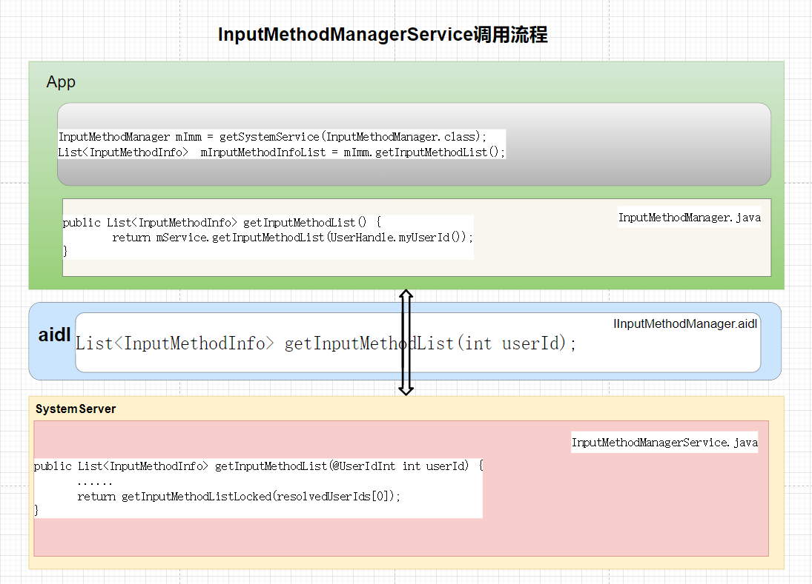
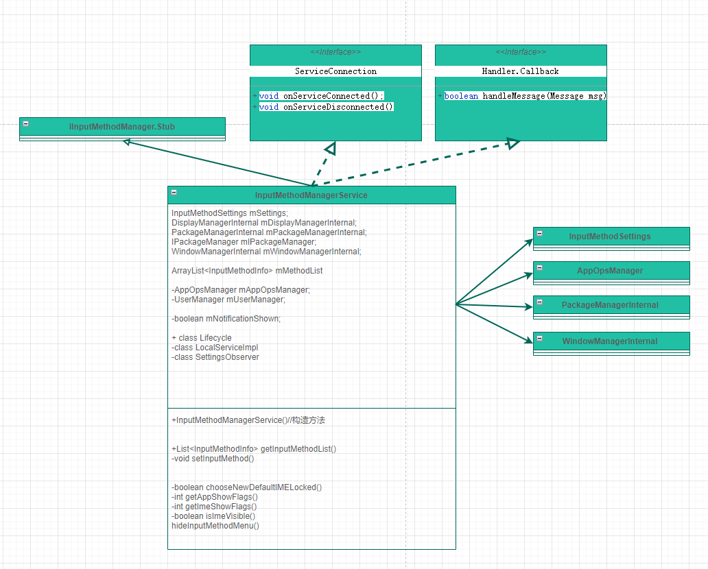

# P21: 系统开发之浅谈InputMethodManagerService


---

# InputMethodManagerService 作用

输入法的选择,切换,管理,输入法界面的管理,软键盘的显示与管理,输入法全屏显示,输入与位置的关系。

---

# 获取 InputMethodManagerService：

```java
方式1
InputMethodManager mImm = (InputMethodManager)getSystemService(INPUT_METHOD_SERVICE);

方式2
InputMethodManager mImm = getSystemService(InputMethodManager.class);

方式3
IInputMethodManager service = IInputMethodManager.Stub.asInterface(ServiceManager.getServiceOrThrow(Context.INPUT_METHOD_SERVICE));

方式4 (system server进程使用)
InputMethodManagerInternal mInputMethodManagerInternal = LocalServices.getService(InputMethodManagerInternal.class);
```

---

# InputMethodManagerService 调用流程



以接口getInputMethodList为例：

(1)app调用getInputMethodList

```java
InputMethodManager mImm = getSystemService(InputMethodManager.class);
List<InputMethodInfo>  mInputMethodInfoList = mImm.getInputMethodList();
```

(2)InputMethodManager调用getInputMethodList

InputMethodManager.java
```java
/**
 * Returns the list of installed input methods.
 *
 * <p>On multi user environment, this API returns a result for the calling process user.</p>
 *
 * @return {@link List} of {@link InputMethodInfo}.
 */
public List<InputMethodInfo> getInputMethodList() {
    try {
        // We intentionally do not use UserHandle.getCallingUserId() here because for system
        // services InputMethodManagerInternal.getInputMethodListAsUser() should be used
        // instead.
        return mService.getInputMethodList(UserHandle.myUserId());
    } catch (RemoteException e) {
        throw e.rethrowFromSystemServer();
    }
}
```

(3)aidl定义getInputMethodList

IInputMethodManager.aidl
```java
List<InputMethodInfo> getInputMethodList(int userId);
```

(4)InputMethodManagerService--getInputMethodList

InputMethodManagerService.java
```java
public List<InputMethodInfo> getInputMethodList(@UserIdInt int userId) {
    synchronized (mMethodMap) {
        final int[] resolvedUserIds = InputMethodUtils.resolveUserId(userId,
                mSettings.getCurrentUserId(), null);
        if (resolvedUserIds.length != 1) {
            return Collections.emptyList();
        }
        final long ident = Binder.clearCallingIdentity();
        try {
            return getInputMethodListLocked(resolvedUserIds[0]);
        } finally {
            Binder.restoreCallingIdentity(ident);
        }
    }
}
```

(5)注册 InputMethodManagerService

SystemServiceRegistry.java
```java
registerService(Context.INPUT_METHOD_SERVICE, InputMethodManager.class,
        new ServiceFetcher<InputMethodManager>() {
    @Override
    public InputMethodManager getService(ContextImpl ctx) {
        return InputMethodManager.forContext(ctx.getOuterContext());
    }});
```

(6)启动InputMethodManagerService：

SystemServer.startOtherServices
```java
t.traceBegin("StartInputMethodManagerLifecycle");
if (InputMethodSystemProperty.MULTI_CLIENT_IME_ENABLED) {
    mSystemServiceManager.startService(
            MultiClientInputMethodManagerService.Lifecycle.class);
} else {
    mSystemServiceManager.startService(InputMethodManagerService.Lifecycle.class);
}
t.traceEnd();
```


---

# InputMethodManagerService类图




---

# 日志开关

```java
frameworks\base\services\core\java\com\android\server\inputmethod\InputMethodManagerService.java
static final boolean DEBUG = true;//false;

frameworks\base\services\core\java\com\android\server\wm\WindowManagerDebugConfig.java
static final boolean DEBUG_INPUT_METHOD = true;//false;

frameworks\base\core\java\android\view\inputmethod\InputMethodManager.java
static final boolean DEBUG = false;

frameworks\base\core\java\android\inputmethodservice\InputMethodService.java
static final boolean DEBUG = false;

frameworks\base\services\core\java\com\android\server\inputmethod\InputMethodUtils.java
public static final boolean DEBUG = false;

frameworks\base\services\core\java\com\android\server\inputmethod\InputMethodSubtypeSwitchingController.java
private static final boolean DEBUG = false;

frameworks\base\core\java\android\inputmethodservice\SoftInputWindow.java
private static final boolean DEBUG = true;//false;
```


---

# dump信息

```java
adb shell dumpsys input_method
```


---

# handler和消息

```java
static final int MSG_SHOW_IM_SUBTYPE_PICKER = 1;
static final int MSG_SHOW_IM_SUBTYPE_ENABLER = 2;
static final int MSG_SHOW_IM_CONFIG = 3;
static final int MSG_UNBIND_INPUT = 1000;
static final int MSG_BIND_INPUT = 1010;
static final int MSG_SHOW_SOFT_INPUT = 1020;
static final int MSG_HIDE_SOFT_INPUT = 1030;
static final int MSG_HIDE_CURRENT_INPUT_METHOD = 1035;
static final int MSG_INITIALIZE_IME = 1040;
static final int MSG_CREATE_SESSION = 1050;
static final int MSG_REMOVE_IME_SURFACE = 1060;
static final int MSG_REMOVE_IME_SURFACE_FROM_WINDOW = 1061;
static final int MSG_START_INPUT = 2000;
static final int MSG_UNBIND_CLIENT = 3000;
static final int MSG_BIND_CLIENT = 3010;
static final int MSG_SET_ACTIVE = 3020;
static final int MSG_SET_INTERACTIVE = 3030;
static final int MSG_REPORT_FULLSCREEN_MODE = 3045;
static final int MSG_REPORT_PRE_RENDERED = 3060;
static final int MSG_APPLY_IME_VISIBILITY = 3070;
static final int MSG_HARD_KEYBOARD_SWITCH_CHANGED = 4000;
static final int MSG_SYSTEM_UNLOCK_USER = 5000;
static final int MSG_DISPATCH_ON_INPUT_METHOD_LIST_UPDATED = 5010;
static final int MSG_INLINE_SUGGESTIONS_REQUEST = 6000;
static final int MSG_NOTIFY_IME_UID_TO_AUDIO_SERVICE = 7000;
```


---

# publishBinderService

onStart()方法中：
```java
publishBinderService(Context.INPUT_METHOD_SERVICE, mService);
```

其他进程获取 InputMethodManagerService :
```java
InputMethodManager mImm = (InputMethodManager)getSystemService(INPUT_METHOD_SERVICE);
```

---

# LocalServices--InputMethodManagerInternal


```java
LocalServices.addService(InputMethodManagerInternal.class,
        new LocalServiceImpl(mService));
```


在system server进程中：
```java
InputMethodManagerInternal mInputMethodManagerInternal = LocalServices.getService(InputMethodManagerInternal.class);
```

---


# android开发浅谈之 InputMethodManagerService

[android开发浅谈之InputMethodManagerService](https://blog.csdn.net/hfreeman2008/article/details/117963600)

https://blog.csdn.net/hfreeman2008/article/details/117963600


---

# 结束语


