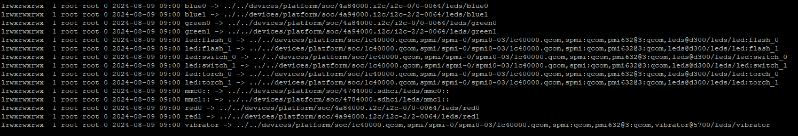
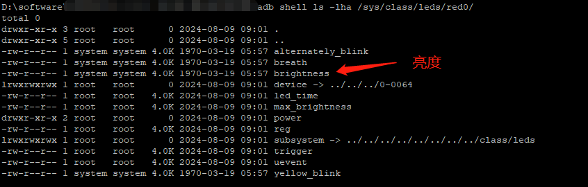

# P21: 系统开发之浅谈LightsService


---

# light整体分层架构


# LightsService 作用

LightsService 灯光服务提供了LCD背光灯、键盘灯、按键灯、警示灯、电池灯、消息通知灯、蓝牙灯、wifi灯等灯光；

常用到的地方为：PowerManager、NotificationManager、BatteryService等


---

# 获取 LightsService 的方式

```java
方式1
LightsManager manager = (LightsManager) mContext.getSystemService(Context.LIGHTS_SERVICE);

方式2
private static ILightsService sService;
IBinder b = ServiceManager.getService(Context.LIGHTS_SERVICE);
sService = ILightsService.Stub.asInterface(b);

方式3 (system server进程使用)
LightsManager lightsManager = getLocalService(LightsManager.class);
LightsManager lights = LocalServices.getService(LightsManager.class);
```

---

# LightsService 调用流程


---

# 启动 LightsService 服务：

SystemServer.java

```java
// Manages LEDs and display backlight so we need it to bring up the display.
t.traceBegin("StartLightsService");
mSystemServiceManager.startService(LightsService.class);
t.traceEnd();
```

---

# 注册Lights
SystemServiceRegistry.java

```java
registerService(Context.LIGHTS_SERVICE, LightsManager.class,
    new CachedServiceFetcher<LightsManager>() {
        @Override
        public LightsManager createService(ContextImpl ctx)
            throws ServiceNotFoundException {
            return new LightsManager(ctx);
        }});
```


---

# dump信息

```java
adb shell dumpsys lights
 
Service: aidl (android.hardware.light.ILights$Stub$Proxy@11deb07)
Lights:
  Light id=0 ordinal=0 color=00000000
  Light id=3 ordinal=0 color=ff00ff00
  Light id=4 ordinal=0 color=00000000
  Light id=5 ordinal=0 color=00000000
Session clients:
```


---

# 日志开关

```java
static final boolean DEBUG = false;
```

---

# Lifecycle--publishBinderService

```java
final LightsManagerBinderService mManagerService;
mManagerService = new LightsManagerBinderService();
publishBinderService(Context.LIGHTS_SERVICE, mManagerService);

private final class LightsManagerBinderService extends ILightsManager.Stub {

    private final class Session {
        final IBinder mToken;
        final SparseArray<LightState> mRequests = new SparseArray<>();

        Session(IBinder token) {
            mToken = token;
        }

        void setRequest(int lightId, LightState state) {
        ......
        }
    }

    @GuardedBy("LightsService.this")
    private final List<Session> mSessions = new ArrayList<>();


    @Override
    public List<Light> getLights() {
        ......
            return lights;
        }
    }


    @Override
    public void setLightStates(IBinder token, int[] lightIds, LightState[] lightStates) {
       ......
    }

    @Override
    public @Nullable LightState getLightState(int lightId) {
        ......
            return new LightState(light.getColor());
    }

    @Override
    public void openSession(IBinder token) {
        ......
    }

    @Override
    public void closeSession(IBinder token) {
        ......
    }

    @Override
    protected void dump(FileDescriptor fd, PrintWriter pw, String[] args) {
        ......
    }

    private void closeSessionInternal(IBinder token) {
        ......
    }

    private void checkRequestIsValid(int[] lightIds) {
        ......
    }


    private void invalidateLightStatesLocked() {
       ......
    }

    private @Nullable Session getSessionLocked(IBinder token) {
    ......
    }
}
```

其他进程读取服务的方法：

```java
LightsManager manager = (LightsManager) mContext.getSystemService(Context.LIGHTS_SERVICE);
```

---

# publishLocalService


```java
publishLocalService(LightsManager.class, mService);
```

system server进程使用:
```java
LightsManager lightsManager = getLocalService(LightsManager.class);
```

---


# framework相关文件：

在frameworks中,涉及到LightsManager的类主要有:

```java

frameworks/base/services/core/java/com/android/server/lights/LightsService.java
frameworks/base/services/core/java/com/android/server/BatteryService.java
NotificationManagerService.java
PowerManagerService.java
LocalDisplayAdapter.java
```

---


# JNI

com_android_server_lights_LightsService.cpp

jni调用本地接口:

```java
static native void setLight_native(int light, int color, int mode,
        int onMS, int offMS, int brightnessMode);
```

frameworks/base/services/core/jni/com_android_server_lights_LightsService.cpp

```java
static void setLight_native(
        JNIEnv* /* env */,
        jobject /* clazz */,
        jint light,
        jint colorARGB,
        jint flashMode,
        jint onMS,
        jint offMS,
        jint brightnessMode) {

    if (!validate(light, flashMode, brightnessMode)) {
```


```java
static const JNINativeMethod method_table[] = {
    { "setLight_native", "(IIIIII)V", (void*)setLight_native },
};

int register_android_server_LightsService(JNIEnv *env) {
    return jniRegisterNativeMethods(env, "com/android/server/lights/LightsService",
            method_table, NELEM(method_table));
}
```

---

# HAL


```java
hardware\qcom\display\liblight
hardware/qcom/display/liblight/lights.c

hardware/interfaces/light
```

高通项目如何定位hal源码：
```java
adb shell ps -Z | findstr -i light
u:r:hal_light_default:s0       system          806      1 12347756  2652 0                   0 S android.hardware.lights-service.qti

out/target/product/bengal/vendor/bin/hw/android.hardware.lights-service.qti

搜索：
android.hardware.lights-service.qti
高通项目：
device\qcom\vendor-common\lights\Android.bp

device\qcom\vendor-common\lights\
  目录文件不多：
Android.bp
android.hardware.lights-qti.rc
android.hardware.lights-qti.xml
Lights.cpp
Lights.h
main.cpp


搜索关键的：
hw_get_module (LIGHTS_HARDWARE_MODULE_ID
可以定位到lib库
```


---

# liblight库

高通：
```java
./out/target/product/bengal/vendor/lib64/hw/lights.bengal.so
./out/target/product/bengal/vendor/lib/hw/lights.bengal.so

hardware/qcom/display/liblight/lights.c

hardware/qcom/display/liblight/ 目录文件：
Android.mk
lights.c
NOTICE
```

lights.c

- 节点信息：
```java
char const*const LCD_FILE
        = "/sys/class/leds/lcd-backlight/brightness";

char const*const LCD_FILE2
        = "/sys/class/backlight/panel0-backlight/brightness";

char const*const BUTTON_FILE
        = "/sys/class/leds/button-backlight/brightness";

char const*const PERSISTENCE_FILE
        = "/sys/class/graphics/fb0/msm_fb_persist_mode";


echo 0 >  /sys/class/leds/blue0/brightness
```


- 关键方法

```java
static struct hw_module_methods_t lights_module_methods = {
    .open =  open_lights,
};

write_str

写节点亮度：
set_rgb_led_brightness
snprintf(file, sizeof(file), "/sys/class/leds/%s/brightness", led_names[led]);

写节点闪烁
static int set_rgb_led_timer_trigger(enum rgb_led led, int onMS, int offMS)
    snprintf(file_on, sizeof(file_on), "/sys/class/leds/%s/trigger", led_names[led]);
    snprintf(file_off, sizeof(file_off), "/sys/class/leds/%s/delay_off", led_names[led]);
    snprintf(file_on, sizeof(file_on), "/sys/class/leds/%s/delay_on", led_names[led]);
```


---

# kernel

```java
kernel\drivers\leds
kernel/msm-4.9/drivers/leds
kernel/msm-4.19/drivers/leds/leds-aw2016.c
```

light驱动节点：
```java
/sys/class/leds/
```

节点文件：
蓝，绿，红，三个节点：



red0目录下的节点：




查看一个实现文件：
kernel\msm-4.19\drivers\iio\light\Makefile

```makefile
obj-$(CONFIG_ZOPT2201)      += zopt2201.o
```

kernel\msm-4.19\drivers\iio\light\Kconfig
```makefile
config ZOPT2201
    tristate "ZOPT2201 ALS and UV B sensor"
    depends on I2C
    help
     Say Y here if you want to build a driver for the IDT
     ZOPT2201 ambient light and UV B sensor.

     To compile this driver as a module, choose M here: the
     module will be called zopt2201.
```


kernel\msm-4.19\drivers\iio\light\zopt2201.c

```c
static struct i2c_driver zopt2201_driver = {
    .driver = {
        .name   = ZOPT2201_DRV_NAME,
    },
    .probe  = zopt2201_probe, //注意这个文件
    .id_table = zopt2201_id,
};

static int zopt2201_probe(struct i2c_client *client,
              const struct i2c_device_id *id)
{
    ......
}
```


---

# FAQ

## 相关的命令

手动调整背光亮度的命令：

```shell
adb root && adb remount
adb shell
echo 255 > /sys/class/leds/wled/brightness
```

屏幕亮度查看命令：

```shell
adb root
cat /sys/class/leds/wled/brightness
```

---

## leds brightness(led亮度)

LED灯--充电时，充电指示灯太刺眼，影响体验，减少LED灯的亮度：
kernel/msm-4.9/drivers/leds/leds-qpnp.c
```c
    /* START<fix><demand 188 ><for leds brightness ><201901014>> */
    switch(led->id){
    case QPNP_ID_RGB_RED:
    case QPNP_ID_RGB_GREEN:
    case QPNP_ID_RGB_BLUE:
    led->cdev.brightness = value >> 3;
    break;
    }
    /* end<fix><demand 188 ><for leds brightness ><201901014>> */
```


---

## 充电指示灯显示，充电到90%显示绿灯
frameworks / base/services/core/java/com/android/server/BatteryService.java

```java
public void updateLightsLocked() {
    final int level = mHealthInfo.batteryLevel;
    final int status = mHealthInfo.batteryStatus;
    //fix by for H56E
    +int level_green = (Feature_XTHINK_LED_TURN_GREEN_PERCENT_NINETY == true) ? 90 : 100;
    //fix end
    if (level < mLowBatteryWarningLevel) {
        if (status == BatteryManager.BATTERY_STATUS_CHARGING) {
            // Solid red when battery is charging
            mBatteryLight.setColor(mBatteryLowARGB);
        } else {
            // Flash red when battery is low and not charging
            mBatteryLight.setFlashing(mBatteryLowARGB, Light.LIGHT_FLASH_TIMED,
                    mBatteryLedOn, mBatteryLedOff);
        }
    } else if (status == BatteryManager.BATTERY_STATUS_CHARGING
            || status == BatteryManager.BATTERY_STATUS_FULL) {
/*modified begain,when battery capacity is 100%,the green led always on */
        //if (status == BatteryManager.BATTERY_STATUS_FULL || level >= 90) {
        +if (status == BatteryManager.BATTERY_STATUS_FULL || level >= level_green) {
        /*modified end,when battery capacity is 100%,the green led always on*/
            // Solid green when full or charging and nearly full
            mBatteryLight.setColor(mBatteryFullARGB);
```


---

## 电量低于15%之后，下拉通知栏手电筒图标可点击且无灯光

kernel-4.9 / arch/arm64/configs/x011_k61v1_64_bsp_debug_defconfig
kernel-4.9 / arch/arm64/configs/x011_k61v1_64_bsp_defconfig

```makefile
-CONFIG_MTK_FLASHLIGHT_PT_STRICT=y
+CONFIG_MTK_FLASHLIGHT_PT_STRICT=n
```

---

## 灭屏下来未接来电、收到未读消息，第三方（如微信、QQ、Skype等来新消息）信号灯不亮
frameworks/base/core/res/res/values/config.xml

```xml
<!-- Is the notification LED intrusive? Used to decide if there should be a disable option -->
<bool name="config_intrusiveNotificationLed">true</bool>
```


---

# 参考资料

1.LightsService 灯光控制
https://blog.csdn.net/u012932409/article/details/108345928


---

# 结束语


