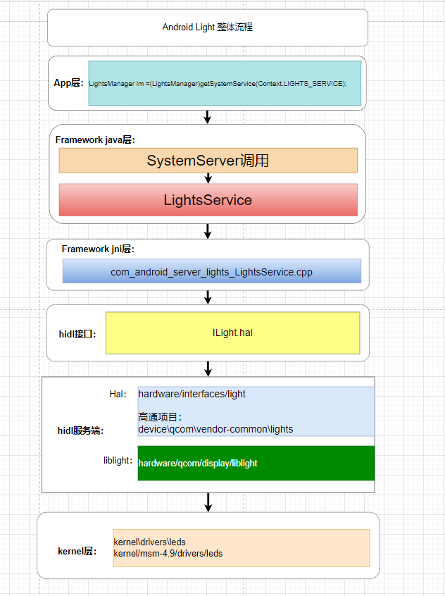
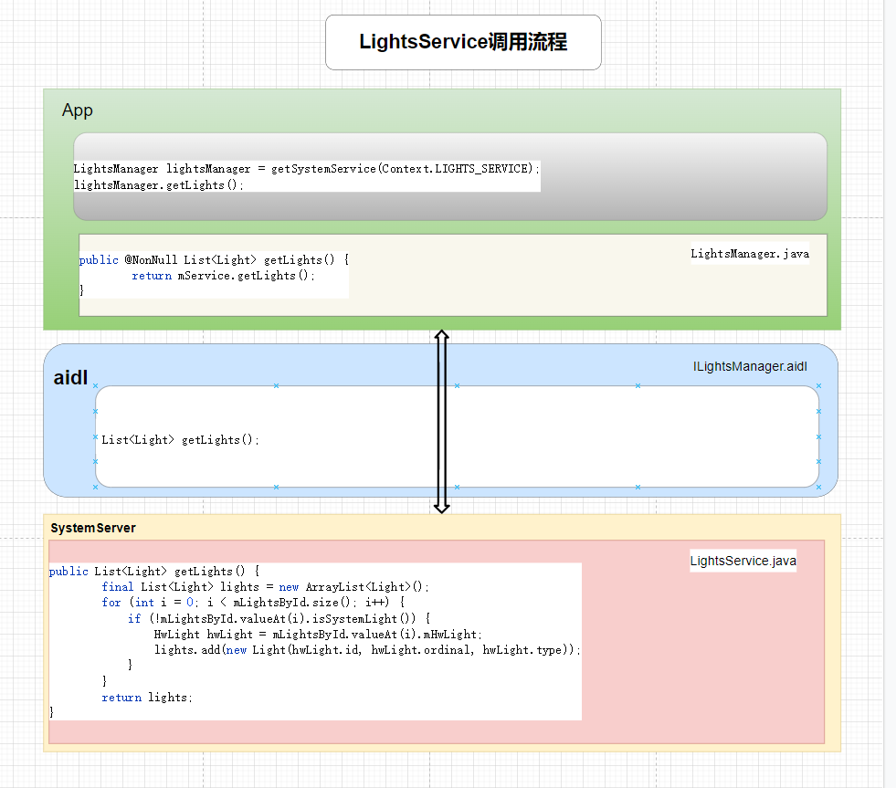

# P21: 系统开发之浅谈LightsService


---

# light整体分层架构





# LightsService 作用

LightsService 灯光服务提供了LCD背光灯、键盘灯、按键灯、警示灯、电池灯、消息通知灯、蓝牙灯、wifi灯等灯光；

常用到的地方为：PowerManager、NotificationManager、BatteryService等


---

# 获取 LightsService 的方式

```java
方式1
LightsManager manager = (LightsManager) mContext.getSystemService(Context.LIGHTS_SERVICE);

方式2
private static ILightsService sService;
IBinder b = ServiceManager.getService(Context.LIGHTS_SERVICE);
sService = ILightsService.Stub.asInterface(b);

方式3 (system server进程使用)
LightsManager lightsManager = getLocalService(LightsManager.class);
LightsManager lights = LocalServices.getService(LightsManager.class);
```

---

# LightsService 调用流程




---

# 启动 LightsService 服务：

SystemServer.java

```java
// Manages LEDs and display backlight so we need it to bring up the display.
t.traceBegin("StartLightsService");
mSystemServiceManager.startService(LightsService.class);
t.traceEnd();
```

---

# 注册Lights
SystemServiceRegistry.java

```java
registerService(Context.LIGHTS_SERVICE, LightsManager.class,
    new CachedServiceFetcher<LightsManager>() {
        @Override
        public LightsManager createService(ContextImpl ctx)
            throws ServiceNotFoundException {
            return new LightsManager(ctx);
        }});
```


---

# dump信息

```java
adb shell dumpsys lights
 
Service: aidl (android.hardware.light.ILights$Stub$Proxy@11deb07)
Lights:
  Light id=0 ordinal=0 color=00000000
  Light id=3 ordinal=0 color=ff00ff00
  Light id=4 ordinal=0 color=00000000
  Light id=5 ordinal=0 color=00000000
Session clients:
```


---

# 日志开关

```java
static final boolean DEBUG = false;
```

---

# Lifecycle--publishBinderService

```java
final LightsManagerBinderService mManagerService;
mManagerService = new LightsManagerBinderService();
publishBinderService(Context.LIGHTS_SERVICE, mManagerService);

private final class LightsManagerBinderService extends ILightsManager.Stub {

    private final class Session {
        final IBinder mToken;
        final SparseArray<LightState> mRequests = new SparseArray<>();

        Session(IBinder token) {
            mToken = token;
        }

        void setRequest(int lightId, LightState state) {
        ......
        }
    }

    @GuardedBy("LightsService.this")
    private final List<Session> mSessions = new ArrayList<>();


    @Override
    public List<Light> getLights() {
        ......
            return lights;
        }
    }


    @Override
    public void setLightStates(IBinder token, int[] lightIds, LightState[] lightStates) {
       ......
    }

    @Override
    public @Nullable LightState getLightState(int lightId) {
        ......
            return new LightState(light.getColor());
    }

    @Override
    public void openSession(IBinder token) {
        ......
    }

    @Override
    public void closeSession(IBinder token) {
        ......
    }

    @Override
    protected void dump(FileDescriptor fd, PrintWriter pw, String[] args) {
        ......
    }

    private void closeSessionInternal(IBinder token) {
        ......
    }

    private void checkRequestIsValid(int[] lightIds) {
        ......
    }


    private void invalidateLightStatesLocked() {
       ......
    }

    private @Nullable Session getSessionLocked(IBinder token) {
    ......
    }
}
```

其他进程读取服务的方法：

```java
LightsManager manager = (LightsManager) mContext.getSystemService(Context.LIGHTS_SERVICE);
```

---

# publishLocalService


```java
publishLocalService(LightsManager.class, mService);
```

system server进程使用:
```java
LightsManager lightsManager = getLocalService(LightsManager.class);
```

---


# framework相关文件：

在frameworks中,涉及到LightsManager的类主要有:

```java

frameworks/base/services/core/java/com/android/server/lights/LightsService.java
frameworks/base/services/core/java/com/android/server/BatteryService.java
NotificationManagerService.java
PowerManagerService.java
LocalDisplayAdapter.java
```

---


# JNI

com_android_server_lights_LightsService.cpp

jni调用本地接口:

```java
static native void setLight_native(int light, int color, int mode,
        int onMS, int offMS, int brightnessMode);
```

frameworks/base/services/core/jni/com_android_server_lights_LightsService.cpp

```java
static void setLight_native(
        JNIEnv* /* env */,
        jobject /* clazz */,
        jint light,
        jint colorARGB,
        jint flashMode,
        jint onMS,
        jint offMS,
        jint brightnessMode) {

    if (!validate(light, flashMode, brightnessMode)) {
```


```java
static const JNINativeMethod method_table[] = {
    { "setLight_native", "(IIIIII)V", (void*)setLight_native },
};

int register_android_server_LightsService(JNIEnv *env) {
    return jniRegisterNativeMethods(env, "com/android/server/lights/LightsService",
            method_table, NELEM(method_table));
}
```

---


```java

```


```java

```


---


---


---


---


---


---

# 结束语


