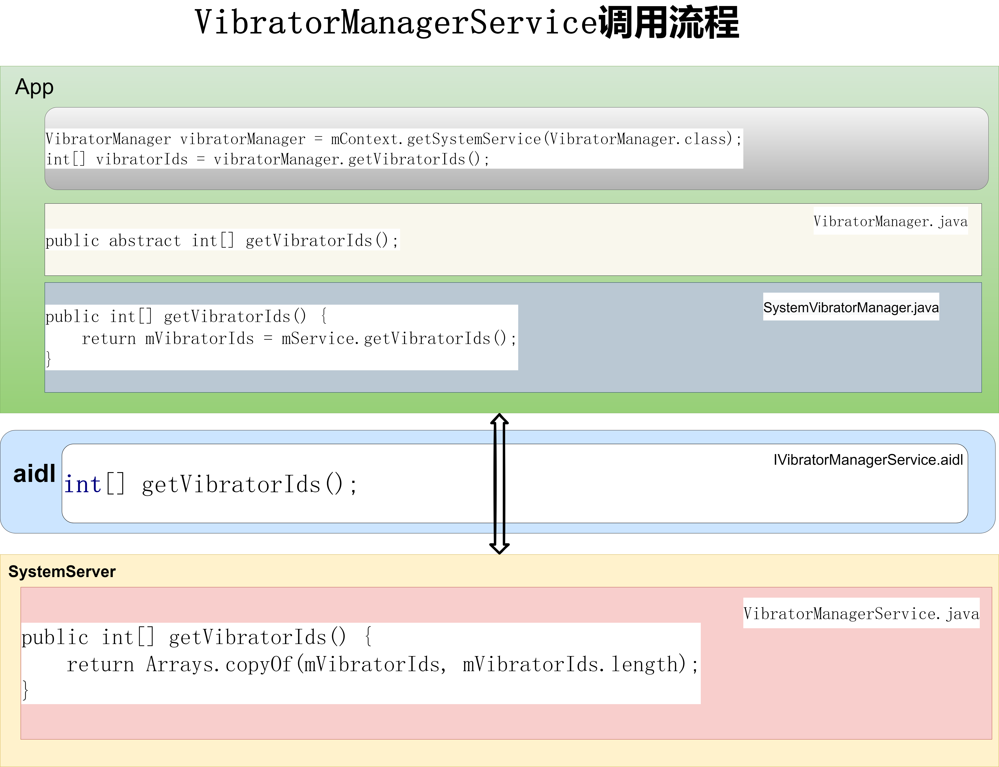
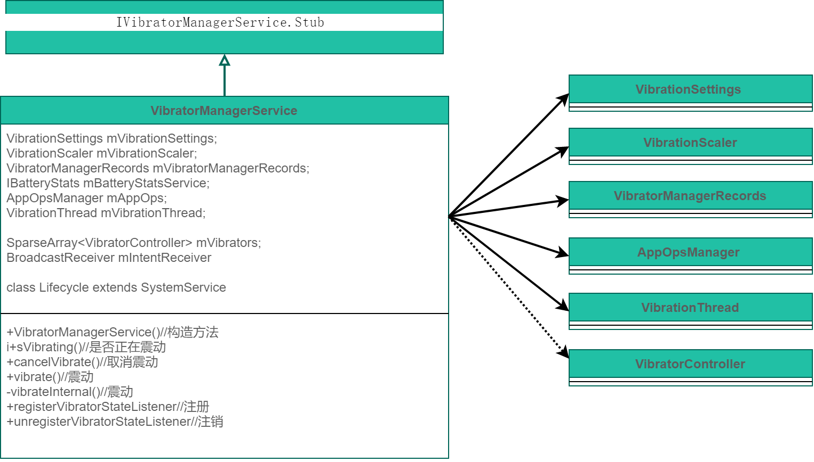
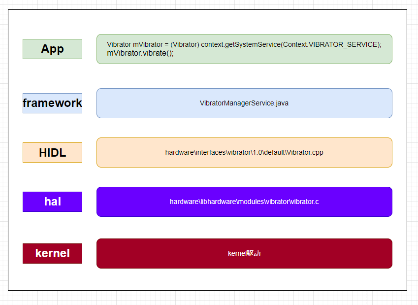

# P23: 系统开发之浅谈VibratorManagerService


---

[<font face='黑体' color=#ff0000 size=40 >跳转到文章结尾</font>](#参考资料)

---


# VibratorManagerService 作用

vibrator管理震动，这个服务比较简单，我们可以参考这个服务来自己做一个服务


---

# 获取 VibratorManagerService 的方式

```java
方式1
VibratorManager vibratorManager = mContext.getSystemService(VibratorManager.class);

方式2
Vibrator mVibrator = (Vibrator) context.getSystemService(Context.VIBRATOR_SERVICE);

方式3
IVibratorManagerService mService = IVibratorManagerService.Stub.asInterface(
        ServiceManager.getService(Context.VIBRATOR_MANAGER_SERVICE));
```

---

# VibratorManagerService 调用流程



图一 VibratorManagerService调用流程


以getVibratorIds()为例，查看VibratorManagerService调用流程：

(1)app应用中调用getVibratorIds:

```java
VibratorManager vibratorManager = mContext.getSystemService(VibratorManager.class);
int[] vibratorIds = vibratorManager.getVibratorIds();
```

(2)VibratorManager.java定义getVibratorIds

```java
/**
 * List all available vibrator ids, returning a possible empty list.
 *
 * @return An array containing the ids of the vibrators available on the device.
 */
@NonNull
public abstract int[] getVibratorIds();
```

(3)VibratorManager的子类SystemVibratorManager实现getVibratorIds

```java
public int[] getVibratorIds() {
    synchronized (mLock) {
        if (mVibratorIds != null) {
            return mVibratorIds;
        }
        try {
            if (mService == null) {
                Log.w(TAG, "Failed to retrieve vibrator ids; no vibrator manager service.");
            } else {
                return mVibratorIds = mService.getVibratorIds();
            }
        } catch (RemoteException e) {
            e.rethrowFromSystemServer();
        }
        return new int[0];
    }
}
```

(4)IVibratorManagerService.aidl定义getVibratorIds

```java
int[] getVibratorIds();
VibratorInfo getVibratorInfo(int vibratorId);
boolean isVibrating(int vibratorId);
boolean registerVibratorStateListener(int vibratorId, in IVibratorStateListener listener);
boolean unregisterVibratorStateListener(int vibratorId, in IVibratorStateListener listener);
boolean setAlwaysOnEffect(int uid, String opPkg, int alwaysOnId,
        in CombinedVibration vibration, in VibrationAttributes attributes);
void vibrate(int uid, String opPkg, in CombinedVibration vibration,
        in VibrationAttributes attributes, String reason, IBinder token);
void cancelVibrate(int usageFilter, IBinder token);
```


(5)VibratorManagerService调用getVibratorIds
```java
@Override // Binder call
public int[] getVibratorIds() {
    return Arrays.copyOf(mVibratorIds, mVibratorIds.length);
}
```

---

# 启动 VibratorManagerService 服务：

SystemServer.java

```java
t.traceBegin("StartVibratorManagerService");
mSystemServiceManager.startService(VibratorManagerService.Lifecycle.class);
t.traceEnd();
```


---


# VibratorManagerService类图





---

# handler消息

有一个handler:

```java
private final Handler mHandler;
```


---

# dump信息

```java
adb shell dumpsys vibrator

Vibrator Service:
  mCurrentVibration=null
  mCurrentExternalVibration=null  mVibratorUnderExternalControl=false
  mIsVibrating=false
  mVibratorStateListeners Count=0
  mLowPowerMode=false
  mHapticFeedbackIntensity=2
  mNotificationIntensity=2
  mRingIntensity=2
  mSupportedEffects=[]

  Previous ring vibrations:
  Previous notification vibrations:
  Previous alarm vibrations:
  Previous vibrations:
  Previous external vibrations:
```


---

# 日志开关

```java
private static final boolean DEBUG = false;
```


---

# 相机界面屏蔽所有震动提醒

在doVibratorOn方法中添加一个白名单，以避免震动

```java
// add begin
// Module Vibrator
//add black activity list for vibrator
import android.app.Activity;
import android.content.ComponentName;
//  add end


// add begin
// Module Vibrator
// add black activity list for vibrator
private String getTopActivityName() {
String topActivityName = "";
//get top activity name
ActivityManager am = (ActivityManager) mContext.getSystemService(Activity.ACTIVITY_SERVICE);
if(am != null
&& am.getRunningTasks(1) != null
&& am.getRunningTasks(1).size() > 0
&& am.getRunningTasks(1).get(0) != null) {
ComponentName comp = am.getRunningTasks(1).get(0).topActivity;
if(comp != null) {
    topActivityName = comp.getClassName();
}
}
return topActivityName;
}

private String getTopActivityPkgName() {
    String topPkgName = "";
    //get top activity package name
    ActivityManager am = (ActivityManager) mContext.getSystemService(Activity.ACTIVITY_SERVICE);
    if(am != null
    && am.getRunningTasks(1) != null
    && am.getRunningTasks(1).size() > 0
    && am.getRunningTasks(1).get(0) != null) {
        ComponentName comp = am.getRunningTasks(1).get(0).topActivity;
    if(comp != null) {
        topPkgName = comp.getPackageName();
    }
    }
    return topPkgName;
}

private String topActivityPkgNameTemp = "";
private String topActivityNameTemp = "";

private boolean isVibratorBlackActivity() {
    boolean result = false;
    topActivityPkgNameTemp = getTopActivityPkgName();
    topActivityNameTemp = getTopActivityName();
    if (DEBUG) {
        Slog.d(TAG, "topActivityPkgNameTemp:" + topActivityPkgNameTemp);
        Slog.d(TAG, "topActivityNameTemp:" + topActivityNameTemp);
    }
    if("com.android.camera".equals(topActivityPkgNameTemp)
    && "com.android.camera.CameraActivity".equals(topActivityNameTemp)){
        Slog.d(TAG, "Turning off vibrator when current activity in black list");
        result = true;
    }
    return result;
}
//  add end


private void doVibratorOn(long millis, int amplitude, int uid, AudioAttributes attrs) {
Trace.traceBegin(Trace.TRACE_TAG_VIBRATOR, "doVibratorOn");
try {
synchronized (mInputDeviceVibrators) {
if (amplitude == VibrationEffect.DEFAULT_AMPLITUDE) {
amplitude = mDefaultVibrationAmplitude;
}

//  add begin
// Module Vibrator
// add black activity list for vibrator
if(isVibratorBlackActivity()){
    return;
}
//  add end

if (DEBUG) {
Slog.d(TAG, "Turning vibrator on for " + millis + " ms" +
" with amplitude " + amplitude + ".");
}

```

---


# JNI

VibratorManagerService的native方法

```java
static native boolean vibratorExists();
static native void vibratorInit();
static native void vibratorOn(long milliseconds);
static native void vibratorOff();
static native boolean vibratorSupportsAmplitudeControl();
static native void vibratorSetAmplitude(int amplitude);
static native int[] vibratorGetSupportedEffects();
static native long vibratorPerformEffect(long effect, long strength, Vibration vibration,
        boolean withCallback);
static native void vibratorPerformComposedEffect(
        VibrationEffect.Composition.PrimitiveEffect[] effect, Vibration vibration);
static native boolean vibratorSupportsExternalControl();
static native void vibratorSetExternalControl(boolean enabled);
static native long vibratorGetCapabilities();
static native void vibratorAlwaysOnEnable(long id, long effect, long strength);
static native void vibratorAlwaysOnDisable(long id);
```

对应于jni代码：

frameworks\base\services\core\jni\com_android_server_VibratorService.cpp

```cpp
static void vibratorOn(JNIEnv* /* env */, jclass /* clazz */, jlong timeout_ms)
{
    if (auto hal = getHal<aidl::IVibrator>()) {
        auto status = hal->call(&aidl::IVibrator::on, timeout_ms, nullptr);
        if (!status.isOk()) {
            ALOGE("vibratorOn command failed: %s", status.toString8().string());
        }
    } else {
        Status retStatus = halCall(&V1_0::IVibrator::on, timeout_ms).withDefault(Status::UNKNOWN_ERROR);
        if (retStatus != Status::OK) {
            ALOGE("vibratorOn command failed (%" PRIu32 ").", static_cast<uint32_t>(retStatus));
        }
    }
}

static void vibratorOff(JNIEnv* /* env */, jclass /* clazz */)
{
    if (auto hal = getHal<aidl::IVibrator>()) {
        auto status = hal->call(&aidl::IVibrator::off);
        if (!status.isOk()) {
            ALOGE("vibratorOff command failed: %s", status.toString8().string());
        }
    } else {
        Status retStatus = halCall(&V1_0::IVibrator::off).withDefault(Status::UNKNOWN_ERROR);
        if (retStatus != Status::OK) {
            ALOGE("vibratorOff command failed (%" PRIu32 ").", static_cast<uint32_t>(retStatus));
        }
    }
}
```


---

# HIDL层
以马达的On和off为例，会调用到HAL层的on和off方法。

代码路径：

hardware\interfaces\vibrator\1.0\default\Vibrator.cpp

```cpp
// Methods from ::android::hardware::vibrator::V1_0::IVibrator follow.
Return<Status> Vibrator::on(uint32_t timeout_ms) {
    int32_t ret = mDevice->vibrator_on(mDevice, timeout_ms);
    if (ret != 0) {
        ALOGE("on command failed : %s", strerror(-ret));
        return Status::UNKNOWN_ERROR;
    }
    return Status::OK;
}

Return<Status> Vibrator::off()  {
    int32_t ret = mDevice->vibrator_off(mDevice);
    if (ret != 0) {
        ALOGE("off command failed : %s", strerror(-ret));
        return Status::UNKNOWN_ERROR;
    }
    return Status::OK;
}

```

HIDL层是较新的安卓版本才引入的，是连接HAL层和JNI层的桥梁


---

# HAL

代码路径：hardware\libhardware\modules\vibrator\vibrator.c

```c
static const char THE_DEVICE[] = "/sys/class/timed_output/vibrator/enable";

static int sendit(unsigned int timeout_ms)
{
    char value[TIMEOUT_STR_LEN]; /* large enough for millions of years */

    snprintf(value, sizeof(value), "%u", timeout_ms);
    return write_value(THE_DEVICE, value);
}

static int vibra_on(vibrator_device_t* vibradev __unused, unsigned int timeout_ms)
{
    /* constant on, up to maximum allowed time */
    return sendit(timeout_ms);
}

static int vibra_off(vibrator_device_t* vibradev __unused)
{
    return sendit(0);
}

......

static int vibra_open(const hw_module_t* module, const char* id __unused,
                      hw_device_t** device __unused) {
    bool use_led;

    if (vibra_exists()) {
        ALOGD("Vibrator using timed_output");
        use_led = false;
    } else if (vibra_led_exists()) {
        ALOGD("Vibrator using LED trigger");
        use_led = true;
    } else {
        ALOGE("Vibrator device does not exist. Cannot start vibrator");
        return -ENODEV;
    }

    vibrator_device_t *vibradev = calloc(1, sizeof(vibrator_device_t));

    if (!vibradev) {
        ALOGE("Can not allocate memory for the vibrator device");
        return -ENOMEM;
    }

    vibradev->common.tag = HARDWARE_DEVICE_TAG;
    vibradev->common.module = (hw_module_t *) module;
    vibradev->common.version = HARDWARE_DEVICE_API_VERSION(1,0);
    vibradev->common.close = vibra_close;

    if (use_led) {
        vibradev->vibrator_on = vibra_led_on;
        vibradev->vibrator_off = vibra_led_off;
    } else {
        vibradev->vibrator_on = vibra_on;
        vibradev->vibrator_off = vibra_off;
    }

    *device = (hw_device_t *) vibradev;

    return 0;
}

```

其实开启和关闭马达的工作很简单，就是往节点"/sys/class/timed_output/vibrator/enable"写入震动时间，所以可以想得到驱动层只需要提供一个节点供上层操作就好。

---

# vendor.qti.hardware.vibrator.service

高通平台：
vendor/qcom/opensource/vibrator/

---

# kernel

马达的驱动是基于kernel提供的timed_output框架完成的

代码路径：kernel-4.4\drivers\staging\android\timed_output.c

代码比较简单，提供接口给驱动在"/sys/class/timed_output/"路径下面建立自己的节点，并提供节点的device attribute的操作接口，当我们写节点的时候就会调用到enable_store函数，并调用注册驱动的enable函数


# 驱动-vibrator

vendor/qcom/proprietary/devicetree-4.19/qcom/sc780-dts/pmi632.dtsi

```c
pmi632_vib: qcom,vibrator@5700 {
    compatible = "qcom,qpnp-vibrator-ldo";
    reg = <0x5700 0x100>;
    qcom,vib-ldo-volt-uv = <3000000>;
    qcom,disable-overdrive;
};
```

kernel/msm-4.19/drivers/leds/leds-qpnp-vibrator-ldo.c

```c
static const struct of_device_id vibrator_ldo_match_table[] = {
    { .compatible = "qcom,qpnp-vibrator-ldo" },
    { /* sentinel */ },
};
MODULE_DEVICE_TABLE(of, vibrator_ldo_match_table);
```


# VibratorManagerService 垂直框架





---

# 参考资料

1.Android Vibrator

https://www.jianshu.com/p/6114071d8879

---

[<font face='黑体' color=#ff0000 size=40 >跳转到文章开始</font>](#p23-系统开发之浅谈VibratorManagerService)

---

# 结束语


