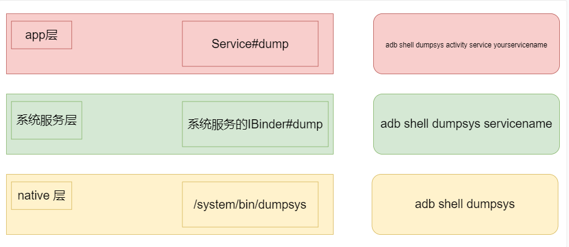
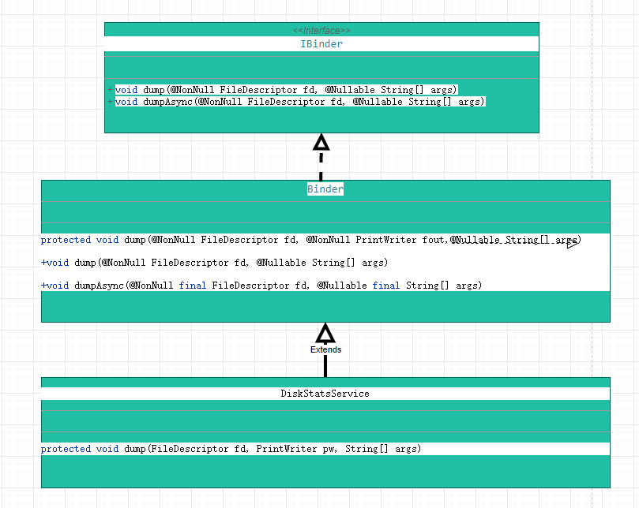

# P25: 系统开发之dumpsys


---

[跳转到readme](https://github.com/hfreeman2008/android_core_framework/blob/main/README-CN.md)

---

[<font face='黑体' color=#ff0000 size=40 >跳转到文章结尾</font>](#结束语)

---

[上一篇文章 P24_系统开发之回调接口注册注销](https://github.com/hfreeman2008/android_core_framework/blob/main/P24_%E7%B3%BB%E7%BB%9F%E5%BC%80%E5%8F%91%E4%B9%8B%E5%9B%9E%E8%B0%83%E6%8E%A5%E5%8F%A3%E6%B3%A8%E5%86%8C%E6%B3%A8%E9%94%80/%E7%B3%BB%E7%BB%9F%E5%BC%80%E5%8F%91%E4%B9%8B%E5%9B%9E%E8%B0%83%E6%8E%A5%E5%8F%A3%E6%B3%A8%E5%86%8C%E6%B3%A8%E9%94%80.md)


[下一篇文章 P26_系统开发之系统属性](https://github.com/hfreeman2008/android_core_framework/blob/main/P26_%E7%B3%BB%E7%BB%9F%E5%BC%80%E5%8F%91%E4%B9%8B%E7%B3%BB%E7%BB%9F%E5%B1%9E%E6%80%A7/%E7%B3%BB%E7%BB%9F%E5%BC%80%E5%8F%91%E4%B9%8B%E7%B3%BB%E7%BB%9F%E5%B1%9E%E6%80%A7.md)

---

# 前言

dumpsys命令是我们系统开发常用的命令之一，对于我们定位系统的具体细节信息是非常有用的；

这篇文章我们深度分析一下dumpsys命令的具体实现；

---

# dumpsys命令

## dumpsys help命令：

```sh
adb shell dumpsys --help
usage: dumpsys
         To dump all services.
or:
       dumpsys [-t TIMEOUT] [--priority LEVEL] [--pid] [--thread] [--help | -l | --skip SERVICES | SERVICE [ARGS]]
         --help: shows this help
         -l: only list services, do not dump them
         -t TIMEOUT_SEC: TIMEOUT to use in seconds instead of default 10 seconds
         -T TIMEOUT_MS: TIMEOUT to use in milliseconds instead of default 10 seconds
         --pid: dump PID instead of usual dump
         --thread: dump thread usage instead of usual dump
         --proto: filter services that support dumping data in proto format. Dumps
               will be in proto format.
         --priority LEVEL: filter services based on specified priority
               LEVEL must be one of CRITICAL | HIGH | NORMAL
         --skip SERVICES: dumps all services but SERVICES (comma-separated list)
         SERVICE [ARGS]: dumps only service SERVICE, optionally passing ARGS to it
```


---

## 常用dumpsys命令：

```sh
adb shell dumpsys       输出设备中dumpsys信息
adb shell dumpsys -l    输出设备中所有的服务名称
adb shell dumpsys activity
adb shell dumpsys package
adb shell dumpsys window

```


```sh
adb shell dumpsys activity -h
Activity manager dump options:
  [-a] [-c] [-p PACKAGE] [-h] [WHAT] ...
  WHAT may be one of:
    a[ctivities]: activity stack state      //activity堆栈状态
    r[recents]: recent activities state     //最近activity的状态
    b[roadcasts] [PACKAGE_NAME] [history [-s]]: broadcast state  //查看广播接收器的信息
    broadcast-stats [PACKAGE_NAME]: aggregated broadcast statistics
    i[ntents] [PACKAGE_NAME]: pending intent state  //挂起的intent状态
    p[rocesses] [PACKAGE_NAME]: process state
    o[om]: out of memory management
    perm[issions]: URI permission grant state
    prov[iders] [COMP_SPEC ...]: content provider state
    provider [COMP_SPEC]: provider client-side state
    s[ervices] [COMP_SPEC ...]: service state
    allowed-associations: current package association restrictions
    as[sociations]: tracked app associations
    exit-info [PACKAGE_NAME]: historical process exit information
    lmk: stats on low memory killer
    lru: raw LRU process list
    binder-proxies: stats on binder objects and IPCs
    settings: currently applied config settings
    service [COMP_SPEC]: service client-side state
    package [PACKAGE_NAME]: all state related to given package
    all: dump all activities
    top: dump the top activity
  WHAT may also be a COMP_SPEC to dump activities.
  COMP_SPEC may be a component name (com.foo/.myApp),
    a partial substring in a component name, a
    hex object identifier.
  -a: include all available server state.
  -c: include client state.
  -p: limit output to given package.
  --checkin: output checkin format, resetting data.
  --C: output checkin format, not resetting data.
  --proto: output dump in protocol buffer format.
  --autofill: dump just the autofill-related state of an activity

```


```sh
adb shell dumpsys package -h
Package manager dump options:
  [-h] [-f] [--checkin] [--all-components] [cmd] ...
    --checkin: dump for a checkin
    -f: print details of intent filters
    -h: print this help
    --all-components: include all component names in package dump
  cmd may be one of:
    apex: list active APEXes and APEX session state
    l[ibraries]: list known shared libraries
    f[eatures]: list device features
    k[eysets]: print known keysets
    r[esolvers] [activity|service|receiver|content]: dump intent resolvers
    perm[issions]: dump permissions
    permission [name ...]: dump declaration and use of given permission
    pref[erred]: print preferred package settings
    preferred-xml [--full]: print preferred package settings as xml
    prov[iders]: dump content providers
    p[ackages]: dump installed packages
    q[ueries]: dump app queryability calculations
    s[hared-users]: dump shared user IDs
    m[essages]: print collected runtime messages
    v[erifiers]: print package verifier info
    d[omain-preferred-apps]: print domains preferred apps
    i[ntent-filter-verifiers]|ifv: print intent filter verifier info
    t[imeouts]: print read timeouts for known digesters
    version: print database version info
    write: write current settings now
    installs: details about install sessions
    check-permission <permission> <package> [<user>]: does pkg hold perm?
    dexopt: dump dexopt state
    compiler-stats: dump compiler statistics
    service-permissions: dump permissions required by services
    snapshot: dump snapshot statistics
    known-packages: dump known packages
    <package.name>: info about given package

```


```sh
adb shell dumpsys window -h
Window manager dump options:
  [-a] [-h] [cmd] ...
  cmd may be one of:
    l[astanr]: last ANR information   //查看anr
    p[policy]: policy state
    a[animator]: animator state
    s[essions]: active sessions
    surfaces: active surfaces (debugging enabled only)
    d[isplays]: active display contents
    t[okens]: token list
    w[indows]: window list    //查看window列表
    trace: print trace status and write Winscope trace to file
  cmd may also be a NAME to dump windows.  NAME may
    be a partial substring in a window name, a
    Window hex object identifier, or
    "all" for all windows, or
    "visible" for the visible windows.
    "visible-apps" for the visible app windows.
  -a: include all available server state.
  --proto: output dump in protocol buffer format.

```

## 网络信息查询

安卓系统网络连接和管理服务由四个系统服务ConnectivityService，NetworkPolicyManagerService，NetworkManagementService，NetworkStatsService共同配合完成网络连接和管理功能。
因此，要查看设备网络相关信息，就需要使用dumpsys命令分别查看设备中这些服务的详细信息：

```sh
dumpsys connectivity    查看设备当前网络连接状态
dumpsys netpolicy    查看设备网络策略
dumpsys netstats    查看设备网络状态
dumpsys network_management    查看设备网络管理服务信息

```

---

# dumpsys整体框架





---

# dumpsys native层

dumpsys bin文件：

/system/bin/dumpsys

dumpsys源码：

frameworks/native/cmds/dumpsys


```sh
ls frameworks/native/cmds/dumpsys/

Android.bp  dumpsys.cpp  dumpsys.h  main.cpp  MODULE_LICENSE_APACHE2  NOTICE  OWNERS  TEST_MAPPING  tests
```

main.cpp

```cpp
int main(int argc, char* const argv[]) {
    Dumpsys dumpsys(sm.get());
    //主入口方法
    return dumpsys.main(argc, argv);
}

```

dumpsys.cpp


```cpp
主入口方法
int Dumpsys::main(int argc, char* const argv[]) {
    Vector<String16> services;//各个服务
    
    Type type = Type::DUMP;  //默认类型为dump
    int timeoutArgMs = 10000;//默认时间10s
    ......
    const size_t N = services.size();    //服务的数目
    ......
    //遍历所有的servie
    for (size_t i = 0; i < N; i++) {
        const String16& serviceName = services[i];
        if (IsSkipped(skippedServices, serviceName)) continue;
        //开始dumpthread startDumpThread
        if (startDumpThread(type, serviceName, args) == OK) {
            bool addSeparator = (N > 1);
            if (addSeparator) {
                //写dump 头
                writeDumpHeader(STDOUT_FILENO, serviceName, priorityFlags);
            }
            std::chrono::duration<double> elapsedDuration;
            size_t bytesWritten = 0;
            status_t status =
                writeDump(STDOUT_FILENO, serviceName, std::chrono::milliseconds(timeoutArgMs),
                          asProto, elapsedDuration, bytesWritten);//写dump

            if (status == TIMED_OUT) {
                std::cout << std::endl
                     << "*** SERVICE '" << serviceName << "' DUMP TIMEOUT (" << timeoutArgMs
                     << "ms) EXPIRED ***" << std::endl
                     << std::endl;
            }

            if (addSeparator) {
                //写dump footer
                writeDumpFooter(STDOUT_FILENO, serviceName, elapsedDuration);
            }
            bool dumpComplete = (status == OK);
            //结束dump thread
            stopDumpThread(dumpComplete);
        }
    }
}

```


```cpp
//开始dump thread
status_t Dumpsys::startDumpThread(Type type, const String16& serviceName,
                                  const Vector<String16>& args) {
    sp<IBinder> service = sm_->checkService(serviceName);
    ......
    redirectFd_ = unique_fd(sfd[0]);
    unique_fd remote_end(sfd[1]);
    sfd[0] = sfd[1] = -1;

    // dump blocks until completion, so spawn a thread..
    activeThread_ = std::thread([=, remote_end{std::move(remote_end)}]() mutable {
        status_t err = 0;

        switch (type) {
        case Type::DUMP:
            //调用service的dump方法
            err = service->dump(remote_end.get(), args);
            break;
        case Type::PID:
            //dump 对应pid的信息
            err = dumpPidToFd(service, remote_end);
            break;
        case Type::THREAD:
            //dump threads的信息
            err = dumpThreadsToFd(service, remote_end);
            break;
        default:
            std::cerr << "Unknown dump type" << static_cast<int>(type) << std::endl;
            return;
        }
    });
    return OK;
}

```


```cpp
//对应dumpsys --help的提示
static void usage() {
    fprintf(stderr,
            "usage: dumpsys\n"
            "         To dump all services.\n"
            "or:\n"
            "       dumpsys [-t TIMEOUT] [--priority LEVEL] [--pid] [--thread] [--help | -l | "
            "--skip SERVICES "
            "| SERVICE [ARGS]]\n"
            "         --help: shows this help\n"
            "         -l: only list services, do not dump them\n"
            "         -t TIMEOUT_SEC: TIMEOUT to use in seconds instead of default 10 seconds\n"
            "         -T TIMEOUT_MS: TIMEOUT to use in milliseconds instead of default 10 seconds\n"
            "         --pid: dump PID instead of usual dump\n"
            "         --thread: dump thread usage instead of usual dump\n"
            "         --proto: filter services that support dumping data in proto format. Dumps\n"
            "               will be in proto format.\n"
            "         --priority LEVEL: filter services based on specified priority\n"
            "               LEVEL must be one of CRITICAL | HIGH | NORMAL\n"
            "         --skip SERVICES: dumps all services but SERVICES (comma-separated list)\n"
            "         SERVICE [ARGS]: dumps only service SERVICE, optionally passing ARGS to it\n");
}

```


---


# app 层

## Service#dump

frameworks\base\core\java\android\app\Service.java


```java
public abstract class Service extends ContextWrapper implements ComponentCallbacks2,
        ContentCaptureManager.ContentCaptureClient {

    /**
     * Print the Service's state into the given stream.  This gets invoked if
     * you run "adb shell dumpsys activity service &lt;yourservicename&gt;"
     * (note that for this command to work, the service must be running, and
     * you must specify a fully-qualified service name).
     * This is distinct from "dumpsys &lt;servicename&gt;", which only works for
     * named system services and which invokes the {@link IBinder#dump} method
     * on the {@link IBinder} interface registered with ServiceManager.
     *
     * @param fd The raw file descriptor that the dump is being sent to.
     * @param writer The PrintWriter to which you should dump your state.  This will be
     * closed for you after you return.
     * @param args additional arguments to the dump request.
     */
    protected void dump(FileDescriptor fd, PrintWriter writer, String[] args) {
        writer.println("nothing to dump");
    }

}

```

从说明可以看出，此接口的触发命令：

```sh
adb shell dumpsys activity service yourservicename
```

## 一个demo：

App只需要继承Service后重写dump方法就可以进行dumpsys打印了。

```java
public class TestService extends Service {
    @Override
    public IBinder onBind(Intent intent) {
        return null;
    }
    @Override
    protected void dump(FileDescriptor fd, PrintWriter writer, String[] args) {
        writer.println("Test dump");
    }
}

```
service启动之后就可以dumpsys activity service指令在命令行打印dump方法内容了。

```sh
adb shell dumpsys activity service TestService
SERVICE android.examples.com/.TestService 864e7ea pid=2781
Client:
Test dump

```


---

# 系统服务层

## 系统服务触发命令：


```sh
adb shell dumpsys servicename
```

## IBinder#dump

frameworks\base\core\java\android\os\IBinder.java


```java
public interface IBinder {
    
    /**
     * Print the object's state into the given stream.
     * 
     * @param fd The raw file descriptor that the dump is being sent to.
     * @param args additional arguments to the dump request.
     */
    public void dump(@NonNull FileDescriptor fd, @Nullable String[] args) throws RemoteException;

}
```

## Binder#dump

frameworks\base\core\java\android\os\Binder.java

```java
public class Binder implements IBinder {

    /**
     * Print the object's state into the given stream.
     *
     * @param fd The raw file descriptor that the dump is being sent to.
     * @param fout The file to which you should dump your state.  This will be
     * closed for you after you return.
     * @param args additional arguments to the dump request.
     */
    protected void dump(@NonNull FileDescriptor fd, @NonNull PrintWriter fout,
            @Nullable String[] args) {
    }

    /**
     * Implemented to call the more convenient version
     * {@link #dump(FileDescriptor, PrintWriter, String[])}.
     */
    public void dump(@NonNull FileDescriptor fd, @Nullable String[] args) {
        FileOutputStream fout = new FileOutputStream(fd);
        PrintWriter pw = new FastPrintWriter(fout);
        try {
            doDump(fd, pw, args);
        } finally {
            pw.flush();
        }
    }
}
```

## TimeZoneDetectorService#dump

```java
public final class TimeZoneDetectorService extends ITimeZoneDetectorService.Stub {

    @Override
    protected void dump(@NonNull FileDescriptor fd, @NonNull PrintWriter pw,@Nullable String[] args) {
        ......
    }
}
```

## NotificationManagerService#mService#dump

```java

public class NotificationManagerService extends SystemService {
   
    final IBinder mService = new INotificationManager.Stub() {
         
        @Override
        protected void dump(FileDescriptor fd, PrintWriter pw, String[] args) {

            final DumpFilter filter = DumpFilter.parseFromArguments(args);
            final long token = Binder.clearCallingIdentity();
            try { 
                 dumpImpl(pw, filter);
            } finally {
                Binder.restoreCallingIdentity(token);
            }
        }
    }
}
```

## DiskStatsService#dump

```java

public class DiskStatsService extends Binder {
    
    @Override
    protected void dump(FileDescriptor fd, PrintWriter pw, String[] args) {
        if (!DumpUtils.checkDumpAndUsageStatsPermission(mContext, TAG, pw)) return;
            ......
    }
}
```



---

## CameraService::dump

frameworks\av\services\camera\libcameraservice\CameraService.cpp


```cpp
status_t CameraService::dump(int fd, const Vector<String16>& args) {
......
}

```

---

# 参考资料
1.Android 进阶——Framework 核心之dumpsys命令浅析

https://blog.csdn.net/CrazyMo_/article/details/119522548


2.P5: 系统分析的屠龙刀之dumpsys信息

https://github.com/hfreeman2008/android_core_framework/blob/main/P5_%E7%B3%BB%E7%BB%9F%E5%88%86%E6%9E%90%E7%9A%84%E5%B1%A0%E9%BE%99%E5%88%80%E4%B9%8Bdumpsys%E4%BF%A1%E6%81%AF/%E7%B3%BB%E7%BB%9F%E5%88%86%E6%9E%90%E7%9A%84%E5%B1%A0%E9%BE%99%E5%88%80%E4%B9%8Bdumpsys%E4%BF%A1%E6%81%AF.md


---

[<font face='黑体' color=#ff0000 size=40 >跳转到文章开始</font>](#p25-系统开发之dumpsys)

---

[上一篇文章 P24_系统开发之回调接口注册注销](https://github.com/hfreeman2008/android_core_framework/blob/main/P24_%E7%B3%BB%E7%BB%9F%E5%BC%80%E5%8F%91%E4%B9%8B%E5%9B%9E%E8%B0%83%E6%8E%A5%E5%8F%A3%E6%B3%A8%E5%86%8C%E6%B3%A8%E9%94%80/%E7%B3%BB%E7%BB%9F%E5%BC%80%E5%8F%91%E4%B9%8B%E5%9B%9E%E8%B0%83%E6%8E%A5%E5%8F%A3%E6%B3%A8%E5%86%8C%E6%B3%A8%E9%94%80.md)


[下一篇文章 P26_系统开发之系统属性](https://github.com/hfreeman2008/android_core_framework/blob/main/P26_%E7%B3%BB%E7%BB%9F%E5%BC%80%E5%8F%91%E4%B9%8B%E7%B3%BB%E7%BB%9F%E5%B1%9E%E6%80%A7/%E7%B3%BB%E7%BB%9F%E5%BC%80%E5%8F%91%E4%B9%8B%E7%B3%BB%E7%BB%9F%E5%B1%9E%E6%80%A7.md)

---

# 结束语


