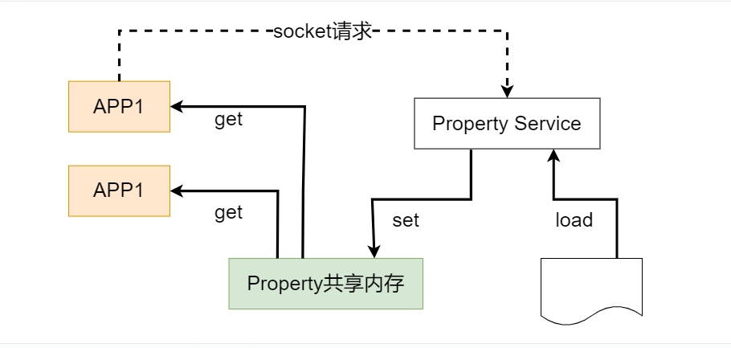
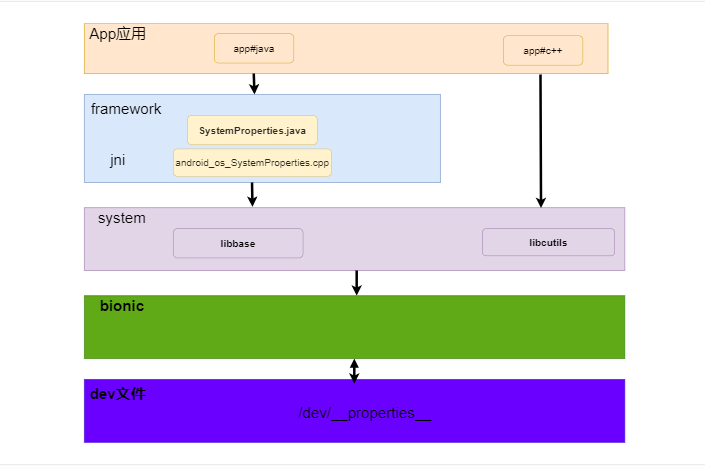
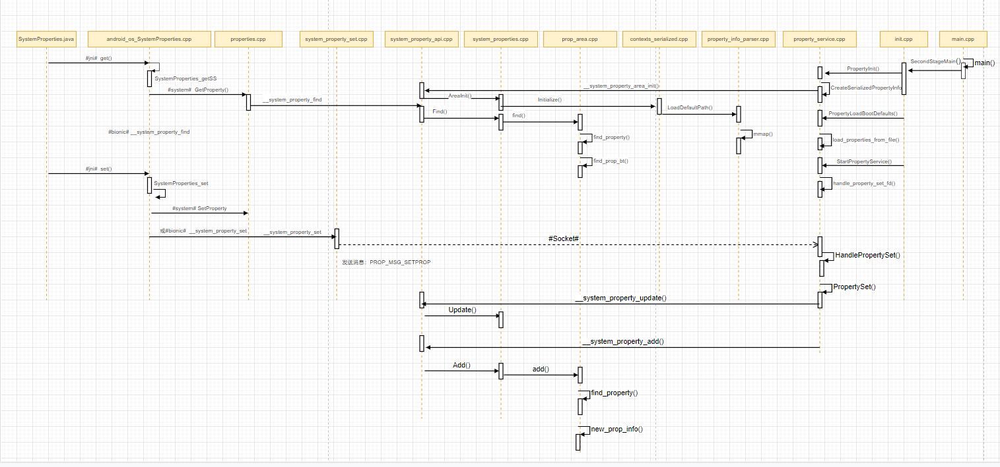

# P26: 系统开发之系统属性


---

[跳转到readme](https://github.com/hfreeman2008/android_core_framework/blob/main/README-CN.md)

---

[<font face='黑体' color=#ff0000 size=40 >跳转到文章结尾</font>](#结束语)

---

[上一篇文章 P25_系统开发之dumpsys](https://github.com/hfreeman2008/android_core_framework/blob/main/P25_%E7%B3%BB%E7%BB%9F%E5%BC%80%E5%8F%91%E4%B9%8Bdumpsys/%E7%B3%BB%E7%BB%9F%E5%BC%80%E5%8F%91%E4%B9%8Bdumpsys.md)


[下一篇文章 P27: 系统开发之anr](https://github.com/hfreeman2008/android_core_framework/blob/main/P27_%E7%B3%BB%E7%BB%9F%E5%BC%80%E5%8F%91%E4%B9%8Banr/%E7%B3%BB%E7%BB%9F%E5%BC%80%E5%8F%91%E4%B9%8Banr.md)


---

# 前言

系统属性是我们开发用的最多的一个技术点，以前觉得这个太简单了，没有什么需要了解的；后来想整体了解一下其具体的实现，发现事情没有那边简单啊。


本笔记主要是基于android 11，同步参考--Android 系统属性（SystemProperties）介绍（https://juejin.cn/post/7274932704453672972#heading-0）。

---

# 常用技巧

读取所有设备的系统属性：

```sh
adb shell getprop
```

读取对应的系统属性值（以sys.boot.reason为例）：


```sh
adb shell getprop sys.boot.reason
```

设置系统属性值（这个需要注意，许多系统属性值需要权限）：

```sh
adb shell setprop log.tag.stats_log D
```

监听系统属性值状态：

system/core/rootdir/init.rc

```sh
on property:vold.decrypt=trigger_restart_framework
    # A/B update verifier that marks a successful boot.
    exec_start update_verifier
    class_start_post_data hal
    class_start_post_data core
    class_start main
    class_start late_start
    setprop service.bootanim.exit 0
    start bootanim
```

---

# 代码中使用属性

## java代码调用

### 对于有系统权限的应用

我们可以直接使用SystemProperties的读写接口：

```java
import android.os.SystemProperties;

SystemProperties.set("sys.boot_completed", "1");
int max = SystemProperties.getInt("tombstoned.max_anr_count", 64);

```


这要求android程序的权限提升到system权限，方法有下面二个：

- 1、在AndroidManifest.xml中，在manifest加入android:sharedUserId="android.uid.system"。

- 2、在Android.mk中，將LOCAL_CERTIFICATE := XXX修改成LOCAL_CERTIFICATE := platform。

---

### 普通应用

由于SystemProperties.java的API为系统API，普通应用无法直接使用，可以通过反射来get和set prop。

```java
package com.android.reflectiondemo;

import androidx.appcompat.app.AppCompatActivity;
import android.os.Bundle;
import android.util.Log;
import java.lang.reflect.InvocationTargetException;
import java.lang.reflect.Method;

public class MainActivity extends AppCompatActivity {
    @Override
    protected void onCreate(Bundle savedInstanceState) {
        super.onCreate(savedInstanceState);
        setContentView(R.layout.activity_main);

        Log.d(TAG, "sys.isolated_storage_snapshot:"+getBoolean("sys.isolated_storage_snapshot", false));
    }
    
    public static boolean getBoolean(String key, boolean def) throws IllegalArgumentException {
        try {
            Class SystemPropertiesClass = Class.forName("android.os.SystemProperties");
            Method getBooleanMethod =
                    SystemPropertiesClass.getDeclaredMethod(
                            "getBoolean", String.class, boolean.class);
            getBooleanMethod.setAccessible(true);
            return (boolean) getBooleanMethod.invoke(SystemPropertiesClass, key, def);
        } catch (InvocationTargetException
                | IllegalAccessException
                | NoSuchMethodException
                | ClassNotFoundException e) {
            Log.e(TAG, "Failed to invoke SystemProperties.getBoolean()", e);
        }
        return def;
    }
}

```


---

## c++代码调用

这里以MPEG4Writer.cpp为例

frameworks\av\media\libstagefright\MPEG4Writer.cpp

```c++
#include <cutils/properties.h>
    ...
void MPEG4Writer::addDeviceMeta() {
    ...
    if (property_get("ro.build.version.release", val, NULL)
    ...
        if (property_get("ro.product.model", val, NULL)
    ...
}

```

在C++代码中使用prop需要：
- include <cutils/properties.h>
- Android.mk或Android.bp或Makefile中需要链接libcutils库

```sh
shared_libs: [
        ...
        "libcutils",
        ...

```

properties.h源码在：

system/core/libcutils/include/cutils/properties.h

```c
int property_get(const char* key, char* value, const char* default_value);
int property_set(const char *key, const char *value);
int property_list(void (*propfn)(const char *key, const char *value, void *cookie), void *cookie)
```

libcutils库文件：

```sh
/system/lib64/libcutils.so
/system/lib/libcutils.so
```


---

# 涉及的代码路径汇总如下

```sh
app
SystemProperties#get  SystemProperties#set

framework：
frameworks\base\core\java\android\os\SystemProperties.java

jni:
frameworks\base\core\jni\android_os_SystemProperties.cpp

system:
system\core\base\properties.cpp
system\core\init\init.cpp
system\core\init\property_service.cpp
system\core\init\main.cpp
system\core\property_service\libpropertyinfoparser\property_info_parser.cpp

bionic:
bionic\libc\bionic\system_property_set.cpp
bionic\libc\bionic\system_property_api.cpp
bionic\libc\system_properties\system_properties.cpp
bionic\libc\include\sys\_system_properties.h
bionic\libc\include\sys\system_properties.h
bionic\libc\system_properties\contexts_serialized.cpp
bionic\libc\system_properties\prop_area.cpp
```

---

# 系统属性架构设计如下




---

# 系统属性整体分层



---

# 系统属性时序图




---

# 系统属性读写的流程

## frameworks-SystemProperties.java 
frameworks\base\core\java\android\os\SystemProperties.java 

读写系统属性的接口：

```java
public class SystemProperties {

    private static native String native_get(long handle);
    private static native void native_set(String key, String def);

    public static String get(@NonNull String key, @Nullable String def) {
        if (TRACK_KEY_ACCESS) onKeyAccess(key);
        return native_get(key, def);
    }
    
    public static void set(@NonNull String key, @Nullable String val) {
        if (val != null && !val.startsWith("ro.") && val.length() > PROP_VALUE_MAX) {
            throw new IllegalArgumentException("value of system property '" + key
                    + "' is longer than " + PROP_VALUE_MAX + " characters: " + val);
        }
        if (TRACK_KEY_ACCESS) onKeyAccess(key);
        native_set(key, val);
    }
}
```

通过JNI调用native_set()和native_get()：

---

## jni-android_os_SystemProperties.cpp
frameworks\base\core\jni\android_os_SystemProperties.cpp

```c++
//读
jstring SystemProperties_getSS(JNIEnv* env, jclass clazz, jstring keyJ,
                               jstring defJ)
{
    jstring ret = defJ;
    //读取系统属性
    ReadProperty(env, keyJ, [&](const char* value) {
        if (value[0]) {
            ret = env->NewStringUTF(value);
        }
    });
    if (ret == nullptr && !env->ExceptionCheck()) {
      ret = env->NewStringUTF("");  // Legacy behavior
    }
    return ret;
}

//写
void SystemProperties_set(JNIEnv *env, jobject clazz, jstring keyJ,
                          jstring valJ)
{
    ......
    bool success;
#if defined(__BIONIC__)
    //如果支持__BIONIC__
    success = !__system_property_set(key.c_str(), value ? value->c_str() : "");
#else
    //不支持__BIONIC__
    success = android::base::SetProperty(key.c_str(), value ? value->c_str() : "");
#endif
    if (!success) {
        jniThrowException(env, "java/lang/RuntimeException",
                          "failed to set system property (check logcat for reason)");
    }
}

//读
void ReadProperty(JNIEnv* env, jstring keyJ, Functor&& functor)
{
#if defined(__BIONIC__)
    //支持__BIONIC__
    const prop_info* prop = __system_property_find(key.c_str());
    if (!prop) {
        return;
    }
    ReadProperty(prop, std::forward<Functor>(functor));
#else
    //不支持__BIONIC__
    std::forward<Functor>(functor)(
        android::base::GetProperty(key.c_str(), "").c_str());
#endif
}

```


```c++
int register_android_os_SystemProperties(JNIEnv *env)
{
    const JNINativeMethod method_table[] = {
        { "native_get",
          "(Ljava/lang/String;Ljava/lang/String;)Ljava/lang/String;",
          (void*) SystemProperties_getSS },
        { "native_get_int", "(Ljava/lang/String;I)I",
          (void*) SystemProperties_get_integral<jint> },
        { "native_get_long", "(Ljava/lang/String;J)J",
          (void*) SystemProperties_get_integral<jlong> },
        { "native_get_boolean", "(Ljava/lang/String;Z)Z",
          (void*) SystemProperties_get_boolean },
        { "native_find",
          "(Ljava/lang/String;)J",
          (void*) SystemProperties_find },
        { "native_get",
          "(J)Ljava/lang/String;",
          (void*) SystemProperties_getH },
        { "native_get_int", "(JI)I",
          (void*) SystemProperties_get_integralH<jint> },
        { "native_get_long", "(JJ)J",
          (void*) SystemProperties_get_integralH<jlong> },
        { "native_get_boolean", "(JZ)Z",
          (void*) SystemProperties_get_booleanH },
        { "native_set", "(Ljava/lang/String;Ljava/lang/String;)V",
          (void*) SystemProperties_set },
        { "native_add_change_callback", "()V",
          (void*) SystemProperties_add_change_callback },
        { "native_report_sysprop_change", "()V",
          (void*) SystemProperties_report_sysprop_change },
    };
    return RegisterMethodsOrDie(env, "android/os/SystemProperties",
                                method_table, NELEM(method_table));
}
```


---

## system libbase库

```sh
vendor/lib64/libbase64.so
vendor/lib/libbase64.so
system/lib64/libbase.so
bengal/system/lib/libbase.so
```

android::base::GetProperty和android::base::SetProperty，调用的就是system libbase库中对应的文件：


system\core\base\properties.cpp

```c++
//读
std::string GetProperty(const std::string& key, const std::string& default_value) {
  std::string property_value;
#if defined(__BIONIC__)
  const prop_info* pi = __system_property_find(key.c_str());
  if (pi == nullptr) return default_value;

  __system_property_read_callback(pi,
                                  [](void* cookie, const char*, const char* value, unsigned) {
                                    auto property_value = reinterpret_cast<std::string*>(cookie);
                                    *property_value = value;
                                  },
                                  &property_value);
#else
  //读取系统属性
  auto it = g_properties.find(key);
  if (it == g_properties.end()) return default_value;
  property_value = it->second;
#endif
  // If the property exists but is empty, also return the default value.
  // Since we can't remove system properties, "empty" is traditionally
  // the same as "missing" (this was true for cutils' property_get).
  return property_value.empty() ? default_value : property_value;
}

//写
bool SetProperty(const std::string& key, const std::string& value) {
  return (__system_property_set(key.c_str(), value.c_str()) == 0);
}

#if !defined(__BIONIC__)
//这个是系统属性map
static std::map<std::string, std::string>& g_properties = *new std::map<std::string, std::string>;
static int __system_property_set(const char* key, const char* value) {
  //写
  g_properties[key] = value;
  return 0;
}
#endif
```

---

## bionic
bionic\libc\include\sys_system_properties.h

定义了系统属性服务名和系统属性文件：

```sh
#define PROP_SERVICE_NAME "property_service"
#define PROP_FILENAME "/dev/__properties__"
```


__system_property_set调用的写系统属性接口为：

bionic\libc\bionic\system_property_set.cpp

```c++
__BIONIC_WEAK_FOR_NATIVE_BRIDGE
int __system_property_set(const char* key, const char* value) {
    ......
  if (g_propservice_protocol_version == kProtocolVersion1) {
    // Old protocol does not support long names or values
    if (strlen(key) >= PROP_NAME_MAX) return -1;
    if (strlen(value) >= PROP_VALUE_MAX) return -1;

    prop_msg msg;
    memset(&msg, 0, sizeof msg);
    msg.cmd = PROP_MSG_SETPROP;
    strlcpy(msg.name, key, sizeof msg.name);
    strlcpy(msg.value, value, sizeof msg.value);

    return send_prop_msg(&msg);//发送PROP_MSG_SETPROP命令
  } else {
    // New protocol only allows long values for ro. properties only.
    if (strlen(value) >= PROP_VALUE_MAX && strncmp(key, "ro.", 3) != 0) return -1;
    // Use proper protocol
    PropertyServiceConnection connection;
    if (!connection.IsValid()) {
      errno = connection.GetLastError();
      async_safe_format_log(
          ANDROID_LOG_WARN, "libc",
          "Unable to set property \"%s\" to \"%s\": connection failed; errno=%d (%s)", key, value,
          errno, strerror(errno));
      return -1;
    }

    SocketWriter writer(&connection);//通过Socket与property_service进行通信
    if (!writer.WriteUint32(PROP_MSG_SETPROP2).WriteString(key).WriteString(value).Send()) {
      errno = connection.GetLastError();
      async_safe_format_log(ANDROID_LOG_WARN, "libc",
                            "Unable to set property \"%s\" to \"%s\": write failed; errno=%d (%s)",
                            key, value, errno, strerror(errno));
      return -1;
    }
    ......
    return 0;
  }
```

bionic\libc\bionic\system_property_api.cpp

```sh
static SystemProperties system_properties;

__BIONIC_WEAK_FOR_NATIVE_BRIDGE
//读
const prop_info* __system_property_find(const char* name) {
  return system_properties.Find(name);
}
```

---

## /dev/properties
此文件夹文件众多


```sh
properties_serial                                              u:object_r:system_lmk_prop:s0
property_info                                                  u:object_r:system_prop:s0
u:object_r:adbd_config_prop:s0                                 u:object_r:system_radio_prop:s0
```

---

# 属性服务-property_service

Socket与property_service来通信进行设置系统属性服务的值

## (1)启动属性服务
system\core\init\init.cpp

```c++
int SecondStageMain(int argc, char** argv) {
    ......
    PropertyInit();
    StartPropertyService(&property_fd);//
    ......  
}
```

---

## (2)属性初始化
system\core\init\property_service.cpp


```c++
void PropertyInit() {
    selinux_callback cb;
    cb.func_audit = PropertyAuditCallback;
    selinux_set_callback(SELINUX_CB_AUDIT, cb);

    mkdir("/dev/__properties__", S_IRWXU | S_IXGRP | S_IXOTH);
    CreateSerializedPropertyInfo();//创建属性信息property_info
    if (__system_property_area_init()) {//创建共享内存
        LOG(FATAL) << "Failed to initialize property area";
    }
    if (!property_info_area.LoadDefaultPath()) {
        LOG(FATAL) << "Failed to load serialized property info file";
    }
    ......
    PropertyLoadBootDefaults();  //开机加载默认属性配置prop文件
}

//读取selinux模块中的property相关文件，解析并加载到property_info中
void CreateSerializedPropertyInfo() {
    auto property_infos = std::vector<PropertyInfoEntry>();
    if (access("/system/etc/selinux/plat_property_contexts", R_OK) != -1) {
        if (!LoadPropertyInfoFromFile("/system/etc/selinux/plat_property_contexts",
                                      &property_infos)) {
            return;
        }
        // Don't check for failure here, so we always have a sane list of properties.
        // E.g. In case of recovery, the vendor partition will not have mounted and we
        // still need the system / platform properties to function.
        if (access("/system_ext/etc/selinux/system_ext_property_contexts", R_OK) != -1) {
            LoadPropertyInfoFromFile("/system_ext/etc/selinux/system_ext_property_contexts",
                                     &property_infos);
        }
        if (!LoadPropertyInfoFromFile("/vendor/etc/selinux/vendor_property_contexts",
                                      &property_infos)) {
            // Fallback to nonplat_* if vendor_* doesn't exist.
            LoadPropertyInfoFromFile("/vendor/etc/selinux/nonplat_property_contexts",
                                     &property_infos);
        }
        if (access("/product/etc/selinux/product_property_contexts", R_OK) != -1) {
            LoadPropertyInfoFromFile("/product/etc/selinux/product_property_contexts",
                                     &property_infos);
        }
        if (access("/odm/etc/selinux/odm_property_contexts", R_OK) != -1) {
            LoadPropertyInfoFromFile("/odm/etc/selinux/odm_property_contexts", &property_infos);
        }
    } else {
        if (!LoadPropertyInfoFromFile("/plat_property_contexts", &property_infos)) {
            return;
        }
        LoadPropertyInfoFromFile("/system_ext_property_contexts", &property_infos);
        if (!LoadPropertyInfoFromFile("/vendor_property_contexts", &property_infos)) {
            // Fallback to nonplat_* if vendor_* doesn't exist.
            LoadPropertyInfoFromFile("/nonplat_property_contexts", &property_infos);
        }
        LoadPropertyInfoFromFile("/product_property_contexts", &property_infos);
        LoadPropertyInfoFromFile("/odm_property_contexts", &property_infos);
    }

    auto serialized_contexts = std::string();
    auto error = std::string();
    if (!BuildTrie(property_infos, "u:object_r:default_prop:s0", "string", &serialized_contexts,
                   &error)) {
        LOG(ERROR) << "Unable to serialize property contexts: " << error;
        return;
    }
    //将序列化属性写入/dev/__properties__/property_info
    constexpr static const char kPropertyInfosPath[] = "/dev/__properties__/property_info";
    if (!WriteStringToFile(serialized_contexts, kPropertyInfosPath, 0444, 0, 0, false)) {
        PLOG(ERROR) << "Unable to write serialized property infos to file";
    }
    selinux_android_restorecon(kPropertyInfosPath, 0);
}
```

bionic\libc\bionic\system_property_api.cpp

```c++
__BIONIC_WEAK_FOR_NATIVE_BRIDGE
int __system_property_area_init() {
  bool fsetxattr_failed = false;
  return system_properties.AreaInit(PROP_FILENAME, &fsetxattr_failed) && !fsetxattr_failed ? 0 : -1;
}
```
bionic\libc\system_properties\system_properties.cpp

```c++
bool SystemProperties::AreaInit(const char* filename, bool* fsetxattr_failed) {
  if (strlen(filename) >= PROP_FILENAME_MAX) {
    return false;
  }
  strcpy(property_filename_, filename);

  contexts_ = new (contexts_data_) ContextsSerialized();
  if (!contexts_->Initialize(true, property_filename_, fsetxattr_failed)) {
    return false;
  }
  initialized_ = true;
  return true;
}
```
__system_property_area_init()经过一系列的方法调用，最终通过mmap()将/dev/__property __/property_info加载到共享内存。

system\core\property_service\libpropertyinfoparser\property_info_parser.cpp

```c++
bool PropertyInfoAreaFile::LoadDefaultPath() {
  return LoadPath("/dev/__properties__/property_info");
}

bool PropertyInfoAreaFile::LoadPath(const char* filename) {
    int fd = open(filename, O_CLOEXEC | O_NOFOLLOW | O_RDONLY);
    ...
      void* map_result = mmap(nullptr, mmap_size, PROT_READ, MAP_SHARED, fd, 0);
}
```

---

## (3)开机加载默认属性配置prop文件
system\core\init\property_service.cpp


```c++
void PropertyLoadBootDefaults() {
    std::map<std::string, std::string> properties;
    //加载prop文件
    if (!load_properties_from_file("/system/etc/prop.default", nullptr, &properties)) {
        // Try recovery path
        if (!load_properties_from_file("/prop.default", nullptr, &properties)) {
            // Try legacy path
            load_properties_from_file("/default.prop", nullptr, &properties);
        }
    }
    load_properties_from_file("/system/build.prop", nullptr, &properties);
    load_properties_from_file("/system_ext/build.prop", nullptr, &properties);
    load_properties_from_file("/vendor/default.prop", nullptr, &properties);
    load_properties_from_file("/vendor/build.prop", nullptr, &properties);
    if (SelinuxGetVendorAndroidVersion() >= __ANDROID_API_Q__) {
        load_properties_from_file("/odm/etc/build.prop", nullptr, &properties);
    } else {
        load_properties_from_file("/odm/default.prop", nullptr, &properties);
        load_properties_from_file("/odm/build.prop", nullptr, &properties);
    }
    load_properties_from_file("/product/build.prop", nullptr, &properties);
    load_properties_from_file("/factory/factory.prop", "ro.*", &properties);

    if (access(kDebugRamdiskProp, R_OK) == 0) {
        LOG(INFO) << "Loading " << kDebugRamdiskProp;
        load_properties_from_file(kDebugRamdiskProp, nullptr, &properties);
    }

    for (const auto& [name, value] : properties) {
        std::string error;
        if (PropertySet(name, value, &error) != PROP_SUCCESS) {
            LOG(ERROR) << "Could not set '" << name << "' to '" << value
                       << "' while loading .prop files" << error;
        }
    }

    property_initialize_ro_product_props();
    property_derive_build_props();

    update_sys_usb_config();
}
```

从上面代码可以看出从多个属性文件.prop中系统属性加载至properties变量，再通过PropertySet()将properties添加到系统中，并初始化只读、编译、usb相关属性值。


---

## (4)启动属性服务
system\core\init\property_service.cpp

```c++
void StartPropertyService(int* epoll_socket) {
    //版本号
    InitPropertySet("ro.property_service.version", "2");

    int sockets[2];
    if (socketpair(AF_UNIX, SOCK_SEQPACKET | SOCK_CLOEXEC, 0, sockets) != 0) {
        PLOG(FATAL) << "Failed to socketpair() between property_service and init";
    }
    *epoll_socket = from_init_socket = sockets[0];
    init_socket = sockets[1];
    StartSendingMessages();

    if (auto result = CreateSocket(PROP_SERVICE_NAME, SOCK_STREAM | SOCK_CLOEXEC | SOCK_NONBLOCK,
                                   false, 0666, 0, 0, {});
        result.ok()) {
        property_set_fd = *result;
    } else {
        LOG(FATAL) << "start_property_service socket creation failed: " << result.error();
    }

    listen(property_set_fd, 8);//设置socked连接数为8

    auto new_thread = std::thread{PropertyServiceThread};
    property_service_thread.swap(new_thread);
}


static void handle_property_set_fd() {
    static constexpr uint32_t kDefaultSocketTimeout = 2000; /* ms */
    ......
    switch (cmd) {
    //设置属性
    case PROP_MSG_SETPROP: {
        char prop_name[PROP_NAME_MAX];
        char prop_value[PROP_VALUE_MAX];

        prop_name[PROP_NAME_MAX-1] = 0;
        prop_value[PROP_VALUE_MAX-1] = 0;

        std::string source_context;
        if (!socket.GetSourceContext(&source_context)) {
            PLOG(ERROR) << "Unable to set property '" << prop_name << "': getpeercon() failed";
            return;
        }

        const auto& cr = socket.cred();
        std::string error;
        uint32_t result =
                HandlePropertySet(prop_name, prop_value, source_context, cr, nullptr, &error);//设置属性
        break;
      }

    case PROP_MSG_SETPROP2: {
        ......
      }
    }
}


// This returns one of the enum of PROP_SUCCESS or PROP_ERROR*.
uint32_t HandlePropertySet(const std::string& name, const std::string& value,
                           const std::string& source_context, const ucred& cr,
                           SocketConnection* socket, std::string* error) {
    //检查权限
    if (auto ret = CheckPermissions(name, value, source_context, cr, error); ret != PROP_SUCCESS) {
        return ret;
    }

    if (StartsWith(name, "ctl.")) {//ctl属性：ctl.start启动服务，ctl.stop关闭服务
        return SendControlMessage(name.c_str() + 4, value, cr.pid, socket, error);
    }

    // sys.powerctl is a special property that is used to make the device reboot.  We want to log
    // any process that sets this property to be able to accurately blame the cause of a shutdown.
    if (name == "sys.powerctl") {//sys.powerctl属性可控制设备重启
        std::string cmdline_path = StringPrintf("proc/%d/cmdline", cr.pid);
        std::string process_cmdline;
        std::string process_log_string;
        if (ReadFileToString(cmdline_path, &process_cmdline)) {
            // Since cmdline is null deliminated, .c_str() conveniently gives us just the process
            // path.
            process_log_string = StringPrintf(" (%s)", process_cmdline.c_str());
        }
        LOG(INFO) << "Received sys.powerctl='" << value << "' from pid: " << cr.pid
                  << process_log_string;
        if (value == "reboot,userspace" && !is_userspace_reboot_supported().value_or(false)) {
            *error = "Userspace reboot is not supported by this device";
            return PROP_ERROR_INVALID_VALUE;
        }
    }

    // If a process other than init is writing a non-empty value, it means that process is
    // requesting that init performs a restorecon operation on the path specified by 'value'.
    // We use a thread to do this restorecon operation to prevent holding up init, as it may take
    // a long time to complete.
    if (name == kRestoreconProperty && cr.pid != 1 && !value.empty()) {
        static AsyncRestorecon async_restorecon;
        async_restorecon.TriggerRestorecon(value);
        return PROP_SUCCESS;
    }

    return PropertySet(name, value, error);//设置属性
}

static uint32_t PropertySet(const std::string& name, const std::string& value, std::string* error) {
    size_t valuelen = value.size();

    if (!IsLegalPropertyName(name)) {//检测属性的合法性
        *error = "Illegal property name";
        return PROP_ERROR_INVALID_NAME;
    }

    if (auto result = IsLegalPropertyValue(name, value); !result.ok()) {
        *error = result.error().message();
        return PROP_ERROR_INVALID_VALUE;
    }
    //检测属性是否已存在
    prop_info* pi = (prop_info*) __system_property_find(name.c_str());
    if (pi != nullptr) {
        // ro.* properties are actually "write-once".
        if (StartsWith(name, "ro.")) {
            *error = "Read-only property was already set";
            return PROP_ERROR_READ_ONLY_PROPERTY;
        }
       //属性已存在,并且非ro只读属性，更新属性值
        __system_property_update(pi, value.c_str(), valuelen);
    } else {
        //属性不存在,添加属性值
        int rc = __system_property_add(name.c_str(), name.size(), value.c_str(), valuelen);
        if (rc < 0) {
            *error = "__system_property_add failed";
            return PROP_ERROR_SET_FAILED;
        }
    }

    // Don't write properties to disk until after we have read all default
    // properties to prevent them from being overwritten by default values.
    //避免在load所有属性之前将属性写入disk，防止属性值被覆盖。
    if (persistent_properties_loaded && StartsWith(name, "persist.")) {
        WritePersistentProperty(name, value);/将persist属性持久化disk和/data/property/persistent_properties
    }
    // If init hasn't started its main loop, then it won't be handling property changed messages
    // anyway, so there's no need to try to send them.
    auto lock = std::lock_guard{accept_messages_lock};
    if (accept_messages) {
        PropertyChanged(name, value);//特殊属性值(如sys.powerctl)改变后系统需要立即处理。
    }
    return PROP_SUCCESS;
}
```

---

## (5)更新和添加属性
bionic\libc\bionic\system_property_api.cpp

```c++
__BIONIC_WEAK_FOR_NATIVE_BRIDGE
int __system_property_update(prop_info* pi, const char* value, unsigned int len) {
  return system_properties.Update(pi, value, len);//更新属性值
}

__BIONIC_WEAK_FOR_NATIVE_BRIDGE
int __system_property_add(const char* name, unsigned int namelen, const char* value,
                          unsigned int valuelen) {
  return system_properties.Add(name, namelen, value, valuelen);//添加属性值
}

```

bionic\libc\system_properties\system_properties.cpp

```c++
int SystemProperties::Update(prop_info* pi, const char* value, unsigned int len) {
  ......
  // The contract with readers is that whenever the dirty bit is set, an undamaged copy
  // of the pre-dirty value is available in the dirty backup area. The fence ensures
  // that we publish our dirty area update before allowing readers to see a
  // dirty serial.
  memcpy(pa->dirty_backup_area(), pi->value, old_len + 1);//属性值更新
  atomic_thread_fence(memory_order_release);
  serial |= 1;
  atomic_store_explicit(&pi->serial, serial, memory_order_relaxed);
  strlcpy(pi->value, value, len + 1);
  ......
  return 0;
}

int SystemProperties::Add(const char* name, unsigned int namelen, const char* value,
                          unsigned int valuelen) {
 ......
  prop_area* pa = contexts_->GetPropAreaForName(name);
  if (!pa) {
    async_safe_format_log(ANDROID_LOG_ERROR, "libc", "Access denied adding property \"%s\"", name);
    return -1;
  }

  bool ret = pa->add(name, namelen, value, valuelen);//向共享内存添加新属性
 ......
  return 0;
}
```
bionic\libc\system_properties\prop_area.cpp


```c++
bool prop_area::add(const char* name, unsigned int namelen, const char* value,
                    unsigned int valuelen) {
  return find_property(root_node(), name, namelen, value, valuelen, true);
}

const prop_info* prop_area::find_property(prop_bt* const trie, const char* name, uint32_t namelen,
                                          const char* value, uint32_t valuelen,
                                          bool alloc_if_needed) {
   ......
    prop_bt* root = nullptr;
    uint_least32_t children_offset = atomic_load_explicit(&current->children, memory_order_relaxed);
    if (children_offset != 0) {//找到属性节点
      root = to_prop_bt(&current->children);
    } else if (alloc_if_needed) {//未找到时新建节点
      uint_least32_t new_offset;
      root = new_prop_bt(remaining_name, substr_size, &new_offset);
      if (root) {
        atomic_store_explicit(&current->children, new_offset, memory_order_release);
      }
    }
   ......
  }

  uint_least32_t prop_offset = atomic_load_explicit(&current->prop, memory_order_relaxed);
  if (prop_offset != 0) {
    return to_prop_info(&current->prop);
  } else if (alloc_if_needed) {
    uint_least32_t new_offset;
    //添加新属性
    prop_info* new_info = new_prop_info(name, namelen, value, valuelen, &new_offset);
    if (new_info) {
      atomic_store_explicit(&current->prop, new_offset, memory_order_release);
    }

    return new_info;
  } else {
    return nullptr;
  }
}

prop_info* prop_area::new_prop_info(const char* name, uint32_t namelen, const char* value,
                                    uint32_t valuelen, uint_least32_t* const off) {
  uint_least32_t new_offset;
  void* const p = allocate_obj(sizeof(prop_info) + namelen + 1, &new_offset);
  if (p == nullptr) return nullptr;

  prop_info* info;
  if (valuelen >= PROP_VALUE_MAX) {
    uint32_t long_value_offset = 0;
    char* long_location = reinterpret_cast<char*>(allocate_obj(valuelen + 1, &long_value_offset));
    if (!long_location) return nullptr;

    memcpy(long_location, value, valuelen);
    long_location[valuelen] = '\0';

    // Both new_offset and long_value_offset are offsets based off of data_, however prop_info
    // does not know what data_ is, so we change this offset to be an offset from the prop_info
    // pointer that contains it.
    long_value_offset -= new_offset;

    info = new (p) prop_info(name, namelen, long_value_offset);
  } else {
    info = new (p) prop_info(name, namelen, value, valuelen);
  }
  *off = new_offset;
  return info;
}
```
从上述code可分析出设置属性流程中根据所设置的属性值是否存在分别走update()和add()流程，而add 最后调用查找属性方法，如果不存在则新建共享内存节点，将prop_info存入。自此，set prop流程结束。

---

## (6)get prop属性流程

上接system\core\base\properties.cpp中__system_property_find(key.c_str())

bionic\libc\bionic\system_property_api.cpp

```c++
__BIONIC_WEAK_FOR_NATIVE_BRIDGE
const prop_info* __system_property_find(const char* name) {
  return system_properties.Find(name);
}
```

bionic\libc\system_properties\system_properties.cpp
```c++
const prop_info* SystemProperties::Find(const char* name) {
  ...
  prop_area* pa = contexts_->GetPropAreaForName(name);
  ...
  return pa->find(name);
}
```

bionic\libc\system_properties\prop_area.cpp
```c++
const prop_info* prop_area::find(const char* name) {
  return find_property(root_node(), name, strlen(name), nullptr, 0, false);
}
```

find_property后的逻辑同 (5)更新和添加属性；

---

# 特殊属性

## persist开头的属性
设置persist开头的属性，断电后仍能保存，值写入data/property/persistent_properties

```sh
$ getprop persist.hello.test
$ setprop persist.hello.test abc
$ getprop persist.hello.test abc
abc
$reboot
$ getprop persist.hello.test
abc
```

---

## ctl开头的控制属性

```sh
setprop ctl.start xxx //启动某服务
setprop ctl.stop xxx  //关闭某服务
setprop ctl.restart xxx  //重启某服务

```

---

## sys.powerctl属性
sys.powerctl属性可控制设备重启关机

```sh
setprop sys.powerctl shutdown //设备关机
setprop sys.powerctl reboot //设备重启

```

---

# prop打包流程
build.prop是在代码编译时，build/core/Makefile完成打包的

```sh
# -----------------------------------------------------------------
# prop.default
# 指定编译信息及设备基本信息脚本
BUILDINFO_SH := build/make/tools/buildinfo.sh
BUILDINFO_COMMON_SH := build/make/tools/buildinfo_common.sh


#指定build.prop生成路径
# -----------------------------------------------------------------
# build.prop
INSTALLED_BUILD_PROP_TARGET := $(TARGET_OUT)/build.prop

# -----------------------------------------------------------------
# vendor build.prop
#
# For verifying that the vendor build is what we think it is
INSTALLED_VENDOR_BUILD_PROP_TARGET := $(TARGET_OUT_VENDOR)/build.prop
ALL_DEFAULT_INSTALLED_MODULES += $(INSTALLED_VENDOR_BUILD_PROP_TARGET)

ifdef TARGET_VENDOR_PROP
vendor_prop_files := $(TARGET_VENDOR_PROP)
else
vendor_prop_files := $(wildcard $(TARGET_DEVICE_DIR)/vendor.prop)
endif


# -----------------------------------------------------------------
# product build.prop
INSTALLED_PRODUCT_BUILD_PROP_TARGET := $(TARGET_OUT_PRODUCT)/build.prop
ALL_DEFAULT_INSTALLED_MODULES += $(INSTALLED_PRODUCT_BUILD_PROP_TARGET)

ifdef TARGET_PRODUCT_PROP
product_prop_files := $(TARGET_PRODUCT_PROP)
else
product_prop_files := $(wildcard $(TARGET_DEVICE_DIR)/product.prop)
endif

# ----------------------------------------------------------------
# odm build.prop
INSTALLED_ODM_BUILD_PROP_TARGET := $(TARGET_OUT_ODM)/etc/build.prop
ALL_DEFAULT_INSTALLED_MODULES += $(INSTALLED_ODM_BUILD_PROP_TARGET)

ifdef TARGET_ODM_PROP
odm_prop_files := $(TARGET_ODM_PROP)
else
odm_prop_files := $(wildcard $(TARGET_DEVICE_DIR)/odm.prop)
endif


# -----------------------------------------------------------------
# system_ext build.prop
INSTALLED_SYSTEM_EXT_BUILD_PROP_TARGET := $(TARGET_OUT_SYSTEM_EXT)/build.prop
ALL_DEFAULT_INSTALLED_MODULES += $(INSTALLED_SYSTEM_EXT_BUILD_PROP_TARGET)

ifdef TARGET_SYSTEM_EXT_PROP
system_ext_prop_files := $(TARGET_SYSTEM_EXT_PROP)
else
system_ext_prop_files := $(wildcard $(TARGET_DEVICE_DIR)/system_ext.prop)
endif

......

#生成build.prop
$(intermediate_system_build_prop): $(BUILDINFO_SH) $(BUILDINFO_COMMON_SH) $(INTERNAL_BUILD_ID_MAKEFILE) $(BUILD_SYSTEM)/version_defaults.mk $(system_prop_file) $(INSTALLED_ANDROID_INFO_TXT_TARGET) $(API_FINGERPRINT) $(POST_PROCESS_PROPS)
    @echo Target buildinfo: $@
    @mkdir -p $(dir $@)
    $(hide) echo > $@
    $(hide) PRODUCT_BRAND="$(PRODUCT_SYSTEM_BRAND)" \
            PRODUCT_MANUFACTURER="$(PRODUCT_SYSTEM_MANUFACTURER)" \
            PRODUCT_MODEL="$(PRODUCT_SYSTEM_MODEL)" \
                ......
            TARGET_CPU_ABI2="$(TARGET_CPU_ABI2)" \
            bash $(BUILDINFO_SH) >> $@   #将许多属性追加至out/.../build.prop

```


build/make/tools/buildinfo.sh中配置了系统编译常见信息，具体如下
```sh
echo "ro.build.version.sdk=$PLATFORM_SDK_VERSION"
echo "ro.build.version.preview_sdk=$PLATFORM_PREVIEW_SDK_VERSION"
echo "ro.build.version.preview_sdk_fingerprint=$PLATFORM_PREVIEW_SDK_FINGERPRINT"
echo "ro.build.version.codename=$PLATFORM_VERSION_CODENAME"
echo "ro.build.version.all_codenames=$PLATFORM_VERSION_ALL_CODENAMES"
echo "ro.build.version.release=$PLATFORM_VERSION_LAST_STABLE"
echo "ro.build.version.release_or_codename=$PLATFORM_VERSION"
```

经过Makefile,将系统中各种prop配置文件合并生成在out指定路径下,也是在Makefile中将各路径下build.prop随系统分区一同打包进img.

```sh
/system_ext/build.prop
/product/build.prop
/system/build.prop
/root/default.prop
```


---

# 添加定制hello.prop
涉及的代码路径汇总如下：

```sh
device/qcom/qssi/hello.prop
device/qcom/qssi/qssi.mk
device/qcom/sepolicy/generic/private/property_contexts
system/core/rootdir/init.rc
system/core/init/property_service.cpp
```

为了方便统一管理定制化属性，有时会将定制化属性都写在定制的.prop文件中，下面以添加hello.prop为例说明添加过程。

---

## device下添加hello.prop
device/qcom/qssi/hello.prop
```sh
#
# system.prop for qssi
#
ro.hello.year=2022    //添加ro属性
persist.hello.month=07    //添加persist属性
hello.day=25    //添加hello属性

ro.product.model=HelloWorld    //定制系统已有ro.product.model属性
```

---

## 配置预置路径
修改device下的device.mk来指定hello.prop的预置路径

device/qcom/qssi/qssi.mk

```sh
#将hello.prop预置到system/hello.prop
PRODUCT_COPY_FILES += \
    device/qcom/qssi/hello.prop:system/hello.prop

```

---

## SELinux权限配置

hello.开头的属性是新添加的配置，需要在配置对应的SELinux规则，否则无效，配置方法如下：

device/qcom/sepolicy/generic/private/property_contexts
```sh
hello.                             u:object_r:system_prop:s0
```

---
## 配置hello.prop权限

此步骤可省略，若未配置读写权限，默认system/prop为644

这里配置与system/build.prop相同的600权限

system/core/rootdir/init.rc

```sh
on fs
   chmod 0600 /system/hello.prop
```

---
## load hello.prop
系统启动时需要load hello.prop才能使其生效

system/core/init/property_service.cpp

```c++
   load_properties_from_file("/product/build.prop", nullptr, &properties);
   load_properties_from_file("/product_services/build.prop", nullptr, &properties);
   load_properties_from_file("/factory/factory.prop", "ro.*", &properties);
   //load 预置的hello.prop ，最后load保证其配置属性优先级更高
   load_properties_from_file("/system/hello.prop", nullptr, &properties);

```

---

## 验证hello.prop

Android全编译后正常情况可找到生成的

out/target/product/qssi/system/hello.prop

检查其内容应与device/qcom/qssi/hello.prop内容保持一致。

将打包好的img烧录到设备中进行确认


---

# 参考资料

1.Android 系统属性（SystemProperties）介绍

https://juejin.cn/post/7274932704453672972#heading-0

---

[<font face='黑体' color=#ff0000 size=40 >跳转到文章开始</font>](#p26-系统开发之系统属性)

---


[上一篇文章 P25_系统开发之dumpsys](https://github.com/hfreeman2008/android_core_framework/blob/main/P25_%E7%B3%BB%E7%BB%9F%E5%BC%80%E5%8F%91%E4%B9%8Bdumpsys/%E7%B3%BB%E7%BB%9F%E5%BC%80%E5%8F%91%E4%B9%8Bdumpsys.md)


[下一篇文章 P27: 系统开发之anr](https://github.com/hfreeman2008/android_core_framework/blob/main/P27_%E7%B3%BB%E7%BB%9F%E5%BC%80%E5%8F%91%E4%B9%8Banr/%E7%B3%BB%E7%BB%9F%E5%BC%80%E5%8F%91%E4%B9%8Banr.md)

---


# 结束语

