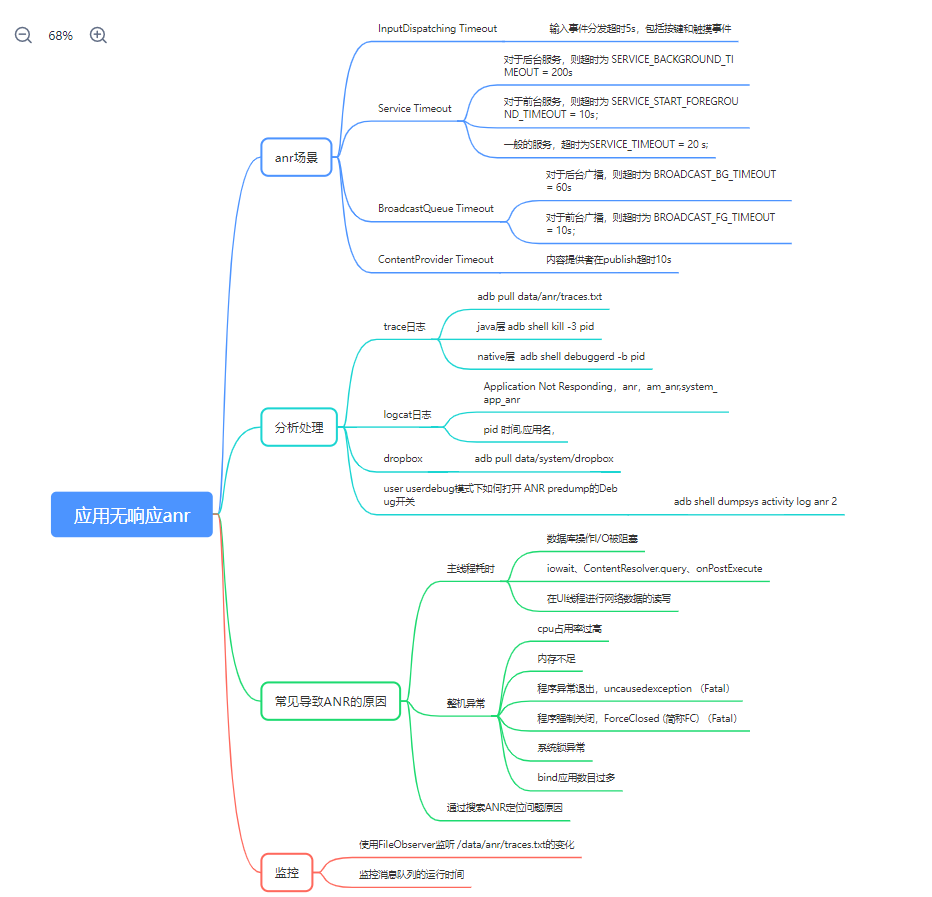

# P27: 系统开发之anr


---

[跳转到readme](https://github.com/hfreeman2008/android_core_framework/blob/main/README-CN.md)

---

[<font face='黑体' color=#ff0000 size=40 >跳转到文章结尾</font>](#结束语)

---

[上一篇文章 P26_系统开发之系统属性](https://github.com/hfreeman2008/android_core_framework/blob/main/P26_%E7%B3%BB%E7%BB%9F%E5%BC%80%E5%8F%91%E4%B9%8B%E7%B3%BB%E7%BB%9F%E5%B1%9E%E6%80%A7/%E7%B3%BB%E7%BB%9F%E5%BC%80%E5%8F%91%E4%B9%8B%E7%B3%BB%E7%BB%9F%E5%B1%9E%E6%80%A7.md)


[下一篇文章 P28: 系统开发之Sensor](https://github.com/hfreeman2008/android_core_framework/blob/main/P28_%E7%B3%BB%E7%BB%9F%E5%BC%80%E5%8F%91%E4%B9%8BSensor/%E7%B3%BB%E7%BB%9F%E5%BC%80%E5%8F%91%E4%B9%8BSensor.md)

---

# ANR

ANR(application not response)，应用无响应。

整个ANR机制是横跨几个层：
- App层：
应用主线程的处理逻辑；

- Framework层：
主要有AMS、BroadcastQueue、ActiveServices、InputmanagerService、InputMonitor、InputChannel、ProcessCpuTracker等；

- Native层：
InputDispatcher.cpp；

---

# anr脑图




---


# 哪些场景会造成ANR：


- Service Timeout:

比如前台服务在20s内未执行完成，后台服务200s未执行完成；

对于前台服务，则超时为 SERVICE_TIMEOUT = 20s；

对于后台服务，则超时为 SERVICE_BACKGROUND_TIMEOUT = 200s

logcat日志关键字：Timeout executing service

- BroadcastQueue Timeout：

比如前台广播在10s内未执行完成，后台广播在60s内未执行完成

对于前台广播，则超时为 BROADCAST_FG_TIMEOUT = 10s；

对于后台广播，则超时为 BROADCAST_BG_TIMEOUT = 60s;

logcat日志关键字：Timeout of broadcast BroadcastRecord

- ContentProvider Timeout：

内容提供者,在publish过超时10s;

ContentProvider超时为 CONTENT_PROVIDER_PUBLISH_TIMEOUT = 10s;

logcat日志关键字：timeout publishing content providers

- InputDispatching Timeout: 

输入事件分发超时5s，包括按键和触摸事件。

logcat日志关键字：Input event dispatching timed out


---

# service超时导致anr

Service Timeout是位于”ActivityManager”线程中的AMS.MainHandler收到 SERVICE_TIMEOUT_MSG 消息时触发。

```java
/frameworks/base/services/core/java/com/android/server/am/ActivityManagerService.java
static final int SERVICE_TIMEOUT_MSG = 12;
```


对于Service:
- 对于前台服务，则超时为 SERVICE_START_FOREGROUND_TIMEOUT = 10s；
- 一般的服务，超时为SERVICE_TIMEOUT = 20 s;
- 对于后台服务，则超时为 SERVICE_BACKGROUND_TIMEOUT = 200s

```java
frameworks/base/services/core/java/com/android/server/am/ActiveServices.java
// How long we wait for a service to finish executing.
static final int SERVICE_TIMEOUT = 20*1000;

// How long we wait for a service to finish executing.
static final int SERVICE_BACKGROUND_TIMEOUT = SERVICE_TIMEOUT * 10;

// How long the startForegroundService() grace period is to get around to
// calling startForeground() before we ANR + stop it.
static final int SERVICE_START_FOREGROUND_TIMEOUT = 10*1000;
```


---

## 埋炸弹

ActiveServices#scheduleServiceTimeoutLocked

发送引爆消息SERVICE_TIMEOUT_MSG：

frameworks\base\services\core\java\com\android\server\am\ActiveServices.java 

```java
/**
 * Note the name of this method should not be confused with the started services concept.
 * The "start" here means bring up the instance in the client, and this method is called
 * from bindService() as well.
 */
private final void realStartServiceLocked(ServiceRecord r,
        ProcessRecord app, boolean execInFg) throws RemoteException {
    .......
    r.setProcess(app);
    r.restartTime = r.lastActivity = SystemClock.uptimeMillis();
    final boolean newService = app.startService(r);
    //发送delay消息(SERVICE_TIMEOUT_MSG)
    bumpServiceExecutingLocked(r, execInFg, "create");
    ......
    //最终执行服务的onCreate()方法
    app.thread.scheduleCreateService(r, r.serviceInfo,
        mAm.compatibilityInfoForPackage(r.serviceInfo.applicationInfo),
        app.getReportedProcState());
    ......
}
```

```java
private final void bumpServiceExecutingLocked(ServiceRecord r, boolean fg, String why) {
    ... 
    scheduleServiceTimeoutLocked(r.app);
}
```

```java
void scheduleServiceTimeoutLocked(ProcessRecord proc) {
    if (proc.executingServices.size() == 0 || proc.thread == null) {
        return;
    }
    Message msg = mAm.mHandler.obtainMessage(
            ActivityManagerService.SERVICE_TIMEOUT_MSG);
    msg.obj = proc;
    //当超时后仍没有remove该SERVICE_TIMEOUT_MSG消息，则执行service Timeout流程
    mAm.mHandler.sendMessageDelayed(msg,
            proc.execServicesFg ? SERVICE_TIMEOUT : SERVICE_BACKGROUND_TIMEOUT);
}
```


## 拆炸弹

在system_server进程AS.realStartServiceLocked()调用的过程会埋下一颗炸弹, 超时没有启动完成则会爆炸. 那么什么时候会拆除这颗炸弹的引线呢? 经过Binder等层层调用进入目标进程的主线程handleCreateService()的过程.

(1)ActivityThread.handleCreateService

frameworks\base\core\java\android\app\ActivityThread.java

```java
private void handleCreateService(CreateServiceData data) {
        ...
        java.lang.ClassLoader cl = packageInfo.getClassLoader();
        Service service = (Service) cl.loadClass(data.info.name).newInstance();
        ...

        try {
            //创建ContextImpl对象
            ContextImpl context = ContextImpl.createAppContext(this, packageInfo);
            context.setOuterContext(service);
            //创建Application对象
            Application app = packageInfo.makeApplication(false, mInstrumentation);
            service.attach(context, this, data.info.name, data.token, app,
                    ActivityManagerNative.getDefault());
            //调用服务onCreate()方法 
            service.onCreate();
            //拆除炸弹引线
            ActivityManagerNative.getDefault().serviceDoneExecuting(
                    data.token, SERVICE_DONE_EXECUTING_ANON, 0, 0);
        } 
    }
```

(2)ActiveServices.serviceDoneExecutingLocked

该方法的主要工作是当service启动完成，则移除服务超时消息SERVICE_TIMEOUT_MSG:

frameworks\base\services\core\java\com\android\server\am\ActiveServices.java

```java
private void serviceDoneExecutingLocked(ServiceRecord r, boolean inDestroying,
            boolean finishing) {
    ......
    r.executeNesting--;
    if (r.executeNesting <= 0) {
    ......
    r.app.executingServices.remove(r);
    if (r.app.executingServices.size() == 0) {
        //拆炸弹:当前服务所在进程中没有正在执行的service,移除SERVICE_TIMEOUT_MSG消息
        mAm.mHandler.removeMessages(ActivityManagerService.SERVICE_TIMEOUT_MSG, r.app);
```

## 引爆炸弹
在system_server进程中有一个Handler线程, 名叫”ActivityManager”.当倒计时结束便会向该Handler线程发送 一条信息SERVICE_TIMEOUT_MSG,

ActivityManagerService#MainHandler

接收引爆消息SERVICE_TIMEOUT_MSG：

frameworks\base\services\core\java\com\android\server\am\ActivityManagerService.java

```java
final class MainHandler extends Handler {
   ......
    @Override
    public void handleMessage(Message msg) {
        switch (msg.what) {
        case SERVICE_TIMEOUT_MSG: {
            mServices.serviceTimeout((ProcessRecord)msg.obj);
        } break;
```

ActiveServices#serviceTimeout

frameworks\base\services\core\java\com\android\server\am\ActiveServices.java

```java
void serviceTimeout(ProcessRecord proc) {
    String anrMessage = null;
    synchronized(mAm) {
        ......
        if (proc.executingServices.size() == 0 || proc.thread == null) {
            return;
        }
        final long now = SystemClock.uptimeMillis();
        final long maxTime =  now -
                (proc.execServicesFg ? SERVICE_TIMEOUT : SERVICE_BACKGROUND_TIMEOUT);
        ServiceRecord timeout = null;
        long nextTime = 0;
        for (int i=proc.executingServices.size()-1; i>=0; i--) {
            ServiceRecord sr = proc.executingServices.valueAt(i);
            if (sr.executingStart < maxTime) {
                timeout = sr;
                break;
            }
            if (sr.executingStart > nextTime) {
                nextTime = sr.executingStart;
            }
        }
        if (timeout != null && mAm.mProcessList.mLruProcesses.contains(proc)) {
            Slog.w(TAG, "Timeout executing service: " + timeout);
            StringWriter sw = new StringWriter();
            PrintWriter pw = new FastPrintWriter(sw, false, 1024);
            pw.println(timeout);
            timeout.dump(pw, "    ");
            pw.close();
            mLastAnrDump = sw.toString();
            mAm.mHandler.removeCallbacks(mLastAnrDumpClearer);
            mAm.mHandler.postDelayed(mLastAnrDumpClearer, LAST_ANR_LIFETIME_DURATION_MSECS);
            anrMessage = "executing service " + timeout.shortInstanceName;
        } else {
            Message msg = mAm.mHandler.obtainMessage(
                    ActivityManagerService.SERVICE_TIMEOUT_MSG);
            msg.obj = proc;
            //再次发SERVICE_TIMEOUT_MSG
            mAm.mHandler.sendMessageAtTime(msg, proc.execServicesFg
                    ? (nextTime+SERVICE_TIMEOUT) : (nextTime + SERVICE_BACKGROUND_TIMEOUT));
        }
    }
    if (anrMessage != null) {
        //显示anr对话框
        mAm.mAnrHelper.appNotResponding(proc, anrMessage);
    }
}
```

## Service启动流程：


---

# BroadcastReceiver超时导致anr

BroadcastReceiver Timeout是位于”ActivityManager”线程中的BroadcastQueue.BroadcastHandler收到 BROADCAST_TIMEOUT_MSG 消息时触发。

frameworks/base/services/core/java/com/android/server/am/BroadcastQueue.java

```java
static final int BROADCAST_TIMEOUT_MSG = ActivityManagerService.FIRST_BROADCAST_QUEUE_MSG + 1;
```

对于广播队列有两个: foreground队列和background队列:
- 对于前台广播，则超时为 BROADCAST_FG_TIMEOUT = 10s；
- 对于后台广播，则超时为 BROADCAST_BG_TIMEOUT = 60s

frameworks/base/services/core/java/com/android/server/am/ActivityManagerService.java

```java
static final int BROADCAST_FG_TIMEOUT = 10*1000;
static final int BROADCAST_BG_TIMEOUT = 60*1000;
```

## 埋炸弹
frameworks\base\services\core\java\com\android\server\am\BroadcastQueue.java

BroadcastQueue#processNextBroadcast

```java
final void processNextBroadcast(boolean fromMsg) {
    synchronized(mService) {
        ...
        //part 2: 处理当前有序广播
        do {
            r = mOrderedBroadcasts.get(0);
            //获取所有该广播所有的接收者
            int numReceivers = (r.receivers != null) ? r.receivers.size() : 0;
            if (mService.mProcessesReady && r.dispatchTime > 0) {
                long now = SystemClock.uptimeMillis();
                if ((numReceivers > 0) &&
                        (now > r.dispatchTime + (2*mTimeoutPeriod*numReceivers))) {
                    //当广播处理时间超时，则强制结束这条广播
                    broadcastTimeoutLocked(false);
                    ...
                }
            }
            if (r.receivers == null || r.nextReceiver >= numReceivers
                    || r.resultAbort || forceReceive) {
                if (r.resultTo != null) {
                    //处理广播消息消息
                    performReceiveLocked(r.callerApp, r.resultTo,
                        new Intent(r.intent), r.resultCode,
                        r.resultData, r.resultExtras, false, false, r.userId);
                    r.resultTo = null;
                }
                //拆炸弹
                cancelBroadcastTimeoutLocked();
            }
        } while (r == null);
        ...

        //part 3: 获取下条有序广播
        r.receiverTime = SystemClock.uptimeMillis();
        if (!mPendingBroadcastTimeoutMessage) {
            long timeoutTime = r.receiverTime + mTimeoutPeriod;
            //埋炸弹
            setBroadcastTimeoutLocked(timeoutTime);
        }
        ...
    }
}
```
BroadcastQueue#setBroadcastTimeoutLocked


```java
final void setBroadcastTimeoutLocked(long timeoutTime) {
    if (! mPendingBroadcastTimeoutMessage) {
        //发送消息BROADCAST_TIMEOUT_MSG，埋下炸弹
        Message msg = mHandler.obtainMessage(BROADCAST_TIMEOUT_MSG, this);
        mHandler.sendMessageAtTime(msg, timeoutTime);
        mPendingBroadcastTimeoutMessage = true;
    }
}
```


## 拆炸弹
frameworks\base\services\core\java\com\android\server\am\BroadcastQueue.java
BroadcastQueue#processNextBroadcast

```java
final void processNextBroadcast(boolean fromMsg) {
    synchronized (mService) {
        processNextBroadcastLocked(fromMsg, false);
    }
}

final void processNextBroadcastLocked(boolean fromMsg, boolean skipOomAdj) {  
    ......
    if (DEBUG_BROADCAST) Slog.v(TAG_BROADCAST, "Cancelling BROADCAST_TIMEOUT_MSG");
    cancelBroadcastTimeoutLocked();
    ......
}
```
BroadcastQueue#cancelBroadcastTimeoutLocked

```java
final void cancelBroadcastTimeoutLocked() {
    if (mPendingBroadcastTimeoutMessage) {
        //移除消息BROADCAST_TIMEOUT_MSG
        mHandler.removeMessages(BROADCAST_TIMEOUT_MSG, this);
        mPendingBroadcastTimeoutMessage = false;
    }
}
```

## 引爆炸弹
frameworks\base\services\core\java\com\android\server\am\BroadcastQueue.java

BroadcastQueue#BroadcastHandler

```java
private final class BroadcastHandler extends Handler {
    @Override
    public void handleMessage(Message msg) {
        switch (msg.what) {
            case BROADCAST_TIMEOUT_MSG: {
                synchronized (mService) {
                    //响应消息BROADCAST_TIMEOUT_MSG
                    broadcastTimeoutLocked(true);
                }
            } break;
        }
    }
}
```
BroadcastQueue#broadcastTimeoutLocked

```java
final void broadcastTimeoutLocked(boolean fromMsg) {
    if (fromMsg) {
        mPendingBroadcastTimeoutMessage = false;
    }
    if (mDispatcher.isEmpty() || mDispatcher.getActiveBroadcastLocked() == null) {
        return;
    }
    long now = SystemClock.uptimeMillis();
    BroadcastRecord r = mDispatcher.getActiveBroadcastLocked();
    if (fromMsg) {
        if (!mService.mProcessesReady) {
            // Only process broadcast timeouts if the system is ready; some early
            // broadcasts do heavy work setting up system facilities
            return;//当系统还没有准备就绪时，广播处理流程中不存在广播超时
        }
        // If the broadcast is generally exempt from timeout tracking, we're done
        if (r.timeoutExempt) {
            if (DEBUG_BROADCAST) {
                Slog.i(TAG_BROADCAST, "Broadcast timeout but it's exempt: "
                        + r.intent.getAction());
            }
            return;
        }
        long timeoutTime = r.receiverTime + mConstants.TIMEOUT;
        if (timeoutTime > now) {
            //如果当前正在执行的receiver没有超时，则重新设置广播超时
            setBroadcastTimeoutLocked(timeoutTime);
            return;
        }
    }
    if (r.state == BroadcastRecord.WAITING_SERVICES) {
        //广播已经处理完成，但需要等待已启动service执行完成。当等待足够时间，
        //则处理下一条广播。
        r.curComponent = null;
        r.state = BroadcastRecord.IDLE;
        processNextBroadcast(false);
        return;
    }
    final boolean debugging = (r.curApp != null && r.curApp.isDebugging());
    r.receiverTime = now;
    if (!debugging) {
        //当前BroadcastRecord的anr次数执行加1操作
        r.anrCount++;
    }
    ProcessRecord app = null;
    String anrMessage = null;
    Object curReceiver;
    if (r.nextReceiver > 0) {
        curReceiver = r.receivers.get(r.nextReceiver-1);
        r.delivery[r.nextReceiver-1] = BroadcastRecord.DELIVERY_TIMEOUT;
    } else {
        curReceiver = r.curReceiver;
    }
    logBroadcastReceiverDiscardLocked(r);
    //查询App进程
    if (curReceiver != null && curReceiver instanceof BroadcastFilter) {
        BroadcastFilter bf = (BroadcastFilter)curReceiver;
        if (bf.receiverList.pid != 0
                && bf.receiverList.pid != ActivityManagerService.MY_PID) {
            synchronized (mService.mPidsSelfLocked) {
                app = mService.mPidsSelfLocked.get(
                        bf.receiverList.pid);
            }
        }
    } else {
        app = r.curApp;
    }
    if (app != null) {
        anrMessage = "Broadcast of " + r.intent.toString();
    }
    if (mPendingBroadcast == r) {
        mPendingBroadcast = null;
    }
    // Move on to the next receiver.
    //继续移动到下一个广播接收者
    finishReceiverLocked(r, r.resultCode, r.resultData,
            r.resultExtras, r.resultAbort, false);
    scheduleBroadcastsLocked();
    if (!debugging && anrMessage != null) {
        //显示anr对话框
        mService.mAnrHelper.appNotResponding(app, anrMessage);
    }
}
```

---

# ContentProvider超时导致anr

ContentProvider Timeout是位于”ActivityManager”线程中的AMS.MainHandler收到 CONTENT_PROVIDER_PUBLISH_TIMEOUT_MSG 消息时触发。

frameworks/base/services/core/java/com/android/server/am/ActivityManagerService.java

```java
static final int CONTENT_PROVIDER_PUBLISH_TIMEOUT_MSG = 57;
```
ContentProvider 超时为 CONTENT_PROVIDER_PUBLISH_TIMEOUT = 10s. 这个跟前面的Service和BroadcastQueue完全不同, 由Provider进程启动过程相关.

frameworks/base/services/core/java/com/android/server/am/ActivityManagerService.java

```java
static final int CONTENT_PROVIDER_PUBLISH_TIMEOUT = 10*1000;
```

## 埋炸弹
frameworks\base\services\core\java\com\android\server\am\ActivityManagerService.java

ActivityManagerService#attachApplicationLocked

```java
private boolean attachApplicationLocked(@NonNull IApplicationThread thread,
            int pid, int callingUid, long startSeq) {
    ProcessRecord app;
    long startTime = SystemClock.uptimeMillis();
    long bindApplicationTimeMillis;
    if (pid != MY_PID && pid >= 0) {
        synchronized (mPidsSelfLocked) {
            app = mPidsSelfLocked.get(pid);
        }
    ......
    if (providers != null && checkAppInLaunchingProvidersLocked(app)) {
        //发送消息CONTENT_PROVIDER_PUBLISH_TIMEOUT_MSG，埋下炸弹
        Message msg = mHandler.obtainMessage(CONTENT_PROVIDER_PUBLISH_TIMEOUT_MSG);
        msg.obj = app;
        mHandler.sendMessageDelayed(msg,
                ContentResolver.CONTENT_PROVIDER_PUBLISH_TIMEOUT_MILLIS);
    }
    ......
}
```

## 拆炸弹
当provider成功publish之后,便会拆除该炸弹

frameworks\base\services\core\java\com\android\server\am\ActivityManagerService.java
ActivityManagerService#publishContentProviders

```java
public final void publishContentProviders(IApplicationThread caller,
            List<ContentProviderHolder> providers) {
    ......
    final int N = providers.size();
    for (int i = 0; i < N; i++) {
        ContentProviderHolder src = providers.get(i);
        if (src == null || src.info == null || src.provider == null) {
            continue;
        }
        ContentProviderRecord dst = r.pubProviders.get(src.info.name);
        if (dst != null) {
            ComponentName comp = new ComponentName(dst.info.packageName, dst.info.name);
            mProviderMap.putProviderByClass(comp, dst);
            String names[] = dst.info.authority.split(";");
            for (int j = 0; j < names.length; j++) {
                mProviderMap.putProviderByName(names[j], dst);
            }
            int launchingCount = mLaunchingProviders.size();
            int j;
            boolean wasInLaunchingProviders = false;
            for (j = 0; j < launchingCount; j++) {
                if (mLaunchingProviders.get(j) == dst) {
                    //将该provider移除mLaunchingProviders队列
                    mLaunchingProviders.remove(j);
                    wasInLaunchingProviders = true;
                    j--;
                    launchingCount--;
                }
            }
    ......
    //移除消息CONTENT_PROVIDER_PUBLISH_TIMEOUT_MSG
    if (wasInLaunchingProviders) {
        mHandler.removeMessages(CONTENT_PROVIDER_PUBLISH_TIMEOUT_MSG, r);
    }
    ......
    synchronized (dst) {
        dst.provider = src.provider;
        dst.setProcess(r);
        /唤醒客户端的wait等待方法
        dst.notifyAll();
    }
}
```

## 引爆炸弹
在system_server进程中有一个Handler线程, 名叫”ActivityManager”.当倒计时结束便会向该Handler线程发送 一条信息CONTENT_PROVIDER_PUBLISH_TIMEOUT_MSG,

frameworks\base\services\core\java\com\android\server\am\ActivityManagerService.java

ActivityManagerService#MainHandler

```java
final class MainHandler extends Handler {
    ......
    //收到消息CONTENT_PROVIDER_PUBLISH_TIMEOUT_MSG
    case CONTENT_PROVIDER_PUBLISH_TIMEOUT_MSG: {
        ProcessRecord app = (ProcessRecord)msg.obj;
        synchronized (ActivityManagerService.this) {
            processContentProviderPublishTimedOutLocked(app);
        }
    } break;
}
```


```java
private final void processContentProviderPublishTimedOutLocked(ProcessRecord app) {
    cleanupAppInLaunchingProvidersLocked(app, true);
    mProcessList.removeProcessLocked(app, false, true,
            ApplicationExitInfo.REASON_INITIALIZATION_FAILURE,
            ApplicationExitInfo.SUBREASON_UNKNOWN,
            "timeout publishing content providers");
}
```


```java
    boolean cleanupAppInLaunchingProvidersLocked(ProcessRecord app, boolean alwaysBad) {
        // Look through the content providers we are waiting to have launched,
        // and if any run in this process then either schedule a restart of
        // the process or kill the client waiting for it if this process has
        // gone bad.
        boolean restart = false;
        for (int i = mLaunchingProviders.size() - 1; i >= 0; i--) {
            ContentProviderRecord cpr = mLaunchingProviders.get(i);
            if (cpr.launchingApp == app) {
                if (++cpr.mRestartCount > ContentProviderRecord.MAX_RETRY_COUNT) {
                    // It's being launched but we've reached maximum attempts, mark it as bad
                    alwaysBad = true;
                }
                if (!alwaysBad && !app.bad && cpr.hasConnectionOrHandle()) {
                    restart = true;
                } else {
                    //移除死亡的provider
                    removeDyingProviderLocked(app, cpr, true);
                }
            }
        }
        return restart;
    }
```

---

# key事件分发超时导致anr


frameworks\base\services\core\java\com\android\server\wm\ActivityTaskManagerService.java

```java
    // How long we wait until we timeout on key dispatching.
    public static final int KEY_DISPATCHING_TIMEOUT_MS = 5 * 1000;
    // How long we wait until we timeout on key dispatching during instrumentation.
    static final int INSTRUMENTATION_KEY_DISPATCHING_TIMEOUT_MS = 60 * 1000;
```

```java
frameworks/native/services/inputflinger/InputDispatcher.cpp
constexpr nsecs_t DEFAULT_INPUT_DISPATCHING_TIMEOUT = 5000 * 1000000LL; // 5 sec

frameworks/base/services/core/java/com/android/server/wm/WindowManagerService.java
static final long DEFAULT_INPUT_DISPATCHING_TIMEOUT_NANOS = 5000 * 1000000L;
```

## 输入事件流程：


## ANR处理流程

ANR时间区间：

当前这次的事件dispatch过程中执行findFocusedWindowTargetsLocked()方法到下一次执行resetANRTimeoutsLocked()的时间区间. 


以下5个时机会reset. 都位于InputDispatcher.cpp文件
- resetAndDropEverythingLocked
- releasePendingEventLocked
- setFocusedApplication
- dispatchOnceInnerLocked
- setInputDispatchMode

简单来说, 主要是以下4个场景,会有机会执行resetANRTimeoutsLocked:
- 解冻屏幕, 系统开/关机的时刻点 (thawInputDispatchingLw, setEventDispatchingLw)
- wms聚焦app的改变 (WMS.setFocusedApp, WMS.removeAppToken)
- 设置input filter的过程 (IMS.setInputFilter)
- 再次分发事件的过程(dispatchOnceInnerLocked)

当InputDispatcher线程 findFocusedWindowTargetsLocked()过程调用到handleTargetsNotReadyLocked，且满足超时5s的情况则会调用onANRLocked().


## 输入事件的发送和接收主要流程：


## 按键事件超时监测整体流程：


## java层事件分发显示anr对话框流程

```java
AnrHelper.startAnrConsumerIfNeeded(AnrHelper.java)
AnrHelper.appNotResponding(AnrHelper.java)
ActivityManagerService.inputDispatchingTimedOut
ActivityManagerService$LocalService.inputDispatchingTimedOut
ActivityRecord.keyDispatchingTimedOut(ActivityRecord.java)
InputManagerCallback.notifyANRInner(InputManagerCallback.java)
InputManagerCallback.notifyANR(InputManagerCallback.java)
InputManagerService.notifyANR(InputManagerService.java)
```


## 引爆炸弹

frameworks\native\services\inputflinger\dispatcher\InputDispatcher.cpp

```java
void InputDispatcher::doNotifyAnrLockedInterruptible(CommandEntry* commandEntry) {
    sp<IBinder> token =
            commandEntry->inputChannel ? commandEntry->inputChannel->getConnectionToken() : nullptr;
    mLock.unlock();
    const nsecs_t timeoutExtension =
            //调用java层的native notifyAnr方法
            mPolicy->notifyAnr(commandEntry->inputApplicationHandle, token, commandEntry->reason);
    mLock.lock();
    if (timeoutExtension > 0) {
        extendAnrTimeoutsLocked(commandEntry->inputApplicationHandle, token, timeoutExtension);
    } else {
        // stop waking up for events in this connection, it is already not responding
        sp<Connection> connection = getConnectionLocked(token);
        if (connection == nullptr) {
            return;
        }
        cancelEventsForAnrLocked(connection);
    }
}
```

---

# anr对话框显示流程

显示anr对话框的UI


frameworks/base/services/core/java/com/android/server/am/AppNotRespondingDialog.java

anr对话框显示调用流程：
```java
AppNotRespondingDialog.<init>(AppNotRespondingDialog.java)
ProcessRecord$ErrorDialogController.showAnrDialogs
AppErrors.handleShowAnrUi(AppErrors.java)
ActivityManagerService$UiHandler.handleMessage
```

ActivityManagerService.java
```java
    //定义显示anr的消息
    static final int SHOW_NOT_RESPONDING_UI_MSG = 2;
    
    final class UiHandler extends Handler {
        @Override
        public void handleMessage(Message msg) {
            switch (msg.what) {
                //这个是显示anr对话框的消息
                case SHOW_NOT_RESPONDING_UI_MSG: {
                    mAppErrors.handleShowAnrUi(msg);
                    ensureBootCompleted();
```
frameworks\base\services\core\java\com\android\server\am\ProcessRecord.java

发送anr的消息：

```java
    if (mService.mUiHandler != null) {
        // Bring up the infamous App Not Responding dialog
        Message msg = Message.obtain();
        //发送anr的消息
        msg.what = ActivityManagerService.SHOW_NOT_RESPONDING_UI_MSG;
        msg.obj = new AppNotRespondingDialog.Data(this, aInfo, aboveSystem);
        mService.mUiHandler.sendMessage(msg);
    }
```

发送anr的消息的调用流程：

```java
ProcessRecord.appNotResponding(ProcessRecord.java)
AnrHelper$AnrRecord.appNotResponding(AnrHelper.java)
AnrHelper$AnrConsumerThread.run(AnrHelper.java)
```

AnrHelper.java
```java
    private void startAnrConsumerIfNeeded() {
        if (mRunning.compareAndSet(false, true)) {
            //启动AnrConsumerThread线程
            new AnrConsumerThread().start();
        }
    }
```
事件分发显示anr对话框流程

```java
AnrHelper.startAnrConsumerIfNeeded(AnrHelper.java)
AnrHelper.appNotResponding(AnrHelper.java)
ActivityManagerService.inputDispatchingTimedOut
ActivityManagerService$LocalService.inputDispatchingTimedOut
ActivityRecord.keyDispatchingTimedOut(ActivityRecord.java)
InputManagerCallback.notifyANRInner(InputManagerCallback.java)
InputManagerCallback.notifyANR(InputManagerCallback.java)
InputManagerService.notifyANR(InputManagerService.java)
```

InputManagerService.java

InputManagerService#notifyANR是一个native方法：

```java
// Native callback.
private long notifyANR(InputApplicationHandle inputApplicationHandle, IBinder token,
        String reason) {
    return mWindowManagerCallbacks.notifyANR(inputApplicationHandle,
            token, reason);
}
```

frameworks\native\services\inputflinger\dispatcher\InputDispatcher.cpp

```cpp
void InputDispatcher::doNotifyAnrLockedInterruptible(CommandEntry* commandEntry) {
    sp<IBinder> token =
            commandEntry->inputChannel ? commandEntry->inputChannel->getConnectionToken() : nullptr;
    mLock.unlock();
    const nsecs_t timeoutExtension =
            //调用java层的native notifyAnr方法
            mPolicy->notifyAnr(commandEntry->inputApplicationHandle, token, commandEntry->reason);
    mLock.lock();
    if (timeoutExtension > 0) {
        extendAnrTimeoutsLocked(commandEntry->inputApplicationHandle, token, timeoutExtension);
    } else {
        // stop waking up for events in this connection, it is already not responding
        sp<Connection> connection = getConnectionLocked(token);
        if (connection == nullptr) {
            return;
        }
        cancelEventsForAnrLocked(connection);
    }
}
```
libinputflinger的调用流程：
```java
/system/lib64/libinputflinger.so 
(InputDispatcher::doNotifyAnrLockedInterruptible(CommandEntry*))
(InputDispatcher::runCommandsLockedInterruptible())
(InputDispatcher::dispatchOnce())

/system/lib64/libinputflinger_base.so 
(InputThreadImpl::threadLoop())
```

---

# 关键字


```java
anr
application is not responding
system_app_anr
am_anr
Suspended，Blocked，MONITOR
block|monit|susp
```

---

# anr trance日志内容

anr_*.txt （data/anr/anr_2024-12-06-10-47-55-974）

frameworks\base\services\core\java\com\android\server\am\ActivityManagerService.java

```java
@GuardedBy("ActivityManagerService.class")
private static SimpleDateFormat sAnrFileDateFormat;
static final String ANR_FILE_PREFIX = "anr_";
private static synchronized File createAnrDumpFile(File tracesDir) throws IOException {
    if (sAnrFileDateFormat == null) {
        sAnrFileDateFormat = new SimpleDateFormat("yyyy-MM-dd-HH-mm-ss-SSS");
    }
    final String formattedDate = sAnrFileDateFormat.format(new Date());
    final File anrFile = new File(tracesDir, ANR_FILE_PREFIX + formattedDate);
    if (anrFile.createNewFile()) {
        FileUtils.setPermissions(anrFile.getAbsolutePath(), 0600, -1, -1); // -rw-------
        return anrFile;
    } else {
        throw new IOException("Unable to create ANR dump file: createNewFile failed");
    }
}
```

frameworks\native\cmds\dumpstate\dumpstate.cpp

```cpp
static const std::string ANR_DIR = "/data/anr/";
static const std::string ANR_FILE_PREFIX = "anr_";
```

frameworks\base\services\core\java\com\android\server\am\ActivityManagerService.java

ActivityManagerService#dumpStackTraces：

```java
// We'll take the stack crawls of just the top apps using CPU.
final int N = processCpuTracker.countWorkingStats();
//extraPids队列信息
extraPids = new ArrayList<>();
for (int i = 0; i < N && extraPids.size() < 5; i++) {
    ProcessCpuTracker.Stats stats = processCpuTracker.getWorkingStats(i);
    if (lastPids.indexOfKey(stats.pid) >= 0) {
        if (DEBUG_ANR) Slog.d(TAG, "Collecting stacks for extra pid " + stats.pid);
        extraPids.add(stats.pid);
    } else {
        Slog.i(TAG, "Skipping next CPU consuming process, not a java proc: "
                + stats.pid);
    }
}
......
//创建anr dump文件
tracesFile = createAnrDumpFile(tracesDir);
......
Pair<Long, Long> offsets = dumpStackTraces(
    tracesFile.getAbsolutePath(), firstPids, nativePids, extraPids);
```

ANR输出重要进程的traces信息，这些进程包含:

- firstPids队列：第一个是ANR进程，第二个是system_server，剩余是所有persistent进程；
- Native队列：是指/system/bin/目录的mediaserver,sdcard 以及surfaceflinger进程；
- extraPids队列: 是指processCpuTracker.getWorkingStats信息队列；

```java
    /**
     * @return The start/end offset of the trace of the very first PID
     */
    public static Pair<Long, Long> dumpStackTraces(String tracesFile, ArrayList<Integer> firstPids,
            ArrayList<Integer> nativePids, ArrayList<Integer> extraPids) {
        Slog.i(TAG, "Dumping to " + tracesFile);
        long remainingTime = 20 * 1000;
        long firstPidStart = -1;
        long firstPidEnd = -1;
        //第一步，先收集最重要的pid进程的stack信息
        // First collect all of the stacks of the most important pids.
        if (firstPids != null) {
            int num = firstPids.size();
            for (int i = 0; i < num; i++) {
                final int pid = firstPids.get(i);
                // We don't copy ANR traces from the system_server intentionally.
                final boolean firstPid = i == 0 && MY_PID != pid;
                File tf = null;
                if (firstPid) {
                    tf = new File(tracesFile);
                    firstPidStart = tf.exists() ? tf.length() : 0;
                }
                Slog.i(TAG, "Collecting stacks for pid " + pid);
                final long timeTaken = dumpJavaTracesTombstoned(pid, tracesFile,
                                                                remainingTime);
                remainingTime -= timeTaken;
                if (remainingTime <= 0) {
                    Slog.e(TAG, "Aborting stack trace dump (current firstPid=" + pid
                            + "); deadline exceeded.");
                    return firstPidStart >= 0 ? new Pair<>(firstPidStart, firstPidEnd) : null;
                }
                if (firstPid) {
                    firstPidEnd = tf.length();
                }
                if (DEBUG_ANR) {
                    Slog.d(TAG, "Done with pid " + firstPids.get(i) + " in " + timeTaken + "ms");
                }
            }
        }
        //第二步，收集native的pid进程的stack信息
        // Next collect the stacks of the native pids
        if (nativePids != null) {
            for (int pid : nativePids) {
                Slog.i(TAG, "Collecting stacks for native pid " + pid);
                final long nativeDumpTimeoutMs = Math.min(NATIVE_DUMP_TIMEOUT_MS, remainingTime);
                final long start = SystemClock.elapsedRealtime();
                Debug.dumpNativeBacktraceToFileTimeout(
                        pid, tracesFile, (int) (nativeDumpTimeoutMs / 1000));
                final long timeTaken = SystemClock.elapsedRealtime() - start;
                remainingTime -= timeTaken;
                if (remainingTime <= 0) {
                    Slog.e(TAG, "Aborting stack trace dump (current native pid=" + pid +
                        "); deadline exceeded.");
                    return firstPidStart >= 0 ? new Pair<>(firstPidStart, firstPidEnd) : null;
                }
                if (DEBUG_ANR) {
                    Slog.d(TAG, "Done with native pid " + pid + " in " + timeTaken + "ms");
                }
            }
        }
        //第三步，收集额外的来自己cpu追踪器的pid进程的stack信息
        // Lastly, dump stacks for all extra PIDs from the CPU tracker.
        if (extraPids != null) {
            for (int pid : extraPids) {
                Slog.i(TAG, "Collecting stacks for extra pid " + pid);
                final long timeTaken = dumpJavaTracesTombstoned(pid, tracesFile, remainingTime);
                remainingTime -= timeTaken;
                if (remainingTime <= 0) {
                    Slog.e(TAG, "Aborting stack trace dump (current extra pid=" + pid +
                            "); deadline exceeded.");
                    return firstPidStart >= 0 ? new Pair<>(firstPidStart, firstPidEnd) : null;
                }
                if (DEBUG_ANR) {
                    Slog.d(TAG, "Done with extra pid " + pid + " in " + timeTaken + "ms");
                }
            }
        }
        Slog.i(TAG, "Done dumping");
        return firstPidStart >= 0 ? new Pair<>(firstPidStart, firstPidEnd) : null;
    }
```

```java
Cmd line: com.example.demoanr2
Cmd line: system_server
   ......
Cmd line: com.android.phone
Cmd line: com.android.se
Cmd line: org.codeaurora.ims

   ......
Cmd line: .qtidataservices
Cmd line: .dataservices
Cmd line: com.android.networkstack.process
Cmd line: com.android.systemui

Cmd line: /vendor/bin/hw/android.hardware.camera.provider@2.4-service_64
Cmd line: /vendor/bin/hw/android.hardware.gnss@1.0-service
Cmd line: /vendor/bin/hw/android.hardware.sensors@2.0-service.multihal
Cmd line: /vendor/bin/hw/android.hardware.audio.service
Cmd line: media.codec
Cmd line: media.swcodec
 

Cmd line: /system/bin/vold
Cmd line: /apex/com.android.os.statsd/bin/statsd
Cmd line: /system/bin/netd


Cmd line: /system/bin/surfaceflinger
Cmd line: /system/bin/cameraserver

Cmd line: media.extractor
Cmd line: media.metrics
Cmd line: /system/bin/mediaserver
Cmd line: media.codec
Cmd line: media.swcodec
```
ActivityManagerService.dumpJavaTracesTombstoned 生成trance日志流程：

```java
Debug.dumpJavaBacktraceToFileTimeout
ActivityManagerService.dumpJavaTracesTombstoned
ActivityManagerService.dumpStackTraces
ActivityManagerService.dumpStackTraces
AnrManagerService$AnrDumpManager.dumpAnrDebugInfoLocked

AnrManagerService$AnrDumpManager.dumpAnrDebugInfo
AnrManagerService.startAnrDump

AnrManagerImpl.startAnrDump
ProcessErrorStateRecord.appNotResponding
AnrHelper$AnrRecord.appNotResponding
AnrHelper$AnrConsumerThread.run
```

---

# trance日志命令生成

进程类型|命令|说明
-|-|-
java|adb shell kill -3 pid | 会生成文件：/data/arn/trace_00,可读性更强
java|adb shell debuggerd -b pid|直接在终端输出,可读性不强
native|adb shell debuggerd -b pid|直接在终端输出,可读性不强

---

# dropbox日志

```java
adb pull data/system/dropbox
data/system/dropbox目录下的system_app_anr@1688888.txt.gz的压缩文件
```

---


# 线程状态：

kernel/thread.h

```java
enum thread_state {
    THREAD_SUSPENDED = 0,
    THREAD_READY,
    THREAD_RUNNING,
    THREAD_BLOCKED,
    THREAD_SLEEPING,
    THREAD_DEATH,
};
```


状态|值 |说明 
-|-|-
THREAD_SUSPENDED|0|暂停
THREAD_READY|1|准备
THREAD_RUNNING|2|线程正在运行或准备运行。
THREAD_BLOCKED|3|线程被阻塞，等待获取一个锁。
THREAD_SLEEPING|4|睡眠
THREAD_DEATH|5|死亡


ThreadState (defined at “dalvik/vm/thread.h “)
```java
THREAD_UNDEFINED = -1, /* makes enum compatible with int32_t */
THREAD_ZOMBIE = 0, /* TERMINATED */
THREAD_RUNNING = 1, /* RUNNABLE or running now */
THREAD_TIMED_WAIT = 2, /* TIMED_WAITING in Object.wait() */
THREAD_MONITOR = 3, /* BLOCKED on a monitor */
THREAD_WAIT = 4, /* WAITING in Object.wait() */
THREAD_INITIALIZING= 5, /* allocated, not yet running */
THREAD_STARTING = 6, /* started, not yet on thread list */
THREAD_NATIVE = 7, /* off in a JNI native method */
THREAD_VMWAIT = 8, /* waiting on a VM resource */
THREAD_SUSPENDED = 9, /* suspended, usually by GC or debugger */
```

|状态|值|说明|说明
-|-|-|- 
THREAD_ZOMBIE| 0|TERMINATED|结束
THREAD_RUNNING| 1|RUNNABLE or running now|正在运行
THREAD_TIMED_WAIT| 2|TIMED_WAITING in Object.wait()|限期等待，处于这种状态的线程也不会被分配CPU执行时间，不过无须等待被其他线程显式地唤醒，在一定时间之后它们会由系统自动唤醒。
THREAD_MONITOR| 3|BLOCKED on a monitor| 阻塞
THREAD_WAIT | 4 | WAITING in Object.wait() | 无限期等待，处于这种状态的线程不会被分配CPU执行时间，它们要等待被其他线程显式地唤醒
THREAD_INITIALIZING | 5 |allocated not yet running | 已分配但尚未运行
THREAD_STARTING | 6 |started not yet on thread list| 启动，但未在线程列表中
THREAD_NATIVE | 7 |off in a JNI native method|在jni原生方法中
THREAD_VMWAIT | 8 | waiting on a VM resource| 等待VM资源
THREAD_SUSPENDED | 9 | suspended usually by GC or debugger| 由gc可debugger导致暂停


Thread.java中定义的状态 | Thread.cpp中定义的状态 | 说明
-|-|-
TERMINATED | ZOMBIE | 线程死亡，终止运行
RUNNABLE | RUNNING/RUNNABLE | 线程可运行或正在运行
TIMED_WAITING | TIMED_WAIT | 执行了带有超时参数的wait、sleep或join函数
BLOCKED | MONITOR | 线程阻塞，等待获取对象锁
WAITING | WAIT | 执行了无超时参数的wait函数
NEW | INITIALIZING | 新建，正在初始化，为其分配资源
NEW | STARTING | 新建，正在启动
RUNNABLE | NATIVE | 正在执行JNI本地函数
WAITING | VMWAIT | 正在等待VM资源
RUNNABLE | SUSPENDED | 线程暂停，通常是由于GC或debug被暂停 
UNKNOWN |UNKNOWN |未知状态

---

# trance日志字段解析

```java
----- pid 27661 at 2017-06-16 16:16:20 -----
Cmd line: com.android.camera
"main" prio=5 tid=1 Waiting
 | group="main" sCount=1 dsCount=0 obj=0x75a4b5c8 self=0xb4cf6500
 | sysTid=27661 nice=-10 cgrp=default sched=0/0 handle=0xb6f6cb34
 | state=S schedstat=( 112155 8689191757 38520 ) utm=895 stm=229 core=0 HZ=100
 | stack=0xbe4ea000-0xbe4ec000 stackSize=8MB
 | held mutexes=
 at java.lang.Object.wait!(Native method)
 - waiting on <0x09e6a059> (a java.lang.Object)
 at java.lang.Thread.parkFor$(Thread.java:1220)
 - locked <0x09e6a059> (a java.lang.Object)
 at sun.misc.Unsafe.park(Unsafe.java:299)
```

解读一下部分字段的含义
字段|含义
-|-
main| 线程名
prio | 线程优先级
tid=1 | 线程号
Waiting | 线程状态
group | 线程组名称
sCount | 此线程被挂起的次数
dsCount | 线程被调试器挂起的次数，当一个进程被调试后，sCount会重置为0，调试完毕后sCount会根据是否被正常挂起增长，但是dsCount不会被重置为0，所以dsCount也可以用来判断这个线程是否被调试过
obj | 线程java对象的地址
self | 线程本身的地址
sysTid=27661 | Linux下的内核线程ID，主线程的线程号和进程号相同
nice | nice值越小，则优先级越高。因为是主线程此处nice=-10, 可以看到优先级很高了
cgrp | 调度数组
sched | 标志了线程的调度策略和优先级
handle | 线程的处理函数地址
state | 调度状态
schedstat | 括号中的3个数字，依次是Running, Runable, Switch。Running时间：CPU运行的时间，单位ns。 　Runable时间：RQ队列的等待时间，单位ns。　　Switch次数：CPU调度切换次数
utm | 该线程在用户态所执行的时间，单位是jiffies
stm | 该线程在内核态所执行的时间，单位是jiffies
core | 最后执行这个线程的cpu核的序号


---

# 加大anr超时时间：

frameworks/base/services/core/java/com/android/server/wm/WindowState.java

```java
public long getInputDispatchingTimeoutNanos() {
    //add start
    if (TextUtils.equals(getOwningPackage(), "com.android.systemui")
            || TextUtils.equals(getOwningPackage(), "com.android.launcher")) {
        return 8000 * 1000000L; // 8s
    }
    //add end
    return mActivityRecord != null
            ? mActivityRecord.mInputDispatchingTimeoutNanos
            : WindowManagerService.DEFAULT_INPUT_DISPATCHING_TIMEOUT_NANOS;
}
```

---

# anr 事件分发应用白名单
此方法有风险，特别是线程block的情况：

frameworks\base\services\core\java\com\android\server\wm\InputManagerCallback.java

```java
//add hexiaoming to avoid anr for launcher 2024_12_6 start
import android.text.TextUtils;
//add hexiaoming to  avoid anr for launcher 2024_12_6 end
......

//add hexiaoming to  avoid anr for launcher 2024_12_6 start
private String[] whitePkgNamelistAnr = {"com.android.launcher", "com.android.launcher3", "com.example.demoanr2"};
//add hexiaoming to  avoid anr for launcher 2024_12_6 end
......
private long notifyANRInner(InputApplicationHandle inputApplicationHandle, IBinder token,
        String reason) {
......
            if (windowState != null) {
                Slog.i(TAG_WM, " notifyANRInner 01 Input event dispatching timed out "
                        + "sending to " + windowState.mAttrs.getTitle()
                        + ".  Reason: " + reason);
                //add hexiaoming to avoid anr for launcher 2024_12_6 start
                boolean isAnrWhitePkg = isWhitePkg(windowState.mAttrs.getTitle().toString());
                Slog.i(TAG_WM, "isAnrWhitePkg :" + isAnrWhitePkg);
                if(isAnrWhitePkg){
                    Slog.i(TAG_WM, "warning!!!!!!!!, to avoid anr error for anr white app :" + windowState.mAttrs.getTitle());
                    return 0; // abort dispatching
                }
                //add hexiaoming to avoid anr for launcher 2024_12_6 end
            } else if (activity != null) {
                Slog.i(TAG_WM, "notifyANRInner 02 Input event dispatching timed out "
                        + "sending to application " + activity.stringName
                        + ".  Reason: " + reason);
                //add hexiaoming to avoid anr for launcher 2024_12_6 start
                boolean isAnrWhitePkg = isWhitePkg(activity.stringName);
                Slog.i(TAG_WM, "isAnrWhitePkg :" + isAnrWhitePkg);
                if(isAnrWhitePkg){
                    Slog.i(TAG_WM, "warning!!!!!!!!, to avoid anr error for anr white app :" + activity.stringName);
                    return 0; // abort dispatching
                }
                //add hexiaoming to avoid anr for launcher 2024_12_6 end
            } else {
                Slog.i(TAG_WM, "hexiaoming notifyANRInner 03 Input event dispatching timed out "
                        + ".  Reason: " + reason);
            }
            mService.saveANRStateLocked(activity, windowState, reason);
            ......
}
......
    //add hexiaoming to avoid anr for launcher 2024_12_6 start
    private boolean isWhitePkg(String pkg) {
        if(TextUtils.isEmpty(pkg)){
            return false;
        }
        if (0 == android.provider.Settings.System.getInt(mService.mContext.getContentResolver(), "enable_anr_white_pkg", 1)) {
            Slog.i(TAG_WM, "warning!!!!!!!!, not enable anr white pkg!");
            return false;
        }
        for(String appName : whitePkgNamelistAnr){
            if(pkg.contains(appName)){
                return true;
            }
        }
        return false;
    }
    //add hexiaoming to avoid anr for launcher 2024_12_6 end
```

anr应用白名单开关：
```java
adb shell settings get system enable_anr_white_pkg
```

---

# 事件分发without focus window导致anr的白名单


frameworks\native\services\inputflinger\dispatcher\InputDispatcher.cpp

```cpp
int32_t InputDispatcher::findFocusedWindowTargetsLocked(nsecs_t currentTime,
                                                        const EventEntry& entry,
                                                        std::vector<InputTarget>& inputTargets,
                                                        nsecs_t* nextWakeupTime) {
    std::string reason;

    int32_t displayId = getTargetDisplayId(entry);
    sp<InputWindowHandle> focusedWindowHandle =
            getValueByKey(mFocusedWindowHandlesByDisplay, displayId);
    sp<InputApplicationHandle> focusedApplicationHandle =
            getValueByKey(mFocusedApplicationHandlesByDisplay, displayId);

    // If there is no currently focused window and no focused application
    // then drop the event.
    if (focusedWindowHandle == nullptr && focusedApplicationHandle == nullptr) {
        ALOGI("Dropping %s event because there is no focused window or focused application in "
              "display %" PRId32 ".",
              EventEntry::typeToString(entry.type), displayId);
        return INPUT_EVENT_INJECTION_FAILED;
    }

    // Compatibility behavior: raise ANR if there is a focused application, but no focused window.
    // Only start counting when we have a focused event to dispatch. The ANR is canceled if we
    // start interacting with another application via touch (app switch). This code can be removed
    // if the "no focused window ANR" is moved to the policy. Input doesn't know whether
    // an app is expected to have a focused window.
    if (focusedWindowHandle == nullptr && focusedApplicationHandle != nullptr) {
        if (!mNoFocusedWindowTimeoutTime.has_value()) {
            // We just discovered that there's no focused window. Start the ANR timer
            const nsecs_t timeout = focusedApplicationHandle->getDispatchingTimeout(
                    DEFAULT_INPUT_DISPATCHING_TIMEOUT.count());
            mNoFocusedWindowTimeoutTime = currentTime + timeout;
            mAwaitedFocusedApplication = focusedApplicationHandle;
            ALOGW(" Waiting because no window has focus but %s may eventually add a "
                  "window when it finishes starting up. Will wait for %" PRId64 "ms",
                  mAwaitedFocusedApplication->getName().c_str(), ns2ms(timeout));
            //add  to  avoid anr for launcher 2024_12_3 start
            bool isInLauncher = (strstr(mAwaitedFocusedApplication->getName().c_str(), "com.android.launcher/.MainActivity") != nullptr);
            ALOGW(" warning: to avoid anr error isInLauncher: %d",isInLauncher);
            if(isInLauncher){
                ALOGW("warning: to avoid anr error when keyevent is pressed on launcher MainActivity ,so to skip and drop the keyevent!!!!!!!!!!");
                return INPUT_EVENT_INJECTION_FAILED;
            }
            //add  to B avoid anr for launcher 2024_12_3 end
            *nextWakeupTime = *mNoFocusedWindowTimeoutTime;
            return INPUT_EVENT_INJECTION_PENDING;
        } else if (currentTime > *mNoFocusedWindowTimeoutTime) {
            // Already raised ANR. Drop the event
            ALOGE(" Dropping %s event because there is no focused window",
                  EventEntry::typeToString(entry.type));
            return INPUT_EVENT_INJECTION_FAILED;
        } else {
            // Still waiting for the focused window
            return INPUT_EVENT_INJECTION_PENDING;
        }
    }

```


---

# 广播超时打印调用堆栈

```java
ActivityManagerService.dumpJavaTracesTombstoned
ActivityManagerService.dumpStackTraces
ActivityManagerService.dumpStackTraces
ProcessRecord.appNotResponding
BroadcastQueue$AppNotResponding.run
```

---

# 服务超时anr:

```java
ActivityManagerService.dumpStackTraces
ActivityManagerService.dumpStackTraces
ProcessRecord.appNotResponding
ActiveServices.serviceTimeout
ActivityManagerService$MainHandler.handleMessage
```

---

# ANR分析流程

1、首先我们搜索am_anr，找到出现ANR的时间点、进程PID、ANR类型、然后再找搜索PID，找前5秒左右的日志。

```java
12-02 20:01:27.593096  1135  4484 I am_anr  : [0,2311,com.android.launcher,818462277,Input dispatching timed out (Application does not have a focused window)]
```

2、过滤ANR，查看CPU信息


3、接着查看traces.txt，找到java的堆栈信息定位代码位置，最后查看源码，分析与解决问题。
```java
ActivityManager: Dumping to /data/anr/anr_2024-12-02-20-01-28-143
```


4.综合查看设备的整体信息(包括cpu,memory,io等)，确认设备的当前状况


---

# 常见导致ANR的原因：

主线程耗时：
- 数据库操作I/O被阻塞
- iowait、ContentResolver.query、onPostExecute
- 在UI线程进行网络数据的读写

整机异常：
- cpu占用率过高
- 内存不足
- 程序异常退出，uncausedexception （Fatal）
-程序异常退出
- 程序强制关闭，ForceClosed (简称FC) （Fatal）
- 系统锁异常
- bind应用数目过多
```java
native/libs/binder/ProcessState.cpp
#define DEFAULT_MAX_BINDER_THREADS 15 //线程池 最大的个数
```


通过搜索ANR定位问题原因：

---

# 常见的anr例子

## 1.线程Blocked导致anr
```java
----- pid 2304 at 2020-08-25 20:18:37 -----
Cmd line: com.android.phone
```

```java
"main" prio=5 tid=1 Blocked
| group="main" sCount=1 dsCount=0 flags=1 obj=0x71dfd258 self=0x7919667c00
| sysTid=1344 nice=-2 cgrp=default sched=0/0 handle=0x791abcfed0
| state=S schedstat=( 74538261055 43111188843 196687 ) utm=3180 stm=4273 core=4 HZ=100
| stack=0x7fe8542000-0x7fe8544000 stackSize=8192KB
| held mutexes=
at com.android.server.policy.PhoneWindowManager$ScreenSplitTransaction.isTriggerScreenModeChanged(PhoneWindowManager.java:6425)
- waiting to lock <0x0a7c67c0> (a com.android.server.policy.PhoneWindowManager$ScreenSplitTransaction) held by thread 16
at com.android.server.policy.PhoneWindowManager$MyScreenSplitListener.onAngleChanged(PhoneWindowManager.java:6357)
at com.android.server.policy.PhoneWindowManager$MyScreenSplitListener.onSensorChanged(PhoneWindowManager.java:6317)
at android.hardware.SystemSensorManager$SensorEventQueue.dispatchSensorEvent(SystemSensorManager.java:952)
at android.os.MessageQueue.nativePollOnce(Native method)
at android.os.MessageQueue.next(MessageQueue.java:336)
at android.os.Looper.loop(Looper.java:181)
at com.android.server.SystemServer.run(SystemServer.java:557)
at com.android.server.SystemServer.main(SystemServer.java:365)
at java.lang.reflect.Method.invoke(Native method)
at com.android.internal.os.RuntimeInit$MethodAndArgsCaller.run(RuntimeInit.java:492)
at com.android.internal.os.ZygoteInit.main(ZygoteInit.java:913)
```

可以看到其在等待thread 16的锁，搜索tid=16
```java
"android.ui" prio=5 tid=16 Native
| group="main" sCount=1 dsCount=0 flags=1 obj=0x12e406a0 self=0x78831c2800
| sysTid=1524 nice=-4 cgrp=default sched=0/0 handle=0x7826308d50
| state=S schedstat=( 8293708218 5582300938 25087 ) utm=418 stm=411 core=0 HZ=100
| stack=0x7826206000-0x7826208000 stackSize=1039KB
| held mutexes=
kernel: (couldn't read /proc/self/task/1524/stack)
native: #00 pc 00000000000d1094 /apex/com.android.runtime/lib64/bionic/libc.so (__ioctl+4)
native: #01 pc 000000000008b6b0 /apex/com.android.runtime/lib64/bionic/libc.so (ioctl+132)
native: #02 pc 0000000000058d14 /system/lib64/libbinder.so (android::IPCThreadState::talkWithDriver(bool)+244)
native: #03 pc 0000000000059c00 /system/lib64/libbinder.so (android::IPCThreadState::waitForResponse(android::Parcel*, int*)+60)
native: #04 pc 00000000000599a4 /system/lib64/libbinder.so (android::IPCThreadState::transact(int, unsigned int, android::Parcel const&, android::Parcel*, unsigned int)+180)
native: #05 pc 000000000004df60 /system/lib64/libbinder.so (android::BpBinder::transact(unsigned int, android::Parcel const&, android::Parcel*, unsigned int)+72)
native: #06 pc 000000000015483c /system/lib64/libandroid_runtime.so (android_os_BinderProxy_transact(_JNIEnv*, _jobject*, int, _jobject*, _jobject*, int)+152)
at android.os.BinderProxy.transactNative(Native method)
at android.os.BinderProxy.transact(BinderProxy.java:511)
at android.app.IActivityController$Stub$Proxy.activityStarting(IActivityController.java:273)
at com.android.server.wm.ActivityStarter.startActivity(ActivityStarter.java:829)
at com.android.server.wm.ActivityStarter.startActivity(ActivityStarter.java:608)
at com.android.server.wm.ActivityStarter.execute(ActivityStarter.java:550)
at com.android.server.wm.ActivityStartController.startHomeActivity(ActivityStartController.java:186)
at com.android.server.wm.RootActivityContainer.startHomeOnDisplay(RootActivityContainer.java:405)
at com.android.server.wm.RootActivityContainer.startHomeOnDisplay(RootActivityContainer.java:354)
at com.android.server.wm.ActivityTaskManagerService$LocalService.startHomeActivity(ActivityTaskManagerService.java:6950)
- locked <0x0ea03fec> (a com.android.server.wm.WindowManagerGlobalLock)
at com.android.server.wm.ActivityTaskManagerService.activeSplitScreenTaskToTop(ActivityTaskManagerService.java:8017)
at com.android.server.wm.ActivityTaskManagerService.activeSplitSecondScreenTask(ActivityTaskManagerService.java:7980)
at com.android.server.wm.ActivityTaskManagerService.activeSplitScreenTask(ActivityTaskManagerService.java:7917)
at com.android.server.wm.ActivityTaskManagerService.onScreenSplitStatusChanged(ActivityTaskManagerService.java:7904)
at com.android.server.wm.ActivityTaskManagerService.onScreenSplitStatusChanged(ActivityTaskManagerService.java:7821)
- locked <0x0ea03fec> (a com.android.server.wm.WindowManagerGlobalLock)
at com.android.server.wm.WindowManagerService.updateScreenSplitStatus(WindowManagerService.java:8131)
at com.android.server.policy.PhoneWindowManager.updateScreenSplitStatus(PhoneWindowManager.java:6781)
- locked <0x0a3d4fb5> (a com.android.server.policy.PhoneWindowManager)
at com.android.server.policy.PhoneWindowManager.access$5000(PhoneWindowManager.java:288)
at com.android.server.policy.PhoneWindowManager$ScreenSplitTransaction$ObserveSplitRunnable.run(PhoneWindowManager.java:6542)
- locked <0x0a7c67c0> (a com.android.server.policy.PhoneWindowManager$ScreenSplitTransaction)
at android.os.Handler.handleCallback(Handler.java:883)
at android.os.Handler.dispatchMessage(Handler.java:100)
at android.os.Looper.loop(Looper.java:221)
at android.os.HandlerThread.run(HandlerThread.java:67)
at com.android.server.ServiceThread.run(ServiceThread.java:44)
at com.android.server.UiThread.run(UiThread.java:43)
```


## 2.android.io线程卡造成watchdog生效
```java
11-06 11:41:11.134 1433 1524 I watchdog: Blocked in handler on i/o thread (android.io)
```

查看anr：

文件：anr_2020-11-06-11-41-11-199

```java

"android.io" prio=5 tid=16 Native
| group="main" sCount=1 dsCount=0 flags=1 obj=0x13f40710 self=0x7bf31cbc00
| sysTid=1520 nice=0 cgrp=default sched=0/0 handle=0x7beb880d50
| state=S schedstat=( 471802192 382727386 2439 ) utm=32 stm=14 core=1 HZ=100
| stack=0x7beb77e000-0x7beb780000 stackSize=1039KB
| held mutexes=
kernel: (couldn't read /proc/self/task/1520/stack)
native: #00 pc 00000000000d1094 /apex/com.android.runtime/lib64/bionic/libc.so (__ioctl+4)
native: #01 pc 000000000008b6b0 /apex/com.android.runtime/lib64/bionic/libc.so (ioctl+132)
native: #02 pc 000000000008a338 /system/lib64/libhidlbase.so (android::hardware::IPCThreadState::transact(int, unsigned int, android::hardware::Parcel const&, android::hardware::Parcel*, unsigned int)+1772)
native: #03 pc 0000000000085824 /system/lib64/libhidlbase.so (android::hardware::BpHwBinder::transact(unsigned int, android::hardware::Parcel const&, android::hardware::Parcel*, unsigned int, std::__1::function<void (android::hardware::Parcel&)>)+72)
native: #04 pc 000000000013f3bc /system/lib64/libandroid_runtime.so (JHwRemoteBinder_native_transact(_JNIEnv*, _jobject*, int, _jobject*, _jobject*, int)+288)
at android.os.HwRemoteBinder.transact(Native method)
at android.hardware.tetheroffload.control.V1_0.IOffloadControl$Proxy.getForwardedStats(IOffloadControl.java:448)
at com.android.server.connectivity.tethering.OffloadHardwareInterface.getForwardedStats(OffloadHardwareInterface.java:162)
at com.android.server.connectivity.tethering.OffloadController.maybeUpdateStats(OffloadController.java:315)
at com.android.server.connectivity.tethering.OffloadController.updateStatsForCurrentUpstream(OffloadController.java:340)
at com.android.server.connectivity.tethering.OffloadController.access$800(OffloadController.java:71)
at com.android.server.connectivity.tethering.OffloadController$OffloadTetheringStatsProvider.lambda$getTetherStats$0$OffloadController$OffloadTetheringStatsProvider(OffloadController.java:261)
at com.android.server.connectivity.tethering.-$$Lambda$OffloadController$OffloadTetheringStatsProvider$3TF0NI3fE8A-xW0925oMv3YzAOk.run(lambda:-1)
at android.os.Handler.handleCallback(Handler.java:883)
at android.os.Handler.dispatchMessage(Handler.java:100)
at android.os.Looper.loop(Looper.java:221)
at android.os.HandlerThread.run(HandlerThread.java:67)
at com.android.server.ServiceThread.run(ServiceThread.java:44)
```

## 3.system_server关键main，android.io,android.ui线程blocked


```java
Cmd line: system_server
同上面一样，重点关注一些线程的trace日志：
(1)main线程
"main" prio=5 tid=1 Native
| group="main" sCount=1 dsCount=0 obj=0x75922a00 self=0x55a5b3a620
| sysTid=5208 nice=-2 cgrp=default sched=0/0 handle=0x7faa2dafc8
| state=S schedstat=( 0 0 0 ) utm=450 stm=152 core=0 HZ=100
| stack=0x7ff7053000-0x7ff7055000 stackSize=8MB
| held mutexes=

(2)android.io线程
"android.io" prio=5 tid=14 Native
| group="main" sCount=1 dsCount=0 obj=0x12e163c0 self=0x55a5d31880
| sysTid=5245 nice=0 cgrp=default sched=0/0 handle=0x7f90e97450
| state=S schedstat=( 0 0 0 ) utm=37 stm=29 core=3 HZ=100
| stack=0x7f90d95000-0x7f90d97000 stackSize=1037KB
| held mutexes=
 
(3)android.ui线程：
"android.ui" prio=5 tid=11 Native
| group="main" sCount=1 dsCount=0 obj=0x12c9ba50 self=0x55a5b60580
| sysTid=5229 nice=-2 cgrp=default sched=0/0 handle=0x7f911a6450
| state=S schedstat=( 0 0 0 ) utm=86 stm=44 core=3 HZ=100
| stack=0x7f910a4000-0x7f910a6000 stackSize=1037KB
| held mutexes=
```

## 4.内存占用过高导致anr

(1)确认设备内存情况，排查内存过低导致anr的情况.

查看anr时间点附近是否有am_meminfo，onTrimMemory，memory，lowmemory,lowmemorykiller等日志


```java
Runtime : onTrimMemory level:80,pid:com.xxx.xxx:Launcher0
```
level等级是80，内存严重不足
```java
   /**
    * Level for {@link #onTrimMemory(int)}: the process is nearing the end
    * of the background LRU list, and if more memory isn't found soon it will
    * be killed.
    */
   static final int TRIM_MEMORY_COMPLETE = 80;
```
(2)查看Anr的时间范围内，是否有在频繁的GC, 比如
```java
GC_CONCURRENT freed 8264K, 24% free 121992K/159976K, paused 10ms+28ms, total 238ms 
```

(3)查看am_pss, 查看相关进程的内存占用，是否有进程占用比较高的内存

```java
I am_pss : [2855,10014,com.jamdeo.tv.vod,60409856（pss）,54833152] //标红的为pss
```

am_pss日志解读
```java
am_pss:[12170,10248,com.android.calend,23965696,21639168,237568,131608576,0,19,6]
```

pid 进程id：12170

Uid 用户id：10248 （Android作为单用户系统，Uid用于数据共享，可在AndroidManifest.xml中配置）

进程名称：com.android.calend

Pss Proportional Set Size 实际使用的物理内存（比例分配共享库占用的内存）：23965696

Uss Unique Set Size 进程独自占用的物理内存（不包含共享库占用的内存）：21639168

SwapPss swap交换分区：237568

Rss: 131608576

StatType: 0

ProcState: 19

PssDuration （如果有的话）:6

(4)机器内存比较低，导致anr

考虑ZRAM开启


## 5.CPU被抢占
```java
CPU usage from 0ms to 10625ms later (2020-03-09 14:38:31.633 to 2020-03-09 14:38:42.257):
543% 2045/com.alibaba.android.rimet: 54% user + 89% kernel / faults: 4608 minor 1 major ————关键行！！！
99% 674/android.hardware.camera.provider@2.4-service: 81% user + 18% kernel / faults: 403 minor
```

```java
某一时刻的前一分钟、五分钟、十五分钟的CPU平均负载
AnrManager: Load: 23.31 / 10.37 / 3.95
```


## 6.binder 通信失败

```java
binder: 1698:2362 transaction failed 29189/-3, size 100-0 line 3042
binder: 1765:4071 transaction failed 29189/-3, size 76-0 line 3042
binder: 1765:4067 transaction failed 29189/-3, size 224-8 line 3042
binder: 1765:2397 transaction failed 29189/-22, size 348-0 line 2916
```

## 7.分析在发生anr前对应时间段内排查相应的日志

上面还是不能定位原因，在发生anr时，向前对应时间段查找log，查看是否有相关的日志信息。

特别注意查看ANR进程的主线程打印，看是否有skipped多少帧的打印，确认主线程是否有做过其他耗时操作

---

# 参考资料

1.Android ANR分析

https://blog.csdn.net/yxz329130952/article/details/50087731


2.理解Android ANR的触发原理

http://gityuan.com/2016/07/02/android-anr/


3.解读Java进程的Trace文件

http://gityuan.com/2016/11/26/art-trace/

4.Native进程之Trace原理

http://gityuan.com/2016/11/27/native-traces/


5.Android打印Trace堆栈

http://gityuan.com/2017/07/09/android_debug/


---

[<font face='黑体' color=#ff0000 size=40 >跳转到文章开始</font>](#p27-系统开发之anr)

---


[上一篇文章 P26_系统开发之系统属性](https://github.com/hfreeman2008/android_core_framework/blob/main/P26_%E7%B3%BB%E7%BB%9F%E5%BC%80%E5%8F%91%E4%B9%8B%E7%B3%BB%E7%BB%9F%E5%B1%9E%E6%80%A7/%E7%B3%BB%E7%BB%9F%E5%BC%80%E5%8F%91%E4%B9%8B%E7%B3%BB%E7%BB%9F%E5%B1%9E%E6%80%A7.md)


[下一篇文章 P28: 系统开发之Sensor](https://github.com/hfreeman2008/android_core_framework/blob/main/P28_%E7%B3%BB%E7%BB%9F%E5%BC%80%E5%8F%91%E4%B9%8BSensor/%E7%B3%BB%E7%BB%9F%E5%BC%80%E5%8F%91%E4%B9%8BSensor.md)

---

# 结束语

