# Sensor笔记


---

[跳转到readme](https://github.com/hfreeman2008/android_core_framework/blob/main/README-CN.md)

---

[<font face='黑体' color=#ff0000 size=40 >跳转到文章结尾</font>](#结束语)

---

# sensor 相关代码

```java
frameworks:
frameworks/native/services/sensorservice/SensorService.cpp
frameworks\base\core\java\android\hardware\SystemSensorManager.java  

jni:
frameworks\base\core\jni\android_hardware_SensorManager.cpp 

hardware:
vendor\mediatek\proprietary\hardware\sensor

kernel:
vendor/qcom/proprietary/sensors-see
kernel/msm-4.19/drivers/sensors
kernel/drivers/misc/mediatek/sensor_bio
```

---

# Add ltr559 and lsm6ds3 json

vendor/qcom/proprietary/sensors-see/ssc/registry/config/config_list.txt
```java
lsm6dso_0.json,
+ltr559_0.json,
sdm710_ak991x_0.json,
sdm710_qrd_ak991x_0.json,
sdm710_bmp285_0.json,
sdm710_cm3526_0.json,
+sdm710_lsm6ds3_0.json,
sdm710_lsm6dso_0.json,
+sdm710_ltr559_0.json,
```
再添加三个文件:
```java
vendor/qcom/proprietary/sensors-see/ssc/registry/config/ltr559_0.json
vendor/qcom/proprietary/sensors-see/ssc/registry/config/sdm710_lsm6ds3_0.json
vendor/qcom/proprietary/sensors-see/ssc/registry/config/sdm710_ltr559_0.json
```


---

# Add LSM6DS3TR-C json file
vendor/qcom/proprietary/sensors-see/ssc/registry/config/config_list.txt

```java
sdm710_cm3526_0.json,
sdm710_lsm6ds3_0.json,
+sdm710_lsm6dsm_0.json,
sdm710_lsm6dso_0.json,
```

vendor/qcom/proprietary/sensors-see/ssc/registry/config/lsm6dsm_0.json
```java
  "config":
  {
    "hw_platform": ["MTP", "Dragon", "Surf"],
    "soc_id": ["336", "347", "360"]
  },
```

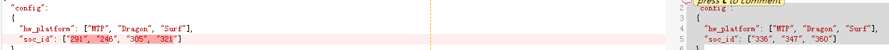

添加文件:
vendor/qcom/proprietary/sensors-see/ssc/registry/config/sdm710_lsm6dsm_0.json


---

# Change the orient of magnetic X, y, Z

vendor/qcom/proprietary/sensors-see/ssc/registry/config/sdm710_ak991x_0.json

```java
    ".orient":{
      "owner": "sns_ak0991x",
      "x":{ "type": "str", "ver": "0",
        "data": "-y"
      },
      "y":{ "type": "str", "ver": "0",
        "data": "+x"
      },
      "z":{ "type": "str", "ver": "0",
        "data": "+z"
      }
    },
```

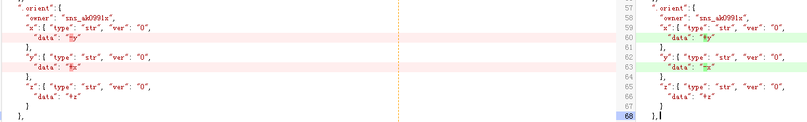

---

# 百度地图和腾讯地图，转动手机地图上的指针不动，指南针功能不能使用

```java
private List<Sensor> lsSensor = null; 
private SensorManager sm = null;

sm = (SensorManager) this.getSystemService("sensor");
lsSensor = sm.getSensorList(-1);
for (Sensor i : lsSensor) {
    Log.i("MainActivity","sensor :"+i);
}
Log.i("MainActivity","sm.getDefaultSensor(3):"+sm.getDefaultSensor(3));
boolean isContainsOri = lsSensor.contains(sm.getDefaultSensor(3));
Log.i("MainActivity","isContainsOri:"+isContainsOri);
```

这是反编译androidsensorbox.apk，其中方向传感器不支持的源码。

通过追踪源码：

frameworks\base\core\java\android\hardware\SensorManager.java

public Sensor getDefaultSensor(int type) 方法，我们发现方向传感器3为一个过期的定义类型：
```java
    @Deprecated
    public static final int TYPE_ORIENTATION = 3;
```

而最新的方向传感器为：

public static final int TYPE_DEVICE_ORIENTATION = 27;

当前确认androidsensorbox.apk可以正确识别方向传感器，是因为其使用监听的是accelerometer和magnetic二个传感器,,所以上面的修改就可以正确识别方向了,这也是百度地图可以正常工作的原因：


```java
Sensor accelerometer = this.a.getDefaultSensor(1);
Log.i("MainActivity","MainActivity--accelerometer != null:"+(accelerometer != null));
if (accelerometer != null) {
    Log.i("MainActivity","MainActivity--a.registerListener");
    //this.a.registerListener(this, accelerometer, 1);
}

Sensor magnetic = this.a.getDefaultSensor(2);
Log.i("MainActivity","MainActivity--magnetic != null:"+(magnetic != null));
if (magnetic != null) {
    Log.i("MainActivity","MainActivity--a.registerListener");
    this.a.registerListener(this, magnetic, 2);
}
.........................................
    class OrienSensorEventListener implements SensorEventListener {
        OrienSensorEventListener() {
        }

        public void onSensorChanged(SensorEvent event) {
            if (event.sensor.getType() == 1) {
                SensorOrienActivity.this.accelerometerValues = event.values;
            }
            if (event.sensor.getType() == 2) {
                SensorOrienActivity.this.magneticFieldValues = event.values;
            }
            SensorOrienActivity.this.calculateOrientation();
        }

        public void onAccuracyChanged(Sensor sensor, int accuracy) {
        }
    }

    private void calculateOrientation() {
        float[] values = new float[3];
        float[] valueR = new float[9];
        SensorManager.getRotationMatrix(valueR, null, this.accelerometerValues, this.magneticFieldValues);
        SensorManager.getOrientation(valueR, values);
        values[0] = (float) Math.toDegrees((double) values[0]);
        values[1] = (float) Math.toDegrees((double) values[1]);
        values[2] = (float) Math.toDegrees((double) values[2]);
        this.mTargetDirection = normalizeDegree(values[0] * -1.0f);
        float rvalue = (float) (Math.round(values[0] * 100.0f) / 100);
        this.mvOrien.setData(values);
        String str = "" + "  Azimuth:\t" + (((float) ((int) (values[0] * 10.0f))) / 10.0f) + "\t\t";
        str = str + "Pitch:\t" + (((float) ((int) (values[1] * 10.0f))) / 10.0f) + "\t\t";
        this.tvOriendata.setText(str + "Roll:\t" + (((float) ((int) (values[2] * 10.0f))) / 10.0f) + "\t(°)");
        String size = getResources().getString(R.string.orienSize);
        if (values[0] >= -180.0f && values[0] < -90.0f) {
            this.mOrienValue.setText(getResources().getString(R.string.southEast));
            this.mOrienNumber.setText((180.0f - Math.abs(rvalue)) + size);
        } else if (values[0] < 0.0f) {
            this.mOrienValue.setText(getResources().getString(R.string.northEast));
            this.mOrienNumber.setText(Math.abs(rvalue) + size);
        } else if (values[0] <= 90.0f) {
            this.mOrienValue.setText(getResources().getString(R.string.northWest));
            this.mOrienNumber.setText(rvalue + size);
        } else if (values[0] <= 180.0f) {
            this.mOrienValue.setText(getResources().getString(R.string.southWest));
            this.mOrienNumber.setText((180.0f - rvalue) + size);
        }
    }
```
腾讯地图不能正常工作:

```java
Sensor defaultSensor = this.a.getDefaultSensor(3);
if (defaultSensor != null) {
    this.a.registerListener(this, defaultSensor, 3);
    this.c = true;
    this.d = tencentLocationDirectionListener;
...............................
public void onSensorChanged(SensorEvent sensorEvent) {
    try {
        double d = (double) sensorEvent.values[0];
        if (d < 0.0d) {
            d += 360.0d;
        }
        this.d.notifyMobserver(new TencentLocationDirection(d, System.currentTimeMillis()));
    } catch (Throwable th) {
    }
}

public void onAccuracyChanged(Sensor sensor, int i) {
}
```
而对于TYPE_ORIENTATION = 3,其已经过期,onSensorChanged方法只会回调一次,当然就不能实现其功能.


但是mtk和高通的一加对比手机可以,这说明他们可以兼容过期的接口.

修改代码：
vendor/qcom/proprietary/sensors-see

sensors-hal/sensors/orientation.cpp


```c++
/*
 * Copyright (c) 2017 Qualcomm Technologies, Inc.
 * All Rights Reserved.
 * Confidential and Proprietary - Qualcomm Technologies, Inc.
 */

#include "sensor_factory.h"
#include "ssc_sensor.h"
#include "sns_std_sensor.pb.h"

static const char *SSC_DATATYPE_ROTV = "rotv";
#define RAD2DEG 180.0f/M_PI
#define M_PI 3.14159265358979323846
#define MIN_FLT_TO_AVOID_SINGULARITY 0.0001f

class orient : public ssc_sensor
{
    public:
        orient(sensor_uid suid, sensor_wakeup_type wakeup);
        static const char* ssc_datatype() { return SSC_DATATYPE_ROTV; }
    private:
        virtual void handle_sns_std_sensor_event(
                const sns_client_event_msg_sns_client_event& pb_event) override;
        void QuatToRotMat(float rot_mat[9], float quat[4]);
        void RotMatToOrient(float values[3], float rot_mat[9]);
};

orient::orient(sensor_uid suid, sensor_wakeup_type wakeup):
    ssc_sensor(suid, wakeup)
{
    set_type(SENSOR_TYPE_ORIENTATION);
    set_string_type(SENSOR_STRING_TYPE_ORIENTATION);
}

static bool orient_module_init()
{
    /*  register supported sensor types with factory */
    sensor_factory::register_sensor(
            SENSOR_TYPE_ORIENTATION,
            ssc_sensor::get_available_sensors<orient>);
    sensor_factory::request_datatype(SSC_DATATYPE_ROTV);
    return true;
}

void orient::handle_sns_std_sensor_event(
        const sns_client_event_msg_sns_client_event& pb_event)
{
    sns_std_sensor_event pb_sensor_event;
    pb_sensor_event.ParseFromString(pb_event.payload());
    sensors_event_t hal_event = create_sensor_hal_event(pb_event.timestamp());
    float quat[4];
    float rot_mat[9];
    float orient[3];
    quat[0] = pb_sensor_event.data(0);
    quat[1] = pb_sensor_event.data(1);
    quat[2] = pb_sensor_event.data(2);
    quat[3] = pb_sensor_event.data(3);
    QuatToRotMat(rot_mat, quat);
    /*  convert rotation matrix to orientation */
    RotMatToOrient(orient, rot_mat);
    hal_event.orientation.x = orient[0];
    hal_event.orientation.y = orient[1];
    hal_event.orientation.z = orient[2];
    hal_event.orientation.status = pb_sensor_event.status();

    submit_sensors_hal_event(hal_event);
}

/* ==========================================================================
  =
  FUNCTION: QuatToRotMat
  Convert quaternion to rotation matrix

  Quaternion
  Q = |X Y Z W|

  Rotation Matrix
  / R[ 0] R[ 1] R[ 2] 0 \
    | R[ 4] R[ 5] R[ 6] 0 |
    | R[ 8] R[ 9] R[10] 0 |
    \ 0 0 0 1 /
    M = 1- 2(Y*Y + Z*Z) 2XY - 2ZW 2XZ + 2YW 0
    2XY + 2ZW 1 - 2(XX + ZZ) 2YZ - 2XW 0
    2XZ - 2YW 2YZ + 2XW 1 - 2(XX + ZZ) 0
    0 0 0 1
   ===========================================================================
*/
void orient::QuatToRotMat(float rot_mat[9], float quat[4])
{
    float X = quat[0];
    float Y = quat[1];
    float Z = quat[2];
    float W = quat[3];
    float xx = X * X;
    float xy = X * Y;
    float xz = X * Z;
    float xw = X * W;
    float yy = Y * Y;
    float yz = Y * Z;
    float yw = Y * W;
    float zz = Z * Z;
    float zw = Z * W;
    sns_logv("%s: X=%f, Y=%f, Z=%f, W=%f", __FUNCTION__, X, Y, Z, W);
    rot_mat[0] = 1 - 2 * ( yy + zz );
    rot_mat[1] = 2 * ( xy - zw );

    rot_mat[2] = 2 * ( xz + yw );
    rot_mat[3] = 2 * ( xy + zw );
    rot_mat[4] = 1 - 2 * ( xx + zz );
    rot_mat[5] = 2 * ( yz - xw );
    rot_mat[6] = 2 * ( xz - yw );
    rot_mat[7] = 2 * ( yz + xw );
    rot_mat[8] = 1 - 2 * ( xx + yy );
}

/* ==========================================================================
 * =
 * FUNCTION: RotMatToOrient
 * Convert rotation matrix to Orientation Sensor as defined in Sensor.TYPE_ORIENTATION:
 * values[0]: Azimuth, angle between the magnetic north direction and the y-axis,
 * around the z-axis (0 to 359). 0=North, 90=East, 180=South, 270=West
 * values[1]: Pitch, rotation around x-axis (-180 to 180),
 * with positive values when the z-axis moves toward the y-axis.
 * values[2]: Roll, rotation around y-axis (-90 to 90),
 * with positive values when the x-axis moves toward the z-axis.
 * ===========================================================================
 * */
void orient::RotMatToOrient(float values[3], float rot_mat[9])
{
    float xunit[3] = {rot_mat[0], rot_mat[3], rot_mat[6]};
    float yunit[3] = {rot_mat[1], rot_mat[4], rot_mat[7]};
    float zunit[3] = {rot_mat[2], rot_mat[5], rot_mat[8]};
    float xnorm = sqrt(xunit[0]*xunit[0] + xunit[1]*xunit[1]);
    if (fabs(zunit[2]) < MIN_FLT_TO_AVOID_SINGULARITY) {
        zunit[2] = MIN_FLT_TO_AVOID_SINGULARITY * (zunit[2] < 0 ? -1 : 1);
    }
    if (fabs(xunit[0]) < MIN_FLT_TO_AVOID_SINGULARITY) {
        xunit[0] = MIN_FLT_TO_AVOID_SINGULARITY * (xunit[0] < 0 ? -1 : 1);
    }
    if (fabs(xnorm) < MIN_FLT_TO_AVOID_SINGULARITY) {
        xnorm = MIN_FLT_TO_AVOID_SINGULARITY * (xnorm < 0 ? -1 : 1);
    }

    values[0] = RAD2DEG * atan2(xunit[1], xunit[0]);
    values[0] = fmodf(360.0f - values[0], 360.0f);
    values[1] = -RAD2DEG * atan2(yunit[2], zunit[2]);
    values[2] = RAD2DEG * atan2(xunit[2], xnorm);
}
SENSOR_MODULE_INIT(orient_module_init);
```


---

# 步数计数不准

微信计步测试过程中走3-5分钟后，小米手机的步数在三百多，测试机只有几十步或者一百多步

frameworks / native/services/sensorservice/SensorService.cpp

```c++
--- a/native/services/sensorservice/SensorService.cpp
+++ b/native/services/sensorservice/SensorService.cpp
@@ -785,6 +785,13 @@
         size_t numConnections = activeConnections.size();
         for (size_t i=0 ; i < numConnections; ++i) {
             if (activeConnections[i] != 0) {
+
+             //  fix for weixin step counter poweroff issue temp 2019-12-11
+             if(mSensorEventBuffer[i].type == SENSOR_TYPE_STEP_COUNTER){
+			ALOGI("song Step step counter sendEvent value:%ju\n",mSensorEventBuffer[i].u64.step_counter);
+			activeConnections[i]->setSensorAccess(true);
+		   }
+
                 activeConnections[i]->sendEvents(mSensorEventBuffer, count, mSensorEventScratch,
                         mMapFlushEventsToConnections);
                 needsWakeLock |= activeConnections[i]->needsWakeLock();
```


---

# Accel/gyro/step 样例

## 1.加速度/陀螺仪

1).移植(完成数据上报)

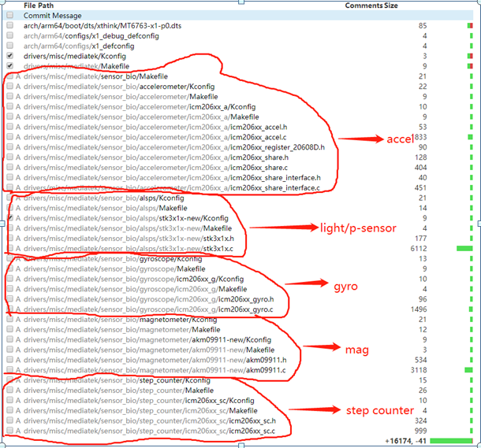

 2).加速度/陀螺仪的方向 

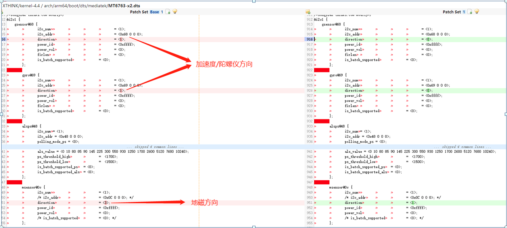


## 2.light/p-sensor

  1).移植(完成数据上报) 


  2).距离传感器测试
i.门限值设置(灰卡，标准3-6cm，灰卡或黄卡仅测试一个)

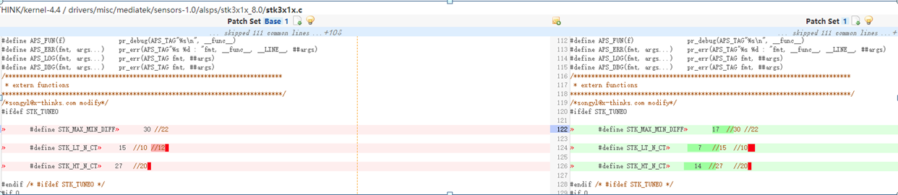

ii.油渍/黑卡/灰卡测试

油渍：擦干净P-sensor孔上面屏幕，然后打开P-sensor，然后在上面沾些油渍，脏污；
当没有遮挡p-sensor时，查看p-sensor是否变为1；
如果出现一直为0，则需要调整门限值 

灰卡：根据测试标准，如3-6cm ,则使用灰卡检测3 cm处的值和6cm处的p-sensor 值；
多测试多台，然后找个避开油渍的门限值，同时要符合测试标准 
p-sensor距离值采集.xlsx 

注：
a.如果这个门限值，无法满足同时避开油渍问题和符合测试标准值，那很有可能是硅胶套需要改善；

b.如果底噪值比较大(没有遮挡时p-sensor值)，那也很有可能是硅胶套需要改善；
 
这个跟结构-硅胶套-有很大关系


## 3.Mag sensor

  1).移植(完成数据上报)
i.驱动部分 

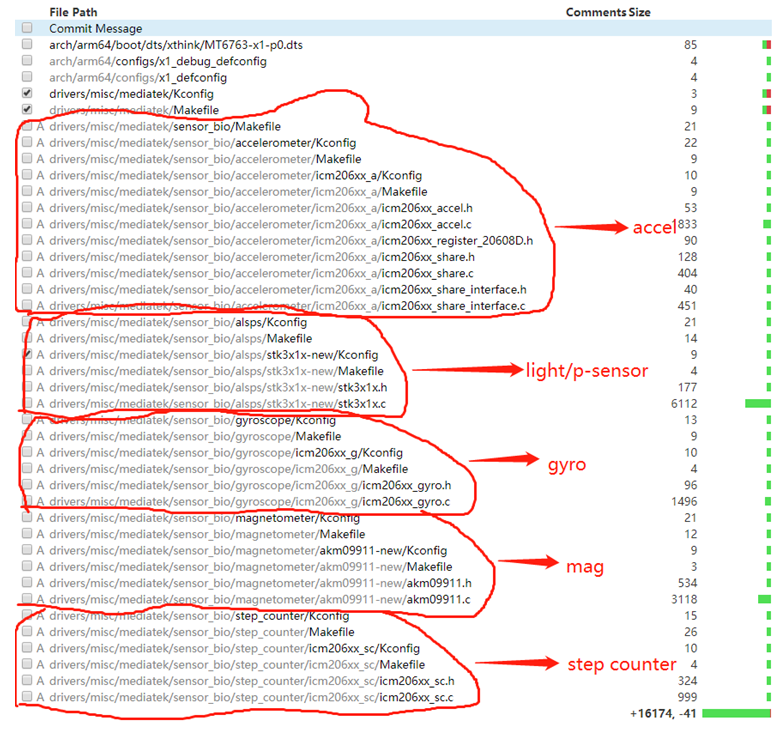

ii.修改方向


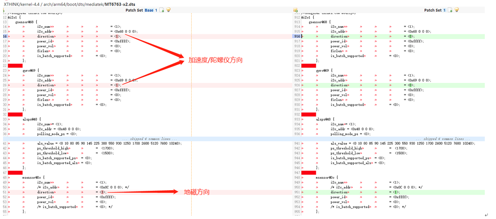

 iii.库文件

 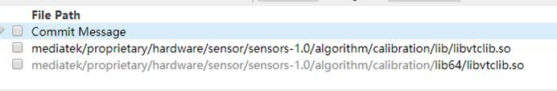

iv.framework 下改为使用vendor文件

 frameworks / native/services/sensorservice/SensorService.cpp

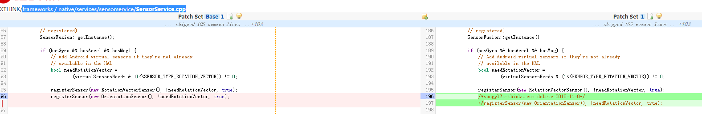


## 4.Hall-sensor
  1).移植(完成数据上报) 


2).磁铁测试

将磁铁放在hall传感器位置，cat节点出现接近，拿开出现leave

一般节点:
/sys/class/switch/hall_switch/state


## 5.温度/气体

  1)移植  
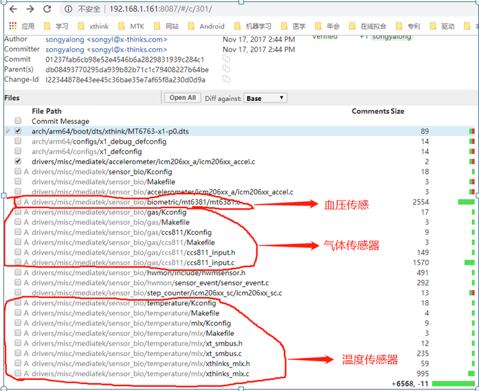

  2)添加vendor到framework层

打通driver到app层的数据流 

Hardware层

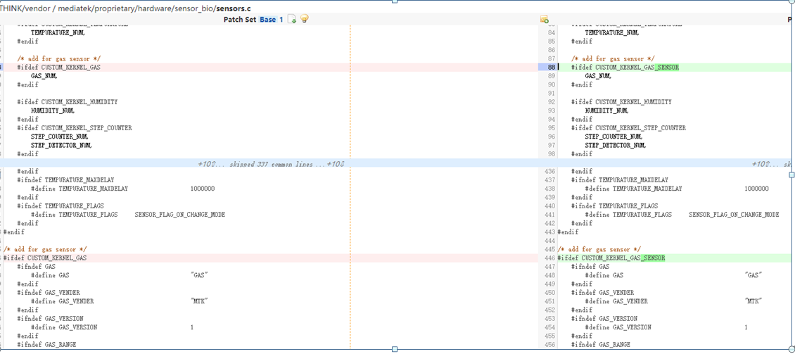

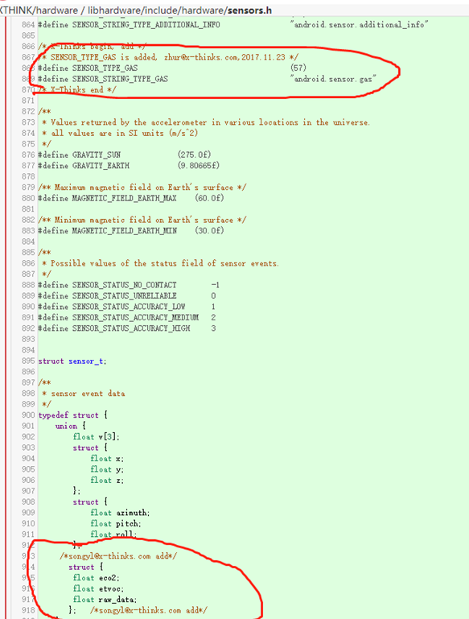


framework层

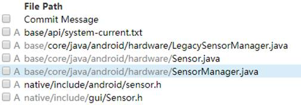

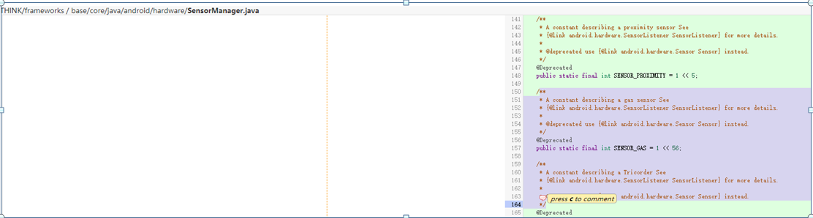

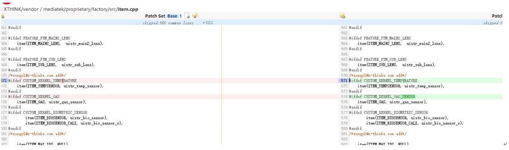

3).添加权限

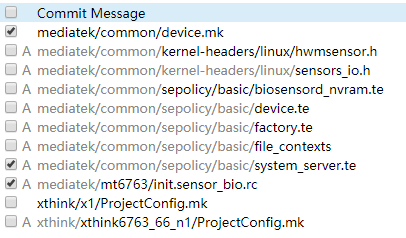


## 6.血氧

  1)移植 
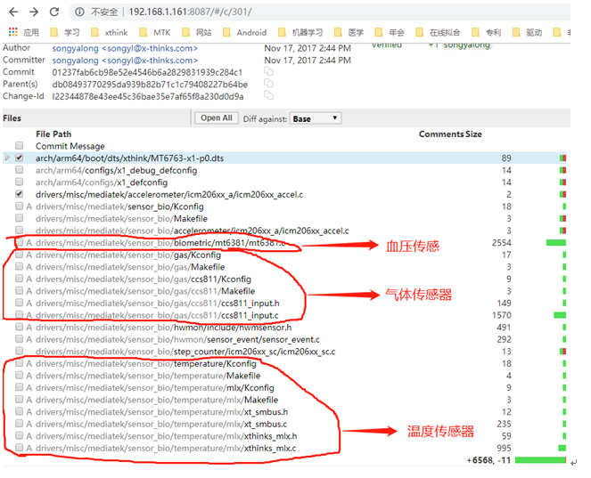

 2).ATA测试

```java
mediatek/proprietary/factory/src/test/ftm_biosensor.c
mediatek/proprietary/factory/src/test/ftm_biosensor_cali.c
mediatek/proprietary/external/biosensord/libbiosensor/libbiosensor.c
```

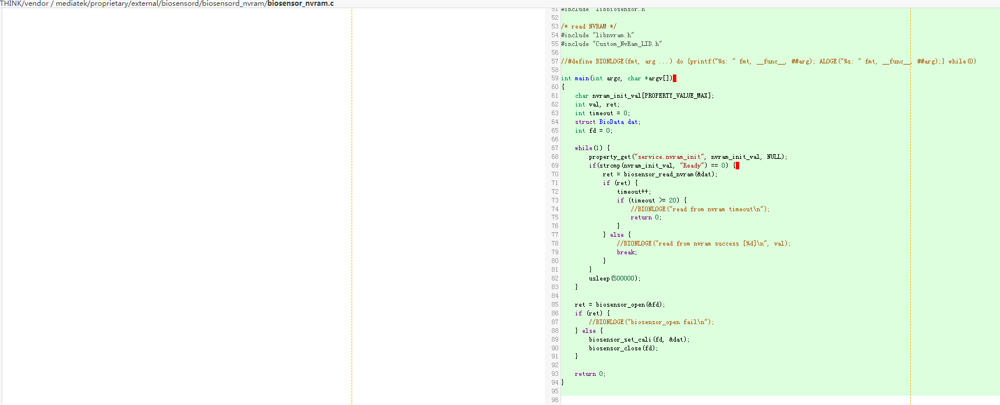


##  7.工模

mediatek/proprietary/factory/src/test


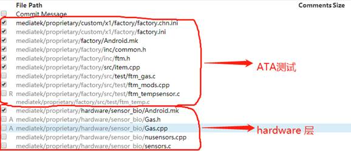

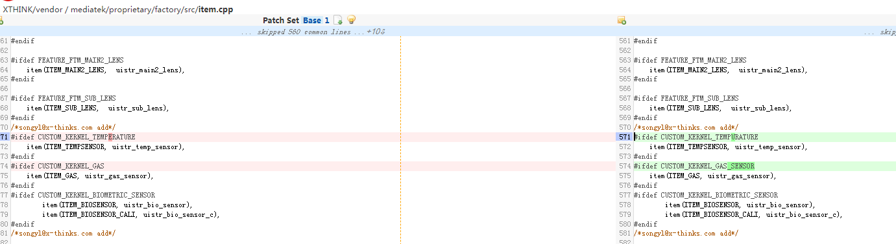

```java

```


```java

```

```java

```


```java

```


```java

```


```java

```


```java

```

```java

```

```java

```

```java

```


```java

```


```java

```


```java

```


---

[<font face='黑体' color=#ff0000 size=40 >跳转到文章开始</font>](#sensor笔记)

---

# 结束语

