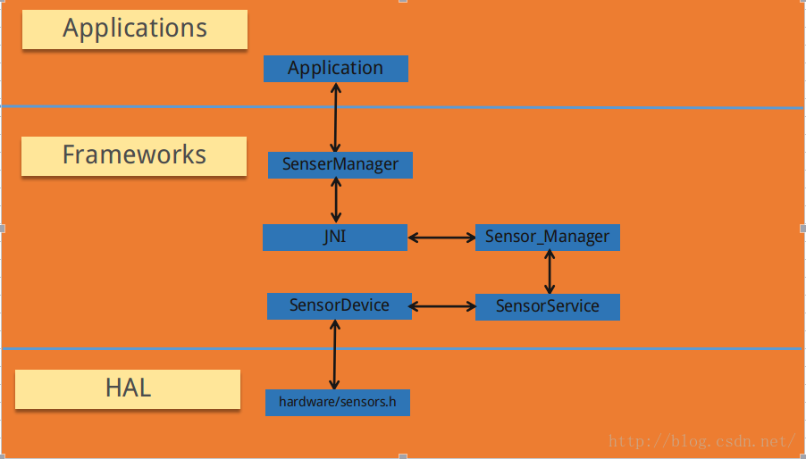
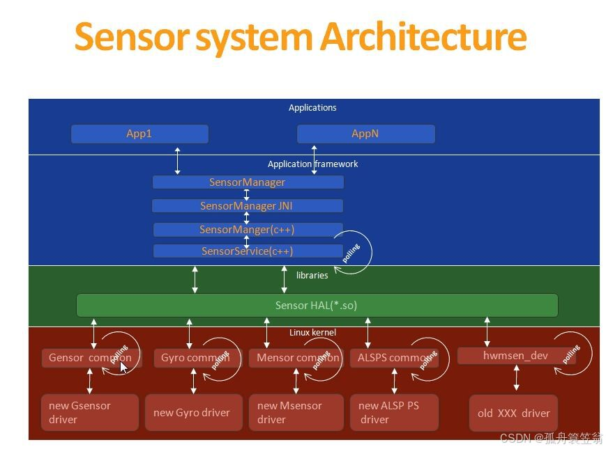
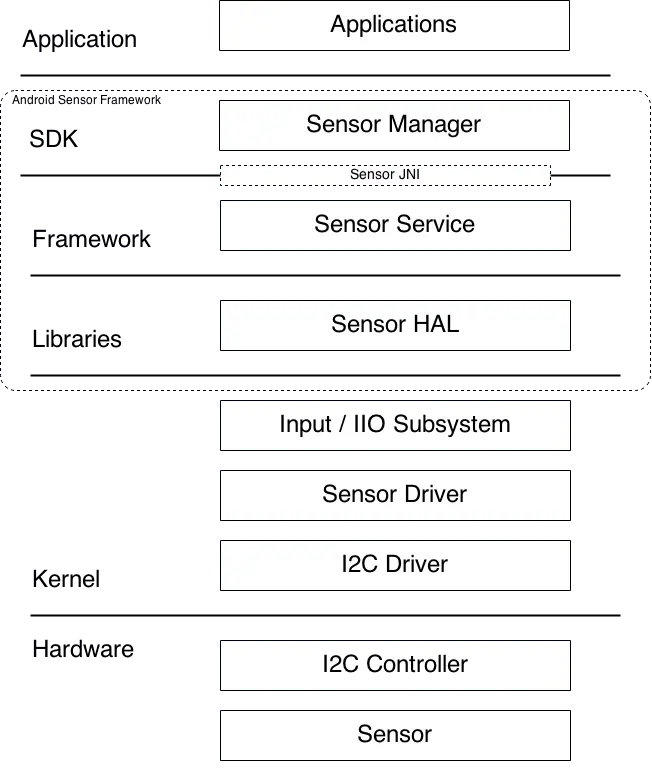
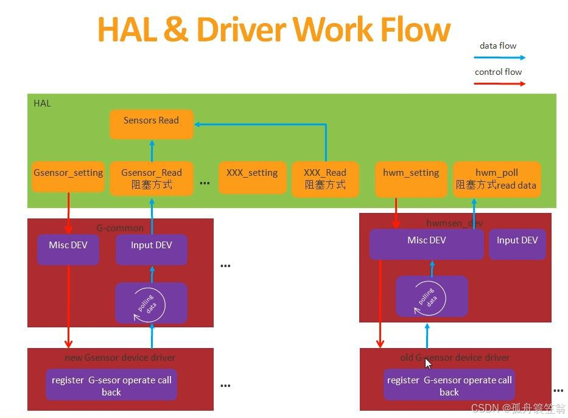
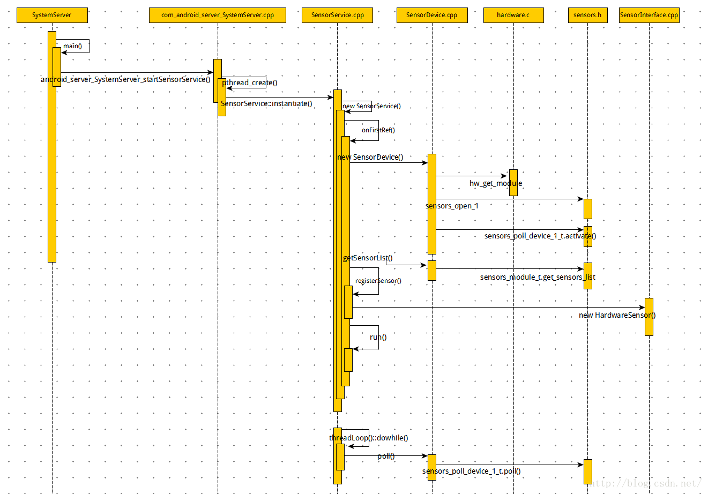
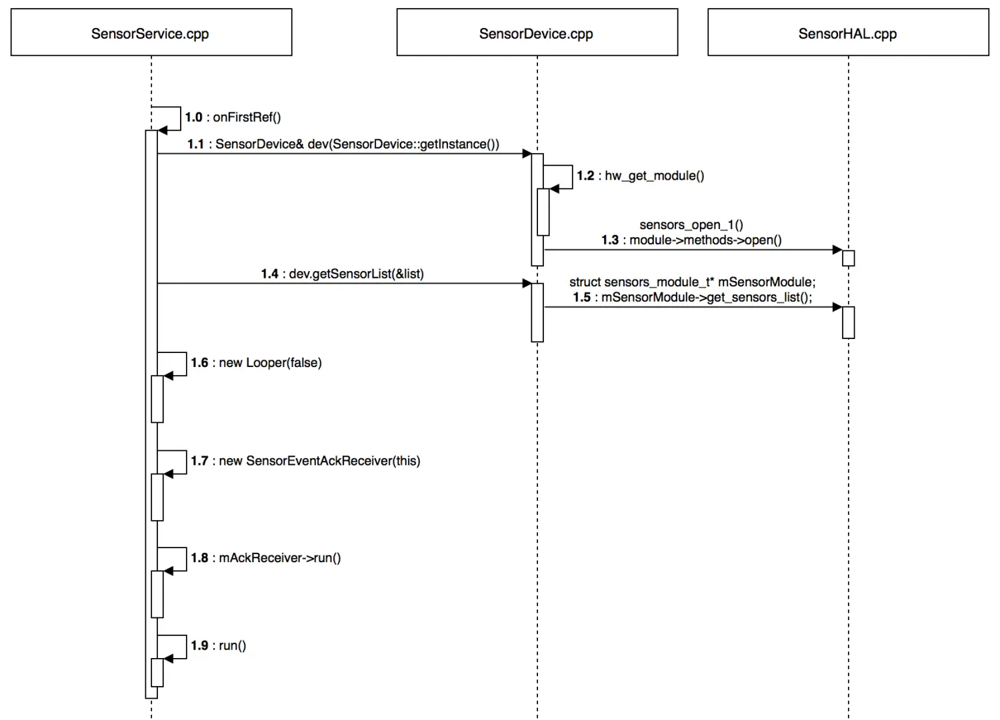

# P28: 系统开发之Sensor


---

[跳转到readme](https://github.com/hfreeman2008/android_core_framework/blob/main/README-CN.md)

---

[<font face='黑体' color=#ff0000 size=40 >跳转到文章结尾</font>](#结束语)

---

# sensor的整体架构











---


## Application层：

第一层是应用层：代表上层使用frameworks的接口注册或使用一个sensor：

第一步：获取SensorManager对象

第二步：获取Sensor对象

第三步：注册Sensor对象

第四步：重写onAccuracyChanged，onSensorChanged这两个方法

第五步：注销Sensor对象

```java
public class SensorActivity extends Activity implements SensorEventListener {

  private SensorManager mSensorManager;
  private Sensor mSensor;

  @Override
  public final void onCreate(Bundle savedInstanceState) {
    super.onCreate(savedInstanceState);
    setContentView(R.layout.main);
    //第一步：通过getSystemService获得SensorManager实例对象
    mSensorManager = (SensorManager) getSystemService(Context.SENSOR_SERVICE);
    //第二步：通过SensorManager实例对象获得想要的传感器对象:参数决定获取哪个传感器
    mSensor = mSensorManager.getDefaultSensor(Sensor.TYPE_LIGHT);
  }
  
  //第四步：必须重写的两个方法：onAccuracyChanged，onSensorChanged
  /**
   * 传感器精度发生改变的回调接口
   */
  @Override
  public final void onAccuracyChanged(Sensor sensor, int accuracy) {
    //TODO 在传感器精度发生改变时做些操作，accuracy为当前传感器精度
  }
  
  /**
   * 传感器事件值改变时的回调接口：执行此方法的频率与注册传感器时的频率有关
   */
  @Override
  public final void onSensorChanged(SensorEvent event) {
    // 大部分传感器会返回三个轴方向x,y,x的event值，值的意义因传感器而异
    float x = event.values[0];
    float y = event.values[1];
    float z = event.values[2];
    //TODO 利用获得的三个float传感器值做些操作
  }
  
  /**
   * 第三步：在获得焦点时注册传感器并让本类实现SensorEventListener接口
   */
  @Override
  protected void onResume() {
    super.onResume();
    /*
     *第一个参数：SensorEventListener接口的实例对象
     *第二个参数：需要注册的传感器实例
     *第三个参数：传感器获取传感器事件event值频率：
   *              SensorManager.SENSOR_DELAY_FASTEST = 0：对应0微秒的更新间隔，最快，1微秒 = 1 % 1000000秒
   *              SensorManager.SENSOR_DELAY_GAME = 1：对应20000微秒的更新间隔，游戏中常用
   *              SensorManager.SENSOR_DELAY_UI = 2：对应60000微秒的更新间隔
   *              SensorManager.SENSOR_DELAY_NORMAL = 3：对应200000微秒的更新间隔
   *              键入自定义的int值x时：对应x微秒的更新间隔
     *
     */
    mSensorManager.registerListener(this, mSensor, SensorManager.SENSOR_DELAY_NORMAL);
  }
  
  /**
   * 第五步：在失去焦点时注销传感器
   */
  @Override
  protected void onPause() {
    super.onPause();
    mSensorManager.unregisterListener(this);
  }
}
```

设备不一定支持你需要的sensor，使用前可以先判断下可用性

```java
private SensorManager mSensorManager;
...
mSensorManager = (SensorManager) getSystemService(Context.SENSOR_SERVICE);
if (mSensorManager.getDefaultSensor(Sensor.TYPE_MAGNETIC_FIELD) != null){
    // Success! There's a magnetometer.
} else {
    // Failure! No magnetometer.
}

//或者
List<Sensor> deviceSensors = mSensorManager.getSensorList(Sensor.TYPE_ALL);
```

---

## Frameworks层： 

包含SensorService， 接收HAl层传上来的 sensor event 数据，并让应用层做出相应的动作，如陀螺仪转动，横竖屏切换等。

frameworks java:

frameworks\base\core\java\android\hardware\SensorManager.java
frameworks\base\core\java\android\hardware\SystemSensorManager.java

```java
    private final HashMap<SensorEventListener, SensorEventQueue> mSensorListeners =
            new HashMap<SensorEventListener, SensorEventQueue>();//注册的sensor监听回调接口
```

sensor事件回调接口：

frameworks\base\core\java\android\hardware\SensorEventListener.java
frameworks\base\core\java\android\hardware\SensorListener.java

jni:

frameworks\base\core\jni\android_hardware_SensorManager.cpp


native:

服务端 SensorService：

frameworks\native\services\sensorservice\SensorService.h
frameworks\native\services\sensorservice\SensorService.cpp


---

## HAL层： 



SensorDevice 的poll函数读取数据


hardware:

```java
hardware/interfaces/sensors/2.0/multihal/Android.bp
u:r:hal_sensors_default:s0     system          806      1 12565056  5644 0                   0 S android.hardware.sensors@2.0-service.multihal

 vendor/qcom/proprietary/sensors-see/sensorcal-hidl-impl/Android.bp
u:r:vendor_hal_sensorscalibrate_qti_default:s0 system 839 1 12350328 2188 0                  0 S vendor.qti.hardware.sensorscalibrate@1.0-service

 vendor/qcom/proprietary/sensors-see/sensordaemon/Android.bp
u:r:vendor_sensors_qti:s0      system          979      1 12437944  1372 0                   0 S sensors.qti
```


```java
hardware/interfaces/sensors/
vendor\mediatek\proprietary\hardware\sensor
hardware/libhardware/include/hardware/sensors.h
```


Google为Sensor提供了统一的HAL接口，不同的硬件厂商需要根据该接口来实现并完成具体的硬件抽象层，Android中Sensor的HAL接口定义在：

hardware/libhardware/include/hardware/sensors.h

```java
/*
 * Sensor string types for Android defined sensor types.
 * For Android defined sensor types, string type will be override in sensor service and thus no
 * longer needed to be added to sensor_t data structure.
 * These definitions are going to be removed soon.
 */
#define SENSOR_STRING_TYPE_ACCELEROMETER                "android.sensor.accelerometer"
#define SENSOR_STRING_TYPE_MAGNETIC_FIELD               "android.sensor.magnetic_field"
#define SENSOR_STRING_TYPE_ORIENTATION                  "android.sensor.orientation"
#define SENSOR_STRING_TYPE_GYROSCOPE                    "android.sensor.gyroscope"
#define SENSOR_STRING_TYPE_LIGHT                        "android.sensor.light"
#define SENSOR_STRING_TYPE_PRESSURE                     "android.sensor.pressure"
#define SENSOR_STRING_TYPE_TEMPERATURE                  "android.sensor.temperature"
#define SENSOR_STRING_TYPE_PROXIMITY                    "android.sensor.proximity"
#define SENSOR_STRING_TYPE_GRAVITY                      "android.sensor.gravity"
#define SENSOR_STRING_TYPE_LINEAR_ACCELERATION          "android.sensor.linear_acceleration"
#define SENSOR_STRING_TYPE_ROTATION_VECTOR              "android.sensor.rotation_vector"
#define SENSOR_STRING_TYPE_RELATIVE_HUMIDITY            "android.sensor.relative_humidity"
#define SENSOR_STRING_TYPE_AMBIENT_TEMPERATURE          "android.sensor.ambient_temperature"
#define SENSOR_STRING_TYPE_MAGNETIC_FIELD_UNCALIBRATED  "android.sensor.magnetic_field_uncalibrated"
#define SENSOR_STRING_TYPE_GAME_ROTATION_VECTOR         "android.sensor.game_rotation_vector"
#define SENSOR_STRING_TYPE_GYROSCOPE_UNCALIBRATED       "android.sensor.gyroscope_uncalibrated"
#define SENSOR_STRING_TYPE_SIGNIFICANT_MOTION           "android.sensor.significant_motion"
#define SENSOR_STRING_TYPE_STEP_DETECTOR                "android.sensor.step_detector"
#define SENSOR_STRING_TYPE_STEP_COUNTER                 "android.sensor.step_counter"
#define SENSOR_STRING_TYPE_GEOMAGNETIC_ROTATION_VECTOR  "android.sensor.geomagnetic_rotation_vector"
#define SENSOR_STRING_TYPE_HEART_RATE                   "android.sensor.heart_rate"
#define SENSOR_STRING_TYPE_TILT_DETECTOR                "android.sensor.tilt_detector"
#define SENSOR_STRING_TYPE_WAKE_GESTURE                 "android.sensor.wake_gesture"
#define SENSOR_STRING_TYPE_GLANCE_GESTURE               "android.sensor.glance_gesture"
#define SENSOR_STRING_TYPE_PICK_UP_GESTURE              "android.sensor.pick_up_gesture"
#define SENSOR_STRING_TYPE_WRIST_TILT_GESTURE           "android.sensor.wrist_tilt_gesture"
#define SENSOR_STRING_TYPE_DEVICE_ORIENTATION           "android.sensor.device_orientation"
#define SENSOR_STRING_TYPE_POSE_6DOF                    "android.sensor.pose_6dof"
#define SENSOR_STRING_TYPE_STATIONARY_DETECT            "android.sensor.stationary_detect"
#define SENSOR_STRING_TYPE_MOTION_DETECT                "android.sensor.motion_detect"
#define SENSOR_STRING_TYPE_HEART_BEAT                   "android.sensor.heart_beat"
#define SENSOR_STRING_TYPE_DYNAMIC_SENSOR_META          "android.sensor.dynamic_sensor_meta"
#define SENSOR_STRING_TYPE_ADDITIONAL_INFO              "android.sensor.additional_info"
#define SENSOR_STRING_TYPE_LOW_LATENCY_OFFBODY_DETECT   "android.sensor.low_latency_offbody_detect"
#define SENSOR_STRING_TYPE_ACCELEROMETER_UNCALIBRATED   "android.sensor.accelerometer_uncalibrated"
#define SENSOR_STRING_TYPE_HINGE_ANGLE                  "android.sensor.hinge_angle"
```

---

## kernel层：

硬件驱动

kernel:

```java
vendor/qcom/proprietary/sensors-see
kernel/msm-4.19/drivers/sensors
kernel/drivers/misc/mediatek/sensor_bio
```

---

# 客制化开关
在alps\device\mediatek$(proj)\ProjectConfig.mk中 配置对应的传感器为y

等效路径（kernel3.18\arch\arm64\configs$(proj).deconfig）


```java
CONFIG_MTK_SENSOR_SUPPORT=y 
CONFIG_CUSTOM_KERNEL_ACCELEROMETER=y 
CONFIG_MTK_ICM20645G=y 
CONFIG_CUSTOM_KERNEL_ALSPS=y 
CONFIG_MTK_CM36558=y 
CONFIG_CUSTOM_KERNEL_GYROSCOPE=y 
CONFIG_MTK_ICM20645GY=y
```

---

# SensorService 的启动流程

老版本的一个启动SensorService调用时序图：







下面是高通平台的一个SensorService启动流程：

(1)SystemServer#startBootstrapServices

```java
        t.traceBegin("StartSensorPrivacyService");
        mSystemServiceManager.startService(new SensorPrivacyService(mSystemContext));
        t.traceEnd();

        // The sensor service needs access to package manager service, app ops
        // service, and permissions service, therefore we start it after them.
        // Start sensor service in a separate thread. Completion should be checked
        // before using it.
        mSensorServiceStart = SystemServerInitThreadPool.submit(() -> {
            TimingsTraceAndSlog traceLog = TimingsTraceAndSlog.newAsyncLog();
            traceLog.traceBegin(START_SENSOR_SERVICE);
            startSensorService();
            traceLog.traceEnd();
        }, START_SENSOR_SERVICE);
```

（2）com_android_server_SystemServer#android_server_SystemServer_startSensorService

frameworks\base\services\core\jni\com_android_server_SystemServer.cpp
```c++
static void android_server_SystemServer_startSensorService(JNIEnv* /* env */, jobject /* clazz */) {
    char propBuf[PROPERTY_VALUE_MAX];
    property_get("system_init.startsensorservice", propBuf, "1");
    if (strcmp(propBuf, "1") == 0) {
        SensorService::publish(false /* allowIsolated */,
                               IServiceManager::DUMP_FLAG_PRIORITY_CRITICAL);
    }
}
```

(3)SensorService--sensor服务

frameworks\native\services\sensorservice\SensorService.cpp

SensorService的初始化主要有：
1. 创建SensorDevice实例，获取Sensor列表
2. 调用SensorDevice.getSensorList(),获取Sensor模块所有传感器列表并为为每个传感器注册监听器

SensorService::onFirstRef()
```c++

void SensorService::onFirstRef() {

    SensorDevice& dev(SensorDevice::getInstance());//SensorDevice对象
    if (dev.initCheck() == NO_ERROR) {
        sensor_t const* list;
        ssize_t count = dev.getSensorList(&list);//获取Sensor列表
        if (count > 0) {
            ssize_t orientationIndex = -1;
            bool hasGyro = false, hasAccel = false, hasMag = false;
            for (ssize_t i=0 ; i<count ; i++) {
                bool useThisSensor=true;

                switch (list[i].type) {
                    case SENSOR_TYPE_ACCELEROMETER:
                        hasAccel = true;
                        break;
                    case SENSOR_TYPE_MAGNETIC_FIELD:
                        hasMag = true;
                        break;
                    ......
            }
            if (hasGyro && hasAccel && hasMag) {
                // Add Android virtual sensors if they're not already
                // available in the HAL
                bool needRotationVector =
                        (virtualSensorsNeeds & (1<<SENSOR_TYPE_ROTATION_VECTOR)) != 0;

                registerSensor(new RotationVectorSensor(), !needRotationVector, true);//注册sensor
                registerSensor(new OrientationSensor(), !needRotationVector, true);

                // virtual debugging sensors are not for user
                registerSensor( new CorrectedGyroSensor(list, count), true, true);
                registerSensor( new GyroDriftSensor(), true, true);
            }

//启动一个线程，获取HAL层的数据
bool SensorService::threadLoop() {
    ALOGD("nuSensorService thread starting...");
    SensorDevice& device(SensorDevice::getInstance());

    const int halVersion = device.getHalDeviceVersion();
    do {
        //从HAL层读取数据
        ssize_t count = device.poll(mSensorEventBuffer, numEventMax);
        if (count < 0) {
            if(count == DEAD_OBJECT && device.isReconnecting()) {
                device.reconnect();
                continue;
            } else {
                ALOGE("sensor poll failed (%s)", strerror(-count));
                break;
            }
        }
       ......
        // Send our events to clients. Check the state of wake lock for each client and release the
        // lock if none of the clients need it.
        bool needsWakeLock = false;
        for (const sp<SensorEventConnection>& connection : activeConnections) {
            //向客户端发数据
            connection->sendEvents(mSensorEventBuffer, count, mSensorEventScratch,
                    mMapFlushEventsToConnections);
            needsWakeLock |= connection->needsWakeLock();
            // If the connection has one-shot sensors, it may be cleaned up after first trigger.
            // Early check for one-shot sensors.
            if (connection->hasOneShotSensors()) {
                cleanupAutoDisabledSensorLocked(connection, mSensorEventBuffer, count);
            }
        }

}
```

(4)SensorDevice

frameworks\native\services\sensorservice\SensorDevice.cpp
```c++
//获取Sensor列表
ssize_t SensorDevice::getSensorList(sensor_t const** list) {
    *list = &mSensorList[0];
    return mSensorList.size();
}

//构造方法
SensorDevice::SensorDevice()
        : mHidlTransportErrors(20),
          mRestartWaiter(new HidlServiceRegistrationWaiter()),
          mEventQueueFlag(nullptr),
          mWakeLockQueueFlag(nullptr),
          mReconnecting(false) {
    //hidl service是使用此接口来连接的
    if (!connectHidlService()) {
        return;
    }
    initializeSensorList();
    mIsDirectReportSupported =
            (checkReturnAndGetStatus(mSensors->unregisterDirectChannel(-1)) != INVALID_OPERATION);
}

//初始化方法
void SensorDevice::initializeSensorList() {
    float minPowerMa = 0.001; // 1 microAmp

    checkReturn(mSensors->getSensorsList(
            [&](const auto &list) {
                const size_t count = list.size();

                mActivationCount.setCapacity(count);
                Info model;
                for (size_t i=0 ; i < count; i++) {
                    sensor_t sensor;
                    convertToSensor(convertToOldSensorInfo(list[i]), &sensor);

                    if (sensor.type < static_cast<int>(SensorType::DEVICE_PRIVATE_BASE)) {
                        if(sensor.resolution == 0) {
                            // Don't crash here or the device will go into a crashloop.
                            ALOGW("%s must have a non-zero resolution", sensor.name);
                            // For simple algos, map their resolution to 1 if it's not specified
                            sensor.resolution =
                                    SensorDeviceUtils::defaultResolutionForType(sensor.type);
                        }

                        // Some sensors don't have a default resolution and will be left at 0.
                        // Don't crash in this case since CTS will verify that devices don't go to
                        // production with a resolution of 0.
                        if (sensor.resolution != 0) {
                            double promotedResolution = sensor.resolution;
                            double promotedMaxRange = sensor.maxRange;
                            if (fmod(promotedMaxRange, promotedResolution) != 0) {
                                ALOGW("%s's max range %f is not a multiple of the resolution %f",
                                        sensor.name, sensor.maxRange, sensor.resolution);
                                SensorDeviceUtils::quantizeValue(
                                        &sensor.maxRange, promotedResolution);
                            }
                        }
                    }

                    // Sanity check and clamp power if it is 0 (or close)
                    if (sensor.power < minPowerMa) {
                        ALOGI("Reported power %f not deemed sane, clamping to %f",
                              sensor.power, minPowerMa);
                        sensor.power = minPowerMa;
                    }
                    mSensorList.push_back(sensor);//sensor列表

                    mActivationCount.add(list[i].sensorHandle, model);

                    // Only disable all sensors on HAL 1.0 since HAL 2.0
                    // handles this in its initialize method
                    if (!mSensors->supportsMessageQueues()) {
                        checkReturn(mSensors->activate(list[i].sensorHandle,
                                    0 /* enabled */));
                    }
                }
            }));
}
```

poll相关的方法：

```c++
//poll方法
ssize_t SensorDevice::poll(sensors_event_t* buffer, size_t count) {
    ssize_t eventsRead = 0;
    if (mSensors->supportsMessageQueues()) {
        //调用pollFmq方法
        eventsRead = pollFmq(buffer, count);
    } else if (mSensors->supportsPolling()) {
        //调用pollHal方法
        eventsRead = pollHal(buffer, count);
    } else {
        ALOGE("Must support polling or FMQ");
        eventsRead = -1;
    }
    return eventsRead;
}


ssize_t SensorDevice::pollHal(sensors_event_t* buffer, size_t count) {
    ......
    do {
        auto ret = mSensors->poll(
                count,
                [&](auto result,
                    const auto &events,
                    const auto &dynamicSensorsAdded) {
                    if (result == Result::OK) {
                        convertToSensorEventsAndQuantize(convertToNewEvents(events),
                                convertToNewSensorInfos(dynamicSensorsAdded), buffer);
                        err = (ssize_t)events.size();
                    } else {
                        err = statusFromResult(result);
                    }
                });
     ......
    } while (hidlTransportError);
}

ssize_t SensorDevice::pollFmq(sensors_event_t* buffer, size_t maxNumEventsToRead) {
    ssize_t eventsRead = 0;
    size_t availableEvents = mSensors->getEventQueue()->availableToRead();

    if (availableEvents == 0) {
        uint32_t eventFlagState = 0;
        // Wait for events to become available. This is necessary so that the Event FMQ's read() is
        // able to be called with the correct number of events to read. If the specified number of
        // events is not available, then read() would return no events, possibly introducing
        // additional latency in delivering events to applications.
        mEventQueueFlag->wait(asBaseType(EventQueueFlagBits::READ_AND_PROCESS) |
                              asBaseType(INTERNAL_WAKE), &eventFlagState);
        availableEvents = mSensors->getEventQueue()->availableToRead();
    }

    size_t eventsToRead = std::min({availableEvents, maxNumEventsToRead, mEventBuffer.size()});
    if (eventsToRead > 0) {
        if (mSensors->getEventQueue()->read(mEventBuffer.data(), eventsToRead)) {
            // Notify the Sensors HAL that sensor events have been read. This is required to support
            // the use of writeBlocking by the Sensors HAL.
            mEventQueueFlag->wake(asBaseType(EventQueueFlagBits::EVENTS_READ));

            for (size_t i = 0; i < eventsToRead; i++) {
                convertToSensorEvent(mEventBuffer[i], &buffer[i]);
                android::SensorDeviceUtils::quantizeSensorEventValues(&buffer[i],
                        getResolutionForSensor(buffer[i].sensor));
            }
            eventsRead = eventsToRead;
        } 
    }

    return eventsRead;
}

```


---

# 客户端与服务端之间Sensor数据传递

进入while循环， 不停的从底层poll数据， 并sendEvent到上层


```java

```


```java

```


```java

```


```java

```


```java

```


```java

```


```java

```

```java

```

```java

```


```java

```


```java

```


```java

```

```java

```


# 参考资料


---

[<font face='黑体' color=#ff0000 size=40 >跳转到文章开始</font>](#p28-系统开发之Sensor)

---

# 结束语

