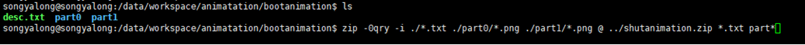

# LCM笔记


---

[跳转到readme](https://github.com/hfreeman2008/android_core_framework/blob/main/README-CN.md)

---

[P29_系统开发之tp](https://github.com/hfreeman2008/android_core_framework/blob/main/P29_%E7%B3%BB%E7%BB%9F%E5%BC%80%E5%8F%91%E4%B9%8Btp/%E7%B3%BB%E7%BB%9F%E5%BC%80%E5%8F%91%E4%B9%8Btp.md)

---

[<font face='黑体' color=#ff0000 size=40 >跳转到文章结尾</font>](#结束语)

---

# TFT-LCM  LCM移植

i. lk部分 
 

ii. kernel部分 

 

注意事项：驱动正常加载；LCM上电没有问题；


---

# lcm二供屏


  


kernel-4.19/drivers/misc/mediatek/lcm/ili9881c_dsi_wxga_boe_jl/ili9881c_dsi_wxga_boe_jl.c


---

# 修改开关机动画

i.制作开/关机动画


存放一个H56E的开机动画：bootanimation.zip

ii.制作命令：
```java
 zip -0qry -i ./*.txt ./part0/*.jpg ./part1/*.jpg @ ../bootanimation.zip *.txt part*
zip -0qry -i ./*.txt ./part0/*.jpg ./part1/*.jpg @ ../ shutanimation.zip *.txt part*
 
zip -0qry -i ./*.txt ./part0/*.png ./part1/*.png @ ../bootanimation.zip *.txt part*
zip -0qry -i ./*.txt ./part0/*.png ./part1/*.png @ ../shutanimation.zip *.txt part*
```




---

# 关机动画
Android 9.0 关机动画还需要做的操作：
 
frameworks/base/cmds/bootanimation/Android_disable.mk
device.mk
```mk
# Add for shutdownanimation
PRODUCT_PACKAGES += mtkbootanimation
PRODUCT_PACKAGES += libmtkbootanimation
#add end
```

ProjectConfig.mk
```java
#fix for shutdownaimation
XTK_CUST_SHUT_ANIMATION = yes
```


---

# 修改背光亮度
i.修改背光电流


ii.修改占空比

a.目前修改占空比的方法


b.目前不可取的方法

代码路径：kernel-4.9\drivers\misc\mediatek\video\common\pwm10\ddp_pwm.c

理论上修改没有问题，但做重新映射后就会出现黑屏现象（自动休眠后power键唤不醒背光灯）；

做法：修改函数 disp_pwm_level_remap

iii.修改背光曲线
手动调节背光的曲线，一般是在上层控制的
- 在上层进行修改
- 如果非要在底层修改（不建议），可以修改函数 led_set_brightness(led_cdev, state); 对state值做重新映射;代码路径：kernel-4.9\drivers\leds\led-class.c

---

```java

```


```java

```


```java

```


```java

```


---

[<font face='黑体' color=#ff0000 size=40 >跳转到文章开始</font>](#lcm笔记)

---

# 结束语

