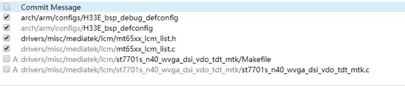
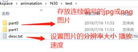

# LCM笔记


---

[跳转到readme](https://github.com/hfreeman2008/android_core_framework/blob/main/README-CN.md)

---

[P29_系统开发之tp](https://github.com/hfreeman2008/android_core_framework/blob/main/P29_%E7%B3%BB%E7%BB%9F%E5%BC%80%E5%8F%91%E4%B9%8Btp/%E7%B3%BB%E7%BB%9F%E5%BC%80%E5%8F%91%E4%B9%8Btp.md)

---

[<font face='黑体' color=#ff0000 size=40 >跳转到文章结尾</font>](#结束语)

---

# TFT-LCM  LCM移植

i. lk部分 
 

ii. kernel部分 

 

注意事项：驱动正常加载；LCM上电没有问题；


---

# lcm二供屏


  


kernel-4.19/drivers/misc/mediatek/lcm/ili9881c_dsi_wxga_boe_jl/ili9881c_dsi_wxga_boe_jl.c


---

# 修改开关机动画

i.制作开/关机动画



存放一个H56E的开机动画：bootanimation.zip

ii.制作命令：
```java
 zip -0qry -i ./*.txt ./part0/*.jpg ./part1/*.jpg @ ../bootanimation.zip *.txt part*
zip -0qry -i ./*.txt ./part0/*.jpg ./part1/*.jpg @ ../ shutanimation.zip *.txt part*
 
zip -0qry -i ./*.txt ./part0/*.png ./part1/*.png @ ../bootanimation.zip *.txt part*
zip -0qry -i ./*.txt ./part0/*.png ./part1/*.png @ ../shutanimation.zip *.txt part*
```


---

# 关机动画
Android 9.0 关机动画还需要做的操作：
 
frameworks/base/cmds/bootanimation/Android_disable.mk
device.mk
```mk
# Add for shutdownanimation
PRODUCT_PACKAGES += mtkbootanimation
PRODUCT_PACKAGES += libmtkbootanimation
#add end
```

ProjectConfig.mk
```java
#fix for shutdownaimation
XTK_CUST_SHUT_ANIMATION = yes
```


---

# 修改背光亮度
i.修改背光电流


ii.修改占空比

a.目前修改占空比的方法


b.目前不可取的方法

代码路径：kernel-4.9\drivers\misc\mediatek\video\common\pwm10\ddp_pwm.c

理论上修改没有问题，但做重新映射后就会出现黑屏现象（自动休眠后power键唤不醒背光灯）；

做法：修改函数 disp_pwm_level_remap

iii.修改背光曲线
手动调节背光的曲线，一般是在上层控制的
- 在上层进行修改
- 如果非要在底层修改（不建议），可以修改函数 led_set_brightness(led_cdev, state); 对state值做重新映射;代码路径：kernel-4.9\drivers\leds\led-class.c

---


# 添加CABC
i.首先需要打开feature config :
```java
CONFIG_MTK_AAL_SUPPORT=y
```

ii.LCM中添加代码：


 注意：
遇到的情况是：仅打开AAL，会出现屏幕越暗或者，某些APK打开，背光电流增大，其他地方背光电流小

---

# 修改开机logo
i.开机logo 制作
- 需要找一张分辨率正确图片，可以是jpg或png
- 通过 画图工具 转化为 24位的bmp图片
- 同时修改 uboot 及 kernel；根据所使用的分辨率文件夹名字(如fhd)来命名
 
ii.开机logo 代码路径及需要修改的文件


 vendor/mediatek/proprietary/bootable/bootloader/lk/Android.mk
```java
ifeq ($(TARGET_PRODUCT),H56A)
$(shell cp -rf ${LOCAL_PATH}/dev_${TARGET_PRODUCT}/* ${LOCAL_PATH}/dev/)
endif
```


iii.修改logo分辨率 （包括lk和project.mk）

以下仅仅是project.mk

BOOT_LOGO  值

```java
LCM_HEIGHT = 960
LCM_WEIGHT = 480
BOOT_LOGO = fwvga
```

---

# 修改AVDD&AVEE电压值
i.修改AVDD及AVEE电压

a.kernel 部分修改


b.Lk部分修改


ii.去除pmic 电压修改引起的中断

把中断引脚去掉；产生的原因是电压超出了对应的值


---

# 修改屏幕分辨率
project.mk


```java
LCM_HEIGHT = 960
LCM_WEIGHT = 480
```

---


# 录屏软件倒置

主要就是修改 MTK_LCM_PHYSICAL_ROTATION 和 DEFINES += MTK_LCM_PHYSICAL_ROTATION_HW，一般设置为默认的即可
kernel-4.4 / arch/arm/configs/D33B_bsp_debug_defconfig

```java
#CONFIG_MTK_LCM_PHYSICAL_ROTATION_HW=y
CONFIG_MTK_LCM_PHYSICAL_ROTATION="0"
```


vendor/mediatek/proprietary/bootable/bootloader/lk/project/D33A.mk

```java
MTK_LCM_PHYSICAL_ROTATION = 0
#DEFINES += MTK_LCM_PHYSICAL_ROTATION_HW
device / xthink/D33A/ProjectConfig.mk
MTK_LCM_PHYSICAL_ROTATION = 0
```

---


# 修改屏幕density
修改lcd_density的值   set lcd density 设置屏幕的dpi值
mk文件
```java
PRODUCT_DEFAULT_PROPERTY_OVERRIDES += ro.sf.lcd_density=369
```

system.prop
```java
ro.sf.lcd_density=369
```

---

# Antutu 检测
i.修改屏幕尺寸

若width 和 high 以厘米为单位，1英寸(in)=2.54厘米(cm)

计算公式：屏幕尺寸(英寸 inc)  =  sqrt(width*width + high*high) / 2.54; 

 kernel-4.4/drivers/misc/mediatek/lcm/rm67200_a4_h599tan01_qhd_mtk/rm67200_a4_h599tan01_qhd_mtk.c

```java
#define LCM_PHYSICAL_WIDTH			(68040)
#define LCM_PHYSICAL_HEIGHT			(136080)
```
ii.修改屏幕分辨率等
系统上层修改 (如和zhuoyi合作项目)
可以在系统上层检测到时antutu包名，然后返回需要的分辨率值即可；上面屏幕尺寸也是可以在此处修改的；但是主要针对安兔兔

---

# 使用安兔兔检查LCD尺寸显示错误
使用安兔兔检查LCD尺寸

结果：显示10.97inches（如附件）

预期结果：现在正常的显示6.517寸


kernel-4.9/drivers/misc/mediatek/lcm/ft8006s_hdPlus_dsi_vdo_tdt_mtk/ft8006s_hdPlus_dsi_vdo_tdt_mtk.c

```c
+/* physical size in um */
+#define LCM_PHYSICAL_WIDTH		(79700)
+#define LCM_PHYSICAL_HEIGHT		(145100)
..............
static void lcm_get_params(struct LCM_PARAMS *params)
{
	memset(params, 0, sizeof(struct LCM_PARAMS));
	params->type = LCM_TYPE_DSI;
	params->width = FRAME_WIDTH;
	params->height = FRAME_HEIGHT;
	//params->physical_width = LCM_PHYSICAL_WIDTH/1000;
	//params->physical_height = LCM_PHYSICAL_HEIGHT/1000;

+	params->physical_width = LCM_PHYSICAL_WIDTH/1000;
+	params->physical_height = LCM_PHYSICAL_HEIGHT/1000;
+	params->physical_width_um = LCM_PHYSICAL_WIDTH;
+	params->physical_height_um = LCM_PHYSICAL_HEIGHT;
```

---

# LCM 兼容
i.不同 IC 做兼容
根据 lcm_compare_id 返回值


ii.同一颗ic做兼容

这个是在 lcm_compare_id 中读取 LCM_ID 引脚的高低电平，来决定是否加载该驱动（屏会主动拉低或拉高）；


---

# 工模中添加屏信息

工模读取的节点信息：sys/class/graphics/fb0/mtk_fb_panel_name
 
kernel-4.4 / drivers/misc/mediatek/video/mt6771/videox/mtkfb.c

```c
/* fix for factory test 2019-7-23*/
char lcm_name[32]={ 0 };
/* fix for factory test end 2019-7-23*/

.....
static int __parse_tag_videolfb(struct device_node *node)
{
	struct tag_videolfb *videolfb_tag = NULL;
	unsigned long size = 0;

	videolfb_tag = (struct tag_videolfb *)of_get_property(node, "atag,videolfb", (int *)&size);
	if (videolfb_tag) {
		memset((void *)mtkfb_lcm_name, 0, sizeof(mtkfb_lcm_name));
		strncpy((char *)mtkfb_lcm_name, videolfb_tag->lcmname, sizeof(mtkfb_lcm_name));
		mtkfb_lcm_name[strlen(videolfb_tag->lcmname)] = '\0';

    	/* add for factory test 2019-7-23*/
		if(!strcmp(mtkfb_lcm_name,"ili9881h_hdplus_dsi_vdo_tianma_rt5081_mtk_drv")) 
		{
			strcpy((char *)lcm_name, "ili9881h");
			lcm_name[strlen("ili9881h")] = '\0';
		}
		else if(!strcmp(mtkfb_lcm_name,"nt36525_hdplus_dsi_vdo_truly_rt5081_drv")) 
		{
			strcpy((char *)lcm_name, "nt36525_truly");
			lcm_name[strlen("nt36525_truly")] = '\0';
		}
		else if(!strcmp(mtkfb_lcm_name,"nt36525_hdplus_dsi_vdo_tianma_rt5081_drv")) 
		{
			strcpy((char *)lcm_name, "nt36525_tianma");
			lcm_name[strlen("nt36525_tianma")] = '\0';
		}
		else
		{
			strcpy((char *)lcm_name, "none");
			lcm_name[strlen("none")] = '\0';
		}
		/* add for factory test end 2019-7-23*/
		lcd_fps = videolfb_tag->fps;
		if (lcd_fps == 0)
			lcd_fps = 6000;
		islcmconnected = videolfb_tag->islcmfound;
		vramsize = videolfb_tag->vram;
		fb_base = videolfb_tag->fb_base;
		is_lcm_inited = 1;
		return 0;
```

 kernel-4.4 / drivers/video/fbdev/core/fbsysfs.c
```c
#define FB_SYSFS_FLAG_ATTR 1
/* fix for lcm fatory test 2019-7-23*/
extern char lcm_name[32];
/* fix for lcm fatory test end 2019-7-23*/
......
/* fix for lcm fatory test 2019-7-23*/
static ssize_t show_lcmname(struct device *device,
			 struct device_attribute *attr, char *buf)
{
	return snprintf(buf, PAGE_SIZE, "%s\n", lcm_name);
}
/* fix for lcm fatory test end 2019-7-23*/

/* When cmap is added back in it should be a binary attribute
 * not a text one. Consideration should also be given to converting
 * fbdev to use configfs instead of sysfs */
static struct device_attribute device_attrs[] = {
	__ATTR(bits_per_pixel, S_IRUGO|S_IWUSR, show_bpp, store_bpp),
	__ATTR(blank, S_IRUGO|S_IWUSR, show_blank, store_blank),
	__ATTR(console, S_IRUGO|S_IWUSR, show_console, store_console),
	__ATTR(cursor, S_IRUGO|S_IWUSR, show_cursor, store_cursor),
	__ATTR(mode, S_IRUGO|S_IWUSR, show_mode, store_mode),
	__ATTR(modes, S_IRUGO|S_IWUSR, show_modes, store_modes),
	__ATTR(pan, S_IRUGO|S_IWUSR, show_pan, store_pan),
	__ATTR(virtual_size, S_IRUGO|S_IWUSR, show_virtual, store_virtual),
	__ATTR(name, S_IRUGO, show_name, NULL),
	__ATTR(stride, S_IRUGO, show_stride, NULL),
	__ATTR(rotate, S_IRUGO|S_IWUSR, show_rotate, store_rotate),
	__ATTR(state, S_IRUGO|S_IWUSR, show_fbstate, store_fbstate),
	/* fix for lcm fatory test 2019-7-23*/
	__ATTR(mtk_fb_panel_name, S_IRUGO, show_lcmname, NULL),
	/* fix for lcm fatory test end 2019-7-23*/
#ifdef CONFIG_FB_BACKLIGHT
	__ATTR(bl_curve, S_IRUGO|S_IWUSR, show_bl_curve, store_bl_curve),
#endif
};
```

---

# 修改LCM帧率
修改 video 屏帧率
 kernel-4.4 / drivers/misc/mediatek/lcm/hct_ft8719p_dsi_vdo_hlt_mtk/hct_ft8719p_dsi_vdo_hlt_mtk.c
```java
params->dsi.PLL_CLOCK= 625; //580;//546, 230 450  550
```

---

# 墨水-LCM

1).lk读取vcom电压


MTK 释放的代码在文件夹 spi_lk_mt6755 

2).kernel部分
```java
i.eink_panel
kernel-4.4/drivers/misc/mediatek/lcm/tc358762_brige_dsi_vdo_tdt_mtk

ii.PMIC ic
kernel-4.4/drivers/misc/mediatek/pmic/sy7636a_driver.c

iii.epd flash
kernel-4.4/drivers/misc/mediatek/video/mt6763/videox/eink_spi_driver.c

iv.brige ic
kernel-4.4/drivers/misc/mediatek/video/mt6763/videox/mipi_tc358762_dsi2dpi.c 
```


3).vendor 部分
i.SWTCON
vendor/xthink/proprietary/swtcon

4).framework 部分
i.surfaceflinger 与 SWTCON交互代码
frameworks/native/services/surfaceflinger 

5).关机充电电源控制部分
vendor\mediatek\proprietary\bootable\bootloader\lk\platform\mt6763\mt_logo.c
vendor\mediatek\proprietary\external\charger
vendor\mediatek\proprietary\external\libshowlogo
 

6).开机电源控制部分
vendor\mediatek\proprietary\bootable\bootloader\lk\platform\mt6763\mt_logo.c
system\frameworks\native\services\surfaceflinger\ 

7).关机背光设置为0 
 frameworks/base/core/res/res/values/config.xml
```java
<!-- fix for starting 20-19-5-19-->
<!--<integer name="config_screenBrightnessSettingDefault">102</integer>-->
<integer name="config_screenBrightnessSettingDefault">0</integer>
<!-- fix for starting 20-19-5-19 end-->
```


8).读vcom 值 
 添加了 读 VCOM 节点的值，可以做到工模中
 kernel-4.4/drivers/misc/mediatek/video/mt6763/videox/eink_spi_driver.c


---

# lcm 旋转方向
vendor/mediatek/proprietary/bootable/bootloader/lk/project/x011_k61v1_64_bsp.mk
```java
#DEFINES += MTK_LCM_PHYSICAL_ROTATION_HW
```

---

# lcm配置:

kernel-4.4 / arch/arm/configs/h33_bsp_1g_defconfig
kernel-4.4 / arch/arm/configs/h33_bsp_1g_debug_defconfig

LCM:
```java
CONFIG_CUSTOM_KERNEL_LCM="gc9503_wvga_dsi_vdo_tdt_mtk"
CONFIG_LCM_HEIGHT="1560"
CONFIG_MTK_LCM_PHYSICAL_ROTATION_HW=n
```

ProjectConfig.mk
```java
#lcm
LCM_HEIGHT = 1520
LCM_WIDTH = 1080
```


vendor/mediatek/proprietary/bootable/bootloader/lk / project/x017_k62v1_64_bsp.mk
```java
#project
DEFINES += LK_SUPPORT_x017_k62v1_64_bsp=1
#lcm
CUSTOM_LK_LCM="ili988h_dsi_vdo_tdt_mtk"
BOOT_LOGO := hdplus1560
```

---


# 屏的背光亮度设置
kernel-4.9 / arch/arm64/boot/dts/mediatek/x017_k62v1_64_bsp.dts
```java
/********** modified dts begain************/
&mt6370_pmu {
	bled {
		mt,max_bled_brightness = <610>;
	};
};
/********** modified dts end************/
```


---

# 双屏-LCM 

## 底层驱动

下面的就是sub 屏的驱动代码（起作用的是lcm/sub_lcm_spi.c文件）；

采用spi 四线传输


 采用GPIO模拟spi三线传输


## 关机充电过程及图片
i.添加关机充电逻辑  

vendor/mediatek/proprietary/external/charger /bootlogo.cpp


vendor/mediatek/proprietary/external/charger / charging_control.cpp


ii.添加充电logo图片
charge_logo.h 文件，每张图片都是一个数组


---

## 添加suspend及resume


---

## 开机logo

boot_logo.h 文件，每张图片都是一个数组 

kernel-4.4 / drivers/misc/mediatek/lcm/sub_lcm_logo/boot_logo.h
kernel-4.4 / drivers/misc/mediatek/lcm/sub_lcm_logo/charge_logo.h

vendor/mediatek/proprietary/bootable/bootloader/lk / project/x017_k62v1_64_bsp.mk
```java
#project
DEFINES += LK_SUPPORT_x017_k62v1_64_bsp=1
#lcm
CUSTOM_LK_LCM="ili988h_dsi_vdo_tdt_mtk"
BOOT_LOGO := hdplus1560
```

---

## 1688模式 
其中sublcd_name 节点用于1688 工模显示副屏信息


---

[<font face='黑体' color=#ff0000 size=40 >跳转到文章开始</font>](#lcm笔记)

---

# 结束语

