# P29: 系统开发之tp


---

[跳转到readme](https://github.com/hfreeman2008/android_core_framework/blob/main/README-CN.md)

---

[LCM笔记](https://github.com/hfreeman2008/android_core_framework/blob/main/P29_%E7%B3%BB%E7%BB%9F%E5%BC%80%E5%8F%91%E4%B9%8Btp/LCM%E7%AC%94%E8%AE%B0.md)

---

[<font face='黑体' color=#ff0000 size=40 >跳转到文章结尾</font>](#结束语)

---

# touchscreen屏幕
kernel\msm-4.9\drivers\input\touchscreen

---
# 屏幕架构
Frameworks

touch drive

i2c core

touch(interrut,gpio,VDD,VCC,RST,data sheet)

---

# tp和lcm介绍
1. LCM指的是液晶显示屏，即Liquid Crystal Module，它是手机屏幕的主要部分，用于显示图像和信息。

2. TP指的是触摸屏，即Touch Panel，它是手机屏幕的一部分，用于接收用户的触摸操作。

3. AA区域，全称为Active Area，指的是屏幕的可视区域。这个区域包含了屏幕上可以进行交互的显示部分，用户可以看到并对其进行操作。


---

# TP的硬件接口

引脚 | 名称及作用
-|-|
VDD | TP供电
RESET | 复位引脚
EINT | 中断引脚
SCL SDA | I2C接口


​ TP的工作方式比较简单：
- 上电后通过RESET脚控制TP芯片复位；
- 通过I2C接口给TP设置参数或读取TP数据；
- TP有触摸操作时通过EINT脚通知主控；

---

# 一个Demo
kernel\msm-4.9\drivers\input\touchscreen

我们项目的物料为：gt1x，我们进入此目录，我们先查看probe：

grep -nr probe

```java
kernel/msm-4.9$ grep -rni "probe"  drivers/input/touchscreen/gt1x/
drivers/input/touchscreen/gt1x/docs/RevisionLog.txt:10:         - Add fallback flow to probe function.
drivers/input/touchscreen/gt1x/gt1x.c:761: * gt1x_ts_probe -   I2c probe.
drivers/input/touchscreen/gt1x/gt1x.c:766:static int gt1x_ts_probe(struct i2c_client *client, const struct i2c_device_id *id)
drivers/input/touchscreen/gt1x/gt1x.c:903:      GTP_ERROR("GTP probe failed:%d", ret);
drivers/input/touchscreen/gt1x/gt1x.c:996:      .probe = gt1x_ts_probe,
```

我们查看：vi  gt1x.c +996

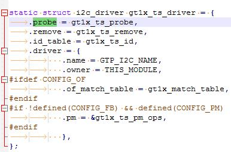

我们再看看方法gt1x_ts_probe：

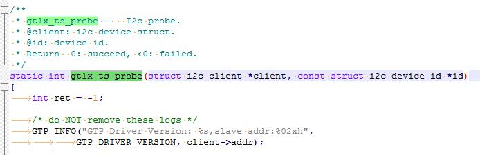

我们再搜索compatible：

grep -rni "compatible" ./

./gt1x.c:776:           {.compatible = "goodix,gt1x",},


查看：

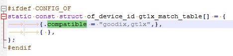

进入目录：kernel/msm-4.9/arch/arm64/boot/dts/qcom，查找“goodix,gt1x”：

grep -nr goodix,gt1x

```java
kernel/msm-4.9$ grep -rni "goodix,gt1x"  arch/arm64/boot/dts/qcom/
arch/arm64/boot/dts/qcom/sdm710-i7s-qrd.dtsi:257:                compatible = "goodix,gt1x";
```

对就查看此配制文件：

 vi sdm710-i7s-qrd.dtsi +257

 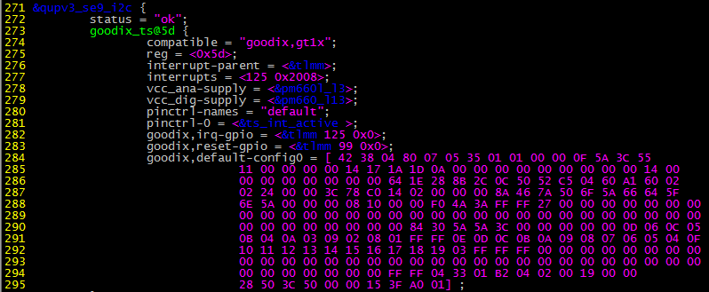


gt1x.c 驱动加载:

```java
module_init(gt1x_ts_init);
```
调用gt1x_ts_init函数，作用是注册一个i2c驱动:

```java
/**   
 * gt1x_ts_init - Driver Install function.
 * Return   0---succeed.
 */
static int __init gt1x_ts_init(void)
{
	//GTP_INFO("GTP driver installing...");
	return i2c_add_driver(&gt1x_ts_driver);
}
```
再查看变量gt1x_ts_driver:

```java
static struct i2c_driver gt1x_ts_driver = {
	.probe = gt1x_ts_probe,
	.remove = gt1x_ts_remove,
	.id_table = gt1x_ts_id,
	.driver = {
		   .name = GTP_I2C_NAME,
		   .owner = THIS_MODULE,
#ifdef CONFIG_OF
		   .of_match_table = gt1x_match_table,
#endif
		   },
};
```

这个gt1x_ts_driver.driver.name = GTP_I2C_NAME，去们可以查看:

```java
cat /proc/bus/input/devices
```

probe函数内容gt1x_ts_probe:

```java
/**
 * gt1x_ts_probe -   I2c probe.
 * @client: i2c device struct.
 * @id: device id.
 * Return  0: succeed, <0: failed.
 */
static int gt1x_ts_probe(struct i2c_client *client, const struct i2c_device_id *id)
{
	int ret = -1;
	struct goodix_ts_data *ts;

	/* do NOT remove these logs */
	GTP_INFO("GTP Driver Version: %s,slave addr:%02xh",
			GTP_DRIVER_VERSION, client->addr);

	gt1x_i2c_client = client;
	spin_lock_init(&irq_lock);
```
调用到linux-3.0.86/drivers/input/input.c中的一些方法（实质上注册input设备，生成设备节点等什么都是这个东西干的）

---

# touch panel 驱动定位

通过：

```java
adb shell cat /proc/bus/input/devices
```


```java
I: Bus=0018 Vendor=dead Product=beef Version=28bb
N: Name="goodix-ts"
P: Phys=input/ts
S: Sysfs=/devices/virtual/input/input3
U: Uniq=
H: Handlers=kgsl event3 cpufreq
B: PROP=2
B: EV=b
B: KEY=400 c00000000000000 0 0 0 0
B: ABS=661800000000000
```

cat /dev/input/event0(根据实际情况分析具体是那个节点),最终确定tp的驱动：

```java
N: Name="goodix-ts"
```

然后去内核中确定源码是：

```java
LINUX\android\kernel\msm-4.9\drivers\input\touchscreen\goodix.c
```

确定dtsi：
```java
grep -rni  --include={*.dts,*.dtsi} "goodix-ts"  ./
```
vendor\qcom\proprietary\devicetree-4.19\qcom\sc780-dts\bengal-qrd.dtsi 中一个tp touch的定义：
```java
&qupv3_se2_i2c {
	status = "okay";
	qcom,i2c-touch-active="chipsemi,chsc_cap_touch";

	smtouch@2E {
		compatible = "chipsemi,chsc_cap_touch";
		reg = <0x2E>;
		interrupt-parent = <&tlmm>;
		interrupts = <80 0x2008>;
		//vdd-supply = <&pm8916_l17>;
		vio-supply = <&L9A>;
		chipsemi,int-gpio = <&tlmm 80 0x2008>;
		chipsemi,rst-gpio = <&tlmm 71 0x00>;
		chipsemi,vdd-en-gpio = <&tlmm 97 0x00>;
		pinctrl-names = "pmx_ts_active","pmx_ts_suspend","pmx_ts_release","pmx_ts_int_active";
		pinctrl-0 = <&ts_reset_active>;
		pinctrl-1 = <&ts_int_suspend &ts_reset_suspend>;
		pinctrl-2 = <&ts_release>;
		pinctrl-3 = <&ts_int_active>;

		panel = <&dsi_sc780_st7785m_qvga_video>;
	};
};
```

配置开关一般在这种文件中：

```java
kernel/msm-4.19/arch/arm64/configs/vendor/sc780_defconfig
kernel/msm-4.19/arch/arm64/configs/vendor/sc780-perf_defconfig
```

---

# Qualcomm 平台触摸屏驱动移植

https://blog.csdn.net/weijory/article/details/72733155

调试相关经验:

一般TP驱动开发，屏产都会给驱动代码或者PATCH，这时主要合代码进去。

一般找代码内现有的一个TP驱动，按它的添加。主要：

1. 把驱动文件放入kernel\drivers\input\touchscreen\，
2. 修改kconfig和Makefile，加入需要根据宏才能编进去，那么需要在deconfig配置文件中设置为Y.
3. 在DTSI中加入该TP的配置。
4. 编译boot，在out/target/product/msmXXX/obj/KERNEL_OBJ/driver/input/touchscreen/下，看是否有.o文件没有，有则编译成功。
5. 把新的boot文件刷入板子，查看内核log，cat proc/kmsg，看是否有该TP驱动的打印信息。
6. 根据打印信息，判断出错的问题。

一般问题，中断注册不上，资源分配不成功，I2C设备通信失败。

一些经验，I2C总线不通，可能是因为I2C供电的电源没有供电，或者该总线上挂的设备太多影响的，前期调最好I2C总线上，只挂一个设备。

若probe成功，可在中断或者工作线程里面加一些打印log。
在adb shell进入终端，输入getevent，手按TP，查看是否有数据打出，对于该TP的输入设备。

---

# 一个驱动移植Demo


 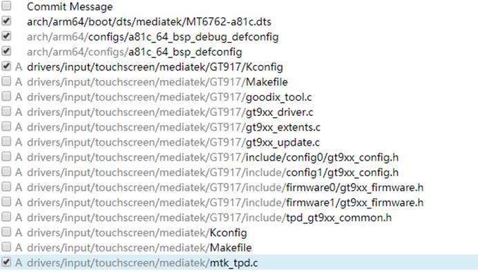

---

# 关闭TP手势  disable TP gesture
kernel-4.9/drivers/input/touchscreen/mediatek/oreo/ilitek.h

```java
//#define ENABLE_GESTURE			ENABLE
#define ENABLE_GESTURE			DISABLE
```

---

# TP最大触摸点数
kernel-4.9 / drivers/input/touchscreen/mediatek/oreo/ilitek.h
```java
#define MAX_TOUCH_NUM				5  //10
```

---

# 设置虚拟按键位置
修改TP的虚拟按键位置
 kernel-4.4 / arch/arm64/boot/dts/mediatek/MT6739-h05g.dts


 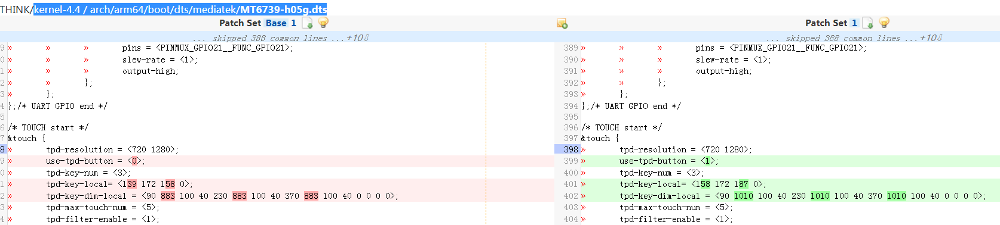


---

# 关闭虚拟按键

vendor/mediatek/proprietary/packages/apps/SettingsProvider/res/values/defaults.xml
```java
<bool name="config_systemui_virtual_key_mode">true</bool>
```

ProductFeatureVIA_A4/product_features
```java
FEATURE_SYSTEMUI_VIRTUAL_KEY_MODE = true
```


---


# TouchScreen兼容

 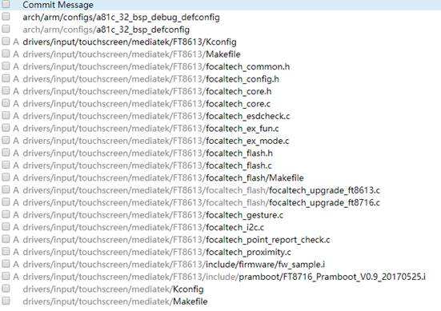

 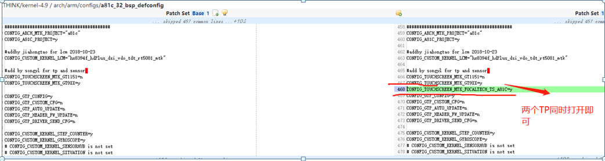


---

# max tp number 最大触摸点数：

kernel-4.9/arch/arm64/boot/dts/mediatek/x014_k63v2_64_bsp.dts
```java
&touch {
	tpd-max-touch-num = <10>;
};
```

tp firmware
```java
kernel-4.4/drivers/input/touchscreen/mediatek/synaptics_dsx/synaptics/SynapticsImage.h
kernel-4.9 / arch/arm64/boot/dts/mediatek/x016_k61v1_64_bsp.dts

&touch {
	tpd-filter-enable = <0>;
	tpd-max-touch-num = <10>;
};
```

---

# 添加一个touchscreen的goodix GT1X驱动
kernel/msm-4.9/drivers/input/touchscreen/Kconfig
```java
config TOUCHSCREEN_GOODIX_GT1X
        bool "GOODIX GT1X Touchscreen Driver"
        depends on I2C
        help
          Say Y here if you have a GOODIX GT1X  Touchscreen.
          If unsure, say N.
source "drivers/input/touchscreen/gt1x/Kconfig"
```

kernel/msm-4.9/drivers/input/touchscreen/Makefile
```java
obj-$(CONFIG_TOUCHSCREEN_GOODIX_GT1X)   += gt1x/
```

gt1x代码：

 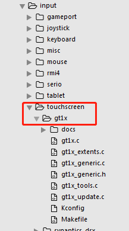

最后在自己的项目中配置此参数：

kernel/msm-4.9/arch/arm64/configs/sdm710_g3-perf_defconfig

kernel/msm-4.9/arch/arm64/configs/sdm710_g3_defconfig

```java
CONFIG_TOUCHSCREEN_GOODIX_GT1X=y
```


---

# 添加chsc_cap_touch驱动
1.确认tp的名字chsc_cap_touch：
```java
/proc/bus/input # cat devices
```

 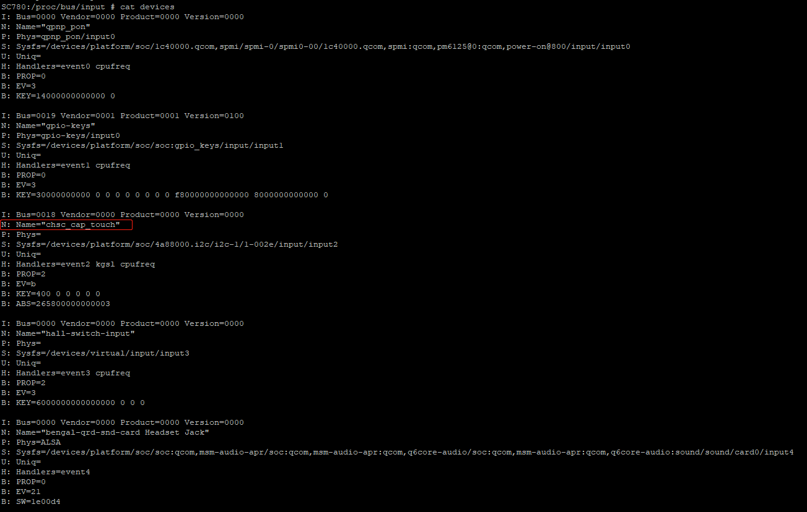

2.确认dps中的定义：
```java
grep -rni  --include={*.dts,*.dtsi}  "chsc_cap_touch"  ./
```

vendor/qcom/proprietary/devicetree-4.19/qcom/sc780-dts/bengal-qrd.dtsi

```java
&qupv3_se2_i2c {
	status = "okay";
	qcom,i2c-touch-active="chipsemi,chsc_cap_touch";
	smtouch@2E {
		compatible = "chipsemi,chsc_cap_touch";
		reg = <0x2E>;
		interrupt-parent = <&tlmm>;
		interrupts = <80 0x2008>;
		//vdd-supply = <&pm8916_l17>;
		vio-supply = <&L9A>;
		chipsemi,int-gpio = <&tlmm 80 0x2008>;
		chipsemi,rst-gpio = <&tlmm 71 0x00>;
		chipsemi,vdd-en-gpio = <&tlmm 97 0x00>;
		pinctrl-names = "pmx_ts_active","pmx_ts_suspend","pmx_ts_release","pmx_ts_int_active";
		pinctrl-0 = <&ts_reset_active>;
		pinctrl-1 = <&ts_int_suspend &ts_reset_suspend>;
		pinctrl-2 = <&ts_release>;
		pinctrl-3 = <&ts_int_active>;
		panel = <&dsi_sc780_st7785m_qvga_video>;
	};
};
```


3.确定代码位置：
```java
grep -rni  --include=*.c  "chipsemi,chsc_cap_touch"  ./kernel/ ./vendor/qcom/
```


kernel/msm-4.19/drivers/input/touchscreen/chsc5xxx/qual_core.c
```java
static const struct of_device_id sm_of_match[] = 
{
    {.compatible = "chipsemi,chsc_cap_touch", },
    {}
};
```

4.配置文件：
kernel/msm-4.19\drivers\input\touchscreen\chsc5xxx\Makefile
```java
#semitouch touchpanel driver
obj-$(CONFIG_TOUCHSCREEN_CHSC5XXX)      += semi_touch_driver.o
semi_touch_driver-objs += basic_util.o
semi_touch_driver-objs += i2c_communication.o
semi_touch_driver-objs += qual_core.o
semi_touch_driver-objs += semi_touch_function.o
semi_touch_driver-objs += semi_touch_upgrade.o
semi_touch_driver-objs += semi_touch_apk.o
semi_touch_driver-objs += semi_touch_device.o
kernel\msm-4.19\drivers\input\touchscreen\chsc5xxx\Kconfig
#
# ChipSemi CHSC5XXX Touchscreen driver
#
config CHSC5XXX_TOUCHPANEL_DRIVER
    tristate "ChipSemi CHSC5XXX touchpanel driver"
    depends on TOUCHSCREEN_CHSC5XXX
    default y
    help
      This is the main file for touchpanel driver for ChipSemi CHSC5XXX
      touchscreens.
      Say Y here if you have a ChipSemi CHSC5XXX touchscreen connected
      to your system.
      If unsure, say N.
      To compile this driver as a module, choose M here: the
      module will be called semi_touch_driver.
config SEMI_TOUCH_AUTO_UPDATE_EN
    tristate "ChipSemi CHSC5XXX touchpanel auto update support"
    depends on CHSC5XXX_TOUCHPANEL_DRIVER
    default n
    help
      This enables support for firmware update for ChipSemi CHSC5XXX
      touchscreens.
      Say Y here if you have a ChipSemi CHSC5XXX touchscreen connected
      to your system.
      If unsure, say N.
      To compile this driver as a module, choose M here: the
      module will be called semi_touch_upgrade.
config SEMI_TOUCH_APK_NODE_EN
    tristate "ChipSemi CHSC5XXX Node for debuging"
    depends on CHSC5XXX_TOUCHPANEL_DRIVER
    default n
    help
      This is application debug interface support for ChipSemi CHSC5XXX
      touchscreens.
      Say Y here if you want to have a Android app debug interface
      to your system.
      If unsure, say N.
      To compile this driver as a module, choose M here: the
      module will be called semi_touch_apk.
```


./kernel/msm-4.19/arch/arm64/configs/vendor/sc780_defconfig

./kernel/msm-4.19/arch/arm64/configs/vendor/sc780-perf_defconfig

```java
CONFIG_TOUCHSCREEN_CHSC5XXX=y
```

---

# 开机不加载TP固件EVT板子
kernel/msm-4.9/drivers/input/touchscreen/gt1x/Kconfig
```java
config GTP_DRIVER_SEND_CFG
	bool "GTP_DRIVER_SEND_CONFIG"
	default n
	help
	Say Y here if you want touch driver send chip config
	data to hardware.

	If unsure, say N.
```

---

# 配置TP:
kernel-4.4 / arch/arm/configs/h33_bsp_1g_defconfig
kernel-4.4 / arch/arm/configs/h33_bsp_1g_debug_defconfig
```java
CONFIG_TOUCHSCREEN_MTK_ILITEK=y
```


---

# TP报点不准
kernel-4.9/drivers/input/touchscreen/mediatek/mtk_tpd.c

```c
/* touch panel probe */
static int tpd_probe(struct platform_device *pdev)
{
	int touch_type = 1;	/* 0:R-touch, 1: Cap-touch */
**************

#ifdef CONFIG_LCM_WIDTH
		ret = kstrtoul(CONFIG_LCM_WIDTH, 0, &tpd_res_x);
		if (ret < 0) {
			pr_info("Touch down get lcm_x failed");
			return ret;
		}
		TPD_RES_X = tpd_res_x;
		ret = kstrtoul(CONFIG_LCM_HEIGHT, 0, &tpd_res_x);
		if (ret < 0) {
			pr_info("Touch down get lcm_y failed");
			return ret;
		}
		TPD_RES_Y = tpd_res_y;
#endif
#endif
	}

	if (2560 == TPD_RES_X)
		TPD_RES_X = 2048;
+#ifndef	CONFIG_TOUCHSCREEN_MTK_FOCALTECH_TS_FT8006S
	if (1600 == TPD_RES_Y)
		TPD_RES_Y = 1536;
+#endif
	pr_debug("mtk_tpd: TPD_RES_X = %lu, TPD_RES_Y = %lu\n",
		TPD_RES_X, TPD_RES_Y);

	tpd_mode = TPD_MODE_NORMAL;
```

---

# LCD使用fpstest测试屏幕帧率只有20帧

fpstest.apk   测试屏幕fps的apk

 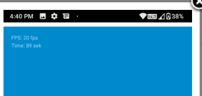

lcm 帧率 60fps
kernel-4.9/drivers/misc/mediatek/lcm/ft8006s_hdPlus_dsi_vdo_tdt_mtk/ft8006s_hdPlus_dsi_vdo_tdt_mtk.c

```c
static void lcm_get_params(struct LCM_PARAMS *params)
{
	memset(params, 0, sizeof(struct LCM_PARAMS));
............
	params->dsi.horizontal_active_pixel 			= FRAME_WIDTH;

+#if (LCM_DSI_CMD_MODE)
+	params->dsi.PLL_CLOCK = 505;	/* this value must be in MTK suggested table */
+#else
+	params->dsi.PLL_CLOCK = 300;//97;//97;//285; //220;	/* this value must be in MTK suggested table */
+#endif
```

---

# 刷机后开机不待机前屏幕帧率只有20帧待机唤醒 后恢复正常
vendor/mediatek/proprietary/bootable/bootloader/lk / dev/lcm/ft8006s_hdPlus_dsi_vdo_tdt_mtk/ft8006s_hdPlus_dsi_vdo_tdt_mtk.c

```c
#if (LCM_DSI_CMD_MODE)
	params->dsi.PLL_CLOCK = 505;	/* this value must be in MTK suggested table */
#else
	params->dsi.PLL_CLOCK = 300;//97;//285; //220;	/* this value must be in MTK suggested table */
#endif

```

---

# 屏幕默认休眠时间是1分钟，等屏幕变为半亮时点击屏幕点亮
1.屏幕默认休眠时间是1分钟，等屏幕变为半亮时点击屏幕点亮

2.再将屏幕休眠时间改为15秒，屏幕不会自动熄屏。

```java
这个是android的一个新的feature，主要实现是通过类ScreenUndimDetector：
其类说明为：
/**
 * Detects when user manually undims the screen (x times) and acquires a wakelock to keep the screen
 * on temporarily (without changing the screen timeout setting).
 */
中文翻译为：

检测当用户手动解锁屏幕（x次）,即使用户不更改屏幕超时设置，也会获取唤醒锁定，以暂时(10分钟)保持屏幕亮。
这个功能针对用户多次主动亮屏，保持亮屏10分钟，所以是正常的逻辑，直接关闭。
```


---

# 显示TP报点

关于这个显示TP报点的问题，在系统和app层的源码非常之简单，只有一个Activity，具体源码为：
(1)development/apps/Development/src/com/android/development/PointerLocation.java
```java
public class PointerLocation extends Activity {
 @Override
protected void onCreate(Bundle icicle) {
 super.onCreate(icicle);
 setContentView(new PointerLocationView(this));
 
 // Make the screen full bright for this activity.
 WindowManager.LayoutParams lp = getWindow().getAttributes();
 lp.screenBrightness = 1.0f;
 getWindow().setAttributes(lp);
 }
}
```

这个文件中是定义了这个显示报点的界面。

(2) development/apps/Development/AndroidManifest.xml 
这个文件是定义了此activity
```xml
<activity android:name="PointerLocation" android:label="Pointer Location"
android:theme="@android:style/Theme.Black.NoTitleBar.Fullscreen"
android:configChanges="keyboard|keyboardHidden|navigation|orientation">
<intent-filter>
<action android:name="android.intent.action.MAIN" />
<category android:name="android.intent.category.TEST" />
</intent-filter>
</activity>
```


(3) frameworks/base/core/java/com/android/internal/widget/PointerLocationView.java
这个是最核心的类，其主要功能是显示自定义的一个view，此view显示按点和用户按点轨迹trace信息。
所以我们可以看出，在上层应用中，这里只是一个被动的tp按点信息显示功能，其所有的逻辑显示都是根据tp按点信息来显示的，所以如果有问题，一般都是要考虑tp按点的数据有问题。

根据前面处理的此界面的tp按点问题的经验，主要是二个方面的问题：
1. tp驱动的配置，精确度，导致问题；
2. tp的固件版本不对，导致问题；

看现象，大部分都是正常，只是概率的出现一些问题，我怀疑可能是与tp的按点精确度，或者tp报点速度有关系。

所以，我建议请这二个方向的工程师check一下，如果要调试，也可以在PointerLocationView.java添加日志来追踪问题。

---

# LCM笔记


[LCM笔记](https://github.com/hfreeman2008/android_core_framework/blob/main/P29_%E7%B3%BB%E7%BB%9F%E5%BC%80%E5%8F%91%E4%B9%8Btp/LCM%E7%AC%94%E8%AE%B0.md)


---
# fpstest

fpstest.apk

---

# 参考资料

1.Touch--驱动部分理解

https://blog.csdn.net/cassie_huang/article/details/53422252

2.linux驱动由浅入深系列：输入子系统之一(input子系统概述、应用层读取event)

https://blog.csdn.net/radianceblau/article/details/55046812

3.linux驱动由浅入深系列：输入子系统之二(编写一个gpio_key驱动)

https://blog.csdn.net/radianceblau/article/details/56290469

4.linux驱动由浅入深系列：输入子系统之三(应用层模拟input_event)

https://blog.csdn.net/radianceblau/article/details/56487185

5.linux驱动由浅入深系列：基于高通平台分析触摸屏(TP)、虚拟按键驱动

https://blog.csdn.net/radianceblau/article/details/76687690

6.Android getevent用法详解

https://www.cnblogs.com/lialong1st/p/9093851.html


---

[<font face='黑体' color=#ff0000 size=40 >跳转到文章开始</font>](#p29-系统开发之tp)


---

[下一篇文章](https://github.com/hfreeman2008/android_core_framework/blob/main/P30_%E7%B3%BB%E7%BB%9F%E5%BC%80%E5%8F%91%E4%B9%8BRRO/%E7%B3%BB%E7%BB%9F%E5%BC%80%E5%8F%91%E4%B9%8BRRO.md)

---

# 结束语

