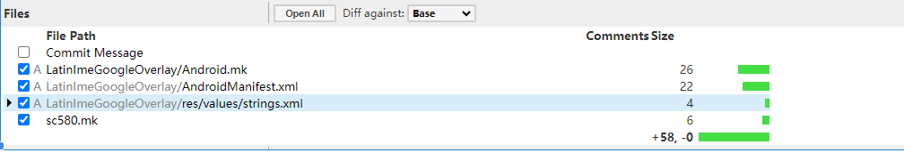

# P30: 系统开发之RRO


---

[跳转到readme](https://github.com/hfreeman2008/android_core_framework/blob/main/README-CN.md)


---

[<font face='黑体' color=#ff0000 size=40 >跳转到文章结尾</font>](#结束语)

---

[上一篇文章 P29_系统开发之tp](https://github.com/hfreeman2008/android_core_framework/blob/main/P29_%E7%B3%BB%E7%BB%9F%E5%BC%80%E5%8F%91%E4%B9%8Btp/%E7%B3%BB%E7%BB%9F%E5%BC%80%E5%8F%91%E4%B9%8Btp.md)


---

# RRO作用

三方应用的问题，一般我们是没有办法处理。

但是对于三方应用的资源文件，android提供了一种RRO的方式来替换三方应用的资源文件，这样我们就可以修改三方应用的资源，包括字符串，图片等；

RRO(Android 运行时资源替换----Runtime Resource Overlay)

对于三方应用，所有的资源文件，我们都可以采用这个RRO overlay的方法来修改资源文件。

---

# rro overlay谷歌输入法的strings

mk文件添加应用：

```java
PRODUCT_PACKAGES += LatinImeGoogleOverlay
```

LatinImeGoogleOverlay应用

LatinImeGoogleOverlay\Android.mk

```mk
LOCAL_PATH := $(call my-dir)
include $(CLEAR_VARS)
LOCAL_MODULE_TAGS := optional
LOCAL_SRC_FILES := $(call all-subdir-java-files)
#LOCAL_RESOURCE_DIR := $(LOCAL_PATH)/res
LOCAL_SDK_VERSION := current
LOCAL_PACKAGE_NAME := LatinImeGoogleOverlay
LOCAL_MODULE_PATH := $(TARGET_OUT_VENDOR)/overlay
LOCAL_CERTIFICATE := platform
include $(BUILD_PACKAGE)
```

LatinImeGoogleOverlay\AndroidManifest.xml

```xml
<manifest xmlns:android="http://schemas.android.com/apk/res/android"
        package="com.google.android.inputmethod.latin.overlay"
        android:versionCode="1"
        android:versionName="1.0">
        <application android:hasCode="false" />
        <overlay android:targetPackage="com.google.android.inputmethod.latin" android:priority="1200" android:isStatic="true"/>
</manifest>
```


LatinImeGoogleOverlay\res\values\strings.xml
```xml
<?xml version="1.0" encoding="utf-8"?>
<resources>
<string name="pref_def_value_keyboard_height_ratio">0.8</string>
</resources>
```

代码提交




---

# RROCalendar为例：

1.在MK文件中添加应用


```java
PRODUCT_PACKAGES += RROCalendar
```

2.RROCalendar应用

2.1 Android.mk
```mk
LOCAL_PATH := $(call my-dir)
include $(CLEAR_VARS)
LOCAL_MODULE_TAGS := optional
LOCAL_SRC_FILES := $(call all-subdir-java-files)
LOCAL_SDK_VERSION := current
LOCAL_PACKAGE_NAME := RROCalendar
LOCAL_MODULE_PATH := $(TARGET_OUT)/vendor/overlay
LOCAL_CERTIFICATE := shared
include $(BUILD_PACKAGE)
```

2.2 AndroidManifest.xml
```xml
 <?xml version="1.0" encoding="UTF-8"?>
<manifest xmlns:android="http://schemas.android.com/apk/res/android"
    package="com.android.calendar.overlay.RROCalendar">
    <overlay android:targetPackage="com.android.calendar" android:priority="1200"/>
</manifest>
```
2.3 res目录，下放置各个国家的语言

2.4应用并列的Android.mk

这个主要是把此应用目录下的Android.mk文件包含进来

```java
include $(call all-subdir-makefiles)
```


---

[<font face='黑体' color=#ff0000 size=40 >跳转到文章开始</font>](#p30-系统开发之rro)

---


[上一篇文章 P29_系统开发之tp](https://github.com/hfreeman2008/android_core_framework/blob/main/P29_%E7%B3%BB%E7%BB%9F%E5%BC%80%E5%8F%91%E4%B9%8Btp/%E7%B3%BB%E7%BB%9F%E5%BC%80%E5%8F%91%E4%B9%8Btp.md)

[下一篇文章 ]()


---

# 结束语

