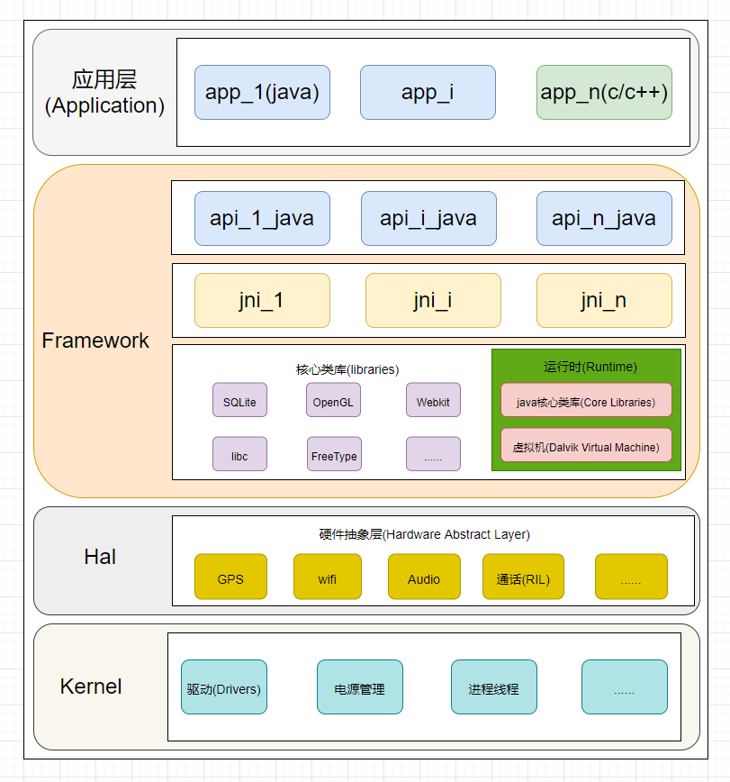

# P31: 系统开发之驱动开发

---

[跳转到readme](https://github.com/hfreeman2008/android_core_framework/blob/main/README-CN.md)

---

[跳转到文章结尾](#结束语)

---

[上一篇文章 P30_系统开发之RRO](https://github.com/hfreeman2008/android_core_framework/blob/main/P30_%E7%B3%BB%E7%BB%9F%E5%BC%80%E5%8F%91%E4%B9%8BRRO/%E7%B3%BB%E7%BB%9F%E5%BC%80%E5%8F%91%E4%B9%8BRRO.md)

[下一篇文章 P32_系统开发之IMS输入模块](https://github.com/hfreeman2008/android_core_framework/blob/main/P32_%E7%B3%BB%E7%BB%9F%E5%BC%80%E5%8F%91%E4%B9%8BIMS%E8%BE%93%E5%85%A5%E6%A8%A1%E5%9D%97/%E7%B3%BB%E7%BB%9F%E5%BC%80%E5%8F%91%E4%B9%8BIMS%E8%BE%93%E5%85%A5%E6%A8%A1%E5%9D%97.md)

---

# android分层框架

---

# 驱动垂直开发全过程

[驱动垂直开发全过程](https://github.com/jxxhwy/hello_android_hal/)

---

---

[跳转到文章开始](#p31-系统开发之驱动开发)

---

[上一篇文章 P30_系统开发之RRO](https://github.com/hfreeman2008/android_core_framework/blob/main/P30_%E7%B3%BB%E7%BB%9F%E5%BC%80%E5%8F%91%E4%B9%8BRRO/%E7%B3%BB%E7%BB%9F%E5%BC%80%E5%8F%91%E4%B9%8BRRO.md)

[下一篇文章 P32_系统开发之IMS输入模块](https://github.com/hfreeman2008/android_core_framework/blob/main/P32_%E7%B3%BB%E7%BB%9F%E5%BC%80%E5%8F%91%E4%B9%8BIMS%E8%BE%93%E5%85%A5%E6%A8%A1%E5%9D%97/%E7%B3%BB%E7%BB%9F%E5%BC%80%E5%8F%91%E4%B9%8BIMS%E8%BE%93%E5%85%A5%E6%A8%A1%E5%9D%97.md)

---

# 结束语

