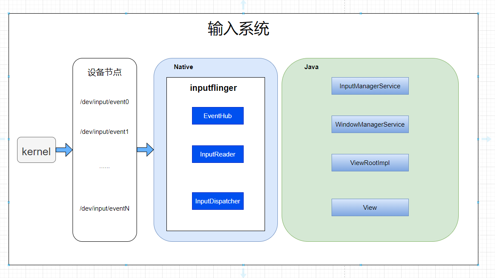
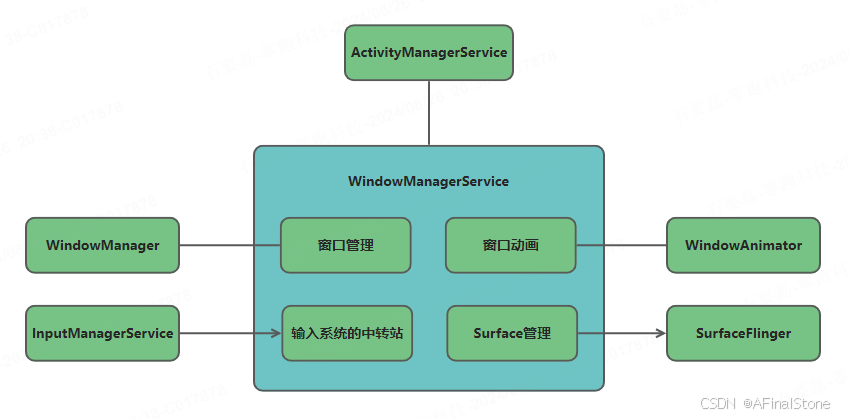
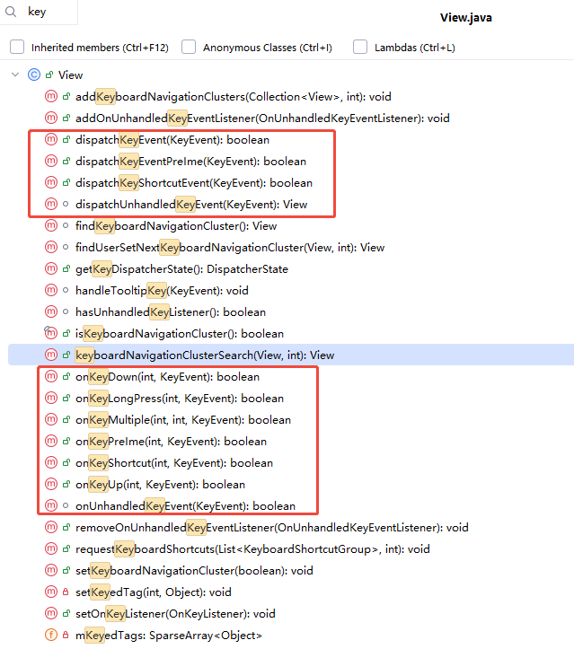
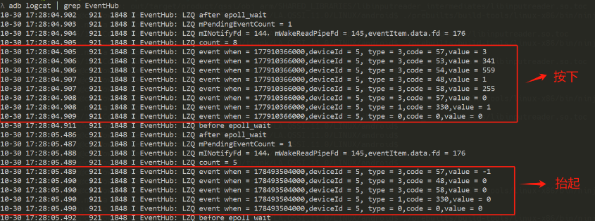

# P32: 系统开发之IMS输入模块


---

[跳转到readme](https://github.com/hfreeman2008/android_core_framework/blob/main/README-CN.md)


---

[<font face='黑体' color=#ff0000 size=40 >跳转到文章结尾</font>](#结束语)

---

[上一篇文章 P31_系统开发之驱动开发](https://github.com/hfreeman2008/android_core_framework/blob/main/P31_%E7%B3%BB%E7%BB%9F%E5%BC%80%E5%8F%91%E4%B9%8B%E9%A9%B1%E5%8A%A8%E5%BC%80%E5%8F%91/%E7%B3%BB%E7%BB%9F%E5%BC%80%E5%8F%91%E4%B9%8B%E9%A9%B1%E5%8A%A8%E5%BC%80%E5%8F%91.md)


---


# 输入模块框架：



## framework

```java
frameworks/base/core/java/android/hardware/input/InputManager.java
frameworks\base\services\core\java\com\android\server\input\InputManagerService.java
frameworks/base/services/core/jni/com_android_server_input_InputManagerService.cpp
```


InputManagerService是Android框架层一个非核心服务，主要是提供一个IMS输入系统启动的入口，同时对应用层提供业务相关接口。

frameworks\base\services\core\java\com\android\server\wm\WindowManagerService.java

WindowManagerService有一个核心的功能，输入系统的中转站；




frameworks\base\services\core\java\com\android\server\policy\PhoneWindowManager.java

针对key的具体处理逻辑:
```java
interceptKeyBeforeDispatching
interceptKeyBeforeQueueing
```


```java
frameworks\base\core\java\android\view\ViewRootImpl.java
frameworks\base\core\java\android\view\View.java
frameworks\base\core\java\android\view\InputEventSender.java
frameworks\base\core\java\android\view\InputEventSender.java
```

frameworks\base\core\java\android\view\View.java




## native

### libinputreader

```java
./frameworks/native/services/inputflinger/reader/EventHub.cpp
./frameworks/native/services/inputflinger/reader/include/EventHub.h

frameworks\native\services\inputflinger\reader\InputReader.cpp
frameworks\native\services\inputflinger\reader\include\InputReader.h
```


### inputflinger

input事件的管理类，数据传递类，也是输入系统native层核心的模块。
```java
frameworks\native\services\inputflinger\dispatcher\InputDispatcher.h
frameworks\native\services\inputflinger\dispatcher\InputDispatcher.cpp

frameworks/native/services/inputflinger/InputManager.h
frameworks\native\services\inputflinger\InputManager.cpp
```


## hal层

```java
hardware\libhardware\modules
hardware\libhardware\modules\input\evdev
```


## 驱动层

```java
kernel/msm-4.19/drivers/input/
kernel/msm-4.19/drivers/input/keyboard/gpio_keys.c
```


```java
/dev/input/event0
......
/dev/input/eventN
```

---

# 事件抽象接口-InputEvent

```java
frameworks\base\core\java\android\view\InputEvent.java
frameworks\base\core\java\android\view\KeyEvent.java
```

# UEVENT 机制
"uevent" 是 Linux 系统中的一种事件通知机制，用于向用户空间发送有关内核和设备状态变化的通知。这种机制通常用于设备驱动程序、热插拔事件以及设备状态变化等场景，以便用户空间应用程序能够在这些事件发生时做出相应的响应.


# 关键类


## InputManagerService

### 消息监听-notifySwitch
该方法为Native的回调方法，用于上报IMS事件，如耳机插入事件等。
```java
private void notifySwitch(long whenNanos, int switchValues, int switchMask) {
    if (DEBUG) {
        Slog.d(TAG, "notifySwitch: values=" + Integer.toHexString(switchValues)
                + ", mask=" + Integer.toHexString(switchMask));
    }

    if ((switchMask & SW_LID_BIT) != 0) {
        final boolean lidOpen = ((switchValues & SW_LID_BIT) == 0);
        mWindowManagerCallbacks.notifyLidSwitchChanged(whenNanos, lidOpen);
    }

    if ((switchMask & SW_CAMERA_LENS_COVER_BIT) != 0) {
        final boolean lensCovered = ((switchValues & SW_CAMERA_LENS_COVER_BIT) != 0);
        mWindowManagerCallbacks.notifyCameraLensCoverSwitchChanged(whenNanos, lensCovered);
    }

    if (mUseDevInputEventForAudioJack && (switchMask & SW_JACK_BITS) != 0) {
        mWiredAccessoryCallbacks.notifyWiredAccessoryChanged(whenNanos, switchValues,
                switchMask);
    }

    if ((switchMask & SW_TABLET_MODE_BIT) != 0) {
        SomeArgs args = SomeArgs.obtain();
        args.argi1 = (int) (whenNanos & 0xFFFFFFFF);
        args.argi2 = (int) (whenNanos >> 32);
        args.arg1 = Boolean.valueOf((switchValues & SW_TABLET_MODE_BIT) != 0);
        mHandler.obtainMessage(MSG_DELIVER_TABLET_MODE_CHANGED,
                args).sendToTarget();
    }

    if ((switchMask & SW_MUTE_DEVICE_BIT) != 0) {
        final boolean micMute = ((switchValues & SW_MUTE_DEVICE_BIT) != 0);
        AudioManager audioManager = mContext.getSystemService(AudioManager.class);
        audioManager.setMicrophoneMuteFromSwitch(micMute);
    }
}
```


### notifyANR-anr相关

```java
private long notifyANR(InputApplicationHandle inputApplicationHandle, IBinder token,
        String reason) {
    return mWindowManagerCallbacks.notifyANR(inputApplicationHandle,
            token, reason);
}
```

### interceptKeyBeforeDispatching--key事件分发

```java
private long interceptKeyBeforeDispatching(IBinder focus, KeyEvent event, int policyFlags) {
    return mWindowManagerCallbacks.interceptKeyBeforeDispatching(focus, event, policyFlags);
}
```

InputManagerCallback.java
```java
/**
 * Provides an opportunity for the window manager policy to process a key before
 * ordinary dispatch.
 */
@Override
public long interceptKeyBeforeDispatching(
        IBinder focusedToken, KeyEvent event, int policyFlags) {
    return mService.mPolicy.interceptKeyBeforeDispatching(focusedToken, event, policyFlags);
}
```

WindowManagerPolicy
```java
long interceptKeyBeforeDispatching(IBinder focusedToken, KeyEvent event, int policyFlags);
```

PhoneWindowManager
```java
public class PhoneWindowManager implements WindowManagerPolicy {
    @Override
public long interceptKeyBeforeDispatching(IBinder focusedToken, KeyEvent event,
        int policyFlags) {
            ......
        }    
}
```


## InputManager

frameworks\native\services\inputflinger\InputManager.cpp

启动事件管理服务

启动两个核心的阻塞线程，一个是事件分发线程，一个是事件读取线程。

```cpp
status_t InputManager::start() {
    status_t result = mDispatcher->start();//启动事件分发服务
    if (result) {
        ALOGE("Could not start InputDispatcher thread due to error %d.", result);
        return result;
    }

    result = mReader->start();//启动事件读取服务
    if (result) {
        ALOGE("Could not start InputReader due to error %d.", result);

        mDispatcher->stop();
        return result;
    }

    return OK;
}
```


## EventHub

EventHub：事件集线器，它将全部的输入事件通过一个接口getEvents()，将从多个输入设备节点中读取的事件交给InputReader，是输入系统最底层的一个组件。

(1)RawEvent结构体

mEventBuffer用于描述原始输入事件，其类型为RawEvent，相关结构体如下:

frameworks\native\services\inputflinger\reader\include\EventHub.h

```java
/*
 * A raw event as retrieved from the EventHub.
 */
struct RawEvent {
    nsecs_t when;//事件时间戳
    int32_t deviceId;//产生事件的设备ID
    int32_t type;//事件类型
    int32_t code;//事件编码
    int32_t value;//事件值
};
```


(2)EventHub->getEvents事件

getEvents()是事件处理的核心方法，其通过EPOLL机制和INOTIFY，从多个设备节点读取事件。

```c++
size_t EventHub::getEvents(int timeoutMillis, RawEvent* buffer, size_t bufferSize) {
    ......
    struct input_event readBuffer[bufferSize];

    RawEvent* event = buffer;
    size_t capacity = bufferSize;
    bool awoken = false;
    for (;;) {
        nsecs_t now = systemTime(SYSTEM_TIME_MONOTONIC);
        ......
        if (mNeedToScanDevices) {//Step 1.扫描设备
            mNeedToScanDevices = false;
            scanDevicesLocked();
            mNeedToSendFinishedDeviceScan = true;
        }


        // Grab the next input event.
        bool deviceChanged = false;
        while (mPendingEventIndex < mPendingEventCount) {//Step 2.处理未被InputReader取走的输入事件与设备事件
            const struct epoll_event& eventItem = mPendingEventItems[mPendingEventIndex++];
            if (eventItem.data.fd == mINotifyFd) {
                if (eventItem.events & EPOLLIN) {
                    mPendingINotify = true;
                } else {
                    ALOGW("Received unexpected epoll event 0x%08x for INotify.", eventItem.events);
                }
                continue;
            }
           ......
            // This must be an input event
            if (eventItem.events & EPOLLIN) {
                //Step 3.读取底层上报事件
                int32_t readSize =
                        read(device->fd, readBuffer, sizeof(struct input_event) * capacity);
                if (readSize == 0 || (readSize < 0 && errno == ENODEV)) {
                    // Device was removed before INotify noticed.
                    ALOGW("could not get event, removed? (fd: %d size: %" PRId32
                          " bufferSize: %zu capacity: %zu errno: %d)\n",
                          device->fd, readSize, bufferSize, capacity, errno);
                    deviceChanged = true;
                    closeDeviceLocked(device);
                } else if (readSize < 0) {
                    if (errno != EAGAIN && errno != EINTR) {
                        ALOGW("could not get event (errno=%d)", errno);
                    }
                } else if ((readSize % sizeof(struct input_event)) != 0) {
                    ALOGE("could not get event (wrong size: %d)", readSize);
                } else {
                    int32_t deviceId = device->id == mBuiltInKeyboardId ? 0 : device->id;

                    size_t count = size_t(readSize) / sizeof(struct input_event);
                    //构建需要上报的事件
                    for (size_t i = 0; i < count; i++) {
                        struct input_event& iev = readBuffer[i];
                        event->when = processEventTimestamp(iev);
                        event->deviceId = deviceId;
                        event->type = iev.type;
                        event->code = iev.code;
                        event->value = iev.value;
                        event += 1;//将event指针移动到下一个可用于填充事件的RawEvent对象
                        capacity -= 1;
                    }
        ......
        mLock.unlock(); // release lock before poll
        //Step 4.阻塞，等待事件各种类型消息
        int pollResult = epoll_wait(mEpollFd, mPendingEventItems, EPOLL_MAX_EVENTS, timeoutMillis);
        mLock.lock(); // reacquire lock after poll
      ......
    // All done, return the number of events we read.
    return event - buffer;
}
```

- Step 1. 扫描设备，会获取input/dev/下的所有设备，并将各个设备注册到epoll线程池里，监听各个设备的消息状态；
- Step 2. 处理未被InputReader取走的输入事件与设备事件，一般情况下有事件上报时，epoll_wait会读取到mPendingEventItems值，即mPendingEventCount值，即会进入该流程；
- Step 3. 读取底层上报事件，根据上报的fd设备，读取对应的设备节点。即可以获取到上报的事件内容。如下为屏幕点击对应的上报事件：
- Step 4. 通过epoll机制，阻塞当前进程，等待设备节点变更，事件上报。





## InputReader

事件读取服务，读取驱动上报事件

### 创建一个InputThread线程

```c++
status_t InputReader::start() {
    if (mThread) {
        return ALREADY_EXISTS;
    }
    mThread = std::make_unique<InputThread>(
            "InputReader", [this]() { loopOnce(); }, [this]() { mEventHub->wake(); });
    return OK;
}
```

### loopOnce
InputThread线程的loop循环队列（线程和loop的关系）

```c++
void InputReader::loopOnce() {
    int32_t oldGeneration;
    int32_t timeoutMillis;
    bool inputDevicesChanged = false;
    std::vector<InputDeviceInfo> inputDevices;
    { // acquire lock
    ......
    //step 1. 通过EventHub抽取事件列表
    size_t count = mEventHub->getEvents(timeoutMillis, mEventBuffer, EVENT_BUFFER_SIZE);

    { // acquire lock
        AutoMutex _l(mLock);
        mReaderIsAliveCondition.broadcast();

        if (count) {
            processEventsLocked(mEventBuffer, count);// step 2. 对事件进行加工处理
        }
    ......
    // Flush queued events out to the listener.
    // This must happen outside of the lock because the listener could potentially call
    // back into the InputReader's methods, such as getScanCodeState, or become blocked
    // on another thread similarly waiting to acquire the InputReader lock thereby
    // resulting in a deadlock.  This situation is actually quite plausible because the
    // listener is actually the input dispatcher, which calls into the window manager,
    // which occasionally calls into the input reader.
    mQueuedListener->flush();//step 3. 事件发布
}
```

主要是将底层RawEvent事件,进一步加工,将Event事件注入到mArgsQueue队列的过程


### InputReader::processEventsLocked

```c++
void InputReader::processEventsLocked(const RawEvent* rawEvents, size_t count) {
    for (const RawEvent* rawEvent = rawEvents; count;) {
        int32_t type = rawEvent->type;
        size_t batchSize = 1;
        if (type < EventHubInterface::FIRST_SYNTHETIC_EVENT) {
            int32_t deviceId = rawEvent->deviceId;
            while (batchSize < count) {
                if (rawEvent[batchSize].type >= EventHubInterface::FIRST_SYNTHETIC_EVENT ||
                    rawEvent[batchSize].deviceId != deviceId) {
                    break;
                }
                batchSize += 1;
            }
            processEventsForDeviceLocked(deviceId, rawEvent, batchSize);//输入整件
        } else {
            switch (rawEvent->type) {
                case EventHubInterface::DEVICE_ADDED://设备增加
                    addDeviceLocked(rawEvent->when, rawEvent->deviceId);
                    break;
                case EventHubInterface::DEVICE_REMOVED://设备移除
                    removeDeviceLocked(rawEvent->when, rawEvent->deviceId);
                    break;
                case EventHubInterface::FINISHED_DEVICE_SCAN://设备扫描结束
                    handleConfigurationChangedLocked(rawEvent->when);
                    break;
                default:
                    ALOG_ASSERT(false); // can't happen
                    break;
            }
        }
        count -= batchSize;
        rawEvent += batchSize;
    }
}
```

## inputdispatcher
事件分发服务，将底层读到的事件，分发到上层

(1)Input事件上报
InputDispatch会启动一个阻塞线程，等待底层事件上报；而通过InputReader的分析，我们知道底层事件响应，最终会通知InputDispatch模块的notifyMotion()方法

```c++
void InputDispatcher::notifyMotion(const NotifyMotionArgs* args) {
    ......
    if (!validateMotionEvent(args->action, args->actionButton, args->pointerCount,
                             args->pointerProperties)) {
        return;
    }

    uint32_t policyFlags = args->policyFlags;
    policyFlags |= POLICY_FLAG_TRUSTED;

    android::base::Timer t;
    mPolicy->interceptMotionBeforeQueueing(args->displayId, args->eventTime, /*byref*/ policyFlags);
    if (t.duration() > SLOW_INTERCEPTION_THRESHOLD) {
        ALOGW("Excessive delay in interceptMotionBeforeQueueing; took %s ms",
              std::to_string(t.duration().count()).c_str());
    }

    bool needWake;
    { // acquire lock
        mLock.lock();

        if (shouldSendMotionToInputFilterLocked(args)) {
            mLock.unlock();

            MotionEvent event;
            event.initialize(args->id, args->deviceId, args->source, args->displayId, INVALID_HMAC,
                             args->action, args->actionButton, args->flags, args->edgeFlags,
                             args->metaState, args->buttonState, args->classification, 1 /*xScale*/,
                             1 /*yScale*/, 0 /* xOffset */, 0 /* yOffset */, args->xPrecision,
                             args->yPrecision, args->xCursorPosition, args->yCursorPosition,
                             args->downTime, args->eventTime, args->pointerCount,
                             args->pointerProperties, args->pointerCoords);

            policyFlags |= POLICY_FLAG_FILTERED;
            if (!mPolicy->filterInputEvent(&event, policyFlags)) {
                return; // event was consumed by the filter
            }

            mLock.lock();
        }

        // Just enqueue a new motion event.
        MotionEntry* newEntry =
                new MotionEntry(args->id, args->eventTime, args->deviceId, args->source,
                                args->displayId, policyFlags, args->action, args->actionButton,
                                args->flags, args->metaState, args->buttonState,
                                args->classification, args->edgeFlags, args->xPrecision,
                                args->yPrecision, args->xCursorPosition, args->yCursorPosition,
                                args->downTime, args->pointerCount, args->pointerProperties,
                                args->pointerCoords, 0, 0);

        needWake = enqueueInboundEventLocked(newEntry);//构建新的MotionEvent事件
        mLock.unlock();
    } // release lock

    if (needWake) {
        mLooper->wake();//唤醒InputDispatch线程，进行分发
    }
}
```

(2)创建一个InputDispatcher线程

```c++
status_t InputDispatcher::start() {
    if (mThread) {
        return ALREADY_EXISTS;
    }
    mThread = std::make_unique<InputThread>(
            "InputDispatcher", [this]() { dispatchOnce(); }, [this]() { mLooper->wake(); });
    return OK;
}
```

(3)InputThread线程的loop队列

```c++
void InputDispatcher::dispatchOnce() {
    nsecs_t nextWakeupTime = LONG_LONG_MAX;
    { // acquire lock
        std::scoped_lock _l(mLock);
        mDispatcherIsAlive.notify_all();

        // Run a dispatch loop if there are no pending commands.
        // The dispatch loop might enqueue commands to run afterwards.
        if (!haveCommandsLocked()) {
            dispatchOnceInnerLocked(&nextWakeupTime);//事件分发
        }

        // Run all pending commands if there are any.
        // If any commands were run then force the next poll to wake up immediately.
        if (runCommandsLockedInterruptible()) {
            nextWakeupTime = LONG_LONG_MIN;
        }

        // If we are still waiting for ack on some events,
        // we might have to wake up earlier to check if an app is anr'ing.
        const nsecs_t nextAnrCheck = processAnrsLocked();
        nextWakeupTime = std::min(nextWakeupTime, nextAnrCheck);

        // We are about to enter an infinitely long sleep, because we have no commands or
        // pending or queued events
        if (nextWakeupTime == LONG_LONG_MAX) {
            mDispatcherEnteredIdle.notify_all();
        }
    } // release lock

    // Wait for callback or timeout or wake.  (make sure we round up, not down)
    nsecs_t currentTime = now();
    int timeoutMillis = toMillisecondTimeoutDelay(currentTime, nextWakeupTime);
    mLooper->pollOnce(timeoutMillis);//堵塞，等待唤醒
}
```

---


# 应用分发流程：

## Activity#onKeyDown分发

```java
com.example.demo_0.MainActivity.onKeyDown(MainActivity.java:32)
android.view.KeyEvent.dispatch(KeyEvent.java:2901)
android.app.Activity.dispatchKeyEvent(Activity.java:4263)
androidx.core.app.ComponentActivity.superDispatchKeyEvent(ComponentActivity.java:126)
androidx.core.view.KeyEventDispatcher.dispatchKeyEvent(KeyEventDispatcher.java:86)
androidx.core.app.ComponentActivity.dispatchKeyEvent(ComponentActivity.java:144)
androidx.appcompat.app.AppCompatActivity.dispatchKeyEvent(AppCompatActivity.java:604)
androidx.appcompat.view.WindowCallbackWrapper.dispatchKeyEvent(WindowCallbackWrapper.java:60)
androidx.appcompat.app.AppCompatDelegateImpl$AppCompatWindowCallback.dispatchKeyEvent(AppCompatDelegateImpl.java:3413)
com.android.internal.policy.DecorView.dispatchKeyEvent(DecorView.java:402)
android.view.ViewRootImpl$ViewPostImeInputStage.processKeyEvent(ViewRootImpl.java:6696)
android.view.ViewRootImpl$ViewPostImeInputStage.onProcess(ViewRootImpl.java:6562)
android.view.ViewRootImpl$InputStage.deliver(ViewRootImpl.java:6022)
android.view.ViewRootImpl$InputStage.onDeliverToNext(ViewRootImpl.java:6079)
android.view.ViewRootImpl$InputStage.forward(ViewRootImpl.java:6045)
android.view.ViewRootImpl$AsyncInputStage.forward(ViewRootImpl.java:6210)
android.view.ViewRootImpl$InputStage.apply(ViewRootImpl.java:6053)
android.view.ViewRootImpl$AsyncInputStage.apply(ViewRootImpl.java:6267)
android.view.ViewRootImpl$InputStage.deliver(ViewRootImpl.java:6026)
android.view.ViewRootImpl$InputStage.onDeliverToNext(ViewRootImpl.java:6079)
android.view.ViewRootImpl$InputStage.forward(ViewRootImpl.java:6045)
android.view.ViewRootImpl$InputStage.apply(ViewRootImpl.java:6053)
android.view.ViewRootImpl$InputStage.deliver(ViewRootImpl.java:6026)
android.view.ViewRootImpl$InputStage.onDeliverToNext(ViewRootImpl.java:6079)
android.view.ViewRootImpl$InputStage.forward(ViewRootImpl.java:6045)
android.view.ViewRootImpl$AsyncInputStage.forward(ViewRootImpl.java:6243)
android.view.ViewRootImpl$ImeInputStage.onFinishedInputEvent(ViewRootImpl.java:6423)
android.view.inputmethod.InputMethodManager$PendingEvent.run(InputMethodManager.java:3669)
android.view.inputmethod.InputMethodManager.invokeFinishedInputEventCallback(InputMethodManager.java:3189)
android.view.inputmethod.InputMethodManager.finishedInputEvent(InputMethodManager.java:3180)
android.view.inputmethod.InputMethodManager$ImeInputEventSender.onInputEventFinished(InputMethodManager.java:3646)
android.view.InputEventSender.dispatchInputEventFinished(InputEventSender.java:154)
android.os.MessageQueue.nativePollOnce(Native Method)
android.os.MessageQueue.next(MessageQueue.java:335)
android.os.Looper.loopOnce(Looper.java:161)
android.os.Looper.loop(Looper.java:288)
android.app.ActivityThread.main(ActivityThread.java:7930)
java.lang.reflect.Method.invoke(Native Method)
com.android.internal.os.RuntimeInit$MethodAndArgsCaller.run(RuntimeInit.java:548)
com.android.internal.os.ZygoteInit.main(ZygoteInit.java:942)
```


## launcher点击整件分发流程

```java
com.android.launcher3.BubbleTextView.performClick(BubbleTextView.java:622)
android.view.View.performClickInternal(View.java:7249)
android.view.View.onKeyUp(View.java:14723)
android.widget.TextView.onKeyUp(TextView.java:8601)
com.android.launcher3.BubbleTextView.onKeyUp(BubbleTextView.java:649)
android.view.KeyEvent.dispatch(KeyEvent.java:2846)
android.view.View.dispatchKeyEvent(View.java:13916)
android.view.ViewGroup.dispatchKeyEvent(ViewGroup.java:1925)
android.view.ViewGroup.dispatchKeyEvent(ViewGroup.java:1925)
android.view.ViewGroup.dispatchKeyEvent(ViewGroup.java:1925)
android.view.ViewGroup.dispatchKeyEvent(ViewGroup.java:1925)
com.android.launcher3.dragndrop.DragLayer.dispatchKeyEvent(DragLayer.java:185)
android.view.ViewGroup.dispatchKeyEvent(ViewGroup.java:1925)
android.view.ViewGroup.dispatchKeyEvent(ViewGroup.java:1925)
android.view.ViewGroup.dispatchKeyEvent(ViewGroup.java:1925)
android.view.ViewGroup.dispatchKeyEvent(ViewGroup.java:1925)
com.android.internal.policy.DecorView.superDispatchKeyEvent(DecorView.java:472)
com.android.internal.policy.PhoneWindow.superDispatchKeyEvent(PhoneWindow.java:1839)
android.app.Activity.dispatchKeyEvent(Activity.java:4003)
com.android.launcher3.Launcher.dispatchKeyEvent(Launcher.java:4232)
com.android.internal.policy.DecorView.dispatchKeyEvent(DecorView.java:379)
android.view.ViewRootImpl$ViewPostImeInputStage.processKeyEvent(ViewRootImpl.java:5686)
android.view.ViewRootImpl$ViewPostImeInputStage.onProcess(ViewRootImpl.java:5548)
android.view.ViewRootImpl$InputStage.deliver(ViewRootImpl.java:5055)
android.view.ViewRootImpl$InputStage.onDeliverToNext(ViewRootImpl.java:5108)
android.view.ViewRootImpl$InputStage.forward(ViewRootImpl.java:5074)
android.view.ViewRootImpl$AsyncInputStage.forward(ViewRootImpl.java:5214)
android.view.ViewRootImpl$InputStage.apply(ViewRootImpl.java:5082)
android.view.ViewRootImpl$AsyncInputStage.apply(ViewRootImpl.java:5271)
android.view.ViewRootImpl$InputStage.deliver(ViewRootImpl.java:5055)
android.view.ViewRootImpl$InputStage.onDeliverToNext(ViewRootImpl.java:5108)
android.view.ViewRootImpl$InputStage.forward(ViewRootImpl.java:5074)
android.view.ViewRootImpl$InputStage.apply(ViewRootImpl.java:5082)
android.view.ViewRootImpl$InputStage.deliver(ViewRootImpl.java:5055)
android.view.ViewRootImpl$InputStage.onDeliverToNext(ViewRootImpl.java:5108)
android.view.ViewRootImpl$InputStage.forward(ViewRootImpl.java:5074)
android.view.ViewRootImpl$AsyncInputStage.forward(ViewRootImpl.java:5247)
android.view.ViewRootImpl$ImeInputStage.onFinishedInputEvent(ViewRootImpl.java:5408)
android.view.inputmethod.InputMethodManager$PendingEvent.run(InputMethodManager.java:3078)
android.view.inputmethod.InputMethodManager.invokeFinishedInputEventCallback(InputMethodManager.java:2621)
android.view.inputmethod.InputMethodManager.finishedInputEvent(InputMethodManager.java:2612)
android.view.inputmethod.InputMethodManager$ImeInputEventSender.onInputEventFinished(InputMethodManager.java:3055)
android.view.InputEventSender.dispatchInputEventFinished(InputEventSender.java:143)
android.os.MessageQueue.nativePollOnce(Native Method)
android.os.MessageQueue.next(MessageQueue.java:336)
android.os.Looper.loop(Looper.java:181)
android.app.ActivityThread.main(ActivityThread.java:7552)
java.lang.reflect.Method.invoke(Native Method)
com.android.internal.os.RuntimeInit$MethodAndArgsCaller.run(RuntimeInit.java:492)
com.android.internal.os.ZygoteInit.main(ZygoteInit.java:935)
```


## videoplayer应用点击整件分发
```java
com.tyyd.videoplayer.player.PlayerPresenter.changeTrack(PlayerPresenter.java:376)
com.tyyd.videoplayer.player.ResolutionPresenter.changeVideoTrack(ResolutionPresenter.java:279)
com.tyyd.videoplayer.player.PlayerPresenter.changeVideoTrack(PlayerPresenter.java:531)
com.tyyd.videoplayer.view.ResolutionView$1.onItemClick(ResolutionView.java:114)
com.tyyd.videoplayer.view.ResolutionView$1.onItemClick(ResolutionView.java:86)
com.zhy.base.adapter.recyclerview.CommonAdapter$1.onClick(CommonAdapter.java:68)
android.view.View.performClick(View.java:7259)
android.view.View.performClickInternal(View.java:7236)
android.view.View.onKeyUp(View.java:14697)
android.view.KeyEvent.dispatch(KeyEvent.java:2902)
android.view.View.dispatchKeyEvent(View.java:13890)
android.view.ViewGroup.dispatchKeyEvent(ViewGroup.java:1917)
android.view.ViewGroup.dispatchKeyEvent(ViewGroup.java:1922)
android.view.ViewGroup.dispatchKeyEvent(ViewGroup.java:1922)
android.view.ViewGroup.dispatchKeyEvent(ViewGroup.java:1922)
android.view.ViewGroup.dispatchKeyEvent(ViewGroup.java:1922)
android.view.ViewGroup.dispatchKeyEvent(ViewGroup.java:1922)
android.view.ViewGroup.dispatchKeyEvent(ViewGroup.java:1922)
android.view.ViewGroup.dispatchKeyEvent(ViewGroup.java:1922)
android.view.ViewGroup.dispatchKeyEvent(ViewGroup.java:1922)
android.view.ViewGroup.dispatchKeyEvent(ViewGroup.java:1922)
android.view.ViewGroup.dispatchKeyEvent(ViewGroup.java:1922)
com.android.internal.policy.DecorView.superDispatchKeyEvent(DecorView.java:469)
com.android.internal.policy.PhoneWindow.superDispatchKeyEvent(PhoneWindow.java:1891)
android.app.Activity.dispatchKeyEvent(Activity.java:4093)
androidx.core.app.ComponentActivity.superDispatchKeyEvent(ComponentActivity.java:122)
androidx.core.view.KeyEventDispatcher.dispatchKeyEvent(KeyEventDispatcher.java:84)
androidx.core.app.ComponentActivity.dispatchKeyEvent(ComponentActivity.java:140)
androidx.appcompat.app.AppCompatActivity.dispatchKeyEvent(AppCompatActivity.java:569)
androidx.appcompat.view.WindowCallbackWrapper.dispatchKeyEvent(WindowCallbackWrapper.java:59)
androidx.appcompat.app.AppCompatDelegateImpl$AppCompatWindowCallback.dispatchKeyEvent(AppCompatDelegateImpl.java:3054)
com.android.internal.policy.DecorView.dispatchKeyEvent(DecorView.java:381)
android.view.ViewRootImpl$ViewPostImeInputStage.processKeyEvent(ViewRootImpl.java:5716)
android.view.ViewRootImpl$ViewPostImeInputStage.onProcess(ViewRootImpl.java:5580)
android.view.ViewRootImpl$InputStage.deliver(ViewRootImpl.java:5087)
android.view.ViewRootImpl$InputStage.onDeliverToNext(ViewRootImpl.java:5140)
android.view.ViewRootImpl$InputStage.forward(ViewRootImpl.java:5106)
android.view.ViewRootImpl$AsyncInputStage.forward(ViewRootImpl.java:5246)
android.view.ViewRootImpl$InputStage.apply(ViewRootImpl.java:5114)
android.view.ViewRootImpl$AsyncInputStage.apply(ViewRootImpl.java:5303)
android.view.ViewRootImpl$InputStage.deliver(ViewRootImpl.java:5087)
android.view.ViewRootImpl$InputStage.onDeliverToNext(ViewRootImpl.java:5140)
android.view.ViewRootImpl$InputStage.forward(ViewRootImpl.java:5106)
android.view.ViewRootImpl$InputStage.apply(ViewRootImpl.java:5114)
android.view.ViewRootImpl$InputStage.deliver(ViewRootImpl.java:5087)
android.view.ViewRootImpl$InputStage.onDeliverToNext(ViewRootImpl.java:5140)
android.view.ViewRootImpl$InputStage.forward(ViewRootImpl.java:5106)
android.view.ViewRootImpl$AsyncInputStage.forward(ViewRootImpl.java:5279)
android.view.ViewRootImpl$ImeInputStage.onFinishedInputEvent(ViewRootImpl.java:5440)
android.view.inputmethod.InputMethodManager$PendingEvent.run(InputMethodManager.java:3067)
android.view.inputmethod.InputMethodManager.invokeFinishedInputEventCallback(InputMethodManager.java:2610)
android.view.inputmethod.InputMethodManager.finishedInputEvent(InputMethodManager.java:2601)
android.view.inputmethod.InputMethodManager$ImeInputEventSender.onInputEventFinished(InputMethodManager.java:3044)
android.view.InputEventSender.dispatchInputEventFinished(InputEventSender.java:143)
android.os.MessageQueue.nativePollOnce(Native Method)
android.os.MessageQueue.next(MessageQueue.java:336)
android.os.Looper.loop(Looper.java:174)
android.app.ActivityThread.main(ActivityThread.java:7669)
java.lang.reflect.Method.invoke(Native Method)
com.android.internal.os.RuntimeInit$MethodAndArgsCaller.run(RuntimeInit.java:492)
com.android.internal.os.ZygoteInit.main(ZygoteInit.java:935)
```


## TextView key分发流程

```java
android.widget.TextView.onKeyUp(TextView.java:8591)
android.view.KeyEvent.dispatch(KeyEvent.java:2902)
android.view.View.dispatchKeyEvent(View.java:13890)
android.view.ViewGroup.dispatchKeyEvent(ViewGroup.java:1922)
android.view.ViewGroup.dispatchKeyEvent(ViewGroup.java:1922)
android.view.ViewGroup.dispatchKeyEvent(ViewGroup.java:1922)
android.view.ViewGroup.dispatchKeyEvent(ViewGroup.java:1922)
android.view.ViewGroup.dispatchKeyEvent(ViewGroup.java:1922)
android.view.ViewGroup.dispatchKeyEvent(ViewGroup.java:1922)
android.view.ViewGroup.dispatchKeyEvent(ViewGroup.java:1922)
android.view.ViewGroup.dispatchKeyEvent(ViewGroup.java:1922)
android.view.ViewGroup.dispatchKeyEvent(ViewGroup.java:1922)
android.view.ViewGroup.dispatchKeyEvent(ViewGroup.java:1922)
android.view.ViewGroup.dispatchKeyEvent(ViewGroup.java:1922)
com.android.internal.policy.DecorView.superDispatchKeyEvent(DecorView.java:473)
com.android.internal.policy.PhoneWindow.superDispatchKeyEvent(PhoneWindow.java:1871)
android.app.Activity.dispatchKeyEvent(Activity.java:4093)
androidx.core.app.ComponentActivity.superDispatchKeyEvent(ComponentActivity.java:1)
androidx.core.i.e.a(KeyEventDispatcher.java:3)
androidx.core.app.ComponentActivity.dispatchKeyEvent(ComponentActivity.java:3)
androidx.appcompat.app.AppCompatActivity.dispatchKeyEvent(AppCompatActivity.java:4)
com.ctg.itrdc.clouddesk.account.ui.LoginActivity.dispatchKeyEvent(LoginActivity.java:5)
androidx.appcompat.d.j.dispatchKeyEvent(WindowCallbackWrapper.java:1)
androidx.appcompat.app.AppCompatDelegateImpl$d.dispatchKeyEvent(AppCompatDelegateImpl.java:2)
com.android.internal.policy.DecorView.dispatchKeyEvent(DecorView.java:385)
android.view.ViewRootImpl$ViewPostImeInputStage.processKeyEvent(ViewRootImpl.java:5698)
android.view.ViewRootImpl$ViewPostImeInputStage.onProcess(ViewRootImpl.java:5562)
android.view.ViewRootImpl$InputStage.deliver(ViewRootImpl.java:5069)
android.view.ViewRootImpl$InputStage.onDeliverToNext(ViewRootImpl.java:5122)
android.view.ViewRootImpl$InputStage.forward(ViewRootImpl.java:5088)
android.view.ViewRootImpl$AsyncInputStage.forward(ViewRootImpl.java:5228)
android.view.ViewRootImpl$InputStage.apply(ViewRootImpl.java:5096)
android.view.ViewRootImpl$AsyncInputStage.apply(ViewRootImpl.java:5285)
android.view.ViewRootImpl$InputStage.deliver(ViewRootImpl.java:5069)
android.view.ViewRootImpl$InputStage.onDeliverToNext(ViewRootImpl.java:5122)
android.view.ViewRootImpl$InputStage.forward(ViewRootImpl.java:5088)
android.view.ViewRootImpl$InputStage.apply(ViewRootImpl.java:5096)
android.view.ViewRootImpl$InputStage.deliver(ViewRootImpl.java:5069)
android.view.ViewRootImpl.deliverInputEvent(ViewRootImpl.java:7813)
android.view.ViewRootImpl.doProcessInputEvents(ViewRootImpl.java:7782)
android.view.ViewRootImpl.enqueueInputEvent(ViewRootImpl.java:7743)
android.view.ViewRootImpl$ViewRootHandler.handleMessage(ViewRootImpl.java:4819)
android.os.Handler.dispatchMessage(Handler.java:107)
android.os.Looper.loop(Looper.java:213)
android.app.ActivityThread.main(ActivityThread.java:7618)
java.lang.reflect.Method.invoke(Native Method)
com.android.internal.os.RuntimeInit$MethodAndArgsCaller.run(RuntimeInit.java:492)
com.android.internal.os.ZygoteInit.main(ZygoteInit.java:935)
```


## key完整分发流程日志

```java
EventHub: key_event_boost  (2, 1, 304, 1)
EventHub: key_event_boost  (2, 0, 0, 0)
InputListener: key_event_boost QueuedInputListener::flush end!
InputListener: key_event_boost QueuedInputListener::flush end!
InputListener: key_event_boost QueuedInputListener::flush end!
InputDispatcher: notifyKey - eventTime=313465968000, deviceId=11, source=0x501, displayId=-1policyFlags=0x1, action=0x0, flags=0x8, keyCode=0x60, scanCode=0x130, metaState=0x0, downTime=313465968000
WindowManager: key_event_boost interceptKeyBeforeQueueing interceptKeyTq keycode=96 interactive=true keyguardActive=false policyFlags=22000001
InputDispatcher: key_event_boost InputDispatcher::dispatchOnce start 641 
InputDispatcher: key_event_boost InputDispatcher::dispatchOnce start 604
InputDispatcher: key_event_boost InputDispatcher::dispatchOnceInnerLocked start 727
InputReader: key_event_boost InputReader::loopOnce end!
InputDispatcher: key_event_boost InputDispatcher::dispatchOnceInnerLocked start 937
InputDispatcher: key_event_boost runCommandsLockedInterruptable mCommandQueue.size() 2
InputReader: key_event_boost InputReader::loopOnce start!
InputReader: key_event_boost InputReader::loopOnce timeoutMillis= -1
EventHub: key_event_boost EventHub::getEvents  1539 ,timeoutMillis=-1
InputDispatcher: key_event_boost InputDispatcher::doInterceptKeyBeforeDispatchingCommand start
InputDispatcher: key_event_boost doInterceptKeyBeforeDispatchingCommand mPolicy->interceptKeyBeforeDispatching
InputManager-JNI: com_android_server_input_InputManagerService.cpp key_event_boost interceptKeyBeforeDispatching.
InputManagerService: key_event_boost interceptKeyBeforeDispatching
InputManagerCallback: key_event_boost interceptKeyBeforeDispatching
WindowManager: key_event_boost interceptKeyBeforeDispatching interceptKeyTi keyCode=96 down=true repeatCount=0 keyguardOn=false canceled=false
InputDispatcher: key_event_boost InputDispatcher::dispatchOnce start 637 timeoutMillis=0
InputDispatcher: key_event_boost InputDispatcher::dispatchOnce start 641 
InputDispatcher: key_event_boost InputDispatcher::dispatchOnce start 604
InputDispatcher: key_event_boost InputDispatcher::dispatchOnceInnerLocked start 727
InputDispatcher: key_event_boost InputDispatcher::dispatchOnceInnerLocked start 937
InputDispatcher: key_event_boost runCommandsLockedInterruptable mCommandQueue.size() 1
InputDispatcher: key_event_boost InputDispatcher::dispatchOnce start 637 timeoutMillis=0
InputDispatcher: key_event_boost InputDispatcher::dispatchOnce start 641 
InputDispatcher: key_event_boost InputDispatcher::dispatchOnce start 604
InputDispatcher: key_event_boost InputDispatcher::dispatchOnceInnerLocked start 727
InputDispatcher: key_event_boost runCommandsLockedInterruptable mCommandQueue.size() 0
InputDispatcher: key_event_boost InputDispatcher::dispatchOnce start 637 timeoutMillis=396
InputDispatcher: key_event_boost runCommandsLockedInterruptable mCommandQueue.size() 1
InputDispatcher: key_event_boost InputDispatcher::dispatchOnce start 641 
InputDispatcher: key_event_boost InputDispatcher::dispatchOnce start 604
InputDispatcher: key_event_boost InputDispatcher::dispatchOnceInnerLocked start 727
InputDispatcher: key_event_boost runCommandsLockedInterruptable mCommandQueue.size() 0
InputDispatcher: key_event_boost InputDispatcher::dispatchOnce start 637 timeoutMillis=396
InputEventSender: key_event_boost NativeInputEventSender::handleEvent start 193
InputEventSender: key_event_boost NativeInputEventSender::processConsumerResponse start 222
InputEventSender: key_event_boost NativeInputEventSender::notifyConsumerResponse start 243
InputEventSender: android_view_InputEventSender.cpp key_event_boost gInputEventSenderClassInfo.dispatchInputEventFinished
InputEventSender: dispatchInputEventFinished key_event_boost
VRI[MainActivity]: processKeyEvent mView.dispatchKeyEvent key_event_boost
MainActivityDemoKey: key_event_boost onKeyDown keyCode:96  event:KeyEvent { action=ACTION_DOWN, keyCode=KEYCODE_BUTTON_A, scanCode=304, metaState=0, flags=0x8, repeatCount=0, eventTime=313465968000, downTime=313465968000, deviceId=11, source=0x501, displayId=-1 }
```


## [FAQ23565] 三只手指游戏不响应

touch事件如何传递到游戏界面

[DESCRIPTION]
王者荣耀界面放三只手指游戏不响应

[SOLUTION]
开启View Log 命令：
```java
adb root
adb shell "setprop mtk_d.viewroot.enable 707000" 
adb shell stop;start
```
检查事件是否有正常分发到app。

若没有，检查事件分发的流程是否有改动。

开始处理event
/frameworks/base/core/java/android/view/ViewRootImpl.java
```java
5061 final class ViewPostImeInputStage extends InputStage {
...
5274 private int processPointerEvent(QueuedInputEvent q) {
5275 final MotionEvent event = (MotionEvent)q.mEvent;
5276 
5277 mAttachInfo.mUnbufferedDispatchRequested = false;
5278 mAttachInfo.mHandlingPointerEvent = true;
5279 boolean handled = mView.dispatchPointerEvent(event);
5280 if (handled && ViewDebugManager.DEBUG_ENG) {
5281 Log.v(mTag, "App handle pointer event: event = " + event
5282 + ", mView = " + mView
5283 + ", this = " + this);
5284 }
```

接下来会调用到Decorview
/frameworks/base/core/java/com/android/internal/policy/DecorView.java
```java
395 @Override
396 public boolean dispatchTouchEvent(MotionEvent ev) {
397 final Window.Callback cb = mWindow.getCallback();
398 return cb != null && !mWindow.isDestroyed() && mFeatureId < 0
399 ? cb.dispatchTouchEvent(ev) : super.dispatchTouchEvent(ev);
400 }
```


走到Activity，调用phonewindow的superDispatch，最后会走到decorview的superdispath
/frameworks/base/core/java/android/app/Activity.java
```java
3396 public boolean dispatchTouchEvent(MotionEvent ev) {
3397 if (ev.getAction() == MotionEvent.ACTION_DOWN) {
3398 onUserInteraction();
3399 }
3400 if (getWindow().superDispatchTouchEvent(ev)) {
3401 return true;
3402 }
3403 return onTouchEvent(ev);
3404 }
```

最后走到viewgroup的dispatchtouch，这里应该就会有log出来。check一下这一段的流程是否有改动。
/frameworks/base/core/java/android/view/ViewGroup.java
```java
2548 public boolean dispatchTouchEvent(MotionEvent ev) {
2549 if (mInputEventConsistencyVerifier != null) {
2550 mInputEventConsistencyVerifier.onTouchEvent(ev, 1);
2551 }
2552 
2553 // If the event targets the accessibility focused view and this is it, start
2554 // normal event dispatch. Maybe a descendant is what will handle the click.
2555 if (ev.isTargetAccessibilityFocus() && isAccessibilityFocusedViewOrHost()) {
2556 ev.setTargetAccessibilityFocus(false);
2557 }
2558 
2559 if (ViewDebugManager.DEBUG_MOTION) {
2560 Log.d(TAG, "(ViewGroup)dispatchTouchEvent 1: ev = " + ev + ",mFirstTouchTarget = "
2561 + mFirstTouchTarget + ",this = " + this);
2562 }
```


---


# 常用命令

## getevent
getevent 指令用于获取 input 输入事件，比如获取按键上报信息、获取触摸屏上报信息等。

```java
adb shell getevent --help
getevent: invalid option --
Usage: getevent [-t] [-n] [-s switchmask] [-S] [-v [mask]] [-d] [-p] [-i] [-l] [-q] [-c count] [-r] [device]
    -t: show time stamps
    -n: don't print newlines
    -s: print switch states for given bits
    -S: print all switch states
    -v: verbosity mask (errs=1, dev=2, name=4, info=8, vers=16, pos. events=32, props=64)
    -d: show HID descriptor, if available
    -p: show possible events (errs, dev, name, pos. events)
    -i: show all device info and possible events
    -l: label event types and names in plain text
    -q: quiet (clear verbosity mask)
    -c: print given number of events then exit
    -r: print rate events are received
```


```java
adb shell getevent -lt
adb shell getevent
adb shell getevent /dev/input/event3
```

指令源码路径：

/system/core/toolbox/getevent.c


## 模拟按键input keyevent：

```java
模拟电源按键：
adb shell input keyevent 26
模拟menu按键：
adb shell input keyevent 1
模拟home按键：
adb shell input keyevent 3
模拟back按键：
adb shell input keyevent 4
模拟音量加按键：
adb shell input keyevent 24
模拟音量减按键：
adb shell input keyevent 25

KEYCODE_ENTER
adb shell input keyevent 66
```


## sendevent

```java
adb shell sendevent /dev/input/event0 1 299 1 //按下menu
adb shell sendevent /dev/input/event0 1 299 0 //抬起menu
```


## 查看input的dumpsys信息：

```java
adb shell dumpsys input
```


## 注入事件

```java
InputMethodService.Injector localInjector = new InputMethodService.Injector(strData, bundle);
inputMethodService.mHandler.post(localInjector);
```


---

# 日志开关

frameworks\base\services\core\java\com\android\server\policy\PhoneWindowManager.java
```java
static final boolean DEBUG_INPUT = true;
```

frameworks\base\services\core\java\com\android\server\input\InputManagerService.java
```java
static final boolean DEBUG = false;
```


frameworks\native\services\inputflinger\reader\EventHub.cpp
```java
static constexpr bool DEBUG = false;
```


# 参考资料

1.Android 输入系统介绍

https://www.cnblogs.com/zhiqinlin/p/17854238.html


---

[<font face='黑体' color=#ff0000 size=40 >跳转到文章开始</font>](#p32-系统开发之ims输入模块)

---


[上一篇文章 P31_系统开发之驱动开发](https://github.com/hfreeman2008/android_core_framework/blob/main/P31_%E7%B3%BB%E7%BB%9F%E5%BC%80%E5%8F%91%E4%B9%8B%E9%A9%B1%E5%8A%A8%E5%BC%80%E5%8F%91/%E7%B3%BB%E7%BB%9F%E5%BC%80%E5%8F%91%E4%B9%8B%E9%A9%B1%E5%8A%A8%E5%BC%80%E5%8F%91.md)

---

# 结束语


