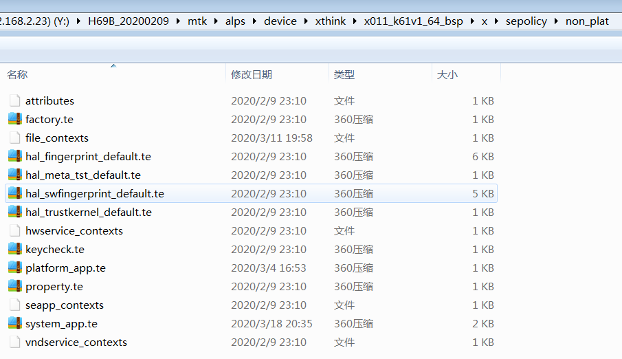
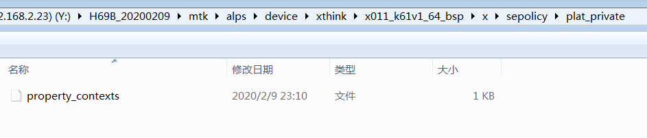
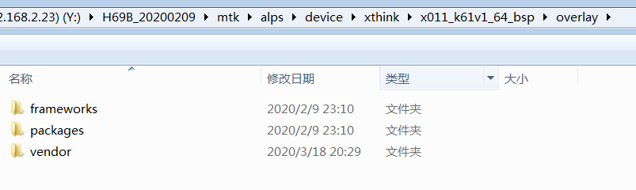
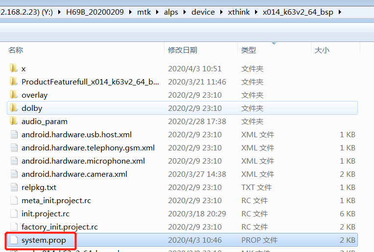
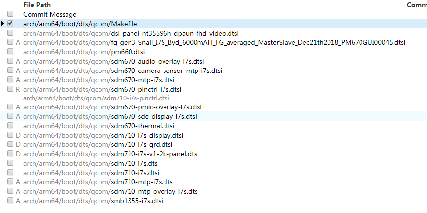
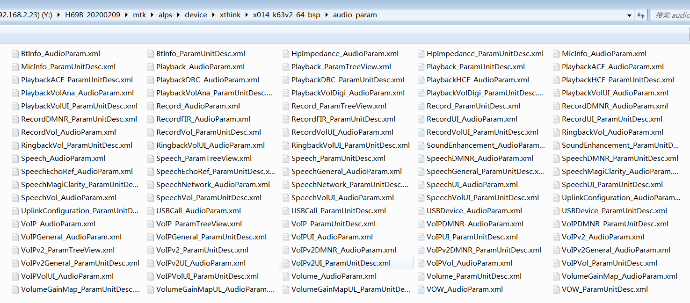
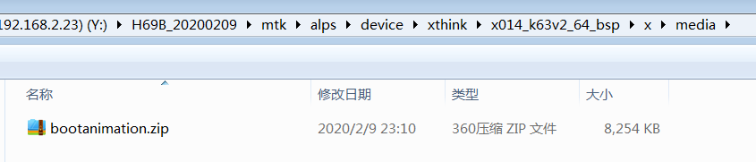
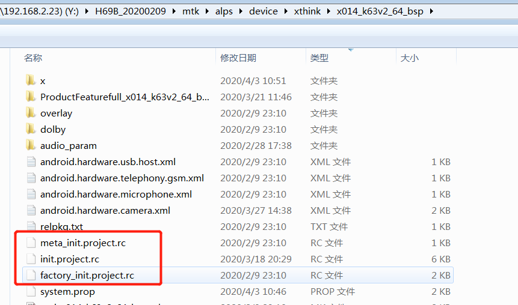
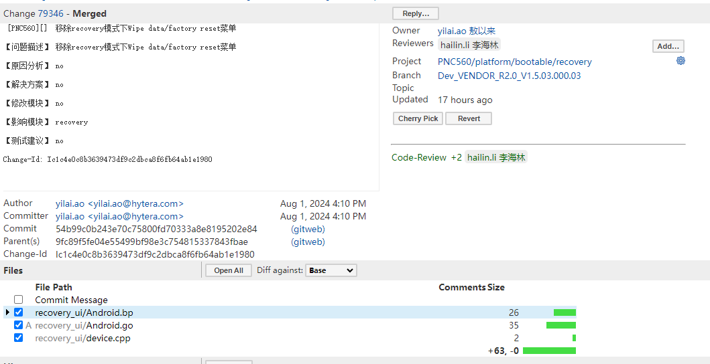

# P33: 系统开发之项目客制化


---

[跳转到readme](https://github.com/hfreeman2008/android_core_framework/blob/main/README-CN.md)


---

[<font face='黑体' color=#ff0000 size=40 >跳转到文章结尾</font>](#结束语)

---

[上一篇文章 P32_系统开发之IMS输入模块](https://github.com/hfreeman2008/android_core_framework/blob/main/P32_%E7%B3%BB%E7%BB%9F%E5%BC%80%E5%8F%91%E4%B9%8BIMS%E8%BE%93%E5%85%A5%E6%A8%A1%E5%9D%97/%E7%B3%BB%E7%BB%9F%E5%BC%80%E5%8F%91%E4%B9%8BIMS%E8%BE%93%E5%85%A5%E6%A8%A1%E5%9D%97.md)


[下一篇文章 P34_系统开发之Display](https://github.com/hfreeman2008/android_core_framework/blob/main/P34_%E7%B3%BB%E7%BB%9F%E5%BC%80%E5%8F%91%E4%B9%8BDisplay/%E7%B3%BB%E7%BB%9F%E5%BC%80%E5%8F%91%E4%B9%8BDisplay.md)


---

# 前言

现在许多公司都是采用一套代码，多个项目的模式来开发，我了解的MTK，Qcom二个平台就是这种模式；

这种模式有许多优点：

可以以最大程度的代码复用的方式，来开发一个新的项目。极大的减少了代码的工作量，极大的提高了项目代码的移植方便性，可以做到以最小的人力成本来开发多个项目；

所以优雅的项目客制化，是一个软件工程师的一个必备技能；

---


# 新建项目的步骤和说明


以新建一个i7s项目为例：

(1)添加lunch选择项目类型

device\qcom\common\vendorsetup.sh

```sh
add_lunch_combo i7s-user
add_lunch_combo i7s-userdebug
add_lunch_combo i7s-eng
```

(2)添加项目列表

vendor\qcom\proprietary\common\config\device-vendor.mk

```sh
PRODUCT_LIST += i7s
```

 (3) 对比当前项目名，新建一个i7s目录

device\qcom\i7s
 
然后对应来修改相关的信息。 

---

# 复制方式实现项目overlay

## 添加项目源代码的直接复制覆盖功能

build\make\overlay_codes_copy_hytera.sh

```sh
#!/bin/bash
#add  copy codes for different projects 2024_8_14 start
function copy() {
    local src=$1
    local des=$2
    echo "overlay_codes_copy_hytera.sh copy src : $src"
    echo "overlay_codes_copy_hytera.sh copy des : $des"
    if [ -d ${src} -a -d ${des} ]; then
        echo "cp -rf ${src}* ${des}"
        cp -rf ${src}* ${des}
    fi
}
function main()
{
    echo "*******do overlay codes copy hytera start********"
    echo "overlay_codes_copy_hytera.sh main src : $1"
    echo "overlay_codes_copy_hytera.sh main des : $2"
    copy $1 $2
    echo "*******do overlay codes copy hytera end********"
}
main $1 $2
#add  copy codes for different projects 2024_8_14 end
```
这个文件执行：

```sh
chmod 777 overlay_codes_copy_hytera.sh
```


build\make\envsetup.sh

```sh
function lunch()
{
.......    
    echo
    #add  copy codes for different projects 2024_8_14 start
    #local local_path=$PWD
    local local_path=`/bin/pwd`
    echo "local_path: $local_path"
    local overlay_codes_copy_file=$local_path/build/make/overlay_codes_copy_hytera.sh
    if [ -e $overlay_codes_copy_file ];then
        echo "$overlay_codes_copy_file file exist,copy file for different projects !!!!"
        echo "MOBILE_POLICE_VALUE $MOBILE_POLICE_VALUE"
        if [ $MOBILE_POLICE_VALUE = MOBILE_POLICE_VERSION ];then
            echo "mobile police project,copy cods"
            local mobile_police_src_file=$local_path/vendor/mobile_police/overlay_codes/
            echo "mobile_police_src_file $mobile_police_src_file"
            $overlay_codes_copy_file $mobile_police_src_file $local_path/
            ##. $overlay_codes_copy_file $mobile_police_src_file $local_path/
        fi
    else
        echo "$overlay_codes_copy_file file no exist!!!!"
    fi
    #add  copy codes for different projects 2024_8_14 end
    set_stuff_for_environment
    printconfig
    destroy_build_var_cache
}
```

对应的要客制化的源代码的位置为：

```sh
vendor\mobile_police\overlay_codes
```


---

## 复制具体contents.xml文件

device\qcom\i7s\non_hlos\contents.xml
 
要修改此路径为我们对应添加项目的路径:

out/target/product/i7s/
 
并且在脚本中:

在编译前复制对应项目的此文件:

copy_customer_overlay_code


```sh
 function copy_customer_overlay_code()
{
echo "copy_customer_overlay_code"
if [ -e $BUILD_AP_DIR/device/qcom/$BUILD_PROJECT_NAME/non_hlos ]; then
    chmod 777 contents.xml
    cp -rf $BUILD_AP_DIR/device/qcom/$BUILD_PROJECT_NAME/non_hlos/*   $SRC_DIR
    echo "end copy $BUILD_AP_DIR/device/qcom/$BUILD_PROJECT_NAME/non_hlos/* to SRC_DIR"
fi
}
```

---


## 直接复制文件来替换对应源码

build/make/core/envsetup.mk 

```sh
#add uvc camera interface
ifeq ($(strip $(TINNO_UVC_CAMERA_INTERFACE_SUPPORT)),bottom)

$(shell \cp -rf vendor/mediatek/uvc_camera_module/uvccameracode/Camera.java frameworks/base/core/java/android/hardware/Camera.java)

$(shell \cp -rf vendor/mediatek/uvc_camera_module/uvccameracode/android_hardware_Camera.cpp  frameworks/base/core/jni/android_hardware_Camera.cpp)

else ifeq ($(strip $(TINNO_UVC_CAMERA_INTERFACE_SUPPORT)),both)

$(shell \cp -rf vendor/mediatek/uvc_camera_module/uvccameracode/Camera.java frameworks/base/core/java/android/hardware/Camera.java)

$(shell \cp -rf vendor/mediatek/uvc_camera_module/uvccameracode/android_hardware_Camera.cpp  frameworks/base/core/jni/android_hardware_Camera.cpp)

else ifeq ($(strip $(TINNO_UVC_CAMERA_INTERFACE_SUPPORT)),no)

$(shell \cp -rf vendor/mediatek/uvc_camera_module/uvccameracode/android_source/Camera.java frameworks/base/core/java/android/hardware/Camera.java)

$(shell \cp -rf vendor/mediatek/uvc_camera_module/uvccameracode/android_source/android_hardware_Camera.cpp  frameworks/base/core/jni/android_hardware_Camera.cpp)

endif
```

---


## 配置项目的桌面布局文件

common\tools\do_overlay_copy.sh

```sh
#!/bin/bash

X_ROOT_PATH=
X_PROJECT_ID=

function Usage() {
    cat <<-EOT >&2

    Usage:
     ${SHELL_PROGRAM_NAME} <optstring> <parameters>
     ${SHELL_PROGRAM_NAME} [options] [--] <optstring> <parameters>
     ${SHELL_PROGRAM_NAME} [options] -o|--options <optstring> [options] [--] <parameters>

    Parse command options.

    Options:
     -r, --rootpath   <RootPath>            RootPath
     -d, --projectid  <ProjectID>           ProjectID

     -h, --help     display this help and exit
     -V, --version  output version information and exit

    version: 0.1
    See the code for more information.
    EOT
}

function main()
{
    echo "*******do overlay copy********"

    if [[ ${X_PROJECT_ID} == full_* ]]; then
        X_PROJECT_ID=${X_PROJECT_ID:5}
    fi
    #echo ${X_ROOT_PATH}
    #echo ${X_PROJECT_ID}
    X_OVERLAY_SCR_PATH=${X_ROOT_PATH}/../overlay/${X_PROJECT_ID}
    X_OVERLAY_DST_PATH=${X_ROOT_PATH}
    if [ -d ${X_OVERLAY_SCR_PATH} -a -d ${X_OVERLAY_DST_PATH} ]; then
        cp -rf ${X_OVERLAY_SCR_PATH}/* ${X_OVERLAY_DST_PATH}/
        echo "cp -rf ${X_OVERLAY_SCR_PATH}/* ${X_OVERLAY_DST_PATH}/"
    fi
}

if [ $# == 0 ] ; then
    Usage
    exit 0
fi

while true; do
  case "$1" in
        -h | --help | -v | --version)
            Usage
            exit 0
            ;;
        -r | --rootpath)
            shift
            X_ROOT_PATH=$1
            shift
            ;;
        -d | --projectid)
            shift
            X_PROJECT_ID=$1
            shift
            ;;
        *)
            #main
            break
            #exit 0
            ;;
  esac
done

main


```

build\make\envsetup.sh

```sh
function lunch()
{
    local answer

    if [ "$1" ] ; then
        answer=$1
    else
        print_lunch_menu
        echo -n "Which would you like? [aosp_arm-eng] "
        read answer
    fi

    local selection=

    if [ -z "$answer" ]
    then
        selection=aosp_arm-eng
    elif (echo -n $answer | grep -q -e "^[0-9][0-9]*$")
    then
        local choices=($(TARGET_BUILD_APPS= get_build_var COMMON_LUNCH_CHOICES))
        if [ $answer -le ${#choices[@]} ]
        then
            # array in zsh starts from 1 instead of 0.
            if [ -n "$ZSH_VERSION" ]
            then
                selection=${choices[$(($answer))]}
            else
                selection=${choices[$(($answer-1))]}
            fi
        fi
    else
        selection=$answer
    fi

    export TARGET_BUILD_APPS=

    local product variant_and_version variant version

    product=${selection%%-*} # Trim everything after first dash
    variant_and_version=${selection#*-} # Trim everything up to first dash
    if [ "$variant_and_version" != "$selection" ]; then
        variant=${variant_and_version%%-*}
        if [ "$variant" != "$variant_and_version" ]; then
            version=${variant_and_version#*-}
        fi
    fi

    if [ -z "$product" ]
    then
        echo
        echo "Invalid lunch combo: $selection"
        return 1
    fi

    TARGET_PRODUCT=$product \
    TARGET_BUILD_VARIANT=$variant \
    TARGET_PLATFORM_VERSION=$version \
    build_build_var_cache
    if [ $? -ne 0 ]
    then
        return 1
    fi

    export TARGET_PRODUCT=$(get_build_var TARGET_PRODUCT)
    export TARGET_BUILD_VARIANT=$(get_build_var TARGET_BUILD_VARIANT)
    if [ -n "$version" ]; then
      export TARGET_PLATFORM_VERSION=$(get_build_var TARGET_PLATFORM_VERSION)
    else
      unset TARGET_PLATFORM_VERSION
    fi
    export TARGET_BUILD_TYPE=release

    echo
+    # begin, add
+    ( [ -f device/xthink/common/tools/do_overlay_copy.sh ] \
+      && bash device/xthink/common/tools/do_overlay_copy.sh -r ${PWD} -d ${TARGET_PRODUCT} \
+      && echo "do_overlay_copy.sh done.")
    #generate XthinkFeature.java XthinkFeature.h XthinkFeature.mk
    ( cd device/xthink/common/PlatformFeature && bash GenFeatures.sh )
    #X-thinks end
    set_stuff_for_environment
    printconfig
    destroy_build_var_cache
}
```


---

## 表格配置项目

vendor/dists/scripts/project.csv


build/make/make_SC780_AP.sh

```sh
FILENAME="vendor/dists/scripts/project.csv"
#当前编译的项目名
CUSTOM_PROJ_NAME=0
......
function get_custom_project_name(){
if [ ! -f "$FILENAME" ]; then
    echo "CSV file doesn't exist"
    exit
fi
i=0
num=0
while IFS=, read -r id_tmp pro_tmp; do
    id[$i]=${id_tmp}
    proj[$i]=${pro_tmp}
    i=`expr ${i} + 1`
    num=${i}
done < "$FILENAME"
##使用数组变量中的值
for ((i=0;i<${num};++i));
do
    current_id=${id[$i]}
    if [ "$current_id" -eq "$CUSTOM_VERSION" ]; then
        CUSTOM_PROJ_NAME=${proj[$i]}
        echo "current_id is $current_id"
        echo "current_proj is $CUSTOM_PROJ_NAME"
        break
    fi
done
}
......
if [ $CUSTOM_VERSION -ne 0 ]; then
get_custom_project_name
export CUSTOM_PROJ_NAME
fi
......

```


具体原理为：

```sh
#!/bin/bash
 
while IFS=, read -r column1 column3
do
  echo "Column 1: $column1 - Column 3: $column3"
done < data.csv
 
```
这个脚本会逐行读取data.csv文件，并将每行的第一个和第三个字段分别赋值给变量column1和column3


---


# 客制化项目的selinux权限文件

```sh
BOARD_SEPOLICY_DIRS += device/x011_k61v1_64_bsp/x/sepolicy/non_plat
BOARD_PLAT_PRIVATE_SEPOLICY_DIR += device/x011_k61v1_64_bsp/x/sepolicy/plat_private
```


```sh
PRODUCT_PUBLIC_SEPOLICY_DIRS
BOARD_VENDOR_SEPOLICY_DIRS
```






## 修改之后，怎么快速验证？

方法一：
mmm system/sepolicy

生成out目录下，注意有两个目录：

- system/etc/sepolicy---Android 原生的，建议不动。如果修改，会影响CTS
- vendor/etc/sepolicy---第三方厂家修改。

特别说明：
```sh
system/sepolicy/Android.mk中定义了一些属性
BOARD_SEPOLICY_DIRS  ##此宏涉及到的目录，会编译到vendor/etc/sepolicy下
PLAT_PUBLIC_POLICY ##此宏涉及到的目录，会当成system/sepolicy/public
PLAT_PRIVATE_POLICY##此宏涉及到的目录，会当成system/sepolicy/private
另外，单独编译后，会发现都会有对应的生成目录
```


```sh
public - PLAT_PUBLIC_POLICY，平台公开规则，会被导出给其他非平台相关的规则。
private - PLAT_PRIVATE_POLICY，平台私有规则，不会向vendor部分暴露。
vendor - PLAT_VENDOR_POLICY，厂商规则，可引用public的规则，不能引用private的规则。
```


---

# 对应项目资源overlay


x011_k61v1_64_bsp项目

x011_k61v1_64_bsp/device.mk

```sh
DEVICE_PACKAGE_OVERLAYS += $(LOCAL_PATH)/overlay
```




https://blog.csdn.net/wh_19910525/article/details/39254815

Android平台Overlay机制


- PRODUCT_PACKAGE_OVERLAYS: used by a particular product
- DEVICE_PACKAGE_OVERLAYS: used several products that share a common device model

如果包含同一资源，那么 PRODUCT_PACKAGE_OVERLAYS 将覆盖 DEVICE_PACKAGE_OVERLAYS 中的


mk文件：
```sh
# package overlay.
PRODUCT_PACKAGE_OVERLAYS += $(LOCAL_PATH)/overlay
```


```sh
./vendor/k120/trunk/gms.mk
PRODUCT_PACKAGE_OVERLAYS += $(ANDROID_PARTNER_GMS_HOME)/apps/GoogleDialer/overlay

./vendor/k120/trunk/configs.mk
PRODUCT_PACKAGE_OVERLAYS := $(LOCAL_PATH)/overlay

./vendor/k101/wik_fr/gms.mk
PRODUCT_PACKAGE_OVERLAYS += \

./vendor/k101/wik_fr/gms.mk
PRODUCT_PACKAGE_OVERLAYS += $(ANDROID_PARTNER_GMS_HOME)/apps/GoogleDialer/overlay
```

---


# 对应项目应用的AndroidManifest.xml文件客制化

```sh
HAVE_CUST_TARGET_PRODUCT := $(shell test -d $(LOCAL_PATH)/main/manifests/$(TARGET_PRODUCT) && echo yes)
$(info TARGET_PRODUCT = $(TARGET_PRODUCT) )
$(info HAVE_CUST_TARGET_PRODUCT = $(HAVE_CUST_TARGET_PRODUCT) )

ifeq ($(HAVE_CUST_TARGET_PRODUCT),yes)
    ifeq ($(TARGET_BUILD_VARIANT),eng)
        LOCAL_MANIFEST_FILE := main/manifests/$(TARGET_PRODUCT)/eng/AndroidManifest.xml
    else
        LOCAL_MANIFEST_FILE := main/manifests/$(TARGET_PRODUCT)/user/AndroidManifest.xml
    endif
else
    ifeq ($(TARGET_BUILD_VARIANT),eng)
        LOCAL_MANIFEST_FILE := main/manifests/common/eng/AndroidManifest.xml
    else
        LOCAL_MANIFEST_FILE := main/manifests/common/user/AndroidManifest.xml
    endif
endif


$(info Current variant = $(TARGET_BUILD_VARIANT), using $(LOCAL_MANIFEST_FILE) )
```

---

# 客制化不同项目应用assets目录


LOCAL_ASSET_DIR：

```mk
HAVE_CUST_ASSETS := $(shell test -d $(LOCAL_PATH)/main/assets/$(TARGET_PRODUCT) && echo yes)
$(info TARGET_PRODUCT = $(TARGET_PRODUCT) )
$(info HAVE_CUST_ASSETS = $(HAVE_CUST_ASSETS) )

ifeq ($(HAVE_CUST_ASSETS),yes)
    LOCAL_ASSET_DIR := \
        $(LOCAL_PATH)/main/assets/$(TARGET_PRODUCT) \
        $(LOCAL_PATH)/main/assets/common
else
    LOCAL_ASSET_DIR := \
        $(LOCAL_PATH)/main/assets/common_custom_project \
        $(LOCAL_PATH)/main/assets/common
endif
```


---

# 各个项目buildinfo.sh的客制化


```mk
$(warning --PWD--$(PWD)-----)
$(warning --TINNO_PRJ_DIR--$(TINNO_PRJ_DIR)-----)
ifneq ($(wildcard $(PWD)/$(TINNO_PRJ_DIR)/buildinfo.sh),)   
      BUILDINFO_SH := $(PWD)/$(TINNO_PRJ_DIR)/buildinfo.sh
else
    BUILDINFO_SH := build/tools/buildinfo.sh
endif
```

这种方式来使用各个订单来自定义系统属性

系统属性的配制文件

./build/make/tools/buildinfo.sh

编译核心文件

./build/core/main.mk

./build/core/Makefile 

---

# 各个项目的system.prop客制化




system.prop

```mk
# audio
ro.camera.sound.forced=0
ro.audio.silent=0

ro.zygote.preload.enable=0
```

具体实现：

build/make/core/Makefile

```mk
ifdef TARGET_SYSTEM_PROP
system_prop_file := $(TARGET_SYSTEM_PROP)
else
system_prop_file := $(wildcard $(TARGET_DEVICE_DIR)/system.prop)
endif
```

---

# 项目客制化的驱动文件


kernel/msm-4.9/arch/arm64/boot/dts/qcom/



与i7s相关的配置文件有:

```mk
sdm710-i7s.dts  --------------------------------------------被Makefile引用
sdm710-i7s.dtsi ---------------------------------------------被sdm710-i7s.dts引用
sdm710-i7s-audio-overlay.dtsi --------------------------被sdm710-i7s-qrd.dtsi引用
sdm710-i7s-display.dtsi ----------------------------------被sdm710-i7s-qrd.dtsi引用
sdm710-i7s-pinctrl.dtsi  -----------------------------------被sdm710-i7s.dtsi引用
sdm710-i7s-qrd.dtsi  ---------------------------------------被sdm710-i7s-v1-2k-panel.dtsi引用
sdm710-i7s-v1-2k-panel.dts-------------------------------被Makefile引用
```

我们搜索sdm710-i7s:
```mk
kernel/msm-4.9$ grep -rni "sdm710-i7s"  ./  --color
./arch/arm64/boot/dts/qcom/sdm710-i7s.dtsi:2894:#include "sdm710-i7s-pinctrl.dtsi"
./arch/arm64/boot/dts/qcom/sdm710-i7s-v1-2k-panel.dts:22:#include "sdm710-i7s-qrd.dtsi"
./arch/arm64/boot/dts/qcom/sdm710-i7s.dts:15:#include "sdm710-i7s.dtsi"
./arch/arm64/boot/dts/qcom/Makefile:119:                sdm710-i7s-v1-2k-panel.dtbo
./arch/arm64/boot/dts/qcom/Makefile:121:sdm710-i7s-v1-2k-panel.dtbo-base := sdm710-i7s.dtb
./arch/arm64/boot/dts/qcom/Makefile:276:dtb-$(CONFIG_ARCH_SDM710_I7S) += sdm710-i7s.dtb \
./arch/arm64/boot/dts/qcom/Makefile:277:    sdm710-i7s-v1-2k-panel.dtb
./arch/arm64/boot/dts/qcom/sdm710-i7s-qrd.dtsi:17:#include "sdm710-i7s-display.dtsi"
./arch/arm64/boot/dts/qcom/sdm710-i7s-qrd.dtsi:19:#include "sdm710-i7s-audio-overlay.dtsi"
```


一些调试效果：

kernel/msm-4.9/arch/arm64/boot/dts/qcom/dsi-panel-nt35596h-dpaun-fhd-video.dtsi

这个文件是在kernel\msm-4.9\arch\arm64\boot\dts\qcom\sdm710-i7s-display.dtsi引用的:


```mk
#include "dsi-panel-nt35596h-dpaun-fhd-video.dtsi"
```

kernel/msm-4.9/arch/arm64/boot/dts/qcom/sdm710-i7s-display.dtsi

kernel/msm-4.9/arch/arm64/boot/dts/qcom/sdm670-pmic-overlay.dtsi


camera sensor的配制文件:

kernel/msm-4.9/arch/arm64/boot/dts/qcom/sdm670-camera-sensor-qrd.dtsi


overlay dtsi的项目文件:

以sdm670-audio-overlay.dtsi为例,我们将其客置化为我们i7s项目中去:

kernel/msm-4.9/arch/arm64/boot/dts/qcom/sdm670-audio-overlay.dtsi

在我们的i7s项目的dtsi文件中:

kernel/msm-4.9/arch/arm64/boot/dts/qcom/sdm710-i7s-qrd.dtsi,将:


```mk
#include "sdm670-audio-overlay.dtsi"
```

修改为:

```mk
#include "sdm710-i7s-audio-overlay.dtsi"
```

新建一个sdm710-i7s-audio-overlay.dtsi文件,将kernel/msm-4.9/arch/arm64/boot/dts/qcom/sdm670-audio-overlay.dtsi内容复制到其中,就完成了i7s项目的audio客置化.


---

# audio param 项目客制化

device/x007_k39tv1_bsp /audio_param/

mk文件:

```mk
MTK_AUDIO_PARAM_DIR_LIST := $(LOCAL_PATH)/audio_param
PRODUCT_COPY_FILES += $(LOCAL_PATH)/audio_param/Speech_AudioParam.xml:$(TARGET_COPY_OUT_VENDOR)/etc/aurisys_param/Speech_AudioParam.xml
```





```mk
# Audio Policy
PRODUCT_COPY_FILES += $(LOCAL_PATH)/audio_policy.conf:$(TARGET_COPY_OUT_VENDOR)/etc/audio_policy.conf:mtk
```

---


# 不同项目客制化来电，铃声，通知音，音效等资源

在各项目中(以N30为例)添加sounds目录：

device\xthink\N30\N30\sounds

包含以下四个目录：

alarms  notifications ringtones ui

然后添加配置文件：

sounds.mk

将其资源复制到手机目录system/media/audio/下：

```mk
LOCAL_PATH := device/xthink/N30/N30/sounds
PRODUCT_COPY_FILES += \
$(LOCAL_PATH)/alarms/Alarm_Beep_01.ogg:system/media/audio/alarms/Alarm_Beep_01.ogg \
$(LOCAL_PATH)/alarms/Alarm_Beep_02.ogg:system/media/audio/alarms/Alarm_Beep_02.ogg \
$(LOCAL_PATH)/alarms/Alarm_Beep_03.ogg:system/media/audio/alarms/Alarm_Beep_03.ogg
```

然后将此sounds.mk，添加到项目中去：

```mk
# support custom ringtones
FEATURE_CUSTOM_RINGTONES := true
#copy custom sounds res
ifeq ($(FEATURE_CUSTOM_RINGTONES),true)
$(call inherit-product,device/xthink/$(TARGET_PRODUCT)/$(TARGET_PRODUCT)/sounds/sounds.mk)
```

再将frameworks目录下的复制操作屏蔽：

device/mediatek/common/ago/device.mk

```mk
ifneq ($(FEATURE_CUSTOM_RINGTONES),true)
$(call inherit-product-if-exists, frameworks/base/data/sounds/AllAudio.mk)
endif
```

---

# 客制化项目的开机动画

```mk
PRODUCT_COPY_FILES += $(LOCAL_PATH)/media/bootanimation.zip:system/media/bootanimation.zip
```




---

# 项目客制化rc文件

```mk
PRODUCT_COPY_FILES += $(LOCAL_PATH)/factory_init.project.rc:$(TARGET_COPY_OUT_VENDOR)/etc/init/hw/factory_init.project.rc
PRODUCT_COPY_FILES += $(LOCAL_PATH)/init.project.rc:$(TARGET_COPY_OUT_VENDOR)/etc/init/hw/init.project.rc
PRODUCT_COPY_FILES += $(LOCAL_PATH)/meta_init.project.rc:$(TARGET_COPY_OUT_VENDOR)/etc/init/hw/meta_init.project.rc
```

核心文件：

初始化init.rc文件:

system/core/rootdir/init.rc

项目客制化rc文件:

device\xthink\x012_k62v1_64_bsp\init.project.rc



---


# 客制化项目的vendor/etc/permissions/文件


```mk
# Microphone
PRODUCT_COPY_FILES += $(LOCAL_PATH)/android.hardware.microphone.xml:$(TARGET_COPY_OUT_VENDOR)/etc/permissions/android.hardware.microphone.xml
# Camera
PRODUCT_COPY_FILES += $(LOCAL_PATH)/android.hardware.camera.xml:$(TARGET_COPY_OUT_VENDOR)/etc/permissions/android.hardware.camera.xml
# alps/mediatek/config/$project
PRODUCT_COPY_FILES += $(LOCAL_PATH)/android.hardware.telephony.gsm.xml:$(TARGET_COPY_OUT_VENDOR)/etc/permissions/android.hardware.telephony.gsm.xml
```

---

# 客制化项目的项目名变量--TARGET_PRODUCT

这个就是lunch时选择项目的名字

使用例子：

```mk
$(call inherit-product,device/xthink/$(TARGET_PRODUCT)/$(TARGET_PRODUCT)/sounds/sounds.mk)
```


```mk
ifeq ($(TARGET_PRODUCT),VIA_A4)
PRODUCT_PACKAGES += GoogleDialer
PRODUCT_PACKAGES += DeskClockGoogle
endif
```

---

# h,c文件的项目客制化

ANDROID_PLATFORM_MDM_MUTE

Android.mk

```mk
ifeq ($(strip $(ANDROID_PLATFORM_AUDIO)),true)
  LOCAL_CFLAGS += -DANDROID_PLATFORM_MDM_MUTE
endif
```

.h文件

```mk
#ifdef ANDROID_PLATFORM_MDM_MUTE
    int drm_mute_spk;
    ......
#endif
```

.c文件

```mk
#ifdef ANDROID_PLATFORM_MDM_MUTE
    ALOGD("add  function %s Line %d adev->drm_mute_spk=%d",__func__,__LINE__,adev->drm_mute_spk);
    ......
#endif
```

---

# cpp文件的客制化

CONFIG_XIANYANG_AIRPORT_NO_GMS

android.bp和.cpp




```mk
diff --git a/recovery_ui/Android.bp b/recovery_ui/Android.bp
index 9dfee5f..76dc26a 100644
--- a/recovery_ui/Android.bp
+++ b/recovery_ui/Android.bp
@@ -12,12 +12,38 @@
 // See the License for the specific language governing permissions and
 // limitations under the License.
 
+//bsp add start
+bootstrap_go_package {
+    name: "soong-init",
+    pkgPath: "android/soong/init",
+    deps: [
+        "blueprint",
+        "blueprint-pathtools",
+        "soong",
+        "soong-android",
+        "soong-cc",
+        "soong-genrule",
+    ],
+    srcs: [
+          "Android.go",
+    ],
+    pluginFor: ["soong_build"],
+}
+
+Xianyang_Airport {
+   name: "xianyang_airport_default"
+}
+//bsp add end
+
 cc_library {
     name: "librecovery_ui",
     recovery_available: true,
 
     defaults: [
         "recovery_defaults",
+//bsp add start
+    "xianyang_airport_default",
+//bsp add end
     ],
 
     srcs: [
diff --git a/recovery_ui/Android.go b/recovery_ui/Android.go
new file mode 100644
index 0000000..aaf57c2
--- /dev/null
+++ b/recovery_ui/Android.go
@@ -0,0 +1,35 @@
+package xianyang_airport
+import (
+        "android/soong/android"
+        "android/soong/cc"
+        "fmt"
+        "strings"
+)
+func init() {
+    // for DEBUG
+    fmt.Println("init start")
+    android.RegisterModuleType("Xianyang_Airport", DefaultsFactory)
+}
+func DefaultsFactory() (android.Module) {
+    module := cc.DefaultsFactory()
+    android.AddLoadHook(module, Defaults)
+    return module
+}
+func Defaults(ctx android.LoadHookContext) {
+    type props struct {
+        Cppflags []string
+    }
+    p := &props{}
+    p.Cppflags = globalDefaults(ctx)
+    ctx.AppendProperties(p)
+}
+func globalDefaults(ctx android.BaseContext) ([]string) {
+    var cppflags []string
+    fmt.Println("JENKINS_DREAM_CUSTOM_PROJECT_NAME:",
+        ctx.AConfig().Getenv("JENKINS_DREAM_CUSTOM_PROJECT_NAME"))
+    if strings.EqualFold(ctx.AConfig().Getenv("JENKINS_DREAM_CUSTOM_PROJECT_NAME"),"XIANYANG_AIRPORT_NO_GMS") {
+          cppflags = append(cppflags,
+                         "-DCONFIG_XIANYANG_AIRPORT_NO_GMS=1")
+    }
+    return cppflags
+}
diff --git a/recovery_ui/device.cpp b/recovery_ui/device.cpp
index d46df92..3129d38 100644
--- a/recovery_ui/device.cpp
+++ b/recovery_ui/device.cpp
@@ -32,7 +32,9 @@
   { "Enter fastboot", Device::ENTER_FASTBOOT },
   { "Apply update from ADB", Device::APPLY_ADB_SIDELOAD },
   { "Apply update from SD card", Device::APPLY_SDCARD },
+#ifndef CONFIG_XIANYANG_AIRPORT_NO_GMS
   { "Wipe data/factory reset", Device::WIPE_DATA },
+#endif
   { "Wipe cache partition", Device::WIPE_CACHE },
   { "Mount /system", Device::MOUNT_SYSTEM },
   { "View recovery logs", Device::VIEW_RECOVERY_LOGS },


```

---

# 各个项目裁剪应用

## Android 13版本

1.修改 build/core/product.mk

添加 PRODUCT_DEL_PACKAGES 变量的声明

新增一行_product_single_value_vars += PRODUCT_DEL_PACKAGES

```mk
# The first API level this product shipped with
_product_single_value_vars += PRODUCT_SHIPPING_API_LEVEL
_product_single_value_vars += PRODUCT_DEL_PACKAGES # 新增

_product_list_vars += VENDOR_PRODUCT_RESTRICT_VENDOR_FILES
_product_list_vars += VENDOR_EXCEPTION_MODULES

```


2. 修改 build/core/main.mk

修改 product-installed-files 函数的定义，增加两行：

```mk
  $(eval ### Filter out the overridden packages and executables before doing expansion) \
  $(eval _pif_overrides := $(call module-overrides,$(_pif_modules))) \
  $(eval _pif_modules := $(filter-out $(_pif_overrides), $(_pif_modules))) \
  $(eval _pif_dels := $(call get-product-var,$(1),PRODUCT_DEL_PACKAGES)) \
  $(eval _pif_modules := $(filter-out $(_pif_dels), $(_pif_modules))) \
  $(eval ### Resolve the :32 :64 module name) \

```

3. 在相应的设备产品mk文件中添加用PRODUCT_DEL_PACKAGES属性来控制模块删除

一般编辑的文件路径为device/公司名/产品名/device.mk, 比如rk3399中：

device/rockchip/rk3399/device.mk

我用的模拟器，使用 lunch sdk_pc_x86_64-userdebug，文件位置为：

aosp/build/target/board/emulator_x86_64/device.mk


```mk
# 要裁剪的应用
PRODUCT_DEL_PACKAGES += \
    messaging \
    Dialer \
    Contacts \
    Email \
    Camera2 \
    Browser2 \
    Calendar \
    DocumentsUI \
    Music \
    MusicFX \
    ExactCalculator \

```


## 其他版本的实现方式

./build/core/product.mk


```mk
+# modify by  2023-09-24
+_product_var_list += PRODUCT_DEL_PACKAGES

define dump-product
$(info ==== $(1) ====)\
$(foreach v,$(_product_var_list),\
$(info PRODUCTS.$(1).$(v) := $(PRODUCTS.$(1).$(v))))\
$(info --------)
endef

```

./build/core/main.mk

```mk
  # The base list of modules to build for this product is specified
  # by the appropriate product definition file, which was included
  # by product_config.mk.
  product_MODULES := $(PRODUCTS.$(INTERNAL_PRODUCT).PRODUCT_PACKAGES)

 + #modify 
 + product_MODULES := $(filter-out $(PRODUCTS.$(INTERNAL_PRODUCT).PRODUCT_DEL_PACKAGES), $(product_MODULES))

  # Filter out the overridden packages before doing expansion
  product_MODULES := $(filter-out $(foreach p, $(product_MODULES), \
      $(PACKAGES.$(p).OVERRIDES)), $(product_MODULES))

```

./build/target/product/core.mk

```mk
#modify 
# system app  priv-app
PRODUCT_DEL_PACKAGES += \
        Browser2 \
        Calendar \
        CalendarProvider \

        EasterEgg \
        OmaDownload \
        OmaDrmEngineServer \
        UserDictionaryProvider \
        CtsShimPrebuilt \
        CtsShimPrivPrebuilt
```


---

# 各个项目system feature裁剪

部分系统功能是靠feature来进行控制的，比如
```mk
<permissions>
    <feature name="android.hardware.audio.output" />
    <feature name="android.hardware.bluetooth" />
    <feature name="android.hardware.camera" />
    <feature name="android.hardware.location" />
    <feature name="android.hardware.location.gps" />
    <feature name="android.hardware.location.network" />
    <feature name="android.hardware.sensor.accelerometer" />
    <feature name="android.hardware.sensor.ambient_temperature" />

```

对于feature的剪裁，google提供了system/etc/permissions/unavailable_feature.xml文件。

要剪裁这些feature，可以统一在/device/XXX/common/unavailable_feature.xml中添加unavailable-feature来去掉这些feature。如

```xml
<?xml version="1.0" encoding="utf-8"?>

<permissions>
    <unavailable-feature name="android.hardware.camera.autofocus" />
    <unavailable-feature name="android.hardware.camera.front" />
    <unavailable-feature name="android.hardware.camera" />
    <unavailable-feature name="android.hardware.camera.capability.manual_post_processing" />
    <unavailable-feature name="android.hardware.camera.any" />
    <unavailable-feature name="android.hardware.camera.capability.raw" />
    <unavailable-feature name="android.hardware.camera.capability.manual_sensor" />
    <unavailable-feature name="android.hardware.camera.level.full" />
</permissions>
```

之后，用该unavailable_feature.xml替换/system/etc/permissions/unavailable_feature.xml

```mk
PRODUCT_COPY_FILES += \
device/XXX/common/unavailable_feature.xml:system/etc/permissions/unavailable_feature.xml
```

这部分，对应参考方法：

frameworks/base/core/java/com/android/server/SystemConfig.java

```java
final ArraySet<String> mUnavailableFeatures = new ArraySet<>();


unavailable-feature
```

---

# 新增字符串目录支持

## Android.bp
frameworks/base/core/res/Android.bp
```java
resource_dirs: [
        "res",
        "res-dream",
],
```

## Android.mk

定义资源目:LOCAL_RESOURCE_DIR

```mk
LOCAL_PATH := $(call my-dir)
include $(CLEAR_VARS)
LOCAL_MODULE := my_app
LOCAL_SRC_FILES := $(call all-java-files-under, src)
LOCAL_RESOURCE_DIR := $(LOCAL_PATH)/res  # 主资源目录
LOCAL_RESOURCE_DIR += vendor/extra/res    # 附加资源目录
include $(BUILD_PACKAGE)
```


---


# 参考文档

1.Android 13 Framework 裁剪

https://blog.csdn.net/didayuye/article/details/134016458


---

[<font face='黑体' color=#ff0000 size=40 >跳转到文章开始</font>](#p33-系统开发之项目客制化)

---


[上一篇文章 P32_系统开发之IMS输入模块](https://github.com/hfreeman2008/android_core_framework/blob/main/P32_%E7%B3%BB%E7%BB%9F%E5%BC%80%E5%8F%91%E4%B9%8BIMS%E8%BE%93%E5%85%A5%E6%A8%A1%E5%9D%97/%E7%B3%BB%E7%BB%9F%E5%BC%80%E5%8F%91%E4%B9%8BIMS%E8%BE%93%E5%85%A5%E6%A8%A1%E5%9D%97.md)


[下一篇文章 P34_系统开发之Display](https://github.com/hfreeman2008/android_core_framework/blob/main/P34_%E7%B3%BB%E7%BB%9F%E5%BC%80%E5%8F%91%E4%B9%8BDisplay/%E7%B3%BB%E7%BB%9F%E5%BC%80%E5%8F%91%E4%B9%8BDisplay.md)


---

# 结束语

