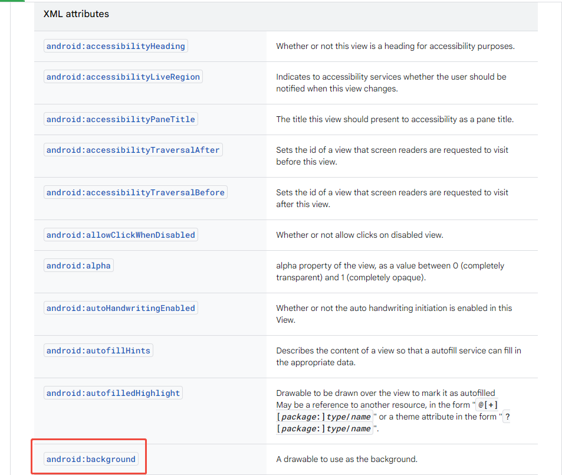

# View的控件xml属性和Activity的xml属性解析


---

[跳转到readme](https://github.com/hfreeman2008/android_core_framework/blob/main/README-CN.md)


[返回 P34: 系统开发之Display](https://github.com/hfreeman2008/android_core_framework/blob/main/P34_%E7%B3%BB%E7%BB%9F%E5%BC%80%E5%8F%91%E4%B9%8BDisplay/%E7%B3%BB%E7%BB%9F%E5%BC%80%E5%8F%91%E4%B9%8BDisplay.md)


---

[<font face='黑体' color=#ff0000 size=40 >跳转到文章结尾</font>](#结束语)

---


# 前言
刚开始学习android基本控件时，直接在xml布局文件中配置基本的UI控件属性，就可以实现控件的自定义；

那个到底是如何实现的呢？

我们今天一起追一个源码，探索一下；


---

# View控件的xml属性
以View的background为例：

---

## (1)xml布局文件为

```xml
<View
     android:id="@+id/my_view"
     android:layout_width="wrap_content"
     android:layout_height="wrap_content"
     android:background="@drawable/rounded_border"/>
```


## (2)xml解析
frameworks\base\core\java\android\view\View.java

View#View
```java
/**
 * Perform inflation from XML and apply a class-specific base style from a
 * theme attribute or style resource. This constructor of View allows
 * subclasses to use their own base style when they are inflating.
 * <p>
 * When determining the final value of a particular attribute, there are
 * four inputs that come into play:
 * <ol>
 * <li>Any attribute values in the given AttributeSet.
 * <li>The style resource specified in the AttributeSet (named "style").
 * <li>The default style specified by <var>defStyleAttr</var>.
 * <li>The default style specified by <var>defStyleRes</var>.
 * <li>The base values in this theme.
 * </ol>
 * <p>
 * Each of these inputs is considered in-order, with the first listed taking
 * precedence over the following ones. In other words, if in the
 * AttributeSet you have supplied <code>&lt;Button * textColor="#ff000000"&gt;</code>
 * , then the button's text will <em>always</em> be black, regardless of
 * what is specified in any of the styles.
 *
 * @param context The Context the view is running in, through which it can
 *        access the current theme, resources, etc.
 * @param attrs The attributes of the XML tag that is inflating the view.
 * @param defStyleAttr An attribute in the current theme that contains a
 *        reference to a style resource that supplies default values for
 *        the view. Can be 0 to not look for defaults.
 * @param defStyleRes A resource identifier of a style resource that
 *        supplies default values for the view, used only if
 *        defStyleAttr is 0 or can not be found in the theme. Can be 0
 *        to not look for defaults.
 * @see #View(Context, AttributeSet, int)
 */
public View(Context context, @Nullable AttributeSet attrs, int defStyleAttr, int defStyleRes) {
......
final int N = a.getIndexCount();
for (int i = 0; i < N; i++) {
    int attr = a.getIndex(i);
    switch (attr) {
        //这就是对android:background属性解析
        case com.android.internal.R.styleable.View_background:
            background = a.getDrawable(attr);
            break;
        //这就是对android:padding属性解析
        case com.android.internal.R.styleable.View_padding:
            padding = a.getDimensionPixelSize(attr, -1);
            mUserPaddingLeftInitial = padding;
            mUserPaddingRightInitial = padding;
            leftPaddingDefined = true;
            rightPaddingDefined = true;
            break;
        //这就是对android:paddingHorizontal属性解析
        case com.android.internal.R.styleable.View_paddingHorizontal:
            paddingHorizontal = a.getDimensionPixelSize(attr, -1);
            mUserPaddingLeftInitial = paddingHorizontal;
            mUserPaddingRightInitial = paddingHorizontal;
            leftPaddingDefined = true;
            rightPaddingDefined = true;
            break;
        //这就是对android:paddingVertical属性解析
        case com.android.internal.R.styleable.View_paddingVertical:
            paddingVertical = a.getDimensionPixelSize(attr, -1);
            break;
.......
}
```

## (3)属性定义文件

frameworks\base\core\res\res\values\attrs.xml


```xml
<!-- A drawable to use as the background.  This can be either a reference
     to a full drawable resource (such as a PNG image, 9-patch,
     XML state list description, etc), or a solid color such as "#ff000000"
    (black). -->
<attr name="background" format="reference|color" />
```


## (4)view的其他xml属性




---

# TextView控件的xml属性

以TextView的editable为例：


```xml

```


```xml

```


```xml

```


```xml

```


```xml

```


---


---


---


---

[<font face='黑体' color=#ff0000 size=40 >跳转到文章开始</font>](#p34-系统开发之display)

---


[返回 P34: 系统开发之Display](https://github.com/hfreeman2008/android_core_framework/blob/main/P34_%E7%B3%BB%E7%BB%9F%E5%BC%80%E5%8F%91%E4%B9%8BDisplay/%E7%B3%BB%E7%BB%9F%E5%BC%80%E5%8F%91%E4%B9%8BDisplay.md)


---

# 结束语

