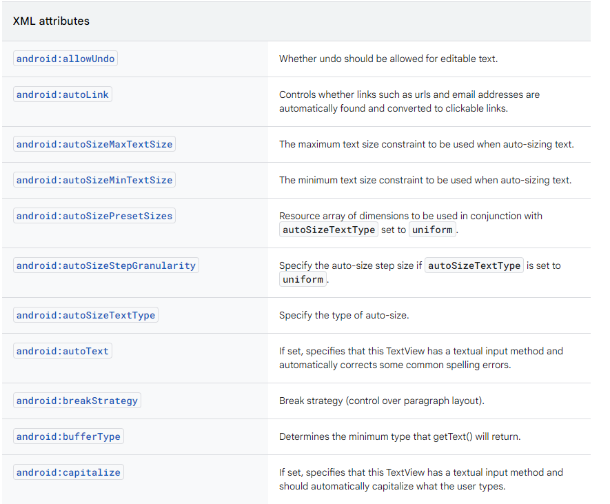

# View的控件xml属性和Activity的xml属性解析


---

[跳转到readme](https://github.com/hfreeman2008/android_core_framework/blob/main/README-CN.md)


[返回 P34: 系统开发之Display](https://github.com/hfreeman2008/android_core_framework/blob/main/P34_%E7%B3%BB%E7%BB%9F%E5%BC%80%E5%8F%91%E4%B9%8BDisplay/%E7%B3%BB%E7%BB%9F%E5%BC%80%E5%8F%91%E4%B9%8BDisplay.md)


---

[<font face='黑体' color=#ff0000 size=40 >跳转到文章结尾</font>](#结束语)

---


# 前言
刚开始学习android基本控件时，直接在xml布局文件中配置基本的UI控件属性，就可以实现控件的自定义；

那个到底是如何实现的呢？

我们今天一起追一个源码，探索一下；


---

# View控件的xml属性
以View的background为例：

---

## (1)xml布局文件为

```xml
<View
     android:id="@+id/my_view"
     android:layout_width="wrap_content"
     android:layout_height="wrap_content"
     android:background="@drawable/rounded_border"/>
```


## (2)xml解析
frameworks\base\core\java\android\view\View.java

View#View
```java
/**
 * Perform inflation from XML and apply a class-specific base style from a
 * theme attribute or style resource. This constructor of View allows
 * subclasses to use their own base style when they are inflating.
 * <p>
 * When determining the final value of a particular attribute, there are
 * four inputs that come into play:
 * <ol>
 * <li>Any attribute values in the given AttributeSet.
 * <li>The style resource specified in the AttributeSet (named "style").
 * <li>The default style specified by <var>defStyleAttr</var>.
 * <li>The default style specified by <var>defStyleRes</var>.
 * <li>The base values in this theme.
 * </ol>
 * <p>
 * Each of these inputs is considered in-order, with the first listed taking
 * precedence over the following ones. In other words, if in the
 * AttributeSet you have supplied <code>&lt;Button * textColor="#ff000000"&gt;</code>
 * , then the button's text will <em>always</em> be black, regardless of
 * what is specified in any of the styles.
 *
 * @param context The Context the view is running in, through which it can
 *        access the current theme, resources, etc.
 * @param attrs The attributes of the XML tag that is inflating the view.
 * @param defStyleAttr An attribute in the current theme that contains a
 *        reference to a style resource that supplies default values for
 *        the view. Can be 0 to not look for defaults.
 * @param defStyleRes A resource identifier of a style resource that
 *        supplies default values for the view, used only if
 *        defStyleAttr is 0 or can not be found in the theme. Can be 0
 *        to not look for defaults.
 * @see #View(Context, AttributeSet, int)
 */
public View(Context context, @Nullable AttributeSet attrs, int defStyleAttr, int defStyleRes) {
......
final int N = a.getIndexCount();
for (int i = 0; i < N; i++) {
    int attr = a.getIndex(i);
    switch (attr) {
        //这就是对android:background属性解析
        case com.android.internal.R.styleable.View_background:
            background = a.getDrawable(attr);
            break;
        //这就是对android:padding属性解析
        case com.android.internal.R.styleable.View_padding:
            padding = a.getDimensionPixelSize(attr, -1);
            mUserPaddingLeftInitial = padding;
            mUserPaddingRightInitial = padding;
            leftPaddingDefined = true;
            rightPaddingDefined = true;
            break;
        //这就是对android:paddingHorizontal属性解析
        case com.android.internal.R.styleable.View_paddingHorizontal:
            paddingHorizontal = a.getDimensionPixelSize(attr, -1);
            mUserPaddingLeftInitial = paddingHorizontal;
            mUserPaddingRightInitial = paddingHorizontal;
            leftPaddingDefined = true;
            rightPaddingDefined = true;
            break;
        //这就是对android:paddingVertical属性解析
        case com.android.internal.R.styleable.View_paddingVertical:
            paddingVertical = a.getDimensionPixelSize(attr, -1);
            break;
.......
}
```

## (3)属性定义文件

frameworks\base\core\res\res\values\attrs.xml


```xml
<!-- A drawable to use as the background.  This can be either a reference
     to a full drawable resource (such as a PNG image, 9-patch,
     XML state list description, etc), or a solid color such as "#ff000000"
    (black). -->
<attr name="background" format="reference|color" />
```


## (4)view的其他xml属性


---

# TextView控件的xml属性

以TextView的editable为例：


## (1)xml布局文件为

```xml
    <TextView
        android:id="@+id/text_view_id"
        android:layout_height="wrap_content"
        android:layout_width="wrap_content"
        android:editable="true" />
```


## (2)xml解析
frameworks\base\core\java\android\widget\TextView.java

TextView#TextView

```java
public TextView(
        Context context, @Nullable AttributeSet attrs, int defStyleAttr, int defStyleRes) {
......
readTextAppearance(context, a, attributes, true /* styleArray */);
int n = a.getIndexCount();
// Must set id in a temporary variable because it will be reset by setText()
boolean textIsSetFromXml = false;
for (int i = 0; i < n; i++) {
    int attr = a.getIndex(i);

    switch (attr) {
        //这就是对android:editable属性解析
        case com.android.internal.R.styleable.TextView_editable:
            editable = a.getBoolean(attr, editable);
            break;
        //这就是对android:inputMethod属性解析
        case com.android.internal.R.styleable.TextView_inputMethod:
            inputMethod = a.getText(attr);
            break;
        //这就是对android:numeric属性解析
        case com.android.internal.R.styleable.TextView_numeric:
            numeric = a.getInt(attr, numeric);
            break;
        //这就是对android:digits属性解析
        case com.android.internal.R.styleable.TextView_digits:
            digits = a.getText(attr);
            break;
        //这就是对android:phoneNumber属性解析
        case com.android.internal.R.styleable.TextView_phoneNumber:
            phone = a.getBoolean(attr, phone);
            break;
.......
}
```


## (3)属性定义文件
frameworks\base\core\res\res\values\attrs.xml

```xml
<!-- If set, specifies that this TextView has an input method.
     It will be a textual one unless it has otherwise been specified.
     For TextView, this is false by default.  For EditText, it is
     true by default.
     {@deprecated Use inputType instead.} -->
<attr name="editable" format="boolean" />
```

## (4)TextView的其他xml属性




---


# Activity的xml属性

以android:screenOrientation为例：

## (1)AndroidManifest.xml配置

```xml
<activity
    android:name=".YourActivity"
    android:screenOrientation="这里设置横竖屏">
</activity>

```


## (2)xml解析

frameworks\base\core\java\android\content\pm\parsing\component\ParsedActivityUtils.java

```java
int screenOrientation = sa.getInt(R.styleable.AndroidManifestActivity_screenOrientation, SCREEN_ORIENTATION_UNSPECIFIED);
int resizeMode = getActivityResizeMode(pkg, sa, screenOrientation);
activity.screenOrientation = screenOrientation;
```

frameworks\base\core\java\android\content\pm\PackageParser.java
```java
a.info.screenOrientation = sa.getInt(
        R.styleable.AndroidManifestActivity_screenOrientation,
        SCREEN_ORIENTATION_UNSPECIFIED);
```


## (3)screenOrientation属性的定义
frameworks\base\core\res\res\values\attrs_manifest.xml

```xml
<!-- Specify the orientation an activity should be run in.  If not
     specified, it will run in the current preferred orientation
     of the screen.
     <p>This attribute is supported by the <a
        href="{@docRoot}guide/topics/manifest/activity-element.html">{@code <activity>}</a>
        element. -->
<attr name="screenOrientation">
    <!-- No preference specified: let the system decide the best
         orientation.  This will either be the orientation selected
         by the activity below, or the user's preferred orientation
         if this activity is the bottom of a task. If the user
         explicitly turned off sensor based orientation through settings
         sensor based device rotation will be ignored. If not by default
         sensor based orientation will be taken into account and the
         orientation will changed based on how the user rotates the device.
         Corresponds to
         {@link android.content.pm.ActivityInfo#SCREEN_ORIENTATION_UNSPECIFIED}. -->
    <enum name="unspecified" value="-1" />
    <!-- Would like to have the screen in a landscape orientation: that
         is, with the display wider than it is tall, ignoring sensor data.
         Corresponds to
         {@link android.content.pm.ActivityInfo#SCREEN_ORIENTATION_LANDSCAPE}. -->
    <enum name="landscape" value="0" />
    <!-- Would like to have the screen in a portrait orientation: that
         is, with the display taller than it is wide, ignoring sensor data.
         Corresponds to
         {@link android.content.pm.ActivityInfo#SCREEN_ORIENTATION_PORTRAIT}. -->
    <enum name="portrait" value="1" />
    <!-- Use the user's current preferred orientation of the handset.
         Corresponds to
         {@link android.content.pm.ActivityInfo#SCREEN_ORIENTATION_USER}. -->
    <enum name="user" value="2" />
    <!-- Keep the screen in the same orientation as whatever is behind
         this activity.
         Corresponds to
         {@link android.content.pm.ActivityInfo#SCREEN_ORIENTATION_BEHIND}. -->
    <enum name="behind" value="3" />
    <!-- Orientation is determined by a physical orientation sensor:
         the display will rotate based on how the user moves the device.
         Ignores user's setting to turn off sensor-based rotation.
         Corresponds to
         {@link android.content.pm.ActivityInfo#SCREEN_ORIENTATION_SENSOR}. -->
    <enum name="sensor" value="4" />
    <!-- Always ignore orientation determined by orientation sensor:
         the display will not rotate when the user moves the device.
         Corresponds to
         {@link android.content.pm.ActivityInfo#SCREEN_ORIENTATION_NOSENSOR}. -->
    <enum name="nosensor" value="5" />
    <!-- Would like to have the screen in landscape orientation, but can
         use the sensor to change which direction the screen is facing.
         Corresponds to
         {@link android.content.pm.ActivityInfo#SCREEN_ORIENTATION_SENSOR_LANDSCAPE}. -->
    <enum name="sensorLandscape" value="6" />
    <!-- Would like to have the screen in portrait orientation, but can
         use the sensor to change which direction the screen is facing.
         Corresponds to
         {@link android.content.pm.ActivityInfo#SCREEN_ORIENTATION_SENSOR_PORTRAIT}. -->
    <enum name="sensorPortrait" value="7" />
    <!-- Would like to have the screen in landscape orientation, turned in
         the opposite direction from normal landscape.
         Corresponds to
         {@link android.content.pm.ActivityInfo#SCREEN_ORIENTATION_REVERSE_LANDSCAPE}. -->
    <enum name="reverseLandscape" value="8" />
    <!-- Would like to have the screen in portrait orientation, turned in
         the opposite direction from normal portrait.
         Corresponds to
         {@link android.content.pm.ActivityInfo#SCREEN_ORIENTATION_REVERSE_PORTRAIT}. -->
    <enum name="reversePortrait" value="9" />
    <!-- Orientation is determined by a physical orientation sensor:
         the display will rotate based on how the user moves the device.
         This allows any of the 4 possible rotations, regardless of what
         the device will normally do (for example some devices won't
         normally use 180 degree rotation).
         Corresponds to
         {@link android.content.pm.ActivityInfo#SCREEN_ORIENTATION_FULL_SENSOR}. -->
    <enum name="fullSensor" value="10" />
    <!-- Would like to have the screen in landscape orientation, but if
         the user has enabled sensor-based rotation then we can use the
         sensor to change which direction the screen is facing.
         Corresponds to
         {@link android.content.pm.ActivityInfo#SCREEN_ORIENTATION_USER_LANDSCAPE}. -->
    <enum name="userLandscape" value="11" />
    <!-- Would like to have the screen in portrait orientation, but if
         the user has enabled sensor-based rotation then we can use the
         sensor to change which direction the screen is facing.
         Corresponds to
         {@link android.content.pm.ActivityInfo#SCREEN_ORIENTATION_USER_PORTRAIT}. -->
    <enum name="userPortrait" value="12" />
    <!-- Respect the user's sensor-based rotation preference, but if
         sensor-based rotation is enabled then allow the screen to rotate
         in all 4 possible directions regardless of what
         the device will normally do (for example some devices won't
         normally use 180 degree rotation).
         Corresponds to
         {@link android.content.pm.ActivityInfo#SCREEN_ORIENTATION_FULL_USER}. -->
    <enum name="fullUser" value="13" />
    <!-- Screen is locked to its current rotation, whatever that is.
         Corresponds to
         {@link android.content.pm.ActivityInfo#SCREEN_ORIENTATION_LOCKED}. -->
    <enum name="locked" value="14" />
</attr>
```


---

# 参考
1.View官网

https://developer.android.google.cn/reference/android/view/View?hl=en#xml-attributes

2.TextView官网

https://developer.android.google.cn/reference/android/widget/TextView?hl=en

3.Actiity官网

https://developer.android.google.cn/reference/kotlin/android/app/Activity?hl=en


---

[<font face='黑体' color=#ff0000 size=40 >跳转到文章开始</font>](#p34-系统开发之display)

---


[返回 P34: 系统开发之Display](https://github.com/hfreeman2008/android_core_framework/blob/main/P34_%E7%B3%BB%E7%BB%9F%E5%BC%80%E5%8F%91%E4%B9%8BDisplay/%E7%B3%BB%E7%BB%9F%E5%BC%80%E5%8F%91%E4%B9%8BDisplay.md)


---

# 结束语

