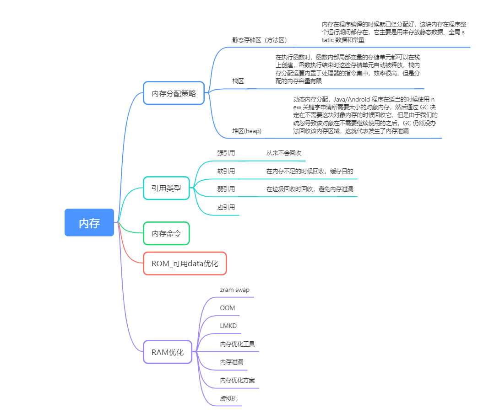
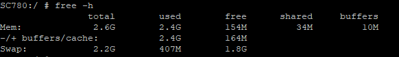
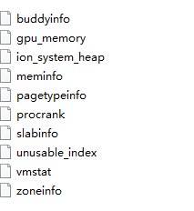
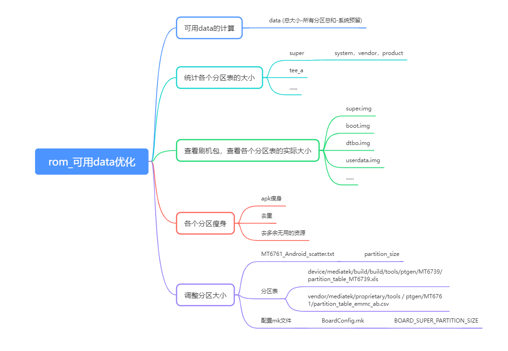
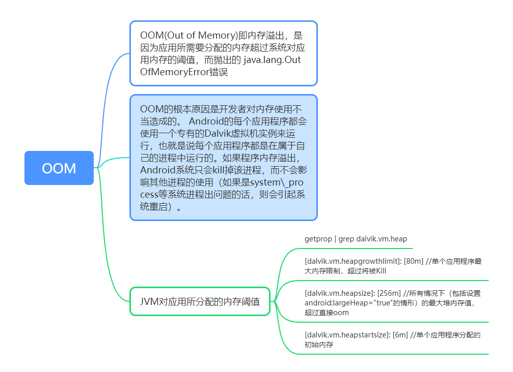

# P36: 系统开发之memory


---

[跳转到readme](https://github.com/hfreeman2008/android_core_framework/blob/main/README-CN.md)


---

[<font face='黑体' color=#ff0000 size=40 >跳转到文章结尾</font>](#结束语)

---

[上一篇文章 P35_系统开发之cpu](https://github.com/hfreeman2008/android_core_framework/blob/main/P35_%E7%B3%BB%E7%BB%9F%E5%BC%80%E5%8F%91%E4%B9%8Bcpu/%E7%B3%BB%E7%BB%9F%E5%BC%80%E5%8F%91%E4%B9%8Bcpu.md)


---

# memory脑图




---

# Java 内存分配模型

1）、方法区：存储类信息、常量、静态变量等。=> 所有线程共享

2）、虚拟机栈：存储局部变量表、操作数栈等。

3）、本地方法栈：不同与虚拟机栈为 Java 方法服务、它是为 Native 方法服务的。

4）、堆：内存最大的区域，每一个对象实际分配内存都是在堆上进行分配的，，而在虚拟机栈中分配的只是引用，这些引用会指向堆中真正存储的对象。此外，堆也是垃圾回收器（GC）所主要作用的区域，并且，内存泄漏也都是发生在这个区域。=> 所有线程共享

5）、程序计数器：存储当前线程执行目标方法执行到了第几行


---

# 内存分配策略

- 静态存储区（方法区）

内存在程序编译的时候就已经分配好，这块内存在程序整个运行期间都存在，它主要是用来存放静态数据、全局 static 数据和常量

- 栈区

在执行函数时，函数内部局部变量的存储单元都可以在栈上创建，函数执行结束时这些存储单元自动被释放，栈内存分配运算内置于处理器的指令集中，效率很高，但是分配的内存容量有限

- 堆区(heap)

动态内存分配，Java/Android 程序在适当的时候使用 new 关键字申请所需要大小的对象内存，然后通过 GC 决定在不需要这块对象内存的时候回收它，但是由于我们的疏忽导致该对象在不需要继续使用的之后，GC 仍然没办法回收该内存区域，这就代表发生了内存泄漏


---

# 四大内存指标：

VSS - Virtual Set Size 虚拟耗用内存（包含共享库占用的内存）

RSS - Resident Set Size 实际使用物理内存（包含共享库占用的内存）

PSS - Proportional Set Size 实际使用的物理内存（比例分配共享库占用的内存）

USS - Unique Set Size 进程独自占用的物理内存（不包含共享库占用的内存）


内存指标中英文对照表

| 英文简称 | 英文全称               | 内存类型 | 核心含义                                                                 | 等价关系                          |
|----------|------------------------|----------|-------------------------------------------------------------------------|-----------------------------------|
| USS | Unique Set Size        | 物理内存 | 进程独占的物理内存（不包含共享库）                                       | `USS = 私有内存`                 |
| PSS | Proportional Set Size  | 物理内存 | USS + 按比例分配的共享库内存（例如：共享库内存 ÷ 共享进程数）            | `PSS = USS + 共享库分摊值`       |
| RSS  | Resident Set Size      | 物理内存 | USS + 所有共享库内存（包含重复计算的共享部分）                           | `RSS = USS + 共享库内存`         |
| VSS  | Virtual Set Size       | 虚拟内存 | 进程可访问的虚拟内存总量（含未实际分配的虚拟内存）                       | `VSS = RSS + 未分配物理内存`     |


从上可知,它们之间内存的大小关系为VSS >= RSS >= PSS >= USS.


---

# adb shell dumpsys meminfo 
适用场景： 

查看进程的oom adj，或者dalvik/native等区域内存情况，或者某个进程或apk的内存情况；

```bash
Applications Memory Usage (in Kilobytes):
Uptime: 24044 Realtime: 24044

Total PSS by process:
     79,474K: system (pid 3103)
     34,375K: zygote (pid 2684)
     23,107K: com.tv.vod:p0 (pid 3874)
        446K: lmkd (pid 2850)
        429K: svcxfar_x (pid 3029)
        422K: xirisvc2.4 (pid 2854)
        412K: svciflybl (pid 3072)
        371K: factory_svc (pid 2859)
          0K: bootanimation (pid 2296)
          0K: bootanimation (pid 2350)

Total PSS by OOM adjustment:
    238,861K: Native
         34,375K: zygote (pid 2684)
         19,148K: surfaceflinger (pid 2406)
            412K: svciflybl (pid 3072)
            371K: factory_svc (pid 2859)
              0K: bootanimation (pid 2296)
              0K: bootanimation (pid 2350)
     79,474K: System
         79,474K: system (pid 3103)
     59,862K: Persistent
         14,357K: com.tv.service (pid 3231)
         13,180K: com.android.systemui (pid 3238)
         12,624K: com.keylab.speech.core.vidaa (pid 3716)
    179,529K: Foreground
        156,422K: com.tv.vod (pid 3319 / activities)
         23,107K: com.tv.vod:p0 (pid 3874)

Total PSS by category:
    177,393K: .so mmap
    110,553K: .dex mmap
......
      1,896K: Ashmem
         16K: Cursor
          0K: Gfx dev
          0K: EGL mtrack
          0K: Other mtrack

Total RAM: 1,313,620K (status critical)
 Free RAM:   458,708K (        0K cached pss +   269,952K cached kernel +   188,756K free)
 Used RAM:   862,707K (  575,291K used pss +   287,416K kernel)
 Lost RAM:    -7,795K
   Tuning: 192 (large 256), oom    81,920K, restore limit    27,306K (high-end-gfx)
```


---

# adb shell dumpsys meminfo com.android.pkg.name

```bash
adb shell dumpsys meminfo com.tv.vod
Applications Memory Usage (in Kilobytes):
Uptime: 82575 Realtime: 82575
** MEMINFO in pid 3318 [com.tv.vod] **
                   Pss  Private  Private  SwapPss     Heap     Heap     Heap
                 Total    Dirty    Clean    Dirty     Size    Alloc     Free
                ------   ------   ------   ------   ------   ------   ------
  Native Heap    82962    82948        0    20277   113152   107190     5961
  Dalvik Heap    25540    25540        0      990    37750    18875    18875
 Dalvik Other     7956     7956        0      104                           
        Stack       44       44        0       16                           
       Cursor        4        0        0        0                           
       Ashmem        0        0        0        0                           
    Other dev      110        0      108        0                           
     .so mmap     9283     1088     7028      648                           
    .jar mmap      993        0      844        0                           
    .apk mmap     7446        0     6632        0                           
    .dex mmap    20512        8    16932       52                           
    .oat mmap      663        0        8        0                           
    .art mmap     1899     1528        4       20                           
   Other mmap      137        4       64        0                           
    GL mtrack    30380    30380        0        0                           
      Unknown     3244     3244        0     1609                           
        TOTAL   214889   152740    31620    23716   150902   126065    24836
 
 App Summary
                       Pss(KB)
                        ------
           Java Heap:    27072
         Native Heap:    82948
                Code:    32540
               Stack:       44
            Graphics:    30380
       Private Other:    11376
              System:    30529
 
               TOTAL:   214889       TOTAL SWAP PSS:    23716
 
 Objects
               Views:     1212         ViewRootImpl:        2
         AppContexts:        7           Activities:        2
              Assets:       30        AssetManagers:        0
       Local Binders:      128        Proxy Binders:       49
       Parcel memory:       83         Parcel count:      271
    Death Recipients:       32      OpenSSL Sockets:        1
            WebViews:        0
 
 SQL
         MEMORY_USED:     1141
  PAGECACHE_OVERFLOW:      166          MALLOC_SIZE:      117
 
 DATABASES
      pgsz     dbsz   Lookaside(b)          cache  Dbname
         4       12             53         1/18/2  /data/user/0/com.tv.vod/databases/widgets.db
         4       64            109     324/115/17  /data/user/0/com.tv.vod/databases/report.db
         4       40            109        36/31/7  /data/user/0/com.tv.vod/databases/vod.db
         4       12             53         1/18/2  /data/user/0/com.tv.vod/databases/download.db
         4       12             53         1/18/2  /data/user/0/com.tv.vod/databases/app.db
         4       44            101        60/23/9  /data/user/0/com.tv.vod/databases/vod_share_data.db
 
 Asset Allocations
    : 178K
```

- Pss: 该进程独占的内存+与其他进程共享的内存（按比例分配，比如与其他3个进程共享9K内存，则这部分为3K）
- Privete Dirty:该进程独享内存
- Heap Size:分配的内存
- Heap Alloc:已使用的内存
- Heap Free:空闲内存


---

## 泄漏分析过程

1、查看 Native Heap 的 Heap Alloc 与 Dalvik Heap 的 Heap Alloc

1）、Heap Alloc：表示 native 的内存占用，如果持续上升，则可能有泄漏。

2）、Heap Alloc：表示 Java 层的内存占用

2、查看 Views、Activities、AppContexts 数量变化情况

如果 Views 与 Activities、AppContexts 持续上升，则表明有内存泄漏的风险

3、SQL 的 MEMORY_USED 与 PAGECACHE_OVERFLOW

1）、MEMOERY_USED：表示数据库使用的内存。

2）、PAGECACHE_OVERFLOW：表示溢出也使用的缓存，这个数值越小越好

4、查看 DATABASES 信息

1）、pgsz：表示数据库分页大小，这里全是 4KB。

2）、Lookaside(b)：表示使用了多少个 Lookaside 的 slots，可理解为内存占用的大小。

3）、cache：一栏中的 151/32/18 则分别表示 分页缓存命中次数/未命中次数/分页缓存个数，这里的未命中次数不应该大于命中次数。


---

# adb shell cat /proc/meminfo 

适用场景： 查看系统的详尽内存信息，包含内核情况；

/proc/meminfo

```bash
adb shell cat proc/meminfo
MemTotal:        2930980 kB
MemFree:          248052 kB
Buffers:            9548 kB
Cached:           580604 kB
SwapCached:            0 kB
Active:          1048564 kB
Inactive:         542104 kB
Active(anon):    1004704 kB
Inactive(anon):     8420 kB
Active(file):      43860 kB
Inactive(file):   533684 kB
Unevictable:        3668 kB
Mlocked:               0 kB
SwapTotal:             0 kB
SwapFree:              0 kB
Dirty:               380 kB
Writeback:             0 kB
AnonPages:       1004652 kB
Mapped:           208584 kB
Shmem:              8572 kB
Slab:             137940 kB
SReclaimable:      84324 kB
SUnreclaim:        53616 kB
KernelStack:       36944 kB
PageTables:        38428 kB
NFS_Unstable:          0 kB
Bounce:                0 kB
WritebackTmp:          0 kB
CommitLimit:     1465488 kB
Committed_AS:   62294744 kB
VmallocTotal:   251658176 kB
VmallocUsed:      136204 kB
VmallocChunk:   251387648 kB
CMA Free: 6084 kB 
CMA heap info(name,alloc,in cache,fail,total free): 
 DEFAULT_CMA_BUFFER (348kb 0kb 0kb 16036kb) OTHERS (155648kb 0kb 0kb 0kb) XC0 (122880kb 0kb 0kb 0kb) VDEC0 (49152kb 0kb 0kb 0kb) OTHERS2 (110592kb 0kb 0kb 0kb) RETURN_ENUM6 (0kb 0kb 0kb 36864kb) VDEC1 (139264kb 0kb 0kb 0kb)

```


---

# adb shell procrank 

适用场景： 查看进程的VSS/RSS/PSS/USS各个内存指标；
```bash
adb shell procrank 
warning: could not create process interface for 26521
  PID       Vss      Rss      Pss      Uss  cmdline
 1666   225480K   70128K   61346K   57980K  /system/bin/mediaserver
 1648   202920K   56788K   49750K   47860K  /system/bin/surfaceflinger
 2397  2286192K   70952K   47201K   43200K  system_server
 3503  1621380K   49648K   32315K   30616K  com.keylab.speech.core.vidaa
 2585  1545892K   40780K   22224K   19464K  com.android.systemui
......
 1744    40120K    2256K    1362K    1108K  /applications/bin/MiMwTtxSrv
26526     3504K    1596K    1314K    1272K  procrank
 1736    40076K    2192K    1298K    1044K  /applications/bin/MiMwCcSrv
 1638    13844K    2064K    1176K    1052K  /system/bin/vold
 2810     8632K    1908K    1095K    1012K  /system/bin/wpa_supplicant
 1734     5636K    1736K    1027K     960K  /system/vendor/bin/hidclient
 1674     8016K    1492K     745K     672K  /system/bin/keystore
    1     1612K     928K     664K     484K  /init
 1717     7496K    1256K     590K     528K  /system/bin/gatekeeperd
 1712     3316K    1292K     505K     404K  xirisvc2.4.0
 1673     3728K     772K     496K     448K  /system/bin/installd
 1050     1488K     664K     474K     296K  /sbin/ueventd
 1713     3092K     592K     447K     444K  /system/bin/sh
 1709     3284K     600K     376K     364K  /system/bin/logcat
 1991     5484K    1056K     376K     252K  svcrefsig
 1699     7584K     668K     368K     356K  /system/bin/tee_shmem
 1646     3592K     624K     353K     340K  /system/bin/servicemanager
 1662     2496K     960K     306K     244K  /system/bin/debuggerd
 1723     5896K     336K     300K     300K  /sbin/adbd
 1644     3680K     296K     284K     284K  /sbin/healthd
                           ------   ------  ------
                          1127661K  1044864K  TOTAL

RAM: 2930980K total, 782344K free, 10836K buffers, 500968K cached, 3616K shmem, 120232K slab
```

VSS - Virtual Set Size 虚拟耗用内存（包含共享库占用的内存）
RSS - Resident Set Size 实际使用物理内存（包含共享库占用的内存）
PSS - Proportional Set Size 实际使用的物理内存（比例分配共享库占用的内存）
USS - Unique Set Size 进程独自占用的物理内存（不包含共享库占用的内存）

一般来说内存占用大小有如下规律：VSS >= RSS >= PSS >= USS


---


# adb shell free 

```bash
adb shell free 
adb shell free -h
```
适用场景： 只查看系统的可用内存；



---


# adb shell showmap pid

适用场景： 查看进程的虚拟地址空间的内存分配情况；


---

# adb shell vmstat 

---

# adb shell top

---

# gc日志


```bash
I zygote  : Background concurrent copying GC freed 102170(4MB) AllocSpace objects, 23(684KB) LOS objects, 42% free, 9MB/17MB, paused 531us total 294.802ms
```

---

# 内存相关关键字：


```bash
gc, mem，lowmemory,  lowmemorykiller，LMK
```


---


# 卡顿丢帧原因概述 - 低内存篇

https://www.androidperformance.com/2019/09/18/Android-Jank-Due-To-Low-Memory/

可能的优化方案 (来自实际的经验和大佬分享的经验)

下面列举的只是一些经验之谈 , 具体问题还是得具体分析 , 在 Android 平台上 , 对三方应用的管控是非常重要的 , 很多小白用户 , 一大堆常驻通知和后台服务 , 导致这些 App 的优先级非常高 , 很难被杀掉 . 

导致整机的内存长时间比较低 . 所以做系统的必要的优化之后 , 就要着重考虑对三方应用的查杀和管控逻辑 , 尽量减少后台进程的个数 , 在必要的时候 , 清理掉无用的进程来释放内存个前台应用使用.


提高 extra_free_kbytes 值

提高 disk I/O 读写速率，如用 UFS3.0，用固态硬盘

避免设置太大的 read_ahead_kb 值

使用 cgroup 的 blkio 来限制后台进程的 io 读操作，缩短前台 io 响应时间

提前做内存回收的操作，避免在用户使用应用时碰到而感受到稍微卡顿

增加 LMK 效率，避免无效的 kill

kswapd 周期性回收更多的 high 水位

调整 swappiness 来平衡 pagecache 和 swap

- 策略 : 针对低内存机器做特殊的策略 , 比如杀进程更加激进 (这会带来用户体验的降低 , 所以这个度需要兼顾性能和用户体验)
- 策略 : 在内存不足的时候提醒用户(或者不提醒用户) , 杀掉不必要的后台进程 .
- 策略 : 在内存严重不足且无法恢复的情况下 , 可以提示用户重启手机.


---

# bugreport中关于memory的信息



---

# adb shell df -ha
```bash
adb shell df -ha
```


---

# 强制让进程gc

```bash
adb shell kill -10 PIDXXX
```

---

# 强制生成进程的内存镜像

```bash
adb shell am dumpheap PIDxxx /data/xxx.hprof
```

---
# rom_可用data优化



---

# OOM



---

# zram

---

## [FAQ21507] zram 原理及其配置

https://online.mediatek.com/FAQ#/SW/FAQ27916

---

## 手动开zram

```bash
adb root
adb remount 
adb shell
echo 1024M > /sys/block/zram0/disksize
mkswap /dev/block/zram0
swapon /dev/block/zram0


执行 cat /proc/meminfo 检查是否设置成功
SwapTotal:         65532 kB
SwapFree:          65532 kB
```

```bash
adb shell cat  /sys/block/zram0/disksize
962521088

cat /proc/meminfo
MemTotal:        1879924 kB
MemFree:           20108 kB
MemAvailable:     510544 kB
SwapTotal:        939960 kB
SwapFree:         939960 kB

adb shell cat /proc/sys/vm/swappiness
180

grep -rni --include=*.rc "swappiness"  ./

adb shell cat /proc/sys/vm/swappiness
out/target/product/tb8768p1_64_bsp/vendor/etc/fstab.enableswap

adb shell cat /vendor/etc/fstab.enableswap
```


---

## 代码打开zram开关
```bash

http://10.20.31.31:8080/#/c/37242/1/res/Z1018/BASE/proj.cfg
CONFIG_ZRAM=y
CONFIG_ZSMALLOC=y

http://10.20.31.31:8080/#/c/37267/
customize / res/Z1018/BASE/proj.cfg
########################### ProjectConfig.mk #####################################
# 这里是对device/mediateksample/tb8766p1_64_bsp/ProjectConfig.mk进行配置
[PROJECT_CONFIG]

FACTORY_POS_UNSUPPORT = yes
+CUSTOM_CONFIG_MAX_DRAM_SIZE=0xC0000000

# 这里是对./vendor/mediatek/proprietary/bootable/bootloader/preloader/custom/tb8766p1_64_bsp/tb8766p1_64_bsp.mk进行配置
[PL_CONFIG]
+CUSTOM_CONFIG_MAX_DRAM_SIZE=0xC0000000


http://10.20.31.31:8080/#/c/37266/
customize / res/Z1018/BASE/proj.cfg
#device/mediatek/system/${TPW_SYS_TARGET_PROJECT}/SystemConfig.mk
[PROJECT_CONFIG]

+MSSI_CUSTOM_CONFIG_MAX_DRAM_SIZE=0xC0000000

device / mediatek/common/fstab.enableswap
-/dev/block/zram0 none swap defaults zramsize=50%
+/dev/block/zram0 none swap defaults zramsize=75%

device / mediatek/vendor/common/ago/init/init.ago_default.rc
-on post-fs-data
-    write /proc/sys/vm/page-cluster 0
-    swapon_all /vendor/etc/fstab.enableswap
-    write /dev/memcg/memory.swappiness 150
-    write /dev/memcg/apps/memory.swappiness 150
-    write /dev/memcg/system/memory.swappiness 150
-    write /proc/sys/vm/swappiness 150

+on post-fs-data
+    write /proc/sys/vm/page-cluster 0
+    swapon_all /vendor/etc/fstab.enableswap
+    write /dev/memcg/memory.swappiness 180
+    write /dev/memcg/apps/memory.swappiness 180
+    write /dev/memcg/system/memory.swappiness 180
+    write /proc/sys/vm/swappiness 180

```


---

# 参考文档

[Android 性能优化之内存泄漏检测以及内存优化（中）](https://blog.csdn.net/self_study/article/details/66969064)

[Android 性能优化之内存泄漏检测以及内存优化（下）](https://blog.csdn.net/self_study/article/details/68946441)


[Android内存分析命令](http://gityuan.com/2016/01/02/memory-analysis-command/)


---

[<font face='黑体' color=#ff0000 size=40 >跳转到文章开始</font>](#p36-系统开发之memory)

---


[上一篇文章 P35_系统开发之cpu](https://github.com/hfreeman2008/android_core_framework/blob/main/P35_%E7%B3%BB%E7%BB%9F%E5%BC%80%E5%8F%91%E4%B9%8Bcpu/%E7%B3%BB%E7%BB%9F%E5%BC%80%E5%8F%91%E4%B9%8Bcpu.md)


---

# 结束语

