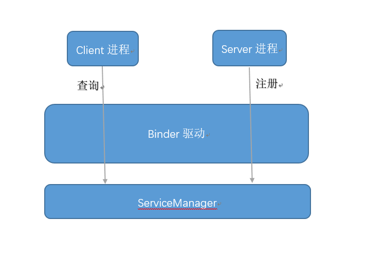
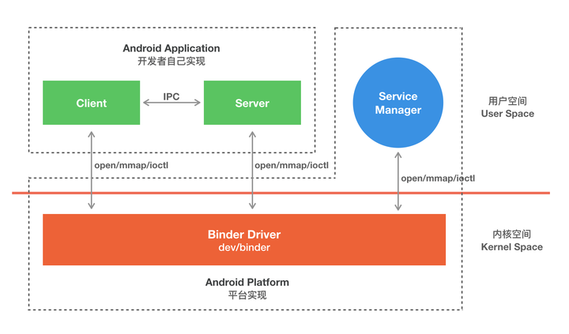
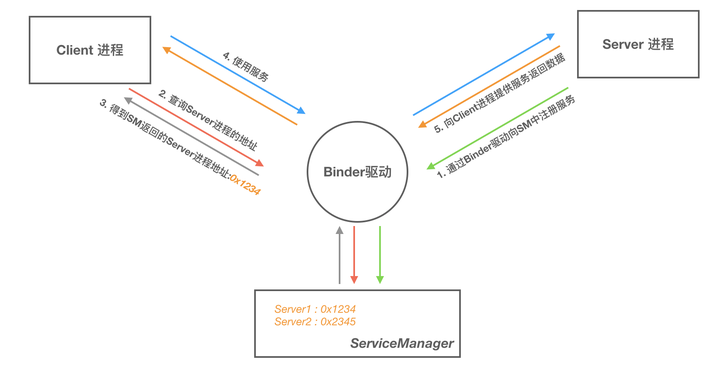
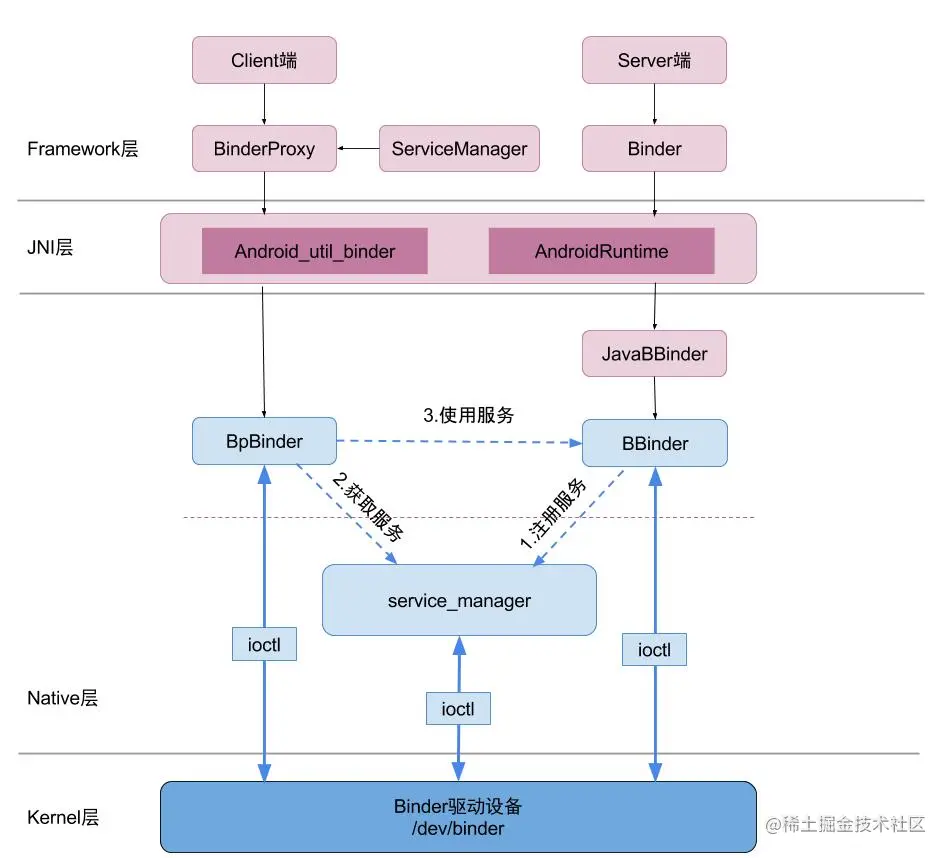
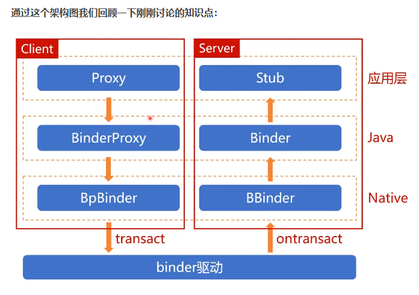
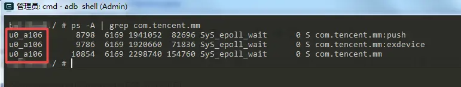
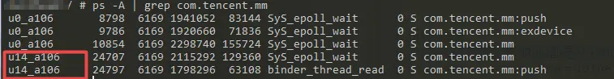
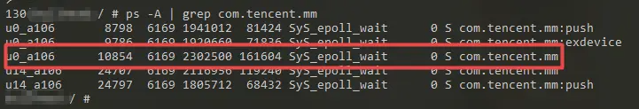
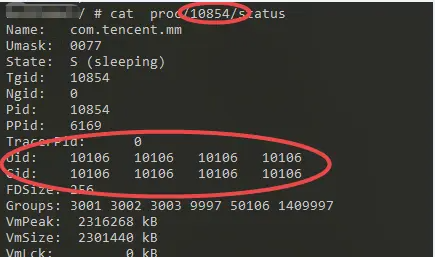

# P37: 系统开发之Binder


---

[跳转到readme](https://github.com/hfreeman2008/android_core_framework/blob/main/README-CN.md)


---

[<font face='黑体' color=#ff0000 size=40 >跳转到文章结尾</font>](#结束语)

---

[上一篇文章 P36_系统开发之memory](https://github.com/hfreeman2008/android_core_framework/blob/main/P36_%E7%B3%BB%E7%BB%9F%E5%BC%80%E5%8F%91%E4%B9%8Bmemory/%E7%B3%BB%E7%BB%9F%E5%BC%80%E5%8F%91%E4%B9%8Bmemory.md)


[下一篇文章 P38_系统开发之permission](https://github.com/hfreeman2008/android_core_framework/blob/main/P38_%E7%B3%BB%E7%BB%9F%E5%BC%80%E5%8F%91%E4%B9%8Bpermission/%E7%B3%BB%E7%BB%9F%E5%BC%80%E5%8F%91%E4%B9%8Bpermission.md)

---


# Binder架构










---

# Binder分层架构图







---

# 关键概念：

## Stub（存根）

定义：Stub是服务端的接口实现，继承自IBinder接口。它代表了服务端暴露给客户端调用的接口。

功能：Stub负责接收来自客户端的请求，通过onTransact方法处理客户端的调用请求。在这个方法中，Stub会根据不同的请求码（code）执行对应的服务逻辑，并通过Parcel对象传递参数和返回值。

生成：通常，使用AIDL（Android Interface Definition Language）文件定义接口时，编译器会自动为服务端生成Stub类的实现。


## Proxy（代理）
定义：Proxy是客户端侧的Stub的本地代理，同样继承自IBinder接口。它是Stub的一个远程代理对象，使得客户端可以像调用本地对象一样调用远程服务的方法。

功能：当客户端调用Proxy上的方法时，Proxy会将调用序列化（通过Parcel对象），然后通过Binder驱动发送到服务端。同时，Proxy还会监听来自服务端的返回结果，并将其反序列化后返回给客户端。

生成：同样，使用AIDL定义接口时，编译器也会为客户端自动生成一个Proxy类。


## asBinder
作用：asBinder方法用于获取Binder对象的引用，这个引用可以被用来进行跨进程通信。在Stub和Proxy中都会实现这个方法，但含义稍有不同。

对于Stub，asBinder返回的就是Stub自己，因为它本身就是Binder的一个实现，可以直接参与跨进程通信。

对于Proxy，asBinder返回的是一个Binder代理对象，这个代理对象内部会处理跨进程的调用转发，确保客户端的调用能够到达服务端的Stub。

## stub.asinterface
这个接口主要是客户端通过Binder引用拿到IxxxxService实例：
```java
IxxxxService.Stub.asInterface(IBinder obj) ：
```


当bindService之后，客户端会得到一个Binder引用，不是IxxxxService.Proxy实例。Ok, 但如果服务端和客户端都是在同一个进程呢，还需要利用IPC吗？这样就不需要了，直接将IxxxxService当做普通的对象调用就成了。Google利用IxxxxService.Stub.asInterface函数对这两种不同的情况进行了统一，也就是不管你是在同一进程还是不同进 程，那么在拿到Binder引用后，调用IxxxxService.Stub.asInterface(IBinder obj) 即可得到一个IxxxxService 实例，然后你只管调用IxxxxService里的函数就成了。

```java
import com.android.internal.app.IBatteryStats;

IBatteryStats mBatteryStats = IBatteryStats.Stub.asInterface(
                    ServiceManager.getService("batterystats"));
mBatteryStats.noteBleScanResults(mWorkSource, 100);
```

## IBinder 接口‌
核心作用‌：Binder 通信的基础接口，定义了跨进程通信的核心方法 transact() 和 queryLocalInterface()，所有 Binder 对象（本地或远程）均需实现该接口‌。
关键方法‌：

```java
transact(int code, Parcel data, Parcel reply, int flags)：客户端通过此方法向服务端发送请求。
queryLocalInterface(String descriptor)：尝试获取本地接口实现，避免跨进程调用。
```


## IInterface 接口‌
核心作用‌：定义 Binder 服务接口的基类，所有 AIDL 生成的接口（如 IMyService）均继承自 IInterface，用于统一本地和远程接口的调用规范‌。
关键方法‌：
```java
asBinder()：返回关联的 IBinder 对象。
```

## BpBinder 与 BBinder‌
- BpBinder‌（Proxy Binder）：
客户端代理类，封装远程 Binder 的引用，通过 transact() 向服务端发送请求‌。属于 IBinder 的实现类，由 Binder 驱动生成。
- BBinder‌（Base Binder）：
服务端本地 Binder 的基类，负责处理客户端请求，需实现 onTransact() 方法解析请求并执行逻辑‌。

## BpInterface 与 BnInterface‌
- BpInterface‌：
远程接口基类，客户端通过生成的代理类（如 BpMyService）调用服务端方法‌。
继承自 BpBinder，实现 AIDL 定义的接口。
- BnInterface‌：
本地接口基类，服务端需继承此类并实现具体的业务逻辑（如 BnMyService）‌。
继承自 BBinder，重写 onTransact() 处理客户端请求。


## AIDL 生成的 Stub 与 Proxy‌
- Stub 类‌：
继承 BnInterface，服务端需实现 Stub 中定义的抽象方法（如 add()）‌。

通过 onTransact() 解析客户端请求并分发给具体实现。

- Proxy 类‌：
继承 BpInterface，客户端通过 Proxy 对象调用远程服务，内部调用 BpBinder.transact() 发送数据‌。

## Parcel 类‌
核心作用‌：跨进程数据传输的容器，支持序列化与反序列化。客户端和服务端通过 Parcel 打包和解包数据‌。

典型使用场景‌：

客户端在 transact() 中将参数写入 Parcel。

服务端在 onTransact() 中从 Parcel 读取参数，处理后写入返回结果。

## ProcessState 与 IPCThreadState‌

ProcessState‌：

管理进程的 Binder 通信资源（如线程池），负责打开 Binder 驱动并初始化通信环境‌。

IPCThreadState‌：

封装线程级 Binder 通信逻辑，包括请求的发送与接收循环（如 transact() 和 executeCommand()）‌。
接口协作关系示意图

- 客户端调用流程：
BpInterface（Proxy） → BpBinder.transact() → IPCThreadState → Binder 驱动 → 服务端 BBinder.onTransact() → BnInterface（Stub） → 实际业务逻辑

- 服务端响应流程：
BBinder.onTransact() → 解析请求 → 调用 Stub 实现的方法 → 结果通过 Parcel 返回 → Binder 驱动 → 客户端接收结果

通过上述接口的协作，Binder 实现了跨进程的透明调用，客户端和服务端只需关注业务逻辑，底层通信由 Binder 框架自动处理‌。


---

# 客户端如何理解 Binder‌
在 Android 客户端开发中，‌Binder‌ 是跨进程通信（IPC）的核心机制，客户端通过 ‌Binder 代理对象（Proxy）‌ 与服务端（如系统服务或其他进程的组件）交互。


## Binder 的本质：跨进程通信的代理模式‌
客户端持有的是代理对象‌

客户端通过 BinderProxy 对象（如 IActivityManager、IPackageManager）与远程服务端通信，这些代理对象实现了与服务端相同的接口，但实际调用会通过 Binder 驱动转发到服务端进程‌。
```java
// 示例：获取 ActivityManagerService 的代理对象
IActivityManager am = ActivityManager.getService(); // 返回 BinderProxy 对象
```


代理对象的工作流程‌

客户端调用代理接口的方法时，代理对象会：
- 将参数封装为 Parcel 对象。
- 调用 transact() 方法将数据发送到 Binder 驱动。
- 服务端处理请求后返回结果，客户端解析 Parcel 并转换为返回值‌。


## 客户端如何获取 Binder 代理‌

- 绑定服务（bindService）‌

通过 ServiceConnection 的 onServiceConnected() 回调获取 IBinder 对象，再转换为具体的接口（如IMyService.Stub.asInterface(binder)）‌。
```java
// 示例：绑定远程服务并获取代理对象
ServiceConnection conn = new ServiceConnection() {
    @Override
    public void onServiceConnected(ComponentName name, IBinder binder) {
        IMyService service = IMyService.Stub.asInterface(binder); // 转换为代理对象
    }
};

bindService(intent, conn, Context.BIND_AUTO_CREATE);
```

- 获取系统服务‌

通过 ServiceManager 或系统 API 直接获取预定义的 Binder 代理（如 PackageManager、ActivityManager）‌：
```java
// 示例：获取 PackageManager 的代理对象
PackageManager pm = getContext().getPackageManager();
```


## 客户端调用 Binder 的线程模型‌

- 同步调用‌

默认情况下，客户端的 Binder 调用是 ‌同步阻塞‌ 的（如 transact(..., 0)），调用线程会等待服务端返回结果。若在主线程执行耗时操作，可能导致 ANR‌。
```java
// 示例：同步调用可能阻塞主线程
IBinder binder = ...;
Parcel data = Parcel.obtain();
Parcel reply = Parcel.obtain();
binder.transact(TRANSACTION_DO_SOMETHING, data, reply, 0); // 同步调用
```


- 异步调用‌

使用 transact(..., FLAG_ONEWAY) 或 AIDL 的 oneway 关键字可发起非阻塞调用，客户端无需等待服务端返回‌：
```java
// 示例：异步调用（oneway）
binder.transact(TRANSACTION_NOTIFY, data, null, FLAG_ONEWAY);
```

## 客户端注意事项‌

- 主线程风险‌

避免在主线程执行同步 Binder 调用（尤其是耗时操作），使用子线程或异步接口（如 oneway）防止 ANR‌。

- 异常处理‌

Binder 调用可能抛出 RemoteException（如服务端进程崩溃），需捕获并处理：
```java
try {
    am.killBackgroundProcesses(packageName);
} catch (RemoteException e) {
    // 处理远程调用失败
}
```

- 跨进程数据限制‌

通过 Binder 传输的数据需支持 Parcelable 或 Serializable，且需注意大小限制（通常 1MB 以内）‌。


## 客户端与 Binder 的关系总结‌

客户端角色‌：通过代理对象发起请求，不直接操作 Binder 驱动。

核心接口‌：IBinder 定义通信协议，Parcel 封装数据，transact() 执行调用。

线程模型‌：同步阻塞或异步非阻塞，需根据场景合理选择。

代码示例：客户端调用系统服务‌
```java
// 获取 ActivityManager 的 Binder 代理对象
IActivityManager am = ActivityManager.getService();
try {
    // 调用远程方法（例如获取最近任务列表）
    List<ActivityManager.RecentTaskInfo> tasks = am.getRecentTasks(10, 0);
} catch (RemoteException e) {
    e.printStackTrace();
}
```

通过理解代理模式、线程模型与调用限制，开发者可以在客户端安全高效地使用 Binder 机制，实现跨进程通信需求。

---

# 服务端中bind

服务端绑定（bind）‌ 是 Binder 通信机制的关键环节，本质是通过 ‌Binder 对象‌ 建立客户端与服务端之间的跨进程通信通道。以下是服务端实现绑定的核心逻辑及流程：


## 服务端的核心角色‌
服务端需通过 ‌Service 组件‌ 实现业务逻辑，并在 onBind() 方法中返回 ‌Binder 对象‌，供客户端调用‌。具体步骤包括：

定义接口‌：通过 AIDL 声明服务端提供的功能方法（如 add()、getData() 等）‌。

实现接口‌：服务端继承 AIDL 生成的 ‌Stub 类‌（继承自 BnInterface），并重写接口中定义的方法‌。

返回 Binder‌：在 Service 的 onBind() 中返回 Stub 的实例，作为客户端调用的入口‌。
```java
// 服务端实现示例
public class MyService extends Service {
    private final IMyService.Stub mBinder = new IMyService.Stub() {
        @Override
        public int add(int a, int b) {
            return a + b;
        }
    };
    @Override
    public IBinder onBind(Intent intent) {
        return mBinder; // 返回 Binder 对象
    }
}
```


## Binder 绑定的底层协作流程‌
当客户端调用 bindService() 时，服务端与客户端通过以下机制完成绑定：

服务注册‌：服务端启动时，向 ‌ServiceManager‌ 注册 Binder 对象（系统服务）或通过本地绑定直接传递 Binder 引用（应用内服务）‌。

客户端获取代理‌：客户端通过 ServiceConnection 回调获取 IBinder 对象，并转换为 AIDL 生成的 ‌Proxy 类‌（客户端代理）‌。

跨进程调用‌：

客户端通过 Proxy 调用方法时，数据封装为 ‌Parcel‌，通过 BpBinder.transact() 发送至 Binder 驱动‌。

服务端的 Stub 类通过 onTransact() 接收请求，解析参数并执行对应方法，结果再通过 Parcel 返回‌。

## 服务端绑定的关键设计‌

生命周期管理‌：服务端通过 onUnbind() 可清理资源，onRebind() 处理客户端重连‌。

线程模型‌：Binder 通信默认在 ‌Binder 线程池‌ 中执行，服务端需处理线程同步问题（如加锁）‌。

权限控制‌：服务端可通过 checkCallingPermission() 验证客户端权限，确保调用安全‌。

绑定机制示意图
```java
客户端触发 bindService() →
系统通过 ServiceManager 查找服务端 Binder 对象 →
服务端 onBind() 返回 Stub 实例 →
客户端 ServiceConnection 接收 IBinder 并生成 Proxy →
客户端通过 Proxy 调用远程方法，Binder 驱动完成数据传递 →
服务端 Stub.onTransact() 处理请求并返回结果
```

通过这一机制，服务端只需关注业务逻辑实现，底层通信细节由 Binder 驱动和框架自动处理，实现跨进程调用的透明化‌。


---

# uid   pid  gid  gids 的含义和作用
uid:  android中uid用于标识一个应用程序，uid在应用安装时被分配，并且在应用存在于手机上期间，都不会改变。一个应用程序只能有一个uid，多个应用可以使用sharedUserId 方式共享同一个uid，前提是这些应用的签名要相同。我们也可以直接从data/system/packages.list文件中查看uid。

pid :  进程ID，可变的

gid:  对应于linux中用户组的概念，android 中 gid 等于uid

gids:  一个GIDS相当于一个权限的集合，一个UID可以关联GIDS，表明该UID拥有多种权限，一个进程就是host应用程序的沙箱，里面一般有一个UID和多个GIDS，每个进程只能访问UID的权限范围内的文件和GIDs所允许访问的接口，构成了Android最基本的安全基础。

---

# 判断binder的调用uid是不是shell或root
```java
final int callingUid = Binder.getCallingUid();
if ((callingUid != Process.SHELL_UID) && (callingUid != Process.ROOT_UID)) {
    ......
}

Binder.getCallingPid() == android.os.Process.myPid()
```


Process.java

常见的uid:
```java
public static final int INVALID_UID = -1;
public static final int ROOT_UID = 0;
public static final int SYSTEM_UID = 1000;
public static final int PHONE_UID = 1001;
public static final int SHELL_UID = 2000;
public static final int LOG_UID = 1007;
public static final int WIFI_UID = 1010;
```


```java
int uid = Binder.getCallingUid();
int pid = Binder.getCallingPid();
```


---

# 获取binder 的uid,pid,app name

```java
int pid = Binder.getCallingPid();
int uid = Binder.getCallingUid();
long origId = Binder.clearCallingIdentity();

//从uid获取app name
//方式一：
//该方法如果用于获取系统级应用的话，返回的不是真实包名而是"android.uid.system:1000"
String callingApp = mContext.getPackageManager().getNameForUid(uid);

//方式二：
String[] packageNames = getPackageManager().getPackagesForUid(uid)

//方式三：
//加强版方法：适用于所有应用
String invokerPkg = getAppPkg(Binder.getCallingPid());

private String getAppPkg(int pid) {
    String processName = "";
    ActivityManager activityManager = (ActivityManager) getSystemService(ACTIVITY_SERVICE);
    if (activityManager != null) {
        List<ActivityManager.RunningAppProcessInfo> list = activityManager.getRunningAppProcesses();
        for (ActivityManager.RunningAppProcessInfo info : list) {
            if (info.pid == pid) {
                processName = info.processName;
                break;
            }
        }
    }
    return processName;
}

```


---

# 查看应用UID

## 方式一：ps 命令计算




u0_a106 就表示该应用是 user 0（主用户）下面的应用，id是 106，前面说过 普通应用程序的UID 都是从 10000开始的，所以 最终计算出的 UID 就是10106


```java
    /**
     * Returns the uid that is composed from the userId and the appId.
     * @hide
     */
    public static int getUid(@UserIdInt int userId, @AppIdInt int appId) {
        if (MU_ENABLED) {//是否支持多用户
            //PER_USER_RANGE  为 100000
            return userId * PER_USER_RANGE + (appId % PER_USER_RANGE);
        } else {
            return appId;
        }
    }

```
所以最后 工作空间内应用的 UID 是 100000 * 14 + 10106 = 1410106

## 方法2：通过pid查看




```java
cat proc/pid号/status
```




## 方法3：data/system/packages.list 

如果手机有root权限的话，可以导出 data/system/packages.list  文件， 里面可以看到所有应用的包名及对应的 UID

## 方法4：通过代码拿到应用的 ApplicationInfo的实例，applicationInfo.uid

```java
//通过包名获取UID
PackageManager mPm = getPackageManager();
try {
    ApplicationInfo applicationInfo = mPm.getApplicationInfo("com.tencent.mm", 0);
    int uid = applicationInfo.uid;
    Toast.makeText(MainActivity.this, "" + uid, Toast.LENGTH_SHORT).show();
}catch (Exception e){
    e.printStackTrace();
}
```

---

# 查看binder对应uid的应用名

如果uid为：10093
```bash
adb shell "ps -A | grep 93"
u0_a93 3724 1533 1508560 186880 ep_poll 0 S com.sohu.inputmethod.sogou.oem
u0_a93 6057 1533 1422372 129096 ep_poll 0 S com.sohu.inputmethod.sogou.oem:push_service
```

---

# 查看到窗口的BinderID号

如果对应的是mCurToken:
```java
InputMethodManagerService: showCurrentInputLocked: mCurToken=android.os.Binder@6630cb5
```


这个可以查看到窗口的BinderID号：
```java
WINDOW MANAGER TOKENS (adb shell dumpsys window tokens)
如：
WindowToken{266fe27 android.os.Binder@696b8e6}:
windows=[Window{6889757 u0 InputMethod}]
windowType=2011 hidden=false hasVisible=true
```

---

# 与系统服务transact数据  系统服务通信 系统服务调用

frameworks/base/core/java/com/android/server/BootReceiver.java

```java
if (Intent.ACTION_LOCKED_BOOT_COMPLETED.equals(intent.getAction())) {
    Slog.i(TAG, "receive " + intent.getAction());
    setDelayBootCompletedProp(false);
    com.android.internal.os.BackgroundThread.getHandler()
            .postDelayed(() -> {
                setDelayBootCompletedProp(true);
                resetThermalState();
            }, 60 * 1000 * 2); // 2min
    return;
}
    
    
void resetThermalState() {
    try {
        IBinder service = ServiceManager.getService("ds-service");
        Slog.e(TAG, "resetThermalState call ds-service");
        Parcel data = Parcel.obtain();
        data.writeString("system call");
        service.transact(1000, data, null, IBinder.FLAG_ONEWAY);
        Slog.e(TAG, "set thermal state after boot completed");
    } catch (Exception e) {
        e.printStackTrace();
    }
}
```

第二个地方调用：

```java
try {
    IBinder service = ServiceManager.getService("ds-service");
    Parcel data = Parcel.obtain();
    data.writeString("system");
    data.writeInt(scenario);
    service.transact(3000, data, null, IBinder.FLAG_ONEWAY);
    return;
} catch (Exception e) {
    e.printStackTrace();
}
```


```java
try {
    IBinder service = ServiceManager.getService("ds-service");
    Slog.w(TAG, "hall changed " + mBatteryHallOpen);
    Parcel data = Parcel.obtain();
    data.writeString("system call");
    data.writeBoolean(plugged);
    data.writeBoolean(mBatteryHallOpen);
    service.transact(6000, data, null, IBinder.FLAG_ONEWAY);
} catch (Exception e) {
    e.printStackTrace();
}
```

---

# 获取系统服务的方式：

## app 方式一：


```java
import com.android.internal.app.IBatteryStats;

IBatteryStats mBatteryStats = IBatteryStats.Stub.asInterface(
                    ServiceManager.getService("batterystats"));
mBatteryStats.noteBleScanResults(mWorkSource, 100);
```

```java
import android.os.INetworkManagementService;

IBinder b = ServiceManager.getService(Context.NETWORKMANAGEMENT_SERVICE);
INetworkManagementService service = INetworkManagementService.Stub.asInterface(b);

String[] currentIfaces = service.listInterfaces();
```


```java
import com.mediatek.duraspeed.manager.IDuraSpeedService;

IDuraSpeedService sDuraSpeedManager = IDuraSpeedService.Stub.asInterface(
                        ServiceManager.getService("duraspeed"));
sDuraSpeedManager.setAppWhitelist(list);
```


## app 方式二：

```java
ActivityManager mAm = context.getSystemService(ActivityManager.class);

ActivityManager activityManager =(ActivityManager) 
    mContext.getSystemService(Context.ACTIVITY_SERVICE);
```


```java
PowerManager pm=(PowerManager)mContext.getSystemService(Context.POWER_SERVICE);

Vibrator vibrator=(Vibrator)mContext.getSystemService(Context.VIBRATOR_SERVICE);

final WindowManager wm = mContext.getSystemService(WindowManager.class);
```


## system server进程方式三

```java
ActivityManagerInternal mAm;
mAm = LocalServices.getService(ActivityManagerInternal.class);
```


```java
import android.content.pm.PackageManagerInternal;

PackageManagerInternal mPackageManagerInternal = LocalServices.getService(
                        PackageManagerInternal.class);
AndroidPackage androidPackage = mPackageManagerInternal.getPackage(uid); 
```


```java
RyCameraLocalService ryCameraLocalService = LocalServices.getService(
                        RyCameraLocalService.class);
ryCameraLocalService.startRyCameraServiceIfNeeded();


LocalServices.getService(ActivityManagerInternal.class).isSystemReady();

DevicePolicyManagerInternal dpmi = LocalServices.getService(
                        DevicePolicyManagerInternal.class);

AccountManagerInternal am=LocalServices.getService(AccountManagerInternal.class);
```


---

# linkToDeath 和 unlinkToDeath

frameworks\base\core\java\android\os\IBinder.java


```java
    /**
     * Interface for receiving a callback when the process hosting an IBinder
     * has gone away.
     * 
     * @see #linkToDeath
     */
    public interface DeathRecipient {
        public void binderDied();

        /**
         * @hide
         */
        default void binderDied(IBinder who) {
            binderDied();
        }
    }
```

Binder运行在服务端，如果由于某种服务端异常终止了的话会导致客户端的远程调用失败、所以Binder提供了两个配对的方法linkToDeath和unlinkToDeath，通过linkToDeath方法可以给Binder设置一个死亡代理，当Binder死亡的时候客户端就会收到通知，然后就可以重新发起连接从而恢复连接了。

如何给Binder设置死亡代理

1、声明一个DeathRecipient对象、DeathRecipient是一个接口，其内部只有一个方法bindDied，实现这个方法就可以在Binder死亡的时候收到通知了。

```java
private IBinder.DeathRecipient mDeathRecipient = new IBinder.DeathRecipient() {
    @Override
    public void binderDied() {
        if (mRemoteBookManager == null) return;
        mRemoteBookManager.asBinder().unlinkToDeath(mDeathRecipient, 0);
        mRemoteBookManager = null;
        // TODO:这里重新绑定远程Service
        
    }
};
```

2、在客户端绑定远程服务成功之后，给binder设置死亡代理

```java
mRemoteBookManager.asBinder().linkToDeath(mDeathRecipient, 0);
```


---

# Binder.clearCallingIdentity()和Binder.restoreCallingIdentity

系统服务中Binder.clearCallingIdentity()和Binder.restoreCallingIdentity二个接口的意义：


```java
void setBackgroundRestrictionLevel(String packageName, int uid, int userId,
        @RestrictionLevel int level, int reason, int subReason) {
    final int callingUid = Binder.getCallingUid();
    if (callingUid != SYSTEM_UID && callingUid != ROOT_UID && callingUid != SHELL_UID) {
        throw new SecurityException(
                "No permission to change app restriction level");
    }
    final long callingId = Binder.clearCallingIdentity();
    try {
        XXXXXXX;
    } finally {
        Binder.restoreCallingIdentity(callingId);
    }
}
```

首先，Binder是Android中用于进程间通信（IPC）的核心机制。当不同的进程通过Binder进行交互时，系统会记录调用方的身份（比如UID和PID），用于权限检查。比如，系统服务在处理来自客户端的请求时，可能需要知道客户端是谁，以决定是否有权限执行某个操作。

接下来，clearCallingIdentity方法的作用应该是清除当前线程的调用身份，也就是将当前线程的调用方身份信息保存起来，并返回一个代表原始调用身份的长整型值。而restoreCallingIdentity则是将之前保存的调用身份恢复回来。这两个方法通常成对使用，可能是为了在某个代码块中临时改变调用身份，执行一些需要特定权限的操作，然后再恢复原来的身份，避免影响后续的权限检查。

用户可能是在阅读系统服务的源码时看到这两个方法被一起使用，比如在某个系统服务的方法中，先调用clearCallingIdentity获取并清除当前身份，然后执行一些操作，最后调用restoreCallingIdentity恢复之前的身份。这种情况下，为什么要这么做呢？

可能的场景是，系统服务需要暂时以自身进程的权限执行某些操作，而不是客户端的权限。例如，系统服务可能需要访问一些只有系统进程才能访问的资源，这时候临时清除调用身份，让系统服务以自己的权限运行，执行完操作后再恢复客户端的身份，确保后续的权限检查正确。

另外，这两个方法成对出现的原因可能是因为它们涉及到线程本地存储（Thread Local）。每个线程的调用身份是独立存储的，所以在同一个线程中，先保存再恢复可以确保不会影响到其他线程，或者同一线程的其他部分代码。

需要注意的是，如果这两个方法不成对使用，可能会导致权限泄露或错误。例如，如果在清除调用身份后没有恢复，后续在该线程中的Binder调用可能会使用错误的身份，导致安全漏洞或权限错误。

可能用户还不太清楚Binder调用身份的具体管理机制，或者为什么需要临时改变调用身份。需要进一步解释这两个方法如何影响权限检查，以及成对使用的重要性。

总结一下，clearCallingIdentity的作用是保存并清除当前线程的调用身份，使得后续操作可以以当前进程的权限执行；而restoreCallingIdentity则是恢复之前保存的身份，确保后续的权限检查正确。成对使用是为了在临时切换权限后恢复原状，保证系统的安全性和权限控制的正确性。

在 Android 系统服务中，Binder.clearCallingIdentity() 和 Binder.restoreCallingIdentity(callingId) 的成对使用是为了‌临时修改当前线程的 Binder 调用身份‌，同时确保权限检查的安全性。以下是具体作用和意义：

核心作用‌

方法    行为

Binder.clearCallingIdentity()‌    清除当前线程的调用方身份（UID/PID），返回一个表示原始调用身份的长整型值 callingId

Binder.restoreCallingIdentity(callingId)‌    将当前线程的调用身份恢复为 callingId 对应的原始身份

为什么必须成对出现？‌

临时身份切换‌

系统服务可能需要暂时‌以自身权限执行敏感操作‌（而非客户端的权限）。例如：


```java
public void systemServiceMethod() {
    long callingId = Binder.clearCallingIdentity(); // 清除客户端身份
    try {
        // 以系统服务自身权限执行操作（如访问系统文件）
        doPrivilegedOperation();
    } finally {
        Binder.restoreCallingIdentity(callingId); // 恢复原始客户端身份
    }
}
```

在 try 代码块中，系统服务以‌系统进程身份‌运行，绕过客户端权限限制。

在 finally 中恢复身份，确保后续代码的权限检查基于原始客户端身份。

防止权限泄漏‌

若不清除身份，客户端可能通过 Binder 调用‌伪造高权限身份‌（例如冒充系统进程）。
若清除后未恢复，后续代码可能因身份错误导致崩溃或安全漏洞。

线程本地存储（TLS）‌
Binder 身份信息保存在线程本地变量中，成对操作确保‌线程安全‌（不影响其他线程或同一线程的其他逻辑）。

典型使用场景‌

场景    说明

跨进程访问系统资源‌    系统服务需要访问 /data/system 等受保护目录，临时切换为系统权限

绕过客户端权限检查‌    执行无需客户端授权的操作（如查询系统状态）

防止恶意客户端伪造身份‌    清除客户端传入的不可信身份，确保敏感操作的安全性
底层机制‌

clearCallingIdentity()‌
将当前线程的原始调用身份（UID/PID）打包为 long 类型的 callingId，并将线程身份重置为当前进程的 UID/PID。

restoreCallingIdentity()‌
从 callingId 解析出原始 UID/PID，并重新设置到当前线程。
代码示例（安全实践）‌
```java
public void privilegedOperation() {
    // 保存原始身份并清除
    long callingId = Binder.clearCallingIdentity();
    try {
        // 以系统身份执行敏感操作
        SystemFileUtils.writeToSystemFile();
    } finally {
        // 无论是否发生异常，必须恢复身份
        Binder.restoreCallingIdentity(callingId);
    }
}
```

注意事项‌

必须使用 try-finally‌
确保 restore 在异常情况下仍能执行，避免身份残留。

避免嵌套调用‌
多次调用 clear 时需按顺序恢复（类似栈的 FILO 行为）。

仅限系统进程使用‌
普通应用调用这些方法会被权限拦截（需 android.permission.INTERACT_ACROSS_USERS）。

通过这种设计，Android 既保证了系统服务的安全执行，又维护了 Binder IPC 的权限完整性。


---

# 捕获系统或应用的 Binder IPC（进程间通信）事务堆栈


adb shell am trace-ipc 命令

am trace-ipc 命令用于‌捕获 Android 系统或应用的 Binder IPC（进程间通信）事务堆栈‌，帮助分析性能瓶颈或 IPC 调用逻辑。以下是具体用法及步骤：
命令语法与参数‌

操作    命令格式    参数说明

启动跟踪‌    

```bash
adb shell am trace-ipc start [--dump-file <FILE_PATH>]    

--dump-file：指定跟踪结果输出文件路径（默认 /data/local/tmp/ 目录）‌
```

停止跟踪‌    

```bash
adb shell am trace-ipc stop [--dump-file <FILE_PATH>]    

停止跟踪并生成报告文件（需与启动时指定的路径一致）‌
```
拉取文件‌    adb pull <设备文件路径> <本地保存路径>    将设备上的跟踪文件导出到本地分析‌

```bash
adb shell am trace-ipc start --dump-file /data/local/tmp/ipc-trace.txt
adb shell am trace-ipc stop --dump-file /data/local/tmp/ipc-trace.txt
adb pull /data/local/tmp/ipc-trace.txt ~/Desktop/ipc-trace.txt
使用文本编辑器或性能分析工具（如 Perfetto）查看文件内容‌。
```


注意事项‌
- 权限要求‌：需确保设备已开启开发者模式并授权 ADB 调试‌。
- 文件路径‌：Android 设备上需有写入权限的目录（如 /data/local/tmp/）‌。
- 时间窗口‌：跟踪时间不宜过长，避免生成过大的日志文件‌。
- 结合其他工具‌：可与 systrace 或 atrace 结合使用，定位 IPC 延迟与渲染性能的关联‌。

输出文件内容示例‌
```java
Binder transaction stack trace for process com.example.app (pid 12345):
at android.os.BinderProxy.transact(Binder.java:1234)
at com.example.app.ServiceStub.onTransact(ServiceStub.java:56)
...
```


通过分析堆栈信息，可定位频繁或耗时的 IPC 调用‌。

此命令的源码，可以在查看：
frameworks\base\services\core\java\com\android\server\am\ActivityManagerShellCommand.java

```java
public int onCommand(String cmd) {
    ......
case "trace-ipc":
    return runTraceIpc(pw);
```


---

# 参考文档

[binder](https://github.com/xiangjiana/Android-MS/blob/master/android/binder2.md)


---

[<font face='黑体' color=#ff0000 size=40 >跳转到文章开始</font>](#p37-系统开发之binder)

---


[上一篇文章 P36_系统开发之memory](https://github.com/hfreeman2008/android_core_framework/blob/main/P36_%E7%B3%BB%E7%BB%9F%E5%BC%80%E5%8F%91%E4%B9%8Bmemory/%E7%B3%BB%E7%BB%9F%E5%BC%80%E5%8F%91%E4%B9%8Bmemory.md)


[下一篇文章 P38_系统开发之permission](https://github.com/hfreeman2008/android_core_framework/blob/main/P38_%E7%B3%BB%E7%BB%9F%E5%BC%80%E5%8F%91%E4%B9%8Bpermission/%E7%B3%BB%E7%BB%9F%E5%BC%80%E5%8F%91%E4%B9%8Bpermission.md)

---

# 结束语

