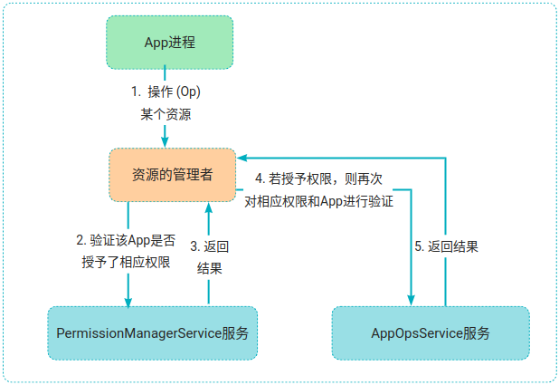

# P38: 系统开发之permission AppOpsManager


---

[跳转到readme](https://github.com/hfreeman2008/android_core_framework/blob/main/README-CN.md)


---

[<font face='黑体' color=#ff0000 size=40 >跳转到文章结尾</font>](#结束语)

---

[返回 P38_系统开发之permission](https://github.com/hfreeman2008/android_core_framework/blob/main/P38_%E7%B3%BB%E7%BB%9F%E5%BC%80%E5%8F%91%E4%B9%8Bpermission/%E7%B3%BB%E7%BB%9F%E5%BC%80%E5%8F%91%E4%B9%8Bpermission.md)


---

AppOpsManager 是 Android 系统中一个用于管理应用操作权限的类，它提供了一种细粒度的权限管理机制，允许系统和应用程序控制应用对某些敏感操作的访问。

frameworks/base / services/core/java/com/android/server/appop/AppOpsService.java
frameworks\base\core\java\android\app\AppOpsManager.java


---

# 主要功能

- 1. 应用操作权限管理
AppOpsManager 允许系统和应用程序控制应用对特定操作的访问权限。这些操作可以是敏感的，如访问摄像头、麦克风、位置信息等。通过 AppOpsManager，可以检查应用是否被允许执行某个操作，以及动态更改应用对这些操作的权限。
- 2. 权限状态查询
可以使用 AppOpsManager 查询应用对特定操作的权限状态。权限状态可以是允许、拒绝或忽略。这有助于应用程序在执行敏感操作之前检查其权限状态，从而避免因权限问题导致的异常。
- 3. 权限更改通知
AppOpsManager 提供了注册监听器的功能，当应用的某个操作权限状态发生更改时，可以收到通知。这使得应用程序能够及时响应权限的变化，调整其行为。

---

# 架构




---

# 主要接口

## 获取 AppOpsManager 实例
要使用 AppOpsManager，首先需要获取其实例。可以通过 
Context 对象的 getSystemService() 方法来获取：

```java
AppOpsManager appOpsManager = (AppOpsManager) context.getSystemService(Context.APP_OPS_SERVICE);
```

## checkOp-检查应用操作权限状态
可以使用 checkOp() 或 checkOpNoThrow() 方法来检查应用对特定操作的权限状态。
```java
// 检查应用对指定操作的权限状态
int result = appOpsManager.checkOp(AppOpsManager.OPSTR_CAMERA, android.os.Process.myUid(), context.getPackageName());
if (result == AppOpsManager.MODE_ALLOWED) {
    // 应用被允许执行该操作
} else if (result == AppOpsManager.MODE_IGNORED) {
    // 应用对该操作的请求将被忽略
} else if (result == AppOpsManager.MODE_ERRORED) {
    // 发生错误
}
```


- OPSTR_CAMERA 是一个操作字符串常量，表示摄像头操作。Android 系统提供了许多这样的常量，用于表示不同的操作。
- android.os.Process.myUid() 用于获取当前应用的用户 ID。
- context.getPackageName() 用于获取当前应用的包名。


## unsafeCheckOp-快速检查应用是否有权限执行某个操作
unsafeCheckOp(String op, int uid, String packageName)：快速检查应用是否有权限执行某个操作


## noteOp-执行应用操作并检查权限

noteOp() 和 noteOpNoThrow() 方法用于执行应用操作并检查权限。

如果权限被允许，操作将继续执行；否则，将返回相应的错误代码。单次操作记录并返回权限状态
```java
int result = appOpsManager.noteOp(AppOpsManager.OPSTR_CAMERA, android.os.Process.myUid(), context.getPackageName());
if (result == AppOpsManager.MODE_ALLOWED) {
    // 可以执行摄像头操作
} else {
    // 权限被拒绝，处理相应的错误
}

mAppOps.noteOp(OPSTR_VIBRATE, Process.myUid(), mOpPackageName)
```


## startOp和finishOp-标记长时操作开始
startOp(String op, int uid, String packageName)：标记长时操作开始（如持续录音），需调用finishOp()结束记录‌


## startWatchingMode-注册权限更改监听器
可以使用 startWatchingMode() 方法注册一个监听器，当应用的某个操作权限状态发生更改时，监听器将收到通知。
```java
AppOpsManager.OnOpChangedListener listener = new AppOpsManager.OnOpChangedListener() {
    @Override
    public void onOpChanged(String op, String packageName) {
        // 处理权限状态更改事件
    }
};

// 注册监听器
appOpsManager.startWatchingMode(AppOpsManager.OPSTR_CAMERA, context.getPackageName(), listener);

// 取消监听器
appOpsManager.stopWatchingMode(listener);
```


## setMode-设置应用操作权限状态

可以使用 setMode() 方法来设置应用对特定操作的权限状态。
```java
appOpsManager.setMode(
    AppOpsManager.OPSTR_CAMERA, 
    android.os.Process.myUid(), 
    context.getPackageName(), 
    AppOpsManager.MODE_ALLOWED);


AppOpsManager appOps = (AppOpsManager) context.getSystemService(Context.APP_OPS_SERVICE);
appOps.setMode(AppOpsManager.OPSTR_ACCESS_FINE_LOCATION, 
    uid, 
    packageName, 
    AppOpsManager.MODE_IGNORE);

AppOpsManager mAppOpsManager = mContext.getSystemService(AppOpsManager.class);
mAppOpsManager.setMode(
        AppOpsManager.permissionToOp(INTERACT_ACROSS_PROFILES_PERMISSION),
        Binder.getCallingUid(), 
        mContext.getPackageName(), 
        AppOpsManager.MODE_ERRORED);
```

- AppOpsManager.MODE_ALLOWED 表示允许应用执行该操作。
- AppOpsManager.MODE_IGNORED 表示忽略应用对该操作的请求。
- AppOpsManager.MODE_ERRORED 表示发生错误。


## resetAllModes-批量重置所有应用的权限配置
resetAllModes()：批量重置所有应用的权限配置为默认状态‌


## permissionToOp-获取与给定权限关联的应用操作名称
permissionToOp(String permission)：获取与给定权限关联的应用操作名称


## strOpToOp
```java
int vibrateOp = AppOpsManager.strOpToOp(AppOpsManager.OPSTR_VIBRATE);
```

## sOpPerms和sOpDefaultMode

```java
public class AppOpsManager {
    
    public static final int MODE_ALLOWED = 0;
    public static final int MODE_IGNORED = 1;
    public static final int MODE_ERRORED = 2;
    public static final int MODE_DEFAULT = 3;
    public static final int MODE_FOREGROUND = 4;   
    
   /**
     * This optionally maps a permission to an operation.  If there
     * is no permission associated with an operation, it is null.
     */
    @UnsupportedAppUsage
    private static String[] sOpPerms = new String[] {
            android.Manifest.permission.ACCESS_COARSE_LOCATION,
            android.Manifest.permission.ACCESS_FINE_LOCATION,
            null,
            android.Manifest.permission.VIBRATE,
            android.Manifest.permission.READ_CONTACTS,
            android.Manifest.permission.WRITE_CONTACTS,
            android.Manifest.permission.READ_CALL_LOG,
            android.Manifest.permission.WRITE_CALL_LOG,
            android.Manifest.permission.READ_CALENDAR,
            android.Manifest.permission.WRITE_CALENDAR,
            android.Manifest.permission.ACCESS_WIFI_STATE,
            null, // no permission required for notifications
            null, // neighboring cells shares the coarse location perm
            android.Manifest.permission.CALL_PHONE,
            android.Manifest.permission.READ_SMS,
            null, // no permission required for writing sms
            android.Manifest.permission.RECEIVE_SMS,
            android.Manifest.permission.RECEIVE_EMERGENCY_BROADCAST,
            android.Manifest.permission.RECEIVE_MMS,
            android.Manifest.permission.RECEIVE_WAP_PUSH,
            android.Manifest.permission.SEND_SMS,
            android.Manifest.permission.READ_SMS,
            null, // no permission required for writing icc sms
            android.Manifest.permission.WRITE_SETTINGS,
            android.Manifest.permission.SYSTEM_ALERT_WINDOW,
            android.Manifest.permission.ACCESS_NOTIFICATIONS,
            android.Manifest.permission.CAMERA,
            android.Manifest.permission.RECORD_AUDIO,
            null, // no permission for playing audio
            null, // no permission for reading clipboard
            null, // no permission for writing clipboard
            null, // no permission for taking media buttons
            null, // no permission for taking audio focus
            null, // no permission for changing master volume
            null, // no permission for changing voice volume
            null, // no permission for changing ring volume
            null, // no permission for changing media volume
            null, // no permission for changing alarm volume
            null, // no permission for changing notification volume
            null, // no permission for changing bluetooth volume
            android.Manifest.permission.WAKE_LOCK,
            null, // no permission for generic location monitoring
            null, // no permission for high power location monitoring
            android.Manifest.permission.PACKAGE_USAGE_STATS,
            null, // no permission for muting/unmuting microphone
            null, // no permission for displaying toasts
            null, // no permission for projecting media
            null, // no permission for activating vpn
            null, // no permission for supporting wallpaper
            null, // no permission for receiving assist structure
            null, // no permission for receiving assist screenshot
            Manifest.permission.READ_PHONE_STATE,
            Manifest.permission.ADD_VOICEMAIL,
            Manifest.permission.USE_SIP,
            Manifest.permission.PROCESS_OUTGOING_CALLS,
            Manifest.permission.USE_FINGERPRINT,
            Manifest.permission.BODY_SENSORS,
            Manifest.permission.READ_CELL_BROADCASTS,
            null,
            Manifest.permission.READ_EXTERNAL_STORAGE,
            Manifest.permission.WRITE_EXTERNAL_STORAGE,
            null, // no permission for turning the screen on
            Manifest.permission.GET_ACCOUNTS,
            null, // no permission for running in background
            null, // no permission for changing accessibility volume
            Manifest.permission.READ_PHONE_NUMBERS,
            Manifest.permission.REQUEST_INSTALL_PACKAGES,
            null, // no permission for entering picture-in-picture on hide
            Manifest.permission.INSTANT_APP_FOREGROUND_SERVICE,
            Manifest.permission.ANSWER_PHONE_CALLS,
            null, // no permission for OP_RUN_ANY_IN_BACKGROUND
            Manifest.permission.CHANGE_WIFI_STATE,
            Manifest.permission.REQUEST_DELETE_PACKAGES,
            Manifest.permission.BIND_ACCESSIBILITY_SERVICE,
            Manifest.permission.ACCEPT_HANDOVER,
            Manifest.permission.MANAGE_IPSEC_TUNNELS,
            Manifest.permission.FOREGROUND_SERVICE,
            null, // no permission for OP_BLUETOOTH_SCAN
            Manifest.permission.USE_BIOMETRIC,
            Manifest.permission.ACTIVITY_RECOGNITION,
            Manifest.permission.SMS_FINANCIAL_TRANSACTIONS,
            null,
            null, // no permission for OP_WRITE_MEDIA_AUDIO
            null,
            null, // no permission for OP_WRITE_MEDIA_VIDEO
            null,
            null, // no permission for OP_WRITE_MEDIA_IMAGES
            null, // no permission for OP_LEGACY_STORAGE
            null, // no permission for OP_ACCESS_ACCESSIBILITY
            null, // no direct permission for OP_READ_DEVICE_IDENTIFIERS
            Manifest.permission.ACCESS_MEDIA_LOCATION,
            null, // no permission for OP_QUERY_ALL_PACKAGES
            Manifest.permission.MANAGE_EXTERNAL_STORAGE,
            android.Manifest.permission.INTERACT_ACROSS_PROFILES,
            null, // no permission for OP_ACTIVATE_PLATFORM_VPN
            android.Manifest.permission.LOADER_USAGE_STATS,
            null, // deprecated operation
            null, // no permission for OP_AUTO_REVOKE_PERMISSIONS_IF_UNUSED
            null, // no permission for OP_AUTO_REVOKE_MANAGED_BY_INSTALLER
            null, // no permission for OP_NO_ISOLATED_STORAGE
            null, // no permission for OP_PHONE_CALL_MICROPHONE
            null, // no permission for OP_PHONE_CALL_CAMERA
            null, // no permission for OP_RECORD_AUDIO_HOTWORD
    };

    /**
     * This specifies the default mode for each operation.每个操作默认的权限模式
     */
    private static int[] sOpDefaultMode = new int[] {
            AppOpsManager.MODE_ALLOWED, // COARSE_LOCATION
            AppOpsManager.MODE_ALLOWED, // FINE_LOCATION
            AppOpsManager.MODE_ALLOWED, // GPS
            AppOpsManager.MODE_ALLOWED, // VIBRATE
            AppOpsManager.MODE_ALLOWED, // READ_CONTACTS
            AppOpsManager.MODE_ALLOWED, // WRITE_CONTACTS
            AppOpsManager.MODE_ALLOWED, // READ_CALL_LOG
            AppOpsManager.MODE_ALLOWED, // WRITE_CALL_LOG
            AppOpsManager.MODE_ALLOWED, // READ_CALENDAR
            AppOpsManager.MODE_ALLOWED, // WRITE_CALENDAR
            AppOpsManager.MODE_ALLOWED, // WIFI_SCAN
            AppOpsManager.MODE_ALLOWED, // POST_NOTIFICATION
            AppOpsManager.MODE_ALLOWED, // NEIGHBORING_CELLS
            AppOpsManager.MODE_ALLOWED, // CALL_PHONE
            AppOpsManager.MODE_ALLOWED, // READ_SMS
            AppOpsManager.MODE_IGNORED, // WRITE_SMS
            AppOpsManager.MODE_ALLOWED, // RECEIVE_SMS
            AppOpsManager.MODE_ALLOWED, // RECEIVE_EMERGENCY_BROADCAST
            AppOpsManager.MODE_ALLOWED, // RECEIVE_MMS
            AppOpsManager.MODE_ALLOWED, // RECEIVE_WAP_PUSH
            AppOpsManager.MODE_ALLOWED, // SEND_SMS
            AppOpsManager.MODE_ALLOWED, // READ_ICC_SMS
            AppOpsManager.MODE_ALLOWED, // WRITE_ICC_SMS
            AppOpsManager.MODE_DEFAULT, // WRITE_SETTINGS
            getSystemAlertWindowDefault(), // SYSTEM_ALERT_WINDOW
            AppOpsManager.MODE_ALLOWED, // ACCESS_NOTIFICATIONS
            AppOpsManager.MODE_ALLOWED, // CAMERA
            AppOpsManager.MODE_ALLOWED, // RECORD_AUDIO
            AppOpsManager.MODE_ALLOWED, // PLAY_AUDIO
            AppOpsManager.MODE_ALLOWED, // READ_CLIPBOARD
            AppOpsManager.MODE_ALLOWED, // WRITE_CLIPBOARD
            AppOpsManager.MODE_ALLOWED, // TAKE_MEDIA_BUTTONS
            AppOpsManager.MODE_ALLOWED, // TAKE_AUDIO_FOCUS
            AppOpsManager.MODE_ALLOWED, // AUDIO_MASTER_VOLUME
            AppOpsManager.MODE_ALLOWED, // AUDIO_VOICE_VOLUME
            AppOpsManager.MODE_ALLOWED, // AUDIO_RING_VOLUME
            AppOpsManager.MODE_ALLOWED, // AUDIO_MEDIA_VOLUME
            AppOpsManager.MODE_ALLOWED, // AUDIO_ALARM_VOLUME
            AppOpsManager.MODE_ALLOWED, // AUDIO_NOTIFICATION_VOLUME
            AppOpsManager.MODE_ALLOWED, // AUDIO_BLUETOOTH_VOLUME
            AppOpsManager.MODE_ALLOWED, // WAKE_LOCK
            AppOpsManager.MODE_ALLOWED, // MONITOR_LOCATION
            AppOpsManager.MODE_ALLOWED, // MONITOR_HIGH_POWER_LOCATION
            AppOpsManager.MODE_DEFAULT, // GET_USAGE_STATS
            AppOpsManager.MODE_ALLOWED, // MUTE_MICROPHONE
            AppOpsManager.MODE_ALLOWED, // TOAST_WINDOW
            AppOpsManager.MODE_IGNORED, // PROJECT_MEDIA
            AppOpsManager.MODE_IGNORED, // ACTIVATE_VPN
            AppOpsManager.MODE_ALLOWED, // WRITE_WALLPAPER
            AppOpsManager.MODE_ALLOWED, // ASSIST_STRUCTURE
            AppOpsManager.MODE_ALLOWED, // ASSIST_SCREENSHOT
            AppOpsManager.MODE_ALLOWED, // READ_PHONE_STATE
            AppOpsManager.MODE_ALLOWED, // ADD_VOICEMAIL
            AppOpsManager.MODE_ALLOWED, // USE_SIP
            AppOpsManager.MODE_ALLOWED, // PROCESS_OUTGOING_CALLS
            AppOpsManager.MODE_ALLOWED, // USE_FINGERPRINT
            AppOpsManager.MODE_ALLOWED, // BODY_SENSORS
            AppOpsManager.MODE_ALLOWED, // READ_CELL_BROADCASTS
            AppOpsManager.MODE_ERRORED, // MOCK_LOCATION
            AppOpsManager.MODE_ALLOWED, // READ_EXTERNAL_STORAGE
            AppOpsManager.MODE_ALLOWED, // WRITE_EXTERNAL_STORAGE
            AppOpsManager.MODE_ALLOWED, // TURN_SCREEN_ON
            AppOpsManager.MODE_ALLOWED, // GET_ACCOUNTS
            AppOpsManager.MODE_ALLOWED, // RUN_IN_BACKGROUND
            AppOpsManager.MODE_ALLOWED, // AUDIO_ACCESSIBILITY_VOLUME
            AppOpsManager.MODE_ALLOWED, // READ_PHONE_NUMBERS
            AppOpsManager.MODE_DEFAULT, // REQUEST_INSTALL_PACKAGES
            AppOpsManager.MODE_ALLOWED, // PICTURE_IN_PICTURE
            AppOpsManager.MODE_DEFAULT, // INSTANT_APP_START_FOREGROUND
            AppOpsManager.MODE_ALLOWED, // ANSWER_PHONE_CALLS
            AppOpsManager.MODE_ALLOWED, // RUN_ANY_IN_BACKGROUND
            AppOpsManager.MODE_ALLOWED, // CHANGE_WIFI_STATE
            AppOpsManager.MODE_ALLOWED, // REQUEST_DELETE_PACKAGES
            AppOpsManager.MODE_ALLOWED, // BIND_ACCESSIBILITY_SERVICE
            AppOpsManager.MODE_ALLOWED, // ACCEPT_HANDOVER
            AppOpsManager.MODE_ERRORED, // MANAGE_IPSEC_TUNNELS
            AppOpsManager.MODE_ALLOWED, // START_FOREGROUND
            AppOpsManager.MODE_ALLOWED, // BLUETOOTH_SCAN
            AppOpsManager.MODE_ALLOWED, // USE_BIOMETRIC
            AppOpsManager.MODE_ALLOWED, // ACTIVITY_RECOGNITION
            AppOpsManager.MODE_DEFAULT, // SMS_FINANCIAL_TRANSACTIONS
            AppOpsManager.MODE_ALLOWED, // READ_MEDIA_AUDIO
            AppOpsManager.MODE_ERRORED, // WRITE_MEDIA_AUDIO
            AppOpsManager.MODE_ALLOWED, // READ_MEDIA_VIDEO
            AppOpsManager.MODE_ERRORED, // WRITE_MEDIA_VIDEO
            AppOpsManager.MODE_ALLOWED, // READ_MEDIA_IMAGES
            AppOpsManager.MODE_ERRORED, // WRITE_MEDIA_IMAGES
            AppOpsManager.MODE_DEFAULT, // LEGACY_STORAGE
            AppOpsManager.MODE_ALLOWED, // ACCESS_ACCESSIBILITY
            AppOpsManager.MODE_ERRORED, // READ_DEVICE_IDENTIFIERS
            AppOpsManager.MODE_ALLOWED, // ALLOW_MEDIA_LOCATION
            AppOpsManager.MODE_DEFAULT, // QUERY_ALL_PACKAGES
            //add hexiaoming  start
            //AppOpsManager.MODE_DEFAULT, // MANAGE_EXTERNAL_STORAGE
            AppOpsManager.MODE_ALLOWED, // MANAGE_EXTERNAL_STORAGE  这个可以修改操作的默认权限
            //add hexiaoming  end
            AppOpsManager.MODE_DEFAULT, // INTERACT_ACROSS_PROFILES
            AppOpsManager.MODE_IGNORED, // ACTIVATE_PLATFORM_VPN
            AppOpsManager.MODE_DEFAULT, // LOADER_USAGE_STATS
            AppOpsManager.MODE_IGNORED, // deprecated operation
            AppOpsManager.MODE_DEFAULT, // OP_AUTO_REVOKE_PERMISSIONS_IF_UNUSED
            AppOpsManager.MODE_ALLOWED, // OP_AUTO_REVOKE_MANAGED_BY_INSTALLER
            AppOpsManager.MODE_ERRORED, // OP_NO_ISOLATED_STORAGE
            AppOpsManager.MODE_ALLOWED, // PHONE_CALL_MICROPHONE
            AppOpsManager.MODE_ALLOWED, // PHONE_CALL_CAMERA
            AppOpsManager.MODE_ALLOWED, // OP_RECORD_AUDIO_HOTWORD
    };  
     //OP定义
    public static final int OP_NONE = AppProtoEnums.APP_OP_NONE;
    public static final int OP_COARSE_LOCATION = AppProtoEnums.APP_OP_COARSE_LOCATION;
    public static final int OP_FINE_LOCATION = AppProtoEnums.APP_OP_FINE_LOCATION;
    public static final int OP_GPS = AppProtoEnums.APP_OP_GPS;
    ......
    public static final int OP_PHONE_CALL_CAMERA = 101;
    public static final int OP_RECORD_AUDIO_HOTWORD = 102;
        
    public int checkOpNoThrow(int op, int uid, String packageName) {
            int mode = mService.checkOperation(op, uid, packageName);
            return mode == AppOpsManager.MODE_FOREGROUND ? AppOpsManager.MODE_ALLOWED : mode;
    }   
    public int checkOp(int op, int uid, String packageName) {
            int mode = mService.checkOperation(op, uid, packageName);
    }      
    public int startOp(@NonNull String op, int uid, @Nullable String packageName,
            @Nullable String attributionTag, @Nullable String message) {
        return startOp(strOpToOp(op), uid, packageName, false, attributionTag, message);
    }
    public int noteOp(@NonNull String op, int uid, @Nullable String packageName,
            @Nullable String attributionTag, @Nullable String message) {
        return noteOp(strOpToOp(op), uid, packageName, attributionTag, message);
    }
}
```

---

# enums.proto

frameworks\base\core\proto\android\app\enums.proto

```java
// AppOpsManager.java - operation ids for logging
enum AppOpEnum {
    APP_OP_NONE = -1;
    APP_OP_COARSE_LOCATION = 0;
    APP_OP_FINE_LOCATION = 1;
    APP_OP_GPS = 2;
    APP_OP_VIBRATE = 3;
    APP_OP_READ_CONTACTS = 4;
    APP_OP_WRITE_CONTACTS = 5;
    APP_OP_READ_CALL_LOG = 6;
    APP_OP_WRITE_CALL_LOG = 7;
    APP_OP_READ_CALENDAR = 8;
    APP_OP_WRITE_CALENDAR = 9;
    APP_OP_WIFI_SCAN = 10;
    APP_OP_POST_NOTIFICATION = 11;
    APP_OP_NEIGHBORING_CELLS = 12;
    APP_OP_CALL_PHONE = 13;
    APP_OP_READ_SMS = 14;
    APP_OP_WRITE_SMS = 15;
    APP_OP_RECEIVE_SMS = 16;
    APP_OP_RECEIVE_EMERGENCY_SMS = 17;
    APP_OP_RECEIVE_MMS = 18;
    APP_OP_RECEIVE_WAP_PUSH = 19;
    APP_OP_SEND_SMS = 20;
    APP_OP_READ_ICC_SMS = 21;
    APP_OP_WRITE_ICC_SMS = 22;
    APP_OP_WRITE_SETTINGS = 23;
    APP_OP_SYSTEM_ALERT_WINDOW = 24;
    APP_OP_ACCESS_NOTIFICATIONS = 25;
    APP_OP_CAMERA = 26;
    APP_OP_RECORD_AUDIO = 27;
    APP_OP_PLAY_AUDIO = 28;
    APP_OP_READ_CLIPBOARD = 29;
    APP_OP_WRITE_CLIPBOARD = 30;
    APP_OP_TAKE_MEDIA_BUTTONS = 31;
    APP_OP_TAKE_AUDIO_FOCUS = 32;
    APP_OP_AUDIO_MASTER_VOLUME = 33;
    APP_OP_AUDIO_VOICE_VOLUME = 34;
    APP_OP_AUDIO_RING_VOLUME = 35;
    APP_OP_AUDIO_MEDIA_VOLUME = 36;
    APP_OP_AUDIO_ALARM_VOLUME = 37;
    APP_OP_AUDIO_NOTIFICATION_VOLUME = 38;
    APP_OP_AUDIO_BLUETOOTH_VOLUME = 39;
    APP_OP_WAKE_LOCK = 40;
    APP_OP_MONITOR_LOCATION = 41;
    APP_OP_MONITOR_HIGH_POWER_LOCATION = 42;
    APP_OP_GET_USAGE_STATS = 43;
    APP_OP_MUTE_MICROPHONE = 44;
    APP_OP_TOAST_WINDOW = 45;
    APP_OP_PROJECT_MEDIA = 46;
    APP_OP_ACTIVATE_VPN = 47;
    APP_OP_WRITE_WALLPAPER = 48;
    APP_OP_ASSIST_STRUCTURE = 49;
    APP_OP_ASSIST_SCREENSHOT = 50;
    APP_OP_READ_PHONE_STATE = 51;
    APP_OP_ADD_VOICEMAIL = 52;
    APP_OP_USE_SIP = 53;
    APP_OP_PROCESS_OUTGOING_CALLS = 54;
    APP_OP_USE_FINGERPRINT = 55;
    APP_OP_BODY_SENSORS = 56;
    APP_OP_READ_CELL_BROADCASTS = 57;
    APP_OP_MOCK_LOCATION = 58;
    APP_OP_READ_EXTERNAL_STORAGE = 59;
    APP_OP_WRITE_EXTERNAL_STORAGE = 60;
    APP_OP_TURN_SCREEN_ON = 61;
    APP_OP_GET_ACCOUNTS = 62;
    APP_OP_RUN_IN_BACKGROUND = 63;
    APP_OP_AUDIO_ACCESSIBILITY_VOLUME = 64;
    APP_OP_READ_PHONE_NUMBERS = 65;
    APP_OP_REQUEST_INSTALL_PACKAGES = 66;
    APP_OP_PICTURE_IN_PICTURE = 67;
    APP_OP_INSTANT_APP_START_FOREGROUND = 68;
    APP_OP_ANSWER_PHONE_CALLS = 69;
    APP_OP_RUN_ANY_IN_BACKGROUND = 70;
    APP_OP_CHANGE_WIFI_STATE = 71;
    APP_OP_REQUEST_DELETE_PACKAGES = 72;
    APP_OP_BIND_ACCESSIBILITY_SERVICE = 73;
    APP_OP_ACCEPT_HANDOVER = 74;
    APP_OP_MANAGE_IPSEC_TUNNELS = 75;
    APP_OP_START_FOREGROUND = 76;
    APP_OP_BLUETOOTH_SCAN = 77;
    APP_OP_USE_BIOMETRIC = 78;
    APP_OP_ACTIVITY_RECOGNITION = 79;
    APP_OP_SMS_FINANCIAL_TRANSACTIONS = 80;
    APP_OP_READ_MEDIA_AUDIO = 81;
    APP_OP_WRITE_MEDIA_AUDIO = 82;
    APP_OP_READ_MEDIA_VIDEO = 83;
    APP_OP_WRITE_MEDIA_VIDEO = 84;
    APP_OP_READ_MEDIA_IMAGES = 85;
    APP_OP_WRITE_MEDIA_IMAGES = 86;
    APP_OP_LEGACY_STORAGE = 87;
    APP_OP_ACCESS_ACCESSIBILITY = 88;
    APP_OP_READ_DEVICE_IDENTIFIERS = 89;
    APP_OP_ACCESS_MEDIA_LOCATION = 90;
    APP_OP_QUERY_ALL_PACKAGES = 91;
    APP_OP_MANAGE_EXTERNAL_STORAGE = 92;
    APP_OP_INTERACT_ACROSS_PROFILES = 93;
    APP_OP_ACTIVATE_PLATFORM_VPN = 94;
    APP_OP_LOADER_USAGE_STATS = 95;
    APP_OP_DEPRECATED_1 = 96 [deprecated = true];
    APP_OP_AUTO_REVOKE_PERMISSIONS_IF_UNUSED = 97;
    APP_OP_AUTO_REVOKE_MANAGED_BY_INSTALLER = 98;
    APP_OP_NO_ISOLATED_STORAGE = 99;
}
```

---

# 默认授予APP权限修改方案


## 方式一 统一修改 
./frameworks/base/core/java/android/app/AppOpsManager.java

```java
    /**
     * This specifies the default mode for each operation.
     */
    private static int[] sOpDefaultMode = new int[] {
            AppOpsManager.MODE_ALLOWED, // COARSE_LOCATION
            AppOpsManager.MODE_ALLOWED, // FINE_LOCATION
            AppOpsManager.MODE_ALLOWED, // GPS
            ...
        -   AppOpsManager.MODE_DEFAULT, // OP_AUTO_REVOKE_PERMISSIONS_IF_UNUSED
        +   AppOpsManager.MODE_IGNORED, // OP_AUTO_REVOKE_PERMISSIONS_IF_UNUSED
            AppOpsManager.MODE_ALLOWED, // OP_AUTO_REVOKE_MANAGED_BY_INSTALLER
            AppOpsManager.MODE_ERRORED, // OP_NO_ISOLATED_STORAGE
            ...
```

## 方式二 指定应用
./frameworks/base/services/core/java/com/android/server/appop/AppOpsService.java
```java
   private @Mode int checkOperationUnchecked(int code, int uid, @NonNull String packageName,
                boolean raw) {
        RestrictionBypass bypass;
        try {
            bypass = verifyAndGetBypass(uid, packageName, null);
        } catch (SecurityException e) {
            Slog.e(TAG, "checkOperation", e);
            return AppOpsManager.opToDefaultMode(code);
        }

        if (isOpRestrictedDueToSuspend(code, packageName, uid)) {
            return AppOpsManager.MODE_IGNORED;
        }
        synchronized (this) {
            if (isOpRestrictedLocked(uid, code, packageName, bypass)) {
                return AppOpsManager.MODE_IGNORED;
            }
            code = AppOpsManager.opToSwitch(code);
            UidState uidState = getUidStateLocked(uid, false);
            if (uidState != null && uidState.opModes != null
                    && uidState.opModes.indexOfKey(code) >= 0) {
                final int rawMode = uidState.opModes.get(code);
                return raw ? rawMode : uidState.evalMode(code, rawMode);
            }
            Op op = getOpLocked(code, uid, packageName, null, bypass, false);
            //add   2024_11_14 start
            int MANAGE_EXTERNAL_STORAGE_CODE = 92;
            if("com.smartcom.sea".equals(packageName) && code == MANAGE_EXTERNAL_STORAGE_CODE){
                Slog.i(TAG, "warning SmartCom com.smartcom.sea permission MANAGE_EXTERNAL_STORAGE allowed!!!!");
                return AppOpsManager.MODE_ALLOWED;
            }
            //add  2024_11_14 end
            if (op == null) {
                return AppOpsManager.opToDefaultMode(code);
            }
            return raw ? op.mode : op.evalMode();
        }
    }
```

有人说这种方式可以，但是我验证不行
```java
private Op getOpLocked(Ops ops, int code, int uid, boolean edit)

     {
        Op op = ops.get(code);
        if (op == null) {
            if (!edit) {
                return null;
            }
            op = new Op(ops.uidState, ops.packageName, code, uid);
            ops.put(code, op);
        }
        //add text
        if(ops.packageName.equals("com.xxx")){
            Op op1 = new Op(ops.uidState, ops.packageName, AppOpsManager.OP_AUTO_REVOKE_PERMISSIONS_IF_UNUSED,uid);
            op1.mode = AppOpsManager.MODE_IGNORED;//MODE_ALLOWED
            ops.put(op1.op, op1);
        }
        //add text
        if (edit) {
            scheduleWriteLocked();
        }
        return op;
    }
```

---

# 自动授予应用OP类型安装应用的权限
frameworks/base/services/core/java/com/android/server/pm/permission/PermissionManagerService.java

```java

    private void systemReady() {
    

        +allowAppInstallPermission("com.zeroonemore.rtv");


    }

    public void allowAppInstallPermission(String pkg)  {
        try {
            if (!TextUtils.isEmpty(pkg)) {
                AppOpsManager mAppOpsManager = (AppOpsManager) mContext.getSystemService(Context.APP_OPS_SERVICE);
                PackageManager pm = mContext.getPackageManager();
                ApplicationInfo ai = pm.getApplicationInfo(pkg, PackageManager.GET_ACTIVITIES);
                mAppOpsManager.setMode(AppOpsManager.OP_REQUEST_INSTALL_PACKAGES, ai.uid, pkg, AppOpsManager.MODE_ALLOWED);
            }
        } catch (Exception e) {
            e.printStackTrace();
        }
    }
```

---

# 三方未知应用安装权限授权
frameworks/base/services/core/java/com/android/server/pm/permission/PermissionManagerService.java


```java
private void restorePermissionState(@NonNull AndroidPackage pkg, boolean replace,
        @Nullable String packageOfInterest, @Nullable PermissionCallback callback,
        @UserIdInt int filterUserId) {
   ......
               //add by  2023-12-20
            if (pkg.getPackageName().equals("com.baidu.map.location") 
                    || "com.zeroonemore.itrunkLauncher".equals(pkg.getPackageName()) 
                    || "com.zeroonemore.rtv".equals(pkg.getPackageName()) 
                    || "com.iflytek.speechcloud".equals(pkg.getPackageName())){
                Slog.e(TAG, "Considering granting permission " + perm + " to package "+ friendlyName);
                flags |= FLAG_PERMISSION_USER_SET;
                uidState.updatePermissionFlags(bp, MASK_PERMISSION_FLAGS_ALL,flags);
                uidState.grantPermission(bp);

                +String code = mAppOpsManager.permissionToOp(permName);
                +if (!TextUtils.isEmpty(code)){
                +    int uid = pkg.getUid();
                +    Slog.d(TAG, "set appops xml code =  " + code  + "uid = " + uid);
                +    //mAppOpsManager.setUidMode(code ,uid,MODE_ALLOWED);
                +    mAppOpsManager.setMode(code,uid,pkg.getPackageName(),MODE_ALLOWED);
                +}

            }else{
                uidState.updatePermissionFlags(bp, MASK_PERMISSION_FLAGS_ALL,flags);
            }

            } else {
                Slog.wtf(LOG_TAG, "Unknown permission protection " + bp.getProtection()
                        + " for permission " + bp.getName());
                    }
```

---

# adb shell appops 

```bash
adb shell appops
AppOps service (appops) commands:
  help
    Print this help text.
  start [--user <USER_ID>] [--attribution <ATTRIBUTION_TAG>] <PACKAGE | UID> <OP>
    Starts a given operation for a particular application.
  stop [--user <USER_ID>] [--attribution <ATTRIBUTION_TAG>] <PACKAGE | UID> <OP>
    Stops a given operation for a particular application.
  set [--user <USER_ID>] <[--uid] PACKAGE | UID> <OP> <MODE>
    Set the mode for a particular application and operation.
  get [--user <USER_ID>] [--attribution <ATTRIBUTION_TAG>] <PACKAGE | UID> [<OP>]
    Return the mode for a particular application and optional operation.
  query-op [--user <USER_ID>] <OP> [<MODE>]
    Print all packages that currently have the given op in the given mode.
  reset [--user <USER_ID>] [<PACKAGE>]
    Reset the given application or all applications to default modes.
  write-settings
    Immediately write pending changes to storage.
  read-settings
    Read the last written settings, replacing current state in RAM.
  options:
    <PACKAGE> an Android package name or its UID if prefixed by --uid
    <OP>      an AppOps operation.
    <MODE>    one of allow, ignore, deny, or default
    <USER_ID> the user id under which the package is installed. If --user is
              not specified, the current user is assumed.
```


```bash
adb shell appops get com.android.systemui

Uid mode: COARSE_LOCATION: foreground
LEGACY_STORAGE: allow
FINE_LOCATION: allow; time=+25s67ms ago
READ_PHONE_STATE: allow; time=+25s80ms ago
READ_MEDIA_IMAGES: allow; time=+20166d8h20m24s861ms ago
MANAGE_EXTERNAL_STORAGE: default; rejectTime=+20166d8h20m24s861ms ago
```


```bash
adb shell appops query-op FINE_LOCATION allow
adb shell appops query-op FINE_LOCATION ignore
adb shell appops query-op FINE_LOCATION deny

android
com.hytera.nrm
com.android.settings
com.android.bluetooth
com.android.networkstack.tethering
com.baidu.map.location
com.qualcomm.location
com.android.systemui
```


```bash
adb shell appops [操作] [应用包名] [权限操作码]
操作‌：get（查询）、set（设置）、reset（重置）等。
```

## 常用操作与示例‌


1.查询应用的某个权限状态‌

```bash
adb shell appops get com.tencent.mm COARSE_LOCATION
```
输出示例：
```bash
COARSE_LOCATION: allow

权限状态‌：allow（允许）、deny（拒绝）、ignore（忽略）、default（默认）。
```


2.强制禁用某个权限‌

禁止微信获取粗略位置

```bash
adb shell appops set com.tencent.mm COARSE_LOCATION deny
```

禁止抖音在后台获取位置（Android 10+）
```bash
adb shell appops set com.ss.android.ugc.awake BACKGROUND_LOCATION deny
```


3.绕过系统限制允许权限‌

某些权限（如后台定位）在系统设置中无法直接开启，但可通过 appops 强制允许：

允许高德地图在后台获取位置

```bash
adb shell appops set com.autonavi.minimap BACKGROUND_LOCATION allow
```


4.阻止应用在后台运行‌

禁止淘宝在后台唤醒设备（禁用 WAKE_LOCK）
```bash
adb shell appops set com.taobao.taobao WAKE_LOCK deny
```


5.重置应用的所有权限‌
```bash
adb shell appops reset com.tencent.mm
```

## 高频权限操作码对照表‌

| 操作码（OP）   | 对应权限说明 | 典型场景     |
|--------|------|----------|
| COARSE_LOCATION   | 粗略位置（WiFi/基站定位）   | 限制地图类应用     |
| FINE_LOCATION   | 精确位置（GPS）   | 防止隐私泄露     |
| BACKGROUND_LOCATION   | 后台获取位置（Android 10+）   | 禁止应用后台追踪用户     |
| WAKE_LOCK   | 唤醒锁（阻止设备休眠）    |  降低后台耗电   |
| CAMERA   | 摄像头访问   | 防止恶意应用偷拍     |
| READ_SMS   | 读取短信   | 保护验证码安全     |
| WRITE_SETTINGS   | 修改系统设置   | 禁止应用自动调节亮度/音量     |
| RUN_IN_BACKGROUND   | 后台运行（Android 8+）   | 限制应用保活     |


## 高级用法‌

1.列出所有应用的权限状态‌
```bash
adb shell appops get
```

输出示例：
```bash
com.tencent.mm:
COARSE_LOCATION: deny
CAMERA: allow
...
```


2.批量关闭某个危险权限‌

禁止所有应用读取短信（需 root）
```bash
adb shell pm list packages | cut -d':' -f2 | xargs -n1 appops set READ_SMS deny
```

3.监控实时权限调用‌
```bash
adb shell appops monitor
```
输出实时权限调用日志（按 Ctrl+C 停止）。


## 实战场景‌
场景 1：阻止拼多多后台保活‌

禁用后台运行和唤醒锁
```bash
adb shell appops set com.xunmeng.pinduoduo RUN_IN_BACKGROUND deny
adb shell appops set com.xunmeng.pinduoduo WAKE_LOCK deny
```


场景 2：禁止应用自启动‌

禁止 Facebook 开机自启（需 START_ACTIVITIES 操作码）
```bash
adb shell appops set com.facebook.katana START_ACTIVITIES deny
```

通过 adb shell appops，你可以绕过系统限制实现更细粒度的权限控制，但需结合 dumpsys package [包名] 或 Android Studio 的 ‌App Inspection‌ 工具进行验证。

---


# dump

```bash
adb shell dumpsys appops
```

```bash
adb shell dumpsys appops -h
AppOps service (appops) dump options:
  -h
    Print this help text.
  --op [OP]
    Limit output to data associated with the given app op code.
  --mode [MODE]
    Limit output to data associated with the given app op mode.
  --package [PACKAGE]
    Limit output to data associated with the given package name.
  --attributionTag [attributionTag]
    Limit output to data associated with the given attribution tag.
  --watchers
    Only output the watcher sections.
```

---

# 日志开关

```java
static final boolean DEBUG = false;
```

---

# appops.xml
保存路径：/data/system/appops.xml

```xml
<?xml version='1.0' encoding='utf-8' standalone='yes' ?>
<app-ops v="1">
<uid n="1001">
<op n="0" m="4" />
<op n="87" m="0" />
</uid>
<uid n="1002">
<op n="0" m="4" />
<op n="87" m="0" />
</uid>
......
<pkg n="com.qti.diagservices">
<uid n="1000">
<op n="92">
<st n="214748364801" r="1732071531264" />
</op>
</uid>
</pkg>

......
<pkg n="com.smartcom.sea">
<uid n="10036">
<op n="0" />
<op n="1">
<st n="429496729601" t="1732084387599" />
<st n="858993459201" t="1732076745364" />
</op>
<op n="2">
<st n="429496729601" t="1732084387071" d="534" />
</op>
<op n="10">
<st n="429496729601" t="1732084386003" />
</op>
<op n="24">
<st n="1288490188801" r="1732084384360" />
</op>
<op n="40">
<st n="429496729601" t="1732084454691" d="6" />
<st n="858993459201" t="1732087164309" d="4" />
</op>
<op n="41">
<st n="429496729601" t="1732084387068" d="485" />
</op>
<op n="42">
<st n="429496729601" t="1732084387068" d="484" />
</op>
<op n="76">
<st n="429496729601" t="1732084384562" d="90682" />
<st n="858993459201" t="1732084475244" d="2690061" />
</op>
</uid>
</pkg>

......
</app-ops>

```

在ActivityManagerService中进行初始化：
```java
mAppOpsService = mInjector.getAppOpsService(new File(systemDir, "appops.xml"), mHandler);
```

在构造函数中，通过readState() 解析pkg及uid标签，把appops.xml中的内容解析出来。


内部类：
大概的数据结构组织，分为三个级别：
- (1). SparseArray<UidState> mUidStates,用于存放uid和对应的uid下的状态，用UidState变量代表;
final SparseArray<UidState> mUidStates = new SparseArray<>();
- (2). UidState,一个uid对应一个UidState;一个uid可以对应多个package,每个package下面都有一个Ops代表一组操作;
- (3). 每个Ops下又有多个op;
另外每个UidState下还有一组opModes，分别保存code和mode的对应管理;不过这个值来自于非pkg下的uid.

历史数据
```java
ls /data/system/appops/history/
900000.xml  9900000.xml  999999900000.xml
```


---


# PermissionManager 与 AppOpsManager 核心对比

## 一、职责与设计目标差异‌
| ‌维度   | ‌PermissionManager‌‌ | ‌AppOpsManager‌‌     |
|--------|------|----------|
| 核心定位‌   | 管理应用声明的标准权限（如CAMERA、LOCATION），处理动态权限授予与状态跟踪   | 控制应用对敏感操作的实际执行权限（如后台定位、剪贴板读取），提供运行时拦截能力‌     |
| 权限模型‌   | 基于安装时声明（AndroidManifest）和运行时动态申请   | 基于动态策略控制，可覆盖传统权限设置（如授予权限但限制操作）‌     |
| 用户可见性‌   | 权限状态通过系统弹窗或设置界面直接暴露给用户   | 操作模式（如静默拒绝）通常由系统工具或企业策略配置，用户无感知     |


## 二、权限控制粒度对比‌
| ‌类别‌‌   | PermissionManager‌‌ | AppOpsManager‌‌     |
|--------|------|----------|
| 控制对象‌   | 标准权限组（如STORAGE、CONTACTS）   | 具体操作（OP_STR标识，如OP_READ_SMS、OP_CAMERA）‌     |
| 覆盖范围‌   | 仅管理声明在AndroidManifest中的权限   | 可控制未声明权限的敏感操作（如剪贴板读取、后台定位）‌     |
| 策略优先级‌   | 权限授予状态决定应用能否执行相关操作   | 即使权限被授予，仍可通过setMode()拦截操作     |


## 三、接口设计与使用场景‌

| ‌功能‌   | ‌PermissionManager‌‌ | AppOpsManager     |
|--------|------|----------|
| ‌‌核心接口‌   | checkPermission()：权限状态检查 requestPermissions()：动态申请权限   | checkOp():检测权限  noteOp()：记录单次操作 setMode()：动态调整操作模式 startOp()：标记长时操作     |
| 权限状态   | PackageManager.PERMISSION_GRANTED（已授予） PackageManager.PERMISSION_DENIED（未授予）   | AppOpsManager.MODE_ALLOWED：允许应用执行该操作。AppOpsManager.MODE_IGNORED：忽略应用对该操作的请求。AppOpsManager.MODE_ERRORED：发生错误。AppOpsManager.MODE_DEFAULT：使用默认的权限设置。     |
| ‌典型使用场景   | ‌应用内动态权限申请，权限合规性检查   | ‌后台敏感操作限制（如禁止应用读取剪贴板） ，企业设备管控（禁用非必要权限）‌|
| 权限依赖   | ‌普通应用可直接调用接口   | 需系统级应用签名或android:sharedUserId="android.uid.system"     |
| 用户交互   | 需要用户授予权限   | 无需用户交互，操作权限由系统或应用控制     |


## ‌四、数据存储与兼容性‌
| ‌维度‌‌   | PermissionManager‌‌ | AppOpsManager‌‌     |
|--------|------|----------|
| 配置存储‌   | 权限状态存储在/data/system/packages.xml   | 操作模式记录在/data/system/appops.xml‌     |
| 版本兼容性‌   | Android 10+ 正式引入自    | Android 4.3 引入，部分操作码需高版本适配（如 Android 13+ 新增OP_READ_MEDIA_IMAGES）‌     |
| 审计能力‌   | 提供权限授予历史记录   | 记录操作调用次数、时间等详细日志（如摄像头启动次数）‌     |


## 总结：核心区别与适用场景‌
PermissionManager‌
- ‌重点‌：管理应用声明的标准权限，遵循 Android 官方权限模型，提供用户可见的交互流程 
- ‌适用场景‌：常规动态权限申请、权限状态检查、权限组管理 


AppOpsManager‌
- ‌重点‌：控制应用实际操作的执行权限，支持细粒度策略覆盖，适用于系统级或企业级深度管控 
- ‌适用场景‌：后台敏感操作拦截、无声明权限的隐私保护、操作日志审计 ‌

## ‌选择建议‌
常规开发‌：优先使用 PermissionManager 处理动态权限流程，确保符合 Google Play 政策 

系统工具或企业应用‌：结合 AppOpsManager 实现更严格的权限策略（如禁止后台录音），需注意系统权限要求


---

[<font face='黑体' color=#ff0000 size=40 >跳转到文章开始</font>](#p38-系统开发之permission-appopsmanager)

---


[返回 P38_系统开发之permission](https://github.com/hfreeman2008/android_core_framework/blob/main/P38_%E7%B3%BB%E7%BB%9F%E5%BC%80%E5%8F%91%E4%B9%8Bpermission/%E7%B3%BB%E7%BB%9F%E5%BC%80%E5%8F%91%E4%B9%8Bpermission.md)


---

# 结束语

