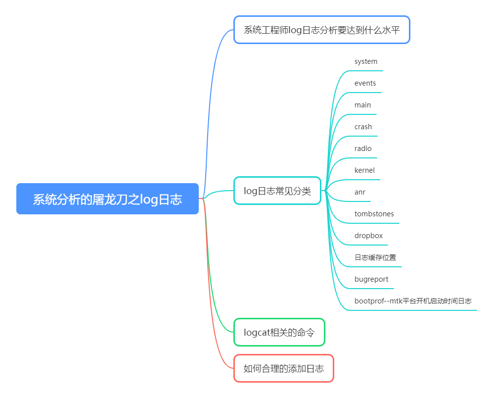

# P4: Key Technologies in System Analysis - log

The analysis of Android issues, the most commonly used one is logs, which can be said to be the most important one。

The log is a key technology for system problem analysis, and it is not an exaggeration at all


---




---

# What level of system engineer log analysis should be achieved

So, what level of log analysis is necessary to reach the level of a system engineer?

My answer is:

- 1.The operation and operation status of the machine during the specified time period can be replicated from the log;

- 2.Can locate errors to unknown times through keywords;

So for a log that everyone knows and uses，What kind of flowers can we play with in this article.

Let's take a look at the decomposition below。

---

# log Common classifications

## system
--------- beginning of system


### system log api：

```java
import android.util.Slog;
 Slog.v(TAG, "system log ");
```

---

### ams

Start the application:
```java
ActivityTaskManager: START u0 {cmp=com.dream.dreamlogger/.DreagActivity} from uid 1000
ActivityManager: Start proc 6499:com.dream.dreamlogger/1000 for pre-top-activity {com.dream.dreamlogger/com.dream.dreamlogger.DreagActivity}
```


Start the service：
```java
ActivityManager: Start proc 6619:.connect.ConnectorService/1000 for service {com.android.usbaccessory/com.android.usbaccessory.connect.ConnectorService}
```

---
### wms

```java
V WindowManager: Orientation start waiting for draw, mDrawState=DRAW_PENDING in Window{1e537fa u0 com.android.settings/com.android.settings.FallbackHome}, surfaceController Surface(name=com.android.settings/com.android.settings.FallbackHome)/@0x9822dab
```

---

### Logs of various system services

The logs of system services are mostly in this section，So this section of the log is the focus of attention。

System services include：BluetoothManagerService，ConnectivityService，BatteryService，LightsService，StorageManagerService，WallpaperManagerService，UriGrantsManagerService，DisplayManagerService......。

---

## events
--------- beginning of events

### events log api：

```java
import android.util.EventLog;
EventLog.writeEvent(......);
```

---

### am and process
```java
am_proc_start: [0,3487,1000,com.qualcomm.qti.services.secureui:sui_service,added application,com.qualcomm.qti.services.secureui:sui_service]
am_proc_died: [0,4391,com.qti.ltebc,0,11]
am_proc_bound: [0,6499,com.dream.dreamlogger]
```

---

### am and service
```java
am_stop_idle_service: [10049,com.qti.ltebc/com.qualcomm.ltebc.LTERootService]
```

---

### am and broadcast
```java
am_broadcast_discard_app: [0,4020578,android.intent.action.MEDIA_MOUNTED,2,ResolveInfo{6fe2974 com.qti.ltebc/com.qualcomm.ltebc.LTEBroadcastReceiver m=0x208000}]
```

---

### wm and activity
```java
I wm_activity_launch_time: [0,160827187,com.android.launcher/.MainActivity,1130]
I wm_create_activity: [0,60813961,34,com.qualcomm.qti.qmmi/.framework.MainActivity,NULL,NULL,NULL,0]
I wm_on_create_called: [160827187,com.android.launcher.MainActivity,performCreate]
I wm_on_start_called: [160827187,com.android.launcher.MainActivity,handleStartActivity]
I wm_restart_activity: [0,60813961,34,com.qualcomm.qti.qmmi/.framework.MainActivity]
I wm_on_restart_called: [153721854,com.android.settings.scmenu.DeveloperModeActivity,performRestartActivity]
I wm_on_resume_called: [160827187,com.android.launcher.MainActivity,RESUME_ACTIVITY]
I wm_resume_activity: [0,153721854,34,com.android.settings/.scmenu.DeveloperModeActivity]
I wm_on_top_resumed_gained_called: [160827187,com.android.launcher.MainActivity,topStateChangedWhenResumed]
I wm_on_top_resumed_lost_called: [160827187,com.android.launcher.MainActivity,topStateChangedWhenResumed]
I wm_set_resumed_activity: [0,com.qualcomm.qti.qmmi/.framework.MainActivity,minimalResumeActivityLocked]
I wm_on_paused_called: [160827187,com.android.launcher.MainActivity,performPause]
I wm_pause_activity: [0,153721854,com.android.settings/.scmenu.DeveloperModeActivity,userLeaving=true]
I wm_stop_activity: [0,160827187,com.android.launcher/.MainActivity]
I wm_add_to_stopping: [0,153721854,com.android.settings/.scmenu.DeveloperModeActivity,makeInvisible]
I wm_on_stop_called: [160827187,com.android.launcher.MainActivity,STOP_ACTIVITY_ITEM]
I wm_on_destroy_called: [86667843,com.android.settings.FallbackHome,performDestroy]
I wm_destroy_activity: [0,193515979,34,com.dream.dreamlogger/.DreamOfflineLogActivity,finish-imm:idle]
I wm_finish_activity: [0,193515979,34,com.dream.dreamlogger/.DreamOfflineLogActivity,app-request]

```

---

### wm and task,stack

```java
I wm_stack_created: 34
I wm_stack_removed: 2

I wm_task_created: [34,-1]
I wm_task_removed: [2,removeTask]
I wm_task_removed: [2,removeChild: last r=ActivityRecord{52a7243 u0 com.android.settings/.FallbackHome t-1 f}} in t=Task{2c22984 #2 visible=false type=home mode=fullscreen translucent=true A=1000:com.android.settings.FallbackHome U=0 StackId=2 sz=0}]

```

---

### selinux

```java
I auditd  : type=1400 audit(0.0:630): avc: denied { read } for comm="Binder:588_2" name="wakeup24" dev="sysfs" ino=36313 scontext=u:r:system_suspend:s0 tcontext=u:object_r:sysfs:s0 tclass=dir permissive=0
```

---

### battery

```java
battery_level: [98,4345,292]
battery_status: [3,2,1,0,Li-ion]
```

---

### sysui_multi_action
```java
sysui_multi_action: [757,803,799,key_back_up,802,1]
sysui_multi_action: [757,804,799,power_consecutive_short_tap_count,801,1,802,1]
sysui_multi_action: [757,804,799,power_double_tap_interval,801,58183048,802,1]

```


---

## main
--------- beginning of main

### main log api：

```java
 android.util.Log.i(TAG, "log info is ===========");
```

From this, we know that most of the main logs are printed and outputed by the app itself.There is no pattern.


---

## crash
--------- beginning of crash

This crash log is one of the common problems we deal with and requires special attention.

- 1:native crash

```java
F libc    : Fatal signal 11 (SIGSEGV), code 1 (SEGV_MAPERR), fault addr 0x0 in tid 3374 (com.android.nfc), pid 3374 (com.android.nfc)
F DEBUG   : Build fingerprint: 
F DEBUG   : Revision: '0'
F DEBUG   : ABI: 'arm64'
F DEBUG   : Timestamp: 
F DEBUG   : pid: 3374, tid: 3374, name: com.android.nfc  >>> com.android.nfc <<<
F DEBUG   : uid: 1027
F DEBUG   : signal 11 (SIGSEGV), code 1 (SEGV_MAPERR), fault addr 0x0
F DEBUG   : Cause: null pointer dereference
F DEBUG   :     x0  0000000000000000  x1  0000007fe73eb974  x2  0000000000000000  x3  b400007769de4380
F DEBUG   :     x4  0000007fe73ec020  x5  0000007595cc0769  x6  b2feff7568e0cdff  x7  ff7f7f7f7fffff7f
F DEBUG   : backtrace:
F DEBUG   :       #00 pc 000000000005c15c  /apex/com.android.runtime/lib64/bionic/libc.so (sem_getvalue) (BuildId: f4881cdb04823cc0d8c0fa3f95c4db2e)
F DEBUG   :       #03 pc 000000000000a65c  /system/app/NfcNci/oat/arm64/NfcNci.odex (art_jni_trampoline+124) (BuildId: 13e5d153b841131176688eda1cc33cec2778b1e6)
F DEBUG   :       #04 pc 0000000000133564  /apex/com.android.art/lib64/libart.so (art_quick_invoke_stub+548) (BuildId: 0183cc6150704cdc371a87b659800e56)
F DEBUG   :       #08 pc 000000000067df14  /apex/com.android.art/lib64/libart.so (MterpInvokeInterface+1032) (BuildId: 0183cc6150704cdc371a87b659800e56)
F DEBUG   :       #09 pc 000000000012da14  /apex/com.android.art/lib64/libart.so (mterp_op_invoke_interface+20) (BuildId: 0183cc6150704cdc371a87b659800e56)
F DEBUG   :       #10 pc 000000000017c858  /system/app/NfcNci/NfcNci.apk (offset 0x1000) (com.android.nfc.NfcService$NfcServiceHandler.handleMessage+1092)
```

- 2：app crash
```java
E AndroidRuntime: Process: com.dream.recorder, PID: 3691
E AndroidRuntime: java.lang.IllegalArgumentException: supportsCameraApi:2365: Unknown camera ID 0
E AndroidRuntime:  at android.hardware.camera2.CameraManager.throwAsPublicException(CameraManager.java:1013)
E AndroidRuntime:  at android.hardware.camera2.CameraManager.getCameraCharacteristics(CameraManager.java:461)
E AndroidRuntime:  at android.hardware.camera2.CameraManager.openCameraDeviceUserAsync(CameraManager.java:497)
E AndroidRuntime:  at android.hardware.camera2.CameraManager.openCameraForUid(CameraManager.java:737)
E AndroidRuntime:  at android.hardware.camera2.CameraManager.openCamera(CameraManager.java:665)
E AndroidRuntime:         at com.dream.recorder.media.camera.impl.LnlyjCameraImpl.openInner(LnlyjCameraImpl.java:252)
E AndroidRuntime:         at com.dream.recorder.media.camera.impl.LnlyjCameraImpl.access$800(LnlyjCameraImpl.java:32)
E AndroidRuntime:         at com.dream.recorder.media.camera.impl.LnlyjCameraImpl$WorkHandler.open(LnlyjCameraImpl.java:573)
E AndroidRuntime:         at com.dream.recorder.media.camera.impl.LnlyjCameraImpl$WorkHandler.handleMessage(LnlyjCameraImpl.java:538)
E AndroidRuntime:         at android.os.Handler.dispatchMessage(Handler.java:106)
E AndroidRuntime:         at android.os.Looper.loop(Looper.java:223)
E AndroidRuntime:         at android.os.HandlerThread.run(HandlerThread.java:67)
E AndroidRuntime: Caused by: android.os.ServiceSpecificException: supportsCameraApi:2365: Unknown camera ID 0 (code 3)
E AndroidRuntime:         at android.os.Parcel.createExceptionOrNull(Parcel.java:2387)
E AndroidRuntime:         at android.os.Parcel.createException(Parcel.java:2357)
E AndroidRuntime:         at android.hardware.ICameraService$Stub$Proxy.supportsCameraApi(ICameraService.java:906)
E AndroidRuntime:         at android.hardware.camera2.CameraManager.supportsCameraApiLocked(CameraManager.java:1066)
E AndroidRuntime:         at android.hardware.camera2.CameraManager.supportsCamera2ApiLocked(CameraManager.java:1042)
E AndroidRuntime:         at android.hardware.camera2.CameraManager.getCameraCharacteristics(CameraManager.java:434)
```

---

## radio
--------- beginning of radio

```java
Rlog.w(LOG_TAG, "------------");
```

This part of the log, which is related to the communication module, such as RIL.

Leave blank because I do not have any effective experience sharing.

---

## kernel

### view kernel log：

```java
adb shell cat /proc/kmsg > kernel.log
adb shell dmesg > kernel_001.log
```

Leave blank because I do not have any effective experience sharing.

---

## anr

anr log file：

```java
/data/anr/traces.txt
adb pull /data/anr/ ./anr
```

---

## tombstones

tombstones log file：

```java
/data/tombstones/tombstone_X
adb pull /data/tombstones ./tombstones
```

---

## dropbox：

```java
/data/system/dropbox/
adb pull /data/system/dropbox/ ./dropbox
```

---

## Log cache location：
dev/log


---

## bugreport

```java
adb bugreport > bugreport.txt
adb shell bugreport > bugreport.txt
```

---

## bootprof--mtk platform startup time log

```java
adb shell cat /proc/bootprof
adb pull /proc/bootprof  ./bootprof
```

---

# logcat command

```java
adb logcat -c
adb logcat -b all
adb logcat -b main
adb logcat -b system
adb logcat -b events
adb logcat -b radio

```


---

# How to add logs reasonably

To answer this question, we need to first recall when we need logs?

---

## When do we need logs?
If encountering problems, is there a log of the most frequently heard sentence by testing colleagues from the development side.

Through this sentence, we know that when encountering problems, we hope to have relevant exception or error information in the log,.

so that developers can easily locate the problem.

So, logs must record information about exceptions and errors, which is the most important content.

---

## What is the purpose of logging?

A log can be likened to a historical book written truthfully by a historian who records history

Developers can learn about past history by reading logs, just like reading history books.

And our main focus is on:

- Abnormal and erroneous information
- Key information

So adding logs reasonably should mainly focus on these two aspects:

- Abnormal and erroneous information
- Key information 
This section includes critical business, critical actions, critical states, and so on.

---

# Conclusion

