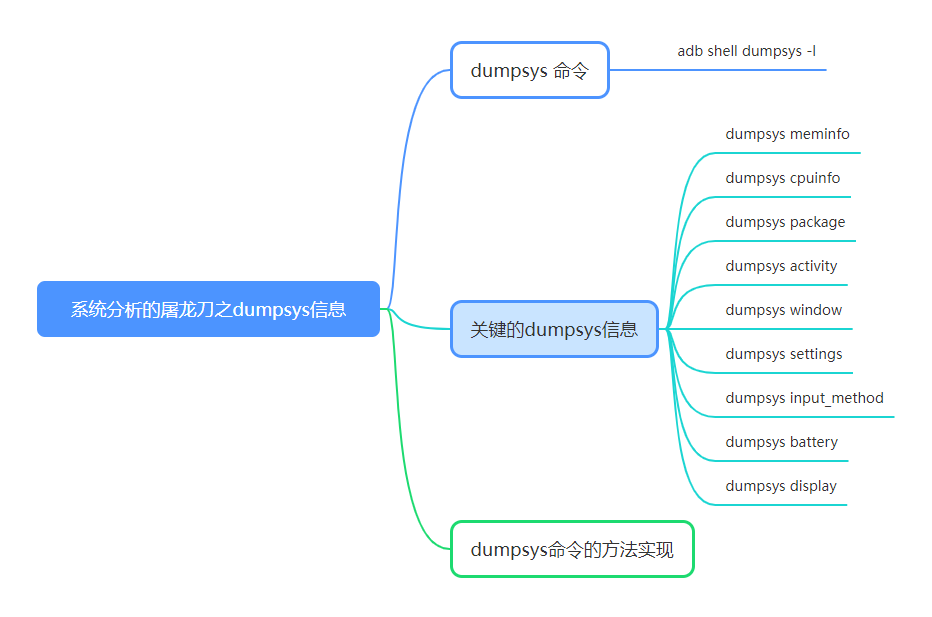
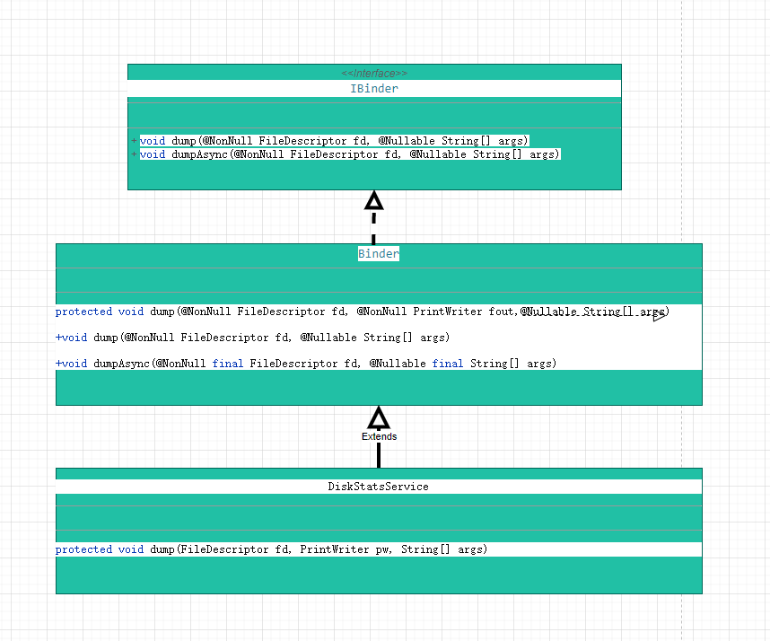

# P5: 系统分析的屠龙刀之dumpsys信息
android问题的分析，大家使用最多的是日志。
但是系统问题分析，我们会发现日志太少，甚至是什么信息都没有，这时候dumpsys信息，因其信息特别完整全面，成为了系统开发的另一把屠龙刀。


---

[<font face='黑体' color=#ff0000 size=40 >跳转到文章结尾</font>](#结束语)

---


一个android系统工程，你只有掌握了dumpsys工具，你才能说自己已经开始摸到系统的脉搏了。


---



---

# dumpsys 命令

查看dump系统服务的完整列表：
```java
adb shell dumpsys -l
```

---
# 关键的dumpsys信息
## dumpsys meminfo
这个命令，我们针对分析设备的memory，特别有用

查看所有应用的内存信息：
```java
adb shell dumpsys meminfo
```

查看设备对应应用com.android.pkgname的内存信息：
```java
adb shell dumpsys meminfo com.android.pkgname
```
---

## dumpsys cpuinfo
这个命令，我们针对分析设备的cpu，特别有用
查看cpu信息
```java
adb shell dumpsys cpuinfo
```

---

## dumpsys package
这个命令，我们针对分析设备的所有应用信息，特别有用

查看应用包信息
```java
adb shell dumpsys package
adb shell dumpsys package com.android.pkgname
```

---

## dumpsys activity
对于系统来说，ams的dumpsys命令是我们查看系统信息的重要指令

```java
adb shell dumpsys activity
```

dumpsys activity信息实在是太庞大太多，主要包括如下几个方面：
```java
ACTIVITY MANAGER SETTINGS (dumpsys activity settings) activity_manager_constants:
ACTIVITY MANAGER ALLOWED ASSOCIATION STATE (dumpsys activity allowed-associations)
ACTIVITY MANAGER PENDING INTENTS (dumpsys activity intents)//intent信息
ACTIVITY MANAGER BROADCAST STATE (dumpsys activity broadcasts)//broadcasts信息
ACTIVITY MANAGER CONTENT PROVIDERS (dumpsys activity providers)//provider信息
ACTIVITY MANAGER URI PERMISSIONS (dumpsys activity permissions)
ACTIVITY MANAGER SERVICES (dumpsys activity services)  //服务信息
ACTIVITY MANAGER RECENT TASKS (dumpsys activity recents)//最近应用的信息
ACTIVITY MANAGER LAST ANR (dumpsys activity lastanr)//anr信息
ACTIVITY MANAGER STARTER (dumpsys activity starter)
ACTIVITY MANAGER CONTAINERS (dumpsys activity containers)//activity的容器信息
ACTIVITY MANAGER ACTIVITIES (dumpsys activity activities)//activities信息
ACTIVITY MANAGER PROCESS EXIT INFO (dumpsys activity exit-info)
ACTIVITY MANAGER LMK KILLS (dumpsys activity lmk)
ACTIVITY MANAGER RUNNING PROCESSES (dumpsys activity processes)
ACTIVITY MANAGER USERS (dumpsys activity users)
Raw LRU list (dumpsys activity lru)
```

其中，我们平常用的最多的就是查看当前界面的activity信息：
```java
adb shell "dumpsys activity | grep -A 45 -i 'from top to'"
adb shell "dumpsys | grep -i -A 4 'mCurrentFocus'"
```

---

## dumpsys window
对于系统来说，wms的dumpsys命令是我们查看系统信息的重要指令

```java
adb shell dumpsys window
```

dumpsys window 主要包括如下几个方面：
```java
WINDOW MANAGER LAST ANR (dumpsys window lastanr)
WINDOW MANAGER POLICY STATE (dumpsys window policy)//策略信息
WINDOW MANAGER ANIMATOR STATE (dumpsys window animator)//窗口动画
WINDOW MANAGER SESSIONS (dumpsys window sessions)
WINDOW MANAGER DISPLAY CONTENTS (dumpsys window displays)
WINDOW MANAGER TOKENS (dumpsys window tokens)
WINDOW MANAGER WINDOWS (dumpsys window windows)//windows信息
WINDOW MANAGER TRACE (dumpsys window trace)
WINDOW MANAGER LOGGING (dumpsys window logging)
WINDOW MANAGER HIGH REFRESH RATE BLACKLIST (dumpsys window refresh)
WINDOW MANAGER CONSTANTS (dumpsys window constants)
```

查看设备分辨率
```java
adb shell "dumpsys window | grep init"
```

---

## dumpsys settings

读取SettingsProvider数据库中的数据
```java
adb shell dumpsys settings
```

这个命令，是我们开发时确认SettingsProvider数据库的字段的一个常用命令。


---

## dumpsys input_method
查看输入法信息：
```java
adb shell dumpsys input_method
```

一些关键的关于输入法的信息：

```java
Current Input Method Manager state:
  Input Methods: mMethodMapUpdateCount=2
  InputMethod #0:
    mId=com.google.android.inputmethod.latin/com.android.inputmethod.latin.LatinIME mSettingsActivityName=com.google.android.apps.inputmethod.latin.preference.SettingsActivity 
......

  InputMethod #1:
    mId=com.inputmethod.tvz/com.android.inputmethod.pinyin.TvzIME mSettingsActivityName=com.android.inputmethod.pinyin.SettingsActivity mIsVrOnly=false 
 ......
  mCurMethodId=com.google.android.inputmethod.latin/com.android.inputmethod.latin.LatinIME
```


---

## dumpsys battery
查看电池信息
```java
adb shell dumpsys battery
adb shell dumpsys batterystats
```


adb shell dumpsys battery:
```java
Current Battery Service state:
  AC powered: false
  USB powered: true
  Wireless powered: false
  Max charging current: 500000
  Max charging voltage: 5000000
  Charge counter: 3270000
  status: 5
  health: 2
  present: true
  level: 100
  scale: 100
  voltage: 4352
  temperature: 274
  technology: Li-ion

```

---

## dumpsys display

查看display相关：
```java
adb shell dumpsys display
```

查看亮度值mBrightness：
```java
BrightnessObserver
    mBrightness: 102
```


自动调节亮度的相关信息：
```java
SimpleMappingStrategy
  mSpline=MonotoneCubicSpline{[(0.0, 0.011453409: 0.0019675908), (10.0, 0.031129315: 0.0022426946), (30.0, 0.08148529: 0.0028148363), (60.0, 0.17484152: 0.0034001395), (100.0, 0.3223777: 0.00396333), (150.0, 0.53429043: 0.0036997495), (210.0, 0.7239651: 0.0033023162), (212.0175, 0.73091215: 0.003443372), (255.0, 0.8789162: 0.0034433564)]}
  mMaxGamma=3.0
  mAutoBrightnessAdjustment=-0.2651215
  mUserLux=212.0175
  mUserBrightness=0.73091215
```

---

# dumpsys命令的方法实现

我以一个比较简单的系统服务DiskStatsService为例，说明其实是系统服务实现Binder接口中的方法dump。




IBinder类：
```java
public interface IBinder {
    /**
     * Print the object's state into the given stream.
     * 
     * @param fd The raw file descriptor that the dump is being sent to.
     * @param args additional arguments to the dump request.
     */
    public void dump(@NonNull FileDescriptor fd, @Nullable String[] args) throws RemoteException;

    /**
     * Like {@link #dump(FileDescriptor, String[])} but always executes
     * asynchronously.  If the object is local, a new thread is created
     * to perform the dump.
     *
     * @param fd The raw file descriptor that the dump is being sent to.
     * @param args additional arguments to the dump request.
     */
    public void dumpAsync(@NonNull FileDescriptor fd, @Nullable String[] args)
            throws RemoteException;
}
```


Binder类：

```java
public class Binder implements IBinder {

    /**
     * Print the object's state into the given stream.
     *
     * @param fd The raw file descriptor that the dump is being sent to.
     * @param fout The file to which you should dump your state.  This will be
     * closed for you after you return.
     * @param args additional arguments to the dump request.
     */
    protected void dump(@NonNull FileDescriptor fd, @NonNull PrintWriter fout,
            @Nullable String[] args) {
    }

    /**
     * Implemented to call the more convenient version
     * {@link #dump(FileDescriptor, PrintWriter, String[])}.
     */
    public void dump(@NonNull FileDescriptor fd, @Nullable String[] args) {
        FileOutputStream fout = new FileOutputStream(fd);
        PrintWriter pw = new FastPrintWriter(fout);
        try {
            doDump(fd, pw, args);
        } finally {
            pw.flush();
        }
    }

        /**
     * Like {@link #dump(FileDescriptor, String[])}, but ensures the target
     * executes asynchronously.
     */
    public void dumpAsync(@NonNull final FileDescriptor fd, @Nullable final String[] args) {
        final FileOutputStream fout = new FileOutputStream(fd);
        final PrintWriter pw = new FastPrintWriter(fout);
        Thread thr = new Thread("Binder.dumpAsync") {
            public void run() {
                try {
                    dump(fd, pw, args);
                } finally {
                    pw.flush();
                }
            }
        };
        thr.start();
    }
}
```

DiskStatsService类：

```java
public class DiskStatsService extends Binder {


    @Override
    protected void dump(FileDescriptor fd, PrintWriter pw, String[] args) {
        ......
    }
}
```

---

# 参考资料
[dumpsys](https://developer.android.google.cn/studio/command-line/dumpsys)

https://developer.android.google.cn/studio/command-line/dumpsys


---

[<font face='黑体' color=#ff0000 size=40 >跳转到文章开始</font>](#p5-系统分析的屠龙刀之dumpsys信息)

---

# 结束语

