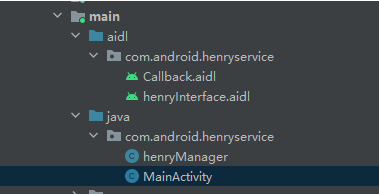
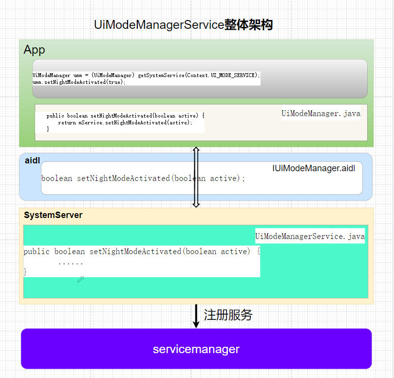

# P8: 系统开发之自定义系统服务

前面啰啰嗦嗦写了这么多，终于到了android的系统服务了。

打个小比喻：

如果android系统是一颗大树的话，android app应用是我们看到的树上的果实，那android的系统服务就是我们看不到的最重要，最核心，同时也是最复杂的的花儿；


---

# 你是不是有这样的困惑？

现在android开发要求都是比较高，许多公司招聘都要求对系统的核心服务熟悉，其中常用的包括ams,wms,pms,ims。

我们是一个有追求的少年，我们当然要学会这些核心的系统服务啊。

所以当我们兴冲冲的打开ams的ActivityManagerService.java源码时，发现有二万多行代码，这怎么读啊，...。

我们不信邪，再看看pms的PackageManagerService.java源码，还是有二万六千多行代码,......


就算你强行恶心自己，看完这些代码，你也基本上迷失在代码的汪洋大海中。

这个时候，你发现其实系统服务这玩意不会也没有什么关系，王者，吃鸡其实更香。

看着你转身的背影，我其实看到了曾经的那个同样困惑的少年。

为了让大家脱离这个困惑，所以这的这几个关于系统服务的文章，就是希望可以让大家可以自己能自主的举一反三的掌握android的一百多个系统服务。

---

# 我们要如何学习系统服务呢？

我们为什么有会有上面的困惑呢？

原因其实就是我们违反了一个学习的基本原则：

由易到难，由浅到深


我们打开的ams,pms，可以说是android系统的二个最复杂的模块。我们没有任何基础，直接来学习ams,pms当然就会出现上面的困惑。

这个就好像一个初学跑步的同学，直接连续来二个万米马来松；

少年，你只是困惑，小命能保住，算比较幸运的了。

所以：
**我们要由易到难，由浅到深的学习系统服务！**


那为什么我要从自定义系统服务来开始讲解呢？

原因是：
只有我们能自已能自定义一个最简单的系统服务，才能从整体上把握系统服务。

所以：
**我们要从整体上把握系统服务！**


综合下来就是：
**我们要从整体上把握系统服务，然后由易到难，由浅到深的学习系统服务！**

---

# 自定义一个系统服务

我们就以网上的一个例子来自定义一个系统服务.

---

 ## 编写AIDL文件

 添加服务首先是编写AIDL文件, AIDL文件路径如下:
frameworks/base/core/java/com/android/henryservice

henryInterface.aidl
```java
package com.android.henryservice;

// Declare any non-default types here with import statements
import com.android.henryservice.Callback;

interface henryInterface {
     void registerCallback(Callback callback);
     void unregisterCallback(Callback callback);
     void sendMessage(int type, String value);
}
```

Callback.aidl
```java
package com.android.henryservice;

// Declare any non-default types here with import statements
interface Callback {
 oneway void onMessageReceived(int type, String value);
}
```

文件写完后, 添加到编译文件Android.bp中
frameworks/base/Android.bp
```java
java_defaults {
    name: "framework-defaults",
    installable: true,

    srcs: [
        // From build/make/core/pathmap.mk FRAMEWORK_BASE_SUBDIRS
        "core/java/**/*.java",
        "graphics/java/**/*.java",
        "location/java/**/*.java",
        "lowpan/java/**/*.java",
        "media/java/**/*.java",
        "media/mca/effect/java/**/*.java",
        "media/mca/filterfw/java/**/*.java",
        "media/mca/filterpacks/java/**/*.java",
        "drm/java/**/*.java",
        "opengl/java/**/*.java",
        "sax/java/**/*.java",
        "telecomm/java/**/*.java",
        "telephony/java/**/*.java",
        "wifi/java/**/*.java",
        "keystore/java/**/*.java",
        "rs/java/**/*.java",

        ":framework-javastream-protos",
        "core/java/com/android/henryservice/henryInterface.aidl",
        "core/java/com/android/henryservice/Callback.aidl",
        "core/java/android/accessibilityservice/IAccessibilityServiceConnection.aidl",
        //省略代码
```
---

## 编写Manager类
Manager类一般都是某个系统服务的客户端代理类。

frameworks/base/core/java/com/android/henryservice/henryManager.java
```java
package com.android.henryservice;

import android.content.Context;
import android.os.RemoteException;
import android.util.Log;

public class henryManager {
    private static final String TAG = henryManager.class.getSimpleName();

    // 系统服务注册时使用的名字, 确保和已有的服务名字不冲突
    public static final String SERVICE = "henryservice";

    private final Context mContext;
    private final henryInterface mService;

    public henryManager(Context context, henryInterface service) {
        mContext = context;
        mService = service;
        Log.d(TAG, "henryManager init");
    }

    public void register(Callback callback) {
        try {
            mService.registerCallback(callback);
        } catch (RemoteException e) {
            Log.w(TAG, "remote exception happen");
            e.printStackTrace();
        }
    }

    public void unregister(Callback callback) {
        try {
            mService.unregisterCallback(callback);
        } catch (RemoteException e) {
            Log.w(TAG, "remote exception happen");
            e.printStackTrace();
        }
    }

    /**
     * Send event to SystemEventService.
     */
    public void sendEvent(int type, String value) {
        try {
            mService.sendMessage(type, value);
        } catch (RemoteException e) {
            Log.w(TAG, "remote exception happen");
            e.printStackTrace();
        }
    }
}
```
---

## 编写系统服务

frameworks/base/services/core/java/com/android/server/henryservice/henryservice.java

```java
package com.android.server.henryservice;

import android.content.Context;
import android.os.Binder;
import android.os.RemoteCallbackList;
import android.os.RemoteException;
import android.util.Log;
import com.android.henryservice.Callback;
import com.android.henryservice.henryInterface;


public class henryservice extends henryInterface.Stub {

    private static final String TAG = henryservice.class.getSimpleName();
    private RemoteCallbackList<Callback> mCallbackList = new RemoteCallbackList<>();

    private Context mContext;

    public henryservice(Context context) {
        mContext = context;
        Log.d(TAG, "henryservice init");
    }

    @Override
    public void registerCallback(Callback callback) {
        boolean result = mCallbackList.register(callback);
        Log.d(TAG, "register pid:" + Binder.getCallingPid()
                + " uid:" + Binder.getCallingUid() + " result:" + result);

    }

    @Override
    public void unregisterCallback(Callback callback) {
        boolean result = mCallbackList.unregister(callback);
        Log.d(TAG, "unregister pid:" + Binder.getCallingPid()
                + " uid:" + Binder.getCallingUid() + " result:" + result);

    }

    @Override
    public void sendMessage(int type, String value) throws RemoteException {
        sendEventToRemote(type, value + " remote");
    }

    public void sendEventToRemote(int type, String value) {
        int count = mCallbackList.getRegisteredCallbackCount();
        Log.d(TAG, "remote callback count:" + count);
        if (count > 0) {
            // 注意: 遍历过程如果存在多线程操作, 需要加锁, 不然可能会抛出异常
            final int size = mCallbackList.beginBroadcast();
            for (int i = 0; i < size; i++) {
                Callback cb = mCallbackList.getBroadcastItem(i);
                try {
                    if (cb != null) {
                        cb.onMessageReceived(type, value);
                    }
                } catch (RemoteException e) {
                    e.printStackTrace();
                    Log.d(TAG, "remote exception:" + e.getMessage());
                }
            }
            mCallbackList.finishBroadcast();
        }
    }

}

```
---

## 注册系统服务

注册到SystemServer中, 所有系统服务都运行在名为 system_server 的进程中, 我们要把编写好的服务加进去。

SystemServer中有很多服务, 把自己的系统服务加到最后面, 对应路径和代码如下:

frameworks/base/services/java/com/android/server/SystemServer.java

```java
import com.android.server.henryservice.henryservice;
import com.android.henryservice.henryManager;


private void startOtherServices() {
    // 部分代码省略...
    // start SystemEventService
    try {
        ServiceManager.addService(henryManager.SERVICE,new henryservice(context));
    } catch (Throwable e) {
        reportWtf("starting Henry Service", e);
    }
    // 部分代码省略...
}

```

---

## 注册Manager

系统服务运行好了, 接下来就是App怎么获取的问题了, App获取系统服务, 我们也用通用接口:context.getSystemService()
在调用 getSystemService() 之前, 需要先注册, 代码如下:

```java
import com.android.henryservice.henryInterface;
import com.android.henryservice.henryManager;


 final class SystemServiceRegistry {
             public MediaProjectionManager createService(ContextImpl ctx) {
                 return new MediaProjectionManager(ctx);
             }});
        registerService(henryManager.SERVICE, henryManager.class,
                new CachedServiceFetcher<henryManager>() {
            @Override
            public henryManager createService(ContextImpl ctx) {
            // 获取服务
            IBinder b = ServiceManager.getService(henryManager.SERVICE);
            // 转为 henryInterface
            henryInterface service = henryInterface.Stub.asInterface(b);
            return new henryManager(ctx, service);
            }});

         registerService(Context.APPWIDGET_SERVICE, AppWidgetManager.class,
                 new CachedServiceFetcher<AppWidgetManager>() {

```

---

## Selinux权限

先将selinux设置为宽容模式，只报错但不影响使用：

```java
adb shell setenforce 0 
```


- 注册系统服务

首先定义类型, henryservice要和添加服务用的名字保持一致

system/sepolicy/prebuilts/api/29.0/private/service_contexts

```java
wificond                                  u:object_r:wificond_service:s0
wifiaware                                 u:object_r:wifiaware_service:s0
wifirtt                                   u:object_r:rttmanager_service:s0
window                                    u:object_r:window_service:s0
henryservice                              u:object_r:henryservice_service:s0
*                                         u:object_r:default_android_service:s0
```

加入刚刚定义好的 henryservice_service类型, 表明它是系统服务

system/sepolicy/prebuilts/api/29.0/private/service.te

```java
type statscompanion_service,        system_server_service, service_manager_type;
......
type henryservice_service,          system_api_service, system_server_service, service_manager_type;

```

将修改同步至system/sepolicy/private/service.te 和 system/sepolicy/private/service_contexts


- 注册Manager

系统注册已经成功了，解决一下使用manager调用服务时报的selinux权限。还需要再加一下权限，修改代码如下:

system/sepolicy/prebuilts/api/29.0/private/untrusted_app.te

修改同步至:

```java
system/sepolicy/untrusted_app.te
system/sepolicy/private/untrusted_app.te
system/sepolicy/prebuilts/api/29.0/private/untrusted_app.te
```
---

## App调用

我们需要复制三个文件到App中, 两个AIDL文件, 一个Manager文件:

```java
Callback.aidl
henryInterface.aidl
henryManager.java

```
.aidl文件放到App工程的aidl文件夹下面(没有这个文件夹的话要新建),新版Android Studio建立aidl文件需要如下设置：

```java
android {
    defaultConfig {
    ......
    }

    buildTypes {
	......
    }
    compileOptions {
    ......
    }
    buildFeatures{aidl true}
}

```
.java文件放到java目录下,所有aidl文件和java文件, 在App工程中的包名需要和系统保持一致, 这三个文件App不能做任何修改, 除非系统源码中也做对应修改,最终App工程目录结构如下:




app MainActivity调用：

```java
package com.android.henryservice;

import androidx.appcompat.app.AppCompatActivity;
import android.content.Context;
import android.os.Bundle;
import android.os.RemoteException;
import android.util.Log;
import android.view.View;
import android.widget.Button;

public class MainActivity extends AppCompatActivity {

    henryManager eventManager;

    @Override
    protected void onCreate(Bundle savedInstanceState) {
        super.onCreate(savedInstanceState);
        setContentView(R.layout.activity_main);
        eventManager = (henryManager) getApplicationContext().getSystemService(henryManager.SERVICE);
        //获取服务
    }

    private Callback.Stub eventCallback = new Callback.Stub() {
        @Override
        public void onMessageReceived(int type, String value) throws RemoteException {
            Log.d("henrymanager", "type:" + type + " value:" + value);
        }

    };

    public void register(View view) {
        eventManager.register(eventCallback);
    }


    public void unregister(View view) {
        eventManager.unregister(eventCallback);
    }


    public void send(View view) {
        eventManager.sendEvent(666, "henry");
    }
}

```
---

## 系统服务的JNI部分代码

添加系统服务, 可能是为了调用驱动里面的代码, 所以一般要用JNI部分代码, 这里简单说下系统服务中已有的JNI代码, 可以直接在这基础上增加我们的功能.

JNI部分代码位置为:

```java
frameworks/base/services/core/jni/
```

编译对应bp为:

```java
frameworks/base/services/Android.bp
frameworks/base/services/core/jni/Android.bp
```

frameworks/base/services/Android.bp

```java
// merge all required services into one jar
// ============================================================
java_library {
    name: "services",
    installable: true,

    dex_preopt: {
        app_image: true,
        profile: "art-profile",
    },

    srcs: [
        "java/**/*.java",
    ],

    // The convention is to name each service module 'services.$(module_name)'
    static_libs: [
        "services.core",
        "services.accessibility",
        "services.appprediction",
        "services.appwidget",
        "services.autofill",
        "services.backup",
        "services.companion",
        "services.contentcapture",
        "services.contentsuggestions",
        "services.coverage",
        "services.devicepolicy",
        "services.midi",
        "services.net",
        "services.print",
        "services.restrictions",
        "services.startop",
        "services.systemcaptions",
        "services.usage",
        "services.usb",
        "services.voiceinteraction",
        "android.hidl.base-V1.0-java",
    ],

    libs: [
        "android.hidl.manager-V1.0-java",
    ],

    // Uncomment to enable output of certain warnings (deprecated, unchecked)
    //javacflags: ["-Xlint"],

}

// native library
// =============================================================

cc_library_shared {
    name: "libandroid_servers",
    defaults: ["libservices.core-libs"],
    whole_static_libs: ["libservices.core"],
}

```

cc_library_shared模块定义了一个共享的C/C++库模块，名称为libandroid_servers，默认依赖于libservices.core-libs，并且整体依赖于libservices.core。

此部分代码直接编译为 libandroid_servers 动态库, 在SystemServer进行加载:
frameworks/base/services/java/com/android/server/SystemServer.java
```java
// Prepare the main looper thread (this thread).
android.os.Process.setThreadPriority(
        android.os.Process.THREAD_PRIORITY_FOREGROUND);
android.os.Process.setCanSelfBackground(false);
Looper.prepareMainLooper();
Looper.getMainLooper().setSlowLogThresholdMs(
        SLOW_DISPATCH_THRESHOLD_MS, SLOW_DELIVERY_THRESHOLD_MS);

// Initialize native services.
System.loadLibrary("android_servers");

```
如果需要添加JNI部分代码, 直接在 frameworks/base/services/core/jni/ 目录下增加对应文件,
在frameworks/base/services/core/jni/Android.bp中加入新增文件进行编译即可.

---

# 来一个系统服务来同步验证

上面这个自定义的系统服务，是不是正确的呢？


我们来一个系统服务UiModeManagerService为例，来同步验证一下就知道了。

---

## AIDL文件--IUiModeManager.aidl

frameworks\base\core\java\android\app\IUiModeManager.aidl

```java
/**
 * Interface used to control special UI modes.
 * @hide
 */
interface IUiModeManager {

    /**
    * [De]Activates night mode
    */
    boolean setNightModeActivated(boolean active);

}
```
---

## Manager类--UiModeManager

frameworks\base\core\java\android\app\UiModeManager.java

```java
@SystemService(Context.UI_MODE_SERVICE)
public class UiModeManager {
    private static final String TAG = "UiModeManager";

    private IUiModeManager mService;
    
    /**
     * Context required for getting the opPackageName of API caller; maybe be {@code null} if the
     * old constructor marked with UnSupportedAppUsage is used.
     */
    private @Nullable Context mContext;
    
    @UnsupportedAppUsage
    /*package*/ UiModeManager() throws ServiceNotFoundException {
        this(null /* context */);
    }
    
    /*package*/ UiModeManager(Context context) throws ServiceNotFoundException {
        mService = IUiModeManager.Stub.asInterface(
                ServiceManager.getServiceOrThrow(Context.UI_MODE_SERVICE));
        mContext = context;
    }

    /**
     * Activating night mode for the current user
     *
     * @return {@code true} if the change is successful
     * @hide
     */
    public boolean setNightModeActivated(boolean active) {
        if (mService != null) {
            try {
                return mService.setNightModeActivated(active);
            } catch (RemoteException e) {
                throw e.rethrowFromSystemServer();
            }
        }
        return false;
    }

}
```
---

## 系统服务--UiModeManagerService

frameworks\base\services\core\java\com\android\server\UiModeManagerService.java

```java
final class UiModeManagerService extends SystemService {
    private static final String TAG = UiModeManager.class.getSimpleName();
    private static final boolean LOG = false;
    
    public UiModeManagerService(Context context) {
        super(context);
    }

    @VisibleForTesting
    protected UiModeManagerService(Context context, boolean setupWizardComplete,
            TwilightManager tm) {
        this(context);
    }
    
        
    @Override
    public void onBootPhase(int phase) {
        if (phase == SystemService.PHASE_SYSTEM_SERVICES_READY) {
            synchronized (mLock) {
                final Context context = getContext();
                mSystemReady = true;
               ......
            }
        }
    }
    
    
    @Override
    public void onStart() {
        final Context context = getContext();
        ......
        publishBinderService(Context.UI_MODE_SERVICE, mService);
        publishLocalService(UiModeManagerInternal.class, mLocalService);
    }


    private final IUiModeManager.Stub mService = new IUiModeManager.Stub() {
        
        @Override
        public boolean setNightModeActivated(boolean active) {
            if (isNightModeLocked() && (getContext().checkCallingOrSelfPermission(
                    android.Manifest.permission.MODIFY_DAY_NIGHT_MODE)
                    != PackageManager.PERMISSION_GRANTED)) {
                Slog.e(TAG, "Night mode locked, requires MODIFY_DAY_NIGHT_MODE permission");
                return false;
            }
            synchronized (mLock) {
                final long ident = Binder.clearCallingIdentity();
                try {
                    if (mNightMode == MODE_NIGHT_AUTO || mNightMode == MODE_NIGHT_CUSTOM) {
                        unregisterScreenOffEventLocked();
                    } 
                    return true;
                } finally {
                    Binder.restoreCallingIdentity(ident);
                }
            }
        }
    
    }
    
}
```

---

## 注册系统服务

定义UI_MODE_SERVICE名称

frameworks/base/core/java/android/content/Context.java

```java
/**
 * Use with {@link #getSystemService(String)} to retrieve a
 * {@link android.app.UiModeManager} for controlling UI modes.
 *
 * @see #getSystemService(String)
 */
public static final String UI_MODE_SERVICE = "uimode";
```


注册系统服务

frameworks/base/services/java/com/android/server/SystemServer.java

```java
SystemServer.startOtherServices
t.traceBegin("StartUiModeManager");
mSystemServiceManager.startService(UiModeManagerService.class);
t.traceEnd();
```

---

## 注册Manager

frameworks/base/core/java/android/app/SystemServiceRegistry.java

```java
    registerService(Context.UI_MODE_SERVICE, UiModeManager.class,
            new CachedServiceFetcher<UiModeManager>() {
        @Override
        public UiModeManager createService(ContextImpl ctx) throws ServiceNotFoundException {
            return new UiModeManager(ctx.getOuterContext());
        }});
```
---

## Selinux权限解决

./system/sepolicy/private/service_contexts

```java
uimode                                    u:object_r:uimode_service:s0
```


./system/sepolicy/public/service.te

```java
type uimode_service, app_api_service, ephemeral_app_api_service, system_server_service, service_manager_type;
```


```java
./system/sepolicy/prebuilts/api/30.0/private/service_contexts:228:uimode                                    u:object_r:uimode_service:s0
./system/sepolicy/prebuilts/api/28.0/private/service_contexts:168:uimode                                    u:object_r:uimode_service:s0
./system/sepolicy/prebuilts/api/29.0/private/service_contexts:200:uimode                                    u:object_r:uimode_service:s0
./system/sepolicy/prebuilts/api/27.0/private/service_contexts:156:uimode                                    u:object_r:uimode_service:s0
./system/sepolicy/prebuilts/api/26.0/private/service_contexts:155:uimode                                    u:object_r:uimode_service:s0
./system/sepolicy/private/service_contexts:228:uimode                                                       u:object_r:uimode_service:s0  


./system/sepolicy/prebuilts/api/30.0/public/service.te:187:type uimode_service, app_api_service, ephemeral_app_api_service, system_server_service, service_manager_type;
./system/sepolicy/prebuilts/api/28.0/public/service.te:145:type uimode_service, app_api_service, ephemeral_app_api_service, system_server_service, service_manager_type;
./system/sepolicy/prebuilts/api/29.0/public/service.te:171:type uimode_service, app_api_service, ephemeral_app_api_service, system_server_service, service_manager_type;
./system/sepolicy/prebuilts/api/27.0/public/service.te:135:type uimode_service, app_api_service, ephemeral_app_api_service, system_server_service, service_manager_type;
./system/sepolicy/prebuilts/api/26.0/public/service.te:132:type uimode_service, app_api_service, ephemeral_app_api_service, system_server_service, service_manager_type;
./system/sepolicy/public/service.te:187:type uimode_service, app_api_service, ephemeral_app_api_service, system_server_service, service_manager_type;
```


---

## app调用
```java
UiModeManager umm = (UiModeManager) mContext.getSystemService(Context.UI_MODE_SERVICE);
umm.setNightModeActivated(true);
```

至此，是不是和上面的自定义系统服务完全对应上了，没有骗你吧。


关键的几个文件：
```java
frameworks\base\services\core\java\com\android\server\UiModeManagerService.java
frameworks\base\core\java\android\app\UiModeManager.java
frameworks\base\core\java\android\app\IUiModeManager.aidl
frameworks/base/core/java/android/content/Context.java
frameworks/base/services/java/com/android/server/SystemServer.java
frameworks/base/core/java/android/app/SystemServiceRegistry.java
```

---

# 系统服务的整体架构

我们自定义一个最简单的系统服务，才能从整体上把握系统服务的架构，那系统服务的整体架构是什么样呢？




- App层

这个部分包括二个，一个是常用接口，一个是Manager类，这个类的主要做用就是封装接口方便上层应用调用；

- aidl

这个部分主要是为了跨进程通信，这些进程包括各个app，SystemServer进程；

- 系统服务

这个部分主要是系统服务的具体实现逻辑，系统服务主要运行在SystemServer进程中；

- servicemanager

这个部分主要是注册各个系统服务；

---

# 资料

1.[Android 添加系统服务的完整流程SystemService 史上最全](https://blog.csdn.net/qq_45649553/article/details/138523625)

https://blog.csdn.net/qq_45649553/article/details/138523625


2.[Android 添加系统服务的方法详解](https://www.jb51.net/article/179447.htm)

https://www.jb51.net/article/179447.htm


3.[Android 系统服务](https://blog.csdn.net/u010753159/article/details/52193061)

https://blog.csdn.net/u010753159/article/details/52193061

---

# 结束语

