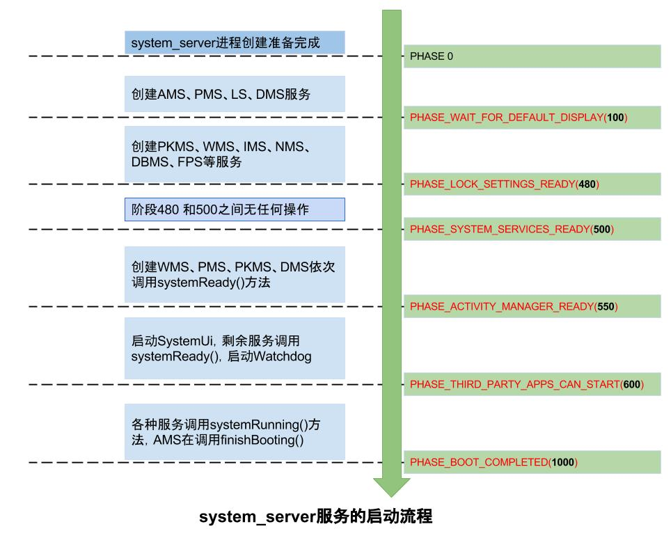

# SystemServer初步了解


---

[跳转到readme](https://github.com/hfreeman2008/android_core_framework/blob/main/README-CN.md)

---

[<font face='黑体' color=#ff0000 size=40 >跳转到文章结尾</font>](#结束语)

---

[返回 P8_系统开发之自定义系统服务](https://github.com/hfreeman2008/android_core_framework/blob/main/P8_%E7%B3%BB%E7%BB%9F%E5%BC%80%E5%8F%91%E4%B9%8B%E8%87%AA%E5%AE%9A%E4%B9%89%E7%B3%BB%E7%BB%9F%E6%9C%8D%E5%8A%A1/%E7%B3%BB%E7%BB%9F%E5%BC%80%E5%8F%91%E4%B9%8B%E8%87%AA%E5%AE%9A%E4%B9%89%E7%B3%BB%E7%BB%9F%E6%9C%8D%E5%8A%A1.md)

---

# SystemServer介绍

frameworks\base\services\java\com\android\server\SystemServer.java

SystemServer类主要是system_server的主入口



---

# 查看Service列表

查看系统服务列表：
```bash
adb shell service list

Found 1 services:
0 phone: [com.android.internal.telephony.ITelephony]
```

检查Service是否存在：
```bash
adb shell service check phone
Service phone: found
```


使用Service：
```bash
adb shell service call phone 2 s16 "10086"
```

---

# 如何获取正在运行的服务列表

如何获取正在运行的服务列表
```bash
// List all services
adb shell dumpsys activity services
```


---

# run()

如果persist.sys.timezone没有设置,那我们设置其为GMT

```java
//
// Default the timezone property to GMT if not set.
//
String timezoneProperty =  SystemProperties.get("persist.sys.timezone");
if (timezoneProperty == null || timezoneProperty.isEmpty()) {
    Slog.w(TAG, "Timezone not set; setting to GMT.");
    SystemProperties.set("persist.sys.timezone", "GMT");
}
```

如果persist.sys.language为空,则读取当地的语言,再设置:

```java
// If the system has "persist.sys.language" and friends set, replace them with
// "persist.sys.locale". Note that the default locale at this point is calculated
// using the "-Duser.locale" command line flag. That flag is usually populated by
// AndroidRuntime using the same set of system properties, but only the system_server
// and system apps are allowed to set them.
//
// NOTE: Most changes made here will need an equivalent change to
// core/jni/AndroidRuntime.cpp
if (!SystemProperties.get("persist.sys.language").isEmpty()) {
    final String languageTag = Locale.getDefault().toLanguageTag();

    SystemProperties.set("persist.sys.locale", languageTag);
    SystemProperties.set("persist.sys.language", "");
    SystemProperties.set("persist.sys.country", "");
    SystemProperties.set("persist.sys.localevar", "");
}
```

导入android_servers库

```java
// Initialize native services.
System.loadLibrary("android_servers");
```

---

# 启动各种服务


```java
startBootstrapServices();
startCoreServices();
startOtherServices();
```

---

## startBootstrapServices-启动开机的引导服务


```java
SystemServerInitThreadPool.get().submit(SystemConfig::getInstance, TAG_SYSTEM_CONFIG);

Installer installer = mSystemServiceManager.startService(Installer.class);

mSystemServiceManager.startService(DeviceIdentifiersPolicyService.class);

mActivityManagerService = mSystemServiceManager.startService(
        ActivityManagerService.Lifecycle.class).getService();
mActivityManagerService.setSystemServiceManager(mSystemServiceManager);
mActivityManagerService.setInstaller(installer);

mPowerManagerService = mSystemServiceManager.startService(PowerManagerService.class);

mActivityManagerService.initPowerManagement();

........
mSystemServiceManager.startService(RecoverySystemService.class);

mSystemServiceManager.startService(LightsService.class);

mDisplayManagerService = mSystemServiceManager.startService(DisplayManagerService.class);


if (RegionalizationEnvironment.isSupported()) {
    Slog.i(TAG, "Regionalization Service");
    RegionalizationService regionalizationService = new RegionalizationService();
    ServiceManager.addService("regionalization", regionalizationService);
}


mPackageManagerService = PackageManagerService.main(mSystemContext, installer,
        mFactoryTestMode != FactoryTest.FACTORY_TEST_OFF, mOnlyCore);
mFirstBoot = mPackageManagerService.isFirstBoot();
mPackageManager = mSystemContext.getPackageManager();


mSystemServiceManager.startService(UserManagerService.LifeCycle.class);


mActivityManagerService.setSystemProcess();

mSystemServiceManager.startService(new OverlayManagerService(mSystemContext, installer));
```


## startCoreServices-启动核心服务


```java
mSystemServiceManager.startService(DropBoxManagerService.class);

mSystemServiceManager.startService(BatteryService.class);

mSystemServiceManager.startService(UsageStatsService.class);
mActivityManagerService.setUsageStatsManager(
        LocalServices.getService(UsageStatsManagerInternal.class));

mWebViewUpdateService = mSystemServiceManager.startService(WebViewUpdateService.class);
```


## startOtherServices-启动其它的服务

搜索:

```java
ServiceManager.addService
mSystemServiceManager.startService
```

就可以知道添加和启动了那些服务
```java
ServiceManager.addService("sec_key_att_app_id_provider",
    new KeyAttestationApplicationIdProviderService(context));
ServiceManager.addService("scheduling_policy", new SchedulingPolicyService());
ServiceManager.addService("telephony.registry", telephonyRegistry);

vibrator = new VibratorService(context);
ServiceManager.addService("vibrator", vibrator);

consumerIr = new ConsumerIrService(context);
ServiceManager.addService(Context.CONSUMER_IR_SERVICE, consumerIr);

ServiceManager.addService(Context.WINDOW_SERVICE, wm);
ServiceManager.addService(Context.INPUT_SERVICE, inputManager);

ServiceManager.addService(Context.ACCESSIBILITY_SERVICE,
    new AccessibilityManagerService(context));

statusBar = new StatusBarManagerService(context, wm);
ServiceManager.addService(Context.STATUS_BAR_SERVICE, statusBar);

networkManagement = NetworkManagementService.create(context);
ServiceManager.addService(Context.NETWORKMANAGEMENT_SERVICE, networkManagement);

networkScore = new NetworkScoreService(context);
ServiceManager.addService(Context.NETWORK_SCORE_SERVICE, networkScore);

networkStats = NetworkStatsService.create(context, networkManagement);
ServiceManager.addService(Context.NETWORK_STATS_SERVICE, networkStats);

networkPolicy = new NetworkPolicyManagerService(context,
    mActivityManagerService, networkStats, networkManagement);
ServiceManager.addService(Context.NETWORK_POLICY_SERVICE, networkPolicy);

ServiceManager.addService("wigigp2p", (IBinder) wigigP2pService);
ServiceManager.addService("wigig", (IBinder) wigigService);

connectivity = new ConnectivityService(
    context, networkManagement, networkStats, networkPolicy);
ServiceManager.addService(Context.CONNECTIVITY_SERVICE, connectivity);

serviceDiscovery = NsdService.create(context);
ServiceManager.addService(Context.NSD_SERVICE, serviceDiscovery);

ServiceManager.addService(Context.UPDATE_LOCK_SERVICE,new UpdateLockService(context));

location = new LocationManagerService(context);
ServiceManager.addService(Context.LOCATION_SERVICE, location);

countryDetector = new CountryDetectorService(context);
ServiceManager.addService(Context.COUNTRY_DETECTOR, countryDetector);

serial = new SerialService(context);
ServiceManager.addService(Context.SERIAL_SERVICE, serial);

hardwarePropertiesService = new HardwarePropertiesManagerService(context);
ServiceManager.addService(Context.HARDWARE_PROPERTIES_SERVICE,hardwarePropertiesService);

ServiceManager.addService("diskstats", new DiskStatsService(context));

networkTimeUpdater = new NetworkTimeUpdateService(context);
ServiceManager.addService("network_time_update_service", networkTimeUpdater);

commonTimeMgmtService = new CommonTimeManagementService(context);
ServiceManager.addService("commontime_management", commonTimeMgmtService);

ServiceManager.addService(GraphicsStatsService.GRAPHICS_STATS_SERVICE,new GraphicsStatsService(context));

ServiceManager.addService(CoverageService.COVERAGE_SERVICE, new CoverageService());

mediaRouter = new MediaRouterService(context);
ServiceManager.addService(Context.MEDIA_ROUTER_SERVICE, mediaRouter);

```

```java
mSystemServiceManager.startService(KeyChainSystemService.class);
mSystemServiceManager.startService(TelecomLoaderService.class);
mSystemServiceManager.startService(ACCOUNT_SERVICE_CLASS);
mSystemServiceManager.startService(CONTENT_SERVICE_CLASS);
mSystemServiceManager.startService(AlarmManagerService.class);
mSystemServiceManager.startService(VrManagerService.class);
mSystemServiceManager.startService(BluetoothService.class);
mSystemServiceManager.startService(IpConnectivityMetrics.class);
mSystemServiceManager.startService(PinnerService.class);
mSystemServiceManager.startService(InputMethodManagerService.Lifecycle.class);
mSystemServiceManager.startService(STORAGE_MANAGER_SERVICE_CLASS);
mSystemServiceManager.startService(STORAGE_STATS_SERVICE_CLASS);
mSystemServiceManager.startService(UiModeManagerService.class);
mSystemServiceManager.startService(LOCK_SETTINGS_SERVICE_CLASS);
mSystemServiceManager.startService(PersistentDataBlockService.class);
mSystemServiceManager.startService(OemLockService.class);
mSystemServiceManager.startService(DeviceIdleController.class);
mSystemServiceManager.startService(DevicePolicyManagerService.Lifecycle.class);
mSystemServiceManager.startService(ClipboardService.class);
mSystemServiceManager.startService(TextServicesManagerService.Lifecycle.class);
mSystemServiceManager.startService(WIFI_SERVICE_CLASS);
mSystemServiceManager.startService("com.android.server.wifi.RttService");
mSystemServiceManager.startService(WIFI_AWARE_SERVICE_CLASS);
mSystemServiceManager.startService(WIFI_P2P_SERVICE_CLASS);
mSystemServiceManager.startService(LOWPAN_SERVICE_CLASS);
mSystemServiceManager.startService(ETHERNET_SERVICE_CLASS);
mSystemServiceManager.startService(NotificationManagerService.class);
mSystemServiceManager.startService(DeviceStorageMonitorService.class);
mSystemServiceManager.startService(SEARCH_MANAGER_SERVICE_CLASS);
mSystemServiceManager.startService(WALLPAPER_SERVICE_CLASS);
mSystemServiceManager.startService(AudioService.Lifecycle.class);
mSystemServiceManager.startService(BroadcastRadioService.class);
mSystemServiceManager.startService(DockObserver.class);
mSystemServiceManager.startService(THERMAL_OBSERVER_CLASS);
mSystemServiceManager.startService(MIDI_SERVICE_CLASS);
mSystemServiceManager.startService(USB_SERVICE_CLASS);
mSystemServiceManager.startService(TwilightService.class);
mSystemServiceManager.startService(NightDisplayService.class);
mSystemServiceManager.startService(JobSchedulerService.class);
mSystemServiceManager.startService(SoundTriggerService.class);
mSystemServiceManager.startService(TrustManagerService.class);
mSystemServiceManager.startService(BACKUP_MANAGER_SERVICE_CLASS);
mSystemServiceManager.startService(APPWIDGET_SERVICE_CLASS);
mSystemServiceManager.startService(VOICE_RECOGNITION_MANAGER_SERVICE_CLASS);
mSystemServiceManager.startService(GestureLauncherService.class);
mSystemServiceManager.startService(SensorNotificationService.class);
mSystemServiceManager.startService(ContextHubSystemService.class);
mSystemServiceManager.startService(TIME_ZONE_RULES_MANAGER_SERVICE_CLASS);
mSystemServiceManager.startService(EmergencyAffordanceService.class);
mSystemServiceManager.startService(DreamManagerService.class);
mSystemServiceManager.startService(PRINT_MANAGER_SERVICE_CLASS);
mSystemServiceManager.startService(COMPANION_DEVICE_MANAGER_SERVICE_CLASS);
mSystemServiceManager.startService(RestrictionsManagerService.class);
mSystemServiceManager.startService(MediaSessionService.class);
mSystemServiceManager.startService(HdmiControlService.class);
mSystemServiceManager.startService(TvInputManagerService.class);
mSystemServiceManager.startService(MediaResourceMonitorService.class);
mSystemServiceManager.startService(TvRemoteService.class);
mSystemServiceManager.startService(FingerprintService.class);
mSystemServiceManager.startService(ShortcutService.Lifecycle.class);
mSystemServiceManager.startService(LauncherAppsService.class);
mSystemServiceManager.startService(MediaProjectionManagerService.class);
mSystemServiceManager.startService(WEAR_CONNECTIVITY_SERVICE_CLASS);
mSystemServiceManager.startService(WEAR_DISPLAY_SERVICE_CLASS);
mSystemServiceManager.startService(WEAR_TIME_SERVICE_CLASS);
mSystemServiceManager.startService(WEAR_LEFTY_SERVICE_CLASS);
mSystemServiceManager.startService(CameraServiceProxy.class);
mmsService=mSystemServiceManager.startService(MmsServiceBroker.class);
mSystemServiceManager.startService(AUTO_FILL_MANAGER_SERVICE_CLASS);
mSystemServiceManager.startService(CarServiceHelperService.class);
```

---

# 添加服务的二种方式

## ServiceManager.addService

```java
ServiceManager.addService("wigig", (IBinder) wigigService);
```

## mSystemServiceManager.startService

```java
mSystemServiceManager.startService(MediaSessionService.class);
```

---

# isFirstBootOrUpgrade-判断是否是第一次启动或升级

```java
private boolean isFirstBootOrUpgrade() {
    return mPackageManagerService.isFirstBoot() 
    || mPackageManagerService.isUpgrade();
}
```

---

# 启动时各个阶段的工作

```java
    /*
     * The earliest boot phase the system send to system services on boot.
     */
    public static final int PHASE_WAIT_FOR_DEFAULT_DISPLAY = 100;

    /**
     * After receiving this boot phase, services can obtain lock settings data.
     */
    public static final int PHASE_LOCK_SETTINGS_READY = 480;

    /**
     * After receiving this boot phase, services can safely call into core system services
     * such as the PowerManager or PackageManager.
     */
    public static final int PHASE_SYSTEM_SERVICES_READY = 500;

    /**
     * After receiving this boot phase, services can safely call into device specific services.
     */
    public static final int PHASE_DEVICE_SPECIFIC_SERVICES_READY = 520;

    /**
     * After receiving this boot phase, services can broadcast Intents.
     */
    public static final int PHASE_ACTIVITY_MANAGER_READY = 550;

    /**
     * After receiving this boot phase, services can start/bind to third party apps.
     * Apps will be able to make Binder calls into services at this point.
     */
    public static final int PHASE_THIRD_PARTY_APPS_CAN_START = 600;

    /**
     * After receiving this boot phase, services can allow user interaction with the device.
     * This phase occurs when boot has completed and the home application has started.
     * System services may prefer to listen to this phase rather than registering a
     * broadcast receiver for {@link android.content.Intent#ACTION_LOCKED_BOOT_COMPLETED}
     * to reduce overall latency.
     */
    public static final int PHASE_BOOT_COMPLETED = 1000;
```


##  Phase0

创建四大引导服务:
```java
ActivityManagerService
PowerManagerService
LightsService
DisplayManagerService
```


## Phase100

进入阶段PHASE_WAIT_FOR_DEFAULT_DISPLAY=100回调服务

onBootPhase(100)

DisplayManagerService

然后创建大量服务下面列举部分:
```java
PackageManagerService
WindowManagerService
InputManagerService
NetworkManagerService
DropBoxManagerService
FingerprintService
LauncherAppsService
```

…

## Phase480
进入阶段PHASE_LOCK_SETTINGS_READY=480回调服务

onBootPhase(480)

```java
DevicePolicyManagerService
```

阶段480后马上就进入阶段500.

## Phase500
PHASE_SYSTEM_SERVICES_READY=500，进入该阶段服务能安全地调用核心系统服务.
onBootPhase(500)
```java
AlarmManagerService
JobSchedulerService
NotificationManagerService
BackupManagerService
UsageStatsService
DeviceIdleController
TrustManagerService
UiModeManagerService

BluetoothService
BluetoothManagerService
EthernetService
WifiP2pService
WifiScanningService
WifiService
RttService
```

各大服务执行systemReady():
```java
WindowManagerService.systemReady():
PowerManagerService.systemReady():
PackageManagerService.systemReady():
DisplayManagerService.systemReady():
```

接下来就绪AMS.systemReady方法.

## Phase550
PHASE_ACTIVITY_MANAGER_READY=550， AMS.mSystemReady=true, 已准备就绪,进入该阶段服务能广播Intent;但是system_server主线程并没有就绪.

onBootPhase(550)
```java
MountService
TelecomLoaderService
UsbService
WebViewUpdateService
DockObserver
BatteryService
```

接下来执行: (AMS启动native crash监控, 加载WebView，启动SystemUi等),如下
```java
mActivityManagerService.startObservingNativeCrashes();
WebViewFactory.prepareWebViewInSystemServer();
startSystemUi(context);

networkScoreF.systemReady();
networkManagementF.systemReady();
networkStatsF.systemReady();
networkPolicyF.systemReady();
connectivityF.systemReady();
audioServiceF.systemReady();
Watchdog.getInstance().start();
```


## Phase600
PHASE_THIRD_PARTY_APPS_CAN_START=600

onBootPhase(600)
```java
JobSchedulerService
NotificationManagerService
BackupManagerService
AppWidgetService
GestureLauncherService
DreamManagerService
TrustManagerService
VoiceInteractionManagerService
```

接下来,各种服务的systemRunning过程:
```java
WallpaperManagerService、InputMethodManagerService、LocationManagerService、CountryDetectorService、NetworkTimeUpdateService、CommonTimeManagementService、TextServicesManagerService、AssetAtlasService、InputManagerService、TelephonyRegistry、MediaRouterService、MmsServiceBroker
```
这些服务依次执行其systemRunning()方法。

## Phase1000
在经过一系列流程，再调用AMS.finishBooting()时，则进入阶段Phase1000。

到此，系统服务启动阶段完成就绪，system_server进程启动完成则进入Looper.loop()状态，随时待命，等待消息队列MessageQueue中的消息到来，则马上进入执行状态。

---

```java

```

```java

```


```java

```


```java

```


```bash

```


---

```bash

```

```bash

```

---


# 结束语


---


[<font face='黑体' color=#ff0000 size=40 >跳转到文章开始</font>](#systemserver初步了解)

---

[返回 P8_系统开发之自定义系统服务](https://github.com/hfreeman2008/android_core_framework/blob/main/P8_%E7%B3%BB%E7%BB%9F%E5%BC%80%E5%8F%91%E4%B9%8B%E8%87%AA%E5%AE%9A%E4%B9%89%E7%B3%BB%E7%BB%9F%E6%9C%8D%E5%8A%A1/%E7%B3%BB%E7%BB%9F%E5%BC%80%E5%8F%91%E4%B9%8B%E8%87%AA%E5%AE%9A%E4%B9%89%E7%B3%BB%E7%BB%9F%E6%9C%8D%E5%8A%A1.md)


---


