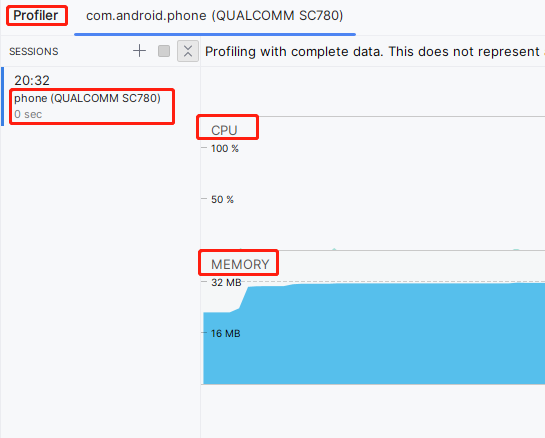
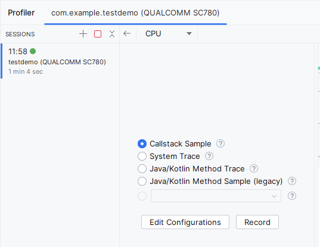
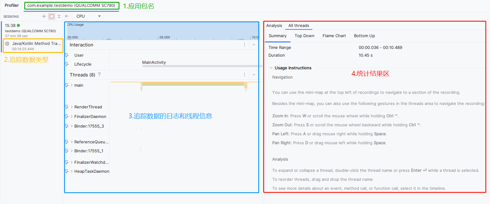
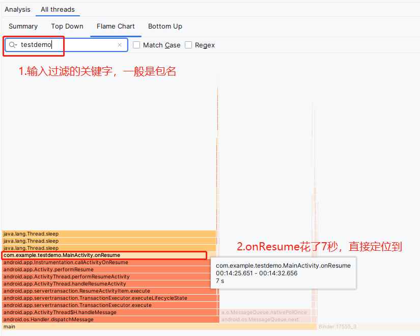
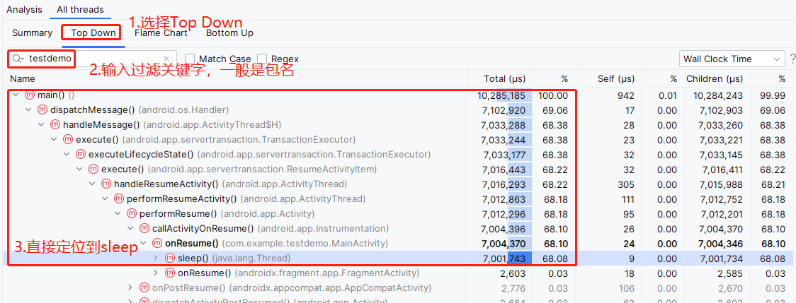
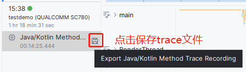
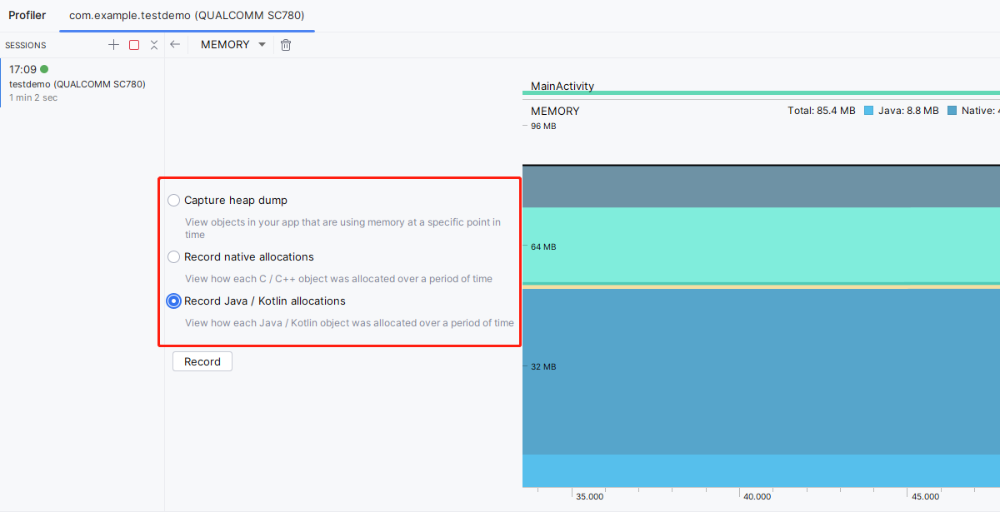
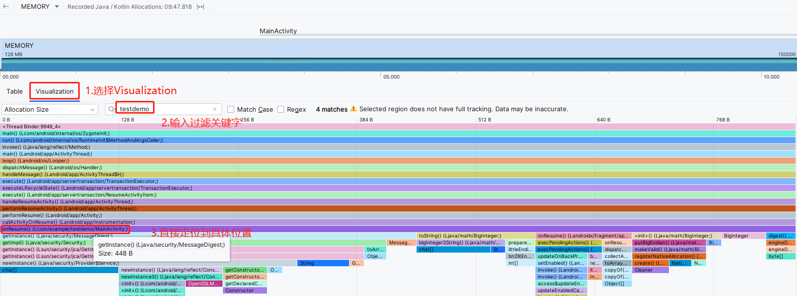

# 专题七: 系统分析的屠龙刀之Profile

Android Profile是性能分析工具traceview的升级版本，功能更强大，使用更方便，成为了系统开发的另一把屠龙刀。


---

# Android Profile主要作用
- Cpu 问题分析
- Memory问题分析

Profile主要是针对某个特定应用，监视Cpu和Memory 二个关键指标：



如上图，我们可以知道，这是一个针对应用com.android.phone，监视Cpu和Memory的一个图。


---

# CPU

我们选择某个特定应用，点击CPU，就会看到cpu监视有四个选择：




- Callstack Sample Recording

Sample Java/Kotlin and native code using simpleperf
可以看出主要追踪的是java/kotlin 和 native 代码


- System Trace Recording

Traces Java/Kotlin and native code at the Android platform level
可以看出，这个是从系统平台角度来追踪java/kotlin 和 native 代码，内容更多更全面
所以在追踪分析系统cpu时，推荐使用

- Java/Kotlin Method Trace Recording

Instruments Java/Kotlin code using Android Runtime,tracking every method call(this incurs high overhead making timing infomation inaccurate).
可以看出，这个更偏重是追踪Java/Kotlin代码，会追踪每个回调的方法，所以会导致高昂的开销，并有统计时间不准确的问题。
所以在app层应用，短时间的追踪cpu时，推荐使用

- Java/Kotlin Method Trace Recording(legacy)

Sample Java/Kotlin code using Android Runtime。
这个是以前的过时工具

---

## 一个样例

### 在app中添加一个耗时操作

在一个Activity中的onResume()接口中，我们添加一个sleep 7秒的模拟耗时操作

```java
protected void onResume() {
    super.onResume();

    try {
        Thread.sleep(7000);
    } catch (InterruptedException e) {
        throw new RuntimeException(e);
    }
}
```

---


### 抓取统计数据

在activity界面息屏后，选择Java/Kotlin Method Trace，点击Record开始抓取统计数据，再点亮屏幕，等待activity界面完全显示后，点击stop。

会自动生成统计结果：



---

### 分析数据

- Flame Chart(这个方式是图形显示调用时长，非常直观)

(1)选择Flame Chart,这个就是大名鼎鼎的火焰图；

(2)在过滤框中输入过滤关键字，一般是应用包名；

(3)从下到上查看相关的接口，就可以非常清楚的看到MainActivity.onResume方法耗时长，双击可以直接跳转到接口处。一看就能定位到sleep的耗时操作。





- Top Down(这个方式是调用路径，非常直观)

(1)选择Top Down；

(2)在过滤框中输入过滤关键字，一般是应用包名；

(3)从下到上查看调用接口占用cpu的时间百分百，可以非常清楚的定位MainActivity.onResume方法中的sleep的耗时操作。




---

### trace数据保存

trace日志，还可以保存成trace格式的文件，方便下次分析。




---

# Memory

Memory同Cpu类似，有三种内存数据类型

- Capture heap dump

记录app的view 对象内存信息；

- Record native allocations

记录本地的c,c++ 对象内存信息；

- Record Java/Kotlin allocations

记录java/kotlin的对象内存信息；





---

## 一个样例

### 在app中添加一个占用大量内存的操作

在一个Activity中的onResume()接口中，我们添加一个的模拟占用大量内存操作：

```java
protected void onResume() {
    super.onResume();
    MessageDigest md = null;
    try {
        md = MessageDigest.getInstance("MD5");
    } catch (NoSuchAlgorithmException e) {
        throw new RuntimeException(e);
    }
    new BigInteger(1, md.digest()).toString(16);
}
```

---

### 抓取统计数据

在activity界面息屏后，选择Record Java/Kotlin allocations，点击Record开始抓取统计数据，再点亮屏,会自动生成统计结果。


---

### 分析数据

(1)选择Visualization

(2)输入过滤关键字，一般是应用包名

(3)通过图形化的占用内存大小，直接定位到具体的位置




---


# 资料

[android核心技术之性能分析工具Memory Monitor](https://blog.csdn.net/hfreeman2008/article/details/53557655)

https://blog.csdn.net/hfreeman2008/article/details/53557655


---

# 结束语


