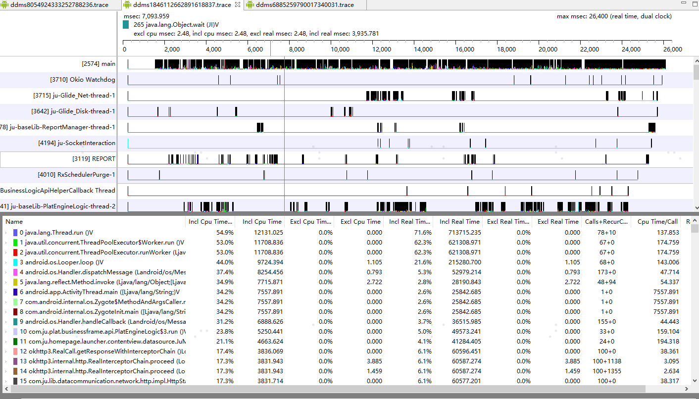

# 专题六: 系统分析的屠龙刀之traceview

TraceView是Android平台配备一个很好的性能分析工具，它可以通过图形化的方式让我们了解我们要跟踪的程序的性能，并且能具体到特定的方法，成为了系统开发的另一把屠龙刀。
traceview我主要是用来定位应用短时间的卡，耗时操作。


# 如何使用
通过Android studio自带的traceview查看（Android profiler）

通过Android SDK自带的Debug

通过DDMS中的traceview查看

 
# 抓取traceview日志
我这以DDMS中的traceview为例，说明如何抓取traceview日志。
(1)双击自己sdk的monitor.bat
....AppData\Local\Android\Sdk\tools\monitor.bat
 
(2)选择自己需要分析问题的应用（如com.kookong.tvplus），点击下图标红的图标1(start method profiling)


点击ok，开始抓取traceview日志


 

再点击上面标红的图标1，停止抓取traceview日志。


生成traceview的结果图：




此traceview日志保存的位置一般为：

```java
C:\Users\****\AppData\Local\Temp
```


# 打开traceview

我们可以直接打开traceview文件，打开方式为File–Open File：


# 分析traceview
我们重点关注二个hotspot:

- 第一个是调用时间特别长的接口
- 第二种是调用次数特别多的接口

对于第一个是调用时间特别长的接口，我们是以Cpu Time/Call来区分。

我们一般点击这列数据，可以将这个统计数据按倒序排列，也就按方法耗时时间从大到小排列，再过滤我们自己的应用的关键字，定位到耗时方法。

对于第二个是调用次数特别多的接口，我们是以Calls+RecurCalls/Total来区分。
我们一般点击这列数据，可以将这个统计数据按倒序排列，也就按方法的调用次数从大到小排列，再过滤我们自己的应用的关键字，定位到调用次数多的方法。

 
我自己一般的操作是将上面二列拖到最左边，如下图：


 
这个图，我们可以看到:
耗时方法名--2是AppWidgetManager$1.onSuccess，占用CPU时间为291ms，调用了1次。

其父调用方法为父调用方法--1，

子被调用方法为子被调用方法--3.

也就是说这个方法的调用顺序为：
父调用方法–1   ========》 耗时方法名–2  ========》 子被调用方法–3


非常的清晰明了。


# 应用例子

[记一次TextView跑马灯效果导致系统卡的惨案](https://xiaozhuanlan.com/topic/7304691258)


# 参考资料
1.android核心技术之性能分析工具TraceView

https://blog.csdn.net/hfreeman2008/article/details/53509489


