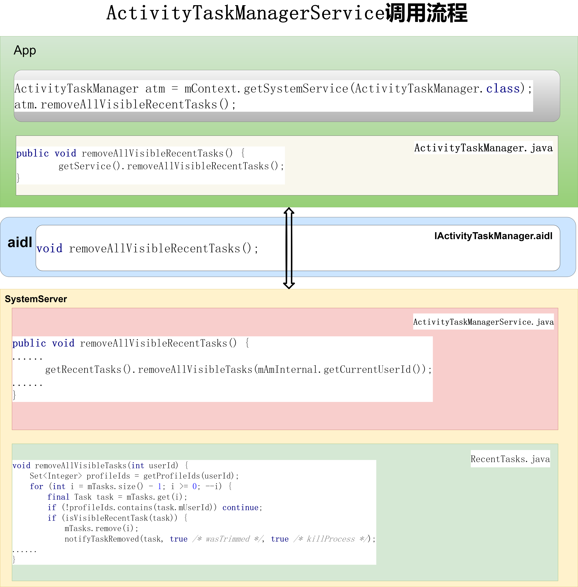
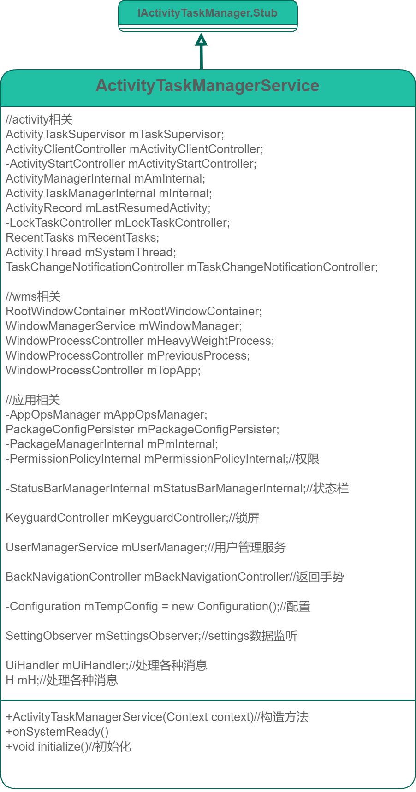
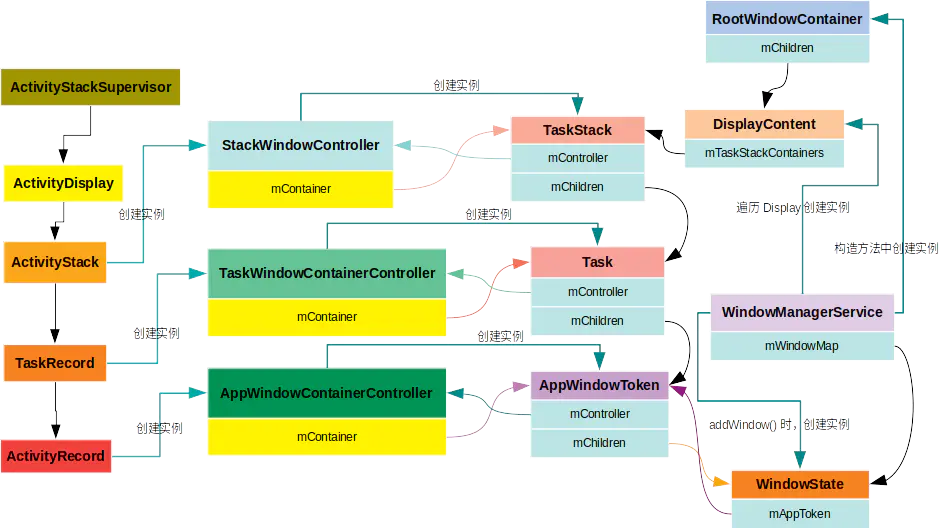
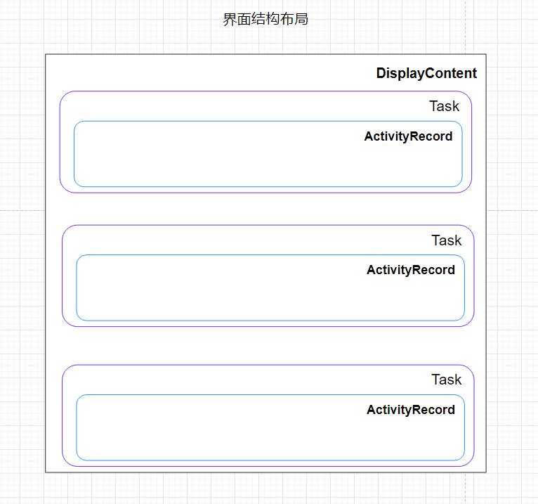
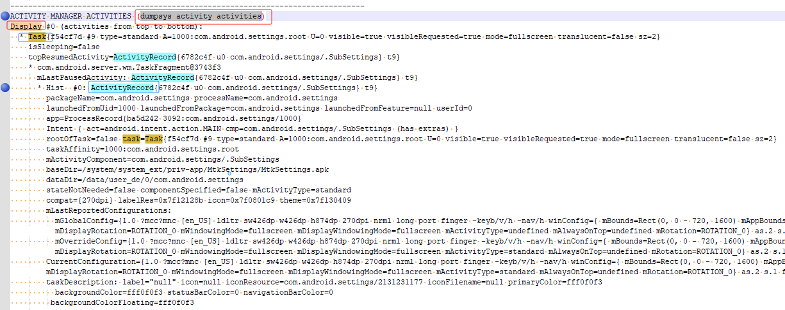
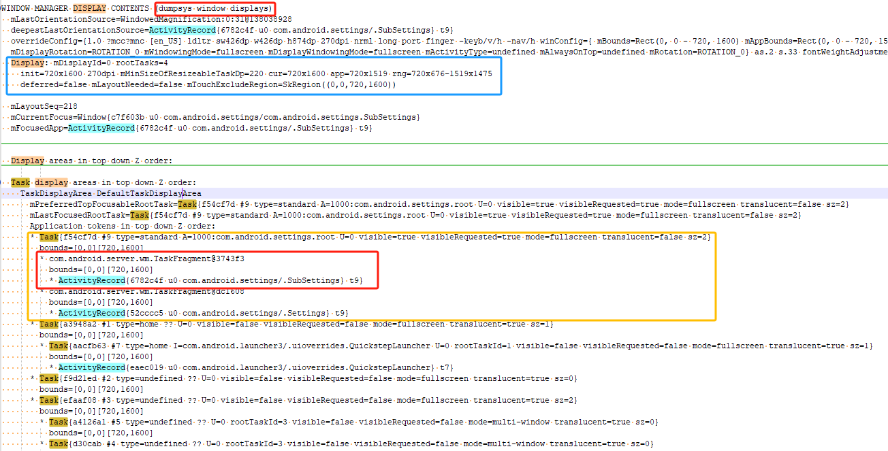
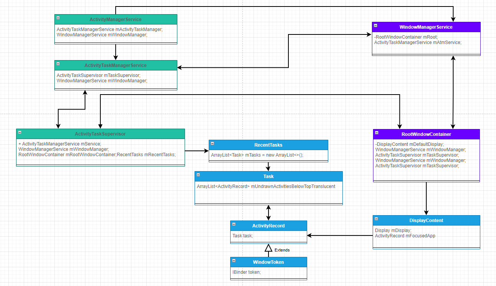

# 专题十三_系统开发之浅谈ActivityTaskManagerService


---
# ActivityTaskManagerService 类的作用：
ActivityTaskManagerService 类的作用就是管理activity，和activity的容器（task,stack,displays）

```java
/**
 * System service for managing activities and their containers (task, displays,... ).
 *
 * {@hide}
 */
```
---

# 获取atms的方式：


```java
方式1
ActivityTaskManager mActivityTaskManager;
mActivityTaskManager = mContext.getSystemService(ActivityTaskManager.class);

方式2
IActivityTaskManager mActivityTaskManager;
mActivityTaskManager = ActivityTaskManager.getService();

方式3
IBinder b = ServiceManager.getService(Context.ACTIVITY_TASK_SERVICE);
IActivityTaskManager mActivityTaskManager = IActivityTaskManager.Stub.asInterface(b);


方式4(system server进程使用)
ActivityTaskManagerInternal mActivityTaskManagerService;
mActivityTaskManagerService = LocalServices.getService(ActivityTaskManagerInternal.class);
```

---

# ActivityTaskManagerService调用流程



图一 ActivityTaskManagerService调用流程

参考图一 ActivityTaskManagerService调用流程，我们以removeAllVisibleRecentTasks()接口为例，看一下其调用流程

(1)在app应用中调用ActivityTaskManagerService.removeAllVisibleRecentTasks()接口：
```java
ActivityTaskManager atm = mContext.getSystemService(ActivityTaskManager.class);
atm.removeAllVisibleRecentTasks();
```

(2)其对应ActivityTaskManager.removeAllVisibleRecentTasks：

```java
public void removeAllVisibleRecentTasks() {
        getService().removeAllVisibleRecentTasks();
}

public static IActivityTaskManager getService() {
    return IActivityTaskManagerSingleton.get();
}

private static final Singleton<IActivityTaskManager> IActivityTaskManagerSingleton =
        new Singleton<IActivityTaskManager>() {
            @Override
            protected IActivityTaskManager create() {
                //其对应ActivityTaskManagerService服务
                final IBinder b = ServiceManager.getService(Context.ACTIVITY_TASK_SERVICE);
                return IActivityTaskManager.Stub.asInterface(b);
            }
        };
```

(3)其对应IActivityTaskManager.aidl中定义接口：

```java
void removeAllVisibleRecentTasks();
```

(4)ActivityTaskManagerService服务中removeAllVisibleRecentTasks：

```java
public void removeAllVisibleRecentTasks() {
    mAmInternal.enforceCallingPermission(REMOVE_TASKS, "removeAllVisibleRecentTasks()");
    synchronized (mGlobalLock) {
        final long ident = Binder.clearCallingIdentity();
        try {
            getRecentTasks().removeAllVisibleTasks(mAmInternal.getCurrentUserId());
        } finally {
            Binder.restoreCallingIdentity(ident);
        }
    }
}

RecentTasks getRecentTasks() {
    return mRecentTasks;
}
```
(5)进一步查看RecentTasks类中的removeAllVisibleTasks：

```java
void removeAllVisibleTasks(int userId) {
    Set<Integer> profileIds = getProfileIds(userId);
    for (int i = mTasks.size() - 1; i >= 0; --i) {
        final Task task = mTasks.get(i);
        if (!profileIds.contains(task.mUserId)) continue;
        if (isVisibleRecentTask(task)) {
            mTasks.remove(i);
            notifyTaskRemoved(task, true /* wasTrimmed */, true /* killProcess */);
        }
    }
}
```
(6)在SystemServer.startBootstrapServices启动ActivityTaskManagerService服务：

```java
// Activity manager runs the show.
t.traceBegin("StartActivityManager");
// TODO: Might need to move after migration to WM.
ActivityTaskManagerService atm = mSystemServiceManager.startService(
        ActivityTaskManagerService.Lifecycle.class).getService();
mActivityManagerService = ActivityManagerService.Lifecycle.startService(
        mSystemServiceManager, atm);
mActivityManagerService.setSystemServiceManager(mSystemServiceManager);
mActivityManagerService.setInstaller(installer);
mWindowManagerGlobalLock = atm.getGlobalLock();
t.traceEnd();
```

(7)注册ActivityTaskManagerService服务：

SystemServiceRegistry.java

```java
registerService(Context.ACTIVITY_TASK_SERVICE, ActivityTaskManager.class,
    new CachedServiceFetcher<ActivityTaskManager>() {
@Override
public ActivityTaskManager createService(ContextImpl ctx) {
    return new ActivityTaskManager(
            ctx.getOuterContext(), ctx.mMainThread.getHandler());
}});
```
---

# ActivityTaskManagerService类图



图二 ActivityTaskManagerService类图


图二，我们可以看到ActivityTaskManagerService主要是管理activity,activity 容器，wms，应用管理，状态栏，锁屏，返回手势，用户管理等。

---
# activity和各个contain的关系




这部分参考：

[android开发浅谈之ActivityDisplay/ActivityStack/TaskRecord/ActivityRecord](https://blog.csdn.net/hfreeman2008/article/details/113309272)

https://blog.csdn.net/hfreeman2008/article/details/113309272

[android开发浅谈之WindowToken,AppWindowToken,Task,TaskStack和DisplayContent](https://blog.csdn.net/hfreeman2008/article/details/113589077)

https://blog.csdn.net/hfreeman2008/article/details/113589077


此部分是以前的关系图，android最新的版本是已经调整了，后面需要同步更新此部分数据。

---
# android 13 ams和wms的关系

## 1. 界面结构布局



---

## 2.dump信息

```java
dumpsys activity activities
```



```java
dumpsys window displays
```



---

## 3.ams和wms关联的类图


---

## 4.ActivityRecord创建流程：

```java
com.android.server.wm.ActivityRecord.<init>(ActivityRecord.java:1943)
com.android.server.wm.ActivityRecord$Builder.build(ActivityRecord.java:9914)
com.android.server.wm.ActivityStarter.executeRequest(ActivityStarter.java:1193)
com.android.server.wm.ActivityStarter.execute(ActivityStarter.java:702)
com.android.server.wm.ActivityTaskManagerService.startActivityAsUser(ActivityTaskManagerService.java:1294)
com.android.server.wm.ActivityTaskManagerService.startActivityAsUser(ActivityTaskManagerService.java:1213)
com.android.server.wm.ActivityTaskManagerService.startActivity(ActivityTaskManagerService.java:1188)
android.app.IActivityTaskManager$Stub.onTransact(IActivityTaskManager.java:893)
com.android.server.wm.ActivityTaskManagerService.onTransact(ActivityTaskManagerService.java:5241)
android.os.Binder.execTransactInternal(Binder.java:1280)
android.os.Binder.execTransact(Binder.java:1244)
```

ActivityTaskManagerService.startActivity

```java
public final int startActivity(IApplicationThread caller, String callingPackage,
        String callingFeatureId, Intent intent, String resolvedType, IBinder resultTo,
        String resultWho, int requestCode, int startFlags, ProfilerInfo profilerInfo,
        Bundle bOptions) {
    return startActivityAsUser(caller, callingPackage, callingFeatureId, intent, resolvedType,
            resultTo, resultWho, requestCode, startFlags, profilerInfo, bOptions,
            UserHandle.getCallingUserId());
}
```
ActivityTaskManagerService.startActivityAsUser

```java
@Override
public int startActivityAsUser(IApplicationThread caller, String callingPackage,
        String callingFeatureId, Intent intent, String resolvedType, IBinder resultTo,
        String resultWho, int requestCode, int startFlags, ProfilerInfo profilerInfo,
        Bundle bOptions, int userId) {
    return startActivityAsUser(caller, callingPackage, callingFeatureId, intent, resolvedType,
            resultTo, resultWho, requestCode, startFlags, profilerInfo, bOptions, userId,
            true /*validateIncomingUser*/);
}
```

ActivityTaskManagerService.startActivityAsUser

```java
private int startActivityAsUser(IApplicationThread caller, String callingPackage,
        @Nullable String callingFeatureId, Intent intent, String resolvedType,
        IBinder resultTo, String resultWho, int requestCode, int startFlags,
        ProfilerInfo profilerInfo, Bundle bOptions, int userId, boolean validateIncomingUser) {
......
// TODO: Switch to user app stacks here.
return getActivityStartController().obtainStarter(intent, "startActivityAsUser")
        .setCaller(caller)
        .setCallingPackage(callingPackage)
        .setCallingFeatureId(callingFeatureId)
        .setResolvedType(resolvedType)
        .setResultTo(resultTo)
        .setResultWho(resultWho)
        .setRequestCode(requestCode)
        .setStartFlags(startFlags)
        .setProfilerInfo(profilerInfo)
        .setActivityOptions(bOptions)
        .setUserId(userId)
        .execute();
}
```

ActivityStarter.execute
```java
int execute() {
    .....
    res = executeRequest(mRequest);
}

private int executeRequest(Request request) {
    ......    
    final ActivityRecord r = new ActivityRecord.Builder(mService)
        .setCaller(callerApp)
        .setLaunchedFromPid(callingPid)
        .setLaunchedFromUid(callingUid)
        .setLaunchedFromPackage(callingPackage)
        .setLaunchedFromFeature(callingFeatureId)
        .setIntent(intent)
        .setResolvedType(resolvedType)
        .setActivityInfo(aInfo)
        .setConfiguration(mService.getGlobalConfiguration())
        .setResultTo(resultRecord)
        .setResultWho(resultWho)
        .setRequestCode(requestCode)
        .setComponentSpecified(request.componentSpecified)
        .setRootVoiceInteraction(voiceSession != null)
        .setActivityOptions(checkedOptions)
        .setSourceRecord(sourceRecord)
        .build();
}
```

ActivityRecord$Builder.build

```java
static class Builder {
    .....
    ActivityRecord build() {
        if (mConfiguration == null) {
            mConfiguration = mAtmService.getConfiguration();
        }
        return new ActivityRecord(mAtmService, mCallerApp, mLaunchedFromPid,
                mLaunchedFromUid, mLaunchedFromPackage, mLaunchedFromFeature, mIntent,
                mResolvedType, mActivityInfo, mConfiguration, mResultTo, mResultWho,
                mRequestCode, mComponentSpecified, mRootVoiceInteraction,
                mAtmService.mTaskSupervisor, mOptions, mSourceRecord, mPersistentState,
                mTaskDescription, mCreateTime);
    }
}
```
---

## 5.Task创建流程

```java
com.android.server.wm.Task.<init>(Task.java:630)
com.android.server.wm.Task$Builder.buildInner(Task.java:6638)
com.android.server.wm.Task$Builder.build(Task.java:6609)
com.android.server.wm.TaskDisplayArea.getOrCreateRootTask(TaskDisplayArea.java:1005)
com.android.server.wm.TaskDisplayArea.getOrCreateRootTask(TaskDisplayArea.java:1030)
com.android.server.wm.RootWindowContainer.getOrCreateRootTask(RootWindowContainer.java:2842)
com.android.server.wm.ActivityStarter.getOrCreateRootTask(ActivityStarter.java:3018)
com.android.server.wm.ActivityStarter.startActivityInner(ActivityStarter.java:1858)
com.android.server.wm.ActivityStarter.startActivityUnchecked(ActivityStarter.java:1661)
com.android.server.wm.ActivityStarter.executeRequest(ActivityStarter.java:1216)
com.android.server.wm.ActivityStarter.execute(ActivityStarter.java:702)
com.android.server.wm.ActivityTaskManagerService.startActivityAsUser(ActivityTaskManagerService.java:1294)
com.android.server.wm.ActivityTaskManagerService.startActivityAsUser(ActivityTaskManagerService.java:1213)
com.android.server.wm.ActivityTaskManagerService.startActivity(ActivityTaskManagerService.java:1188)
android.app.IActivityTaskManager$Stub.onTransact(IActivityTaskManager.java:893)
com.android.server.wm.ActivityTaskManagerService.onTransact(ActivityTaskManagerService.java:5241)
android.os.Binder.execTransactInternal(Binder.java:1280)
android.os.Binder.execTransact(Binder.java:1244)
```

前面的同ActivityRecord创建流程：
ActivityStarter.executeRequest

```java
private int executeRequest(Request request) {
    .....
    mLastStartActivityResult = startActivityUnchecked(r, sourceRecord, voiceSession,
        request.voiceInteractor, startFlags, true /* doResume */, checkedOptions,
        inTask, inTaskFragment, restrictedBgActivity, intentGrants);
}
```

ActivityStarter.startActivityUnchecked
```java
private int startActivityUnchecked(final ActivityRecord r, ActivityRecord sourceRecord,
        IVoiceInteractionSession voiceSession, IVoiceInteractor voiceInteractor,
        int startFlags, boolean doResume, ActivityOptions options, Task inTask,
        TaskFragment inTaskFragment, boolean restrictedBgActivity,
        NeededUriGrants intentGrants) {
    ......
    result = startActivityInner(r, sourceRecord, voiceSession, voiceInteractor,
        startFlags, doResume, options, inTask, inTaskFragment, restrictedBgActivity,
        intentGrants);
}
```

ActivityStarter.startActivityInner
```java
int startActivityInner(final ActivityRecord r, ActivityRecord sourceRecord,
        IVoiceInteractionSession voiceSession, IVoiceInteractor voiceInteractor,
        int startFlags, boolean doResume, ActivityOptions options, Task inTask,
        TaskFragment inTaskFragment, boolean restrictedBgActivity,
        NeededUriGrants intentGrants) {
      .....
    if (mTargetRootTask == null) {
        mTargetRootTask = getOrCreateRootTask(mStartActivity, mLaunchFlags, targetTask,
            mOptions);
    }      
}
```
ActivityStarter.getOrCreateRootTask

```java
private Task getOrCreateRootTask(ActivityRecord r, int launchFlags, Task task,
        ActivityOptions aOptions) {
    final boolean onTop =
            (aOptions == null || !aOptions.getAvoidMoveToFront()) && !mLaunchTaskBehind;
    final Task sourceTask = mSourceRecord != null ? mSourceRecord.getTask() : null;
    //调用mRootWindowContainer.getOrCreateRootTask
    return mRootWindowContainer.getOrCreateRootTask(r, aOptions, task, sourceTask, onTop,
            mLaunchParams, launchFlags);
}
```

RootWindowContainer.getOrCreateRootTask
```java
Task getOrCreateRootTask(@Nullable ActivityRecord r,
        @Nullable ActivityOptions options, @Nullable Task candidateTask,
        @Nullable Task sourceTask, boolean onTop,
        @Nullable LaunchParamsController.LaunchParams launchParams, int launchFlags) {
    ......
    if (taskDisplayArea != null) {
        if (canLaunchOnDisplay(r, taskDisplayArea.getDisplayId())) {
            //调用 taskDisplayArea.getOrCreateRootTask
            return taskDisplayArea.getOrCreateRootTask(r, options, candidateTask,
                    sourceTask, launchParams, launchFlags, activityType, onTop);
        } else {
            taskDisplayArea = null;
        }
    }
}
```

TaskDisplayArea.getOrCreateRootTask
```java
Task getOrCreateRootTask(@Nullable ActivityRecord r, @Nullable ActivityOptions options,
        @Nullable Task candidateTask, @Nullable Task sourceTask,
        @Nullable LaunchParams launchParams, int launchFlags, int activityType, boolean onTop) {
     .....
    return getOrCreateRootTask(windowingMode, activityType, onTop, candidateTask, sourceTask,
            options, launchFlags);
}

Task getOrCreateRootTask(int windowingMode, int activityType, boolean onTop,
        @Nullable Task candidateTask, @Nullable Task sourceTask,
        @Nullable ActivityOptions options, int launchFlags) {
    .....
    if (!alwaysCreateRootTask(resolvedWindowingMode, activityType)) {
        Task rootTask = getRootTask(resolvedWindowingMode, activityType);
        if (rootTask != null) {
            //返回已经有的Task
            return rootTask;
        }
    .....
    //新建Task
    return new Task.Builder(mAtmService)
        .setWindowingMode(windowingMode)
        .setActivityType(activityType)
        .setOnTop(onTop)
        .setParent(this)
        .setSourceTask(sourceTask)
        .setActivityOptions(options)
        .setLaunchFlags(launchFlags)
        .build();
}
```


Task$Builder.build
```java
Task build() {
    .....
    Task task = buildInner();
 }
    
```
Task$Builder.buildInner

```java
Task buildInner() {
    return new Task(mAtmService, mTaskId, mIntent, mAffinityIntent, mAffinity,
            mRootAffinity, mRealActivity, mOrigActivity, mRootWasReset, mAutoRemoveRecents,
            mAskedCompatMode, mUserId, mEffectiveUid, mLastDescription, mLastTimeMoved,
            mNeverRelinquishIdentity, mLastTaskDescription, mLastSnapshotData,
            mTaskAffiliation, mPrevAffiliateTaskId, mNextAffiliateTaskId, mCallingUid,
            mCallingPackage, mCallingFeatureId, mResizeMode, mSupportsPictureInPicture,
            mRealActivitySuspended, mUserSetupComplete, mMinWidth, mMinHeight,
            mActivityInfo, mVoiceSession, mVoiceInteractor, mCreatedByOrganizer,
            mLaunchCookie, mDeferTaskAppear, mRemoveWithTaskOrganizer);
}
```

---

# handler

(1)H和对应的消息：

```java
final class H extends Handler {
    static final int REPORT_TIME_TRACKER_MSG = 1;
    static final int UPDATE_PROCESS_ANIMATING_STATE = 2;
    static final int END_POWER_MODE_UNKNOWN_VISIBILITY_MSG = 3;
    static final int RESUME_FG_APP_SWITCH_MSG = 4;
    static final int FIRST_ACTIVITY_TASK_MSG = 100;
    static final int FIRST_SUPERVISOR_TASK_MSG = 200;
.....
}
```

(2)UiHandler及其对应的消息：
```java
final class UiHandler extends Handler {
    static final int DISMISS_DIALOG_UI_MSG = 1;
    ......    
}
```
---

# dump信息

dumpLastANRLocked

```java
adb shell dumpsys activity lastanr
```

dumpLastANRTracesLocked
```java
adb shell dumpsys activity lastanr-traces
```

dumpActivitiesLocked
```java
adb shell dumpsys activity activities
```

dumpActivityContainersLocked
```java
adb shell dumpsys activity containers
```

dumpActivityStarterLocked
```java
adb shell dumpsys activity starter
```


```java
public static final String DUMP_ACTIVITIES_CMD = "activities";
public static final String DUMP_ACTIVITIES_SHORT_CMD = "a";
public static final String DUMP_LASTANR_CMD = "lastanr";
public static final String DUMP_LASTANR_TRACES_CMD = "lastanr-traces";
public static final String DUMP_STARTER_CMD = "starter";
public static final String DUMP_CONTAINERS_CMD = "containers";
public static final String DUMP_RECENTS_CMD = "recents";
public static final String DUMP_RECENTS_SHORT_CMD = "r";
public static final String DUMP_TOP_RESUMED_ACTIVITY = "top-resumed";
```

---

# 日志开关：

frameworks/base/services/core/java/com/android/server/wm/ActivityTaskManagerDebugConfig.java

```java
static final boolean TAG_WITH_CLASS_NAME = false;
public static boolean APPEND_CATEGORY_NAME = false;
static final String TAG_ATM = "ActivityTaskManager";
// Enable all debug log categories.
public static boolean DEBUG_ALL = false;

// Enable all debug log categories for activities.
public static boolean DEBUG_ALL_ACTIVITIES = DEBUG_ALL || false;

public static boolean DEBUG_RECENTS = DEBUG_ALL || false;
public static boolean DEBUG_RECENTS_TRIM_TASKS = DEBUG_RECENTS || false;
public static boolean DEBUG_ROOT_TASK = DEBUG_ALL || false;
public static boolean DEBUG_SWITCH = DEBUG_ALL || false;
public static boolean DEBUG_TRANSITION = DEBUG_ALL || false;
public static boolean DEBUG_VISIBILITY = DEBUG_ALL || false;
public static boolean DEBUG_APP = DEBUG_ALL_ACTIVITIES || false;
public static boolean DEBUG_IDLE = DEBUG_ALL_ACTIVITIES || false;
public static boolean DEBUG_RELEASE = DEBUG_ALL_ACTIVITIES || false;
public static boolean DEBUG_USER_LEAVING = DEBUG_ALL || false;
public static boolean DEBUG_PERMISSIONS_REVIEW = DEBUG_ALL || false;
public static boolean DEBUG_RESULTS = DEBUG_ALL || false;
public static boolean DEBUG_ACTIVITY_STARTS = DEBUG_ALL || false;
public static boolean DEBUG_CLEANUP = DEBUG_ALL || false;
public static boolean DEBUG_METRICS = DEBUG_ALL || false;

```
frameworks/base/services/core/java/com/android/server/am/ActivityManagerDebugConfig.java
```java
public static boolean APPEND_CATEGORY_NAME = false;

// Default log tag for the activity manager package.
static final String TAG_AM = "ActivityManager";

// Enable all debug log categories.
public static boolean DEBUG_ALL = false;

// Available log categories in the activity manager package.
public static boolean DEBUG_ANR = false;
public static boolean DEBUG_BACKGROUND_CHECK = DEBUG_ALL || false;
public static boolean DEBUG_BACKUP = DEBUG_ALL || false;
public static boolean DEBUG_BROADCAST = DEBUG_ALL || false;
public static boolean DEBUG_BROADCAST_BACKGROUND = DEBUG_BROADCAST || false;
public static boolean DEBUG_BROADCAST_LIGHT = DEBUG_BROADCAST || false;
public static boolean DEBUG_BROADCAST_DEFERRAL = DEBUG_BROADCAST || false;
public static boolean DEBUG_COMPACTION = DEBUG_ALL || false;
public static boolean DEBUG_FREEZER = DEBUG_ALL || false;
public static boolean DEBUG_LRU = DEBUG_ALL || false;
public static boolean DEBUG_MU = DEBUG_ALL || false;
public static boolean DEBUG_NETWORK = DEBUG_ALL || false;
public static boolean DEBUG_OOM_ADJ = DEBUG_ALL || false;
public static boolean DEBUG_OOM_ADJ_REASON = DEBUG_ALL || false;
public static boolean DEBUG_POWER = DEBUG_ALL || false;
public static boolean DEBUG_POWER_QUICK = DEBUG_POWER || false;
public static boolean DEBUG_PROCESS_OBSERVERS = DEBUG_ALL || false;
public static boolean DEBUG_PROCESSES = DEBUG_ALL || false;
public static boolean DEBUG_PROVIDER = DEBUG_ALL || false;
public static boolean DEBUG_PSS = DEBUG_ALL || false;
public static boolean DEBUG_SERVICE = DEBUG_ALL || false;
public static boolean DEBUG_FOREGROUND_SERVICE = DEBUG_ALL || false;
public static boolean DEBUG_SERVICE_EXECUTING = DEBUG_ALL || false;
public static boolean DEBUG_UID_OBSERVERS = DEBUG_ALL || false;
public static boolean DEBUG_USAGE_STATS = DEBUG_ALL || false;
public static boolean DEBUG_PERMISSIONS_REVIEW = DEBUG_ALL || false;
public static boolean DEBUG_ALLOWLISTS = DEBUG_ALL || false;
```


备注：
```java
[FAQ20338] 如何打开ActivityManagerService的debug开关？
命令行动态打开

命令行
x 打开所有的开关 adb shell dumpsys activity log x on

a activity相关 adb shell dumpsys activity log a on
da 查看OOM_ADJ等，一般用于Debug Memory问题时用 adb shell dumpsys activity log da on
br Broadcast相关 adb shell dumpsys activity log br on
s Service相关 adb shell dumpsys activity log s on
cp ContentProvider相关 adb shell dumpsys activity log cp on
p Permission相关 adb shell dumpsys activity log p on
lp 打开某个进程的looper adb shell dumpsys activity log lp 进程名
anr ANR相关 adb shell dumpsys activity log anr 2

修改代码的方式打开(一般用于分析开机慢或进入launcher慢等问题)
/frameworks/base/services/core/java/com/android/server/am/ActivityManagerDebugConfig.java
打开所有的：
46 /// M: Dynamically enable AMS logs @{
47 // Enable all debug log categories.
48 static boolean DEBUG_ALL = false; //change to true
打开某一个debug开关，则单独修改对应的debug开关
最后build frameworks/base/services 模块即可
```
---

# 最近应用缩略图的宽,高,显示比例

```java
/** The dimensions of the thumbnails in the Recents UI. */
private int mThumbnailWidth;
private int mThumbnailHeight;

......
// Load resources only after the current configuration has been set.
final Resources res = mContext.getResources();
mThumbnailWidth = res.getDimensionPixelSize(
        com.android.internal.R.dimen.thumbnail_width);
mThumbnailHeight = res.getDimensionPixelSize(
        com.android.internal.R.dimen.thumbnail_height);
```
frameworks\base\core\res\res\values\dimens.xml

```xml
<!-- The width that is used when creating thumbnails of applications. -->
<dimen name="thumbnail_width">192dp</dimen>
<!-- The height that is used when creating thumbnails of applications. -->
<dimen name="thumbnail_height">192dp</dimen>
<!-- The amount to scale a fullscreen screenshot thumbnail. -->
<item name="thumbnail_fullscreen_scale" type="fraction">60%</item>
<!-- The width used to calculate scale for full screen thumbnail on TV -->
<integer name="thumbnail_width_tv">240</integer>
```

getAppTaskThumbnailSize()---获取最近应用缩略图大小
```java
public Point getAppTaskThumbnailSize() {
    synchronized (mGlobalLock) {
        return new Point(mThumbnailWidth, mThumbnailHeight);
    }
}
```
---

# 判断设备是否有最近应用的功能:

```java
/** Flag whether the device has a Recents UI */
boolean mHasRecents;
mHasRecents = res.getBoolean(com.android.internal.R.bool.config_hasRecents);
```
frameworks\base\core\res\res\values\config.xml

```xml
<!-- default device has recents property -->
<bool name="config_hasRecents">true</bool>
```
android 13版本：

RecentTasks.java
```java
mHasVisibleRecentTasks = res.getBoolean(com.android.internal.R.bool.config_hasRecents);
```

```xml
<!-- Determines whether recent tasks are provided to the user. Default device has recents
     property. If this is false, then the following recents config flags are ignored. -->
<bool name="config_hasRecents">true</bool>

<!-- Component name for the activity that will be presenting the Recents UI, which will receive
     special permissions for API related to fetching and presenting recent tasks. The default
     configuration uses Launcehr3QuickStep as default launcher and points to the corresponding
     recents component. When using a different default launcher, change this appropriately or
     use the default systemui implementation: com.android.systemui/.recents.RecentsActivity -->
<string name="config_recentsComponentName" translatable="false"
        >com.android.launcher3/com.android.quickstep.RecentsActivity</string>
```
---

# LocalService--ActivityTaskManagerInternal

```java
ActivityTaskManagerInternal mInternal;
mInternal = new LocalService();

private void start() {
    LocalServices.addService(ActivityTaskManagerInternal.class, mInternal);
}
```
在system server进程中：

```java
ActivityTaskManagerInternal mLocalActivityTaskManager;
mLocalActivityTaskManager = getLocalService(ActivityTaskManagerInternal.class);
```
---

# Lifecycle--publishBinderService

```java
public static final class Lifecycle extends SystemService {
    private final ActivityTaskManagerService mService;

    public Lifecycle(Context context) {
        super(context);
        mService = new ActivityTaskManagerService(context);
    }

    @Override
    public void onStart() {
        publishBinderService(Context.ACTIVITY_TASK_SERVICE, mService);
        mService.start();
    }

    @Override
    public void onUnlockUser(int userId) {
        synchronized (mService.getGlobalLock()) {
            mService.mStackSupervisor.onUserUnlocked(userId);
        }
    }

    @Override
    public void onCleanupUser(int userId) {
        synchronized (mService.getGlobalLock()) {
            mService.mStackSupervisor.mLaunchParamsPersister.onCleanupUser(userId);
        }
    }

    public ActivityTaskManagerService getService() {
        return mService;
    }
}
```

注册ActivityTaskManagerService：

frameworks\base\core\java\android\app\SystemServiceRegistry.java

```java
registerService(Context.ACTIVITY_TASK_SERVICE, ActivityTaskManager.class,
        new CachedServiceFetcher<ActivityTaskManager>() {
    @Override
    public ActivityTaskManager createService(ContextImpl ctx) {
        return new ActivityTaskManager(
                ctx.getOuterContext(), ctx.mMainThread.getHandler());
    }});
```

---

# 结束语


