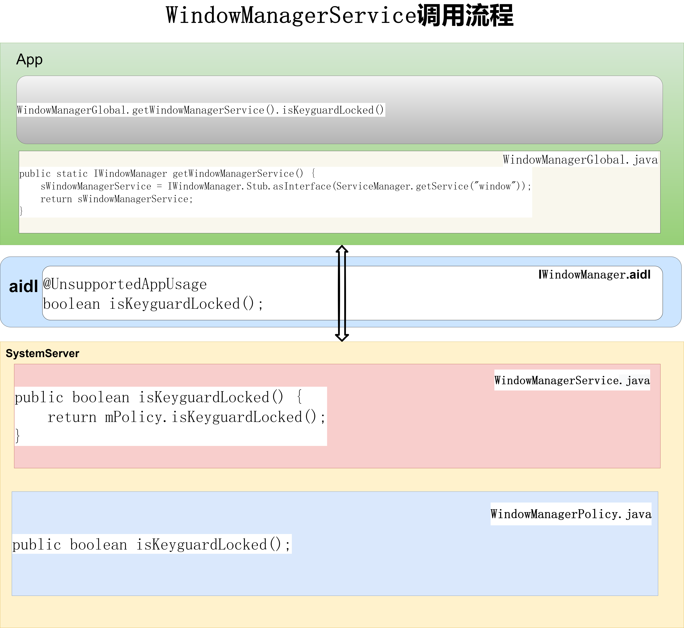
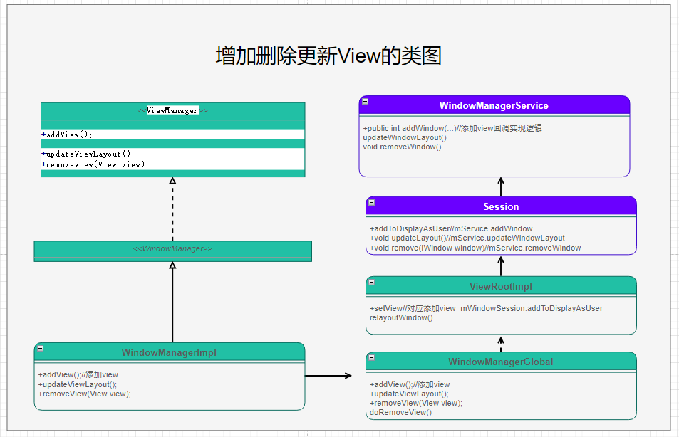

# 专题十二_系统开发之浅谈WindowManagerService


# WindowManagerService 类的作用：

wms是窗口的管理者，负责窗口的启动，添加，删除和更新，窗口动画，窗口的大小和层级，还有壁纸，水印，输入系统的中转站，Surface管理等各个方面的一个综合管理体。

# 获取wms的方式：

```java
方式1
WindowManager mWindowManager;
mWindowManager = (WindowManager) context.getSystemService(Context.WINDOW_SERVICE);


方式2
WindowManager mWindowManager;
mWindowManager = mContext.getSystemService(WindowManager.class);


方式3
IWindowManager sWindowManagerService;
sWindowManagerService = IWindowManager.Stub.asInterface(ServiceManager.getService("window"));


方式4
WindowManagerInternal mWindowManagerService;
mWindowManagerService = WindowManagerGlobal.getWindowManagerService();

方式5
WindowManagerInternal mWindowManagerService;
mWindowManagerService = LocalServices.getService(WindowManagerInternal.class);
```

# WindowManagerService调用流程



以isKeyguardLocked为例，查看WindowManagerService调用流程：

(1)app应用中调用isKeyguardLocked:

```java
WindowManagerGlobal.getWindowManagerService().isKeyguardLocked()
```

(2)获取IWindowManager服务

 WindowManagerGlobal.getWindowManagerService()

```java
public static IWindowManager getWindowManagerService() {
    synchronized (WindowManagerGlobal.class) {
        if (sWindowManagerService == null) {
            sWindowManagerService = IWindowManager.Stub.asInterface(
                    ServiceManager.getService("window"));
            try {
                if (sWindowManagerService != null) {
                    ValueAnimator.setDurationScale(
                            sWindowManagerService.getCurrentAnimatorScale());
                    sUseBLASTAdapter = sWindowManagerService.useBLAST();
                }
            } catch (RemoteException e) {
                throw e.rethrowFromSystemServer();
            }
        }
        return sWindowManagerService;
    }
}
```

(3)IWindowManager.aidl定义isKeyguardLocked

```java
@UnsupportedAppUsage
boolean isKeyguardLocked();
```

(4)WindowManagerService.isKeyguardLocked

```java
public boolean isKeyguardLocked() {
    return mPolicy.isKeyguardLocked();
}
```

(5)WindowManagerPolicy.isKeyguardLocked

```java
public boolean isKeyguardLocked();
```

# WindowManagerService添加view的详细分析

参考：

[android开发浅谈之Window和WindowManager](https://blog.csdn.net/hfreeman2008/article/details/111882109)

https://blog.csdn.net/hfreeman2008/article/details/111882109


[android开发浅谈之DecorView与ViewRootImpl](https://blog.csdn.net/hfreeman2008/article/details/111913489)

https://blog.csdn.net/hfreeman2008/article/details/111913489


[android开发浅谈之View测量流程(Measure)](https://blog.csdn.net/hfreeman2008/article/details/111996784)

https://blog.csdn.net/hfreeman2008/article/details/111996784


# 以addView()接口为例，看一下其调用流程

图二 增加删除更新View的类图

(1)在app应用中调用WindowManager.addView()接口：

```java
WindowManager mWm = context.getSystemService(WindowManager.class);
mWm.addView(mContentContainer, params);
mWm.updateViewLayout(mContentContainer, params);
mWm.removeView(mContentContainer);
```

(2)其对应WindowManager.addView：

frameworks/base/core/java/android/view/WindowManagerImpl.java

```java
@Override
public void addView(@NonNull View view, @NonNull ViewGroup.LayoutParams params) {
    applyTokens(params);
    mGlobal.addView(view, params, mContext.getDisplayNoVerify(), mParentWindow,
            mContext.getUserId());
}

@Override
public void updateViewLayout(@NonNull View view, @NonNull ViewGroup.LayoutParams params) {
    applyTokens(params);
    mGlobal.updateViewLayout(view, params);
}

@Override
public void removeView(View view) {
    mGlobal.removeView(view, false);
}
```

(3)其对应WindowManagerGlobal.java中定义接口：

frameworks/base/core/java/android/view/WindowManagerGlobal.java

```java
public void addView(View view, ViewGroup.LayoutParams params,
        Display display, Window parentWindow, int userId) {
    ......
    ViewRootImpl root;
    View panelParentView = null;
        ......
        if (windowlessSession == null) {
            root = new ViewRootImpl(view.getContext(), display);
        } else {
            root = new ViewRootImpl(view.getContext(), display,
                    windowlessSession);
        }
        view.setLayoutParams(wparams);
        mViews.add(view);//add view
        mRoots.add(root);
        mParams.add(wparams);
        //添加view的实现逻辑
        root.setView(view, wparams, panelParentView, userId);
    ......
}

public void updateViewLayout(View view, ViewGroup.LayoutParams params) {
     ......
    final WindowManager.LayoutParams wparams = (WindowManager.LayoutParams)params;
    view.setLayoutParams(wparams);
    synchronized (mLock) {
        int index = findViewLocked(view, true);
        ViewRootImpl root = mRoots.get(index);
        mParams.remove(index);
        mParams.add(index, wparams);
        root.setLayoutParams(wparams, false);
    }
}

public void removeView(View view, boolean immediate) {
    ......
    synchronized (mLock) {
        int index = findViewLocked(view, true);
        View curView = mRoots.get(index).getView();
        removeViewLocked(index, immediate);
        if (curView == view) {
            return;
        }
    ......
}
```

(3)Session.addToDisplayAsUser调用wms的addWindow方法

```java
 WindowManagerService mService;
 
public int addToDisplayAsUser(IWindow window, WindowManager.LayoutParams attrs,
        int viewVisibility, int displayId, int userId, InsetsVisibilities requestedVisibilities,
        InputChannel outInputChannel, InsetsState outInsetsState,
        InsetsSourceControl[] outActiveControls) {
            //调用wms的addWindow方法
    return mService.addWindow(this, window, attrs, viewVisibility, displayId, userId,
            requestedVisibilities, outInputChannel, outInsetsState, outActiveControls);
}

```

(4)WindowManagerService.addWindow

```java
public int addWindow(
......一个特别长的方法
}
```

# WindowManagerService类图


```java

```


```java

```

```java

```


```java

```


```java

```

```java

```


# 结束语


